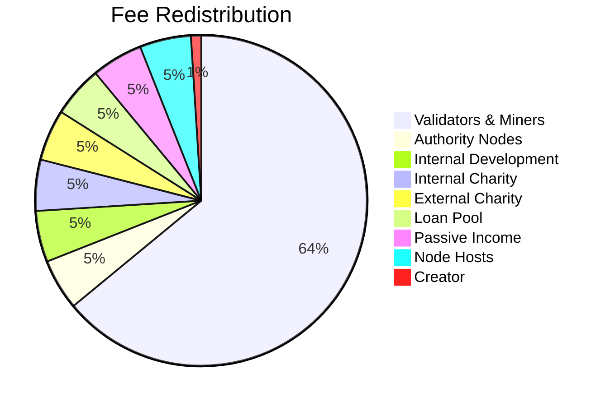

# Synnergy Network Whitepaper

This consolidated whitepaper combines the detailed chapters from the `docs/Whitepaper_detailed` directory into a single reference.

## Table of Contents
- [Executive Summary](#executive-summary)
- [Synnergy Network overview](#synnergy-network-overview)
- [Technical Architecture](#technical-architecture)
- [Advanced Consensus](#advanced-consensus)
- [Ai](#ai)
- [Authority Nodes](#authority-nodes)
- [Banks](#banks)
- [Block and subblocks](#block-and-subblocks)
- [Block rewards dispersions and halving](#block-rewards-dispersions-and-halving)
- [Blockchain Fees & Gas](#blockchain-fees-gas)
- [Blockchain Logic](#blockchain-logic)
- [Central banks](#central-banks)
- [Charity](#charity)
- [Community needs](#community-needs)
- [Connecting to other blockchains](#connecting-to-other-blockchains)
- [Consensus](#consensus)
- [Contracts](#contracts)
- [Creditors](#creditors)
- [Cross chain](#cross-chain)
- [Exchanges](#exchanges)
- [Faucet](#faucet)
- [Fault tolerance](#fault-tolerance)
- [GUIs](#guis)
- [Governance](#governance)
- [High availability](#high-availability)
- [How apply for a grant or loan from loanpool](#how-apply-for-a-grant-or-loan-from-loanpool)
- [How to apply to charity pool](#how-to-apply-to-charity-pool)
- [How to be secure](#how-to-be-secure)
- [How to become an authority node](#how-to-become-an-authority-node)
- [How to connect to a node](#how-to-connect-to-a-node)
- [How to create a node](#how-to-create-a-node)
- [How to create our various tokens](#how-to-create-our-various-tokens)
- [How to deploy a contract](#how-to-deploy-a-contract)
- [How to disperse a loanpool grant as an authority node](#how-to-disperse-a-loanpool-grant-as-an-authority-node)
- [How to get a syn900 id token](#how-to-get-a-syn900-id-token)
- [How to setup faucet](#how-to-setup-faucet)
- [How to setup the blockchain](#how-to-setup-the-blockchain)
- [How to use the CLI](#how-to-use-the-cli)
- [How to use the Synnergy Network Consensus](#how-to-use-the-synnergy-network-consensus)
- [How to vote for authority node](#how-to-vote-for-authority-node)
- [How to write a contract](#how-to-write-a-contract)
- [Ledger replication and distribution](#ledger-replication-and-distribution)
- [Ledger](#ledger)
- [Loanpool](#loanpool)
- [Maintenance](#maintenance)
- [Mathematical Algorithms](#mathematical-algorithms)
- [Network](#network)
- [Nodes](#nodes)
- [Opcodes and gas](#opcodes-and-gas)
- [Reversing and cancelling transactions](#reversing-and-cancelling-transactions)
- [Roadmap](#roadmap)
- [Security Operations Center](#security-operations-center)
- [Storage](#storage)
- [Tokenomics](#tokenomics)
- [Tokens](#tokens)
- [Transaction fee distribution](#transaction-fee-distribution)
- [Understanding the ledger](#understanding-the-ledger)
- [Use Cases](#use-cases)
- [Virtual Machine](#virtual-machine)
- [Wallet](#wallet)
- [compliance and audit system](#compliance-and-audit-system)
- [README](#readme)
- [ai architecture](#ai-architecture)
- [ai marketplace architecture](#ai-marketplace-architecture)
- [compliance architecture](#compliance-architecture)
- [consensus architecture](#consensus-architecture)
- [cross chain architecture](#cross-chain-architecture)
- [dao explorer architecture](#dao-explorer-architecture)
- [docker architecture](#docker-architecture)
- [explorer architecture](#explorer-architecture)
- [governance architecture](#governance-architecture)
- [identity access architecture](#identity-access-architecture)
- [kubernetes architecture](#kubernetes-architecture)
- [loanpool architecture](#loanpool-architecture)
- [module cli list](#module-cli-list)
- [monitoring logging architecture](#monitoring-logging-architecture)
- [nft marketplace architecture](#nft-marketplace-architecture)
- [node operations dashboard architecture](#node-operations-dashboard-architecture)
- [node roles architecture](#node-roles-architecture)
- [security architecture](#security-architecture)
- [smart contract marketplace architecture](#smart-contract-marketplace-architecture)
- [specialized architecture](#specialized-architecture)
- [storage architecture](#storage-architecture)
- [tokens transactions architecture](#tokens-transactions-architecture)
- [virtual machine architecture](#virtual-machine-architecture)
- [wallet architecture](#wallet-architecture)
- [charity guide](#charity-guide)
- [cli guide](#cli-guide)
- [config guide](#config-guide)
- [consensus guide](#consensus-guide)
- [developer guide](#developer-guide)
- [loanpool guide](#loanpool-guide)
- [module guide](#module-guide)
- [node guide](#node-guide)
- [opcode and gas guide](#opcode-and-gas-guide)
- [script guide](#script-guide)
- [server setup guide](#server-setup-guide)
- [smart contract guide](#smart-contract-guide)
- [synnergy network function web](#synnergy-network-function-web)
- [synnergy set up](#synnergy-set-up)
- [token guide](#token-guide)
- [transaction guide](#transaction-guide)
- [virtual machine guide](#virtual-machine-guide)

## Executive Summary

# Executive Summary

*Prepared by Blackridge Group Ltd.*

## Vision
Blackridge Group Ltd. delivers Synnergy, an enterprise blockchain framework engineered to bridge traditional finance with decentralised innovation. Our mission is to provide a secure, interoperable and intelligent infrastructure that enables organisations to deploy production‑ready distributed networks with confidence and agility.

## Platform Overview
Synnergy is a modular, high‑performance blockchain written in Go. It offers pluggable node roles, AI‑assisted tooling and cross‑chain interoperability so ecosystems can prototype, pilot and operate on a single unified codebase. Beyond the core ledger, the repository ships dedicated modules for content distribution, environmental and geospatial monitoring, regulatory oversight and zero‑trust communication, allowing enterprises to tailor deployments to domain‑specific requirements.

## Core Capabilities
- **Hybrid consensus engine** blending proof‑of‑work, proof‑of‑stake and proof‑of‑history with runtime weight adjustment for optimal performance and security.
- **Cross‑chain transactions** supporting asset lock‑mint and burn‑release operations managed by robust bridge registries and connection managers.
- **AI‑powered services** including fraud prediction, fee optimisation, volume forecasting and a model marketplace with escrow settlement.
- **Deterministic virtual machine** with sandbox management and upgradeable opcode registry to isolate untrusted workloads while maintaining forward compatibility.
- **Privacy‑preserving transactions** leverage shielded channels and zero‑knowledge proofs for confidential settlement.
- **Data distribution and content services** provide policy‑driven replication, caching and fine‑grained access control across the network.
- **Role‑based security and compliance** featuring biometric authentication, zero‑trust data channels, PKI tooling and rich audit logs.
- **Governance and token economy** anchored by the capped Synthron (SYN) coin, deterministic reward halving and customisable token classes.
- **Infrastructure‑as‑code and automation** through Docker, Helm, Terraform and Ansible templates for repeatable deployments.
- **Dynamic consensus hopping** adjusts PoW/PoS/PoH weighting in response to live throughput, latency and validator counts.
- **Operational sustainability** via high‑availability failover managers and energy‑efficiency trackers that monitor validator heartbeats and transactions per kilowatt hour.
- **Identity and regulatory tooling** providing on‑chain KYC registration, transaction evaluation against jurisdictional rules and automated flagging.

## Node Ecosystem
Synnergy exposes a diverse set of specialised node implementations to satisfy complex enterprise workloads:
- **Content nodes** maintain catalogues of distributed digital assets for discovery and retrieval.
- **Environmental monitoring nodes** evaluate real‑time sensor data against programmable thresholds.
- **Geospatial nodes** record location streams for asset tracking and compliance reporting.
- **Regulatory nodes** enforce jurisdictional policies and log flagged entities.
- **Watchtower nodes** observe system health, firewall events and fork conditions.
- **Warfare and authority nodes** simulate adversarial scenarios and coordinate governance processes.
- **Mining and staking nodes** secure the ledger through PoW and PoS while managing reward distribution.
- **Indexing nodes** accelerate query performance and expose searchable metadata for analytics dashboards.
- **Energy‑efficient nodes** optimise participation for constrained hardware and monitor kilowatt‑hour performance.
- **Mobile mining nodes** allow lightweight devices to contribute hash power and validate transactions on the go.
- **Biometric security nodes** anchor hardware‑backed identity at the network edge.
All node constructors expose dedicated CLI modules and telemetry hooks for fine‑grained control and monitoring.

## Enterprise Analytics & Data Services
Synnergy embeds a comprehensive analytics layer to drive informed decision‑making:
- **AI services** supply fraud‑scoring, base‑fee optimisation, volume forecasting and a model marketplace with escrow‑backed transactions.
- **Financial prediction tools** implement moving‑average, linear‑regression and autoregressive models for long‑range price forecasting.
- **Data operations and caching layers** manage high‑throughput ingestion, transformation and retrieval pipelines.
- **Data resource managers** and distribution engines track content usage, orchestrate data replication and enable granular policy enforcement across nodes.
- **Anomaly detection and drift monitoring** modules flag deviations in on‑chain activity and AI model performance.
- **Secure AI storage and model management** maintain encrypted artefacts, version histories and reproducible training workflows.

## Architecture Highlights
- **Node versatility:** specialised constructors enable mining, staking, authority, regulatory, watchtower, warfare and other roles, each exposing dedicated CLI modules and monitoring hooks.
- **Extensible CLI and SDK:** a Cobra‑based command suite and Go libraries cover networking, wallets, contracts, data operations and system health.
- **Observability and resilience:** OpenTelemetry tracing, structured logging and high‑availability scripts provide real‑time insight and automated failover across clusters.
- **Sandboxed virtual machine:** upgradeable opcode registries and VM sandbox management isolate contracts and allow deterministic execution.
- **Cross‑chain bridge connectors:** dedicated bridge, protocol and connection modules manage lock‑mint and burn‑release workflows across heterogeneous chains.

## Security & Compliance
Synnergy enforces strong cryptographic guarantees, permissioned privacy and regulatory alignment. Biometric authentication and zero‑trust data channels secure privileged actions, while the Identity Service and Regulatory Manager enable on‑ledger KYC, transaction screening and automated flagging. Layered defenses such as firewalls, anomaly detectors, private transactions and stake penalties integrate with audit trails and watchtower nodes for continuous threat monitoring.

## Tokenomics & Governance
The Synthron coin underpins network consensus, fee markets and governance. Its 500 million maximum supply and scheduled halving events balance early participation with long‑term scarcity, while DAO tooling, staking pools and validator registries enable transparent on‑chain decision‑making. Community distribution mechanisms such as faucets, grant pools and charity escrows support ecosystem growth. Custom token classes and contract templates further allow ecosystems to launch application‑specific assets that inherit the network’s security and compliance guarantees.

## Deployment & Tooling
Comprehensive tooling accelerates adoption:
- **CLI modules** for network management, contract lifecycle, mining, staking and authority operations.
- **GUI front‑ends** for explorers, marketplaces, dashboards and compliance consoles.
- **Ansible playbooks** and **Terraform templates** for reproducible infrastructure on bare metal and cloud platforms.
- **Helm charts** and **Docker images** streamline containerised deployments and orchestration.
 - **Testing and CI** suites spanning unit, integration, fuzz and formal verification harnesses to assure code integrity and upgrade safety.
 - **Automation scripts** wrap cross‑chain bridge, data distribution and authority workflows for repeatable operations.

## Roadmap
Synnergy follows a staged development roadmap encompassing over one hundred modules, tracked in the AGENTS index. Completed milestones span GUI dashboards, cross‑chain bridge tooling, data‑distribution services and compliance consoles, while forthcoming stages expand mining and staking managers, AI marketplaces, analytics suites and governance portals. The incremental approach ensures each component is hardened with documentation, tests and deployment scripts before graduation to production.

## Conclusion
Blackridge Group Ltd.'s Synnergy Network combines adaptive consensus, intelligent services and rigorous security to deliver a next‑generation blockchain ecosystem. Through a cohesive suite of tools, specialised node roles and infrastructure automation, Synnergy empowers enterprises and communities to unlock new digital economies with confidence while maintaining auditability, sustainability and regulatory trust.

## Synnergy Network overview

# Synnergy Network Overview

## Introduction
Blackridge Group Ltd. presents the **Synnergy Network**, an extensible blockchain platform engineered for real‑world scale and institutional trust. The network combines advanced consensus, rigorous governance, and modular services to deliver a secure, interoperable ledger for enterprises, regulators and developers.

## Architectural Principles
- **Modular core:** Every capability is encapsulated in dedicated Go packages, allowing components to evolve independently while sharing common cryptographic primitives.
- **Deterministic virtual machine:** A sandboxed execution environment (`virtual_machine.go` and `vm_sandbox_management.go`) isolates smart‑contract workloads and enforces gas and memory limits.
- **Layered ledger design:** The ledger replicates across diverse node types, providing failover and high availability through modules such as `high_availability.go` and `system_health_logging.go`.
- **Adaptive consensus:** Runtime metrics drive a consensus hopper that can switch between PoW, PoS and PoH to balance throughput and security (`dynamic_consensus_hopping.go`).
- **Deterministic pricing:** Opcode registries and a shared gas table keep execution costs predictable across releases (`snvm._opcodes.go`, `gas_table.go`).

## Node Ecosystem
Synnergy supports specialised nodes that together maintain network health and regulatory compliance:
- **Authority and validator nodes** secure consensus and manage staking (`staking_node.go`).
- **Watchtower nodes** monitor chain state and report forks while applying firewall rules (`watchtower_node.go`, `firewall.go`).
- **Regulatory nodes** evaluate transactions against jurisdictional policies and flag suspicious behaviour (`regulatory_node.go`).
- **Environmental and energy‑efficient nodes** track sensor data and certify sustainable operation (`environmental_monitoring_node.go`, `energy_efficient_node.go`).
- **Biometric security nodes** bind privileged actions to biometric authentication (`biometric_security_node.go`).
- **Geospatial nodes** attach location intelligence to on‑chain activity (`geospatial_node.go`).
- **Warfare and mobile mining nodes** extend the network to defence and low‑power environments (`warfare_node.go`, `mobile_mining_node.go`).
- **Indexing nodes** surface analytic views of the ledger for external services (`indexing_node.go`).

## Operational Resilience and Monitoring
- **Failover management** promotes backup nodes when primaries miss heartbeats, sustaining availability (`high_availability.go`).
- **System health logging** captures runtime metrics for dashboards and alerting (`system_health_logging.go`).
- **Anomaly detection** and **drift monitoring** flag statistical outliers and model degradation before they impact consensus (`anomaly_detection.go`, `ai_drift_monitor.go`).
- **Dynamic consensus hopping** adjusts algorithm choice based on transaction load and validator participation (`dynamic_consensus_hopping.go`).

## Smart Contract Platform
- **WASM execution** enables portable contracts with built‑in sandbox controls and resettable execution contexts (`vm_sandbox_management.go`).
- **AI‑enhanced contracts** integrate model hashes and inference calls through `ai_enhanced_contract.go`, enabling on‑chain machine learning workflows.
- **Holographic data** utilities distribute contract or data shards for redundancy (`holographic.go`).
- **Sandbox orchestration** resets and retires isolated execution contexts to contain runaway contracts (`vm_sandbox_management.go`).
- **Gas schedule and opcode registry** provide transparent, updatable cost metrics for every VM operation (`gas_table.go`, `snvm._opcodes.go`).
- **Contract language compatibility layer** permits multiple smart‑contract languages to target the VM (`contract_language_compatibility.go`).

## AI & Analytics Suite
- **Model marketplace** lists, prices and trades machine‑learning models on‑chain (`ai_model_management.go`).
- **Training manager** orchestrates dataset and model hashes for reproducible training jobs (`ai_training.go`).
- **Inference engine** evaluates transactions and exposes deterministic fraud scores (`ai_inference_analysis.go`).
- **Secure model storage** encrypts and retrieves model artefacts with AES‑GCM (`ai_secure_storage.go`).
- **Anomaly and drift detectors** provide streaming analytics to maintain model quality (`anomaly_detection.go`, `ai_drift_monitor.go`).

## Cross‑Chain Interoperability
- **Bridge and connection managers** configure authenticated relayers and manage lifecycle of inter‑chain links (`cross_chain.go`, `cross_chain_connection.go`).
- **Contract and transaction handlers** standardise messaging across heterogeneous chains (`cross_chain_contracts.go`, `cross_chain_transactions.go`).
- **Protocol registry** documents agnostic standards that different chains can adopt (`cross_chain_agnostic_protocols.go`).
- **Bridge transfer manager** tracks lock‑and‑claim operations for assets moving between networks (`cross_chain_bridge.go`).

## Security and Trust Framework
- **Zero‑trust data channels** provide end‑to‑end encrypted communication backed by digital signatures (`zero_trust_data_channels.go`).
- **Compliance manager** suspends or whitelists addresses before transactions execute (`compliance_management.go`).
- **Firewall services** blacklist malicious wallets, tokens or IP addresses (`firewall.go`).
- **Role‑based access control** gates privileged operations behind granular roles (`access_control.go`).
- **Biometric authentication** verifies critical actions using enrolled biometric templates (`biometrics_auth.go`).
- **Private transaction manager** encrypts payloads so only authorised parties can inspect contents (`private_transactions.go`).

## Identity, Compliance and Governance
- **Identity service** registers verified participants and records authentication events (`identity_verification.go`).
- **Regulatory oversight** uses policy engines to approve or reject transactions (`regulatory_node.go`).
- **Stake and slashing logic** enforce economic accountability for validators (`staking_node.go`, `stake_penalty.go`).
- **ID wallet registry** records wallets that hold identity credentials for audit trails (`idwallet_registration.go`).
- **Regulatory manager** encodes jurisdictional limits and evaluates transactions for rule violations (`regulatory_management.go`).
- **Role‑based access control** assigns and audits organisational permissions (`access_control.go`).

## Data Management and Storage
- **Distributed content nodes** and data operations modules handle structured and unstructured payloads (`content_node.go`, `data_operations.go`, `data_distribution.go`).
- **Ledger replication** and indexing nodes accelerate query performance and analytics (`ledger.go`, `indexing_node.go`).
- **Geospatial and environmental feeds** ingest sensor data for location‑aware and sustainability‑driven applications (`geospatial_node.go`, `environmental_monitoring_node.go`).
- **Encrypted AI model vault** stores machine‑learning artefacts with symmetric encryption (`ai_secure_storage.go`).

## Energy Efficiency & Sustainability
- **Energy trackers** compute transactions per kilowatt hour and issue sustainability certificates (`energy_efficiency.go`, `energy_efficient_node.go`).
- **Carbon offset accounting** integrates directly with node metrics to promote green operation.
- **Environmental monitoring node** triggers actions when sensor thresholds are met (`environmental_monitoring_node.go`).
- **Mobile mining node** throttles work based on battery levels to conserve power (`mobile_mining_node.go`).

## Developer Experience
- **Command‑line interfaces and APIs** expose management operations for nodes, contracts, tokens and cross‑chain functions.
- **Wallet server and GUIs** provide user‑friendly access for transactions and governance (`walletserver/` and `GUI/`).
- **Extensive test suites** covering consensus, security and data modules ensure reliability across releases.
- **Deterministic gas tooling** and opcode registries keep cost estimation stable for developers (`gas_table.go`, `snvm._opcodes.go`).
- **Integration tests and harnesses** validate cross‑module workflows (`tests/e2e/network_harness_test.go`).

## Conclusion
The Synnergy Network reflects Blackridge Group Ltd.'s commitment to a secure, compliant and environmentally conscious blockchain ecosystem. Its modular architecture, comprehensive node framework and advanced security features position it as a foundation for financial systems, supply chains and emerging decentralised applications.

## Technical Architecture

# Technical Architecture

## Overview
Blackridge Group Ltd.'s Synnergy Network is built as a modular blockchain platform combining flexible consensus, a programmable virtual machine, AI-enhanced smart contracts, cross-chain interoperability, and rigorous security. This document details the architectural layers and core components underlying the system.

## Layered System Design
### Network and Consensus Layer
The network utilises a dynamic hybrid consensus engine that balances proof‑of‑work, proof‑of‑stake and proof‑of‑history through configurable weightings. Parameters such as Alpha, Beta and Gamma govern thresholds while availability flags allow algorithms to be toggled without code changes【F:core/consensus.go†L11-L52】. A smoothing routine normalises weights and clamps them above a minimum floor to maintain liveness under changing demand or stake concentrations【F:core/consensus.go†L55-L88】. To complement this weighting system, a ConsensusHopper observes live throughput, latency and validator counts and seamlessly switches between proof modes when thresholds are met【F:dynamic_consensus_hopping.go†L5-L29】【F:dynamic_consensus_hopping.go†L57-L70】.

### Cross‑Chain Interoperability
A dedicated CrossChainManager registers bridges between external networks, tracks authorised relayers and exposes APIs for listing or retrieving bridge configurations【F:cross_chain.go†L10-L48】. Global relayer whitelists can be updated atomically, enabling or revoking access across all bridges in one operation【F:cross_chain.go†L70-L90】.
Bridge operations are tracked through a BridgeTransferManager that locks assets and records claims so deposits and releases remain auditable across networks【F:cross_chain_bridge.go†L10-L48】【F:cross_chain_bridge.go†L52-L67】. A ConnectionManager maintains the lifecycle of inter-chain links, marking openings and closures with timestamps for historical tracing【F:cross_chain_connection.go†L10-L47】【F:cross_chain_connection.go†L45-L58】. For asset movements, a TransactionManager logs lock‑and‑mint or burn‑and‑release flows and exposes queries to list or retrieve transactions by identifier【F:cross_chain_transactions.go†L10-L48】【F:cross_chain_transactions.go†L50-L88】.

Protocol standards are catalogued in a chain‑agnostic registry so new cross‑network formats can be adopted without touching bridge code. Each entry receives a unique identifier and can be queried or enumerated to negotiate capabilities with external chains【F:cross_chain_agnostic_protocols.go†L10-L45】. Complementing this, a cross‑chain contract registry maps local contract addresses to their remote counterparts and supports updates or removals as integrations evolve【F:cross_chain_contracts.go†L5-L50】.

To support off‑chain scaling, a SidechainRegistry tracks side networks, their latest headers and validator sets while allowing administrators to pause, resume or update validator lists as governance demands change【F:core/sidechains.go†L8-L120】. A PlasmaBridge exposes deposit and exit routines that let users safely migrate assets between the base chain and plasma sidechains, recording exit nonces and finalisation status for auditability【F:core/plasma_operations.go†L5-L40】. For lightweight participants a LightNode retains only block headers, enabling quick verification of chain progress without maintaining a full ledger copy【F:core/light_node.go†L5-L28】.

### Virtual Machine and Smart Contracts
Synnergy ships with a lightweight SimpleVM that interprets 24‑bit opcodes and supports resource‑constrained profiles. Instances scale from heavy nodes to super‑light deployments while shared handlers and concurrency limiters enforce deterministic execution【F:virtual_machine.go†L11-L38】【F:virtual_machine.go†L49-L79】. During execution the VM slices bytecode into opcodes, meters gas per operation and halts on errors or exceeded limits【F:virtual_machine.go†L121-L178】.

Contract governance is handled by a ContractManager that can transfer ownership, pause or resume execution and upgrade deployed bytecode while preserving metadata【F:contract_management.go†L5-L70】. For AI‑driven workflows an AIContractRegistry layers model hashes over the base registry and exposes inference-specific invocation paths【F:ai_enhanced_contract.go†L8-L49】.

Sandboxed execution environments add another safety layer. The SandboxManager provisions isolated sandboxes with explicit gas and memory ceilings, supports lifecycle operations and tracks timestamps for auditing【F:vm_sandbox_management.go†L9-L51】【F:vm_sandbox_management.go†L53-L105】.

### Language Compatibility and Opcode Catalogue
The Synnergy VM accepts contracts authored in multiple languages—ranging from WASM and Golang to Solidity and Python—and verifies support through a compatibility list that can be queried by tooling or deployment scripts【F:contract_language_compatibility.go†L5-L27】. Execution semantics are standardised by a comprehensive opcode table that maps every exposed function to a deterministic 24‑bit code, ensuring compiled contracts can invoke system utilities consistently across upgrades【F:snvm._opcodes.go†L1-L33】.

### Fee Management and Gas Tracking
To keep transaction costs predictable, Synnergy maintains a GasTable mapping opcode names to base fees and loading pricing data from reference tables at startup【F:gas_table.go†L13-L46】. The loader caches parsed values and falls back to a default cost when an opcode is missing or malformed【F:gas_table.go†L47-L75】. Utilities allow runtime registration or resetting of gas prices so administrators can surface new operations and refresh pricing without restarting nodes【F:gas_table.go†L77-L107】.

### AI Integration and Data Intelligence
Synnergy's AI stack includes a marketplace for trading models, drift detection to maintain accuracy, and encrypted storage for model assets. The ModelMarketplace registers listings and enforces ownership rules, enabling dynamic updates and removals【F:ai_model_management.go†L9-L98】. DriftMonitor tracks performance metrics against stored baselines and flags deviations beyond configurable thresholds【F:ai_drift_monitor.go†L8-L35】. Model artifacts are protected through AES‑GCM encryption using the SecureStorage service【F:ai_secure_storage.go†L12-L44】【F:ai_secure_storage.go†L47-L75】. TrainingManager orchestrates dataset‑driven jobs, tracking their lifecycle and supporting cancellation or completion of running tasks【F:ai_training.go†L10-L49】【F:ai_training.go†L71-L86】. An InferenceEngine loads model artifacts, executes deterministic runs and analyses batches of transactions for fraud scores to surface high‑risk activity【F:ai_inference_analysis.go†L9-L53】.

### Data Distribution and Storage
Content distribution is coordinated by the DataDistribution registry, which maps datasets to serving nodes and prunes entries when offerings are revoked, ensuring up‑to‑date location metadata for clients【F:data_distribution.go†L5-L72】. Applications can publish real‑time feeds via DataFeed objects that support atomic updates and snapshots for auditability【F:data_operations.go†L8-L69】. Larger binaries are managed with the DataResourceManager, which tracks byte usage and returns isolated copies to callers【F:data_resource_management.go†L5-L66】. ContentNetworkNode instances maintain per‑node catalogs of hosted assets, enabling discovery and deregistration as resources appear or retire【F:content_node.go†L5-L55】.

### Node Services and Availability
The FailoverManager tracks node heartbeats and promotes backups whenever primaries miss timeouts, delivering automatic recovery across clusters【F:high_availability.go†L8-L45】. IndexingNode instances cache ledger data in-memory for rapid retrieval through thread‑safe insert, query and delete operations【F:indexing_node.go†L5-L27】. StakingNode maintains per-address stakes and total locked value, supporting lightweight staking flows without a full ledger backend【F:staking_node.go†L5-L27】【F:staking_node.go†L39-L47】. A controlled Faucet service dispenses limited test funds, enforcing per‑address cooldowns and configurable withdrawal limits to prevent abuse【F:faucet.go†L9-L38】.

### Specialized Node Types
Beyond core validators, the network supports specialised roles. EnergyEfficientNode instances generate sustainability certificates and report efficiency and carbon offsets for green-compliance deployments【F:energy_efficient_node.go†L8-L80】. EnvironmentalMonitoringNode evaluates sensor feeds against threshold conditions to trigger on-chain actions【F:environmental_monitoring_node.go†L9-L65】. GeospatialNode retains location histories for tracked subjects【F:geospatial_node.go†L8-L46】, while MobileMiningNode throttles mining on battery-powered devices when charge drops below configured levels【F:mobile_mining_node.go†L8-L64】.

### Security and Compliance Services
A built‑in Firewall maintains block lists for wallet addresses, token identifiers and peer IPs, allowing nodes to enforce network rules with thread‑safe operations for adding, removing or enumerating restrictions【F:firewall.go†L5-L44】. IdentityService captures user metadata and verification logs, guarding registration against duplicates and recording each verification attempt for compliance audits【F:identity_verification.go†L9-L58】【F:identity_verification.go†L60-L75】. A RegulatoryManager catalogs jurisdictional rules and checks transactions against maximum allowed amounts, returning any policy identifiers that are breached【F:regulatory_management.go†L8-L25】【F:regulatory_management.go†L27-L74】. Role-based authorization is enforced through an AccessController that grants or revokes roles per address and exposes queries for permission checks【F:access_control.go†L5-L47】【F:access_control.go†L50-L62】. The ComplianceManager tracks suspensions and whitelists and reviews transactions against these policies before propagation【F:compliance_management.go†L15-L104】. Validators are subject to the StakePenaltyManager, which adjusts stake balances and records penalty history for misbehavior【F:stake_penalty.go†L8-L61】. RegulatoryNode deployments work alongside the manager to approve or flag transactions, logging rule violations per address for audit trails【F:regulatory_node.go†L8-L43】. For high-assurance operations, a BiometricSecurityNode couples nodes with template-based verification, gating sensitive functions behind enrolled biometric signatures【F:biometric_security_node.go†L1-L37】【F:biometrics_auth.go†L9-L45】.
Supplementary hardening modules underpin these services. An Encryptor and KeyManager provide basic key rotation primitives for symmetric encryption【F:internal/security/encryption.go†L4-L19】【F:internal/security/key_management.go†L5-L22】, while a SecretsManager stores sensitive configuration values in memory and now validates key usage via a simple CLI【F:internal/security/secrets_manager.go†L3-L39】. A PatchManager records applied updates for audit purposes【F:internal/security/patch_manager.go†L3-L15】. RateLimiter and DDoSMitigator components throttle requests and block abusive peers to protect network resources【F:internal/security/rate_limiter.go†L5-L18】【F:internal/security/ddos_mitigation.go†L3-L15】.

### Privacy and Zero‑Trust Channels
The PrivateTxManager pools encrypted payloads using AES‑GCM and provides retrieval only to authorised parties【F:private_transactions.go†L11-L46】【F:private_transactions.go†L55-L74】. For escrowed communications the ZeroTrustEngine opens channels with ephemeral Ed25519 keys, signs ciphertext and verifies signatures before decryption【F:zero_trust_data_channels.go†L24-L47】【F:zero_trust_data_channels.go†L50-L66】【F:zero_trust_data_channels.go†L82-L101】.

### Observability and Operational Insight
WatchtowerNode instances monitor the network, gathering system health metrics and reporting forks via dedicated logging routines【F:watchtower_node.go†L13-L52】. Metrics are sourced from a SystemHealthLogger that samples runtime statistics and exposes snapshots for dashboards or automation【F:system_health_logging.go†L11-L41】. An EnergyEfficiencyTracker logs per-validator throughput and electricity consumption to calculate transactions per kilowatt hour and network averages【F:energy_efficiency.go†L5-L58】.

### Analytics and Predictive Services
An AnomalyDetector streams metrics and applies a z‑score threshold to surface outliers in real time, updating running mean and variance for each observation【F:anomaly_detection.go†L8-L49】. For forward‑looking insights, the financial forecasting library offers moving‑average, linear‑regression and autoregressive models to project asset prices across multiple months【F:financial_prediction.go†L7-L107】.

### Transaction and Wallet Foundations
Core transaction objects capture sender and recipient addresses, amounts, fees and nonces while optionally embedding bytecode programs and biometric hashes to tie payments to verified identities【F:core/transaction.go†L12-L35】【F:core/transaction.go†L56-L95】. Wallets generate ECDSA key pairs, derive deterministic addresses and can sign, verify or securely persist private keys using scrypt‑derived AES‑GCM encryption【F:core/wallet.go†L19-L56】【F:core/wallet.go†L71-L150】. Genesis wallet allocations seed ecosystem funds and a helper routine distributes fees across internal development, charity and validator pools at network genesis【F:core/genesis_wallets.go†L8-L58】.

### Client and Wallet Services
A lightweight wallet service exposes HTTP endpoints for health checks and deterministic wallet creation, enabling external platforms to provision addresses programmatically. The server wires request handlers and logs events for operational visibility【F:walletserver/handlers.go†L5-L29】【F:walletserver/main.go†L9-L18】.

### Deployment and Infrastructure
Blackridge Group Ltd. distributes official container images through a multistage Docker build that packages both the node and wallet server binaries【F:docker/Dockerfile†L3-L25】. Production clusters can be orchestrated with the provided Kubernetes deployment manifest, which defines resource limits, health probes and service exposure for Synnergy nodes【F:deploy/k8s/node.yaml†L1-L71】. For cloud environments, Terraform modules provision VPC networking, security groups and an autoscaling group to roll out fault-tolerant nodes across availability zones【F:deploy/terraform/main.tf†L1-L104】.

## Conclusion
Through this layered architecture, Blackridge Group Ltd. delivers a resilient, extensible and secure foundation for decentralised applications. The Synnergy Network integrates adaptive consensus, a programmable execution environment, AI-aware contracts and comprehensive governance tooling to support both enterprise and community deployments.

## Advanced Consensus

# Advanced Consensus

## Overview of the Blackridge Hybrid Model
Blackridge Group Ltd.'s Synnergy Network employs a hybrid consensus engine that blends proof-of-work (PoW), proof-of-stake (PoS), and proof-of-history (PoH). Each mechanism carries a configurable weight, enabling responsive rebalancing as conditions shift. The engine boots with a 40/30/30 distribution and surfaces tunable coefficients \(Alpha, Beta, Gamma, Dmax, Smax\) alongside availability and reward toggles so operators can throttle or suspend mechanisms without code changes【F:core/consensus.go†L11-L52】【F:core/consensus.go†L130-L142】. The threshold function combines demand and stake concentration to guide these adjustments【F:core/consensus.go†L55-L59】.

## Configurable Parameters and Threshold Calculus
`NewSynnergyConsensus` seeds the engine with explicit coefficients—Alpha and Beta weight demand and stake in the threshold equation, Gamma governs smoothing, and Dmax/Smax normalise input ranges【F:core/consensus.go†L22-L52】. These parameters underpin the `Threshold` and `AdjustWeights` routines, enabling deterministic recalculation as network metrics evolve【F:core/consensus.go†L55-L89】. Administrators can therefore fine‑tune responsiveness, trading stability against agility while maintaining predictable behaviour.

## Genesis Bootstrapping and Initial Weights
Genesis creation credits the founder wallet with the initial five‑million Synthron allocation and mines the first block before any live traffic is processed, establishing the ledger and circulating supply【F:core/genesis_block.go†L19-L40】【F:core/coin.go†L6-L16】. `InitGenesis` snapshots the starting consensus weights so early participants can audit the launch state, all derived from `NewSynnergyConsensus` and its default 40/30/30 profile【F:core/consensus.go†L38-L52】.

## Reward and Availability Controls
`SetAvailability` and `SetPoWRewards` permit runtime enabling or disabling of specific algorithms and their incentives. This allows Blackridge operators to retire a consensus path once rewards are exhausted or maintenance is required, without altering other weightings【F:core/consensus.go†L130-L142】.

## Adaptive Weighting and Thresholds
The consensus engine recalculates weights as the network evolves. `AdjustWeights` applies a gamma‑scaled smoothing term and clamps values to a 7.5 per cent floor via a helper to prevent starvation, after which remaining weights are renormalised【F:core/consensus.go†L61-L89】【F:core/consensus.go†L209-L218】. Transition logic decomposes demand, security threats and stake concentration into `Tload`, `Tsecurity` and `Tstake`, recombining them into a single `TransitionThreshold` that drives reconfiguration decisions【F:core/consensus.go†L91-L119】. An `AdaptiveManager` wraps these calculations in mutexes for safe concurrent access【F:core/consensus_adaptive_management.go†L5-L47】.

## Dynamic Consensus Hopping
To avoid single‑mechanism bottlenecks, the `ConsensusHopper` samples `NetworkMetrics`—transactions per second, latency and active validator count—and uses them to jump between modes【F:dynamic_consensus_hopping.go†L17-L70】. Throughput above 1,000 TPS with sub‑second latency biases selection toward PoS, fewer than ten validators prioritises PoH, and all other states fall back to PoW. Operators can override or query behaviour through `SetMode`, `Mode` and `LastMetrics`, all guarded by a read–write mutex so external callers observe consistent state without race conditions【F:dynamic_consensus_hopping.go†L36-L55】.

## Mode Switching and Specialised Nodes
The `ConsensusSwitcher` collates weights into a map and selects the highest value, continuously tracking the dominant mode for general‑purpose nodes【F:core/consensus_specific.go†L15-L45】. It exposes the last evaluated mode via `Mode`, enabling external components to poll the current selection without recomputation【F:core/consensus_specific.go†L48-L50】. For infrastructure that must operate under a single algorithm, `ConsensusSpecificNode` invokes `configure` to toggle availability flags and replace weights with an exclusive value, yielding specialised PoW, PoS or PoH nodes for targeted environments【F:core/consensus_specific_node.go†L3-L31】.

## Validator Governance, Stake Economics and Quorum
`ValidatorNode` bundles a base node with `ValidatorManager` and `QuorumTracker` so governance logic remains centralised【F:core/validator_node.go†L5-L47】. Nodes can `AddValidator`, `RemoveValidator` or `SlashValidator` through thin wrappers that update both the stake map and quorum counters【F:core/validator_node.go†L19-L44】. `ValidatorManager` enforces minimum stake, deletes entrants who fall short and exposes `Eligible` and `Stake` accessors for external audits【F:core/consensus_validator_management.go†L28-L84】. `QuorumTracker` records join and leave events, counting participants and signalling when the threshold for ratification is met【F:core/quorum_tracker.go†L5-L47】. Economic parameters for minimum stake and lock‑up duration can be derived using helper functions that reference transaction volume, reward rate and volatility【F:core/coin.go†L63-L80】.

## Stake Penalties and Slashing
Beyond automatic slashing, operators can apply explicit penalties for misbehaviour. `StakePenaltyManager` maintains stake balances, penalty tallies and an immutable history of timestamped `PenaltyRecord` entries, while `AdjustStake` lets authorities restitute or deduct collateral as needed【F:stake_penalty.go†L8-L61】. The `Info` method exposes current stake, total points and full history for auditing purposes【F:stake_penalty.go†L56-L61】. These penalties interact with the `ValidatorManager`, which halves the stake of slashed validators and excludes them from future selection【F:core/consensus_validator_management.go†L54-L63】.

## Difficulty Regulation and PoW Mining
A sliding‑window `DifficultyManager` stores recent block times and recomputes the target difficulty after each sample, delegating to the engine's `DifficultyAdjust` to keep production aligned with expectations【F:core/consensus_difficulty.go†L5-L41】【F:core/consensus.go†L121-L128】. Each invocation of `AddSample` appends the latest block duration, prunes entries beyond the configured window and averages the remainder before requesting a new difficulty target. Operators can inspect the current value through `Difficulty` and even reconfigure the manager's window, initial difficulty or target rate at runtime【F:core/consensus_difficulty.go†L16-L39】. Mining itself uses a straightforward SHA‑256 loop for leading zeros, updating the block header once a valid nonce is discovered【F:core/consensus.go†L190-L206】. Blackridge ships a dedicated CLI module that exposes these hooks so operators can feed samples and adjust parameters without touching code【F:cli/consensus_difficulty.go†L11-L67】.

## Cross-Consensus Network Scaling
Interoperability between heterogeneous chains is handled by the `ConsensusNetworkManager`, which assigns each link an auto‑incremented ID and retains configurations in a thread‑safe map. Networks can be registered, enumerated, queried or removed, returning explicit errors if an identifier is unknown and allowing Blackridge deployments to span multiple protocol families【F:core/cross_consensus_scaling_networks.go†L22-L69】.

## Operational Service Layer
The `ConsensusService` runs the mining or validation loop in a background routine. A telemetry span wraps each iteration, while an atomic flag prevents duplicate starts and a dedicated quit channel enables graceful shutdown through context cancellation or explicit stop signals【F:core/consensus_start.go†L23-L53】. `Stop` resets the flag and replaces the quit channel so services can be restarted cleanly, and `Info` exposes current height and runtime status for monitoring dashboards【F:core/consensus_start.go†L47-L61】.

## Observability and Interface Abstraction
Every consensus node can be wrapped in a `NodeAdapter`, which bridges the native `Node` to the generic `nodes.NodeInterface`. The adapter embeds a `BaseNode` keyed by the node ID, exposing uniform methods for start, stop and messaging while delegating consensus specifics to the wrapped instance【F:core/node_adapter.go†L5-L16】. This abstraction allows Blackridge's tooling—such as wallets, explorers or monitoring agents—to interact with consensus nodes without binding to internal implementations.

## Virtual Machine Opcode Integration
Synnergy's virtual machine enumerates dedicated opcodes for consensus components, allowing smart contracts to drive dynamic mode hopping, manage PoW difficulty or administer validators directly within execution flows【F:snvm._opcodes.go†L84-L88】【F:snvm._opcodes.go†L561-L568】. Contracts can invoke `dynamic_consensus_hopping_Evaluate`, call the difficulty manager or even register and slash validators through VM instructions, enabling on‑chain automation without privileged off‑chain actors.

## CLI Exposure and Runtime Tuning
The command‑line suite mirrors engine capabilities, providing subcommands to mine test blocks, inspect or adjust weights, compute thresholds, evaluate full transition heuristics, toggle availability flags or enable and disable rewards【F:cli/consensus.go†L15-L180】. Dedicated options such as `mine`, `weights`, `adjust`, `threshold`, `transition`, `difficulty`, `availability` and `powrewards` let operators exercise every consensus hook from the terminal. A companion `consensus-difficulty` module lets operators submit block‑time samples, query the latest difficulty or reinitialise the manager with new parameters【F:cli/consensus_difficulty.go†L11-L67】.

## Security and Fairness Mechanisms
Fair validator selection is achieved through a weighted random algorithm that discards sets where the largest stakeholder exceeds half of the total, preventing dominant validators from monopolising rewards【F:core/consensus.go†L144-L178】. `ValidateSubBlock` confirms that each sub‑block carries transactions and a valid signature before inclusion, ensuring only authenticated validators influence the ledger【F:core/consensus.go†L180-L188】. `WatchtowerNode` instances continuously collect system metrics, enforce firewall policies and report detected forks, providing an external check on consensus behaviour and highlighting chain splits for remediation【F:watchtower_node.go†L13-L86】. Quorum tracking further enforces fairness by ratifying decisions only when the requisite number of validators are active【F:core/quorum_tracker.go†L5-L47】.

## Summary
Through a synthesis of adaptive weighting, dynamic hopping, specialised nodes, rigorous validator governance, and cross-consensus networking, Blackridge Group Ltd. delivers a resilient and versatile consensus layer for the Synnergy Network. This design enables the platform to maintain performance and security across diverse deployment scenarios while remaining agile in the face of evolving market conditions and threat landscapes.

## Ai

# Artificial Intelligence

## Strategic Vision
Blackridge Group Ltd. embeds artificial intelligence at the core of the Synnergy Network to deliver predictive insight, autonomous optimisation and a self‑service model economy. The AI stack operates within a privacy‑preserving, decentralised environment while satisfying enterprise governance requirements.

## AI Service Layer
The `AIService` orchestrates prediction utilities and model commerce through concurrency‑safe registries backed by read‑write mutexes【F:ai.go†L32-L38】.
- **PredictFraud** ingests transaction payloads and derives a deterministic fraud probability by hashing the JSON bytes【F:ai.go†L50-L58】.
- **OptimiseBaseFee** reviews average gas prices to recommend the next block’s base fee【F:ai.go†L60-L67】.
- **ForecastVolume** scales recent transaction counts to project near‑term network activity【F:ai.go†L70-L77】.
Model metadata captures royalty percentages and publish timestamps so creators are compensated whenever analytics are invoked【F:ai.go†L13-L19】【F:ai.go†L80-L92】.

## Model Marketplace and Escrow
Enterprise participants monetise models through the `ModelMarketplace`, which tracks listings, owners and dynamic pricing with thread‑safe maps【F:ai_model_management.go†L19-L24】【F:ai_model_management.go†L31-L45】. Listings can be enumerated, updated or removed by the seller to reflect evolving commercial terms【F:ai_model_management.go†L56-L98】. Purchases deposit funds into an escrow ledger, while rentals set an expiry window before releasing payment; escrows are cleared atomically once the seller claims funds【F:ai.go†L108-L151】【F:ai.go†L153-L164】.

## Training Lifecycle Orchestration
The `TrainingManager` coordinates model development pipelines using guarded job registries【F:ai_training.go†L20-L24】. Operators can start jobs by providing dataset and model identifiers【F:ai_training.go†L32-L49】, query status or enumerate all jobs for auditability【F:ai_training.go†L52-L69】, and cancel or complete work while recording terminal timestamps for governance【F:ai_training.go†L71-L103】.

## Inference Engine and Fraud Analysis
The `InferenceEngine` loads model binaries and returns deterministic output hashes for reproducible decisioning【F:ai_inference_analysis.go†L15-L43】. A batch `Analyse` method produces per‑transaction fraud scores, enabling automated compliance across large datasets【F:ai_inference_analysis.go†L45-L53】.

## Continuous Monitoring
### Drift Monitoring
`DriftMonitor` maintains baseline metrics and reports deviations exceeding a configurable threshold to highlight model decay before it impacts production【F:ai_drift_monitor.go†L8-L35】.
### Anomaly Detection
An `AnomalyDetector` performs streaming z‑score checks over operational signals, defaulting to a threshold of three standard deviations to minimise false positives【F:anomaly_detection.go†L8-L49】.

## Secure Model Storage
`SecureStorage` protects artefacts with AES‑GCM encryption. Keys must be 32 bytes, nonces are randomly generated and ciphertext is stored only after successful sealing, ensuring confidentiality and integrity on retrieval【F:ai_secure_storage.go†L23-L44】【F:ai_secure_storage.go†L47-L75】.

## AI‑Enhanced Smart Contracts
The `AIContractRegistry` layers AI metadata over the base contract registry, mapping each deployment to the model hash governing its inference logic【F:ai_enhanced_contract.go†L8-L35】. Contracts expose a dedicated `infer` entry point invoked through `InvokeAIContract`, allowing on‑chain transactions to trigger model evaluation within the virtual machine【F:ai_enhanced_contract.go†L39-L46】.

## Financial Forecasting Utilities
A common `PriceModel` interface supports multiple predictors—simple moving averages, linear regression and AR(1)—all available through `ForecastSeries`, which defaults to a three‑point moving average when no model is specified【F:financial_prediction.go†L7-L107】. These tools help authority nodes project revenue and plan liquidity months in advance.

## Quality Assurance
End‑to‑end tests exercise prediction APIs, marketplace flows, training controls, inference operations, drift and anomaly detection and secure storage to guarantee deterministic behaviour across modules【F:ai_modules_test.go†L8-L142】.

## Enterprise Governance and Branding
Every AI capability is engineered under Blackridge Group Ltd.’s commitment to responsible innovation. Royalty tracking, auditable job metadata and encrypted model handling demonstrate how the platform aligns powerful machine intelligence with transparent governance and monetisation.

## Conclusion
By coupling predictive engines, lifecycle management, continuous monitoring and AI‑aware smart contracts, the Synnergy Network delivers a unified framework for secure, accountable artificial intelligence. Blackridge clients can deploy, monetise and evolve models directly within the blockchain ecosystem while maintaining rigorous operational control.

## Authority Nodes

# Authority Nodes

## Introduction
Authority nodes form the governance backbone of the Synnergy Network, providing policy enforcement, regulatory compliance, and rapid dispute resolution. Operated and maintained by **Blackridge Group Ltd.**, the authority layer safeguards the network while upholding decentralisation principles. These nodes oversee sensitive operations, perform identity checks, and authorise exceptional actions such as transaction reversals.

## Architecture Overview
Enterprise deployments demand predictable behaviour and strict auditability. Synnergy therefore implements authority nodes as a layered service:

- **Thread-safe core** – Each registry operation is protected by read–write locks, ensuring concurrent registration and voting without race conditions【F:core/authority_nodes.go†L34-L129】.
- **Indexed lookups** – A dedicated `AuthorityNodeIndex` maps addresses to node records and exposes snapshot and JSON methods for deterministic state replication across clients【F:core/authority_node_index.go†L8-L67】.
- **Modular extensions** – Specialised structures such as elected and government nodes embed the base `AuthorityNode` type, allowing policy‑specific behaviour while reusing shared mechanics【F:core/elected_authority_node.go†L5-L19】【F:core/government_authority_node.go†L5-L27】.

## Governance Responsibilities
Authority nodes serve several critical governance functions:

- **Policy enforcement:** Nodes can freeze or reverse transactions during fraud investigations while maintaining auditable trails.
- **Identity verification:** Before sensitive actions are approved, authority nodes validate participants using multi-factor and biometric checks.
- **Network oversight:** They monitor banking nodes, compliance modules, and cross-chain bridges to ensure protocol adherence and regulatory alignment.
- **Dispute arbitration:** Nodes convene to adjudicate contested transactions and resource allocations, producing on-chain records of their decisions.

## Authority Node Registry
All authority nodes are tracked in a canonical registry that supports registration, voting, and information retrieval. The registry exposes methods to:

- **Register or deregister nodes** while preventing duplicates【F:core/authority_nodes.go†L45-L55】【F:core/authority_nodes.go†L124-L129】.
- **Cast and withdraw votes** through `Vote` and `RemoveVote`, maintaining a map of approving voters per candidate【F:core/authority_nodes.go†L57-L76】.
- **Query membership and metadata** via `IsAuthorityNode`, `Info`, and `List` for downstream services and audits【F:core/authority_nodes.go†L98-L122】.

The accompanying index provides constant‑time retrieval and safe snapshots for off‑chain analytics or checkpointing【F:core/authority_node_index.go†L8-L63】.

## Voting and Electorate Mechanics
Beyond simple vote tallying, the registry can derive a representative electorate. `Electorate` orders candidates by vote count, shuffles ties to avoid bias, and returns a deterministically sized slice for consensus operations【F:core/authority_nodes.go†L78-L95】. This mechanism enables quorum selection for tasks such as transaction reversals or policy ratification.

## Node Types
Synnergy distinguishes between multiple authority node categories to balance power and accountability. Categories include elected, government, central banking, banking, regulator, creditor, and military nodes:

### Elected Authority Nodes
Community-elected nodes hold privileges for a fixed term. The implementation records a term end timestamp and exposes an `IsActive` check to enforce expiration【F:core/elected_authority_node.go†L5-L19】.

### Government Authority Nodes
Government-operated nodes participate in compliance processes but intentionally lack capabilities to mint native tokens or adjust monetary policy, preserving separation of duties【F:core/government_authority_node.go†L5-L27】.

### Central Banking Authority Nodes
Central banks operate dedicated nodes that manage CBDC issuance while safeguarding the fixed SYN supply. `CentralBankingNode` embeds monetary policy metadata and a SYN10 token interface, enabling policy updates and controlled token minting without altering native coin supply【F:core/central_banking_node.go†L9-L37】.

### Banking Authority Nodes
Institutional banking nodes coordinate registered financial entities. The `BankInstitutionalNode` maintains a thread-safe registry of participating institutions, allowing banks to join or withdraw and exposing snapshots for audits and compliance checks【F:core/bank_institutional_node.go†L8-L33】.

### Regulator Authority Nodes
Regulator nodes enforce jurisdictional rules by evaluating transactions and flagging violations. `RegulatoryNode` pairs with a `RegulatoryManager` to approve compliant transfers and record enforcement logs for each address【F:regulatory_node.go†L8-L33】.

### Creditor Authority Nodes
Creditor nodes administer the network's lending facilities. They steward a shared `LoanPool` treasury that accepts proposals, tallies votes, and disburses approved funds to recipients【F:core/loanpool.go†L9-L74】. Retail requests flow through `LoanPoolApply`, which records applications, tracks votes, and processes approved loans against the same pool【F:core/loanpool_apply.go†L17-L63】.

### Military Authority Nodes
Military-operated nodes extend the base node with secure command execution and logistics tracking for defence assets. `WarfareNode` validates privileged commands and records asset movements to maintain operational readiness【F:core/warfare_node.go†L11-L51】.

## Application and Election Workflow
Prospective authority nodes submit on-chain applications detailing their role and description. The **AuthorityApplicationManager** assigns a sequential ID, tracks approvals and rejections, and finalises successful candidates into the registry【F:core/authority_apply.go†L11-L104】. Applications expire after a configurable TTL and are periodically purged by `Tick`, guaranteeing that stale requests do not linger【F:core/authority_apply.go†L106-L115】. Voting can be performed through CLI commands that register, vote, and list authority nodes, enabling transparent elections【F:cli/authority_nodes.go†L20-L112】.

## Transaction Oversight
Authority nodes mediate transaction reversals via a structured process. `RequestReversal` freezes recipient funds, collects votes, and `FinalizeReversal` executes compensating transfers only if sufficient approvals are recorded within the 30‑day window【F:core/transaction_control.go†L52-L105】. Failed or expired requests automatically release frozen balances, ensuring fairness to all participants.

## Economic Incentives and Compliance
Authority nodes earn a predefined share of network fees. The distribution policy allocates five percent of every transaction fee to authority node operations, with the remainder routed to development, charity, validators, and other stakeholders【F:core/fees.go†L101-L128】. Rewards accrue in a dedicated genesis wallet, providing a transparent pool for compensation and infrastructure funding【F:core/genesis_wallets.go†L8-L41】. To maintain eligibility, nodes must uphold jurisdictional regulations, maintain audit logs, and demonstrate continuous uptime or risk deregistration.

## Interfaces and Tooling
Blackridge Group provides multiple interfaces for managing authority nodes:

- **CLI Suite:** Commands under `authority` and `authority_apply` allow registration, voting, application submission, and status queries, as documented in the core command overview【F:README.md†L126-L142】.
- **Authority Node Index GUI:** A TypeScript-based dashboard lists authority nodes and surfaces metadata for operators, delivering a consistent interface across environments.
- **Node Operations Dashboard:** REST endpoints exposed by authority nodes feed into system monitoring tools for real-time health and compliance metrics.

## Operational Resilience
Authority nodes leverage the network's failover framework to guarantee availability. The `FailoverManager` tracks node heartbeats and promotes the most recent backup if the primary becomes unresponsive, ensuring continuity during infrastructure outages or maintenance windows【F:high_availability.go†L8-L69】.

## Security Considerations
To mitigate centralisation risks, authority nodes operate on hardened infrastructure with mandatory multi-factor authentication, encrypted communications, and regular key rotations. Deterministic JSON encoders across registries and applications provide tamper-evident logs for forensic review【F:core/authority_nodes.go†L22-L31】【F:core/authority_apply.go†L139-L151】. Critical actions require quorum-based approvals, and all authority operations are recorded on-chain for transparency and post‑event audits.

## Conclusion
Authority nodes, stewarded by **Blackridge Group Ltd.**, balance decentralised participation with necessary oversight. Through rigorous application processes, specialised node types, and comprehensive tooling, the Synnergy Network achieves a resilient governance model capable of evolving with regulatory landscapes while protecting its users.

## Banks

# Banking Integration on the Synnergy Network

The Synnergy Network, engineered and maintained by **Blackridge Group Ltd.**, is designed to meet the rigorous demands of modern financial institutions. This section outlines how banks can leverage Synnergy’s infrastructure to deliver secure digital asset services, comply with global regulations, and interoperate with both legacy and emerging financial systems.

## Strategic Value Proposition

1. **Regulatory Alignment** – Modules such as `compliance_management` and the dedicated `regulatory_node` allow institutions to map existing AML, KYC, and reporting obligations directly into on‑chain workflows.
2. **Operational Efficiency** – Smart‑contract automation and deterministic transaction fees reduce reconciliation overhead and settlement latency.
3. **Security by Design** – Zero‑trust data channels, biometric authentication, and hardware‑level wallet isolation provide multilayer protection for high‑value transactions.

## Banking Node Architecture

Synnergy defines specialised node roles to reflect the unique functions of commercial and central banks:

- **BankInstitutionalNode** – Registers and manages participating financial institutions while inheriting the full capabilities of a standard network node.
- **CentralBankingNode** – Enables monetary policy updates and supports minting of central‑bank digital currencies (CBDCs).
- **CustodialNode** – Holds digital assets on behalf of clients, implementing audited release mechanisms to ensure segregation of funds.

These abstractions ensure that each bank maintains authority over its operations while interoperating with other network participants through standardised interfaces.

## Enterprise Integration Architecture

Banks rely on entrenched core systems, messaging buses, and batch processors. Synnergy accommodates these realities through multiple integration paths:

- **API Gateways** – gRPC and REST endpoints expose ledger operations, letting middleware broker transactions without direct ledger access.
- **Message Queues** – Event streams can be routed into ISO 20022 or SWIFT translators, enabling straight-through processing for payments and settlements.
- **CLI Tooling** – Utilities such as `bank_institutional_node` and `bank_nodes_index` allow operations teams to script node provisioning, policy updates, and audit exports.

## Security and Compliance Controls

Banks operate under strict regulatory frameworks. Synnergy embeds compliance features at every layer:

- **Identity Verification** – Components such as `identity_verification` and `biometrics_auth` enable tiered KYC processes, multi‑factor authentication, and biometric enrolment.
- **Policy Enforcement** – The `compliance` and `regulatory_management` modules provide hooks for sanction screening, transaction monitoring, and automated report generation.
- **Zero‑Trust Data Channels** – Encrypted channels and granular access controls protect client data both in transit and at rest.
- **Network Defence** – The `firewall` package and `access_control` primitives block unauthorised wallets, tokens, or peer addresses at runtime.
- **Auditability** – `system_health_logging` and immutable ledger events furnish regulators with tamper-evident operational records.

## Data Governance and Privacy

Enterprise institutions must control how sensitive information is stored and shared. Synnergy provides dedicated services for data hygiene:

- **Data Resource Management** – The `data_resource_management` and `data_operations` modules track lineage and enforce retention schedules.
- **Secure Storage** – `ai_secure_storage` encrypts model artefacts and confidential datasets, ensuring only authorised personnel can retrieve them.
- **Controlled Distribution** – `data_distribution` guarantees that only verified participants receive regulated data feeds.

## Interoperability and Cross‑Chain Operations

Banks rarely operate in isolation. Synnergy’s `cross_chain` suite—covering bridges, connection managers, and transaction handlers—allows institutions to settle assets across heterogeneous ledgers without relinquishing custody. Lock‑mint and burn‑release primitives ensure auditability while minimising counter‑party risk.

## Digital Asset Issuance and Custody

Synnergy’s token frameworks let banks issue, manage, and retire digital representations of traditional assets:

- **CBDCs and Stablecoins** – The `token_syn` family and `mintCBDC` function support issuance with programmable monetary policy.
- **Asset Tokenisation** – Smart contracts allow creation of bonds, equities, or structured products, each governed by immutable rules and audit logs.
- **Custodial Services** – `custody` and `release` operations create verifiable records of assets held on behalf of clients.

## Smart Contract Automation

The network’s contract management capabilities empower banks to digitise complex financial agreements:

- **Loan and Credit Facilities** – Contracts can model interest schedules, collateral requirements, and covenant enforcement.
- **Escrow and Settlement** – Atomic settlement logic eliminates third‑party intermediaries while ensuring delivery‑versus‑payment guarantees.
- **Regulatory Hooks** – Each contract can emit structured events for real‑time compliance monitoring and audit trails.

## AI‑Driven Risk and Analytics

Blackridge Group Ltd. integrates advanced machine‑learning modules to enhance risk management:

- **Anomaly Detection** – The `anomaly_detection` service flags unusual transaction patterns, supporting fraud prevention and AML efforts.
- **Financial Prediction** – Predictive models assist treasury desks in liquidity planning and hedging strategies.
- **Model Governance** – `ai_model_management` enforces version control and reproducibility for all deployed models.
- **Drift Surveillance** – `ai_drift_monitor` alerts risk teams when production models deviate from training baselines.

## Operational Monitoring and Governance

Maintaining institutional oversight requires continuous visibility across nodes and services:

- **System Health Metrics** – `system_health_logging` aggregates runtime statistics, feeding dashboards and SIEM platforms.
- **Watchtower Services** – Dedicated `watchtower_node` processes observe network behaviour and escalate anomalies to security operations centre tooling.
- **Regulatory Dashboards** – The `regulatory_node` exposes real-time compliance status and pending filings for auditors.

## Business Continuity and Scalability

Synnergy’s architecture supports enterprise-grade resilience and throughput:

- **Automatic Failover** – `high_availability` promotes backup nodes when primaries miss heartbeats, maintaining service continuity.
- **Dynamic Consensus** – `dynamic_consensus_hopping` redistributes validator responsibilities during load spikes or attacks.
- **Energy-Efficient Modes** – `energy_efficient_node` settings tune resource consumption for cost-aware deployments.

## Implementation Roadmap

1. **Assessment & Planning** – Evaluate regulatory obligations and map them to Synnergy’s compliance APIs.
2. **Node Deployment** – Instantiate a BankInstitutionalNode or CentralBankingNode with appropriate hardware security modules.
3. **Identity & Access Setup** – Configure biometric or hardware wallet authentication and register institutional participants.
4. **Pilot Programs** – Launch limited‑scope pilots for CBDC issuance or tokenised deposits, gathering metrics and stakeholder feedback.
5. **Production Scaling** – Integrate core banking systems, enable cross‑chain settlements, and automate reporting pipelines.
6. **Operational Hardening** – Connect `system_health_logging` and `watchtower_node` outputs to existing monitoring suites, and configure `high_availability` failover policies.
7. **Regulatory Automation** – Stream `regulatory_management` evaluations into internal audit systems and external supervisory portals.

## Strategic Benefits

- **Transparency** – Immutable audit trails simplify regulatory reviews and internal governance.
- **Speed** – Finality in seconds supports instant payments and real‑time gross settlement use cases.
- **Cost Reduction** – Automated reconciliation and reduced counter‑party risk lower operational expenditure.
- **Innovation** – Modular architecture allows rapid deployment of new financial products without destabilising legacy systems.

## Conclusion

By adopting the Synnergy Network, banks gain a secure, compliant, and future‑proof foundation for digital finance. Blackridge Group Ltd. provides the tooling, governance frameworks, and ongoing support necessary for institutions to embrace blockchain technology with confidence.

## Block and subblocks

# Block and Sub-Blocks

> *Blackridge Group Ltd – Synnergy Network Technical Whitepaper*

## Overview
Our blockchain architecture organizes activity into **sub-blocks** that are validated through Proof of Stake (PoS) and timestamped via Proof of History (PoH). These sub-blocks are then aggregated into full **blocks**, which are sealed using Proof of Work (PoW) to finalize state across the network.

## Transaction Intake and Validator Staking
Nodes accept transactions into a mempool only after verifying that the sender possesses sufficient balance and the transaction is well‑formed【F:core/node.go†L37-L56】. Stakeholders register validator stakes through `SetStake`, which enforces a minimum bonding requirement and tracks slashed validators to exclude them from selection【F:core/node.go†L98-L115】. Misconduct such as double‑signing or downtime can be reported to slash half the validator’s stake, while `Rehabilitate` allows recovery after penalties have been addressed【F:core/node.go†L117-L138】.

## Sub-Block Formation
Sub-blocks encapsulate ordered transaction batches signed by their originating validator. Each sub-block records the transactions it contains, the validator's identity, a PoH hash, timestamp, and cryptographic signature【F:core/block.go†L10-L17】. The `NewSubBlock` constructor computes a deterministic hash of the transaction IDs, validator string, and timestamp before signing the result, binding the validator to the data it proposes【F:core/block.go†L19-L37】. Validators can later verify authenticity by recomputing and comparing signatures using `VerifySignature`【F:core/block.go†L39-L43】.

## Block Assembly, Fee Distribution, and Mining
`MineBlock` orchestrates the full block lifecycle. The node selects a validator using weighted stake, converts the mempool into a single sub-block, validates it, and links the new block to the previous hash before initiating PoW【F:core/node.go†L58-L83】. Transaction fees are aggregated, partitioned among development, charity, loan pools, validators and other stakeholders, then adjusted for block utilization and distributed proportionally through a contract that credits each recipient on-ledger【F:core/node.go†L85-L92】【F:core/fees.go†L115-L127】【F:core/fees.go†L240-L255】. The final block hash and nonce are discovered via SHA‑256 PoW, securing the block’s contents【F:core/consensus.go†L190-L207】.

## Block Composition and Header Hashing
Blocks gather validated sub-blocks, reference the previous block hash, and track a nonce, timestamp, and final hash value【F:core/block.go†L45-L52】. The `HeaderHash` function constructs the PoW target by hashing the previous hash, each sub-block's PoH hash, and the timestamp–nonce pair, yielding the value miners test during PoW computations【F:core/block.go†L54-L69】.

## Consensus Interaction
`ValidateSubBlock` enforces PoS and PoH checks by confirming that the sub-block is populated and signed by its declared validator【F:core/consensus.go†L180-L188】. Beyond mining, the `SynnergyConsensus` engine dynamically adjusts PoW, PoS, and PoH weightings in response to network demand and stake concentration, exposes threshold calculations, and can toggle method availability or mining rewards for enterprise policy control【F:core/consensus.go†L55-L89】【F:core/consensus.go†L121-L142】.

## Adaptive Difficulty and Validator Selection
Consensus provides a weighted‑random validator selection algorithm that prevents dominance by large stakeholders and returns no result if a single party exceeds half of total stake【F:core/consensus.go†L144-L177】. Mining difficulty can be tuned using `DifficultyAdjust`, which recomputes the target based on actual versus expected block times, allowing operators to maintain predictable block intervals【F:core/consensus.go†L121-L128】.

## Genesis Block Initialization
Network bootstrapping occurs through `InitGenesis`, which credits the creator wallet, constructs an empty sub-block, assembles it into the inaugural block, and mines it with minimal difficulty. The function records chain height, block hash, circulating supply, remaining supply, and consensus weights for auditability【F:core/genesis_block.go†L19-L40】.

## Smart Contract and CLI Interfaces
Developers and operators interact with block construction via smart contract opcodes and command-line tooling. Opcodes such as `ProposeSubBlock`, `ValidatePoH`, and `SealMainBlockPOW` expose sub-block proposal and block sealing capabilities within on-chain logic【F:contracts_opcodes.go†L120-L132】【F:core/opcode.go†L340-L345】. The `block` CLI provides utilities to craft sub-blocks, verify signatures, assemble blocks, and calculate header hashes, while `consensus` commands mine blocks, tune weightings, and adjust difficulty for operational testing【F:cli/block.go†L16-L90】【F:cli/consensus.go†L19-L138】.

## Ledger Integration and Persistence
The ledger maintains account balances, a UTXO view, and block history. `AddBlock` appends new blocks while persisting them to a write-ahead log; `replayWAL` restores prior state on startup, and helpers such as `Head` and `GetBlock` enable efficient inspection of chain state【F:core/ledger.go†L35-L113】. This persistence layer underpins enterprise recovery strategies and supports auditing of every committed block.

## Synchronization and Integrity
A dedicated `SyncManager` coordinates block downloads and maintains synchronization status, allowing nodes to track whether they are up-to-date with the network【F:core/blockchain_synchronization.go†L1-L54】. The repository also includes a placeholder `block_integrity_check.sh` script, signalling ongoing efforts toward automated verification of stored block data【F:scripts/block_integrity_check.sh†L1-L17】.

## Security Considerations
Sub-block signatures tie proposed data to validator identities, while slashing functions deter misbehavior and can rehabilitate validators after penalties have been served【F:core/node.go†L117-L138】. PoW sealing safeguards against retroactive manipulation, and persistent ledger plus synchronization tools provide a robust audit trail for Blackridge Group Ltd stakeholders.

## Conclusion
By modularizing validation into sub-blocks and finalizing state through PoW, Blackridge Group Ltd's Synnergy Network delivers a layered security model that balances performance, auditability, and decentralization across its blockchain infrastructure.

## Block rewards dispersions and halving

# Block Rewards Dispersions and Halving

*Prepared by Blackridge Group Ltd.*

## 1. Emission Overview
Synnergy Network's native currency, the Synthron coin (SYN), follows a capped issuance model. Key monetary constants are baked into the core protocol: a maximum supply of 500 million SYN, a 5 million SYN genesis allocation, an initial block reward of 1,252 SYN, and a halving interval of 200,000 blocks【F:core/coin.go†L6-L16】. With a three‑second target block time, each halving epoch spans roughly 6.9 days【F:configs/network.yaml†L12-L19】.

## 2. Halving Mechanism
The halving schedule governs issuance using the relation `Reward(height) = 1252 / 2^n`, where `n` equals the number of completed 200,000‑block intervals. Once the shift has eliminated all significant bits, rewards fall to zero, enforcing the fixed supply. The `CirculatingSupply` and `RemainingSupply` helpers iterate through historical rewards to model supply at any block height and clamp output once the cap is reached【F:core/coin.go†L19-L49】.

### 2.1 Emission Forecast
The deterministic issuance curve rapidly approaches the cap, as summarised below.

| Epoch | Approx. day | Reward per block (SYN) | Coins minted in epoch (M SYN) | Cumulative supply (M SYN) |
|------:|------------:|-----------------------:|------------------------------:|--------------------------:|
| 1 | 6.9 | 1,252.00 | 250.40 | 255.40 |
| 2 | 13.9 | 626.00 | 125.20 | 380.60 |
| 3 | 20.8 | 313.00 | 62.60 | 443.20 |
| 4 | 27.8 | 156.50 | 31.30 | 474.50 |
| 5 | 34.7 | 78.25 | 15.65 | 490.15 |
| 6 | 41.7 | 39.13 | 7.83 | 497.98 |
| 7 | 48.6 | 19.56 | 2.03 | 500.00 |

Beyond the seventh epoch the block reward underflows to zero and the circulating supply remains at the 500 million SYN cap.

## 3. Reward Dispersion Model
Minted rewards per block are distributed exclusively to consensus participants. Synnergy’s consensus engine seeds weights of 30 % to Proof‑of‑Stake validators, 30 % to Proof‑of‑History schedulers and 40 % to Proof‑of‑Work miners【F:core/consensus.go†L41-L43】【F:configs/network.yaml†L12-L19】. The dispersion is expressed as:

```
A_pos      = 0.30 * A_block  # PoS validators
A_poh      = 0.30 * A_block  # PoH schedulers
A_pow      = 0.40 * A_block  # PoW miners
```

`A_pos` and `A_poh` are further subdivided in proportion to validator stake and time‑slot attendance, while rewards are subject to a cooldown period to discourage short‑term hopping【F:Synnergy_Network_Future_Of_Blockchan.md†L405-L417】. Treasuries and ecosystem funds are financed solely from transaction fees, ensuring block rewards remain an incentive for security.

### 3.1 Dynamic Weight Rebalancing
Weights are not static. `AdjustWeights` recalibrates the distribution based on observed demand and stake concentration, clamping each mechanism between 7.5 % and 100 % before renormalising to unity【F:core/consensus.go†L61-L74】. This allows Blackridge operators to emphasise security primitives during periods of elevated load or threat.

### 3.2 Runtime Reward Controls
Operational teams may disable classes of validators or suspend PoW compensation without redeploying the network. `SetAvailability` toggles each consensus path, and `SetPoWRewards` halts payouts while leaving PoW participation for utility purposes【F:core/consensus.go†L130-L142】. The CLI exposes these levers via `synnergy consensus availability [pow] [pos] [poh]` and `synnergy consensus powrewards [enabled]`, the latter emitting audit logs when rewards are toggled【F:cli/consensus.go†L164-L176】.

## 4. Supply Tracking and Operational Tooling
Real‑time monitoring of emission progress is available through the CLI. `synnergy coin reward [height]` reveals the reward at a particular height, and `synnergy coin supply [height]` reports the circulating and remaining supply using the core helpers mentioned above【F:cli/coin.go†L31-L57】.

## 5. Economic and Security Implications
The aggressive halving cadence front‑loads distribution, quickly rewarding early participants while converging on the fixed supply to instill long‑term scarcity. Splitting rewards across Proof‑of‑Stake, Proof‑of‑History, and Proof‑of‑Work actors diversifies incentives and aligns security with resource contribution. As the reward diminishes, transaction fees and staking yields become the dominant revenue streams, promoting sustainable network operation.

## Blockchain Fees & Gas

# Blockchain Fees & Gas

## Overview
At **Blackridge Group Ltd**, the Synnergy Network employs a comprehensive fee and gas model to allocate resources, discourage spam, and reward participants. Every operation performed on the network consumes gas, and the corresponding fees ensure sustainable network economics and alignment with community stakeholders.

## Gas Accounting
Synnergy prices computation through a dedicated **GasTable** that maps each opcode to a deterministic cost. The table is parsed at runtime from `docs/reference/gas_table_list.md` and cached behind a `sync.Once` gate so all nodes share a consistent schedule. Unlisted operations fall back to a **DefaultGasCost** of `1`, allowing experimental opcodes to execute without prohibitive expense.

### Runtime Controls
- **Query and Introspection** – `GasCost` and `HasOpcode` expose lookups for wallets and explorers, while `GasCostByName` resolves exported function names to their current prices.
- **Dynamic Updates** – Operators can inject or override prices using `RegisterGasCost`; `ResetGasTable` clears the cache so tests or governance actions can reload revised schedules without restarting processes.
- **Audit Support** – `GasTableSnapshot` and its JSON variant provide immutable views of the live schedule for monitoring systems or compliance archives.

### CLI Integration
The `gas list` command prints the active cost of every registered opcode, ensuring developers and auditors can verify pricing directly from the command line.

## Fee Components
Every transaction fee is decomposed into three parts managed by the `FeeBreakdown` structure:
1. **Base Fee** – `CalculateBaseFee` derives a baseline from the median of the latest 1,000 block fees. `AdjustFeeRates` then scales this value to reflect current network load, while the optional AI routine `OptimiseBaseFee` can forecast an optimal starting point from recent statistics.
2. **Variable Fee** – `CalculateVariableFee` multiplies gas units by the current gas price per unit, translating opcode consumption into currency.
3. **Priority Fee** – `CalculatePriorityFee` captures the user’s tip, allowing transactions to signal urgency.

These components combine into a transparent total that wallets and explorers can display or audit in real time.

## Transaction-Specific Calculations
Synnergy supports tailored fee calculators for distinct transaction categories:
- **Transfers** – Fees scale with payload size.
- **Purchases** – Based on the number of contract calls executed.
- **Token Interactions** – Measured by computation units used when interacting with deployed tokens.
- **Contract Operations** – Reflect the complexity factor of new or modified contracts.
- **Wallet Verification** – Adjusted by the security level required.
- **Validated Transfers** – Eligible transfers verified by the network can execute fee-free.
A generic `EstimateFee` helper routes requests to the appropriate calculator, simplifying client implementations.

## Distribution of Fees
`DistributeFees` allocates revenue across nine pools, ensuring every collected unit advances a pillar of the ecosystem:

| Allocation Target            | Percentage |
| ---------------------------- | ---------- |
| Validators and miners        | 64%        |
| Internal development         | 5%         |
| Internal charity             | 5%         |
| External charity             | 5%         |
| Loan pool for ecosystem growth | 5%        |
| Passive-income program       | 5%         |
| Authority nodes              | 5%         |
| Node hosts                   | 5%         |
| Creator wallet               | 1%         |

Distribution contracts can credit these shares directly to ledger accounts via `FeeDistributionContract`. For bespoke arrangements—such as side agreements between validators—`ShareProportional` accepts weightings and reconciles rounding remainders so every unit of value is accounted for.

Deterministic addresses defined by `DefaultGenesisWallets` and seeded through `AllocateToGenesisWallets` receive these allocations at network launch, providing transparent treasuries for development, charity, and infrastructure upkeep.

## Fee Policies and Adjustments
- **Cap and Floor Enforcement** – The `FeePolicy` wrapper invokes `ApplyFeeCapFloor` and returns descriptive notes whenever limits are hit, giving clients a deterministic record of adjustments.
- **Dynamic Rate Adjustment** – `AdjustFeeRates` scales base and variable components with network load, maintaining equilibrium as congestion rises or falls.
- **Proportional Sharing** – `ShareProportional` divides arbitrary fee pools using integer weights, assigning any remainder to the highest-weighted participant.
- **Block Utilisation Rewards** – `AdjustForBlockUtilization` increases or decreases validator payouts by 10% based on actual block fill, incentivising efficient packing.

## Operational Considerations
- **Transaction Structure**: Each transaction includes an explicit fee field, ensuring deterministic ordering and verifiable cost accounting.
- **Reversal Requests**: Users seeking an authority-mediated reversal must reserve funds covering both the transfer amount and a return gas fee, protecting the network from abuse.
- **Evolving Gas Catalogue**: The gas table evolves alongside new features—from cross-chain bridges to biometric security commands—so cost visibility remains current as Synnergy expands.

## Enterprise Tooling and Optimisation
- **CLI Suite** – The `fees estimate` command models charges for transfers, purchases, token interactions, contract deployments and wallet verification while `fees share` computes proportional splits for custom arrangements. These tools mirror on-chain logic so operators can forecast costs before submission.
- **Optimization Nodes** – Dedicated nodes can reorder pending transactions using the `FeeOptimizer`, which sorts by fee density to maximise revenue per byte and maintain throughput under heavy load.
- **AI Insights** – The `OptimiseBaseFee` routine in the AI service digests recent network statistics and suggests base fee targets, enabling autonomous fee markets and predictive scaling.

## Conclusion
Blackridge Group Ltd’s fee and gas framework provides a balanced economic engine for the Synnergy Network. By coupling transparent gas accounting with flexible fee policies and equitable distribution, the platform delivers predictable costs, fosters community development, and upholds the long-term viability of the ecosystem.

*© Blackridge Group Ltd*

## Blockchain Logic

# Blockchain Logic

## Overview
Blackridge Group Ltd.'s Synnergy Network delivers a multi‑layered blockchain where transaction validation, state management, and cross‑chain orchestration operate in concert. The platform combines proof‑of‑history (PoH), proof‑of‑stake (PoS), and proof‑of‑work (PoW) to finalise blocks while a modular virtual machine executes programmable logic. This document details the core components that underpin ledger integrity and network determinism.

## Block Structure and Lifecycle
Transactions first aggregate into **sub‑blocks** ordered by PoH and signed by a selected validator. Each sub‑block records its transaction list, validator identity, timestamp, PoH hash, and signature, ensuring deterministic ordering and PoS attestation【F:core/block.go†L10-L24】【F:core/block.go†L27-L37】. A full **block** then bundles validated sub‑blocks, references the previous block hash, and is sealed via a nonce that satisfies the PoW target derived from the header hash【F:core/block.go†L45-L67】. This three‑stage process—PoH sequencing, PoS validation, and PoW finalisation—anchors every block to an auditable chain of computation.

## Transaction Model
The transaction format captures sender, receiver, amount, fee, nonce, timestamp, signature, and type, with optional biometric hashes and embedded bytecode for contract execution【F:core/transaction.go†L12-L35】. Factory helpers deterministically derive transaction IDs before signing, ensuring reproducible hashes across nodes【F:core/transaction.go†L38-L53】. The hash routine incorporates all monetary fields and the biometric digest so any alteration invalidates the signature, while verification and biometric attachment enforce authentic user authorisation【F:core/transaction.go†L56-L72】【F:core/transaction.go†L74-L95】.

## Ledger State and UTXO Management
Balances, blocks, UTXO sets, and a mem‑pool reside within the ledger structure, protected by read–write locks for concurrent access【F:core/ledger.go†L11-L33】. Blocks appended through `AddBlock` persist to a write‑ahead log, allowing nodes to recover state after failure, and `ApplyTransaction` debits sender funds, credits recipients, and maintains UTXO entries atomically【F:core/ledger.go†L107-L170】. This ledger design preserves double‑spend resistance while providing deterministic replay of historical blocks.

## Node Responsibilities and Block Production
A node instance maintains its own ledger view, consensus engine, virtual machine, and stake map【F:core/node.go†L8-L33】. Incoming transactions pass through `ValidateTransaction` before entering the mem‑pool【F:core/node.go†L37-L56】. During block production the node selects an eligible validator, constructs a sub‑block, validates it via the consensus engine, mines the encompassing block, applies transactions to the ledger, and distributes fees proportionally to stakeholders【F:core/node.go†L58-L94】.

## Consensus Integration
`SynnergyConsensus` bootstraps with configurable weights (40% PoW, 30% PoS, 30% PoH) and exposes parameters for adaptive tuning as network demand and stake concentration fluctuate【F:core/consensus.go†L38-L52】. The `AdjustWeights` routine smooths updates, enforces minimum participation thresholds, and renormalises totals while honouring availability flags【F:core/consensus.go†L61-L89】. For PoW, `MineBlock` iterates nonces until the SHA‑256 header hash meets the difficulty requirement, embedding the result in the block header【F:core/consensus.go†L190-L206】.

## Genesis and Monetary Supply
`InitGenesis` mints the initial allocation, mines the first block, appends it to the ledger, and returns supply statistics alongside the starting consensus weights【F:core/genesis_block.go†L19-L40】. The function guards against re‑initialisation, ensuring the genesis block remains a unique anchor for the entire chain.

## Virtual Machine and Contract Execution
The lightweight **SimpleVM** interprets 24‑bit opcodes with a pluggable handler map and configurable concurrency limits, enabling nodes to execute embedded programs within transactions or registry contracts【F:core/virtual_machine.go†L11-L38】【F:core/virtual_machine.go†L49-L80】【F:core/virtual_machine.go†L96-L121】. Start/Stop controls and limiter channels provide resource governance across heavy, light, and super‑light modes.

## Validator Governance and Slashing
`ValidatorNode` combines base node behaviour with stake tracking and quorum enforcement, exposing methods to add, remove, or slash validators and to determine if quorum has been reached【F:core/validator_node.go†L5-L20】【F:core/validator_node.go†L23-L46】. Within the node core, staking enforces minimum deposits, while dedicated slashing handlers halve stake and flag misbehaving validators for offences such as double‑signing or downtime【F:core/node.go†L96-L132】.

## Cross‑Chain Coordination
The `CrossChainManager` registers bridges between external networks, authorises relayers, and tracks each bridge's source, target, and permitted relayer set in thread‑safe maps【F:cross_chain.go†L10-L90】. This foundation enables Blackridge deployments to exchange assets or messages across heterogeneous chains under controlled governance.

## Dynamic Consensus and Network Adaptation
The `ConsensusHopper` monitors transactions per second, network latency, and validator counts to switch between PoW, PoS, and PoH as conditions change【F:dynamic_consensus_hopping.go†L17-L29】. Its `Evaluate` routine promotes PoS during high throughput, selects PoH when validator participation drops, and otherwise defaults to PoW, ensuring the chain maintains performance and security across varying loads【F:dynamic_consensus_hopping.go†L57-L70】.

## High Availability and Energy Efficiency
`FailoverManager` tracks node heartbeats and automatically promotes the most recent backup when the primary node misses its timeout, sustaining service during outages【F:high_availability.go†L8-L25】【F:high_availability.go†L42-L69】. To reduce environmental impact, `EnergyEfficiencyTracker` aggregates each validator's transactions per kilowatt hour and network averages, while `EnergyEfficientNode` issues sustainability certificates and throttles nodes that fall below efficiency thresholds【F:energy_efficiency.go†L5-L58】【F:energy_efficient_node.go†L8-L60】【F:energy_efficient_node.go†L74-L80】.

## Private Transactions and Zero‑Trust Data Exchange
AES‑GCM routines encrypt payloads and bundle the nonce for decryption, enabling the `PrivateTxManager` to queue confidential transactions without exposing plaintext【F:private_transactions.go†L11-L27】【F:private_transactions.go†L48-L74】. For off‑chain coordination, the `ZeroTrustEngine` opens ed25519‑backed channels where encrypted messages are signed and stored, allowing parties to verify and decrypt records on demand【F:zero_trust_data_channels.go†L9-L47】【F:zero_trust_data_channels.go†L50-L67】.

## Regulatory Compliance and Audit Nodes
`RegulatoryManager` catalogues jurisdictional rules and flags transactions that exceed configured limits【F:regulatory_management.go†L8-L47】【F:regulatory_management.go†L64-L75】. Regulator‑operated nodes leverage this manager to approve or reject transfers and maintain immutable logs of flagged entities, providing a built‑in audit trail for oversight bodies【F:regulatory_node.go†L8-L33】【F:regulatory_node.go†L35-L49】.

## Identity and Access Management
The AccessController enforces role‑based permissions while the IdentityService records verified user metadata and audit logs, ensuring only authorised, registered parties can initiate transactions or interact with on‑chain services【F:access_control.go†L5-L47】【F:identity_verification.go†L9-L58】.

## Network Monitoring, Firewall, and Anomaly Detection
SystemHealthLogger captures runtime metrics for external inspection, Watchtower nodes stream these snapshots and log forks, the Firewall blocks malicious addresses, tokens, or IPs, and a streaming AnomalyDetector flags statistical outliers before they escalate into attacks【F:system_health_logging.go†L11-L41】【F:watchtower_node.go†L13-L67】【F:firewall.go†L5-L66】【F:anomaly_detection.go†L8-L49】.

## Indexing and Geospatial Analytics
Indexing nodes maintain in‑memory key/value stores for low‑latency queries while Geospatial nodes record location traces, enabling enterprise deployments to couple ledger events with spatial context and accelerate lookups across regulatory domains【F:indexing_node.go†L5-L25】【F:geospatial_node.go†L8-L39】.

## Security and Auditability
Biometric hashes within transactions tie on‑chain activity to verified identities, ledger WAL persistence ensures replayable history, and validator slashing deters malicious behaviour. Combined with consensus weight adjustments, zero‑trust channels, regulatory logging, and cross‑chain access controls, Blackridge’s blockchain logic offers a robust, auditable ledger designed for regulated environments.

## Central banks

# Central Banks

*Prepared by **Blackridge Group Ltd.** as part of the Synnergy Network whitepaper.*

## Strategic Role within the Synnergy Network
Central banks act as sovereign monetary authorities on the Synnergy Network, enabling the issuance and management of central bank digital currencies (CBDCs) while preserving the integrity of the capped native SYN coin supply. Dedicated node roles coordinate with government and regulatory nodes and log policy decisions to the public ledger, providing transparent reporting to citizens and partners.

## Node Architecture and Lifecycle
`CentralBankingNode` extends the base `Node` and attaches a managed SYN10 token for fiat‑pegged issuance. The constructor `NewCentralBankingNode` wires the node ID, network address, underlying ledger and initial policy, ensuring the SYN coin supply remains fixed【F:core/central_banking_node.go†L1-L24】. Bank node categories are enumerated in `BankNodeTypes`, delineating central, institutional and custodial roles for permissioned deployments【F:core/bank_nodes_index.go†L3-L15】. The ledger backing each node persists block history via an optional write‑ahead log so state can be replayed after restart, supporting enterprise‑grade durability【F:core/ledger.go†L11-L49】.

## Monetary Policy Management
Central bank nodes publish descriptive policy statements that can be revised in real time. The `UpdatePolicy` method records new guidance, while `MintCBDC` mints CBDC units but rejects zero‑value transfers and never touches the fixed SYN supply【F:core/central_banking_node.go†L27-L37】. Unit tests verify that minting updates the token balance without affecting the ledger, reinforcing separation between CBDCs and native coins【F:core/central_banking_node_test.go†L9-L24】.

## CBDC Token Standard
CBDC issuance leverages the SYN10 token, which embeds thread‑safe issuer metadata and an adjustable fiat exchange rate【F:internal/tokens/syn10.go†L1-L50】. Exchange rates may be revised at runtime via `SetExchangeRate`, allowing monetary authorities to mirror macroeconomic conditions without redeploying contracts【F:internal/tokens/syn10.go†L24-L28】. SYN10 inherits from the concurrency‑safe `BaseToken`, providing allowance checks, minting, burning and transfer semantics suitable for regulated assets【F:internal/tokens/base.go†L27-L47】.

## Treasury Instruments and Liquidity Operations
Beyond retail CBDCs, the platform supports tokenised government securities for open‑market activity. The SYN12 specification tokenises treasury bills with metadata for issuance date, maturity, discount rate and face value【F:internal/tokens/syn12.go†L1-L23】. Central banks can circulate these instruments to manage liquidity while retaining audited supply controls through the underlying `BaseToken` framework.

## Identity and Compliance Frameworks
Sovereign nodes interface with an embedded `IdentityService` to register and verify participants before CBDC distribution. The service stores personal metadata, records verification methods and exposes an immutable audit log for regulators【F:identity_verification.go†L1-L56】. Regulatory oversight is enforced by `RegulatoryManager` and `RegulatoryNode` components, which catalogue jurisdiction‑specific rules and flag non‑compliant transactions for review【F:regulatory_management.go†L1-L75】【F:regulatory_node.go†L1-L37】.

Central banks further employ the `ComplianceService` to manage KYC commitments, log fraud signals and maintain address‑level risk scores. Each validation or alert appends an audit entry, and full trails can be exported for supervisory review via `AuditTrail`【F:compliance.go†L42-L110】.

## Audit Logging and Reporting
`AuditManager` coordinates tamper‑evident event logs and is typically deployed alongside a bootstrap node as an `AuditNode` for network‑wide collection. Events are stored with timestamps and optional metadata so regulators can reconstruct historical actions or produce statutory reports【F:core/audit_management.go†L9-L49】【F:core/audit_node.go†L12-L41】.

## Operational Interfaces
The `synnergy centralbank` CLI exposes `info`, `policy` and `mint` subcommands with an optional `--json` flag for structured output【F:cli/centralbank.go†L18-L48】. A CLI regression test confirms that the `info` command emits the expected node identifiers for integration scripts【F:cli/centralbank_test.go†L8-L19】. Underlying operations are mapped to deterministic virtual‑machine opcodes, enabling audit‑ready execution paths for node creation, policy updates and minting【F:snvm._opcodes.go†L885-L887】.

## Governance and Regulatory Boundaries
Interfaces in `internal/nodes/bank_nodes` define required behaviours for central banking nodes and segregate capabilities from institutional and custodial peers【F:internal/nodes/bank_nodes/index.go†L5-L22】. Government authority nodes intentionally lack functions to mint SYN or modify monetary policy, preserving central bank independence within the governance model【F:core/government_authority_node.go†L5-L27】.

## Security, Monitoring, and High Availability
Central bank operations can be routed through the Zero‑Trust Engine, which establishes encrypted channels with per‑message signatures for tamper‑evident communication【F:zero_trust_data_channels.go†L9-L67】. Runtime metrics and peer counts are captured by `SystemHealthLogger` for export to oversight dashboards【F:system_health_logging.go†L11-L41】. `FailoverManager` tracks heartbeats and promotes backup nodes when primaries go offline, ensuring continuity of monetary services【F:high_availability.go†L8-L45】.

## Interoperability and Cross‑Border Settlement
The `CrossChainTxManager` executes lock‑and‑mint and burn‑and‑release operations. `LockMint` escrows native assets and credits wrapped tokens to the destination chain, while `BurnRelease` destroys wrapped tokens and releases the locked collateral. Each transfer is recorded with identifiers and bridge metadata so settlement steps remain auditable across networks【F:core/cross_chain_transactions.go†L43-L75】.

## Typical Use Cases
- **Domestic CBDC issuance:** deploy SYN10 tokens with national exchange rates and distribute through commercial banks.
- **Real-time policy broadcasting:** append monetary updates to the public ledger for citizen visibility.
- **Cross-chain settlement:** bridge assets to and from external networks using lock‑mint and burn‑release workflows.
- **Automated compliance reporting:** stream KYC validations and fraud alerts into audited logs for supervisory bodies.

## Validation and Testing
Structured unit tests exercise the minting path, confirming that ledger balances remain immutable when CBDC units are created and that zero‑amount requests are rejected【F:core/central_banking_node_test.go†L9-L24】. Additional CLI tests verify subcommand output and error handling for automated deployments【F:cli/centralbank_test.go†L8-L19】.

## Conclusion
By combining precise monetary controls with open‑source transparency, the Synnergy Network—engineered by **Blackridge Group Ltd.**—provides central banks a secure, extensible platform for CBDC innovation. The architecture ensures that sovereign authorities can evolve their digital currencies while maintaining the durability, auditability and interoperability required for national financial systems.

## Charity

# Charity

## Overview
Blackridge Group Ltd. embeds philanthropy into the core of the Synnergy Network. The charity subsystem channels on-chain revenue and community contributions toward transparent, programmable aid. Every donation, vote, and disbursement is auditable on the ledger, ensuring that social impact accompanies technological innovation.

## Funding Allocation
A fixed percentage of every transaction fee is earmarked for charitable causes. The `DistributeFees` policy routes five percent of fees to Blackridge's internal initiatives and another five percent to an external community pool【F:core/fees.go†L101-L127】. This predictable allocation guarantees continual funding regardless of market activity.

## Genesis Configuration and Treasury Accounts
The initial ledger defines dedicated addresses for the internal and external pools, ensuring separation of duties and traceability from day one【F:configs/genesis.json†L4-L21】. Both accounts start with a zero balance, relying entirely on the automated fee stream and community donations for funding. Addresses are deterministically derived from hashed labels and the fee distribution routine maps allocations to these wallets, enabling independent auditing of genesis funds【F:core/genesis_wallets.go†L8-L59】.

## Charity Pool Architecture
Two dedicated ledger accounts segregate internal and external funds: `internal_charity` and `charity_pool`【F:core/charity.go†L66-L69】. The `CharityPool` smart component coordinates registrations, deposits, voting, and future payouts while guarding state with a mutex for concurrent safety【F:core/charity.go†L57-L60】:

- **Deposits:** Transfers into `charity_pool` are validated to ensure sufficient balance and a non-zero amount before crediting the pool【F:core/charity.go†L76-L87】.
- **Registrations:** Organizations submit an address, name, and mission category, which are persisted under `charity:reg:*` keys for auditability【F:core/charity.go†L90-L100】.
- **Voting:** Eligible SYN900 identity holders can cast a vote for a registered charity each funding cycle; votes are stored using the `charity:vote:*` prefix【F:core/charity.go†L103-L113】.
- **Record Retrieval:** Registration data can be queried per cycle for transparency and compliance tracking【F:core/charity.go†L125-L136】.
- **Maintenance:** Manual `tick` operations reserve space for future automated payouts and cycle management【F:cli/charity.go†L97-L113】.
- **Winners:** The CLI exposes a `winners` command, preparing the infrastructure for distributing pooled funds to top‑voted charities【F:cli/charity.go†L145-L170】.

The pool currently tracks votes and registrations while leaving automatic disbursement logic to future iterations. Categories span hunger relief, child welfare, wildlife and marine support, disaster response, and war relief, enabling targeted reporting and governance【F:core/charity.go†L15-L22】. All ledger interactions flow through a narrow `StateRW` interface, allowing alternative backends and prefix‑based queries for auditors without exposing unrelated state【F:core/state_rw.go†L11-L19】.

## Community Workflow
1. **Register** – A charity submits its wallet, name, and category to join the pool.
2. **Vote** – SYN900 token holders endorse preferred charities during each cycle; non‑holders are rejected at the consensus layer【F:core/charity.go†L103-L110】【F:core/charity_test.go†L22-L29】.
3. **Donate** – Anyone may contribute additional tokens to strengthen the external pool or Blackridge’s internal fund.
4. **Disburse** – At cycle end, top‑voted charities become eligible for payouts from accumulated fees and donations.

## Command‑Line Interface
The network CLI exposes comprehensive controls for charity operations:

- `synnergy charity_pool register [addr] [category] [name]` — register a charity.
- `synnergy charity_pool vote [voterAddr] [charityAddr]` — cast a vote.
- `synnergy charity_pool tick [timestamp]` — advance the pool’s cron tasks.
- `synnergy charity_pool winners [cycle]` — list winning charities for a cycle.
- `synnergy charity_mgmt donate [from] [amt]` — deposit funds into the pool.
- `synnergy charity_mgmt withdraw [to] [amt]` — withdraw internal charity funds.
- `synnergy charity_mgmt balances` — display pooled and internal balances.

Each command optionally emits JSON for integration with dashboards and automation tools【F:cli/charity.go†L68-L222】. Unit tests confirm the JSON flag works for both registration lookups and balance reports, enabling reliable machine consumption【F:cli/charity_test.go†L8-L32】.

## Ledger Integration and Auditing
The `AllocateToGenesisWallets` routine applies the fee policy to the deterministically derived addresses, producing a verifiable map of allocations for compliance review【F:core/genesis_wallets.go†L44-L59】. The pool’s reliance on the `StateRW` abstraction allows operators to plug in enterprise ledger implementations while retaining prefix-scoped inspection and balance checks.

## Security and Quality Assurance
Mutex protections around pool state and read‑write locks within the SYN4200 token registry safeguard concurrent operations under heavy load【F:core/charity.go†L57-L60】【F:core/syn4200_token.go†L16-L30】. Dedicated tests validate deposits, registrations and voter eligibility, ensuring that invalid participants cannot influence outcomes【F:core/charity_test.go†L34-L52】.

## SYN4200 Charity Tracking Token
The SYN4200 token family records donations to specific campaigns and exposes progress metrics. Campaigns capture a symbol, purpose, goal, and individual contributions, allowing sponsors to audit fundraising in real time【F:core/syn4200_token.go†L7-L42】. The registry guards access with a read‑write mutex so high‑volume donation flows remain thread‑safe【F:core/syn4200_token.go†L16-L30】. CLI helpers let donors contribute and query progress directly from scripts or enterprise backends【F:cli/syn4200_token.go†L13-L49】.

## Opcode and Virtual Machine Hooks
At the opcode layer the network reserves dedicated slots for charity functions, from pool management to token progress queries【F:core/opcode.go†L292-L301】【F:core/opcode.go†L988-L993】. These opcodes stabilise gas metering and give the virtual machine consistent entry points for monitoring or pausing charitable activity during audits.

## Enterprise Integration and Reporting
Operational commands support machine‑readable output, scripted donations and automated reconciliation. The management CLI exposes deposit, withdrawal and balance queries for treasury teams【F:cli/charity.go†L178-L220】, while the SYN4200 token CLI records campaign donations and reports progress for dashboards【F:cli/syn4200_token.go†L13-L49】.

## Transparency and Future Directions
All charity interactions are immutably stored, aligning Blackridge Group Ltd.'s charitable commitments with verifiable blockchain records. Planned enhancements include automated payout workflows, expanded campaign analytics, and on-chain governance to fine‑tune funding strategies.

## Community needs

# Community Needs

## Mission
Blackridge Group Ltd. designs the Synnergy Network to address tangible community priorities. The platform channels on-chain resources toward social welfare, economic empowerment and ecosystem innovation, ensuring that every network participant can contribute to and benefit from shared prosperity.

## Strategic Funding Pools

### LoanPool
The LoanPool aggregates a portion of transaction fees and allocates them to targeted programmes ranging from poverty alleviation to small business support. Managed proposals undergo submission, open voting and timed evaluation before approved disbursements reduce the treasury balance, enabling transparent credit distribution for community initiatives【F:core/loanpool.go†L9-L75】【F:docs/Whitepaper_detailed/guide/loanpool_guide.md†L3-L79】.

Key funding categories include:
- **Poverty Fund** – non‑repayable grants for immediate relief.
- **Unsecured and Secured Loans** – income‑based lending with optional collateral.
- **Business and Personal Grants** – proposal‑driven awards vetted by node and authority votes.
- **Ecosystem Innovation Fund** – resources for research, infrastructure and application development.
- **Healthcare, Education and Environmental Funds** – dedicated pools supporting critical public services and sustainability.
- **Small Business Support** – financing for SMEs to drive local economic growth.

#### Proposal Lifecycle
Proposals are time‑boxed to a 24‑hour voting window and created only when the pool is unpaused【F:core/loanpool.go†L26-L35】. Votes can be cast until the deadline expires, after which the `Tick` routine automatically approves any proposal with recorded votes【F:core/loanpool.go†L37-L56】. Approved items trigger treasury checks during disbursement to prevent overspending【F:core/loanpool.go†L60-L75】.

#### Application Pipeline
For smaller consumer loans, the `LoanPoolApply` service accepts streamlined applications, registers voter endorsements, finalises approvals with a single recorded vote and performs disbursements against the same treasury ledger【F:core/loanpool_apply.go†L5-L82】. This pipeline enables rapid financing while still enforcing community oversight.

#### Administrative Controls
A dedicated manager can pause or resume proposal intake and provides real‑time statistics on treasury levels, proposal counts and disbursement activity for operational dashboards【F:core/loanpool_management.go†L3-L44】. Creators retain unilateral control to cancel or extend their own proposals before funds are released, safeguarding against rushed or malicious submissions【F:core/loanpool.go†L93-L116】.

#### Audit Views and CLI Integration
Serialisable proposal and application views expose creator details, vote totals and disbursement status for external dashboards and audits【F:core/loanpool_views.go†L5-L97】. Comprehensive CLI tooling allows administrators to submit, vote, process, cancel and extend proposals or list the full ledger of requests directly from the command line, supporting automated governance workflows【F:cli/loanpool.go†L15-L120】.

### Charity Pool
The Charity Pool coordinates donations and voting for registered organisations across categories such as hunger relief, child welfare, wildlife preservation, marine support, disaster response and war assistance. Voter eligibility hinges on SYN900 identity tokens, preserving one‑person‑one‑vote integrity while ledger entries record deposits, registrations and ballots for full auditability【F:core/charity.go†L12-L113】.

#### Categories and Registration
Six built‑in categories—ranging from hunger relief to war support—anchor funding priorities at the protocol level【F:core/charity.go†L12-L22】. Registrations capture each charity’s address, name and category; all writes are mutex‑protected to prevent race conditions during concurrent submissions【F:core/charity.go†L43-L100】.

#### Deposits and Fund Handling
Deposits validate ledger configuration, ensure balances cover the contribution and transfer funds into the pooled account, guaranteeing that donations are backed by actual holdings【F:core/charity.go†L76-L88】.

#### Voting and Cycle Operations
Voting invokes an electorate interface that checks SYN900 identity tokens, enforcing one‑person‑one‑vote policies and persisting ballots for later tabulation【F:core/charity.go†L103-L113】. Periodic `Tick` operations handle future payout logic, while both winning selections and historical registrations are queryable for compliance reviews【F:core/charity.go†L116-L136】.

#### CLI Management
A full command‑line suite supports pool registration, voting, manual ticking, donation management and balance audits, enabling enterprise automation of charity workflows【F:cli/charity.go†L72-L224】.

### Fee Distribution and Treasury Routing
Network fees are automatically split between development, charitable reserves, the LoanPool, validator rewards and other stakeholders. Five percent of every fee supports internal development, with a further five percent each directed to internal and external charities; ten percent is reserved for the LoanPool, five percent for passive income programs, fifty‑nine percent for validators and miners, and the remainder for authority nodes, node hosts and the creator wallet【F:core/fees.go†L101-L128】. Deterministic genesis wallet addresses are generated by hashing human‑readable labels, allowing any observer to recompute the addresses that receive these distributions from the first block onward【F:core/genesis_wallets.go†L22-L58】.

Fee policies can impose network‑wide caps and floors, adjusting charges to stay within governance‑approved limits and returning explanatory notes when thresholds are triggered【F:core/fees.go†L130-L158】.

## Governance and Participation
Community members exercise influence through proposal voting, charity selections and ongoing polls. Only verified identity‑token holders can cast ballots in the Charity Pool, ensuring accountable participation and preventing duplicate voting【F:core/charity.go†L103-L113】. Similar mechanisms underpin LoanPool governance, where proposal approval depends on recorded votes and deadlines【F:core/loanpool.go†L37-L56】. Creators retain control over their submissions with pause, cancel and extension capabilities, providing safeguards against misuse or rushed decision‑making【F:core/loanpool_management.go†L21-L29】【F:core/loanpool.go†L93-L116】.

## Transparency and Accountability
All fund movements and governance actions are immutably logged on the ledger. Proposal and application views provide live snapshots of funding decisions, while `GetRegistration` exposes charity metadata for any cycle and `ProposalInfo` returns serialised loan proposals for external verification【F:core/charity.go†L125-L136】【F:core/loanpool_views.go†L35-L52】. Genesis wallet labelling enables independent auditing from deterministic first‑block addresses【F:core/genesis_wallets.go†L22-L58】, and the extensive CLI surface ensures that every governance action can be reproduced or inspected from scripted environments【F:cli/loanpool.go†L15-L120】【F:cli/charity.go†L72-L224】.

## Social Impact and Sustainability
By dedicating treasury streams to welfare, education, healthcare and environmental stewardship, the Synnergy Network embeds social responsibility at protocol level. Targeted funding categories empower communities to respond to immediate needs while also investing in long‑term resilience and innovation.

## Conclusion
The Community Needs framework demonstrates how Blackridge Group Ltd. integrates social impact with decentralized finance. Through structured funding pools, transparent governance and deterministic accounting, the Synnergy Network ensures that community welfare remains a core outcome of network activity.

## Connecting to other blockchains

# Connecting to Other Blockchains

## Overview
Blackridge Group Ltd positions Synnergy as a network that can participate in the wider blockchain ecosystem.  Interoperability is achieved through modular components that register bridges, manage active connections, standardize protocol definitions and coordinate asset movements across chains.  These mechanisms allow Synnergy deployments to exchange value and state with external networks without sacrificing determinism or auditability.

## Bridge Configuration and Relayer Governance
At the heart of cross‑network connectivity is the bridge registry.  Each bridge entry records the source and target chains along with a whitelist of relayer addresses authorized to move messages or assets【F:cross_chain.go†L10-L16】【F:cross_chain.go†L18-L48】.  Relayer permissions are managed through explicit authorization and revocation calls so operators can enforce governance policies and rotate credentials as required【F:cross_chain.go†L70-L82】.

Beyond per‑bridge whitelists, the manager also maintains a global relayer allow‑list so administrators can revoke compromised operators across every bridge from a single registry【F:cross_chain.go†L18-L23】【F:cross_chain.go†L70-L82】.

The `CrossChainManager` employs a read/write mutex to guarantee thread‑safe updates in high‑throughput environments, while deterministic bridge identifiers are derived from SHA‑256 hashing to avoid collisions【F:cross_chain.go†L18-L48】.  Bridges can be enumerated and retrieved individually, allowing dashboards to reconcile configuration state in real time【F:cross_chain.go†L51-L67】.  Stage‑18 tests further verify that relayer accounts can be authorized and revoked on demand, protecting the bridge from rogue operators【F:cross_chain_stage18_test.go†L5-L28】.

## Establishing and Managing Connections
Bridges rely on durable connections between participating chains.  The connection manager issues a unique SHA‑256 based identifier for every link and tracks its lifecycle from open to close, including timestamps for auditing【F:cross_chain_connection.go†L10-L42】【F:cross_chain_connection.go†L45-L58】.  Administrators can query individual connections or enumerate all active links to monitor network topology【F:cross_chain_connection.go†L61-L77】.

Each `ChainConnection` persists open and close times alongside a closure flag, enabling forensic reconstruction of link history【F:cross_chain_connection.go†L10-L18】.  Safeguards reject double‑close attempts, ensuring operators cannot inadvertently sever a connection twice【F:cross_chain_connection.go†L45-L58】【F:cross_chain_stage18_test.go†L63-L74】.  These controls allow Blackridge Group Ltd deployments to maintain deterministic state across multiple chains without orphaned sessions.

## Protocol and Contract Interoperability
To maintain compatibility with diverse ecosystems, Synnergy maintains registries for protocol standards and contract mappings:

- **Protocol Registry** – A chain‑agnostic catalog of supported interoperability standards, allowing new protocols to be registered dynamically and queried by identifier【F:cross_chain_agnostic_protocols.go†L10-L33】【F:cross_chain_agnostic_protocols.go†L36-L53】.  The registry’s mutex guarantees consistent reads during concurrent updates, while tests confirm protocols can be added and retrieved with integrity【F:cross_chain_stage18_test.go†L31-L44】.
- **Cross‑Chain Contract Registry** – Maps local contract addresses to their counterparts on remote chains, enabling deterministic resolution of cross‑chain invocations and upgrades【F:cross_chain_contracts.go†L5-L31】【F:cross_chain_contracts.go†L34-L58】.  Mappings may be removed when contracts are upgraded or decommissioned, preventing stale references and ensuring accurate routing【F:cross_chain_contracts.go†L53-L57】【F:cross_chain_stage18_test.go†L77-L91】.

## Asset Transfer Workflow
Asset mobility is orchestrated through two complementary managers:

- **Bridge Transfer Manager** – Records deposits and proofs for discrete token movements.  Each transfer structure captures sender, receiver, asset amount, token identifier and lifecycle timestamps for full traceability【F:cross_chain_bridge.go†L10-L21】.  Deposits lock assets and assign a cryptographic ID, while claims validate proofs, record claim time and reject double‑spend attempts【F:cross_chain_bridge.go†L35-L66】【F:cross_chain_stage18_test.go†L46-L61】.
- **Transaction Manager** – Captures higher‑level transfer semantics such as *lock‑and‑mint* or *burn‑and‑release*, storing bridge IDs, asset identifiers and recipient addresses for audit-ready histories【F:cross_chain_transactions.go†L10-L65】.  Transaction records can be listed and queried individually, enabling downstream systems to reconcile cross‑chain flows【F:cross_chain_transactions.go†L67-L84】【F:cross_chain_stage18_test.go†L93-L106】.

These layers ensure that every cross‑chain operation—from the underlying escrow to the wrapped token lifecycle—is accounted for within Synnergy's ledger.

In the core ledger‑aware implementation, deposits debit the sender's balance and move funds into a bridge escrow account before creating a transfer record, while successful claims credit the recipient and mark the transfer as complete【F:core/cross_chain_bridge.go†L107-L125】【F:core/cross_chain_bridge.go†L127-L144】.  The transaction manager follows the same pattern: *lock‑and‑mint* escrows native assets and credits wrapped tokens, whereas *burn‑and‑release* burns the representation and releases the original asset back to the recipient【F:core/cross_chain_transactions.go†L43-L58】【F:core/cross_chain_transactions.go†L61-L76】.

## Performance and Scalability
To meet enterprise throughput requirements, benchmark suites stress‑test the transaction manager across lock‑and‑mint, burn‑and‑release and query operations【F:cross_chain_transactions_benchmark_test.go†L5-L40】.  These measurements guide capacity planning and ensure Synnergy bridges can sustain high volumes without degrading consistency.

## Security and Auditability
Every connection and transfer is accompanied by immutable metadata.  Hash‑derived identifiers prevent collisions, relayer whitelists restrict message flow to vetted parties and proof‑based claims protect asset release.  Double‑spend and double‑close checks further harden the environment against operational mistakes or malicious retries【F:cross_chain_bridge.go†L53-L66】【F:cross_chain_connection.go†L45-L58】.  Together, these controls provide the transparent audit trail and governance model expected from a Blackridge Group Ltd platform.

## Developer Interfaces
Synnergy ships with a suite of Cobra‑based CLI modules to automate these operations:

- `cross_chain` registers bridges, lists configurations and adjusts relayer allow‑lists while reporting gas consumption for each action【F:cli/cross_chain.go†L20-L33】【F:cli/cross_chain.go†L34-L75】.
- `cross_chain_bridge` locks tokens, processes proof‑based claims and retrieves transfer history, with every command offering JSON output and deterministic gas metrics【F:cli/cross_chain_bridge.go†L26-L53】【F:cli/cross_chain_bridge.go†L55-L106】.
- `cross_chain_connection` opens and closes chain links using numeric identifiers so operators can monitor topology programmatically【F:cli/cross_chain_connection.go†L26-L44】【F:cli/cross_chain_connection.go†L44-L66】.
- `cross_tx` executes *lock‑and‑mint* and *burn‑and‑release* flows end‑to‑end, binding each step to ledger operations and emitting structured transaction records【F:cli/cross_chain_transactions.go†L25-L50】【F:cli/cross_chain_transactions.go†L58-L83】.

All commands expose a `--json` flag for machine‑readable output and compute gas via the shared cost table, enabling integration with dashboards and automation pipelines.

## Conclusion
By combining bridge management, protocol registries, contract mappings and transaction tracking, Synnergy delivers a comprehensive framework for connecting to other blockchains.  Blackridge Group Ltd continues to refine these components so enterprises can confidently extend their operations across heterogeneous networks while retaining the security and consistency that define the Synnergy platform.

## Consensus

# Consensus

## Overview
Blackridge Group Ltd. integrates a multi-algorithm consensus engine within the Synnergy Network to balance security, scalability, and decentralization. The platform combines Proof-of-Work (PoW), Proof-of-Stake (PoS), and Proof-of-History (PoH) to dynamically adapt to real‑time network conditions while retaining deterministic settlement and auditability.

## Hybrid Consensus Engine
SynnergyConsensus assigns proportional weights to PoW, PoS, and PoH. These weights are normalized and never drop below a minimum floor unless a mechanism is unavailable, allowing the chain to emphasize the most effective algorithm under varying demand and stake distributions【F:core/consensus.go†L11-L88】.

### Adaptive Weighting
An AdaptiveManager continuously tunes the weights using live metrics such as transaction demand and stake concentration. Adjustments remain thread-safe and expose the updated weighting matrix for external monitoring tools【F:core/consensus_adaptive_management.go†L5-L26】. The core engine decomposes the transition threshold into load, security and stake components before combining them, allowing operators to reason about which factor triggered a shift in weights【F:core/consensus.go†L91-L119】.

### Threshold and Control Flags
Fine-grained threshold functions compute the individual contributions of network load, adversarial pressure, and stake concentration before forming a composite value that determines whether rebalancing is required【F:core/consensus.go†L91-L119】. Administrators can disable PoW, PoS, or PoH or suspend PoW rewards in real time; the engine renormalizes the remaining weights automatically through availability and reward toggles【F:core/consensus.go†L71-L88】【F:core/consensus.go†L130-L142】.

### Difficulty Management
A dedicated DifficultyManager maintains PoW difficulty using a sliding window of recent block times. Each new sample recalculates the target difficulty to keep block production stable despite changes in hash power【F:core/consensus_difficulty.go†L5-L42】.

### Mining and Sub-Block Validation
Sub-blocks encapsulate a validator’s ordered transactions, a Proof‑of‑History hash, and a signature, creating deterministic segments before block assembly【F:core/block.go†L10-L41】. During mining, a node selects a validator based on stake, packages its mempool into a sub-block, validates the signature, and aggregates the result into a candidate block【F:core/node.go†L58-L76】. SynnergyConsensus then verifies the sub-block and performs a SHA‑256 Proof‑of‑Work search to finalize the block, embedding the sub-block’s hash in the header to prove work and prevent tampering【F:core/consensus.go†L180-L200】.

## Genesis Bootstrapping
Initialization begins with a Genesis block mined by the active consensus engine. `InitGenesis` credits the creator wallet, mines the first block and records the initial consensus weights, returning a summary of circulating supply and block hash for audit purposes【F:core/genesis_block.go†L19-L40】.

## Dynamic Mode Switching
Synnergy supports dynamic mode evaluation through a ConsensusSwitcher that selects the dominant algorithm based on current weights【F:core/consensus_specific.go†L15-L45】. For fast reconfiguration, a ConsensusHopper evaluates runtime metrics—transactions per second, latency, and validator count—to jump between PoW, PoS, and PoH without manual intervention【F:dynamic_consensus_hopping.go†L17-L70】.

### Consensus-Specific Nodes
Operators can deploy nodes locked to a single algorithm. A ConsensusSpecificNode configures its internal engine so that only the designated mode is available and fully weighted, enabling specialized infrastructure such as dedicated PoW miners or PoS validators【F:core/consensus_specific_node.go†L3-L30】.

## Validator Lifecycle and Governance
ValidatorManager tracks stake levels, eligibility, and slashing status. It enforces minimum staking thresholds, supports stake reductions for misbehaviour, and exposes an eligible set for proportional validator selection【F:core/consensus_validator_management.go†L11-L78】. The core engine then performs weighted random selection to nominate the next validator, ensuring no single actor can dominate consensus【F:core/consensus.go†L144-L177】. Validator operations—add, remove, slash and eligibility queries—are available through CLI commands for real‑time governance【F:cli/validator_management.go†L21-L89】.

## Cross-Consensus Networks
To interoperate with external systems, the ConsensusNetworkManager records connections between heterogeneous consensus environments. Networks can be registered, listed, or removed, allowing controlled scaling across differing algorithms and domains【F:core/cross_consensus_scaling_networks.go†L8-L68】. Operators manage these links via CLI to register new networks, inspect existing ones or remove obsolete connections【F:cli/cross_consensus_scaling_networks.go†L13-L109】.

## Operational Tooling
The ConsensusService runs the mining loop asynchronously, exposing start, stop, and info endpoints for integration with orchestration layers【F:core/consensus_start.go†L11-L61】. The `consensus` command suite supports block mining, weight inspection, on-demand adjustments, threshold and transition calculations, difficulty tuning, validator availability toggling, and PoW reward controls from a single interface【F:cli/consensus.go†L14-L180】. Dedicated utilities provide adaptive weight management, difficulty sampling, explicit mode evaluation, and construction of single-mode nodes for specialised deployments【F:cli/consensus_adaptive_management.go†L11-L70】【F:cli/consensus_difficulty.go†L11-L66】【F:cli/consensus_mode.go†L11-L63】【F:cli/consensus_specific_node.go†L13-L76】【F:cli/consensus_service.go†L12-L52】.

## Transaction Finality and Throughput
### Sub-Block Finality
Each sub-block's hash and validator signature create an immutable commitment to its transactions. Once a node accepts a sub-block, the transactions are applied to the ledger and the segment is queued for PoW finalization, allowing users to treat the operations as practically final while the block is being mined【F:core/block.go†L19-L41】【F:core/node.go†L67-L82】.

### Dynamic Capacity
The ConsensusHopper monitors network throughput, latency, and validator count to select the most efficient algorithm at runtime. High TPS with low latency favours PoS, few validators trigger PoH scheduling, and PoW secures the chain otherwise, letting the network scale capacity without bottlenecking transaction flow【F:dynamic_consensus_hopping.go†L17-L22】【F:dynamic_consensus_hopping.go†L57-L68】.

## Configuration and Telemetry
Default parameters are provisioned through network configuration files, defining baseline block times, initial weights, and availability flags so new deployments start from a predictable consensus posture【F:configs/network.yaml†L12-L28】. The runtime service instruments its mining loop with the internal telemetry tracer, allowing operators to observe execution spans and block height reporting for proactive monitoring【F:core/consensus_start.go†L23-L44】.

## Security and Resilience
Availability flags let operators disable algorithms or pause PoW rewards to mitigate attacks or conserve resources, after which weights are renormalized automatically【F:core/consensus.go†L71-L88】【F:core/consensus.go†L130-L142】. Sub-block validation ensures only signed and populated segments are accepted into a block, providing a lightweight integrity check across PoS and PoH rounds【F:core/consensus.go†L180-L188】. Validator slashing reduces stake and marks offenders, reinforcing economic incentives for honest behaviour【F:core/consensus_validator_management.go†L54-L65】.
The sequential combination of signed sub-blocks and PoW finalization means an attacker must both forge a validator signature and outpace network hash power to rewrite history, significantly raising the cost of compromise【F:core/block.go†L19-L41】【F:core/consensus.go†L190-L200】.

## Conclusion
By fusing three consensus algorithms with adaptive weighting, validator governance, and extensive tooling, Blackridge Group Ltd. delivers a resilient and configurable foundation for the Synnergy Network. The architecture accommodates evolving network dynamics while preserving auditable security guarantees.

## Contracts

# Contracts

## Introduction
Blackridge Group Ltd. designs the Synnergy Network to provide a deterministic and enterprise‑grade smart contract platform. This document details the contract framework, from compilation and deployment to management, security, and cross‑chain interoperability.

## Contract Lifecycle
### Compilation
- Contracts are authored in a supported high‑level language and compiled to WebAssembly (WASM).
- `CompileWASM` validates the bytecode and produces a SHA‑256 hash used for deterministic addressing.

### Deployment
- `Deploy` registers a contract by its bytecode hash, stores optional Ricardian manifest data, and enforces per‑contract gas limits.
- The resulting address is collision‑resistant and derived solely from bytecode, ensuring predictable deployments across environments.

### Invocation
- `Invoke` executes a method on the contract through the configured virtual machine, automatically enforcing the gas ceiling and checking the paused state.
- Output data and consumed gas are returned for auditability.

### Deterministic Hex Encoding
- `CompileWASM` emits a 32‑byte SHA‑256 digest and exposes it as a 64‑character hex string that serves as the canonical contract identifier.
- The address is deterministic: redeploying identical bytecode always yields the same 64‑character value, allowing offline build verification and protecting against address squatting.
- `Deploy` persists this hex hash as the on‑chain address and stores the original bytecode, enabling reproducible builds and content‑addressable lookups across nodes.
- Registries such as `ContractRegistry`, `AIContractRegistry`, and `XContractRegistry` index contracts by this hex string, making it the universal reference for upgrades and cross‑chain mappings.
- CLI helpers like `contracts info` surface the hex address alongside metadata, while `opcodes hex` resolves function names to their 32‑bit hex opcodes for deterministic debugging.
- Opcode tables in `contracts_opcodes.go` and `snvm._opcodes.go` encode every VM function as a `0x` prefixed value. The `opcodeByName` helper and CLI tooling use these hex codes for gas accounting and interoperability audits.

## Contract Registry
- `ContractRegistry` maintains all deployed contracts in a concurrency‑safe map and exposes helper methods for listing or retrieving entries.
- `VirtualMachine` defines a minimal execution interface (`Execute`, `Start`, `Stop`, `Status`), allowing modular VM implementations.

## Contract Management
Administrative control is provided through `ContractManager`:
- **Transfer** – changes ownership of a contract without redeployment.
- **Pause/Resume** – toggles execution to mitigate emergencies or upgrades.
- **Upgrade** – replaces WASM bytecode and optionally adjusts gas limits while preserving the original address.
- **Info** – returns metadata including owner, manifest, gas limit, and paused status.

## Supported Languages and Tooling
`SupportedContractLanguages()` and `IsLanguageSupported` provide a canonical whitelist that the VM recognises for compilation and execution. The CLI selects the appropriate toolchain based on file extension and rejects anything outside this list.

| Language | Toolchain | Notes | Repository Examples |
| --- | --- | --- | --- |
| **Wasm/WAT** | Native ingestion | One‑to‑one mapping to opcodes for low‑level optimisation and testing | Pre‑compiled `.wasm` templates under `smart-contracts/` |
| **Go** | TinyGo → `wasm32-wasi` | Reuses Go libraries with deterministic builds and static analysis support | Example modules compiled into `.wasm` artifacts |
| **JavaScript/AssemblyScript** | AssemblyScript compiler | Enables rapid prototyping with TypeScript‑like syntax while emitting deterministic binaries | N/A (compiled outputs only) |
| **Solidity** | Solang cross‑compiler | Allows existing EVM contracts to target the Synnergy VM without major rewrites | Source library in `smart-contracts/solidity/` |
| **Rust** | Cargo (`wasm32-unknown-unknown`) | Memory‑safe, high‑performance contracts; integrates with the `smart-contracts/rust` workspace | `smart-contracts/rust/` |
| **Python** | Pyodide/MicroPython transpilers | Favoured for AI and data‑science workloads where dynamic typing aids experimentation | Compiled WASM examples such as `ai_model_market.wasm` |
| **Yul** | Solidity Yul IR → WASM | Minimal intermediate representation for audit‑friendly, gas‑efficient bytecode | Used for specialised low‑level modules |

### Benefits of Multi‑Language Support

Polyglot contract authoring removes linguistic barriers and lets teams choose the toolchain that best matches their expertise. Web developers can contribute AssemblyScript modules, financial engineers can port Solidity code through Solang, and data scientists can ship Python‑driven AI models—all while targeting the same runtime.

Standardising on WebAssembly and a 64‑character hex address ensures these diverse languages interoperate seamlessly. Regardless of source language, `CompileWASM` produces identical bytecode and the same deterministic address, allowing audit tools and registries to treat every contract uniformly. This uniformity reduces migration friction from other chains, protects existing developer investments, and invites a global contributor base, ultimately making the Synnergy Network more universally accessible and resilient.

The command‑line interface enables lifecycle operations via `contracts compile|deploy|invoke|list|info` and surfaces syntax‑specific tips based on the selected language. Extending the set via `AddSupportedLanguage` allows future addition of languages such as Move or Vyper following the same deterministic pipeline.

## Opcode Architecture and Gas
- `ContractOpcodes` enumerates a stable opcode set spanning AI, governance, financial primitives, compliance, consensus, and bridging.
- Each opcode maps to a deterministic numeric identifier used in gas accounting and tooling, facilitating clear cost analysis across modules.
- `snvm._opcodes.go` mirrors this table for the broader VM, ensuring CLI `opcodes hex` queries and internal gas metering reference a single source of truth.

## AI‑Enhanced Contracts
- `AIContractRegistry` extends the base registry by associating deployed contracts with model hashes for inference.
- `DeployAIContract` stores both the WASM and corresponding AI model hash, while `InvokeAIContract` standardizes calling the `infer` method for on‑chain machine‑learning workflows.

## Cross‑Chain Contract Mapping
- `XContractRegistry` links local contract addresses to remote chains, supporting bidirectional interoperability.
- Mappings can be registered, listed, queried, and removed, enabling bridge modules to orchestrate cross‑chain calls with deterministic references.

## Sample Contract Library
- The repository ships with an extensive `smart-contracts/solidity` suite demonstrating tokens, DeFi primitives, governance systems, data oracles, AI marketplaces, and more.
- Examples include `AIModelMarket.sol`, `ArbitratedEscrow.sol`, `StakingRewards.sol`, `WeatherOracle.sol`, and `YieldFarm.sol`, offering production‑ready templates for rapid development.

## Security and Governance
- Deterministic addressing, per‑contract gas limits, and the ability to pause or upgrade contracts provide strong operational controls.
- Opcode segregation and language whitelisting assist regulators and auditors in verifying contract behavior within Blackridge Group Ltd.’s compliance framework.

## Conclusion
Through a modular registry, rich opcode vocabulary, AI integrations, and cross‑chain mapping, the Synnergy Network delivers a comprehensive contract ecosystem aligned with Blackridge Group Ltd.’s mission to power secure, interoperable, and intelligent blockchain solutions.

## Creditors

# Creditors

*Prepared for the Synnergy Network by **Blackridge Group Ltd.***

## Overview
Creditor nodes are licensed financial entities that inject regulated liquidity into the Synnergy Network. Operating under the Blackridge Group Ltd. governance model, they extend credit, originate debt instruments and steward on‑chain lending markets. Every creditor node maintains a verifiable identity, adheres to jurisdictional requirements and interfaces directly with the network's smart‑contract infrastructure. Enterprise‑grade controls govern onboarding, asset issuance, risk monitoring and operational resilience to ensure trust within global financial jurisdictions.

## Onboarding, Identity and Access Control
Before receiving lender privileges, each creditor establishes an auditable presence and is assigned protocol roles. The `IdentityService` records identity metadata and verification logs for network addresses, ensuring that only registered entities can operate【F:identity_verification.go†L22-L56】. Wallets are then registered through the `IDRegistry`, which binds addresses to descriptive metadata for traceability【F:idwallet_registration.go†L8-L44】. Role assignments are managed by the `AccessController`, which grants, revokes and checks permissions against a central registry【F:access_control.go†L5-L47】. Together, these modules enforce stringent entry requirements and allow Blackridge Group Ltd. to revoke rights if a creditor falls out of compliance.

## Credential Security and Data Channels
Enterprise creditors must protect operational keys and communications. The `BiometricsAuth` module enables hashed biometric templates so nodes can require physical verification for sensitive actions【F:biometrics_auth.go†L9-L45】. For data in transit, the `ZeroTrustEngine` establishes encrypted channels and signs every payload, ensuring that audit messages and loan instructions remain tamper‑evident across distributed infrastructure【F:zero_trust_data_channels.go†L9-L67】.

## Asset Issuance and Tokenisation
Approved creditors may issue regulated instruments ranging from bonds to real‑estate tokens. Token contracts embed compliance rules; for example, `SYN223Token` enforces whitelist and blacklist controls so transfers only occur between authorised participants【F:core/syn223_token.go†L8-L31】【F:core/syn223_token.go†L61-L76】. These safeguards ensure that assets minted on Synnergy remain traceable and fully compliant with jurisdictional mandates.

## Role in the Synnergy Network
- **Regulated instrument issuance** – Creditor nodes can mint instruments such as bonds, ETFs and real‑estate tokens. These capabilities are restricted to roles explicitly authorised in the protocol's role‑based access controls.
- **Liquidity provisioning** – Creditors supply capital to borrowers through smart contracts, ensuring transparent terms, automated enforcement and immutable audit trails.
- **Governance participation** – Creditors may vote on proposals affecting lending policy, treasury allocation and systemic risk parameters.

## Permissions and Responsibilities
Creditor privileges are tightly scoped to protect the ecosystem:

1. **Onboarding and verification** – Each creditor registers through dedicated wallets and passes identity validation before receiving the permissions required to operate.
2. **Token authority** – Only approved creditors may deploy bill tokens or participate in the issuance of SYN‑10/11/12 compliant assets.
3. **Treasury stewardship** – Creditors must manage funds responsibly and remain subject to community oversight, including potential revocation of rights for malpractice.
4. **Regulatory alignment** – All activity must comply with local financial regulations, with AI‑assisted monitoring detecting anomalies and flagging suspicious behaviour.

## LoanPool and Credit Workflows
The LoanPool module is the primary interface for extending credit within the network. It maintains a treasury and tracks proposals from submission through disbursement. Core capabilities include:

- **SubmitProposal** – creditors create loan offers defining recipients, amounts and descriptive terms.
- **VoteProposal** – authorised stakeholders vote on each proposal.
- **Tick** – periodic evaluation of proposals promotes those with sufficient votes.
- **Disburse** – upon approval and treasury availability, funds are released to borrowers.

A reference implementation of these functions resides in `core/loanpool.go` and exposes the workflow that creditor nodes follow when underwriting loans【F:core/loanpool.go†L26-L75】. Supporting modules refine this process:

- `LoanProposal` structures the request and voting state【F:core/loanpool_proposal.go†L5-L46】.
- `LoanPoolApply` manages simplified applications for retail borrowers, performing submission, voting, processing and disbursement against the same treasury【F:core/loanpool_apply.go†L5-L82】.
- `LoanPoolManager` enables administrators to pause operations and retrieve aggregate statistics such as approved and disbursed counts【F:core/loanpool_management.go†L3-L44】.
- `LoanPoolViews` exposes serialisable JSON records for proposals and applications, simplifying dashboard integration and audit trails【F:core/loanpool_views.go†L5-L52】【F:core/loanpool_views.go†L54-L96】.
- Command‑line tooling mirrors these workflows. The `loanpool` CLI submits, votes, disburses and amends proposals while the companion `loanpool_apply` CLI streamlines applications for mass onboarding【F:cli/loanpool.go†L15-L122】【F:cli/loanpool_apply.go†L15-L90】.

## Regulatory and Compliance Framework
Blackridge Group Ltd. enforces policy across the credit stack. The `RegulatoryManager` stores jurisdiction‑specific rules and evaluates transactions for violations【F:regulatory_management.go†L8-L74】. `RegulatoryNode` instances consult these rules and flag non‑conforming entities before approving transfers【F:regulatory_node.go†L8-L33】. At the operational level, the `ComplianceService` validates KYC commitments, records fraud signals and monitors transactions for anomalies, producing audit trails and risk scores for each address【F:compliance.go†L61-L124】. These records feed the persistent `AuditManager`, which logs events per address for later inspection, while scheduled reviews can be orchestrated through standardised scripts like `compliance_audit.sh`【F:core/audit_management.go†L9-L49】【F:scripts/compliance_audit.sh†L1-L16】.

## AI‑Driven Risk Intelligence and Model Governance
Machine‑learning components augment human oversight. The `InferenceEngine` loads and executes deterministic models to score transactions for fraud risk【F:ai_inference_analysis.go†L15-L46】, while the streaming `AnomalyDetector` computes z‑scores to surface atypical behaviour in real time【F:anomaly_detection.go†L8-L49】. A `DriftMonitor` tracks model accuracy over time and flags performance degradation beyond configurable thresholds, enabling administrators to retrain or replace models【F:ai_drift_monitor.go†L8-L34】. Updated models are distributed through the on‑chain `ModelMarketplace`, which lists model hashes, CIDs and pricing for controlled deployment across creditor nodes【F:ai_model_management.go†L9-L46】. Together these modules supply continuous feedback into compliance systems and maintain model integrity throughout the network lifecycle.

## Operational Resilience
Enterprise creditors must maintain service even during outages. The `FailoverManager` tracks node heartbeats and automatically promotes backup nodes when the primary becomes unresponsive, providing high‑availability lending infrastructure【F:high_availability.go†L8-L70】.

## Security Monitoring and Audit Observability
A layered monitoring stack safeguards creditor operations. The `AuditManager` persists immutable event records, and the `AuditNode` exposes these logs to the network for tamper‑evident oversight【F:core/audit_management.go†L9-L49】【F:core/audit_node.go†L12-L44】. Command‑line interfaces extend this functionality—`audit` records or lists events, while `audit_node` starts bootstrap services and streams logs for compliance teams【F:cli/audit.go†L15-L64】【F:cli/audit_node.go†L22-L79】. Runtime metrics and firewall rules further protect nodes: `SystemHealthLogger` captures CPU, memory and peer statistics for dashboards【F:system_health_logging.go†L11-L40】, and `WatchtowerNode` combines these metrics with an embedded `Firewall` to block malicious addresses, tokens or IPs and report detected forks【F:watchtower_node.go†L13-L67】【F:firewall.go†L5-L22】.

## Interoperability and Automation
Creditor services integrate with Synnergy’s cross‑chain layer so assets and repayments can traverse multiple networks. The `CrossChainManager` registers bridges, authorises relayers and tracks active links between chains【F:cross_chain.go†L10-L90】. Above this, the `TransactionManager` records lock‑mint and burn‑release transfers, creating immutable proofs that can be audited across participating chains【F:cross_chain_transactions.go†L10-L65】. Supporting components such as the `BridgeTransferManager` lock assets and release them upon proof submission, while the `ConnectionManager` opens and closes links between remote networks for fully auditable interoperability【F:cross_chain_bridge.go†L10-L66】【F:cross_chain_connection.go†L10-L58】. Combined with the CLI interfaces above, these capabilities enable automated portfolios, scheduled disbursements and seamless inter‑network settlement.

## Transaction Control and Receipts
Creditor nodes manage high‑value transfers with deterministic tooling. Transactions can be scheduled for future execution, reversed through authority‑mediated votes within defined windows and even converted to private AES‑GCM payloads for confidential disbursement【F:core/transaction_control.go†L15-L136】. Every operation emits a `Receipt` that is stored and searchable, providing auditable trails for regulators and accounting teams【F:core/transaction_control.go†L160-L210】.

## Interaction with Other Nodes
Creditor nodes collaborate with authority, government and central bank nodes. Many decisions—especially those involving public funds from the LoanPool—require multi‑party approval. This layered consensus ensures that no single creditor can unilaterally manipulate liquidity or violate governance mandates.

## Contribution to the Ecosystem
By extending capital to individuals, businesses and public initiatives, creditors stimulate growth and enable broader adoption of the Synnergy Network. Their activities support grant programs, secured and unsecured lending, and ecosystem innovation funds, aligning financial incentives with community development.

## Summary
Creditors serve as the network's financial backbone, delivering regulated credit services through verifiable smart contracts and cooperative governance. Blackridge Group Ltd. recognises their role as essential to a resilient, transparent and inclusive digital economy.

---
© 2024 Blackridge Group Ltd. All rights reserved.

## Cross chain

# Cross-Chain Interoperability

## Introduction
Blackridge Group Ltd delivers the Synnergy Network as an enterprise-grade blockchain platform engineered for seamless interoperability across disparate ecosystems. Cross-chain capabilities allow assets, data, and contract logic to move securely between networks while maintaining deterministic gas costs and auditable records. This section details the primitives, processes, and tooling that power Synnergy's cross-chain functionality.

## Architectural Overview
Synnergy's cross-chain layer is composed of concurrency-safe managers and registries that coordinate bridges, connections, protocols, contracts, and transactions:

- **Bridge Registry (`cross_chain.go`)** – tracks configured links between source and target chains and maintains a whitelist of authorized relayers.
- **Bridge Transfer Manager (`cross_chain_bridge.go`)** – records deposits and claims, ensuring locked assets and released assets are paired with verifiable proofs.
- **Connection Manager (`cross_chain_connection.go`)** – opens and closes logical channels between chains and records their lifecycle.
- **Cross-Chain Protocol Registry (`cross_chain_agnostic_protocols.go`)** – catalogs protocol standards understood by external networks, enabling agnostic communication.
- **Cross-Chain Contract Registry (`cross_chain_contracts.go`)** – maps local contract addresses to their counterparts on remote chains for seamless contract invocation.
- **Transaction Manager (`cross_chain_transactions.go`)** – persists lock‑mint and burn‑release operations for full auditability.
- **Consensus Network Manager (`cross_consensus_scaling_networks.go`)** – registers connections between heterogeneous consensus systems to coordinate cross-consensus scaling networks.

All managers leverage SHA‑256 identifiers and thread-safe maps, creating a deterministic and performant foundation that can be swapped for persistent databases in production deployments.

## Bridge Configuration & Relayer Governance
Bridges are registered with a source chain, target chain, and optional initial relayer. The `CrossChainManager` exposes methods to:

- Register new bridges and retrieve existing configurations.
- Authorize or revoke relayer addresses across all bridges.
- Verify relayer authorization before accepting transfer instructions.

This governance model gives Blackridge operators fine-grained control over who can initiate cross-chain actions, supporting regulatory compliance and operational security.

## Connection Lifecycle Management
The `ConnectionManager` maintains the lifecycle of cross-chain links. Connections are opened with deterministic IDs and can be cleanly closed when no longer needed. Timestamps for opening and closing events provide a historical record of inter-network connectivity, aiding monitoring and forensic analysis.

## Cross-Chain Protocol Registry
Interoperability often requires common message formats. The `ProtocolRegistry` stores canonical protocol definitions, each assigned a unique identifier. Networks can query the registry to negotiate supported standards, ensuring Synnergy remains agnostic to underlying consensus algorithms or data encodings.

## Cross-Consensus Scaling Networks
Some deployments span chains using distinct consensus mechanisms. The `ConsensusNetworkManager` tracks these cross-consensus links, assigning identifiers and storing the source and target consensus models. Operators can register, list, retrieve, or remove networks to orchestrate horizontal scaling strategies that bridge proof-of-work, proof-of-stake, or Byzantine fault tolerant domains【F:core/cross_consensus_scaling_networks.go†L8-L69】.

## Contract Interoperability Layer
Through the `XContractRegistry`, Synnergy maps local smart contract addresses to remote deployments. DApps can look up these mappings to invoke functions on other chains without hardcoding addresses. Removing or updating mappings is supported, allowing contracts to evolve as external ecosystems change.

## Asset Transfer Flows
Two primary operations move value across networks:

1. **Lock‑Mint** – Native assets are locked on the source chain while wrapped representations are minted on a destination chain. The `TransactionManager` records the event, and `BridgeTransferManager` tracks the locked funds.
2. **Burn‑Release** – Wrapped tokens are burned, and the corresponding native assets are released. Proofs supplied during the claim process prevent double-spends and confirm completion.

Every transfer is assigned a cryptographic ID, includes participant addresses, amounts, asset identifiers, and timestamps, and may embed proofs for later verification. These records enable full reconciliation and dispute resolution.

## Data Structures and Ledger Integration
Synnergy’s cross-chain subsystem is built on explicit, strongly typed records that preserve state for forensic review and ledger reconciliation:

- **Bridge** structures store source and target chain identifiers alongside a dynamic relayer whitelist, all guarded by read–write mutexes for thread safety【F:cross_chain.go†L10-L48】.
- **BridgeTransfer** entries capture deposit and claim metadata, including token identifiers, cryptographic proofs, and creation timestamps to trace asset custody end-to-end【F:cross_chain_bridge.go†L10-L67】.
- **Ledger-integrated BridgeManager** debits depositors into a `bridge_escrow` account and credits recipients upon claim verification, preserving collateralization of bridged assets【F:core/cross_chain_bridge.go†L107-L143】.
- **ChainConnection** records persist the lifecycle of inter-network links with open and close timestamps so operators can audit historical connectivity【F:cross_chain_connection.go†L10-L58】.
- **XContractMapping** objects map local contract addresses to remote destinations, allowing DApps to invoke off-chain logic without hard-coded dependencies【F:cross_chain_contracts.go†L5-L31】【F:cross_chain_contracts.go†L34-L57】.
- **CrossChainTransaction** logs classify transfers as `lockmint` or `burnrelease`, embedding amounts, proofs, and recipient addresses for deterministic replay【F:cross_chain_transactions.go†L10-L65】.
- **Ledger-bound transfers** use `CrossChainTxManager` to debit and credit accounts while recording transaction type and completion status, ensuring wrapped assets remain backed by on-chain collateral【F:core/cross_chain_transactions.go†L43-L76】.

## Security and Auditability
Security is embedded at every layer:

- **Relayer Whitelisting** – Only authorized relayers can interact with bridges, reducing attack surfaces.
- **Proof-Based Claims** – Assets locked for bridging require a valid proof before release, enforcing integrity across chains.
- **Concurrency Safety** – Mutexes protect all registries, avoiding race conditions in multi-threaded environments.
- **Deterministic Gas Accounting** – Each operation exposes a predictable gas cost, simplifying fee estimation and budgeting.

Comprehensive audit trails support regulatory requirements and internal governance for enterprises leveraging Synnergy.

## Gas Pricing and VM Opcode Mapping
All cross-chain operations are assigned deterministic gas costs that load from `gas_table_list.md` during start‑up. Pricing entries cover bridge registration, deposits, claims, connection management, protocol registration, contract mapping and transfer execution, allowing wallets to predict fees before submission【F:docs/reference/gas_table_list.md†L708-L717】.

The Synnergy virtual machine exposes dedicated opcodes for these actions—such as `RegisterXContract`, `RecordCrossChainTx`, and `OpenChainConnection`—so smart contracts and CLIs execute the same primitives through a unified interface【F:contracts_opcodes.go†L175-L190】.

## Compliance and Monitoring
Relayer governance, immutable transfer logs, and connection histories give regulators and internal auditors complete traceability. By pairing relayer authorization with cryptographically verifiable proofs, the platform satisfies enterprise compliance mandates while enabling real-time monitoring across multiple ledgers.

## Tooling and Automation
The Synnergy CLI ecosystem equips operators with granular control over every interoperability primitive:

- **`cross_chain`** registers bridges, lists configurations, and manages relayer authorizations, outputting human-readable or JSON summaries with gas estimates【F:cli/cross_chain.go†L15-L99】.
- **`cross_chain_bridge`** locks assets and claims releases while exposing transfer records and deterministic gas pricing for each step【F:cli/cross_chain_bridge.go†L16-L112】.
- **`cross_chain_connection`** establishes or terminates inter-network links and retrieves connection status with optional JSON encoding【F:cli/cross_chain_connection.go†L15-L110】.
- **`cross_chain_agnostic_protocols`** registers protocol definitions and enumerates supported standards for handshake negotiation【F:cli/cross_chain_agnostic_protocols.go†L15-L88】.
- **`xcontract`** registers, lists, retrieves, or removes cross-chain contract mappings, enabling dynamic contract upgrades【F:cli/cross_chain_contracts.go†L15-L100】.
- **`cross_tx`** executes lock‑mint and burn‑release transfers, retrieves individual transactions, and lists historical records with optional JSON formatting【F:cli/cross_chain_transactions.go†L15-L126】.
- **`cross-consensus`** provisions, lists, queries, and removes networks that bridge distinct consensus mechanisms, enabling orchestrated scaling across heterogeneous chains【F:cli/cross_consensus_scaling_networks.go†L15-L109】.

Collectively these tools integrate with automation frameworks and dashboards, allowing Blackridge Group clients to orchestrate cross‑chain workflows programmatically.


## Smart Contract Bridge Templates
Reference bridge contracts in Solidity and Rust demonstrate how external networks can lock assets and authorize releases under administrator control. The Solidity `CrossChainBridge` emits `Locked` and `Released` events around ERC‑20 transfers【F:smart-contracts/solidity/CrossChainBridge.sol†L9-L31】, while the Rust implementation models escrow balances and enforces admin-only releases for Wasm environments【F:smart-contracts/rust/src/cross_chain_bridge.rs†L3-L26】.

## Use Cases and Business Applications
Cross-chain interoperability unlocks numerous enterprise scenarios:

- **Asset Mobility** – Move value between public and private chains to access liquidity or compliance zones.
- **Hybrid Deployments** – Invoke contracts on specialized chains while maintaining a unified ledger.
- **Regulatory Partitioning** – Segregate sensitive transactions onto permissioned networks while mirroring state to public chains for transparency.
- **Cross-Market Settlement** – Bridge digital securities, stablecoins, or tokenized goods across trading venues.

## Future Outlook
Blackridge Group Ltd continues to expand Synnergy's cross-chain toolkit with advanced relayer consensus, external light‑client verification, and persistent storage integrations. These enhancements will further reduce trust assumptions and streamline enterprise adoption.

By providing a secure, modular, and governance-driven approach to interoperability, Synnergy empowers organizations to leverage multiple blockchains without sacrificing control or compliance.

## Exchanges

# Exchanges

## Overview
The Synnergy Network, engineered and operated by **Blackridge Group Ltd.**, enables fluid exchange of value across tokens, liquidity pools and external chains. Exchange mechanics are built directly into the protocol to support enterprise settlement, retail trading and cross‑border payments without compromising security or regulatory auditability.

## Token Standards Driving Exchange
### SYN10 – Central Bank Digital Currency
`SYN10Token` embeds a concurrency‑safe ledger and tracks issuer information alongside a mutable fiat exchange rate, allowing central banks to adjust parity while preserving total supply data【F:internal/tokens/syn10.go†L1-L41】.

### SYN3400 – Forex Pair Registry
The `ForexRegistry` registers currency pairs and records time‑stamped rate updates so markets can query live foreign‑exchange data or integrate external price feeds【F:internal/tokens/syn3400.go†L10-L44】. Operators manage pairs via the `syn3400` CLI, which requires explicit base and quote currencies and a positive rate when registering new entries【F:cli/syn3400.go†L19-L42】.

### SYN3500 – Stable Value Token
`SYN3500Token` models centrally issued or asset‑backed stablecoins with an adjustable exchange rate and mint/redeem hooks for monetary policy control【F:core/syn3500_token.go†L8-L41】. Operators configure the currency via the `syn3500` CLI, which enforces non‑empty name, symbol and issuer fields and a positive exchange rate during initialization, while guarding rate updates and balance operations with explicit validation【F:cli/syn3500_token.go†L19-L92】.

### SYN3600 – Futures Contract
`FuturesContract` records the underlying asset, quantity, entry price and expiration for derivative positions, settling against a market price to compute profit or loss【F:core/syn3600.go†L9-L29】. The `syn3600` CLI requires an underlying asset, positive quantity and price, and a valid RFC3339 expiration while exposing status and settlement commands for managing positions【F:cli/syn3600.go†L20-L83】.

### SYN3700 – Index Token
`SYN3700Token` aggregates multiple assets into a weighted index and calculates composite values from supplied price data【F:core/syn3700_token.go†L8-L50】. Operators manage index composition through the `syn3700` CLI, which validates initialization, component weights, listing, valuation and removal commands for deterministic index management【F:cli/syn3700_token.go†L15-L120】.

### SYN3800 – Grant Token
`GrantRegistry` manages programmatic grants, recording beneficiary, name, amount and release notes, while the `syn3800` CLI validates inputs, disburses funds and exposes JSON queries for grant details and listings【F:core/syn3800.go†L8-L56】【F:cli/syn3800.go†L20-L89】.

### SYN3900 – Government Benefit Token
`BenefitRegistry` tracks government benefit allocations and claim status. The `syn3900` CLI enforces recipient and program fields, requires positive amounts, supports claims and returns structured benefit data for auditing【F:core/syn3900.go†L8-L51】【F:cli/syn3900.go†L20-L75】.

### SYN4200 – Charity Token
`SYN4200Token` logs donations per campaign and reports raised totals. The `syn4200_token` CLI requires donor addresses and positive amounts, recording contributions and querying progress directly from the command line【F:core/syn4200_token.go†L7-L42】【F:cli/syn4200_token.go†L18-L52】.

### SYN4700 – Legal Process Token
`LegalToken` binds hashed legal documents, participant signatures and dispute history. Operators manage tokens with the `syn4700` CLI, which validates creation parameters, signature management, status changes and dispute logging while outputting JSON for downstream inspection【F:core/syn4700.go†L9-L146】【F:cli/syn4700.go†L20-L160】.

### SYN500 – Utility Token
`SYN500Token` assigns service tiers with usage quotas, and the `syn500` CLI enforces required metadata and positive values when creating tokens, granting tiers and recording consumption【F:core/syn500.go†L5-L43】【F:cli/syn500.go†L17-L69】.

### SYN2100 – Trade‑Finance Liquidity
`TradeFinanceToken` tracks invoices and maintains pooled liquidity balances, enabling financiers to deposit or withdraw capital against on‑chain trade documents【F:core/syn2100.go†L9-L107】.

### SYN20 – Programmable Utility Token
`SYN20Token` extends the base token model with enterprise safeguards such as global pause controls and address‑level freezing, enabling regulated markets to halt or quarantine balances without disrupting accounting integrity【F:internal/tokens/syn20.go†L8-L63】.

### SYN223 – Whitelist/Blacklist Enforcement
For jurisdictions requiring strict participant vetting, `SYN223Token` enforces whitelist and blacklist policies during every transfer and exposes administrative tooling to revoke or approve counterparties in real time【F:internal/tokens/syn223_token.go†L8-L78】.

## Decentralised Exchange Infrastructure
### Constant‑Product Automated Market Maker
A native AMM supports token swaps and liquidity provisioning through a constant‑product formula. Pools track reserves, fee basis points and LP balances while guarding state with mutexes for deterministic settlement. Liquidity providers receive LP tokens proportional to their contribution, and swaps deduct fees before recomputing the invariant `k = x*y` to derive deterministic output amounts【F:core/liquidity_pools.go†L9-L106】.

### Liquidity Views and Monitoring
`LiquidityPoolView` snapshots pool state for read‑only inspection, powering dashboards and the DEX screener to surface reserves and fees in real time【F:core/liquidity_views.go†L1-L24】.

### CLI and GUI Tooling
Operators interact with pools using the `liquidity_pools` CLI to create pools, add liquidity, execute swaps or remove positions【F:cli/liquidity_pools.go†L12-L99】. The companion `liquidity_views` commands list pools or display individual metrics for monitoring interfaces【F:cli/liquidity_views.go†L10-L33】. A convenience command `dex liquidity <pair>` exposes on‑chain reserves for external tooling and GUIs【F:README.md†L140-L146】.

### Opcode and Gas Integration
Liquidity management and view operations are exposed as first‑class SNVM opcodes, allowing automated market tools and smart contracts to invoke pool creation, swaps and snapshot queries with deterministic gas pricing【F:snvm._opcodes.go†L846-L854】【F:snvm._opcodes.go†L994-L996】.

## Cross‑Chain Asset Exchange
### Bridge and Relayer Management
The `CrossChainManager` registers bridges between networks and authorises relayer addresses, enabling controlled asset flows across heterogeneous chains【F:cross_chain.go†L10-L49】.

### Transfer Lifecycle
`BridgeTransferManager` locks deposits, tracks proofs and releases claims, while the `TransactionManager` records lock‑and‑mint or burn‑and‑release events for full auditability【F:cross_chain_bridge.go†L10-L66】【F:cross_chain_transactions.go†L10-L65】.

### Connection Tracking
The `ConnectionManager` logs opening and closing of links between chains, preserving historical metadata so enterprise operators can audit when and where cross‑network channels were active【F:cross_chain_connection.go†L10-L77】.

### CLI Automation
Bridge configuration, transfer deposits and claims are automated through dedicated CLIs that return gas metrics and optional JSON for integration. `cross_chain` manages bridge registration and relayer authorization, while `cross_chain_bridge` handles deposits, proofs and ledger queries【F:cli/cross_chain.go†L15-L99】【F:cli/cross_chain_bridge.go†L16-L112】.

## Security, Compliance and Governance
### Transaction Integrity
Exchange‑rate updates and liquidity operations are guarded by mutexes and explicit error checks, ensuring thread‑safe accounting and preventing unauthorized withdrawals【F:core/syn3500_token.go†L26-L41】【F:core/syn2100.go†L92-L107】. Token standards add further controls: `SYN20Token` can pause mint/burn and freeze individual addresses, and `SYN223Token` rejects transfers unless recipients are whitelisted and not blacklisted【F:internal/tokens/syn20.go†L24-L88】【F:internal/tokens/syn223_token.go†L33-L76】. Bridge managers capture proofs and state transitions so regulators can reconcile cross‑chain events against authoritative logs【F:cross_chain_bridge.go†L35-L66】.

### Compliance Enforcement and KYC
The `ComplianceManager` centrally records suspended addresses and whitelists, reviewing each transaction to block interactions with flagged parties【F:core/compliance_management.go†L10-L76】. Enterprise operators extend these rules from the command line through the `compliance` CLI, which validates and erases KYC documents, records fraud signals, audits account histories and runs anomaly detection or ZKP verification with optional JSON output for SIEM pipelines【F:cli/compliance.go†L31-L160】.

### Regulatory Oversight
Jurisdictional policy is codified by `RegulatoryManager`, which stores per‑region rules such as transaction limits and evaluates them for violations【F:regulatory_management.go†L8-L75】. `RegulatoryNode` instances apply these rules in real time, flagging offending addresses and preserving an immutable log for external auditors【F:regulatory_node.go†L8-L50】.

### Transaction Controls and Privacy
Enterprises can schedule transactions for future execution or cancellation, freeze funds for authority‑approved reversals and encrypt payloads using AES‑GCM for confidential settlement【F:core/transaction_control.go†L15-L136】.

### Deterministic Gas Accounting
A central gas table enumerates opcode costs so wallets, CLIs and monitoring systems can price liquidity operations, bridge transfers and compliance checks deterministically across the network【F:gas_table.go†L18-L36】.

## Future Roadmap
A dedicated `TokenExchange` smart contract scaffold is reserved for advanced DEX logic, including order books and programmatic fee routing【F:smart-contracts/solidity/TokenExchange.sol†L1-L6】.

## Conclusion
Through integrated token standards, AMM liquidity pools and cross‑chain bridges, the Synnergy Network by **Blackridge Group Ltd.** delivers a comprehensive, regulated environment for exchanging digital and real‑world assets. Ongoing work on exchange contracts and monitoring tooling will further expand market depth and interoperability across the ecosystem.

## Faucet

# Token Faucet

Blackridge Group Ltd. provides a controlled token faucet within the Synnergy Network to dispense small amounts of test assets for development, onboarding, and QA activities. This document details the faucet's architecture, operational model, and usage patterns across the stack.

## Design Objectives

- **Developer enablement** – offer a reliable source of tokens for sandbox environments without jeopardising monetary policy.
- **Abuse resistance** – enforce deterministic rate limiting and balance checks to prevent draining the faucet.
- **Configurability** – allow administrators to tune dispense amounts and cooldown periods to match network conditions.

## Core Implementation

The faucet is implemented as a thread‑safe Go service. It maintains an internal balance, a fixed dispense amount, a cooldown duration, and a record of the last request per address【F:faucet.go†L10-L17】. Requests are processed atomically to ensure consistent state updates【F:faucet.go†L27-L37】. Administrators may update operational parameters at runtime, enabling dynamic governance of distribution policies【F:faucet.go†L48-L53】.

### Data Model and Concurrency

The service stores requester timestamps in a map keyed by address to enforce rate limits【F:faucet.go†L11-L16】. Incoming requests acquire a mutex before checking balance and cooldown status, preventing race conditions under heavy load【F:faucet.go†L27-L34】. Error messages surface distinct causes such as an empty balance or premature requests, aiding automated clients in retry logic【F:faucet.go†L30-L35】.

A mirrored implementation exists under the `core` package for integration with higher‑level services. It exposes the same request and configuration semantics, internally sourcing timestamps to simplify call sites【F:core/faucet.go†L28-L41】.

## Command‑Line Interface

Operational control is exposed through the Synnergy CLI. The `faucet` command group, built on the Cobra framework, provides subcommands to initialise the faucet, request tokens, inspect remaining balance, and update configuration parameters【F:cli/faucet.go†L13-L83】. Each subcommand emits human‑readable responses and non‑zero exit codes on failure, enabling automation scripts to handle retries or escalate errors.

### Key Subcommands

| Command | Description |
|---------|-------------|
| `faucet init --balance <n> --amount <n> --cooldown <d>` | Deploys a faucet instance with an initial balance, dispense amount, and cooldown duration. |
| `faucet request <address>` | Attempts to send the configured amount to the target address. Errors are surfaced when the faucet is uninitialised or the cooldown has not elapsed【F:cli/faucet.go†L39-L47】. |
| `faucet balance` | Displays the remaining faucet balance. |
| `faucet config --amount <n> --cooldown <d>` | Updates the dispense amount and cooldown period for subsequent requests, allowing real‑time tuning of output rates【F:cli/faucet.go†L67-L82】. |

Default flag values (balance `1000`, amount `1`, cooldown `1m`) accelerate local onboarding by providing sensible startup parameters【F:cli/faucet.go†L30-L33】.

Administrators may reconfigure live instances using `faucet config`, which immediately updates the in‑memory limits without service restarts【F:cli/faucet.go†L67-L83】. Commands guard against uninitialised use and return contextual messages such as "faucet not initialised" or detailed error strings from the service layer【F:cli/faucet.go†L39-L47】【F:cli/faucet.go†L55-L60】.

### Automation and Scripts

A helper script, `faucet_fund.sh`, simplifies repeated funding requests from shell environments【F:cmd/scripts/faucet_fund.sh†L1-L7】. It validates that a destination address is supplied and then proxies the request through the CLI. An accompanying deployment scaffold (`scripts/deploy_faucet_contract.sh`) outlines the planned automation for rolling out faucet contracts in regulated environments and exposes a `--help` flag for future extensibility【F:scripts/deploy_faucet_contract.sh†L1-L16】.

## Smart Contract Implementations

For on‑chain scenarios, Blackridge supplies a reference Solidity contract `TokenFaucet.sol`. It exposes immutable token binding, owner identification, a configurable drip amount, and a 24‑hour wait period between requests【F:smart-contracts/solidity/TokenFaucet.sol†L10-L27】. Anyone may deposit additional liquidity, while only the owner may modify the drip rate or withdraw balances【F:smart-contracts/solidity/TokenFaucet.sol†L31-L45】.

An equivalent model is provided in Rust for WebAssembly targets, enabling cross‑platform faucet deployments with consistent semantics. The Rust struct records the owner, per‑call drip amount, and wait interval, tracking last request timestamps in a `HashMap` to enforce cooldowns【F:smart-contracts/rust/src/token_faucet.rs†L1-L23】. The compiled artefact (`smart-contracts/token_faucet.wasm`) allows the same logic to execute within Synnergy's WASM runtime.

### Virtual Machine and Gas Integration

Faucet operations are first‑class citizens within the Synnergy Virtual Machine. Opcode mappings register creation, requests, balance queries, and configuration updates, ensuring transactions can invoke faucet functions deterministically【F:snvm._opcodes.go†L596-L644】. Both the `core` and top‑level faucet APIs receive dedicated opcode numbers (`0x000245`–`0x000275`), giving tooling a stable interface for contract invocation【F:snvm._opcodes.go†L596-L644】. Corresponding gas prices are tracked so dashboards can forecast the cost of deploying faucet templates alongside other smart‑contract modules【F:gas_table.go†L18-L29】.

## Testing Coverage

Automated tests validate faucet interactions through the CLI by deploying the token faucet template and verifying its registration within the contract registry【F:tests/contracts/faucet_test.go†L43-L60】. The harness captures both stdout and stderr to assert that the deployment address is surfaced and subsequently listed, establishing end‑to‑end coverage from command invocation to registry persistence【F:tests/contracts/faucet_test.go†L14-L40】. These tests also ensure gas schedules are loaded prior to execution, aligning with the broader Synnergy virtual machine framework. Additional unit tests for the in‑memory Go service are scaffolded and will expand coverage as enterprise requirements mature【F:faucet_test.go†L1-L6】.

## Operational Workflow

1. **Initialisation** – create the faucet with a defined balance, dispense amount, and cooldown.
2. **Funding** – deposit test tokens if using the on‑chain implementation.
3. **Request Cycle** – participants invoke `faucet request` to receive the drip amount. The system records timestamps per address to enforce waiting periods.
4. **Monitoring** – administrators periodically inspect `faucet balance` and adjust parameters through `faucet config` as required.

## Security Considerations

- **Rate Limiting** – cooldown tracking mitigates automated draining attempts.
- **Balance Safeguards** – requests are denied when the faucet lacks sufficient funds, preserving deterministic behaviour.
- **Owner Controls** – smart contract variants restrict administrative actions (parameter changes, withdrawals) to the contract owner, while permitting third‑party deposits to replenish reserves【F:smart-contracts/solidity/TokenFaucet.sol†L31-L45】.
- **Clear Failure Modes** – the Go service returns discrete error strings such as "faucet empty" or "cooldown period not met" so API gateways can differentiate abuse from legitimate exhaustion【F:faucet.go†L30-L35】.
- **Mutable Rate Limits** – live configuration updates via the CLI allow operators to throttle traffic during incidents without redeploying services【F:cli/faucet.go†L67-L83】.

## Enterprise Deployment Considerations

- **Persistence and Scaling** – the reference implementation maintains state in memory; production deployments should persist balances and request logs in a replicated datastore to survive restarts and enable horizontal scaling.
- **Observability** – integration with the Synnergy telemetry stack allows operators to export metrics on request rates and error counts, supporting proactive capacity planning.
- **Access Mediation** – public endpoints should layer CAPTCHA or signature schemes on top of the default cooldown logic to resist sybil attacks and scripted abuse.
- **Governance and Audit** – immutable request logs and administrator actions should feed central audit trails so compliance teams can reconstruct allocation histories and enforce policy boundaries.
- **Disaster Recovery** – backups of faucet state and configuration should be replicated across regions to ensure continuity during data‑centre failures.
- **Operational Boundaries** – when multiple teams share infrastructure, deploy isolated faucet instances or namespace controls to prevent cross‑tenant interference.

## Future Enhancements

Road‑map items include integrating CAPTCHA or signature verification for public endpoints, metric export for observability, and optional identity checks through Synnergy's `syn900` modules.

## Conclusion

The Blackridge Group Ltd. faucet provides a configurable and secure mechanism for distributing test tokens across the Synnergy Network. By combining lightweight Go services, CLI tooling, and smart‑contract implementations, the system ensures developers and stakeholders can experiment safely while maintaining governance over token issuance.

## Fault tolerance

# Fault Tolerance

Blackridge Group Ltd's Synnergy network is engineered for continuous operation even in the presence of software faults, hardware failures, or malicious activity. The platform combines proactive monitoring, redundant infrastructure, and secure isolation to maintain service availability and data integrity.

## Failover and High Availability

- **Automatic node promotion.** The `FailoverManager` tracks heartbeat timestamps for a primary and its backups, promoting the most recently responsive node when the primary exceeds a configurable timeout【F:high_availability.go†L8-L69】.
- **Orchestrated replication.** Kubernetes manifests provision multiple node replicas with health probes to enable rolling upgrades and rapid recovery from pod failure【F:deploy/k8s/node.yaml†L1-L47】.
- **Elastic scaling.** Terraform auto‑scaling groups maintain a baseline of Synnergy nodes across availability zones and automatically replace failed instances to preserve quorum【F:deploy/terraform/main.tf†L21-L94】.

## Replication and Data Distribution

- **Ledger propagation.** The `Replicator` spreads new blocks or snapshots to peers, maintaining a record of hashes that have successfully propagated【F:core/replication.go†L5-L49】.
- **Initialization service.** `InitService` wraps the replicator, bootstrapping a ledger and exposing start/stop controls for command‑line management【F:core/initialization_replication.go†L5-L37】.
- **Content availability.** `DataDistribution` tracks which nodes offer a given dataset, removing entries when no replicas remain to avoid stale pointers【F:data_distribution.go†L5-L71】.
- **In‑memory indexing.** `IndexingNode` mirrors ledger state into a key/value store so nodes can reconstruct query indexes instantly after a restart【F:indexing_node.go†L5-L33】.
- **Snapshot feeds.** `DataFeed` captures external dataset updates with timestamps, providing a consistent recovery point for off‑chain information【F:data_operations.go†L8-L45】.

## Backup and State Recovery

- **Compressed snapshots.** `CompressLedger` and companion utilities persist the entire ledger as gzip‑compressed JSON, enabling portable backups and rapid restoration without replaying every block【F:core/blockchain_compression.go†L20-L84】.

## Continuous Monitoring and Fault Detection

- **Watchtower oversight.** `WatchtowerNode` instances run separate monitoring loops that collect runtime metrics and log detected forks, ensuring rapid visibility into network anomalies【F:watchtower_node.go†L13-L86】.
- **Runtime metrics.** `SystemHealthLogger` gathers goroutine counts, memory usage, peer count, and block height to provide a real‑time health snapshot for operations teams【F:system_health_logging.go†L11-L44】.
- **Failover validation.** Unit tests simulate missed heartbeats to confirm that backups become active when primaries stall【F:high_availability_test.go†L8-L21】.

## Predictive Analytics and Self-Healing

- **Streaming anomaly scoring.** `AnomalyDetector` maintains running mean and variance to flag outliers beyond a configurable z‑score threshold, allowing nodes to quarantine unstable components before issues cascade【F:anomaly_detection.go†L8-L49】.
- **Model drift sensing.** `DriftMonitor` records baseline accuracy for deployed models and reports deviations that exceed tolerances, prompting automated retraining or rollback before bad predictions propagate【F:ai_drift_monitor.go†L8-L35】.
- **Environmental triggers.** `EnvironmentalMonitoringNode` ingests sensor readings and evaluates rule‑based conditions, enabling automatic shutdown or migration when physical factors threaten hardware integrity【F:environmental_monitoring_node.go†L9-L65】.

## Security and Isolation for Resilience

- **Network firewalling.** The `Firewall` component maintains blocklists for wallets, tokens, and IPs, allowing addresses to be quarantined without touching the rest of the system【F:firewall.go†L5-L103】.
- **Zero‑trust channels.** `ZeroTrustEngine` establishes encrypted, signed data channels so compromised peers cannot tamper with or replay messages【F:zero_trust_data_channels.go†L9-L113】.
- **Sandboxed execution.** The `SandboxManager` creates isolated environments for smart contracts, enforcing gas and memory limits and allowing faulty sandboxes to be reset or deleted without affecting others【F:vm_sandbox_management.go†L9-L105】.

## Cross‑Chain Fallback Paths

- `ConnectionManager` records active links to external blockchains, enabling transactions to be rerouted or isolated if the primary chain experiences instability【F:cross_chain_connection.go†L10-L42】.

## Holographic Data Resilience

- **Erasure-coded storage.** `SplitHolographic` divides payloads into multiple shards that can be distributed across disparate nodes so that any subset of surviving shards can be reassembled into the original data set【F:holographic.go†L3-L24】.
- **Lossless reconstruction.** `ReconstructHolographic` concatenates available shards to restore the original byte stream, allowing services to recover files even when some replicas are missing【F:holographic.go†L26-L36】.

## Stake‑Based Quarantine and Slashing

- **Penalty tracking.** `StakePenaltyManager` maintains validator stakes, accrued penalty points, and an immutable history of `PenaltyRecord` entries so operators can rapidly isolate nodes that violate protocol guarantees【F:stake_penalty.go†L8-L52】.
- **Automated restitution.** Authorized controllers adjust stake levels through `AdjustStake`, enabling collateral to be reduced or replenished based on audit findings without disrupting healthy participants【F:stake_penalty.go†L32-L39】.

## Operational Runbooks and Health Snapshots

- **Fault check script.** The `fault_check.sh` utility invokes the `system_health snapshot` command to capture point-in-time metrics for diagnostics and post‑mortem analysis【F:cmd/scripts/fault_check.sh†L1-L4】.

## Adaptive Consensus and Recovery

`ConsensusHopper` evaluates transaction throughput, network latency, and validator participation to select the most resilient consensus algorithm at runtime, enabling graceful degradation under stress【F:dynamic_consensus_hopping.go†L5-L70】.

## Validation and Testing for Enterprise Reliability

- **End‑to‑end harness.** Integration tests start the wallet server, broadcast transactions, and verify propagation across multiple nodes, exercising the full stack under realistic conditions【F:tests/e2e/network_harness_test.go†L43-L98】.
- **Fuzzing campaigns.** Network fuzz tests continuously supply malformed inputs to surface edge‑case failures before they reach production【F:tests/fuzz/network_fuzz_test.go†L5-L7】.

## Governance and Auditability

- **Identity verification.** `IdentityService` registers participants and logs verification events to maintain accountable user provenance during recovery workflows【F:identity_verification.go†L9-L56】.
- **Regulatory oversight.** `RegulatoryNode` evaluates transactions against policy rules and flags suspicious entities for follow‑up, preserving an auditable trail even amid network disruptions【F:regulatory_node.go†L8-L33】.

## Conclusion

Through layered redundancy, rigorous monitoring, strong isolation boundaries, and formal governance controls, Blackridge Group Ltd's Synnergy network delivers a fault‑tolerant foundation for decentralised applications. The combination of automated failover, replicated data services, adaptive consensus, exhaustive testing, and hardened security controls ensures that mission‑critical workloads remain available even when components fail or adversaries attempt disruption.

## GUIs

# Graphical User Interfaces (GUIs)

Blackridge Group Ltd. maintains a portfolio of enterprise‑grade graphical front‑ends that extend the Synnergy command‑line interface. Each package is built on a strict Node.js 18 and TypeScript foundation, enforced by ESLint, Prettier, Jest and `ts-jest`. Multi‑stage Dockerfiles, Kubernetes manifests and Makefiles provide reproducible builds, while GitHub Actions mirror local workflows so every branch can ship with confidence.

## Platform Architecture and Enterprise Standards
- **CLI Fidelity** – GUIs call the same `synnergy` binaries as automation scripts, guaranteeing identical transaction semantics across browser, desktop and server environments.
- **TypeScript Baseline** – `tsconfig.json` files enable `strict` mode and modern ECMAScript targets, with Jest and Supertest exercising both functional paths and HTTP endpoints.
- **Environment‑Driven Configuration** – `.env.example` templates and `config/production.ts` files expose `API_URL`, `PORT`, `LOG_LEVEL`, `DB_URL` and related knobs, allowing behaviour to be tuned without code changes.
- **Security Posture** – Non‑root containers, CORS/Helmet middleware, and explicit dependency locking protect each surface. Kubernetes resources specify liveness/readiness probes and resource quotas.
- **Quality and Delivery** – Makefiles and npm scripts standardise install, lint, test, build and release steps. GitHub Actions pipelines (`ci/pipeline.yml`) run these tasks on every push.
- **Observability Ready** – Modules emit structured logs via Winston and expose health endpoints, enabling integration with enterprise telemetry stacks.
- **UX Foundations** – The `docs/ux` directory codifies accessibility aids, mobile responsiveness, theming, localisation, error handling and command history guidelines that all GUIs follow.

## Module Catalogue
The following modules illustrate how diverse Synnergy workflows are rendered through a secure GUI layer.

### Governance & Registry
#### Authority Node Index (`GUI/authority-node-index`)
- Searchable registry of authority nodes with centralised configuration and a shared service layer.
- Defaults for `API_URL`, `PORT` and `LOG_LEVEL` reside in `config/production.ts`; unit and e2e tests enforce behaviour.
- Ships with Makefile tasks, Docker/Compose/Kubernetes manifests and a CI pipeline.

#### Validator Governance Portal (`GUI/validator-governance-portal`)
- Manages validator policies and voting actions through TypeScript services.
- npm scripts handle build, test, lint and format; Docker recipes expose the service on port 3000.

#### DAO Explorer (`GUI/dao-explorer`)
- Explores DAO state with environment variables `API_URL`, `LOG_LEVEL` and `DATABASE_URL` driving runtime settings.
- Deterministic roll‑outs are ensured via Jest tests and container images.

### Security & Compliance
#### Compliance Dashboard (`GUI/compliance-dashboard`)
- Monitors regulatory adherence with Node 18+, ESLint, Prettier and Jest in the toolchain.
- Docker and Kubernetes manifests provide repeatable deployment targets.

#### Security Operations Center (`GUI/security-operations-center`)
- Responds to network security events through a hardened TypeScript interface.
- Make targets compile sources, run placeholder tests and build multi‑stage Docker images for secure operations.

### Identity & Wallet
#### Identity Management Console (`GUI/identity-management-console`)
- Enables user registration and key management via both CLI and GUI entry points.
- Build, lint and format scripts accompany Docker and Kubernetes assets for containerised rollout.

#### Wallet (`GUI/wallet`)
- Generates encrypted wallets and queries balances with strict TypeScript compilation.
- Jest tests and Docker Compose orchestration support local development.

#### Wallet Admin Interface (`GUI/wallet-admin-interface`)
- Exposes a secure HTTP API for wallet administration and signature verification.
- Designed for automated CLI interaction and packaged with unit tests, Docker recipes and Kubernetes manifests.

### Marketplaces & Tokenization
#### AI Marketplace (`GUI/ai-marketplace`)
- Publishes AI‑enhanced contracts through an HTTP service and optional CLI.
- Uses an in‑memory state store, comprehensive Jest suites and containerisation assets for Docker, Compose and Kubernetes.

#### Smart Contract Marketplace (`GUI/smart-contract-marketplace`)
- Deploys and trades WebAssembly contracts, exposing a `GET /contracts` endpoint.
- Relies on ESLint, Prettier and Jest to enforce quality across builds.

#### Storage Marketplace (`GUI/storage-marketplace`)
- Lists and leases storage offers with build, test and start workflows scripted in npm.

#### NFT Marketplace (`GUI/nft_marketplace`)
- Mints and trades NFTs via opcode‑priced CLI commands.
- Docker support and scripted tests keep asset workflows deterministic.

#### Token Creation Tool (`GUI/token-creation-tool`)
- CLI‑driven interface for issuing new token contracts with predictable gas costs.
- Provides Prettier, ESLint and Jest tooling plus Docker images for repeatable deployments.

### Network Operations & Analytics
#### Cross‑Chain Management (`GUI/cross-chain-management`)
- Supervises cross‑chain bridges with environment variables for `API_URL`, `LOG_LEVEL` and `DB_URL`.
- Jest, ESLint and formatted scripts enforce reliability and code quality.

#### Cross‑Chain Bridge Monitor (`GUI/cross-chain-bridge-monitor`)
- Lightweight monitor for bridge activity; reads `API_URL` and compiles to a minimal runtime image.
- Includes Jest coverage and formatting checks.

#### Explorer (`GUI/explorer`)
- Reference front‑end for inspecting blockchain state such as chain height and block details.
- Makefile targets deliver build, test, lint, format and container image creation.

#### Data Distribution Monitor (`GUI/data-distribution-monitor`)
- GUI and CLI for observing data flow across the network.
- Uses Jest for unit tests and exposes status commands for higher‑level orchestration.

#### DEX Screener (`GUI/dex-screener`)
- Monitors liquidity pools through the Synnergy CLI with TypeScript tooling, linting and comprehensive tests.

#### System Analytics Dashboard (`GUI/system-analytics-dashboard`)
- Provides system‑wide analytics with npm scripts for build, test, lint and format.
- Environment templates simplify deployment across stages.

#### Node Operations Dashboard (`GUI/node-operations-dashboard`)
- Monitors node health and performance with TypeScript builds and Jest tests.
- Docker images enable predictable deployment.

#### Mining Staking Manager (`GUI/mining-staking-manager`)
- Manages mining and staking activities via a TypeScript scaffold and placeholder tests.

### Unified CLI Web Panel (`web`)
- Next.js application that enumerates every Synnergy CLI command and exposes them through browser forms.
- API routes—`/api/commands`, `/api/help` and `/api/run`—invoke `go run ../cmd/synnergy/main.go`, enabling full‑fidelity CLI execution from Vercel or self‑hosted deployments.
- Includes an example `/authority` page that renders authority node data from the CLI.

### User Experience Standards
Documentation under `docs/ux` outlines cross‑module guidelines for:
- mobile responsiveness
- accessibility aids
- error handling and validation
- loading feedback and status indicators
- theming options and localisation support
- command history, onboarding help and authentication roles

### Operational Practices
- **Logging & Metrics** – Winston‑based structured logs stream to STDOUT/STDERR and can be scraped by external observability platforms.
- **Security Controls** – Containers run as non‑root, `.env` files keep secrets external, and Kubernetes manifests wire liveness and readiness probes for zero‑trust environments.
- **Scalability** – Docker and Kubernetes assets define resource limits and allow horizontal scaling via replica counts and load‑balanced services.
- **Delivery Pipeline** – GitHub Actions pipelines and Makefiles codify installation, linting, testing, building and image publishing for consistent releases.

## Development Timeline
| Stage | Milestone |
|-------|-----------|
| 13 | Data Distribution Monitor and DEX Screener scaffolds establish foundational dashboards. |
| 23 | Node Operations Dashboard and Security Operations Center gain hardened configuration and service layers. |
| 27‑30 | Storage Marketplace and System Analytics Dashboard mature with full CI pipelines. |
| 31‑36 | Token Creation Tool, Validator Governance Portal, Wallet Admin Interface and Wallet GUI reach production readiness. |
| 37‑40 | Administrative dashboards for authority nodes and cross‑chain management round out the operational toolkit. |

---
© 2024 Blackridge Group Ltd. All rights reserved.

## Governance

# Governance

## Overview
Blackridge Group Ltd. designs Synnergy Network governance as a layered system that blends on‑chain transparency with off‑chain accountability. Authority nodes, token holders and automated services cooperate through audited smart‑contract logic to steer protocol evolution while preserving security and regulatory compliance.

## Governance Architecture
- **Authority Nodes** – regulated entities that validate proposals and execute approved changes. They operate dedicated tooling and are subject to continuous monitoring. The core `AuthorityNodeRegistry` catalogs addresses, assigns roles, records votes and can sample a weighted electorate for committee formation【F:core/authority_nodes.go†L12-L95】.
- **Token‑Weighted Voting** – community participants wield governance tokens to propose upgrades, delegate voting power and ratify decisions.
- **Modular Services** – audit logging, replay protection and weight registries are implemented as isolated modules that can be composed into higher‑level governance applications.
- **Authenticated Membership** – the `dao-members` CLI validates ECDSA signatures and emits JSON when modifying roles, enabling auditable access control.

## Governance Tokens
### SYN300 – Proposal and Voting Engine
The SYN300 governance token exposes delegation, proposal management and quorum‑based execution. Holders may delegate or revoke voting rights, query effective voting power, register proposals and cast approvals or rejections. Proposals can be inspected or listed for external review, and finalisation is gated behind explicit quorum checks that aggregate delegated balances, ensuring accountable decision making【F:core/syn300_token.go†L43-L134】.

### SYN3600 – Weight Ledger
SYN3600 maintains a lightweight ledger of voting weights. Administrators assign and query address weights, enabling bespoke governance models such as council memberships or tiered franchises and providing a primitive for off‑chain registries to synchronise with on‑chain voting weight【F:internal/tokens/syn3600.go†L5-L27】.

### Staking Node – Governance Locking
`StakingNode` locks and releases tokens for governance or validation, tracking individual balances and the network’s total stake so quorum thresholds and eligibility rules can reference verifiable on‑chain tallies【F:core/staking_node.go†L5-L52】.

## Authority Node Registry
Authority nodes are catalogued in a registry that supports add, remove, get and list operations. Each record stores the node’s address, assigned role and a map of votes cast by participants, allowing regulators to audit decision provenance and rotate participants with minimal overhead【F:core/authority_nodes.go†L34-L128】.

## Proposal Lifecycle
1. **Delegation** – token holders optionally delegate voting power to trusted representatives.
2. **Submission** – a proposer registers a new governance proposal with descriptive metadata.
3. **Voting** – participants cast approvals or rejections; delegated balances are automatically counted.
4. **Execution** – when the approval voting power exceeds the configured quorum, proposals are finalised and enacted.

CLI tooling streamlines these steps. `governance_setup.sh` invokes the network binary with a proposal title and body file, while a lightweight wrapper `governance_propose.sh` offers quick submissions from development environments【F:scripts/governance_setup.sh†L1-L12】【F:cmd/scripts/governance_propose.sh†L1-L5】.

## Governance Contracts
Synnergy Network distributes governance contract templates to anchor decision making directly on-chain. The Solidity-based `DaoGovernance` contract defines a proposal struct with vote counts, execution flag and deadline, allowing stakeholders to create proposals, cast votes and finalise outcomes after review【F:smart-contracts/solidity/DaoGovernance.sol†L4-L40】. A Rust/Wasm implementation mirrors these semantics for chains that favour WebAssembly runtimes, exposing the same creation, voting and execution interfaces for cross-platform parity【F:smart-contracts/rust/src/dao_governance.rs†L1-L44】.

## Timed Governance
Each proposal carries an explicit expiry. When a proposal is created, the contract sets its deadline to the current block timestamp plus a caller-supplied duration, ensuring votes are accepted only within the authorised window and execution occurs solely after the deadline has elapsed【F:smart-contracts/solidity/DaoGovernance.sol†L7-L32】【F:smart-contracts/rust/src/dao_governance.rs†L5-L37】. This timing model prevents stale decisions from re-entering deliberation and enforces responsive governance cycles suited to enterprise change-control standards.

## Security and Auditability
- **Audit Logging** – append‑only logs capture governance events for forensic review and compliance reporting【F:internal/governance/audit_log.go†L5-L28】.
- **Replay Protection** – a replay protector tracks previously processed identifiers, blocking duplicate or malicious transactions from re‑entering the system【F:internal/governance/replay_protection.go†L5-L24】.
- **Test Coverage** – unit tests validate that log entries persist and that replay identifiers cannot be reused, reinforcing operational reliability【F:internal/governance/audit_log_test.go†L5-L10】【F:internal/governance/replay_protection_test.go†L5-L12】.

These modules ensure governance actions remain traceable and resistant to tampering across distributed environments.

## Full Blockchain Governance
Governance spans the entire Synnergy stack. Authority nodes gatekeep policy changes, token-ledger balances and staking totals define voting weight, and smart-contract deadlines codify timeliness. CLI utilities and integration scripts wire these layers together so proposals flow from submission to audit logging without manual intervention, allowing Blackridge Group Ltd. to present a cohesive, end-to-end governance experience for regulators, enterprises and community stakeholders alike.

## Conclusion
The Synnergy Network governance framework couples programmable on‑chain logic with disciplined oversight. Through modular tokens, auditable services and secure tooling, Blackridge Group Ltd. delivers a governance model that balances community participation with institutional accountability, positioning the platform for sustainable, transparent evolution.

## High availability

# High Availability

## Introduction
Blackridge Group Ltd.'s Synnergy Network is engineered to deliver continuous service even under adverse conditions. High availability is achieved through a combination of distributed architecture, automated failover, proactive monitoring, and operational best practices that keep mission‑critical services online.

## Architectural Principles for Resilience
- **Distributed ledger replication** ensures every authority node maintains a full copy of the blockchain, eliminating single points of failure and enabling rapid recovery.
- **Geographically diverse deployment** spreads nodes across availability zones and regions, reducing the impact of localized outages.
- **Stateless node design** allows quick provisioning or replacement of nodes without complex recovery procedures.

## Automated Failover Management
Synnergy incorporates a heartbeat‑driven failover controller that tracks active nodes and promotes backups when the primary becomes unresponsive. The `FailoverManager` records the last heartbeat of each node and elects the most recent backup as the new primary if the current leader exceeds its timeout window【F:core/high_availability.go†L8-L69】. This automated promotion minimizes service interruption and removes the need for manual intervention during node failures.

## Command Line Orchestration
Operators can manage high availability directly from the Synnergy CLI. The `highavailability` command suite initializes the failover manager, registers backup nodes, records heartbeats, and reports the active primary node, enabling seamless integration with scripts and orchestration tools【F:cli/high_availability.go†L15-L73】.

## Health Monitoring and Telemetry
To sustain availability over time, nodes expose runtime metrics through the `SystemHealthLogger`. This component captures CPU usage, memory allocation, peer counts, and block height, storing the latest snapshot for downstream monitoring services and the Watchtower node network【F:system_health_logging.go†L11-L47】. Continuous telemetry empowers operators to detect anomalies early and trigger preventative maintenance before they impact uptime.

## Watchtower Oversight and Network Security
Dedicated Watchtower nodes survey the chain for integrity issues while enforcing ingress rules through an embedded firewall. Each watchtower periodically collects health metrics and reports detected forks, giving operators a real‑time view of node performance and potential consensus divergences【F:watchtower_node.go†L13-L67】. Its lightweight `Firewall` blocks malicious addresses, tokens, or IPs, preserving bandwidth and shielding critical services from denial‑of‑service attacks【F:firewall.go†L5-L90】.

## Data Replication and Query Layer
High availability extends beyond consensus to content and query distribution. `ContentNetworkNode` instances register the assets they host so peers can quickly discover alternate sources when a node becomes unreachable【F:content_node.go†L5-L48】. For read‑heavy workloads, `IndexingNode` maintains in‑memory key/value indexes that serve low‑latency queries without stressing primary ledger services【F:indexing_node.go†L5-L56】.

## Anomaly Detection and Predictive Maintenance
Proactive analytics complement raw telemetry. The streaming `AnomalyDetector` calculates rolling mean and variance scores, flagging outliers that may foreshadow resource exhaustion or attack patterns before service is disrupted【F:anomaly_detection.go†L8-L49】. Integrating these insights with Watchtower alerts enables automated remediation workflows and escalation policies suitable for enterprise SLAs.

## Resilience Testing
High availability logic is validated through unit tests that simulate node failures. `TestFailoverManager` forces a primary node to miss heartbeats and verifies that backups seamlessly assume leadership, ensuring the promotion algorithm works under adverse conditions【F:high_availability_test.go†L8-L21】. These tests provide a baseline for more advanced chaos engineering drills in production.

## Maintenance and Upgrade Strategy
Rolling upgrades keep the network secure without disrupting service. Administrators can introduce backup nodes, allow them to sync, and then gracefully drain traffic from primaries during maintenance windows. Combined with the failover manager, this strategy maintains quorum while applying patches or configuration changes.

## Operational Best Practices
- Deploy multiple authority and watchtower nodes per region to absorb infrastructure failures.
- Use diverse cloud providers or on‑premise data centers to avoid correlated outages.
- Automate heartbeat emission and health checks through the CLI or orchestration platform.
- Regularly review telemetry dashboards and alerting rules to validate system health.
- Periodically execute failover and disaster‑recovery drills to validate runbooks and tooling.
- Incorporate anomaly thresholds into alerting pipelines so operators can intervene before SLAs are breached.

## Conclusion
Through deliberate architecture and automated operations, Blackridge Group Ltd. ensures the Synnergy Network remains resilient, self‑healing, and available around the clock. High availability is not a single feature but an ecosystem of practices that safeguard the continuity of decentralized services.

## How apply for a grant or loan from loanpool

# How to Apply for a Grant or Loan from the LoanPool

## 1. Overview
The LoanPool is Blackridge Group Ltd's on-chain credit facility for the Synnergy Network. It allows our community to propose, review and disburse grants or loans from a shared treasury in a transparent and auditable manner. Two complementary flows exist:

- **Proposals** – Authority nodes or authorised users submit proposals to direct treasury funds to a recipient. These can represent grants or structured loans.
- **Applications** – Individual users submit personal loan requests that are voted on before disbursement.

Both flows rely on the same underlying treasury and governance controls, ensuring funds are allocated fairly and within available balances.

## 2. Eligibility and Preparation
Before applying, ensure that you:

1. Hold a verified **SYN900 identity token**, registered through the IdentityService, and have completed all KYC/AML checks.
2. Possess a Synnergy wallet with any required collateral and have enabled multi-factor authentication.
3. Have gathered supporting documentation describing the purpose of the grant or loan, repayment expectations, and projected impact.
4. Understand whether your request is a **grant** (no repayment) or a **loan** (with repayment terms). This distinction is provided in the `type` field when submitting a proposal.
5. Ensure your identity verification logs remain up to date for audit and regulatory review.

## 3. Submitting a Proposal (Grants or Directed Loans)
Authority nodes and approved contributors submit proposals using the `loanpool` CLI module:

```bash
synnergy loanpool submit [creator] [recipient] [type] [amount] [description]
```

- **creator** – wallet address submitting the proposal.
- **recipient** – address that will receive funds if approved.
- **type** – `grant`, `loan`, or other categories accepted by your governance policy.
- **amount** – denomination in smallest unit of the treasury currency.
- **description** – human‑readable justification for the request.
- Proposals remain open for a 24‑hour voting window by default; use `loanpool extend [creator] [id] [hrs]` to add time or `loanpool cancel [creator] [id]` to withdraw the request.

A helper script (`cmd/scripts/loanpool_apply.sh`) wraps this command and provides sensible defaults. After submission, participants can cast votes:

```bash
synnergy loanpool vote [voter] [id]
```

Each proposal accrues votes until the deadline, after which the pool can be ticked to evaluate approvals:

```bash
synnergy loanpool tick
```

The `tick` operation scans all pending proposals and marks them approved when at least one vote exists and the deadline has not yet passed.

Approved proposals are disbursed from treasury if sufficient balance remains:

```bash
synnergy loanpool disburse [id]
```

Disbursements draw from the shared treasury and will error if insufficient funds remain.

## 4. Submitting a Personal Loan Application
Individuals request financing directly through the `loanpool_apply` module, which manages loan applications on top of the same treasury:

```bash
synnergy loanpool_apply submit [applicant] [amount] [termMonths] [purpose]
```

- **applicant** – verified user ID.
- **amount** – requested funds.
- **termMonths** – repayment duration in months.
- **purpose** – reason for the loan.

Community members vote with:

```bash
synnergy loanpool_apply vote [voter] [id]
```

An administrator or scheduled process finalises approvals:

```bash
synnergy loanpool_apply process
```

During processing, any application with at least one recorded vote is marked as approved.

Once approved, funds are released to the applicant:

```bash
synnergy loanpool_apply disburse [id]
```

## 5. Loan and Grant Programme Types
The LoanPool supports branded funding instruments tailored for distinct use cases:

- **Repayable proposals** – capital-intensive projects are submitted as `LoanProposal` records and must reach community quorum before disbursement.
- **Micro-loans** – streamlined retail requests flow through `LoanPoolApply`, where a single affirmative vote is sufficient for approval【F:core/loanpool_apply.go†L33-L64】.
- **Non-repayable grants** – the SYN3800 registry records each grant with a beneficiary and named category, enabling programme-level accounting【F:core/syn3800.go†L8-L37】. Tests illustrate a canonical `research` grant example【F:core/syn3800_test.go†L5-L8】.

Named smart-contract templates provide additional loan flavours:

- **CollateralizedLoan** – secures borrowing against pledged assets before funds release【F:smart-contracts/solidity/CollateralizedLoan.sol†L4-L5】.
- **UndercollateralizedLoan** – allows credit-based lending with reduced collateral requirements【F:smart-contracts/solidity/UndercollateralizedLoan.sol†L4-L5】.
- **StableRateLoan** – fixes interest charges for predictable repayment schedules【F:smart-contracts/solidity/StableRateLoan.sol†L4-L5】.
- **VariableRateLoan** – adjusts interest dynamically to governance or oracle benchmarks【F:smart-contracts/solidity/VariableRateLoan.sol†L4-L5】.
- **FlashLoan** – enables uncollateralised borrowing within a single transaction cycle【F:smart-contracts/solidity/FlashLoan.sol†L4-L5】.
- **LoanAuction** – framework for market-driven rate discovery among competing lenders【F:smart-contracts/solidity/LoanAuction.sol†L4-L5】.
- **LoanFactory** and **LoanRegistry** – scaffolds for deploying standardised loans and cataloguing active positions【F:smart-contracts/solidity/LoanFactory.sol†L4-L5】【F:smart-contracts/solidity/LoanRegistry.sol†L4-L5】.

Grant programmes are likewise extensible:

- **GrantTracker** – foundation for tracking grant milestones and spending【F:smart-contracts/solidity/GrantTracker.sol†L3-L5】.
- **GrantMatching** – pairs community donations with approved proposals for matched-fund campaigns【F:smart-contracts/solidity/GrantMatching.sol†L4-L5】.
- **ScholarshipFund** – dedicated channel for education-oriented grants and scholarships【F:smart-contracts/solidity/ScholarshipFund.sol†L4-L5】.

## 6. Authority Oversight and Distribution
Disbursement authority is restricted to vetted governance participants:

- The **AuthorityNodeRegistry** registers nodes and tracks votes, exposing membership checks through `IsAuthorityNode`【F:core/authority_nodes.go†L34-L55】【F:core/authority_nodes.go†L98-L103】.
- The virtual machine provides a `Loanpool_IsAuthority` opcode so contracts and CLIs can verify that the caller is a registered authority before releasing funds【F:core/opcode.go†L603-L610】.
- Authority nodes are managed through the `synnergy authority` CLI, which supports registration, voting and electorate sampling for due diligence【F:cli/authority_nodes.go†L15-L48】.

Only nodes passing these checks may invoke `loanpool disburse` or `loanpool_apply disburse`, ensuring that loan and grant distribution remains under explicit Blackridge Group Ltd oversight.

## 7. Tracking and Management
Both proposals and applications can be inspected and listed for auditability:

```bash
synnergy loanpool get [id]
synnergy loanpool list
synnergy loanpool_apply get [id]
synnergy loanpool_apply list
```

Lifecycle adjustments for proposals are also available:

```bash
synnergy loanpool cancel [creator] [id]
synnergy loanpool extend [creator] [id] [hrs]
```

Administrative operators at Blackridge Group Ltd can pause new submissions or review treasury statistics through the `loanmgr` commands:

```bash
synnergy loanmgr pause
synnergy loanmgr resume
synnergy loanmgr stats
```

These controls interact with the underlying `LoanPool` manager, which reports `Treasury`, `ProposalCount`, `ApprovedCount` and `DisbursedCount` metrics.

## 8. Enterprise Integration and Automation
Structured outputs make the LoanPool suitable for enterprise monitoring and automation:

- `loanpool` and `loanpool_apply` `get`/`list` commands return JSON `LoanProposalView` and `LoanApplicationView` records, enabling dashboards and compliance archives.
- `loanmgr stats` surfaces aggregate treasury data for capacity planning.
- Machine‑readable responses allow orchestration tools to trigger disbursements or workflow steps programmatically.

## 9. Compliance and Security
Blackridge Group Ltd enforces strict security around LoanPool operations:

- **Identity verification** – All participants must authenticate via SYN900 tokens with KYC/AML compliance, with verification methods logged for audit.
- **Multi‑factor authentication** – Sensitive actions require multiple verification factors, including optional biometric checks.
- **AI‑driven monitoring** – Machine‑learning models scan for voting anomalies and fraudulent submissions, alerting operators to suspicious behaviour.
- **Immutable records** – Every proposal, vote and disbursement is recorded on-chain for full audit trails.

## 10. Best Practices
- Provide concise and complete descriptions to speed up review.
- Monitor deadlines to ensure proposals receive sufficient votes before expiry.
- For loans, maintain repayment discipline to remain eligible for future financing.
- Use the `get` and `list` commands regularly to track status and maintain transparency with stakeholders.
- Review `loanmgr stats` periodically and cancel or extend proposals proactively when circumstances evolve.

## 11. Support
For additional assistance or to escalate issues, contact the Blackridge Group Ltd support team through your authority node representative or the official Synnergy Network communication channels.

By following these steps and aligning with our compliance standards, applicants can seamlessly access grants or loans from the LoanPool while contributing to the health and growth of the Synnergy ecosystem.

## How to apply to charity pool

# Applying to the Synnergy Charity Pool

_Official guidance prepared by **Blackridge Group Ltd**_

## Overview
The Synnergy Charity Pool is an on‑chain treasury that channels a portion of network fees and voluntary donations toward registered philanthropic initiatives. Charities register with the pool, receive votes from the community, and, at the close of each funding cycle, top‑voted organisations become eligible for disbursements. All interactions—registrations, deposits, votes, and payouts—are immutably recorded on the ledger for full transparency.

## Funding Sources and Fee Allocation
The pool is capitalised through two mechanisms:

- **Protocol Fees** – Five percent of every transaction fee is routed into the external charity pool while a separate five percent supports Blackridge Group Ltd’s internal charitable programmes【F:core/fees.go†L115-L123】. These allocations are enforced by the network’s `DistributeFees` policy, ensuring predictable funding regardless of market activity.
- **Voluntary Donations** – Community members or corporate sponsors may augment the pool by depositing additional tokens to the `charity_pool` account, increasing the resources available for distribution.

All funds destined for external causes accumulate under the ledger address `charity_pool`, distinct from `internal_charity` which holds Blackridge‑directed initiatives【F:core/charity.go†L66-L69】.

### Transaction Fee Distribution Model
To provide full transparency to network participants, the Synnergy protocol publishes the complete breakdown of how each transaction fee is allocated:

| Allocation Target | Percentage |
|-------------------|-----------:|
| Internal Development | 5% |
| **Internal Charity (Blackridge programmes)** | **5%** |
| **External Charity Pool** | **5%** |
| Loan Pool | 5% |
| Passive Income Dividend | 5% |
| Validators & Miners | 64% |
| Authority Nodes | 5% |
| Node Hosts | 5% |
| Creator Wallet | 1% |

These values are hard‑coded in the `DistributeFees` routine, guaranteeing that charity allocations remain proportionate regardless of fee volume【F:core/fees.go†L115-L127】.

## Eligibility and Preparation
Before submitting an application, prospective charities should ensure the following:

- **Blockchain Address** – Each charity must control a Synnergy‑compatible wallet capable of receiving token transfers.
- **Clear Mission Category** – Applicants select one of the predefined mission classes such as _HungerRelief_, _ChildrenHelp_, _WildlifeHelp_, _SeaSupport_, _DisasterSupport_, or _WarSupport_ when registering【F:core/charity.go†L12-L22】.
- **Organisation Details** – A human‑readable name and concise description of activities help voters understand the cause.
- **Compliance** – Charities should be legally registered within their jurisdictions and prepared to provide any documentation requested by Blackridge Group Ltd during due diligence.

## Step‑by‑Step Application Process
1. **Prepare a Wallet**  
   Generate or designate a secure wallet address that will act as the charity’s on‑chain identity. This address must remain under the organisation’s control throughout participation.

2. **Gather Registration Data**  
   Compile the charity’s name, chosen mission category, and wallet address. The category determines how the cause is classified in the pool and is stored alongside the registration metadata for auditing purposes【F:core/charity.go†L43-L50】【F:core/charity.go†L90-L100】.

3. **Submit the Registration**  
   Use the Synnergy CLI or an integrated application to transmit the registration:
   ```bash
   synnergy charity_pool register <charity_address> <category_id> "<organisation_name>"
   ```
   - `category_id` corresponds to one of the numeric identifiers in the mission table above.  
   - Upon success, the ledger records the registration under the key `charity:reg:<address>`.

4. **Confirm Ledger Entry**
   After submission, query the registration to verify it was persisted:
   ```bash
   synnergy charity_pool --json registration <charity_address>
   ```
   The response returns the stored metadata, including the selected category and initial vote count.

5. **Renew for Subsequent Cycles**
   Registrations are tied to funding cycles. To remain eligible for future distributions, charities should resubmit or update their registration before each new cycle begins. The `Cycle` field in the registration record facilitates historical auditing and ensures votes apply to the correct period【F:core/charity.go†L43-L50】.

## Community Voting and Evaluation
- **Eligible Voters** – Only holders of SYN900 identity tokens may vote, ensuring that each community member can support a single charity per cycle【F:core/charity.go†L103-L110】.
- **Casting Votes**  
  ```bash
  synnergy charity_pool vote <voter_address> <charity_address>
  ```
  Votes are written to the ledger for auditability and will be tallied when funding decisions are made.
- **Cycle Timing** – The pool operates in discrete cycles beginning from network genesis. Administrators may trigger a maintenance tick to process end‑of‑cycle logic.

## Capacity, Cycle Timing, and Deadlines
The external charity allocation derives from cumulative protocol fees and voluntary contributions, so the amount available each cycle varies with network activity. Unused funds roll over to subsequent cycles, preserving long‑term capacity.

Each cycle includes a **registration window**, a **voting window**, and a **settlement window**:

- **Registration Window** – Charities must submit or renew their registration before this window closes. Late submissions are automatically deferred to the following cycle.
- **Voting Window** – Verified community members cast their votes. Real‑time totals can be audited from the ledger to help organisations gauge support.
- **Settlement Window** – After voting ends, administrators tally results and prepare disbursements. Funds not awarded remain in the pool for future rounds.

Blackridge Group Ltd publishes the official calendar, including cycle start and end dates, on our governance portal. Organisations planning major campaigns should file registrations at least one full cycle in advance to guarantee eligibility.

## Funding, Donations, and Disbursement
- **Donations** – Anyone can contribute to the pool by depositing tokens, which increases the pool balance available for future distribution【F:core/charity.go†L76-L87】.
- **Payouts** – At the conclusion of each cycle, top‑voted charities may receive allocations from the pool. The reference implementation currently stores votes and registrations while leaving automated payout logic for future development【F:core/charity.go†L116-L123】.
- **Withdrawal of Internal Funds** – Blackridge Group Ltd maintains an internal charity account for corporate initiatives; withdrawals from this account are managed separately from community‑directed funds【F:core/charity.go†L66-L69】.

### Auditing and Balance Queries
Administrators and auditors can verify pool holdings at any time using the management CLI:

```bash
synnergy charity_mgmt balances --json
```

The command returns the current token balances for the community pool and the internal charity account, enabling transparent reconciliation【F:cli/charity.go†L206-L218】.

## Ongoing Responsibilities
- **Transparency** – Successful applicants are expected to publish periodic impact reports so token holders can verify how funds were used.
- **Key Management** – Safeguard private keys controlling the registered address. Compromised addresses cannot be recovered by the network.
- **Governance Participation** – Charities are encouraged to engage with the Synnergy governance process, providing feedback on pool operations and category definitions.

## Enterprise Integration and Compliance
Larger organisations can integrate directly with the Synnergy Network through our APIs and enterprise SDKs. Ledger interactions such as registration, voting, donation tracking, and balance queries can be automated within existing back‑office systems, enabling near real‑time reconciliation and audit trails. Event webhooks and batch export endpoints are provided for enterprise resource‑planning platforms that require periodic snapshots.

Blackridge Group Ltd conducts due diligence on all applicants and may request supplemental documentation to satisfy regulatory obligations or anti‑money‑laundering controls. Dedicated compliance contacts are available to help multinational charities align their internal policies with on‑chain transparency requirements.

## Support
For assistance with registration or technical integration, contact the Blackridge Group Ltd support team via our official channels. Development proposals and enhancements to the charity module are welcomed through our public repository.

---
*Blackridge Group Ltd remains committed to leveraging the Synnergy Network for transparent, community‑driven philanthropy.*

## How to be secure

# How to Be Secure

As part of the Synnergy network, **Blackridge Group Ltd.** is committed to delivering
an environment where contributors, validators and users can operate with
confidence. The platform’s design embraces a defence‑in‑depth strategy that
combines rigorous identity checks, encrypted communications, continuous
monitoring and strict governance. This section outlines the architectural
components and operational practices that keep Synnergy secure.

## Security Philosophy
- **Zero trust** – Every request is authenticated and authorised; nothing inside
  the network is implicitly trusted.
- **Layered defence** – Multiple safeguards (biometrics, role checks, firewalls,
  anomaly monitors) overlap so a single failure does not expose the system.
- **Auditability** – All sensitive operations emit verifiable logs that can be
  inspected by regulators and stakeholders.

## Identity and Access Management
### Biometric Verification
Nodes can require biometric signatures before executing privileged actions. The
`BiometricSecurityNode` couples an identifier with a biometric authenticator and
runs functions only after successful verification, returning errors when checks
fail【F:biometric_security_node.go†L8-L50】. Biometric templates are stored as SHA‑256
hashes and validated using ECDSA signatures, preventing replay or template theft
【F:biometrics_auth.go†L25-L45】.

### Role‑Based Access Control
Fine‑grained permissions are enforced with the `AccessController`, which grants
or revokes named roles for specific addresses and verifies membership during
runtime checks【F:access_control.go†L5-L48】.

### Identity Verification and Audit Trails
The `IdentityService` registers personal details for on‑ledger addresses and
records each verification method with timestamps, providing a persistent audit
trail for compliance teams【F:identity_verification.go†L9-L75】.

### ID Wallet Registration
Wallets can be bound to identity metadata via the `IDRegistry`, ensuring that
only registered wallets participate in sensitive workflows. Registration checks
prevent duplicates and expose helper methods to query registration status or
retrieve associated information【F:idwallet_registration.go†L8-L43】.

## Data Protection
### Secure Storage
Sensitive model or configuration data can be encrypted at rest through
`SecureStorage`. It seals payloads with AES‑GCM and a mandatory 32‑byte key,
ensuring confidentiality and integrity before the bytes reach disk【F:ai_secure_storage.go†L23-L75】.

### Zero‑Trust Data Channels
Real‑time communications traverse `ZeroTrustEngine` channels. Each channel holds
its own symmetric key and Ed25519 key pair; messages are encrypted, signed and
verified before delivery to prevent tampering or impersonation【F:zero_trust_data_channels.go†L9-L114】.

### Private Transactions
Transactions requiring confidentiality are wrapped by the `PrivateTxManager`.
Payloads are encrypted with AES‑GCM and stored alongside their nonces so only
holders of the original key can decrypt them【F:private_transactions.go†L11-L79】.

## AI Model Integrity
To secure machine‑learning components, the `DriftMonitor` tracks baseline
metrics for each model hash and flags deviations that exceed configurable
thresholds. This protects automated decision systems from silent model drift
that could otherwise be exploited【F:ai_drift_monitor.go†L8-L35】.

## Network and Node Hardening
### Firewall Enforcement
Every node ships with a lightweight `Firewall` that blocks malicious wallet
addresses, token identifiers or peer IPs through thread‑safe blocklists
【F:firewall.go†L5-L104】.

### Sandbox Execution for Smart Contracts
The `SandboxManager` isolates contract execution into dedicated sandboxes with
gas and memory limits, and supports start, stop, reset and deletion operations to
contain faulty or hostile contracts【F:vm_sandbox_management.go†L9-L105】.

### Virtual Machine Execution Controls
The `SimpleVM` interpreter enforces concurrency limits and per‑opcode gas usage,
rejecting execution when capacity is saturated or gas limits are exceeded. Unknown
opcodes fall back to a no‑op handler to maintain deterministic behaviour
【F:virtual_machine.go†L27-L156】.

### Resource Metering and Gas Accounting
To prevent denial‑of‑service through expensive opcodes, the `GasTable` assigns
explicit costs to every supported operation and caches them for fast lookup. The
table is populated from a reference manifest and exposes helpers to register
additional opcodes or query existing ones, ensuring predictable fees across
network upgrades【F:gas_table.go†L18-L36】.

### Watchtower Monitoring and System Health Logging
`WatchtowerNode` instances observe the network, collect runtime metrics and report
forks while exposing an embedded firewall for quick remediation【F:watchtower_node.go†L13-L95】.
Underlying metrics are provided by `SystemHealthLogger`, which records CPU usage,
memory allocation, peer counts and block heights for diagnostics【F:system_health_logging.go†L11-L47】.

### Cross‑Chain Bridge Security
The `BridgeTransferManager` hashes transfer parameters into unique identifiers
and stores claims with proofs, preventing double spends and providing traceable
records for each cross‑chain deposit and withdrawal【F:cross_chain_bridge.go†L10-L49】【F:cross_chain_bridge.go†L52-L66】.

## Behavioural Monitoring and Governance
### Anomaly Detection
A lightweight `AnomalyDetector` continuously updates statistical baselines and
flags outliers using z‑score thresholds, enabling early detection of suspicious
activity【F:anomaly_detection.go†L8-L49】.

### Compliance and Fraud Monitoring
The `ComplianceService` verifies KYC commitments, records fraud signals with
risk scores and maintains auditable trails for every address. Coupled with the
`ComplianceManager`, transactions involving suspended accounts are rejected
unless explicitly whitelisted【F:compliance.go†L61-L124】【F:compliance_management.go†L8-L78】.

### Stake Penalties
Validator accountability is enforced through the `StakePenaltyManager`, which
adjusts stake levels and records penalty histories whenever misbehaviour is
observed【F:stake_penalty.go†L16-L58】.

### Regulatory Oversight
`RegulatoryManager` keeps a registry of jurisdictional rules and evaluates
transactions for violations, while `RegulatoryNode` instances flag offending
addresses to satisfy compliance requirements【F:regulatory_management.go†L8-L75】【F:regulatory_node.go†L8-L49】.

### Dynamic Consensus Adaptation
For resilience against targeted attacks or shifting network conditions, the
`ConsensusHopper` evaluates live metrics such as throughput, latency and active
validator counts to switch between proof‑of‑work, proof‑of‑stake and
proof‑of‑history modes, keeping block production stable under diverse loads
【F:dynamic_consensus_hopping.go†L5-L71】.

## Operational Resilience and Recovery
### High Availability
`FailoverManager` monitors node heartbeats and automatically promotes the most
recently responsive backup when a primary node becomes unresponsive. This
ensures continued service during outages without manual intervention
【F:high_availability.go†L8-L70】.

### Incident Response
Documented runbooks should define escalation paths for suspected breaches. Logs
from watchtowers, compliance services and system health monitors provide the
forensic evidence needed to triage incidents and restore services rapidly.

## Operational Best Practices
- Keep node and wallet software updated to inherit the latest security patches.
- Rotate keys and biometric data periodically, revoking obsolete credentials.
- Review watchtower metrics and anomaly reports to respond to irregularities
  promptly.
- Use firewalls and sandbox controls to restrict untrusted peers and contracts.
- Maintain off‑chain backups of critical keys and configuration data in secure
  locations.
- Validate KYC documents and review compliance risk scores before engaging with
  new counterparties.
- Test failover procedures and restore processes regularly to guarantee recovery
  objectives.
- Keep incident response playbooks up to date and rehearse them with operations
  teams.

## Conclusion
Security within the Synnergy ecosystem is not a single feature but a
comprehensive framework aligned with the standards of **Blackridge Group Ltd.**
By combining robust cryptography, continuous monitoring and strong governance,
Synnergy equips participants with the tools needed to operate safely in a
hostile digital landscape.

## How to become an authority node

# How to Become an Authority Node

Becoming an authority node in the Synnergy Network is a formal on‑chain
process designed to preserve the integrity, security and continuity of the
ecosystem.  This guide from **Blackridge Group Ltd** explains the
prerequisites, application workflow and ongoing expectations for
participants who wish to obtain and maintain authority status.

## 1. Role of Authority Nodes

Authority nodes are trusted entities that participate in governance
activities, manage critical services and help steer protocol evolution.  In
code, an authority node is defined by its address, role and recorded votes
from the community, all stored in an indexed registry that enables rapid
lookups and election sampling【F:core/authority_nodes.go†L11-L80】.

At scale, this registry leverages a concurrent in‑memory index that stores
addresses, roles and vote maps, allowing constant‑time queries even in large
networks【F:internal/nodes/authority_nodes/index.go†L12-L56】. Operators interact
with the registry through the `authority` CLI, which exposes commands for
registration, voting, electorate sampling and deregistration【F:cli/authority_nodes.go†L15-L112】.

### Specialised Variants

The platform recognises specialised authority implementations, such as:

* **Elected Authority Nodes** – nodes granted authority for a fixed term,
  after which their status expires unless re‑elected【F:core/elected_authority_node.go†L5-L17】.
* **Government Authority Nodes** – regulator‑operated nodes that cannot
  mint coins or alter monetary policy, preserving the network's fixed supply
  guarantees【F:core/government_authority_node.go†L1-L24】.

## 2. Prerequisites

Prospective operators should prepare the following before applying:

1. **Wallet & Address** – generate and secure a Synnergy wallet address with
   sufficient funds for staking and operational costs.
2. **Infrastructure** – provision reliable compute, storage and network
   resources.  The `network.yaml` configuration illustrates typical port and
   peer settings used in production deployments【F:configs/network.yaml†L1-L38】.
3. **Synnergy CLI** – install the `synnergy` command‑line interface or build
   it from source using the project’s tooling.
4. **Identity & KYC** – register operator information through the built‑in
   identity service and record a hashed KYC commitment so that governance
   actions can be audited【F:identity_verification.go†L9-L58】【F:compliance.go†L12-L70】.
5. **Regulatory Policies** – review Blackridge Group’s operational standards
   and confirm that any jurisdiction‑specific regulations are encoded in the
   network’s policy manager before launch【F:regulatory_management.go†L8-L38】.

## 3. Application Lifecycle

Authority status is granted through an application and voting process
administered on‑chain via the `AuthorityApplicationManager`【F:core/authority_apply.go†L9-L110】.

### 3.1 Submit an Application

```bash
synnergy authority_apply submit <candidate_address> <role> "<description>"
```

This command creates an application with a defined time‑to‑live.  Each
submission receives a unique identifier that is used for subsequent voting
and finalisation.

### 3.2 Gather Votes

Community members and existing authorities review the proposal and vote:

```bash
synnergy authority_apply vote <voter_address> <application_id> <true|false>
```

Votes can be amended or withdrawn during the application window.  Multiple
approval votes are required to advance a candidate.

### 3.3 Finalise the Application

When the voting period concludes, finalise the outcome:

```bash
synnergy authority_apply finalize <application_id>
```

If approvals exceed rejections, the candidate is registered automatically in
the authority node registry.  Expired or finalised applications are cleaned
up by periodic `tick` operations. The `authority` CLI can then be used to
inspect membership, sample electorates or deregister nodes as required
【F:cli/authority_nodes.go†L20-L112】.

### 3.4 Convenience Scripts

For automated environments, the repository provides helper scripts:

* `cmd/scripts/authority_apply.sh` – submits an application with default
  parameters for rapid testing【F:cmd/scripts/authority_apply.sh†L1-L8】.
* `scripts/authority_node_setup.sh` – registers an already approved node in
  the registry using the CLI【F:scripts/authority_node_setup.sh†L1-L12】.

## 4. Post‑Approval Responsibilities

Once registered, authority nodes are expected to:

* Participate actively in governance by reviewing and voting on future
  authority applications and protocol proposals.
* Maintain high availability and security standards, including timely patch
  application and continuous monitoring.
* Operate additional services relevant to their role (e.g., regulatory,
  auditing or cross‑chain oversight).
* Adhere to financial controls; for example, government authority nodes are
  restricted from minting or altering monetary policy by design.

The registry and accompanying CLI commands allow operators to inspect their
status, sample electorates or deregister when necessary.

## 5. Network Configuration

Authority nodes must be listed in the network configuration so peers can
identify them.  Each entry specifies the node’s identifier, type and public
address as seen in the sample configuration file【F:configs/network.yaml†L42-L52】.
Genesis files may also allocate initial balances or stakes to authority
addresses to bootstrap participation【F:configs/genesis.json†L5-L32】.

## 6. Security and Compliance

Authority nodes are bound by strict auditability requirements:

* **Identity Service** – stores operator metadata and verification logs so
  that actions can be traced back to a real‑world entity【F:identity_verification.go†L9-L58】.
* **Compliance Service** – records hashed KYC commitments, risk scores and
  audit entries, enabling transparent oversight of node behaviour【F:compliance.go†L12-L70】.
* **Regulatory Manager** – encodes jurisdictional policies that transactions
  must satisfy; regulatory nodes can flag or reject non‑compliant activity
  based on these rules【F:regulatory_management.go†L8-L38】【F:regulatory_node.go†L8-L33】.

## 7. Operational Tooling

Enterprise operators often automate routine tasks:

* **System Health Logging** – the `SystemHealthLogger` gathers runtime metrics
  for dashboards and alerting【F:system_health_logging.go†L11-L47】.
* **Failover Management** – `FailoverManager` promotes standby nodes when the
  primary becomes unresponsive, supporting seamless upgrades and recovery
  processes【F:high_availability.go†L8-L69】.
* **Dashboards** – the web control panel exposes an `/authority` page that
  lists registered nodes via the CLI, while the Authority Node Index GUI
  offers a TypeScript foundation for rich enterprise interfaces【F:web/README.md†L33-L35】【F:web/pages/authority.js†L1-L30】【F:GUI/authority-node-index/README.md†L1-L33】.

## 8. Best Practices

* **Security Hardening** – isolate keys, enable firewalls and monitor logs.
* **Observability** – use the system health logging utilities to capture
  metrics and detect anomalies【F:system_health_logging.go†L11-L47】.
* **High Availability** – configure failover managers to keep authority
  services online during maintenance or outages【F:high_availability.go†L8-L69】.
* **Regular Upgrades** – track releases from Blackridge Group Ltd and apply
  upgrades in a staged manner to minimise downtime.
* **Community Engagement** – remain responsive to governance discussions and
  contribute to ecosystem documentation and tooling.

## 9. Further Reading

* [How to Vote for an Authority Node](./How%20to%20vote%20for%20authority%20node.md)
* [How to Disperse a Loanpool Grant as an Authority Node](./How%20to%20disperse%20a%20loanpool%20grant%20as%20an%20authority%20node.md)
* [Authority Node Index GUI](../architecture/node_operations_dashboard_architecture.md)

---

For questions or support, contact **Blackridge Group Ltd** through the
project’s official communication channels.  Operating an authority node is a
privileged role; diligence and transparency are essential to sustain the
Synnergy Network’s vision.

## How to connect to a node

# How to Connect to a Node

## Overview
Blackridge Group Ltd provides the Synnergy network as a modular, enterprise-grade blockchain. Connecting to a node allows developers and operators to participate in consensus, broadcast transactions, and monitor the system. This guide walks through prerequisites, configuration, secure connection procedures, and diagnostics.

## Prerequisites
- **Source build**: compile the `synnergy` client using Go 1.24 or later.
- **Configuration file**: a YAML file describing network identifiers, peer limits, and listening ports.
- **Network access**: ability to reach peer addresses over the configured P2P port.
- **Security credentials**: user identifiers and biometrics when broadcasting transactions.
- **Hardware resources**: at least 4 CPU cores, 8 GB of RAM, and persistent storage for the blockchain database.
- **Firewall rules**: inbound access to the configured P2P port and outbound egress to known peers.

## Configure Network Parameters
Create or edit a configuration file to define the target network. Key fields include the network identifier, chain ID, maximum peers, and transport settings【F:configs/network.yaml†L1-L10】. Example:

```yaml
network:
  id: synnergy-mainnet
  chain_id: 1215
  max_peers: 50
  p2p_port: 30303
  bootstrap_peers: []
```

Set the `SYN_CONFIG` environment variable to point to this file before launching the client.

## Advanced Configuration
Beyond basic network identifiers, the configuration file controls consensus, virtual machine limits, storage paths, and logging options【F:configs/network.yaml†L12-L40】. Adjust these fields to align with enterprise policies:

- **Consensus** – select algorithm and weighting and tune block times for throughput.
- **RPC exposure** – toggle the JSON‑RPC interface for remote management.
- **Listen address** – bind to specific interfaces for multi‑homed servers.
- **Storage and logging** – choose data directories and log verbosity for audit retention.

## Starting Local Services
Start the networking stack and inspect connectivity using the CLI【F:README.md†L110-L117】:

```bash
export SYN_CONFIG=configs/dev.yaml
./synnergy network start   # launch networking stack
./synnergy network peers   # list currently known peers
```

Stop services with `./synnergy network stop` when finished.

## High Availability and Failover
Production deployments should avoid single points of failure. The `FailoverManager` monitors node heartbeats and promotes the most recent backup if the primary becomes unresponsive【F:high_availability.go†L8-L69】. Deploy at least one standby instance and send regular heartbeats to maintain readiness.

## Dialing a Seed Node
To join an existing mesh, run the base node module and dial a seed peer. The module exposes lifecycle and peer management commands【F:cli/base_node.go†L14-L56】:

```bash
./synnergy basenode start
./synnergy basenode dial <seed-address>
./synnergy basenode peers
```

After the seed handshake completes, the node populates its peer table and begins syncing.

## Peer Discovery and Management
Peer discovery is handled by the `peer` command set built on the `PeerManager` structure【F:cli/peer_management.go†L1-L44】【F:core/peer_management.go†L21-L60】. Each subcommand reports its gas cost and honors the global `--json` flag for machine‑readable responses. Typical workflow:

```bash
./synnergy peer connect <addr> --json      # record a peer by address
./synnergy peer advertise <topic> --json   # announce presence on a topic
./synnergy peer discover <topic> --json    # list peers advertising the topic
```

Connections are pooled and reused through `ConnectionPool`, which dials network endpoints, tracks capacity and releases connections back to the pool when finished【F:core/connection_pool.go†L33-L76】.

## Firewall and Access Controls
Synnergy includes a built‑in `Firewall` to block malicious wallets, tokens, or IP addresses【F:firewall.go†L5-L44】. Maintain allow and deny lists that mirror corporate security policies, and export rules for compliance reviews.

## Publishing and Subscribing
Use the `network` module to publish messages or subscribe to topics across the peer mesh【F:cli/network.go†L41-L80】:

```bash
./synnergy network broadcast blocks "payload"  # publish data
./synnergy network subscribe blocks             # stream messages until Ctrl-C
```

## Secure Data Channels
For confidential workloads, open encrypted channels through the `ZeroTrustEngine`, which generates per‑channel keys and signs every payload【F:zero_trust_data_channels.go†L24-L66】. Messages can later be verified and decrypted by authorised recipients.

## Security and Authentication
Before a transaction is propagated, the network verifies biometric signatures and attaches them to the payload for accountability. This requirement is enforced by the `Network` service when broadcasting transactions【F:core/network.go†L104-L113】. Operators may also wrap privileged routines with `BiometricSecurityNode` to enforce biometric checks around sensitive actions【F:biometric_security_node.go†L8-L47】.

## Cross-Chain Connectivity
When bridging to external ledgers, manage links with the `ConnectionManager`, which tracks active and historic cross‑chain sessions【F:cross_chain_connection.go†L10-L58】. Connections can be opened, listed, and safely closed as business requirements evolve.

## Monitoring and Diagnostics
- **Peer list**: `./synnergy network peers`
- **Connection pool stats**: expose metrics by instrumenting `ConnectionPool.Stats()` for active vs. capacity numbers【F:core/connection_pool.go†L112-L125】.
- **System health**: `./synnergy system_health snapshot` captures runtime metrics via the `SystemHealthLogger` and can be automated through a `WatchtowerNode` for continuous monitoring【F:system_health_logging.go†L11-L40】【F:watchtower_node.go†L13-L68】.

## Troubleshooting
- **No peers discovered**: verify `bootstrap_peers` and network reachability. Use `peer connect` to add known addresses manually.
- **Pool exhausted**: increase the `max_peers` setting or call `ConnectionPool.Release`/`Close` to free resources.
- **Biometric errors**: confirm the correct user ID and signature payloads are supplied with each broadcast.
- **Failover not triggered**: ensure backups send regular heartbeats and that the timeout window reflects operational SLAs.
- **Firewall blocks legitimate traffic**: review and adjust address and IP allow lists.

## Further Resources
Refer to the CLI help (`./synnergy --help`) for command options and to additional whitepaper sections for governance, security, and cross-chain operations. For enterprise support, contact Blackridge Group Ltd.

## How to create a node

# How to Create a Node

## Introduction
Blackridge Group Ltd. designs the Synnergy Network to be a modular, secure, and sustainable blockchain platform. Nodes are the operational backbone of this network, processing transactions, safeguarding data, and enabling advanced features like regulatory oversight and energy-aware consensus. This guide explains how to create and deploy a node that aligns with Synnergy’s architecture and governance principles.

## Node Archetypes
Synnergy provides a broad catalog of node implementations so operators can tailor infrastructure to their mission. The main families are outlined below.

### Core Infrastructure
- **Base Node** – provides foundational peer management and lifecycle control, exposing start/stop hooks and seed peer dialing【F:core/base_node.go†L10-L76】.
- **Full Node** – stores the complete chain in archive or pruned modes and validates blocks accordingly【F:core/full_node.go†L5-L38】.
- **Light Node** – maintains only block headers for resource‑constrained devices while still verifying chain continuity【F:core/light_node.go†L5-L31】.
- **Validator Node** – couples a ledger with validator and quorum management to orchestrate staking‑based consensus【F:core/validator_node.go†L5-L48】.
- **Gateway Node** – bridges external data sources through custom endpoints configurable at runtime【F:core/gateway_node.go†L9-L55】.
- **Consensus‑Specific Node** – locks the consensus engine to Proof‑of‑Work, Proof‑of‑Stake, or Proof‑of‑History modes as required【F:core/consensus_specific_node.go†L1-L30】.
- **Elected Authority Node** – grants authority privileges for a fixed term, automatically expiring at the configured end date【F:core/elected_authority_node.go†L5-L19】.

### Operational and Data Nodes
- **Mining Node** – lightweight PoW miner that submits candidate blocks asynchronously, suitable for simulations or testnets【F:mining_node.go†L12-L76】.
- **Mobile Mining Node** – extends the mining node with battery‑aware throttling to protect mobile hardware【F:mobile_mining_node.go†L8-L44】.
- **Staking Node** – tracks delegated stakes and exposes locking and unlocking primitives without a full ledger dependency【F:staking_node.go†L5-L47】.
- **Indexing Node** – builds in‑memory key/value indexes for accelerated queries and analytics workloads【F:indexing_node.go†L5-L33】.
- **Content Node** – advertises available content items so peers can discover hosted assets across the network【F:content_node.go†L5-L33】.
- **Geospatial Node** – records geospatial coordinates and histories for tracked subjects【F:geospatial_node.go†L8-L46】.
- **Environmental Monitoring Node** – evaluates sensor feeds against programmable conditions to trigger on‑chain actions【F:environmental_monitoring_node.go†L9-L64】.

### Security, Oversight and Governance
- **Watchtower Node** – monitors peers, enforces firewall rules and streams system health metrics for anomaly detection【F:watchtower_node.go†L13-L66】.
- **Energy‑Efficient Node** – aggregates power consumption, issues sustainability certificates and throttles when efficiency drops【F:energy_efficient_node.go†L16-L80】.
- **Regulatory Node** – checks transactions against registered rules and logs violations for audit trails【F:regulatory_node.go†L8-L43】.
- **Custodial Node** – safekeeps user assets and releases funds back to the ledger with balance checks【F:core/custodial_node.go†L8-L48】.
- **Central Banking Node** – manages CBDC token supply under a declared monetary policy while respecting the fixed SYN cap【F:core/central_banking_node.go†L9-L37】.
- **Government Authority Node** – enforces governance without minting or policy powers, reflecting separation of duties【F:core/government_authority_node.go†L5-L27】.
- **Bank Institutional Node** – registers participating institutions and exposes their presence to the ledger【F:core/bank_institutional_node.go†L1-L43】.
- **Biometric Security Node** – gates privileged operations behind biometric verification routines【F:biometric_security_node.go†L8-L46】.
- **Audit Node** – couples bootstrap services with an audit manager to capture on‑chain events for compliance reports【F:core/audit_node.go†L8-L37】.
- **Forensic Node** – retains lightweight transaction and network traces for later investigation【F:core/forensic_node.go†L5-L40】.
- **Historical Node** – archives block summaries by height and hash to service long‑term retrieval requests【F:core/historical_node.go†L1-L55】.
- **Warfare Node** – tracks logistics and tactical updates for military assets, safeguarding command execution【F:warfare_node.go†L11-L48】.
- **Holographic Node** – distributes holographic frames for redundancy, enabling advanced data resilience experiments【F:internal/nodes/holographic_node.go†L9-L33】.

## Prerequisites
- **Operating system:** Linux or macOS with administrative access.
- **Dependencies:**
  - [Go](https://go.dev/) 1.20+ for building the node software.
  - Git for source management.
  - Optional: Docker and Kubernetes for containerised deployments.
- **Network:** Ability to open TCP ports 30303 (P2P) and 8080 (RPC) or adjust firewalls accordingly.

## Environment Setup
1. **Install Go and Git.** Ensure `go` is present in your `PATH`.
2. **Clone the repository.**
   ```bash
   git clone https://github.com/blackridge-group/Synnergy.v.1.git
   cd Synnergy.v.1
   ```
3. **Build the Synnergy binary.**
   ```bash
   go build -o bin/synnergy ./cmd/synnergy
   ```

## Creating a Node in Go
Instantiate the node type that suits your requirements. The following example creates a mining node with a nominal hash rate and starts it:

```go
package main
import (
    "synnergy"
)
func main() {
    miner := synnergy.NewMiningNode("miner-01", 100.0)
    miner.Start()
    defer miner.Stop()
}
```
The same pattern applies to other node types, using constructors such as `NewStakingNode`, `NewIndexingNode`, or `NewWatchtowerNode`.

## Network Registration via CLI
Use the `synnergy` command‑line interface to register and manage nodes. The authority workflow below illustrates submitting an application and activating the node【F:docs/Whitepaper_detailed/How to use the CLI.md†L7-L18】:
```bash
synnergy authority_apply submit node1 validator "candidate node"
synnergy authority_apply list --json
synnergy authority register node1 validator
synnergy authority is node1
```
Financial institutions can also register via banking commands before linking their nodes to the network【F:docs/Whitepaper_detailed/How to use the CLI.md†L14-L18】.

## Configuration and Deployment
For containerised environments, customise the provided Kubernetes manifest. It exposes both peer‑to‑peer and RPC interfaces and mounts a configuration file into the container【F:deploy/k8s/node.yaml†L1-L54】. Apply the manifest with `kubectl apply -f deploy/k8s/node.yaml` after adjusting resource limits and environment variables to your infrastructure.

## Security Hardening
Each node embeds a configurable firewall for blocking wallet addresses, token identifiers, or peer IPs, supporting real‑time rule updates without restarting【F:firewall.go†L5-L44】.

## Monitoring and Maintenance
System health metrics—including CPU usage, memory footprint, peer counts, and last block height—are collected through the `SystemHealthLogger` and can be exported to external monitoring stacks【F:system_health_logging.go†L11-L41】.

## High Availability and Resilience
The FailoverManager monitors node heartbeats and automatically promotes the most recent backup when the primary becomes unresponsive, minimising downtime for enterprise deployments【F:high_availability.go†L8-L69】.

## Audit, Forensics, and Archival
Audit, Forensic, and Historical nodes extend operational assurance: AuditNode records compliance events, ForensicNode captures transaction and network traces, and HistoricalNode serves archived block data for long‑term analytics【F:core/audit_node.go†L8-L37】【F:core/forensic_node.go†L5-L40】【F:core/historical_node.go†L1-L55】.

## Sustainability and Compliance
Energy‑efficient nodes can issue sustainability certificates and determine when throttling is necessary to maintain efficiency targets【F:energy_efficient_node.go†L52-L75】. For jurisdictions with oversight requirements, regulatory nodes evaluate transactions and log compliance violations for auditability【F:regulatory_node.go†L25-L43】.

## Conclusion
By following this guide, organisations can deploy nodes that integrate seamlessly with the Synnergy Network while meeting operational, environmental, and regulatory expectations. For enterprise support and advanced tooling, contact Blackridge Group Ltd.

## How to create our various tokens

# How to Create Our Various Tokens

Blackridge Group Ltd. designs the Synnergy Network to support a wide spectrum of tokenised assets, each governed by dedicated registries and ledgers. This guide explains how to instantiate and manage these tokens using the Synnergy libraries and tooling.

## 1. Prerequisites

1. **Install the Synnergy toolchain** – build the `synnergy` CLI and ensure Go 1.20+ is available.
2. **Set up auxiliary tools** – the `token-creation-tool` GUI scaffolds new token projects and is located under `GUI/token-creation-tool`【F:docs/Whitepaper_detailed/guide/developer_guide.md†L321-L332】【F:GUI/token-creation-tool/README.md†L1-L23】.
3. **Select the appropriate node role** – some token standards are limited to authority or central bank nodes as described in the developer guide【F:docs/Whitepaper_detailed/guide/developer_guide.md†L212-L230】.

## 2. General Workflow

1. **Choose a token standard** – review the token categories below and select the structure that matches the asset or utility you need.
2. **Instantiate the registry or ledger** – each token exposes a constructor (e.g., `NewSYN500Token`) to create an in-memory registry.
3. **Populate metadata and balances** – register assets, mint supply, or configure governance depending on the token type.
4. **Compile and deploy** – integrate the token logic into smart contracts or services, then deploy via `synnergy` CLI or the GUI tool.
5. **Maintain lifecycle** – use provided methods for transfers, updates, and audits to keep on-chain data consistent.

## 3. Token Standards

### 3.0 Token Structure Overview
Every Synnergy token embeds the concurrency‑safe `BaseToken` type, which offers ERC‑style balances, allowances and transfer routines guarded by RWMutex locks for safe parallel execution【F:internal/tokens/base.go†L11-L47】【F:internal/tokens/base.go†L60-L112】. Registries and indices wrap `BaseToken` instances in mutex‑protected maps so enterprise deployments can mint, transfer and audit tokens across many goroutines without race conditions【F:internal/tokens/syn200.go†L31-L59】【F:internal/tokens/syn1000_index.go†L9-L27】. This layered structure lets higher‑level standards extend base behaviour with domain‑specific metadata while preserving deterministic accounting.

### 3.1 SYN130 – Tangible Asset Tokens
`TangibleAssetRegistry` registers real-world assets, updates valuations, records sales and manages leases for physical items【F:core/token_syn130.go†L8-L95】.
- **Data structures** – `TangibleAsset` captures owner, valuation, sale history and optional `LeaseInfo`, while `Syn130SaleRecord` tracks each transfer.
- **Core operations** – `Register`, `UpdateValuation`, `RecordSale`, `StartLease`, and `EndLease` maintain a complete lifecycle log for each physical item.
- **Enterprise applications** – supports inventory financing, collateral tracking and depreciation audits under mutex‑protected maps for high‑volume asset portfolios.

### 3.2 SYN131 – Intangible Asset Tokens
`SYN131Registry` mints unique intangible-asset entries and allows valuation updates and lookups for digital rights【F:core/syn131_token.go†L5-L45】.
- **Data structures** – `SYN131Token` stores name, symbol, owner and valuation, while the registry maintains a map of issued tokens.
- **Core operations** – `Create`, `UpdateValuation`, and `Get` manage digital-only property such as patents or licences.
- **Enterprise applications** – enables marketplaces to tokenise intellectual property and perform royalty or IP-rights management at scale.
- **CLI usage** – `synnergy syn131 create --id <id> --name <name> --symbol <symbol> --owner <owner> [--valuation <val>]` issues a token; `synnergy syn131 value <id> <val>` updates valuation and `synnergy syn131 get <id>` retrieves details.

### 3.3 SYN500 – Utility Tokens
`NewSYN500Token` issues tiered service credits; `Grant` assigns usage quotas and `Use` consumes them with limit enforcement【F:core/syn500.go†L5-L43】.
- **Data structures** – `ServiceTier` tracks tier, maximum allotment and usage counters inside the token’s `Grants` map.
- **Core operations** – `Grant` allocates quotas, `Use` deducts consumption and revocation is handled by deleting the grant entry.
- **Enterprise applications** – ideal for API usage plans or software subscriptions where credits must be allocated and depleted safely across many accounts.

### 3.4 SYN700 – Intellectual Property Tokens
`IPRegistry` registers creative works, attaches licences and logs royalty payments for each licence holder【F:core/syn700.go†L8-L80】.
- **Data structures** – `IPTokens` hold metadata plus licence and royalty collections; `License` and `RoyaltyPayment` record contractual terms and payouts.
- **Core operations** – `Register`, `CreateLicense`, `RecordRoyalty`, and `Get` keep perpetual histories of ownership and revenue shares.
- **Enterprise applications** – publishers can automate licensing agreements, royalty splits and compliance reporting for large content libraries.

### 3.5 SYN800 – Real-World Asset Tokens
`AssetRegistry` stores valuation, location and certification metadata for asset-backed instruments and supports valuation updates【F:core/syn800_token.go†L8-L48】.
- **Data structures** – `AssetMetadata` records description, valuation, location, asset type and certification information with timestamps.
- **Core operations** – `Register`, `UpdateValuation`, and `Get` maintain provenance and audit trails for collateralised goods.
- **Enterprise applications** – banks and custodians can digitise vault contents or warehouse receipts with chain-of-custody guarantees.

### 3.6 SYN1300 – Supply Chain Tokens
`SupplyChainRegistry` captures location and status events so logistics stakeholders can register assets and append provenance updates【F:core/syn1300.go†L8-L56】.
- **Data structures** – `SupplyChainAsset` embeds location, owner and an event `History` made of `SupplyChainEvent` entries.
- **Core operations** – `Register`, `Update`, and `Get` provide a tamper-evident trail from origin to delivery.
- **Enterprise applications** – supports cross‑organisational logistics, enabling manufacturers and shippers to reconcile inventory and compliance data.
- **CLI usage** – `synnergy syn1300 register --id <id> --desc <description> --owner <owner> --loc <location>` registers assets; `synnergy syn1300 update <id> --loc <location> [--status <status>] [--note <note>]` appends events and `synnergy syn1300 get <id>` shows current state.

### 3.7 SYN1401 – Investment Tokens
`InvestmentRegistry` issues interest-bearing positions, accrues returns over time and redeems principal plus interest at maturity【F:core/syn1401.go†L8-L74】.
- **Data structures** – each `InvestmentRecord` stores principal, rate, maturity and accrued amounts.
- **Core operations** – `Issue`, `Accrue`, and `Redeem` automate fixed-income lifecycle management.
- **Enterprise applications** – asset managers can structure debt instruments, pooled notes or revenue-share deals with deterministic yield tracking.
- **CLI usage** – `synnergy syn1401 issue --id <id> --owner <owner> --principal <amount> --rate <annual_rate> --maturity <unix>` issues an investment; `synnergy syn1401 get <id>` retrieves records and `synnergy syn1401 redeem <id> <owner>` settles matured positions.

### 3.8 SYN1600 – Music Royalty Tokens
`MusicToken` tracks song metadata, assigns royalty shares and distributes payouts proportionally to share holders【F:core/syn1600.go†L8-L70】.
- **Data structures** – token metadata stores title, artist and album, with `royaltySplits` mapping recipients to shares.
- **Core operations** – `Update`, `SetRoyaltyShare`, `Distribute`, and `Info` settle royalties transparently.
- **Enterprise applications** – record labels and streaming platforms can manage catalogues and automate complex royalty splits across thousands of artists.
- **CLI usage** – `synnergy syn1600 init --title <title> --artist <artist> --album <album>` initialises metadata; `synnergy syn1600 update [--title <title>] [--artist <artist>] [--album <album>]` adjusts fields and `synnergy syn1600 info` displays them.

### 3.9 SYN1700 – Event Ticket Tokens
`EventMetadata` manages ticket issuance, transfers and verification for limited-supply events【F:core/syn1700_token.go†L8-L75】.
- **Data structures** – `EventMetadata` holds event details and a map of `Ticket` records keyed by ID.
- **Core operations** – `IssueTicket`, `TransferTicket`, and `VerifyTicket` secure ticket life cycles and prevent double‑spends.
- **Enterprise applications** – arenas and promoters can curb fraud, monitor attendance and integrate secondary-market controls.
- **CLI usage** – `synnergy syn1700 init --name <name> --desc <desc> --location <location> --start <unix> --end <unix> --supply <n>` configures an event; `synnergy syn1700 issue <owner> <class> <type> <price>` mints tickets and `synnergy syn1700 verify <id> <holder>` checks ownership.

### 3.10 SYN2100 – Trade Finance Tokens
`TradeFinanceToken` registers financial documents, marks them as financed and maintains pooled liquidity balances【F:core/syn2100.go†L9-L107】.
- **Data structures** – `FinancialDocument` captures issuer, recipient, amount and financing status; separate liquidity pools track available capital.
- **Core operations** – `RegisterDocument`, `FinanceDocument`, `AddLiquidity`, `RemoveLiquidity`, and `GetDocument` connect invoices, letters of credit and funding pools.
- **Enterprise applications** – banks and trade platforms gain real‑time visibility into financed goods and outstanding obligations.

### 3.11 SYN223 – Regulated Transfer Tokens
Whitelist and blacklist mechanisms enforce compliant transfers while tracking balances across addresses【F:core/syn223_token.go†L8-L78】.
- **Data structures** – balances map tracks holdings while `whitelist` and `blacklist` sets gate transfers.
- **Core operations** – `AddToWhitelist`, `AddToBlacklist`, `RemoveFromWhitelist`, `RemoveFromBlacklist`, and `Transfer` enforce policy and emit compliance events.
- **Enterprise applications** – supports jurisdictions requiring address screening or AML controls without sacrificing token fungibility.

### 3.12 SYN2500 – DAO Membership Tokens
`Syn2500Registry` stores member metadata, voting power and supports roster management for decentralised organisations【F:core/syn2500_token.go†L8-L79】.
- **Data structures** – `Syn2500Member` records join time, voting power and arbitrary metadata.
- **Core operations** – `AddMember`, `UpdateVotingPower`, `RemoveMember`, and `ListMembers` maintain governance rosters.
- **Enterprise applications** – cooperatives and consortia can implement on-chain bylaws with accurate member weighting.

### 3.13 SYN2700 – Vesting Tokens
`VestingSchedule` sequences time-locked entries, allowing claims for matured amounts and reporting pending balances【F:core/syn2700.go†L5-L44】.
- **Data structures** – `VestingSchedule` holds ordered `VestingEntry` records with release times and claimed flags.
- **Core operations** – `Claim` releases matured amounts and `Pending` reports locked balances, enabling cliff or linear vesting.
- **Enterprise applications** – payroll departments and token treasuries can manage employee grants with enforceable release conditions.

### 3.14 SYN2900 – Insurance Tokens
`TokenInsurancePolicy` defines coverage, premiums and payouts, supports active checks and claim settlement【F:core/syn2900.go†L8-L49】.
- **Data structures** – policy records store coverage limits, deductibles, premium amounts and claim status.
- **Core operations** – `IsActive` validates coverage windows and `Claim` settles approved payouts.
- **Enterprise applications** – insurers can automate underwriting and claims while exposing audit trails for regulators.

### 3.15 SYN300 – Governance Tokens
`SYN300Token` delegates voting power, records proposals, captures votes and executes actions when quorum is reached【F:core/syn300_token.go†L9-L136】.
- **Data structures** – balances, delegation mappings and `GovernanceProposal` structures persist on-chain governance state.
- **Core operations** – `Delegate`, `CreateProposal`, `Vote`, `Execute`, and `ProposalStatus` manage governance lifecycles.
- **Enterprise applications** – enables DAO-style decision making or shareholder governance with immutable vote histories.

### 3.16 SYN3200 – Billing Tokens
`BillRegistry` issues invoices, records partial payments and adjusts outstanding amounts for on-chain accounting【F:core/syn3200.go†L8-L71】.
- **Data structures** – `Bill` entries store issuer, payer, amount, due date and a slice of `BillPayment` records.
- **Core operations** – `Create`, `Pay`, `Adjust`, and `Get` keep receivables up to date.
- **Enterprise applications** – useful for SaaS billing or cross-border invoicing where immutable payment records are required.

### 3.17 SYN3500 – Stablecoin Tokens
`SYN3500Token` maintains exchange rates, mints or redeems supply and tracks address balances for fiat-pegged currencies【F:core/syn3500_token.go†L8-L66】.
- **Data structures** – token state includes issuer metadata, current fiat `Rate` and a balances map.
- **Core operations** – `SetRate`, `Mint`, `Redeem`, and `BalanceOf` guarantee peg stability and supply discipline.
- **Enterprise applications** – financial institutions can issue compliant, audited fiat-backed tokens with transparent reserve management.

### 3.18 SYN3600 – Futures Tokens
`FuturesContract` defines derivative positions and calculates profit or loss on settlement relative to market price【F:core/syn3600.go†L9-L43】.
- **Data structures** – each contract records underlying asset, quantity, entry price and expiration.
- **Core operations** – `IsExpired` checks maturity and `Settle` computes P&L against market prices.
- **Enterprise applications** – commodity desks and exchanges can list programmable derivatives without sacrificing settlement finality.

### 3.19 SYN3700 – Index Tokens
`SYN3700Token` aggregates component weights, supports rebalancing and computes index value from a price map【F:core/syn3700_token.go†L8-L66】.
- **Data structures** – each index stores a slice of `IndexComponent` entries with token symbol and weight.
- **Core operations** – `AddComponent`, `RemoveComponent`, `ListComponents`, and `Value` track diversified baskets.
- **Enterprise applications** – asset managers can launch tokenised ETFs or thematic indexes with transparent methodologies.

### 3.20 SYN3800 – Grant Tokens
`GrantRegistry` registers grants, disburses tranches with notes and returns audit-friendly records【F:core/syn3800.go†L8-L80】.
- **Data structures** – `GrantRecord` stores beneficiary, total amount, released funds and annotation `Notes`.
- **Core operations** – `CreateGrant`, `Disburse`, `GetGrant`, and `ListGrants` manage funding rounds and reporting.
- **Enterprise applications** – NGOs and R&D programmes can control multi-stage payouts while maintaining donor transparency.

### 3.21 SYN3900 – Government Benefit Tokens
`BenefitRegistry` records entitlement amounts, allows claims and prevents double spending of social benefits【F:core/syn3900.go†L8-L52】.
- **Data structures** – `BenefitRecord` holds recipient, program, amount and claim status.
- **Core operations** – `RegisterBenefit`, `Claim`, and `GetBenefit` ensure each citizen receives authorised allowances once.
- **Enterprise applications** – social agencies can distribute aid with traceability and fraud prevention.

### 3.22 SYN4200 – Charity Tokens
`SYN4200Token` tracks campaign goals, logs donor contributions and reports fundraising progress【F:core/syn4200_token.go†L7-L52】.
- **Data structures** – `CharityCampaign` stores purpose, goal, raised amounts and donor breakdowns.
- **Core operations** – `Donate`, `CampaignProgress`, and `Campaign` aggregate contributions per cause.
- **Enterprise applications** – charities gain transparent accounting and real‑time goal tracking for each initiative.

### 3.23 SYN4700 – Legal Tokens
`LegalTokenRegistry` manages signed legal documents, status transitions and dispute records for compliance-heavy assets【F:core/syn4700.go†L9-L145】.
- **Data structures** – `LegalToken` embeds parties, signatures, expiry and `Dispute` logs with status flags.
- **Core operations** – `Sign`, `RevokeSignature`, `UpdateStatus`, `Dispute`, and registry methods `Add`, `Get`, `Remove`, `List` create a verifiable audit trail for legal instruments.
- **Enterprise applications** – law firms and corporate secretariats can tokenise contracts with immutable revision histories.

### 3.24 SYN4900 – Agricultural Asset Tokens
`AgriculturalRegistry` captures provenance, certification and status events for farmed goods through transfer and status updates【F:core/token_syn4900.go†L8-L68】.
- **Data structures** – `AgriculturalAsset` records origin, harvest/expiry dates, certification and a history of `AgriEvent` updates.
- **Core operations** – `Register`, `Transfer`, `UpdateStatus`, and `Get` ensure traceable movement from farm to market.
- **Enterprise applications** – supports food safety programmes and supply chains requiring origin verification.

### 3.25 SYN5000 – Gambling Tokens
`SYN5000Token` logs bets, resolves outcomes and exposes bet records via the `GamblingToken` interface【F:core/syn5000.go†L8-L76】【F:core/syn5000_index.go†L3-L8】.
- **Data structures** – each `BetRecord` tracks bettor, amount, odds, game and resolution state.
- **Core operations** – `PlaceBet`, `ResolveBet`, and `GetBet` maintain provable fairness and payout records.
- **Enterprise applications** – gaming platforms can manage wagering, maintain house liquidity and generate compliance audits.

### 3.26 DAO Token Ledger
For generic DAO balance management, `DAOTokenLedger` mints, transfers and burns membership tokens【F:core/dao_token.go†L8-L55】.
- **Data structures** – a balances map guarded by RWMutex ensures thread-safe updates.
- **Core operations** – `Mint`, `Transfer`, `Balance`, and `Burn` handle fungible membership stakes.
- **Enterprise applications** – applies to any governance framework needing straightforward token accounting without bespoke features.

### 3.27 SYN10 – Central Bank Digital Currency Tokens
`SYN10Token` embeds `BaseToken` and tracks issuer and fiat exchange rate data for CBDC deployments, exposing update methods for price feeds【F:internal/tokens/syn10.go†L5-L44】.
- **Data structures** – issuer identity and mutable exchange rate are protected by a mutex; `SYN10Info` summaries expose configuration.
- **Core operations** – `SetExchangeRate` and `Info` allow monetary authorities to manage peg information.
- **Enterprise applications** – central banks can pilot digital fiat with on‑chain monetary policy hooks.

### 3.28 SYN12 – Treasury Bill Tokens
`SYN12Token` wraps treasury bill metadata such as maturity, discount and face value, allowing on-chain representation of short-term government debt【F:internal/tokens/syn12.go†L5-L27】.
- **Data structures** – `SYN12Metadata` captures issuer, dates, discount and face value associated with each bill.
- **Core operations** – `NewSYN12Token` issues bills and the embedded metadata guides redemption and valuation logic.
- **Enterprise applications** – treasuries or money market funds can digitise short-dated instruments for real-time settlement.

### 3.29 SYN20 – Pausable Utility Tokens
`SYN20Token` extends the base ledger with pause controls and per-address freezing to comply with operational or regulatory halts on transfers, minting and burning【F:internal/tokens/syn20.go†L8-L89】.
- **Data structures** – mutex-guarded flags track paused state and a `frozen` map records restricted addresses.
- **Core operations** – `Pause`, `Unpause`, `Freeze`, `Unfreeze`, `Transfer`, `Mint`, and `Burn` provide emergency controls without altering balances.
- **Enterprise applications** – satisfies regulatory requirements for stoppages or incident response in consumer token systems.
- **CLI usage** – initialise via `syn20 init --name <NAME> --symbol <SYMBOL> [--decimals <N>]`; the command outputs the new token ID and subcommands cover pause, freeze, mint, burn, transfer and balance queries.

### 3.30 SYN70 – Gaming Asset Tokens
`SYN70Token` registers in‑game assets, supports transfers, attributes and achievement tracking while minting one unit per asset to represent ownership【F:internal/tokens/syn70.go†L8-L118】.
- **Data structures** – each `SYN70Asset` stores owner, game metadata, attributes and achievement lists within a registry map.
- **Core operations** – `RegisterAsset`, `TransferAsset`, `SetAttribute`, `AddAchievement`, `AssetInfo`, and `ListAssets` manage virtual goods inventories.
- **Enterprise applications** – studios can launch secondary markets and loyalty programmes while maintaining scarcity.

### 3.31 SYN200 – Carbon Credit Tokens
`CarbonRegistry` logs offset projects, issues and retires credits and attaches third‑party verification records to support audited carbon markets【F:internal/tokens/syn200.go†L10-L107】.
- **Data structures** – project records include metadata, issued amounts and verification history.
- **Core operations** – `RegisterProject`, `IssueCredit`, `RetireCredit`, and `VerifyProject` maintain integrity of environmental claims.
- **Enterprise applications** – corporations and registries can manage cap‑and‑trade or voluntary offset programmes with verifiable retirements.

### 3.32 SYN845 – Debt Tokens
`DebtRegistry` creates debt instruments under named tokens, recording borrower terms, payments and outstanding principal for structured lending products【F:internal/tokens/syn845.go†L10-L67】.
- **Data structures** – `DebtToken` aggregates issued `DebtRecord`s tracking principal, rate, penalties and due dates.
- **Core operations** – `CreateToken`, `IssueDebt`, `RecordPayment`, and `GetDebt` track loan amortisation.
- **Enterprise applications** – supports securitisation platforms and private credit markets requiring transparent borrower ledgers.

### 3.33 SYN1000 – Reserve‑Backed Stablecoins
`SYN1000Token` stores high‑precision reserve assets and prices, calculating total backing value while guarding reserve operations behind a mutex【F:internal/tokens/syn1000.go†L8-L68】.
- **Data structures** – reserve asset maps pair identifiers with value and quantity to compute collateralisation.
- **Core operations** – `AddReserve`, `RemoveReserve`, and `TotalBacking` keep collateral inventories precise.
- **Enterprise applications** – institutions can prove solvency for multi-asset stablecoins with auditable reserve adjustments.

### 3.34 SYN1000 Index – Stablecoin Registry
`SYN1000Index` manages multiple SYN1000 instances and supplies thread‑safe creation and lookup methods for multi‑currency stablecoin portfolios【F:internal/tokens/syn1000_index.go†L9-L27】.
- **Data structures** – a registry map associates identifiers with individual `SYN1000Token` instances.
- **Core operations** – `CreateToken`, `GetToken`, and `ListTokens` provide portfolio-wide oversight.
- **Enterprise applications** – treasury desks can orchestrate baskets of collateralised stablecoins for different jurisdictions.

### 3.35 SYN1100 – Healthcare Record Tokens
`SYN1100Token` stores encrypted medical records keyed by token ID and enforces access control for authorised practitioners or patients【F:internal/tokens/syn1100.go†L5-L60】.
- **Data structures** – per-patient maps maintain encrypted blobs and access permissions.
- **Core operations** – `StoreRecord`, `GrantAccess`, and `RetrieveRecord` secure sensitive patient data.
- **Enterprise applications** – hospitals can exchange records across networks while maintaining HIPAA or GDPR compliance.

### 3.36 SYN2369 – Virtual World Asset Tokens
`ItemRegistry` issues virtual items, tracks ownership transfers and maintains attribute histories for metaverse or game economies【F:internal/tokens/syn2369.go†L10-L70】.
- **Data structures** – `Item` metadata records owner, attributes and history arrays for immutable audit trails.
- **Core operations** – `MintItem`, `TransferItem`, `UpdateAttributes`, and `GetItem` persist evolving in-world assets.
- **Enterprise applications** – supports interoperable metaverse assets or marketplace rentals with auditability.

### 3.37 SYN2600 – Investor Tokens
`InvestorRegistry` mints investment shares with expiries, allows ownership transfers and logs return distributions for syndicated assets【F:internal/tokens/syn2600.go†L10-L100】.
- **Data structures** – `InvestorTokenMeta` records asset, owner, share count, expiry and `ReturnRecord` history.
- **Core operations** – `Issue`, `Transfer`, `RecordReturn`, `Deactivate`, `Get`, and `List` handle investor rosters and payouts.
- **Enterprise applications** – private equity or REIT platforms can manage LP interests with granular cap‑table tracking.

### 3.38 SYN2800 – Life Insurance Tokens
`LifePolicyRegistry` issues policies with coverage and premium schedules, records claims and premium payments and can deactivate expired policies【F:internal/tokens/syn2800.go†L10-L107】.
- **Data structures** – each policy stores coverage, premium schedule, beneficiaries and activity status.
- **Core operations** – `CreatePolicy`, `RecordPremium`, `FileClaim`, `ClosePolicy`, and `GetPolicy` maintain the insurance lifecycle.
- **Enterprise applications** – insurers can automate beneficiary payouts and monitor policy status programmatically.

### 3.39 SYN3400 – Forex Pair Tokens
`ForexRegistry` registers currency pairs with real‑time rates and update timestamps, enabling tokenised foreign exchange tracking【F:internal/tokens/syn3400.go†L10-L44】.
- **Data structures** – each pair entry stores base/quote symbols, rate and last update time.
- **Core operations** – `RegisterPair`, `UpdateRate`, and `GetRate` provide live FX feeds.
- **Enterprise applications** – treasury and trading desks can monitor multi‑currency exposures and settle trades instantly.

### 3.40 Reference Solidity Token Templates
The `smart-contracts/solidity` directory offers additional token templates for specialised scenarios. Examples include:
- **GovernanceToken.sol** – an ERC20‑like voting token scaffold for bespoke governance logic【F:smart-contracts/solidity/GovernanceToken.sol†L1-L6】.
- **Stablecoin.sol** – a placeholder for fiat‑pegged ERC20 implementations with on-chain mint and burn controls【F:smart-contracts/solidity/Stablecoin.sol†L1-L6】.
- **WrappedToken.sol** – a wrapper contract enabling 1:1 representation of external assets on Synnergy【F:smart-contracts/solidity/WrappedToken.sol†L1-L6】.
- **SoulboundToken.sol** – an immutable identity or credential token that disables transfers post‑mint【F:smart-contracts/solidity/SoulboundToken.sol†L1-L6】.
- **TokenVesting.sol** – a vesting schedule contract that escrows ERC20 tokens and releases them over time【F:smart-contracts/solidity/TokenVesting.sol†L1-L6】.

## 4. Using the CLI and GUI

- The `token_management` CLI module offers high-level commands for creation, distribution, and administration of tokens【F:docs/Whitepaper_detailed/guide/developer_guide.md†L212-L230】.
- The `token-creation-tool` GUI supplies a web-based workflow for configuring token metadata, compiling TypeScript front-ends, and packaging Docker images for deployment【F:docs/Whitepaper_detailed/guide/developer_guide.md†L321-L332】【F:GUI/token-creation-tool/README.md†L1-L23】.

## 5. Security and Compliance

- **Access control** – leverage SYN223 whitelist and blacklist methods to enforce transfer rules.
- **Auditability** – registries such as SYN130 and SYN4900 maintain event histories for provenance.
- **Role enforcement** – restrict sensitive token standards to authorised node types as described in the developer guide.

## 6. Best Practices

1. **Version control** every token contract or registry definition.
2. **Write tests** for registry operations and permission checks before deployment.
3. **Monitor events** emitted by registries to maintain off-chain mirrors of on-chain state.
4. **Use the provided tooling** for consistent builds and to integrate with Blackridge Group’s deployment pipelines.

## 7. Conclusion

By selecting the appropriate standard and leveraging Synnergy’s registries, developers can model everything from simple utility passes to complex asset-backed instruments. Blackridge Group Ltd. provides both CLI and GUI tooling to streamline token creation while maintaining regulatory and operational rigor.

## How to deploy a contract

# How to Deploy a Contract

Blackridge Group Ltd provides a deterministic smart‑contract environment in the
Synnergy Network. Contracts are compiled to WebAssembly (WASM) and deployed via
the `synnergy` command‑line interface (CLI), yielding an immutable address
derived from the bytecode hash. This guide describes how to publish and manage
contracts on the network.

## Prerequisites

- **Synnergy CLI** – build the `cmd/synnergy` binary or obtain a release build.
  Building from source ensures the toolchain matches the runtime used by the
  network:

  ```bash
  go build ./cmd/synnergy
  ./synnergy --help
  ```

  The binary exposes the `contracts`, `contract-mgr`, `xcontract` and
  `ai_contract` subcommands. Ensure the executable is on your `PATH` or export
  `BIN_PATH` for helper scripts.
- **Compiled contract** – a WASM file or template provided by the project.
- **Owner address** – the account that will control the contract.
- **Gas limit** – maximum execution gas per call. Defaults to `100000` but can
  be adjusted during deployment.
- **(Optional) Ricardian manifest** – JSON manifest providing human‑readable
  context for legal or compliance purposes.
- **Network access** – a node endpoint configured with sufficient permissions
  to accept deployment transactions.

## Step‑by‑Step Deployment

### 1. Compile the contract

Use the CLI to compile source WAT/WASM into deterministic bytecode. Under the
hood `CompileWASM` validates the source and computes a SHA‑256 digest that
serves as the future contract address:

```bash
synnergy contracts compile path/to/src.wat
```

### 2. Deploy the contract

The `deploy` subcommand registers the compiled bytecode with the on‑chain
registry. Provide the WASM path, optional manifest, gas limit and owner:

```bash
synnergy contracts deploy \
  --wasm path/to/contract.wasm \
  --ric path/to/manifest.json \
  --gas 150000 \
  --owner <owner_address>
```

The command reads the specified files, stores the manifest if supplied and
returns the contract address for subsequent interactions.

#### Ricardian manifest structure

A manifest is a small JSON document that links the bytecode to a human‑readable
description and legal terms. Typical fields include a title, descriptive text
and optional jurisdictional clauses:

```json
{
  "title": "StorageMarket",
  "description": "Decentralised file‑rental contract",
  "terms": "See https://blackridge.example/terms/storage"
}
```

Manifests are immutable once deployed and should be stored in version control
alongside the WASM to guarantee reproducibility.

### 3. Verify deployment

List deployed contracts or inspect a specific one:

```bash
synnergy contracts list
synnergy contracts info <address>
```

### 4. Invoke the contract

Execute exported methods with `contracts invoke`. Gas defaults to the limit set
at deployment unless overridden:

```bash
synnergy contracts invoke <address> --method transfer --args "<hex_bytes>" --gas 50000
```

Outputs include the return bytes and gas consumed, enabling deterministic
testing of business logic.

## Internal Architecture

Understanding how Synnergy processes contracts clarifies why addresses and gas
usage are deterministic.

### Contract registry

The registry persists contract metadata—owner, manifest, gas limit and paused
state—and derives addresses from the SHA‑256 hash of the WASM bytecode.
Concurrent access is guarded by read/write mutexes to ensure thread safety
during deployments and invocations【F:contracts.go†L10-L18】【F:contracts.go†L57-L78】.

### Virtual machine

Execution is handled by the `SimpleVM`, a lightweight interpreter that supports
resource‑tuned modes. Profiles range from `VMHeavy` for high throughput to
`VMSuperLight` for constrained devices. Each mode controls a concurrency limiter
and enforces gas caps before dispatching opcodes【F:core/virtual_machine.go†L11-L72】【F:core/virtual_machine.go†L96-L108】.

## Deploying Contract Templates

Synnergy ships precompiled templates for common use cases. Enumerate available
artifacts and deploy them with a single command:

```bash
synnergy contracts list-templates
synnergy contracts deploy-template \
  --name token_faucet \
  --owner <owner_address> \
  --gas 100000
```

Templates provide predictable gas costs and vetted bytecode, expediting
development for standard token faucets, storage markets, DAO governance modules,
NFT minting, AI model markets and more. Template names correspond to `.wasm`
files stored under `smart-contracts/`.

## Scripted Deployment

For automation, use the provided helper script. It verifies prerequisites and
invokes the CLI on your behalf:

```bash
scripts/deploy_contract.sh path/to/contract.wasm
```

The script ensures the binary exists and aborts on missing or invalid input. It
respects `BIN_PATH` to locate a custom CLI build and exits non‑zero if the
deployment fails, making it suitable for continuous‑integration pipelines.
Override the binary location by exporting `BIN_PATH` prior to invocation:

```bash
export BIN_PATH=/opt/synnergy/bin/synnergy
scripts/deploy_contract.sh contract.wasm
```

## Managing Deployed Contracts

After deployment, the registry and manager modules expose maintenance
operations:

- **Transfer ownership** – reassign a contract to a new account.
- **Pause or resume** – temporarily disable execution.
- **Upgrade bytecode** – replace the WASM and optionally adjust the gas limit.

These actions are available programmatically through the `ContractManager`
abstraction and enable controlled life‑cycle management without redeploying from
scratch. The CLI exposes these capabilities via the `contract-mgr` command:

```bash
synnergy contract-mgr transfer <addr> <new_owner>
synnergy contract-mgr pause <addr>
synnergy contract-mgr resume <addr>
synnergy contract-mgr upgrade <addr> <wasm_hex> <gas_limit>
synnergy contract-mgr info <addr>
```

Under the hood these commands call `ContractManager` methods that update the
registry while emitting OpenTelemetry spans. Transfer, pause, resume, upgrade
and info operations validate addresses and mutate ownership or bytecode in a
thread‑safe manner【F:core/contract_management.go†L20-L84】【F:core/contract_management.go†L86-L96】.

Each operation emits structured errors with telemetry spans, facilitating
enterprise monitoring and audit trails.

### Advanced Registries

Synnergy extends the base registry with specialised modules for complex
deployments:

- **AI contracts** – `ai_contract deploy` requires both WASM and a model hash;
  gas is validated against minimum thresholds before storing the mapping【F:core/ai_enhanced_contract.go†L38-L55】.
  Invoke inference with:

  ```bash
  synnergy ai_contract invoke <addr> <input_hex> <gas_limit>
  ```

- **Cross‑chain mappings** – `xcontract register` links a local contract to a
  remote chain and exposes `list`, `get` and `remove` operations. Each command
  optionally emits JSON for machine consumption【F:cli/cross_chain_contracts.go†L25-L98】.

- **Contract marketplace** – `marketplace deploy` uploads bytecode while
  enforcing gas pricing, and `marketplace trade` reassigns ownership via the
  embedded manager【F:core/smart_contract_marketplace.go†L11-L53】.

These registries extend the core deployment flow for specialised enterprise
scenarios without altering the deterministic base address.

## Enterprise Deployment Considerations

- **Environment separation** – maintain distinct testnet, staging and
  production nodes. Deterministic addresses make migrations predictable across
  environments.
- **Secrets management** – store owner keys in hardware modules or vaults and
  inject them at runtime rather than hard‑coding.
- **Continuous integration** – run `go test` and `mkdocs build` before
  promotion; the helper script's non‑zero exits integrate with CI failure
  thresholds.
- **Observability** – telemetry spans emitted by `ContractManager` operations
  feed into OpenTelemetry collectors for audit trails and performance analysis.
- **Disaster recovery** – export manifests and bytecode to version control so
  identical addresses can be recreated after catastrophic loss.
- **Throughput planning** – select a `SimpleVM` mode (`VMHeavy`, `VMLight`,
  `VMSuperLight`) that aligns with node capacity. Concurrency limits prevent a
  single deployment from exhausting resources【F:core/virtual_machine.go†L11-L72】.
- **Gas governance** – integrate `GasCost` lookups in CI to ensure supplied gas
  meets protocol‑defined minima before submitting transactions.

## Operational Monitoring and Error Codes

`contract-mgr` and related CLIs surface errors with machine‑parsable codes using
the internal error package, printing messages like `error (NOT_FOUND): contract
not found` for integration with alerting pipelines【F:cli/contract_management.go†L87-L93】.
Telemetry spans emitted from manager and marketplace operations provide latency
metrics and success/failure tags that feed directly into enterprise dashboards.

## Best Practices

- Audit contracts and manifests before deployment.
- Allocate sufficient gas to prevent out‑of‑gas failures.
- Record the returned contract address securely; it is derived from the SHA‑256
  hash of the bytecode and acts as the canonical identifier.
- Use version control and test suites to validate upgrades prior to production
  deployment.
- Tag releases with the contract address to maintain a clear provenance trail.
- Run `contracts info` regularly to verify manifests have not been tampered with
  and `contract-mgr info` to confirm owner and paused status.
- Consider using the AI and cross‑chain registries only after security reviews,
  as they expand the attack surface.

## Troubleshooting

- **`--wasm required`** – ensure the `--wasm` flag points to a valid file.
- **`contract already deployed`** – bytecode hash matches an existing contract.
  Modify the code or use `ContractManager` to upgrade.
- **`contract not found`** – verify the address when invoking or managing a
  contract.
- **`contract paused`** – resume via `contract-mgr resume` or review pause
  policy.
- **`wasm bytecode required`** – indicates empty or corrupted file during an
  upgrade. Re‑compile and retry.

## Conclusion

By following these steps, developers can confidently deploy and administer
smart contracts on the Synnergy Network under the Blackridge Group Ltd
umbrella. The deterministic tooling and accompanying templates streamline
contract lifecycles while preserving security and auditability. Whether rolling
out a single template or orchestrating a fleet of cross‑chain and AI contracts,
the platform provides a reproducible foundation for enterprise workflows.

## How to disperse a loanpool grant as an authority node

# How to Disperse a LoanPool Grant as an Authority Node

## 1. Purpose
Authority nodes are entrusted by **Blackridge Group Ltd** to release treasury funds only after a proposal or application has satisfied governance criteria. This guide walks through the review and disbursement process so funds are transferred securely and auditable on the Synnergy Network.

## 2. Architecture Overview
The LoanPool stack is composed of tightly scoped components that together enforce governance:

- **LoanPool** – core ledger that tracks proposals, approvals and disbursements【F:core/loanpool.go†L9-L15】.
- **LoanPoolManager** – administrative facade exposing treasury statistics and the ability to pause or resume submissions【F:core/loanpool_management.go†L21-L29】.
- **LoanPoolApply** – simplified application layer sharing the same treasury for retail requests【F:core/loanpool_apply.go†L17-L23】.
- **AuthorityNodeRegistry** – validates node membership, restricting sensitive operations to registered addresses【F:core/authority_nodes.go†L98-L103】.

## 3. Prerequisites
Before attempting any payout, the operator must:

1. **Hold authority status** – membership is validated against the on‑chain registry through `IsAuthorityNode`, ensuring only registered addresses can release funds【F:core/authority_nodes.go†L98-L103】.
2. **Have network access to the LoanPool CLI**, hardened credentials and an auditable signing environment.
3. **Verify treasury capacity** – administrators can inspect current balances and counts with `LoanPoolManager.Stats` before disbursement【F:core/loanpool_management.go†L31-L44】.
4. **Confirm pool availability** – use `loanmgr pause`/`resume` to control proposal intake during maintenance windows【F:cli/loanpool_management.go†L19-L29】.

## 4. Review Proposal Status
Disbursement is only permitted for proposals that have been approved and not yet paid. Run the proposal processing step to update approval flags:

```bash
synnergy loanpool tick
```

The `Tick` routine scans active proposals and marks any with at least one vote as approved prior to their deadline【F:core/loanpool.go†L50-L56】.

List proposals and inspect the specific request:

```bash
synnergy loanpool list
synnergy loanpool get [id]
```

Confirm that `approved` is `true` and `disbursed` is `false` in the returned JSON view before continuing.

## 5. Disbursement Workflow
Once approval is confirmed:

1. **Execute the disbursement command**:

   ```bash
   synnergy loanpool disburse [id]
   ```

   The CLI delegates to the `Disburse` method which validates approval, checks that the proposal has not previously been paid, confirms sufficient treasury, and then deducts the amount from the pool【F:cli/loanpool.go†L51-L58】【F:core/loanpool.go†L60-L74】.  
   Validate the payout by re-running `loanmgr stats` to see updated treasury figures【F:cli/loanpool_management.go†L31-L37】.

2. **Record the transaction** in internal ledgers and compliance systems for future audits.

### Disbursing Loan Applications
Retail applications managed via `loanpool_apply` follow an analogous flow:

```bash
synnergy loanpool_apply disburse [id]
```

This command triggers the application disbursement routine which performs the same approval and treasury checks before marking the application as paid【F:cli/loanpool_apply.go†L53-L60】【F:core/loanpool_apply.go†L67-L81】.

## 6. Administrative Safeguards
Enterprise operators should employ the following controls:

- **Pause or resume submissions** to manage incident response or system upgrades via `loanmgr pause` and `loanmgr resume`【F:cli/loanpool_management.go†L19-L29】.
- **Cancel or extend proposals** when creators request changes or need more time, using `loanpool cancel` or `loanpool extend`【F:cli/loanpool.go†L97-L120】【F:core/loanpool.go†L93-L117】.
- **List outstanding work** with `loanpool list` to maintain visibility across proposals【F:cli/loanpool.go†L87-L95】.

## 7. Post-Disbursement & Audit

- **Verify updated pool metrics** using `LoanPoolManager.Stats` to ensure treasury balances and disbursement counters reflect the transaction【F:core/loanpool_management.go†L31-L44】.
- **Archive proposal views** for governance records using `synnergy loanpool get [id]` after the payout; the view serialises all vote counts and flags for retention【F:core/loanpool_views.go†L5-L35】.
- **Feed audit trails** into internal compliance platforms and monitoring dashboards for continuous oversight.
- **Monitor remaining treasury** for future grants to maintain liquidity targets set by Blackridge Group Ltd.

## 8. Troubleshooting

Common errors returned by the disbursement routines include:

- `proposal not approved or already disbursed` – the proposal is either pending approval or has been paid already.
- `insufficient treasury` – pool balance is below the requested amount.
- `loan pool is paused` – new proposals are blocked until `loanmgr resume` is executed【F:core/loanpool.go†L26-L33】【F:core/loanpool_management.go†L21-L28】.
- `application not approved or already disbursed` – analogous checks for loan applications.

Re-run `tick` to process approvals, verify authority status, or replenish treasury before retrying.

## 9. Security and Governance Notes

- Only authority nodes validated by Blackridge Group Ltd may invoke disbursement routines. Attempting to disburse from an unregistered address will fail the `IsAuthorityNode` check【F:core/authority_nodes.go†L98-L103】.
- Execute all commands over secure channels with hardware-backed keys, and replicate logs to the enterprise monitoring stack.
- Use administrative pause and resume controls to isolate incidents or coordinate multi-region upgrades【F:cli/loanpool_management.go†L19-L29】.

By following these steps, authority nodes ensure that LoanPool grants and loans are released in a controlled, transparent, and compliant manner consistent with Blackridge Group Ltd governance standards.

## How to get a syn900 id token

# How to Get a SYN900 ID Token

## Overview
Blackridge Group Ltd. issues the **SYN900** identity token as the cornerstone of user authentication on the Synnergy Network. Each token binds a wallet address to verified personal details, enabling compliant participation across modules such as the LoanPool, Charity Pool and governance portals. Unlike traditional credentials, the SYN900 token is privacy‑preserving and auditable, allowing services to confirm identity without exposing raw documentation.

## Why the SYN900 Token Matters
- **Access control** – Contracts and services gate sensitive actions to proven identities. For example, the Charity Pool verifies token holders before counting a vote, rejecting any address without a registered ID【F:core/charity.go†L103-L110】.
- **Regulatory compliance** – LoanPool submissions require a verified identity token and up‑to‑date KYC/AML logs, ensuring accountability and legal adherence【F:docs/Whitepaper_detailed/How apply for a grant or loan from loanpool.md†L11-L18】【F:docs/Whitepaper_detailed/How apply for a grant or loan from loanpool.md†L154-L159】.
- **Reusable authentication** – Once issued, the SYN900 token can authenticate the holder across any Synnergy module, removing redundant checks while retaining a complete audit trail.
- **Programmatic registry integration** – The IDRegistry maps wallet addresses to descriptive metadata and exposes constant‑time lookups for services that must confirm enrolment before delivering benefits or fee distributions【F:idwallet_registration.go†L8-L44】【F:docs/Whitepaper_detailed/Transaction fee distribution.md†L106-L110】.
- **Auditable KYC trail** – The `ComplianceService` hashes submitted documents and records fraud signals, preserving a tamper‑evident audit history without revealing sensitive data【F:compliance.go†L61-L73】【F:compliance.go†L83-L90】【F:compliance.go†L102-L109】.

## Prerequisites
Before requesting a SYN900 token, ensure that:
- You possess a Synnergy wallet address registered in the ID wallet registry【F:idwallet_registration.go†L8-L27】.
- Legal identification documents for KYC/AML checks, such as a passport or government‑issued ID.
- CLI or API access to submit commands through the identity and idwallet modules【F:cli/idwallet.go†L12-L44】【F:cli/identity.go†L13-L67】.
- Network connectivity to submit registration data to the IdentityService.
- Your address is not suspended by the ComplianceManager; suspended or flagged addresses cannot receive identity tokens【F:compliance_management.go†L30-L35】【F:compliance_management.go†L67-L77】.

## Step‑by‑Step Process
1. **Register the wallet** – Use the on‑chain `IDRegistry` to associate your wallet with metadata. The registry rejects duplicates by locking a mutex during writes and provides read‑only `Info` and `IsRegistered` helpers for external checks【F:idwallet_registration.go†L8-L44】.
2. **Submit identity details** – Call the `IdentityService.Register` method with your name, date of birth and nationality. Data is stored in a mutex‑protected map to maintain ledger integrity【F:identity_verification.go†L37-L46】.
3. **Complete verification** – Provide required KYC/AML evidence. Each verification method is persisted via `IdentityService.Verify`, appending a timestamped log entry for auditors and regulators【F:identity_verification.go†L48-L57】.
4. **Record compliance evidence** – Hash documents through `ComplianceService.ValidateKYC`, which stores an immutable commitment and audit entry for later review【F:compliance.go†L61-L73】.
5. **Issuance via IdentityTokenAPI** – After logs are validated, an authority node mints the SYN900 token using dedicated modules such as `tokens_syn900.go` and `tokens_syn900_index.go` which expose the IdentityTokenAPI【F:docs/Whitepaper_detailed/guide/module_guide.md†L460-L461】.
6. **Receive the token** – The minted token is deposited into the registered wallet. Standard operations consume 90 gas units, matching the `StdSYN900` opcode budget【F:docs/Whitepaper_detailed/guide/opcode_and_gas_guide.md†L1458-L1462】.
7. **Use across the network** – Loan proposals, charity votes and governance actions validate the identity token automatically before proceeding.

### Command‑Line Example
```bash
synnergy idwallet register 0xABCD... "KYC reference"
synnergy identity register 0xABCD... "Alice" "1990-01-01" "UK"
synnergy identity verify 0xABCD... passport
synnergy identity info 0xABCD...
synnergy identity logs 0xABCD...
```
These commands wrap the `IDRegistry` and `IdentityService` interfaces, enabling scripted enrolment and audits【F:cli/idwallet.go†L12-L44】【F:cli/identity.go†L13-L67】.

## Smart‑Contract and Opcode Integration
- **Opcode hooks** – Identity functions surface at the VM layer through opcodes like `RegisterIdentity`, `VerifyIdentity`, and `RemoveIdentity`, allowing contracts to enforce enrollment checks directly【F:contracts_opcodes.go†L1052-L1055】【F:snvm._opcodes.go†L141-L145】.
- **Deterministic gas costs** – The opcode schedule assigns fixed budgets (500 gas for registration, 100 for verification, 200 for removal), helping enterprises plan resource consumption【F:docs/Whitepaper_detailed/guide/opcode_and_gas_guide.md†L1410-L1418】.

## Enterprise Integration and Compliance
- **Regulatory oversight** – `RegulatoryManager` catalogues jurisdiction‑specific rules and evaluates transactions, while `RegulatoryNode` flags non‑compliant addresses and records reasons for review【F:regulatory_management.go†L8-L65】【F:regulatory_node.go†L8-L43】. Identity tokens provide the link between flagged addresses and real‑world entities.
- **Sovereign deployments** – Central banking nodes embed the `IdentityService` to vet participants before distributing CBDCs, leveraging the same audit logs for governmental compliance【F:docs/Whitepaper_detailed/Central banks.md†L18-L19】.
- **Smart‑contract support** – Scaffolded DID registries in Solidity and Rust allow enterprises to integrate custom on‑chain identity workflows or extend SYN900 issuance logic【F:smart-contracts/solidity/DIDRegistry.sol†L1-L6】【F:smart-contracts/rust/src/did_registry.rs†L1-L10】.
- **Address suspension and whitelisting** – `ComplianceManager` can suspend, whitelist, or review transactions involving an address, preventing sanctioned entities from registering or transacting【F:compliance_management.go†L30-L77】.
- **Audit trails and risk scoring** – `ComplianceService` stores hashed KYC commitments, logs fraud signals and exposes risk scores and audit trails for investigators【F:compliance.go†L61-L90】【F:compliance.go†L94-L109】.
- **Role-based access** – `AccessController` grants, revokes and checks roles for operator wallets, supporting separation of duties in large organisations【F:access_control.go†L5-L24】【F:access_control.go†L38-L47】.

## Token Lifecycle and Compliance
- **Immutable records** – The `IdentityService` exposes `Info` and `Logs` to audit registered details and verification events without altering history【F:identity_verification.go†L60-L75】.
- **Ongoing verification** – Run `Verify` whenever documents expire or regulations change; updated logs keep the token in good standing.
- **Revocation and recovery** – If a wallet is compromised, re‑register a new address in the `IDRegistry` and repeat the verification flow to obtain a fresh token while preserving regulatory traceability【F:idwallet_registration.go†L20-L27】【F:identity_verification.go†L37-L57】.
- **Data privacy** – Only hashed or encrypted identifiers are stored on‑chain; personal documents remain off‑chain but linked via secure references.

## Security Best Practices
- Enable multi‑factor or hardware‑wallet authentication to guard the token.
- Monitor verification logs for unusual activity and escalate discrepancies to Blackridge Group Ltd. support.
- Use offline storage for seed phrases and rotate credentials when personnel change.
- Review regulatory flags periodically via `RegulatoryNode.Logs` to ensure ongoing compliance【F:regulatory_node.go†L32-L43】.
- Track `ComplianceService.RiskScore` to detect wallets accumulating fraud signals and respond before regulatory thresholds are breached【F:compliance.go†L83-L90】【F:compliance.go†L94-L100】.

## Additional Resources
- Token architecture and additional standards are documented in the Synnergy Network token catalogue【F:docs/Whitepaper_detailed/Tokens.md†L184-L187】.
- Module guides and gas tables provide deeper insight into token operations and opcode budgeting【F:docs/Whitepaper_detailed/guide/module_guide.md†L460-L461】【F:docs/Whitepaper_detailed/guide/opcode_and_gas_guide.md†L1458-L1462】.
- For economic incentives such as Passive Income distributions, consult the transaction fee distribution guide which shows how the `IDRegistry` underpins targeted payouts【F:docs/Whitepaper_detailed/Transaction fee distribution.md†L106-L110】.

---
© Blackridge Group Ltd. All rights reserved.

## How to setup faucet

# How to Setup the Faucet

Blackridge Group Ltd. provides a built-in faucet to distribute small amounts of SYN tokens to developers and testers. The faucet enforces rate limits to prevent abuse while allowing quick access to funds for experimentation. This guide explains how to initialise, operate, and extend the faucet using the Synnergy Network toolset.

## Architecture Overview

The faucet maintains an internal balance and tracks the timestamp of each request. A thread-safe mutex guards shared state while a map records the last time each address drew funds. When a user requests tokens, the faucet verifies that sufficient balance remains and the caller has waited longer than the configured cooldown interval before dispensing funds【F:core/faucet.go†L9-L41】. Administrators can query the remaining balance and update the dispense amount or cooldown without redeploying the service【F:core/faucet.go†L44-L56】.

### Virtual Machine Opcodes

Faucet primitives are surfaced as deterministic opcodes in the Synnergy Virtual Machine. The opcode table assigns unique identifiers to creation, request, balance and configuration operations, enabling contracts or higher-level tooling to invoke faucet logic directly from the VM【F:snvm._opcodes.go†L596-L644】.

### Cross-Language Support

In addition to the Go implementation, the faucet model is available in Rust and compiled to WebAssembly for lightweight deployments. The Rust module serialises owner, drip amount and wait-time fields and enforces per-account cooldowns using a hash map of last-request timestamps【F:smart-contracts/rust/src/token_faucet.rs†L1-L24】. A Solidity contract template offers comparable functionality for ERC-20 tokens on EVM-compatible chains【F:smart-contracts/solidity/TokenFaucet.sol†L9-L45】.

### CLI Integration

The `synnergy` command-line interface exposes subcommands to manage the faucet. Initialisation sets the starting balance, the per-request amount, and the cooldown duration. Subsequent subcommands allow token requests, balance inspection, and configuration updates【F:cli/faucet.go†L14-L83】. For repetitive development tasks, the repository bundles a helper script that wraps the request command and provides basic argument validation【F:cmd/scripts/faucet_fund.sh†L1-L7】.

### Programmatic Usage

Services may embed the faucet directly using the Go APIs. A faucet instance tracks balance, dispense policy and last request time in a mutex-protected structure:

```go
f := core.NewFaucet(100, 10, time.Minute)
amt, err := f.Request("addr")
```

Requests fail with clear error messages when funds are exhausted or a caller triggers the cooldown【F:core/faucet.go†L29-L37】. Operators can adjust policy at runtime without redeploying by invoking `Configure` on the public library variant【F:faucet.go†L48-L53】.

### Error Handling

Typical errors returned by the faucet include:

- `cooldown active` – the address has requested funds too recently【F:core/faucet.go†L33-L34】.
- `insufficient faucet balance` – available tokens are below the dispense amount【F:core/faucet.go†L36-L37】.
- `faucet empty` or `cooldown period not met` when using the package-level faucet【F:faucet.go†L30-L34】.

Applications should surface these errors to end users and log them for auditability.

## Prerequisites

- **Synnergy CLI** – build the binary from `cmd/synnergy` or obtain a release build.
- **Node Access** – connectivity to a Synnergy Network node capable of accepting faucet transactions.
- **Funding Account** – an address that will supply the initial faucet balance.

## Initialising the Faucet

Create a faucet instance with an initial balance and policy settings:

```bash
synnergy faucet init --balance 1000 --amount 5 --cooldown 2m
```

- `--balance` – total tokens available for distribution.
- `--amount` – tokens dispensed per request.
- `--cooldown` – minimum interval between requests from the same address.

On success the CLI prints `faucet initialised`, indicating the structure is ready to serve requests.

## Requesting Tokens

Developers request tokens by supplying a destination address:

```bash
synnergy faucet request <address>
```

If the faucet is uninitialised or the cooldown has not elapsed, the command returns an error. Successful requests display the number of tokens dispensed.

## Checking Faucet Balance

Monitor remaining funds to ensure the faucet stays stocked:

```bash
synnergy faucet balance
```

The command prints the current balance, enabling operators to top up the faucet before depletion.

## Updating Configuration

Adjust the dispense amount or cooldown without restarting the service:

```bash
synnergy faucet config --amount 10 --cooldown 5m
```

This command calls `UpdateConfig`, replacing the previous policy values with the supplied parameters【F:core/faucet.go†L51-L56】【F:cli/faucet.go†L67-L83】.

## Deploying the Token Faucet Contract

For on-chain distribution, Synnergy ships a reusable `TokenFaucet` smart contract. The contract holds an ERC-20 token balance and restricts each address to one request per wait period【F:smart-contracts/solidity/TokenFaucet.sol†L9-L28】. Owners can deposit additional tokens, adjust the drip amount, or withdraw excess funds as needed【F:smart-contracts/solidity/TokenFaucet.sol†L31-L41】.

Deploy the template via the CLI:

```bash
synnergy contracts deploy-template --name token_faucet
```

Record the returned address and transfer tokens to it using the `deposit` function. Clients then call `requestTokens` to receive the configured drip amount.

### Opcode and Gas Costs

Faucet operations are implemented as first-class opcodes in the Synnergy Virtual Machine. Deploying a new faucet consumes 500 gas, while requests, balance queries, and configuration updates have zero runtime cost, enabling inexpensive developer onboarding【F:docs/Whitepaper_detailed/guide/opcode_and_gas_guide.md†L2699-L2712】. Gas table entries register predictable pricing for contract templates, including the faucet, so costs remain stable across releases【F:gas_table.go†L23-L31】.

## Automation and Testing

Continuous integration pipelines deploy and verify the faucet contract using the same CLI commands documented above. The contract test harness invokes the `deploy-template` subcommand, captures the returned address and asserts that the deployment is registered in the contract listing【F:tests/contracts/faucet_test.go†L43-L61】. Unit tests also validate cooldown behaviour and configuration updates in the core library【F:core/faucet_test.go†L8-L23】. A placeholder script exists for automating contract deployment in shell environments, offering a starting point for bespoke CI workflows【F:scripts/deploy_faucet_contract.sh†L1-L17】.

## Best Practices

- **Maintain Sufficient Balance** – monitor usage and replenish the faucet to avoid service interruptions.
- **Tune Cooldowns** – longer intervals reduce abuse on public testnets; shorter intervals facilitate rapid prototyping in isolated environments.
- **Secure the Funding Account** – only authorised personnel should control the account that tops up or withdraws from the faucet.
- **Audit Smart Contracts** – when using the on-chain faucet, review the contract code and access controls before deployment.
- **Log Requests** – capture request metadata and outcomes to support auditing and anomaly detection.

## Enterprise Deployment Considerations

Large organisations often host faucets for multiple internal teams or external partners. To sustain heavy traffic:

- **Horizontal Scaling** – run multiple faucet instances behind a load balancer and share a backing account to prevent bottlenecks. The mutex-protected design ensures each instance processes requests safely even under concurrency【F:core/faucet.go†L9-L41】.
- **Observability** – integrate request and balance metrics with existing monitoring suites to track utilisation and forecast top-ups.
- **Access Control** – restrict who can adjust drip parameters or withdraw funds by leveraging owner-only functions in the contract template【F:smart-contracts/solidity/TokenFaucet.sol†L33-L41】.
- **Disaster Recovery** – back up faucet configuration and funding accounts, and script redeployment to minimise downtime.
- **Scriptable Workflows** – pair the CLI with automation tools or use the provided shell scripts to seed test accounts during continuous delivery pipelines【F:cmd/scripts/faucet_fund.sh†L1-L7】.

## Conclusion

The Synnergy faucet, engineered by Blackridge Group Ltd., accelerates development by providing rate-limited test tokens through both CLI utilities and smart-contract templates. By following the steps above, operators can reliably configure faucets for internal labs or public testnets, ensuring seamless onboarding and controlled token distribution across the Synnergy Network.

## How to setup the blockchain

# How to Set Up the Synnergy Blockchain

*Blackridge Group Ltd.*

## Overview
The Synnergy framework is a modular, high‑performance blockchain built in Go. Its pluggable architecture allows organisations to compose customised networks featuring validator, mining, staking, regulatory and watchtower roles. This guide provides a comprehensive walk‑through for preparing infrastructure, compiling binaries and bootstrapping a Synnergy network using the open‑source toolset maintained by **Blackridge Group Ltd.**

## 1. Prerequisites
### Hardware & Network
- 4+ CPU cores and 8 GB RAM per node
- Stable broadband connection; low‑latency links for validator clusters
- 40 GB free storage for ledger growth and contract artefacts

### Software Stack
- **Go 1.24+** – required for all binaries (verify with `go version`)
- **Git** for source management
- **Make** for convenience targets and scripted builds
- **jq**, **curl** and other POSIX tools used by automation scripts
- **Docker / Kubernetes / Terraform** optional for containerised or cloud deployments
- **OpenSSL** and `bash` utilities for certificate and script operations

Execute `scripts/install_dependencies.sh` to bootstrap these packages on a clean system.

## 2. Obtain the Source
```bash
git clone https://example.com/Synnergy.v.1.git
cd Synnergy.v.1
```
The repository layout follows a clean separation between command‑line entry points (`cmd/`), modular CLI commands (`cli/`), runtime components (`core/`), and deployment manifests (`deploy/`, `docker/`).

## 3. Build the Binaries
The primary node binary lives under `cmd/synnergy` and orchestrates network services.
```bash
make build                 # invokes `go build ./...`
# build with explicit tags
make build-prod            # production optimisations

# or build just the node
go build ./cmd/synnergy
```
Successful compilation produces a `synnergy` executable at the repository root. Additional commands such as `watchtower`, `p2p-node`, or `smart_contracts` can be built using the same pattern. Run `make test` afterwards to ensure the workspace compiles and all unit tests pass.

## 4. Configure the Environment
Synnergy consumes a YAML configuration resolved from the `SYN_CONFIG` environment variable. If unset, `internal/config/default.go` points to `configs/dev.yaml` for development defaults.
```yaml
environment: development
log_level: debug
server:
  host: "127.0.0.1"
  port: 8080
database:
  url: "https://dev-db.example.com"
```
Additional templates reside in `configs/prod.yaml` and `configs/test.yaml`. Duplicate a template and adjust values for staging or production. Configuration keys are validated with `github.com/go-playground/validator` ensuring correct log levels and port ranges.

Network parameters such as chain IDs or bootstrap peers can be centralised in `configs/network.yaml`.

Create an optional `.env` file to pre‑set environment variables; the entry point loads it via `gotenv.Load()`.

## 5. Initialize the Genesis Block
The `synnergy` CLI exposes a `genesis` module for bootstrapping the ledger. Adjust `configs/genesis.json` to set the chain ID, genesis timestamp and treasury wallets:
```bash
./synnergy genesis show                 # display default wallet allocations
./synnergy genesis allocate 1000000000  # compute distribution for initial supply
./synnergy genesis init                 # commit the first block and return stats
```
Genesis addresses include allocations for development, charity, authority nodes and validators. The call to `InitGenesis` returns block height and circulating supply information for auditability.

## 6. Start Network Services
With configuration and genesis complete, launch the base node and peer‑to‑peer layer:
```bash
export SYN_CONFIG=configs/dev.yaml
./synnergy network start             # initialise gossip and RPC servers
./synnergy basenode start            # run core services on the current machine
./synnergy network peers             # verify connectivity
```
The base node listens on the `server.host` and `server.port` defined in `configs/<env>.yaml` and exposes a gRPC/REST control plane alongside the gossip layer.  Internally, `core.NewNode` assembles several subsystems:
- `Ledger` for balances and transaction application
- `SynnergyConsensus` for validator selection and block production
- `SNVM` virtual machine for smart‑contract execution
- `Firewall` and `SystemHealthLogger` for defensive monitoring
- Mempool and blockchain arrays for pending and committed state

To engage specialised roles use dedicated commands:
```bash
./synnergy mining start              # activate `core.NewMiningNode`
./synnergy staking_node start        # begin staking service
./synnergy watchtower start          # launch network guardian
./synnergy regulatory_node start     # enable compliance hooks
```
Startup wrappers such as `scripts/startup.sh`, `scripts/node_setup.sh` and `scripts/authority_node_setup.sh` configure environment variables, generate certificates and launch processes.  Consensus administration utilities — `scripts/consensus_start.sh`, `scripts/consensus_validator_manage.sh`, `scripts/consensus_recovery.sh` and `scripts/consensus_finality_check.sh` — manage validator elections, recover stalled rounds and verify finality proofs.  Each wrapper constructs the corresponding node type (e.g., `core.NewWatchtowerNode`) on top of the base infrastructure.

## 7. Manage Validators and Stake
Validator participation is controlled through the `ValidatorNode` composition in `core/validator_node.go` which wraps `ValidatorManager` and `QuorumTracker` components. Typical lifecycle:
```bash
./synnergy staking_node stake <addr> <amount>   # register stake
./synnergy validator add <addr> <stake>         # join validator set
./synnergy validator remove <addr>              # exit and release stake
```
Quorum thresholds, slashing and rehabilitation are handled automatically by the node using `SlashValidator`, `ReportDowntime` and related routines. The `scripts/stake_penalty.sh` helper can simulate infractions to verify slashing rules.

## 8. Key Management and Wallet Operations
Wallet creation and identity attestation are handled by `core/wallet.go` and `idwallet_registration.go`. Use the CLI to generate and register wallets:
```bash
./synnergy wallet new --out mywallet.json --password <passphrase>
./synnergy idwallet register <address> '<metadata>'
./synnergy idwallet check <address>
```
Operational scripts such as `scripts/wallet_init.sh`, `scripts/wallet_key_rotation.sh`, `scripts/wallet_multisig_setup.sh` and `scripts/wallet_offline_sign.sh` automate provisioning, key rotation, multisignature coordination and offline signing. For regulated environments `scripts/idwallet_register.sh` captures KYC data and ties wallets to verified identities.

## 9. Deploy Smart Contracts
The runtime embeds a virtual machine (`core.NewSNVM`) and contract registry (`core.NewContractRegistry`). Contracts reside under `smart-contracts/` (WebAssembly templates) and `smart-contracts/solidity/` (reference Solidity implementations).  Typical lifecycle:
```bash
./synnergy contracts compile <src.wasm> --out build/          # compile contract
./synnergy contracts deploy build/src.wasm --from <addr>      # deploy to chain
./synnergy contracts invoke <addr> <method> [args]            # execute entrypoint
./synnergy contracts query <addr> <state-key>                 # read contract state
```
Gas usage is deterministically priced through `synnergy.LoadGasTable()` and `synnergy.RegisterGasCost()` calls executed during start‑up.  Pre‑deployment checks are orchestrated via:

- `scripts/contract_static_analysis.sh` – run `gosec` and `wasm-verify` across sources
- `scripts/contract_language_compatibility_test.sh` – ensure cross‑language parity with Solidity templates
- `scripts/contract_coverage_report.sh` – generate execution coverage from `tests/contracts/`
- `scripts/deploy_contract.sh` and `scripts/deploy_starter_smart_contracts_to_blockchain.sh` – push artefacts to a node
- `scripts/upgrade_contract.sh` – perform in‑place upgrades using proxy patterns

These utilities validate bytecode, enforce deterministic gas schedules and document deployments for audit trails.

## 10. Cross‑Chain Interoperability
Bridging, connection management and relay functionality live in `core/cross_chain.go`, `cross_chain_bridge.go`, `cross_chain_connection.go` and supporting types. The CLI exposes these capabilities via dedicated commands:
```bash
# register and inspect bridges
./synnergy cross_chain register <source> <target> <relayer>
./synnergy cross_chain list --json
./synnergy cross_chain authorize <bridge_id> <relayer>

# manage connections and asset transfers
./synnergy cross_chain_connection open <local> <remote>
./synnergy cross_chain_bridge deposit <bridge_id> <from> <to> <amount>
./synnergy cross_chain_bridge claim <transfer_id> <proof>
```
Scripts including `scripts/cross_chain_setup.sh`, `scripts/cross_chain_bridge.sh`, `scripts/cross_chain_connection.sh` and `scripts/cross_chain_transactions.sh` orchestrate channel creation, relayer whitelisting and transfer proofs for production environments.

## 11. High Availability and Monitoring
Resilient deployments combine active‑active replicas with watchtower oversight. Scripts within `scripts/` facilitate cluster management:
```bash
scripts/high_availability_setup.sh
scripts/ha_failover_test.sh
scripts/metrics_export.sh
scripts/metrics_alert_dispatch.sh
```
Operational telemetry is available through:
```bash
./synnergy system_health snapshot    # one‑off metrics
./synnergy system_health log         # stream structured logs
```
The node initialises a no‑op OpenTelemetry tracer (`otel.SetTracerProvider`) allowing integration with external collectors when desired.

## 12. Production Deployment Options
**Docker Compose**
```bash
docker compose -f docker/docker-compose.yml up --build
```
Builds the `synnergy` image and launches an example node.

**Kubernetes (Helm)**
```bash
helm install synnergy deploy/helm/synnergy
```
Use values overrides to specify image tags, replicas and resource limits.

**Terraform & Ansible**
```bash
cd deploy/terraform
terraform init && terraform apply -var 'ami_id=ami-123456'
ansible-playbook -i <inventory> deploy/ansible/playbook.yml
```
These templates provision infrastructure, configure nodes and enforce hardened defaults.

## 13. Security & Compliance
Run static analysis and vulnerability checks prior to production rollout:
```bash
make security          # staticcheck, gosec, govulncheck
scripts/pki_setup.sh   # generate CA and node certificates
scripts/aml_kyc_process.sh
scripts/firewall_setup.sh
scripts/compliance_audit.sh
```
Core services such as `firewall.go`, `access_control.go`, `anomaly_detection.go`, `ai_secure_storage.go` and `identity_verification.go` can be enabled to harden the runtime against unauthorised access and data leakage. `scripts/multi_factor_setup.sh` provisions multi‑factor authentication, while `scripts/ai_drift_monitor.sh` and `scripts/ai_privacy_preservation.sh` enforce model integrity and data minimisation for AI components.

Additional modules cover biometric authentication (`core.NewBiometricService`), zero‑trust channels (`core.NewZeroTrustEngine`) and regulatory reporting (`core.NewRegulatoryNode`).


## 14. Node Roles and Specialised Services
Synnergy supports a broad spectrum of node roles so organisations can tailor deployments to regulatory, analytical and operational needs. Each role extends the base ledger, consensus and virtual-machine stack while remaining interoperable on the common P2P layer. Setup scripts initialise keys, configuration and health checks.

**Core Infrastructure**
- **Base Node (`core/base_node.go`)** – fundamental networking and ledger services; initialise with `scripts/node_setup.sh` or `scripts/full_node_setup.sh`.
- **Full Node (`core/full_node.go`)** – archives every block and transaction for full validation and historical queries.
- **Light Node (`core/light_node.go`)** – header-only client for constrained devices; provision using `scripts/light_node_setup.sh`.
- **Gateway Node (`core/gateway_node.go`)** – exposes RPC endpoints and balances peer connections for inbound traffic.
- **Validator Node (`core/validator_node.go`)** – participates in consensus rounds; managed via `scripts/consensus_start.sh` and `scripts/consensus_validator_manage.sh`.

**Financial & Governance Roles**
- **Custodial Node (`core/custodial_node.go`)** – maintains wallets and executes transactions on behalf of clients; configure with `scripts/custodial_node_setup.sh`.
- **Audit Node (`core/audit_node.go`)** – verifies ledger integrity for compliance teams; pair with `scripts/forensic_node_setup.sh` and `scripts/immutable_audit_log_export.sh`.
- **Bank Institutional Node (`core/bank_institutional_node.go`)** – integrates with traditional banking platforms; bootstrap using `scripts/authority_node_setup.sh`.
- **Central Banking Node (`core/central_banking_node.go`)** – enforces monetary policy and treasury operations; provision through `scripts/authority_node_setup.sh` and `scripts/treasury_manage.sh`.
- **Government Authority Node (`core/government_authority_node.go`)** – executes regulatory oversight; deploy with `scripts/authority_node_setup.sh`.
- **Elected Authority Node (`core/elected_authority_node.go`)** – dynamically chosen governance role; install via `scripts/authority_node_setup.sh`.
- **Regulatory Node (`regulatory_node.go`)** – evaluates transactions against jurisdictional policy. `scripts/regulatory_node_setup.sh` loads rule templates and `scripts/regulatory_report.sh` exports audit logs.
- **Consensus-Specific Node (`core/consensus_specific_node.go`)** – bridges differing consensus networks; configured by `scripts/consensus_specific_node.sh` and `scripts/cross_consensus_network.sh`.

**Analytical & Archival Roles**
- **Indexing Node (`indexing_node.go`)** – thread-safe in-memory key/value index enabling fast ledger queries. Provision with `scripts/indexing_node_setup.sh`.
- **Content Node (`content_node.go`)** – publishes off-chain artefacts for decentralised storage markets. `scripts/content_node_setup.sh` advertises content via P2P discovery.
- **Forensic Node (`core/forensic_node.go`, `node_ext/forensic_node.go`)** – captures immutable evidence for investigations; prepared with `scripts/forensic_node_setup.sh` and `scripts/forensic_data_export.sh`.
- **Historical Node (`core/historical_node.go`, `node_ext/historical_node.go`)** – retains complete archival state; initialise using `scripts/historical_node_setup.sh` and `scripts/immutable_log_snapshot.sh`.
- **Holographic Node (`internal/nodes/holographic_node.go`)** – experimental holographic storage and retrieval service bootstrapped via `scripts/holographic_node_setup.sh` and `scripts/holographic_storage.sh`.
- **Experimental Node (`internal/nodes/experimental_node.go`)** – sandbox for preview features requiring manual configuration.
- **Optimization Node (`cli/optimization_node.go`)** – performance-tuned build deployed with `scripts/optimization_node_setup.sh`.

**Operational & Monitoring Roles**
- **Watchtower Node (`watchtower_node.go`)** – monitors forks and misbehaviour; run `scripts/watchtower_node_setup.sh` and enable alerts with `scripts/tamper_alert.sh`.
- **Warfare Node (`warfare_node.go`)** – maintains logistics and tactical messaging for defence scenarios; provision with `scripts/warfare_node_setup.sh`.
- **AI Service Nodes (`ai_drift_monitor.go`, `ai_inference_analysis.go`, `ai_model_management.go`)** – deliver drift detection, explainability and model-lifecycle tooling; automate with `scripts/ai_inference_analysis.sh`, `scripts/ai_model_management.sh` and companions.

**Specialised Extensions**
- **Biometric Security Node (`biometric_security_node.go`)** – stores biometric templates and verifies enrolment using secure channels. `scripts/biometric_enroll.sh` and `scripts/biometric_security_node_setup.sh` manage onboarding.
- **Geospatial Node (`geospatial_node.go`)** – appends location coordinates to transactions to enforce regional policies. Initialise through `scripts/geospatial_node_setup.sh`.
- **Energy-Efficient Node (`energy_efficient_node.go`)** – records energy consumption and issues sustainability certificates; use `scripts/energy_efficient_node_setup.sh` to bind hardware metrics and offset ledgers.
- **Environmental Monitoring Node (`environmental_monitoring_node.go`)** – streams sensor feeds to sustainability analytics. `scripts/environmental_monitoring_node_setup.sh` configures data ingestion endpoints.
- **Mining Node (`mining_node.go`)** – configurable proof-of-work miner. Deploy using `scripts/mining_node_setup.sh` for stationary rigs or `scripts/mobile_mining_node_setup.sh` for mobile devices.
- **Mobile Mining Node (`mobile_mining_node.go`)** – lightweight miner for mobile hardware; initialise with `scripts/mobile_mining_node_setup.sh`.
- **Staking Node (`staking_node.go`)** – tracks delegated stakes and exposes balances to the validator set. `scripts/staking_node_setup.sh` prepares stake directories and retention policies.

Each node type composes the shared services with domain-specific logic, enabling enterprises to mix roles within a single network while preserving interoperability.

## 15. Automation Scripts & Maintenance
The `scripts/` directory contains end-to-end tooling for deploying, securing and operating Synnergy at enterprise scale. The catalogue below groups every script by function to serve as a comprehensive operational runbook.

### Script Reference
| Script | Purpose |
| --- | --- |
| access_control_setup.sh | Configure role-based access policies for nodes |
| active_active_sync.sh | Synchronise ledgers between active clusters for HA setups |
| ai_drift_monitor.sh | Detect model drift across deployed AI modules |
| ai_explainability_report.sh | Generate interpretability artefacts for ML outputs |
| ai_inference.sh | Run inference routines against trained models |
| ai_inference_analysis.sh | Aggregate inference metrics for audits |
| ai_model_management.sh | Orchestrate training, deployment and rollback of models |
| ai_privacy_preservation.sh | Apply data minimisation and anonymisation techniques |
| ai_secure_storage.sh | Enable encrypted storage backends for AI data |
| ai_setup.sh | Bootstrap AI runtime dependencies |
| ai_training.sh | Launch model training workflows |
| alerting_setup.sh | Configure alerting channels for node events |
| aml_kyc_process.sh | Automate anti-money-laundering and KYC checks |
| anomaly_detection.sh | Run behavioural analytics over network traffic |
| ansible_deploy.sh | Deploy nodes via Ansible playbooks |
| artifact_checksum.sh | Produce SHA hashes for release artefacts |
| authority_node_setup.sh | Prepare governance-grade authority nodes |
| backup_ledger.sh | Snapshot the ledger state to backup storage |
| benchmarks.sh | Execute performance benchmarks across modules |
| biometric_enroll.sh | Register user biometrics with secure templates |
| biometric_security_node_setup.sh | Stand up dedicated biometric verification nodes |
| biometric_verify.sh | Validate biometric samples against stored templates |
| block_integrity_check.sh | Validate block hashes and merkle paths |
| bridge_fallback_recovery.sh | Restore connectivity when cross-chain bridges fail |
| bridge_verification.sh | Test cross-chain bridge contracts and endpoints |
| build_all.sh | Compile all Go binaries in the repository |
| cd_deploy.sh | Push signed releases to continuous-delivery targets |
| certificate_issue.sh | Issue TLS certificates from the internal CA |
| certificate_renew.sh | Rotate certificates nearing expiry |
| chain_rollback_prevention.sh | Guard against accidental chain rewinds |
| chain_state_snapshot.sh | Export a snapshot of current chain state |
| ci_setup.sh | Install CI dependencies and hooks |
| cleanup_artifacts.sh | Prune temporary build and log files |
| cli_help_generator.sh | Regenerate CLI help documentation |
| cli_tooling.sh | Utility helpers for Cobra command development |
| compliance_audit.sh | Run policy audits against node configurations |
| compliance_rule_update.sh | Apply updated compliance rulesets |
| compliance_setup.sh | Initial compliance framework provisioning |
| configure_environment.sh | Create `.env` files and default configs |
| consensus_adaptive_manage.sh | Adjust consensus parameters dynamically |
| consensus_difficulty_adjust.sh | Rebalance mining difficulty thresholds |
| consensus_finality_check.sh | Verify finality proofs for recent blocks |
| consensus_recovery.sh | Resume consensus after fault conditions |
| consensus_specific_node.sh | Launch nodes tailored to a specific consensus |
| consensus_start.sh | Start consensus engines for validator sets |
| consensus_validator_manage.sh | Add or remove validators from the set |
| content_node_setup.sh | Provision content distribution nodes |
| contract_coverage_report.sh | Output test coverage for smart contracts |
| contract_language_compatibility_test.sh | Verify cross-language contract support |
| contract_static_analysis.sh | Run static analyzers on contract code |
| contract_test_suite.sh | Execute unit tests for contract templates |
| credential_revocation.sh | Revoke compromised credentials |
| cross_chain_agnostic_protocols.sh | Configure chain-agnostic bridges |
| cross_chain_bridge.sh | Deploy and configure bridge contracts |
| cross_chain_connection.sh | Establish cross-chain links to external networks |
| cross_chain_contracts_deploy.sh | Deploy contracts across multiple chains |
| cross_chain_setup.sh | Full setup for cross-chain operations |
| cross_chain_transactions.sh | Relay transactions between chains |
| cross_consensus_network.sh | Connect networks using different consensus models |
| custodial_node_setup.sh | Initialise custodial nodes for managed wallets |
| dao_init.sh | Bootstrap DAO governance contracts |
| dao_offchain_vote_tally.sh | Tally off-chain votes for DAO proposals |
| dao_proposal_submit.sh | Submit proposals to the DAO |
| dao_token_manage.sh | Mint or burn DAO governance tokens |
| dao_vote.sh | Cast votes on DAO proposals |
| data_distribution.sh | Orchestrate data sharding and replication |
| data_operations.sh | Perform common data-layer maintenance tasks |
| data_resource_manage.sh | Allocate or free storage resources |
| data_retention_policy_check.sh | Validate retention policies against configs |
| deploy_contract.sh | Deploy a compiled smart contract |
| deploy_faucet_contract.sh | Publish the faucet contract for test networks |
| deploy_starter_smart_contracts_to_blockchain.sh | Seed chain with baseline contracts |
| dev_shell.sh | Enter a development shell with environment presets |
| devnet_start.sh | Start a local development network |
| disaster_recovery_backup.sh | Capture backups for disaster recovery |
| docker_build.sh | Build Docker images for Synnergy components |
| docker_compose_up.sh | Launch docker-compose stacks |
| dynamic_consensus_hopping.sh | Rotate consensus mechanisms on the fly |
| e2e_network_tests.sh | Run end-to-end network test suites |
| energy_efficient_node_setup.sh | Configure energy-tracking nodes |
| environmental_monitoring_node_setup.sh | Set up environmental monitoring nodes |
| faq_autoresolve.sh | Automate responses to common support questions |
| financial_prediction.sh | Execute financial forecasting models |
| forensic_data_export.sh | Extract forensic evidence from nodes |
| forensic_node_setup.sh | Deploy forensic analysis nodes |
| format_code.sh | Apply formatting to Go sources |
| generate_docs.sh | Build project documentation |
| generate_mock_data.sh | Produce synthetic data for tests |
| geospatial_node_setup.sh | Configure geospatial enforcement nodes |
| governance_setup.sh | Initialise governance frameworks |
| grant_distribution.sh | Disperse grant funds under loan pools |
| grant_reporting.sh | Generate compliance reports for grants |
| gui_wallet_test.sh | Run GUI wallet integration tests |
| ha_failover_test.sh | Validate high-availability failover procedures |
| ha_immutable_verification.sh | Check immutable storage across HA pairs |
| helm_deploy.sh | Deploy Helm charts to Kubernetes clusters |
| high_availability_setup.sh | Configure HA clustering for nodes |
| historical_node_setup.sh | Provision archival historical nodes |
| holographic_node_setup.sh | Initialise holographic storage nodes |
| holographic_storage.sh | Manage holographic data stores |
| identity_verification.sh | Perform identity verification workflows |
| idwallet_register.sh | Register wallets with identity service |
| immutability_verifier.sh | Confirm immutable log chains |
| immutable_audit_log_export.sh | Export tamper-proof audit logs |
| immutable_audit_verify.sh | Verify integrity of exported audit logs |
| immutable_log_snapshot.sh | Snapshot immutable log segments |
| index_scripts.sh | Generate index references for scripts directory |
| indexing_node_setup.sh | Configure ledger indexing nodes |
| install_dependencies.sh | Install system package prerequisites |
| integration_test_suite.sh | Run integration tests across modules |
| k8s_deploy.sh | Deploy components via raw Kubernetes manifests |
| key_backup.sh | Backup cryptographic keys |
| key_rotation_schedule.sh | Schedule automated key rotations |
| light_node_setup.sh | Configure lightweight nodes |
| lint.sh | Execute code linters |
| logs_collect.sh | Aggregate logs from distributed nodes |
| mainnet_setup.sh | Prepare configuration for mainnet rollout |
| merkle_proof_generator.sh | Generate merkle proofs for transactions |
| metrics_alert_dispatch.sh | Dispatch monitoring alerts to operators |
| metrics_export.sh | Export Prometheus-style metrics |
| mining_node_setup.sh | Install and run mining nodes |
| mint_nft.sh | Mint example NFTs |
| mobile_mining_node_setup.sh | Configure mobile mining nodes |
| multi_factor_setup.sh | Enable multi-factor authentication |
| multi_node_cluster_setup.sh | Provision multi-node clusters |
| network_diagnostics.sh | Run network health diagnostics |
| network_harness.sh | Create a harness for network simulations |
| network_migration.sh | Migrate nodes between networks |
| network_partition_test.sh | Simulate network partitions |
| node_setup.sh | Generic node bootstrap utility |
| optimization_node_setup.sh | Deploy optimisation-focused nodes |
| package_release.sh | Assemble release packages |
| performance_regression.sh | Track performance regressions across versions |
| pki_setup.sh | Generate PKI infrastructure |
| private_transactions.sh | Enable private transaction flows |
| proposal_lifecycle.sh | Demonstrate proposal lifecycles for governance |
| regulatory_node_setup.sh | Stand up regulatory enforcement nodes |
| regulatory_report.sh | Produce regulatory compliance reports |
| release_sign_verify.sh | Sign and verify release artefacts |
| restore_disaster_recovery.sh | Recover from disaster backups |
| restore_ledger.sh | Restore ledger state from snapshots |
| run_tests.sh | Orchestrate lint, unit, fuzz and e2e tests |
| script_completion_setup.sh | Enable shell completion for CLI tools |
| script_launcher.sh | Interactive wrapper to execute scripts |
| scripts_test.sh | Execute script unit tests |
| secure_node_hardening.sh | Apply OS-level hardening measures |
| secure_store_setup.sh | Initialise encrypted secret stores |
| shutdown_network.sh | Gracefully stop all network services |
| stake_penalty.sh | Simulate slashing for misbehaving validators |
| staking_node_setup.sh | Deploy staking nodes |
| startup.sh | High-level bootstrap for local networks |
| storage_setup.sh | Prepare storage backends for nodes |
| stress_test_network.sh | Load-test network throughput |
| system_health_logging.sh | Schedule system health logs |
| tamper_alert.sh | Send tamper alerts to operators |
| terraform_apply.sh | Apply Terraform infrastructure plans |
| testnet_start.sh | Launch a public testnet configuration |
| token_create.sh | Mint new token types |
| treasury_investment_sh.sh | Execute treasury investment strategies |
| treasury_manage.sh | Manage treasury balances and payouts |
| tutorial_scripts.sh | Collection of example scripts for newcomers |
| update_dependencies.sh | Bump Go module dependencies |
| upgrade_contract.sh | Upgrade deployed smart contracts |
| virtual_machine.sh | Manage virtual machine images |
| vm_sandbox_management.sh | Operate VM sandboxes for contract testing |
| wallet_hardware_integration.sh | Integrate hardware wallets |
| wallet_init.sh | Create new wallet keypairs |
| wallet_key_rotation.sh | Rotate wallet keys |
| wallet_multisig_setup.sh | Configure multisignature wallets |
| wallet_offline_sign.sh | Sign transactions offline |
| wallet_server_setup.sh | Provision wallet server backend |
| wallet_transfer.sh | Transfer tokens between wallets |
| warfare_node_setup.sh | Configure warfare nodes |
| watchtower_node_setup.sh | Launch watchtower nodes |
| zero_trust_data_channels.sh | Establish zero-trust communication links |

Integrating these scripts into CI/CD pipelines ensures consistent roll-outs across staging and production while documenting every operational pathway for auditors and engineers alike.
## 16. Testing the Network
Unit and integration tests exercise the complete runtime:
```bash
go test ./...
scripts/run_tests.sh        # orchestrates lint, unit, fuzz and e2e suites
```
GUI packages expose their own `npm test` targets under `GUI/<module>`.

## 17. Directory Reference
```
cmd/          Go entry points including `synnergy`
cli/          Cobra command implementations
core/         Ledger, consensus, VM and node roles
configs/      YAML templates for all environments
deploy/       Docker, Helm, Terraform and Ansible manifests
docs/         Whitepapers and reference guides
scripts/      Operational helpers for HA, metrics and security
tests/        Integration, fuzz and e2e scenarios
```

## 18. Support
For enterprise assistance, custom integrations or security reviews please contact **Blackridge Group Ltd.** through official support channels.

---
*This document is part of the Synnergy whitepaper series and is maintained by Blackridge Group Ltd. to ensure consistent, professional onboarding for organisations deploying the Synnergy blockchain.*

## How to use the CLI

# How to Use the CLI

The Synnergy command-line interface (CLI) is the primary gateway for interacting with the Synnergy blockchain. Developed and maintained by **Blackridge Group Ltd.**, the `synnergy` binary enables administrators, validators, institutions, and developers to operate nodes, manage on-chain assets, and integrate with external systems. This guide provides an end‑to‑end overview of installation, command structure, and the most common operational workflows.

## 1. Installation
### 1.1 Build from Source
```bash
go build ./cmd/synnergy   # or: make build
```
The resulting `synnergy` executable is placed in the repository root. Build tags such as `-tags prod` can be supplied for environment‑specific defaults. Verify the binary and configuration with:
```bash
./synnergy --version
echo $SYN_CONFIG  # confirms active config file
```

### 1.2 Configuration
Synnergy reads a YAML configuration file whose path is resolved from the `SYN_CONFIG` environment variable. Development nodes default to `configs/dev.yaml` while production builds point to `configs/prod.yaml`.

## 2. Command Structure and Conventions
Synnergy uses the [Cobra](https://github.com/spf13/cobra) framework. Commands follow the pattern:
```bash
synnergy <module> <subcommand> [flags] [arguments]
```
Global flags include `--json` for machine‑readable output and `--help` for in‑line documentation. All modules are registered beneath the root command defined in `cli/root.go`.

## 3. Core Modules
### 3.1 Network Operations
Control the peer‑to‑peer layer, publish messages, and monitor connectivity:
```bash
synnergy network start
synnergy network peers
synnergy network broadcast topic "payload"
```
Supported subcommands: `start`, `stop`, `peers`, `broadcast`, `subscribe`.

### 3.2 Wallet Management
Generate encrypted wallets for signing transactions:
```bash
synnergy wallet new --out wallet.json --password secret
```
The command prints the address and optionally persists an encrypted keystore to disk.

### 3.3 Authority Governance
Register authority nodes, cast votes, and inspect the registry:
```bash
# Application lifecycle
synnergy authority_apply submit node1 validator "candidate node"
synnergy authority_apply vote voterA <appID> true
synnergy authority_apply finalize <appID>
synnergy authority_apply get <appID> --json
synnergy authority_apply list --json
synnergy authority_apply tick

# Registry management
synnergy authority register node1 validator
synnergy authority vote voterA node1
synnergy authority info node1 --json
synnergy authority elect 5
synnergy authority is node1
synnergy authority list --json
synnergy authority deregister node1
```
`authority_apply` manages candidacy, voting, and finalisation, while `authority` maintains the active registry.

### 3.4 Banking Integration
Institutions can register participation and query supported node types:
```bash
synnergy bankinst register MyBank
synnergy bankinst list --json
synnergy bankinst is MyBank
synnergy banknodes types
```
These modules expose the institutional registry and enumerate allowed banking node roles.

### 3.5 Liquidity Pools
Create pools, add liquidity, execute swaps, and inspect state:
```bash
synnergy liquidity_pools create TOKENA TOKENB 25
synnergy liquidity_pools add TOKENA-TOKENB provider1 1000 1000
synnergy liquidity_pools swap TOKENA-TOKENB TOKENA 50 45
synnergy liquidity_pools remove TOKENA-TOKENB provider1 500
synnergy liquidity_pools info TOKENA-TOKENB
synnergy liquidity_views list
```
`liquidity_pools` performs state‑changing operations; `liquidity_views` provides read‑only inspection.

### 3.6 Cross-Chain Bridge
Lock assets for transfer to other chains and release them using proofs:
```bash
synnergy cross_chain_bridge deposit bridge1 alice bob 100 TOKENX
synnergy cross_chain_bridge list --json
synnergy cross_chain_bridge get <transferID> --json
synnergy cross_chain_bridge claim <transferID> <proof>
```
Transfers can be listed or fetched individually, each reporting deterministic gas costs.

### 3.7 Coin Economics
Query monetary parameters and perform economic calculations:
```bash
synnergy coin info
synnergy coin reward 100000
synnergy coin supply 100000
synnergy coin price C R M V T E
synnergy coin alpha 0.3 0.8 0.5 0.1
synnergy coin minstake 500000 10 1000000 0.2
```
Each subcommand validates numeric inputs and emits either plain text or JSON depending on `--json`.

### 3.8 Consensus Coordination
Tune the adaptive consensus engine or measure transition thresholds:
```bash
synnergy consensus mine 5
synnergy consensus weights
synnergy consensus adjust 0.7 0.3
synnergy consensus threshold 0.5 0.6
synnergy consensus difficulty 1.0 0.9 1.0
synnergy consensus availability true true false
synnergy consensus powrewards true
```
These commands mine test blocks, display and adjust PoW/PoS/PoH weights, and toggle reward or availability parameters.

### 3.9 Smart Contract Lifecycle
Compile, deploy, invoke, and manage WebAssembly contracts:
```bash
synnergy contracts compile contract.wat
synnergy contracts deploy --wasm build/contract.wasm --gas 200000 --owner addr1
synnergy contracts invoke <address> --method run --args "payload" --gas 5000
synnergy contracts list
synnergy contracts deploy-template --name token_faucet --owner addr1
synnergy contracts list-templates

# Administrative management
synnergy contract-mgr pause <address>
synnergy contract-mgr resume <address>
synnergy contract-mgr upgrade <address> <wasmHex> 250000
synnergy contract-mgr info <address>
```
`contracts` handles compilation and deployment, while `contract-mgr` transfers ownership, pauses execution, and upgrades bytecode.

### 3.10 Testnet Faucet
Bootstrap local testing by minting tokens from the faucet:
```bash
synnergy faucet init --balance 1000 --amount 10 --cooldown 1m
synnergy faucet request addr1
synnergy faucet balance
synnergy faucet config --amount 5 --cooldown 30s
```
The faucet must be initialised before requests are honoured.

### 3.11 Loan Pool Governance
Submit and manage community lending proposals:
```bash
synnergy loanpool submit creatorA recipientB microloan 500 "startup capital"
synnergy loanpool vote voter1 1
synnergy loanpool disburse 1
synnergy loanpool get 1
synnergy loanpool list
synnergy loanpool cancel creatorA 1
synnergy loanpool extend creatorA 1 24
synnergy loanpool tick
```
Loans accrue votes until disbursement or cancellation; `tick` processes expirations.

### 3.12 Charity Pool Distribution
Register charities, collect votes, and audit allocations:
```bash
synnergy charity_pool register addr1 1 "WaterAid"
synnergy charity_pool vote voter1 addr1
synnergy charity_pool winners
synnergy charity_mgmt donate donor1 100
synnergy charity_mgmt withdraw addr1 50
```
Registrations and winners can be queried per cycle to verify transparent fund dispersal.

### 3.13 Identity Verification
Maintain identity profiles and verification logs:
```bash
synnergy identity register addr1 "Alice" 1990-01-01 UK
synnergy identity verify addr1 passport
synnergy identity info addr1
synnergy identity logs addr1
```
Profiles record name, date of birth, nationality, and the methods used to verify an address.

### 3.14 Biometric Security Node
Offload authentication to a dedicated biometric node:
```bash
synnergy bsn enroll addr1 "iris-scan" <pubKeyHex>
synnergy bsn auth addr1 "iris-scan" <sigHex>
synnergy bsn addtx addr1 "iris-scan" <sigHex> fromAddr toAddr 10 1 1
```
The node stores biometric templates, authenticates signatures, and can queue signed transactions for propagation.

### 3.15 Regulatory Management
Govern jurisdiction‑specific transaction policies:
```bash
synnergy regulator add reg1 EU "GDPR limit" 1000
synnergy regulator list
synnergy regulator evaluate 500
synnergy regulator remove reg1
```
Rules can be added or removed dynamically, and every transaction amount can be evaluated against active limits.

### 3.16 Node Operations
Inspect and maintain a running node:
```bash
synnergy node info
synnergy node stake addr1 1000
synnergy node slash addr1 double
synnergy node rehab addr1
synnergy node addtx fromAddr toAddr 10 1 1
synnergy node mempool
synnergy node mine
```
Nodes track validator stakes, record penalties, accept transactions into the mempool, and mine blocks on demand.

### 3.17 Validator Management
Operate the consensus validator set:
```bash
synnergy validator add addr1 1000
synnergy validator remove addr1
synnergy validator slash addr1
synnergy validator eligible
synnergy validator stake addr1
synnergy validator set-min 5000
```
Commands register validators, adjust their stake, and enforce minimum staking thresholds.

### 3.18 Fee and Gas Utilities
Estimate fees and inspect opcode gas tables:
```bash
synnergy fees estimate --type transfer --units 2 --tip 1 --load 0.3
synnergy fees feedback --message "estimates high"
synnergy fees share 100 60 40
synnergy gas list
synnergy gas set 5 50
synnergy gas snapshot --json
```
`fees` calculates cost breakdowns while `gas` snapshots or adjusts opcode pricing for deterministic budgeting.

### 3.19 Compliance Operations
Validate KYC data, track fraud, and run anomaly detection:
```bash
synnergy compliance validate kyc.json
synnergy compliance erase addr1
synnergy compliance fraud addr1 4
synnergy compliance risk addr1
synnergy compliance audit addr1
synnergy compliance monitor tx.json 0.8
synnergy compliance verifyzkp blob.bin 0xcommit 0xproof
```
All commands accept `--json` for structured auditing.

### 3.20 Audit Logs
Record and review event trails:
```bash
synnergy audit log addr1 login ip=1.2.3.4
synnergy audit list addr1 --json
```
Each entry captures timestamped metadata for compliance and forensic analysis.

### 3.21 Private Transactions
Encrypt payloads and submit confidential transactions:
```bash
synnergy private-tx encrypt key "secret"
synnergy private-tx decrypt key <hexdata>
synnergy private-tx send encrypted_tx.json
```
Payloads are symmetrically encrypted and relayed through a privacy-preserving manager.

### 3.22 DAO Governance
Create member‑driven organisations:
```bash
synnergy dao create DevDAO creator1
synnergy dao join daoID addr1
synnergy dao leave daoID addr1
synnergy dao info daoID
synnergy dao list
```
The manager issues unique IDs and enforces membership operations.

### 3.23 Historical Ledger
Archive block summaries and retrieve historical data:
```bash
synnergy historical archive 100 abcd1234
synnergy historical height 100
synnergy historical hash abcd1234
synnergy historical total
```
Archived summaries capture height, hash, and timestamp for audit‑grade lineage.

### 3.24 High Availability Failover
Configure backup nodes for rapid failover:
```bash
synnergy highavailability init primary1 30
synnergy highavailability add backup1
synnergy highavailability heartbeat backup1
synnergy highavailability active
```
The manager tracks heartbeat signals and automatically promotes a standby when the primary is unresponsive.

### 3.25 Watchtower Monitoring
Run a watchtower node to supervise network health:
```bash
synnergy watchtower start
synnergy watchtower fork 500 badhash
synnergy watchtower metrics
synnergy watchtower stop
```
Metrics report CPU, memory, peer count, and block height with timestamped snapshots.

### 3.26 Rollups
Aggregate transactions into batches with fraud proofs:
```bash
synnergy rollups submit tx1 tx2
synnergy rollups challenge batchID 0 proof
synnergy rollups finalize batchID true
synnergy rollups info batchID
synnergy rollups list
synnergy rollups txs batchID
synnergy rollups pause
synnergy rollups resume
synnergy rollups status
```
Rollup batches can be paused, resumed, challenged, or finalised to scale throughput.

### 3.27 Sharding
Manage shard leaders and cross‑shard traffic:
```bash
synnergy sharding leader get 1
synnergy sharding leader set 1 addr1
synnergy sharding map
synnergy sharding submit 0 1 txhash
synnergy sharding pull 1
synnergy sharding reshard 4
synnergy sharding rebalance 75
```
Sharding commands rebalance load and route cross‑shard transaction receipts.

### 3.28 Sidechains
Register and administer auxiliary chains:
```bash
synnergy sidechain register chain1 "meta" val1 val2
synnergy sidechain header chain1 header
synnergy sidechain get-header chain1
synnergy sidechain meta chain1
synnergy sidechain list
synnergy sidechain pause chain1
synnergy sidechain resume chain1
synnergy sidechain update-validators chain1 val3 val4
synnergy sidechain remove chain1
synnergy sidechain deposit chain1 addr1 100
synnergy sidechain withdraw chain1 addr1 50 proof
```
Each side‑chain maintains independent headers, validator sets, and escrow operations for deposits and withdrawals.

### 3.29 Plasma Bridge
Control the Plasma asset bridge:
```bash
synnergy plasma-mgmt pause
synnergy plasma-mgmt resume
synnergy plasma-mgmt status --json
```
Pausing safeguards bridge operations during upgrades or incident response.

## 4. JSON Output and Automation
Most operational commands support a `--json` flag to aid scripting and GUI integration. For example, `synnergy authority_apply list --json` returns a serialized array of applications, and `synnergy coin --json info` outputs key/value pairs describing the coin parameters. Structured output simplifies downstream tooling, log aggregation, and API responses.

## 5. Infrastructure Automation
Infrastructure‑as‑code tooling underpins reproducible deployments:
```bash
cd deploy/terraform
terraform init
terraform apply -var 'ami_id=ami-123456'

ansible-playbook -i inventory deploy/ansible/playbook.yml
```
Terraform provisions cloud resources while Ansible configures nodes with hardened defaults.

## 6. Testing and Continuous Integration
Run the full suite to verify CLI behaviour and runtime contracts:
```bash
go test ./...
```
Integration tests execute commands against in‑memory nodes and wallet services to ensure end‑to‑end flow integrity across releases.

## 7. Operational Guidance
For enterprise deployments, pair CLI workflows with observability and policy controls:
- **Structured logging** – every command emits deterministic strings that can be forwarded to SIEM pipelines.
- **Role separation** – limit privileged subcommands (e.g., `contract-mgr` and `regulator`) to secured service accounts.
- **Environment parity** – maintain dedicated config files for development, staging, and production to ensure reproducible builds.
- **Disaster recovery** – export wallet files and configuration snapshots regularly to support node restoration.

---
Blackridge Group Ltd. maintains the Synnergy CLI as an enterprise‑grade interface for blockchain administration. Continual testing and automation ensure the tool remains reliable for both manual operators and scripted workflows.

## How to use the Synnergy Network Consensus

# How to Use the Synnergy Network Consensus

## Introduction
Blackridge Group Ltd. created the Synnergy Network to provide a resilient foundation for compliant decentralised finance. Its consensus layer combines proof-of-work (PoW), proof-of-stake (PoS) and proof-of-history (PoH) so operators can tune performance, security and energy profile without redeploying nodes. This guide explains how to interact with the consensus engine, configure its behaviour and participate in block production.

## Hybrid Consensus Architecture
Synnergy’s engine assigns a relative weight to each algorithm and continually re‑balances them using network demand and stake concentration. A fresh engine starts with a 40/30/30 weighting for PoW, PoS and PoH and exposes parameters \(Alpha, Beta, Gamma, Dmax, Smax\) to govern threshold calculus and smoothing【F:core/consensus.go†L11-L88】.

### Weight Parameters and Thresholds
`SynnergyConsensus` exposes `Threshold(D,S)` and `TransitionThreshold(D, threat, S)` to model load, security risk and stake concentration. `AdjustWeights` smooths changes using `Gamma`, clamps each mechanism to a 7.5\% floor and renormalises totals so weights always sum to one【F:core/consensus.go†L55-L119】.

### Dynamic Mode Hopping
The `ConsensusHopper` monitors transactions per second, average latency and the number of active validators, selecting the most appropriate mode for the next epoch. High throughput with sub‑second latency favours PoS, small validator sets tilt toward PoH, and all other conditions fall back to PoW【F:dynamic_consensus_hopping.go†L17-L70】. A read–write mutex protects mode selection and metric history so concurrent callers can query or override the hopper without races【F:dynamic_consensus_hopping.go†L24-L55】.

### Manual Overrides and Metric Inspection
Enterprise operators may temporarily pin the network to a single mode for maintenance windows or incident response. `SetMode` bypasses automatic heuristics and immediately switches to the requested mechanism, while `LastMetrics` returns the data that informed the most recent evaluation so administrators can justify overrides【F:dynamic_consensus_hopping.go†L43-L55】.

### Sub-block Workflow and Double-Lock Finality
During PoS or PoH epochs, block intervals are split into four sub‑steps: proposal, pre‑finalisation, PoW aggregation and finalisation. Pre‑finalised sub‑blocks provide near‑instant confirmation, while PoW aggregation secures the chain against long‑range attacks. Minted rewards are distributed 50 % to PoS validators, 10 % to PoH schedulers and 40 % to PoW miners, with validator payouts proportional to stake and participation【F:Synnergy_Network_Future_Of_Blockchan.md†L380-L416】.

Transaction fees follow a separate allocation path and are apportioned among validators, miners and other network funds according to the fee distribution contract【F:core/fees.go†L115-L125】.

Sub‑blocks encapsulate ordered transactions, validator identity and a PoH‑derived hash which is signed by the proposer; the consensus engine verifies that each sub‑block is non‑empty and bears a valid signature before inclusion in the final PoW block【F:core/block.go†L10-L43】【F:core/consensus.go†L180-L188】.

## Getting Started
### Prerequisites
- Go toolchain and access to the Synnergy CLI.
- Network connectivity to a ledger peer.
- Appropriate staking tokens if participating as a validator.

### Creating a Consensus-Specific Node
Use the `consensus-node` command to lock a node to a single consensus mode. The `create` subcommand accepts the mode (pow, pos or poh), an identifier and a network address. Subsequent helpers expose the node state through `info`, mine blocks with `mine`, and allocate stake on the local ledger via `stake <address> <amount>` so the node can participate in validator selection【F:cli/consensus_specific_node.go†L13-L76】.

### Deploying Validator Nodes
`ValidatorNode` bundles a base node with a `ValidatorManager` and `QuorumTracker`. Use `AddValidator`, `RemoveValidator` or `SlashValidator` to manage membership, and `HasQuorum` to ensure sufficient active stake before proceeding【F:core/validator_node.go†L5-L47】. `ValidatorManager` enforces minimum stake requirements and records slashing events, halving stake balances when `Slash` is invoked【F:core/consensus_validator_management.go†L11-L65】.


## Operating the Consensus Engine
### Inspecting and Adjusting Weights
The `consensus` command group exposes operational controls. Use `weights` to display the current distribution, `adjust [demand] [stake]` to recalculate weights, and `threshold` or `transition` to compute switching thresholds based on demand, threat level and stake concentration【F:cli/consensus.go†L15-L114】.

### Difficulty and Availability Controls
`difficulty [old] [actual] [expected]` recalculates PoW difficulty for a target block time using `old * (actual/expected)`【F:core/consensus.go†L121-L128】. `availability [pow] [pos] [poh]` toggles validator availability flags, and `powrewards [enabled]` enables or disables mining incentives without altering other modes【F:cli/consensus.go†L115-L180】.

### Mining a Block
For development or testing, `mine [difficulty]` creates a dummy block with an adjustable difficulty target and reports the discovered nonce【F:cli/consensus.go†L19-L36】.

## Validator Management
Synnergy selects validators using a weighted random algorithm that rejects sets where the largest stake exceeds half of the total, preventing dominance. Each sub‑block must include transactions and a valid validator signature before inclusion in a block【F:core/consensus.go†L144-L188】. The validator management layer maintains per‑address stake and slashing state and instruments add, remove and slash operations with telemetry spans for auditability【F:core/consensus_validator_management.go†L11-L65】. Validator nodes wrap these controls and quorum tracking so governance decisions immediately affect participation【F:core/validator_node.go†L23-L47】.


## Stake Management and Slashing
Operators may apply discretionary penalties or rewards using the `StakePenaltyManager`. `AdjustStake` modifies balances, `Penalize` appends timestamped records and `Info` returns the current stake with full history. The CLI exposes `stake_penalty slash <addr> <amount>` and `stake_penalty reward <addr> <amount>` for on‑chain enforcement【F:stake_penalty.go†L8-L61】【F:cli/stake_penalty.go†L15-L49】.

## High Availability and Failover
For enterprise resilience, `FailoverManager` tracks node heartbeats and promotes the freshest backup when the primary misses a configurable timeout. CLI helpers initialise the manager, register backups, record heartbeats and report the active node for orchestration systems【F:high_availability.go†L8-L69】【F:cli/high_availability.go†L14-L72】.

## System Health Monitoring
Blackridge ships a `SystemHealthLogger` for telemetry beyond consensus events. It samples goroutine counts, memory allocation, peer connectivity and block height, storing the latest snapshot for dashboards or alerting systems【F:core/system_health_logging.go†L11-L44】.

## Security, Transparency and Telemetry
All mode changes and validator metrics are logged for public inspection. Administrators may pin modes or adjust weights, but every decision is recorded, enabling external auditors to replay consensus events and verify fairness【F:Synnergy_Network_Future_Of_Blockchan.md†L384-L436】. Core validator operations emit OpenTelemetry spans so monitoring systems can trace stake changes and slashing actions in real time【F:core/consensus_validator_management.go†L28-L57】【F:internal/telemetry/telemetry.go†L1-L10】.

## Best Practices
- Monitor `ConsensusHopper` metrics to anticipate mode shifts and plan infrastructure capacity.
- Maintain diverse validator participation to avoid triggering the selection guardrail and to maximise reward share.
- Review telemetry feeds and logs regularly for signs of latency spikes or validator churn.
- Configure failover heartbeats and promote backups automatically to keep block production uninterrupted.
- Audit stake penalty history to detect recurring misbehaviour and refine governance policies.
- Stream system health snapshots to watchtower or equivalent observability stacks to forecast resource needs.

## Conclusion
The Synnergy Network consensus, engineered by Blackridge Group Ltd., delivers flexible, observable and secure block production. By understanding the hybrid architecture and operational tooling described above, network participants can confidently deploy nodes, manage staking positions and tune performance to meet evolving requirements.

## How to vote for authority node

# How to Vote for an Authority Node

## Introduction
Authority nodes form the governance backbone of the Synnergy Network. They vet
proposals, oversee compliance modules and safeguard the chain’s long‑term
stability. Voting is the mechanism by which the community and existing
authorities grant or withhold this power. This guide from **Blackridge Group
Ltd.** explains how to evaluate candidates and cast authoritative votes using
both the application workflow and the live registry.

## 1. Governance Model
Each authority node is identified by an address, a declared role and the set of
voters that have endorsed it. These properties are tracked in the
`AuthorityNodeRegistry`, which exposes thread‑safe registration and voting
primitives【F:core/authority_nodes.go†L12-L67】. Votes are stored as a map of
voter addresses, allowing quick tallying through the `TotalVotes` helper and a
weight‑based electorate sampler for committee formation【F:core/authority_nodes.go†L19-L96】.

## 2. Prerequisites
1. **Candidate Application** – prospective authorities must submit an
   application and gather preliminary approvals. See [How to Become an
   Authority Node](./How%20to%20become%20an%20authority%20node.md) for the full
   lifecycle.
2. **Synnergy CLI** – install the `synnergy` binary or build it from source.
3. **Wallet Access** – voters and candidates require funded addresses capable of
   signing governance actions.

## 3. Voting on Applications
During the application phase, votes determine whether a candidate is admitted to
the registry.

```bash
synnergy authority_apply list --json      # view pending applications
synnergy authority_apply vote <voter> <appID> <true|false>
```

The `authority_apply` module records approval and rejection sets for each
submission and validates inputs before updating the tally【F:cli/authority_apply.go†L21-L41】.
Finalisation promotes approved candidates to registered authority nodes:

```bash
synnergy authority_apply finalize <appID>
```

Applications carry a time‑to‑live and are garbage‑collected if not finalized.
The manager timestamps each submission and prunes expired or already processed
entries via `Tick`, ensuring stale requests cannot linger in the queue【F:core/authority_apply.go†L23-L30】【F:core/authority_apply.go†L106-L114】.

## 4. Voting for Registered Nodes
Once a node is registered, community members may express ongoing support or
participate in committee selection using the registry commands.

```bash
synnergy authority vote <voter> <candidate>      # cast a vote
synnergy authority info <candidate>              # inspect vote count
synnergy authority elect 3                      # sample top 3 electorate
```

These commands delegate to the registry’s `Vote`, `Info` and `Electorate`
methods to update vote maps, retrieve node metadata and assemble
vote‑weighted committees【F:cli/authority_nodes.go†L33-L52】【F:cli/authority_nodes.go†L57-L88】.

## 5. Managing Votes
Voters may withdraw support by removing their ballot, and operators can verify
membership status or list all authorities for audit purposes.

```bash
synnergy authority vote <voter> <candidate>      # cast or update a vote
synnergy authority list --json                   # inspect registry
synnergy authority deregister <candidate>        # remove node (admin only)
```

While the CLI focuses on casting votes, the registry also exposes a
`RemoveVote` method for custom tooling to withdraw support when necessary.
Registry queries such as `IsAuthorityNode` and `List` enable health checks and
automation scripts【F:core/authority_nodes.go†L69-L129】. Unit tests exercise
vote casting, electorate sampling and vote removal to guarantee deterministic
behaviour【F:core/authority_nodes_test.go†L5-L36】.

## 6. Audit and Automation
The registry is backed by an `AuthorityNodeIndex` that supports snapshotting
for consistent reads and deterministic JSON output for downstream services.
Operators can safely iterate over a `Snapshot` or export the index through
`MarshalJSON` for integration with monitoring systems and dashboards【F:core/authority_node_index.go†L55-L67】.

CLI commands mirror this machine‑readable philosophy. Both `authority` and
`authority_apply` expose `--json` flags on `info`, `list` and `get` commands
to facilitate scripted audits and GUI consumption【F:cli/authority_nodes.go†L54-L92】【F:cli/authority_apply.go†L54-L93】.

## 7. Advanced Governance Roles
Beyond simple registrations, the codebase provides specialised authority node
constructs. `ElectedAuthorityNode` embeds a term limit and includes `IsActive`
to verify whether its mandate has expired【F:core/elected_authority_node.go†L5-L19】.
`GovernmentAuthorityNode` models regulator‑operated validators and hard‑codes
restrictions against minting SYN coins or altering monetary policy, enforcing
separation of duties in regulated environments【F:core/government_authority_node.go†L5-L27】.

## 8. Example Workflow
1. **Submit and Review Application**
   - Candidate runs `synnergy authority_apply submit <addr> <role> "description"`.
   - Voters inspect with `synnergy authority_apply list`.
2. **Cast Votes**
   - Supporters use `synnergy authority_apply vote <voter> <id> true`.
   - Opponents supply `false` to reject.
3. **Finalize and Register**
   - When quorum is met, run `synnergy authority_apply finalize <id>`.
   - Successful candidates appear in `synnergy authority list`.
4. **Ongoing Support**
   - Cast registry votes via `synnergy authority vote`.
   - Use `synnergy authority elect <n>` to draw committee members for special
     tasks.

## 9. Best Practices
* **Due Diligence** – verify candidate identity and infrastructure prior to
  voting. Use `synnergy authority info` to review accumulated support.
* **Transparent Record‑Keeping** – output `--json` from CLI commands for audit
  trails and integration with governance dashboards.
* **Active Participation** – revisit votes periodically and remove support for
  inactive or non‑compliant nodes.

## 10. Further Reading
* [How to Become an Authority Node](./How%20to%20become%20an%20authority%20node.md)
* [How to Use the CLI](./How%20to%20use%20the%20CLI.md)
* [How to Disperse a Loanpool Grant as an Authority Node](./How%20to%20disperse%20a%20loanpool%20grant%20as%20an%20authority%20node.md)

---
Voting empowers the Synnergy community to uphold a secure, accountable and
regulator‑friendly network. For enterprise assistance or bespoke integrations,
contact **Blackridge Group Ltd.** through official support channels.

## How to write a contract

# How to Write a Contract

Blackridge Group Ltd. provides a powerful framework for authoring, deploying and managing smart contracts on the Synnergy Network. This guide walks developers through the full contract lifecycle—from selecting a language to managing upgrades—so that every contract adheres to our enterprise standards for security, performance and regulatory compliance.

## Prerequisites

- **Development environment** with the Synnergy CLI available in `cmd/synnergy`.
- Familiarity with WebAssembly (WASM) and smart contract concepts.
- Access to a test node or sandbox environment for validation.

## Choosing a Contract Language

The Synnergy virtual machine supports multiple high‑level languages that compile to the network’s opcode set. Supported options include WASM, Go, JavaScript, Solidity, Rust, Python and Yul【F:contract_language_compatibility.go†L5-L16】. Use the language best aligned with your team’s expertise and project requirements.

```go
if !synnergy.IsLanguageSupported(lang) {
    log.Fatalf("unsupported contract language: %s", lang)
}
```

## Structuring the Contract

Each deployed contract is represented by the `Contract` struct, which captures deterministic addressing, ownership and execution constraints【F:contracts.go†L10-L18】. Design your contract with these fields in mind:

- **Address** – derived from the SHA‑256 hash of the compiled WASM.
- **Owner** – account responsible for upgrades and lifecycle decisions.
- **Manifest** – optional Ricardian contract describing intent.
- **GasLimit** – maximum gas per invocation to protect against runaway execution.

## Mapping to Opcodes

Every exported function maps to a stable opcode so the virtual machine can dispatch calls deterministically. The `ContractOpcode` type pairs human‑readable names with numeric codes and the network publishes the full list in `ContractOpcodes`【F:contracts_opcodes.go†L1-L12】. Lookups are performed through helpers such as `opcodeByName`, which translate a function name to its encoded value【F:contracts_opcodes.go†L1403-L1421】. Reserve unique names and corresponding opcodes during design to maintain compatibility across tooling and audits.

## Compiling to WASM

Use the `CompileWASM` helper to convert source code into bytecode and compute its hash for addressing【F:contracts.go†L46-L55】.

```go
wasm, addrHash, err := synnergy.CompileWASM(src)
if err != nil {
    return err
}
```

The returned hash becomes the on‑chain address used in subsequent operations.

## Deploying the Contract

Contracts are registered through the `ContractRegistry`. Deployment requires the WASM bytecode, optional manifest, gas limit and owner address【F:contracts.go†L57-L79】.

```go
registry := synnergy.NewContractRegistry(vm)
addr, err := registry.Deploy(wasm, manifestJSON, gasLimit, owner)
```

For command‑line workflows, the provided script wraps this functionality:

```bash
scripts/deploy_contract.sh path/to/contract.wasm
```

This script validates the binary path and invokes `synnergy contracts deploy --wasm <file>`【F:scripts/deploy_contract.sh†L1-L28】.

## Invoking Contract Methods

Once deployed, methods are executed via the registry, which routes calls through the configured virtual machine and enforces gas limits and pause status【F:contracts.go†L82-L98】.

```go
output, gasUsed, err := registry.Invoke(addr, "Execute", args, suppliedGas)
```

## Enumerating and Auditing Contracts

The registry exposes helpers for discovering and validating deployed artifacts. `List` returns every tracked contract while `Get` fetches metadata for a specific address【F:contracts.go†L100-L116】. These APIs are safe for concurrent use and underpin audit tooling across Blackridge Group Ltd.

```go
for _, c := range registry.List() {
    fmt.Printf("%s owned by %s\n", c.Address, c.Owner)
}
```

## Testing and Simulation

Unit tests should exercise deployment and invocation flows prior to mainnet release. The `TestContractRegistry` test demonstrates compiling bytecode, deploying it to a local `SimpleVM`, and verifying output【F:contracts_test.go†L5-L24】. Reproduce similar tests for your contract to validate logic and gas consumption deterministically.

## Formal Verification and Fuzzing

Beyond unit tests, the codebase scaffolds advanced validation. Formal verification hooks exist to integrate theorem provers and assert protocol invariants before launch【F:tests/formal/contracts_verification_test.go†L1-L7】. Complementary fuzz tests feed random byte streams into the virtual machine to reveal edge cases and panics early in development【F:tests/fuzz/vm_fuzz_test.go†L1-L8】.

## Managing the Contract Lifecycle

Administrative operations are handled by the `ContractManager`, enabling owners to transfer control, pause execution, resume, upgrade bytecode or query metadata【F:core/contract_management.go†L15-L96】. Each method is instrumented with OpenTelemetry spans so lifecycle events appear in enterprise dashboards.

- `Transfer` – change contract ownership.
- `Pause`/`Resume` – toggle execution availability.
- `Upgrade` – replace WASM and optionally adjust gas limits.
- `Info` – retrieve current metadata.

## Cross‑Chain Mapping

For applications spanning multiple networks, the `XContractRegistry` records relationships between local and remote contract addresses【F:cross_chain_contracts.go†L5-L55】. Register mappings to coordinate cross‑chain calls and asset transfers.

```go
xreg := synnergy.NewXContractRegistry()
xreg.RegisterMapping(localAddr, "RemoteChain", remoteAddr)
```

Mappings can later be enumerated or removed using `ListMappings`, `GetMapping` and `RemoveMapping` to keep cross‑chain relationships current【F:cross_chain_contracts.go†L34-L55】.

## Integrating External Data and Secure Channels

Many contracts rely on off‑chain inputs or confidential messaging. Thread‑safe `DataFeed` structures allow contracts to consume timestamped key/value updates from external systems without race conditions【F:data_operations.go†L8-L28】. When transmitting sensitive payloads, the `ZeroTrustEngine` opens encrypted channels using Ed25519 keys and signed messages to maintain end‑to‑end confidentiality【F:zero_trust_data_channels.go†L9-L33】.

## Security and Best Practices

- Conduct comprehensive testing and formal verification before deployment.
- Set conservative gas limits to mitigate denial‑of‑service vectors.
- Maintain version control of manifests and WASM artifacts for auditability.
- Leverage pause and upgrade controls to respond to vulnerabilities quickly.
- Enforce role‑based permissions with the `AccessController` to constrain privileged operations【F:access_control.go†L5-L47】.

## Regulatory Compliance and Privacy Controls

Enterprise deployments often operate under multiple jurisdictions. The `RegulatoryManager` stores per‑region rules—such as transaction limits—and evaluates them before execution to ensure adherence to local mandates【F:regulatory_management.go†L8-L35】. For sensitive state transitions, AES‑GCM helpers encrypt and decrypt payloads so that private data remains confidential across the network【F:private_transactions.go†L11-L27】【F:private_transactions.go†L30-L38】.

## CLI Automation

Operational teams can manage contracts through the CLI. The `contract-mgr` command wraps lifecycle operations such as `transfer`, `pause`, `resume`, `upgrade` and `info`【F:cli/contract_management.go†L18-L84】, surfacing coded errors when expectations are not met【F:cli/contract_management.go†L87-L92】.

## Observability, Error Handling and Telemetry

Enterprise deployments require traceability and consistent error semantics. All management functions emit spans via the shared tracer【F:internal/telemetry/telemetry.go†L8-L10】 and return structured errors with codes like `not_found` and `invalid`【F:internal/errors/errors.go†L5-L49】. Instrumentation enables real‑time monitoring, while coded errors simplify automated remediation.

The network’s `SystemHealthLogger` supplements tracing by exporting runtime metrics—including goroutine counts, memory use, peer cardinality and block height—so operators can correlate contract activity with node health in watchtower dashboards【F:system_health_logging.go†L1-L35】.

## Gas Accounting and Resource Profiles

The `SimpleVM` offers configurable execution profiles—heavy, light and super light—controlled by `VMMode` to balance throughput against resource limits【F:virtual_machine.go†L11-L58】. Gas usage per opcode is resolved through the dynamically loaded gas table, allowing dashboards to calculate costs with `GasCost` and related helpers【F:gas_table.go†L18-L106】.

## Conclusion

By adhering to these guidelines, developers can author robust, maintainable smart contracts that leverage the full capabilities of the Synnergy Network while meeting the quality standards of Blackridge Group Ltd. Continued enhancements to tooling and runtime will further streamline contract development across our ecosystem.

## Ledger replication and distribution

# Ledger Replication and Distribution

## Overview
The Synnergy Network, engineered by **Blackridge Group Ltd.**, relies on a resilient ledger replication and distribution architecture to guarantee data integrity across all participating nodes. Each node maintains a verifiable copy of the blockchain, ensuring consensus, fault tolerance, and rapid recovery from failures.

## Architectural Objectives
- **Consistency:** Every node should converge on the same ledger state after block propagation.
- **Resilience:** Replication mechanisms must tolerate node outages and network partitions.
- **Scalability:** Distribution procedures need to scale with network growth without compromising performance.
- **Security:** Transport of ledger data is protected to prevent tampering or leakage.
- **Auditability:** Replication components expose status APIs and record activity for forensic review.
- **Observability:** Health metrics and replication progress are surfaced for monitoring systems.

## Core Replication Components
### Ledger with Write-Ahead Logging
The ledger persists every block to an optional write-ahead log (WAL). Nodes replay this log on startup to recover previous state before accepting new blocks, forming the foundation for deterministic replication. WAL replay occurs automatically when a path is supplied and appends every committed block for crash-safe durability【F:core/ledger.go†L11-L49】【F:core/ledger.go†L52-L84】.

### Replicator Service
A dedicated **Replicator** module propagates newly committed blocks to peers. The service exposes start/stop/status controls and tracks which block hashes were dispatched, allowing downstream tooling to query replication progress or diagnose gaps【F:core/replication.go†L5-L49】.

### Synchronization Manager
The **SyncManager** coordinates block retrieval and verification. It exposes lifecycle hooks and a one-shot `Once` routine that samples the ledger head and records the last synchronized height, ensuring lagging nodes catch up with the network after restarts or network partitions【F:core/blockchain_synchronization.go†L8-L53】.

### Initialization Service
For new or recovering nodes, an **InitService** wrapper boots the ledger and engages the replicator. The service guards concurrent start/stop calls and orchestrates replication startup, enabling automated bootstrap procedures in deployment scripts and command‑line workflows【F:core/initialization_replication.go†L5-L37】.

## Distribution and State Management
### Compressed Snapshots
To expedite state transfers, nodes can generate compressed ledger snapshots. These gzip archives serialize balances, block history, UTXOs, and mempool contents for efficient transport or archival. Helpers exist to compress, persist, and later load these snapshots for migrations or audits【F:core/blockchain_compression.go†L20-L84】.

### Backup and Restore Utilities
Operational scripts support off-chain backups. A provided `backup_ledger.sh` utility packages the ledger directory into timestamped archives, simplifying disaster recovery and migration strategies by emitting portable tarballs【F:scripts/backup_ledger.sh†L1-L40】.

### Secure Channel Propagation
Replication traffic can be routed through **Zero-Trust Data Channels**, which encrypt payloads and sign messages. Channels maintain per‑peer keys, append signed message logs, and verify signatures before decryption, defending against spoofing or tampering【F:zero_trust_data_channels.go†L24-L114】.

### Dataset Distribution Registry
Beyond block propagation, the network tracks which nodes host ancillary datasets. A **DataDistribution** registry records offerings and hosting locations, enabling clients to locate content without centralized indexes and to revoke stale records when nodes depart【F:data_distribution.go†L5-L71】.

## Enterprise Resilience
### High Availability Failover
Critical deployments can pair replication with a **FailoverManager** that tracks node heartbeats and promotes backups when primaries lapse, preserving service continuity across outages【F:high_availability.go†L8-L69】.

### Monitoring and Audit
A **SystemHealthLogger** collects runtime metrics—goroutines, memory usage, peer counts, and block height—and exposes snapshots for dashboards or alerting. Coupled with replication status reports, operators gain visibility into network health and replication latency【F:system_health_logging.go†L10-L39】.

## Operational Guidelines
- Start the Replicator and SyncManager on node launch to participate fully in consensus.
- Schedule regular ledger backups and snapshot exports to external storage.
- Employ zero-trust channels for cross-organization replication or when traversing untrusted networks.
- Monitor dataset registry health to ensure content remains redundantly hosted.
- Integrate failover managers and health loggers to surface anomalies before they escalate.

## Conclusion
Blackridge Group Ltd. delivers a comprehensive replication and distribution stack for the Synnergy Network. Through layered services, secure transport, and robust state management, the network sustains a consistent, recoverable ledger across a decentralized ecosystem.

## Ledger

# Ledger

## Introduction
Within the Synnergy network engineered by **Blackridge Group Ltd.**, the ledger is the canonical record of all value exchange and state transitions. It fuses block history, account balances, and unspent transaction outputs (UTXOs) into a cohesive state machine that every service in the ecosystem relies upon.

## Architectural Overview
### Data Model
The ledger exposes a write‑ahead log (WAL) backed structure that persists blocks while tracking balances, UTXO sets, a mempool, and frozen accounts【F:core/ledger.go†L11-L33】. Each state mutation is gated by mutexes to guarantee thread‑safety across concurrent operations【F:core/ledger.go†L24-L33】.

### Block and Sub‑Block Flow
Transactions are first ordered into validator‑signed sub‑blocks before being aggregated into proof‑of‑work blocks, each linking to the previous hash to extend the chain【F:core/block.go†L10-L56】. Nodes mine these blocks and append them to their local ledger while distributing rewards and fees【F:core/node.go†L58-L93】.

### Transaction Schema and Validation
Transactions encapsulate sender and recipient addresses, value, fees, nonces, timestamps, optional biometric hashes, and executable programs for the Synnergy Virtual Machine【F:core/transaction.go†L12-L36】. Deterministic hashing and signature verification ensure integrity, while biometric attachments bind transactions to verified identities【F:core/transaction.go†L38-L95】.

## State Management
### Accounts, UTXOs, and Mempool
Balances and UTXO sets are updated atomically whenever credits, mints, transfers, or arbitrary transactions are applied. A dedicated mempool queues pending transactions for inclusion in subsequent blocks【F:core/ledger.go†L115-L186】.

### WAL, Snapshots, and Recovery
Blocks are appended to the chain and optionally written to a WAL. On restart the ledger replays the log to restore state, allowing nodes to recover without network assistance【F:core/ledger.go†L35-L84】.

### Snapshot Compression and Backup
Operators can checkpoint state by writing compressed snapshots and later restoring them. Built‑in helpers compress the ledger to a gzipped JSON representation and reload it on demand【F:core/blockchain_compression.go†L20-L83】. CLI subcommands allow saving and loading these snapshots for migration or audits【F:cli/compression.go†L23-L57】. For long‑term retention, a utility script packages the ledger directory into timestamped archives for off‑site backup【F:scripts/backup_ledger.sh†L1-L40】.

## Block Lifecycle and Consensus
Nodes package mempool contents into sub‑blocks, mine blocks, apply transactions to the ledger, and distribute fees proportionally to validators and miners. Stake is adjusted based on validator performance, enabling dynamic consensus weightings【F:core/node.go†L58-L93】.

## Replication and Synchronisation
A Replicator propagates newly mined blocks or snapshots to peers, while the Sync Manager coordinates download and verification to keep nodes aligned with the network head【F:core/replication.go†L5-L49】【F:core/blockchain_synchronization.go†L8-L53】.

## Indexing and Query Layer
For low‑latency access, an Indexing Node materialises ledger data into an in‑memory key/value store, supporting rapid queries and key enumeration for analytic services【F:indexing_node.go†L5-L61】.

## Sharding and Horizontal Scaling
A Shard Manager assigns leaders to shards, tracks cross‑shard receipts, and rebalances workloads when hot spots emerge, enabling horizontal growth of ledger capacity【F:core/sharding.go†L7-L95】. The CLI exposes subcommands for inspecting shard maps, submitting cross‑shard transaction headers, and increasing shard counts on demand【F:cli/sharding.go†L12-L113】.

## Cross‑Chain Interoperability
The bridge manager locks assets on the source chain and records transfer claims, using the ledger to debit senders and credit recipients once proofs are provided【F:core/cross_chain_bridge.go†L9-L144】.

## Zero‑Trust Channels and Escrow
Privacy‑sensitive workflows leverage a Zero Trust Engine that manages encrypted channels backed by ledger escrows. Messages are encrypted, signed, and verified to ensure confidentiality and authenticity【F:zero_trust_data_channels.go†L24-L102】.

## Regulatory Oversight
A regulatory manager evaluates transactions against jurisdictional rules and flags violations, enabling regulator‑operated nodes to log and escalate suspicious activity【F:regulatory_management.go†L8-L75】【F:regulatory_node.go†L8-L50】.

## High Availability and Disaster Recovery
Failover tooling monitors node heartbeats and promotes the most recent backup if a primary becomes unresponsive, keeping the ledger reachable through outages【F:high_availability.go†L8-L69】. Combined with replication and snapshot backups, this provides enterprise‑grade resilience.

## Node Integration and CLI Tooling
Every network node embeds a ledger instance for transaction validation, stake accounting, and block creation【F:core/node.go†L8-L44】. Operators can inspect or manipulate state through a rich CLI, exposing commands for querying heads, blocks, balances, UTXO sets, the mempool, and for minting or transferring tokens【F:cli/ledger.go†L12-L113】.

## Security and Auditability
The genesis block is created during initialisation and safeguarded by an Immutability Enforcer that verifies its hash, preventing alteration of the chain’s origin【F:core/genesis_block.go†L19-L41】【F:core/immutability_enforcement.go†L5-L31】. Combined with deterministic hashing, signature checks, and mutex‑serialised mutations, the ledger offers a tamper‑evident foundation suitable for regulatory compliance and auditing.

## Future Enhancements
Planned research areas include adaptive sharding heuristics driven by real‑time telemetry, incremental snapshot pruning to reclaim disk space without downtime, and erasure‑coded replication streams to minimize bandwidth while preserving durability.

## Conclusion
The ledger is the heartbeat of the Synnergy network. By integrating persistent storage, rich transaction semantics, replication, cross‑chain hooks, and zero‑trust security controls, it enables **Blackridge Group Ltd.** to deliver a resilient and interoperable financial infrastructure for decentralised applications.

## Loanpool

# Loanpool

## Introduction
The Synnergy Network Loanpool is a branded treasury that allocates on‑chain capital to
community projects, small businesses, and infrastructure ventures. By embedding
compliance, voting, and disbursement logic directly in code, the Loanpool
provides transparent credit issuance and stimulates sustainable economic growth
across the ecosystem.

## Architecture Overview
Loanpool functionality is implemented in a set of core modules:

- **LoanPool** – maintains the pool’s treasury, proposal registry, and pause state
  for new submissions【F:core/loanpool.go†L9-L33】.
- **LoanProposal** – captures the details and voting state of a funding request【F:core/loanpool_proposal.go†L5-L17】.
- **LoanApplication** and **LoanPoolApply** – manage simplified loan applications
  backed by the same treasury【F:core/loanpool_apply.go†L5-L46】.
- **LoanPoolManager** – offers administrative controls such as pausing submissions
  and summarising pool statistics【F:core/loanpool_management.go†L21-L43】.
- **View structures** – serialisable representations of proposals and applications
  for external clients and CLI tooling【F:core/loanpool_views.go†L5-L52】【F:core/loanpool_views.go†L54-L97】.

## Treasury Mechanics
The pool is continuously capitalised through protocol fees. Five percent of every
transaction’s charges is routed into the Loanpool treasury, ensuring a growing
reserve for community credit initiatives【F:core/fees.go†L101-L123】. The canonical
treasury address is published in the VM’s opcode table so contracts can query the
current balance or perform on‑chain audits【F:core/opcode.go†L332-L339】.

## Proposal Lifecycle
The strategic flow of a Loanpool proposal is described in the Synnergy technical
whitepaper:

1. **Submission** – Applicants submit the recipient address, loan type, requested
   amount, collateral terms, and supporting documentation hashes.【F:Synnergy_Network_Future_Of_Blockchan.md†L245-L249】
2. **Review Period** – A minimum review window allows the community to evaluate
   proposals before voting begins.【F:Synnergy_Network_Future_Of_Blockchan.md†L250-L252】
3. **Voting Window** – Token holders vote with square‑root weighted power to avoid
   oligarchic dominance.【F:Synnergy_Network_Future_Of_Blockchan.md†L253-L276】
4. **Authority Ratification** – Designated authority nodes perform compliance and
   risk checks; their votes are binding and publicly documented.【F:Synnergy_Network_Future_Of_Blockchan.md†L255-L297】
5. **Disbursement** – Approved proposals release funds via timelocked contracts,
   locking collateral on‑chain and encoding milestone conditions.【F:Synnergy_Network_Future_Of_Blockchan.md†L258-L260】
6. **Repayment & Reporting** – Automated repayments update borrower credit scores
   and enforce penalties for delinquencies.【F:Synnergy_Network_Future_Of_Blockchan.md†L261-L263】

Within the codebase, proposals are voted on, evaluated, and disbursed through
methods such as `VoteProposal`, `Tick`, and `Disburse`, which ensure quorum
validation and treasury sufficiency before releasing funds【F:core/loanpool.go†L37-L75】.
Creators retain control over active requests: `CancelProposal` removes a proposal
that has not yet been disbursed, while `ExtendProposal` pushes the voting deadline
forward by a specified number of hours【F:core/loanpool.go†L93-L116】. Clients may
query individual items through `GetProposal` or obtain a sorted list with
`ListProposals`, which supports off‑chain indexing and audit trails【F:core/loanpool.go†L77-L91】.

## Loan Applications
For retail‑style borrowing the LoanPoolApply module allows direct applications.
Applications collect applicant identity, amount, term, and purpose, and are
approved once community votes exceed zero. Disbursement checks treasury balance
and application status before transferring funds【F:core/loanpool_apply.go†L33-L81】.
CLI support is available through `synnergy loanpool_apply`, enabling submission,
voting, processing, disbursement, and inspection of applications【F:cli/loanpool_apply.go†L15-L88】.

## Loan and Grant Programs
The Loanpool supports multiple funding instruments tailored for different
stakeholders:

- **Repayable proposals** – capital‑intensive projects are submitted as
  `LoanProposal` records and must reach community quorum and authority
  ratification before disbursement【F:core/loanpool.go†L24-L75】.
- **Micro‑loans** – streamlined retail requests flow through
  `LoanPoolApply`, where a single affirmative vote is sufficient for approval,
  enabling rapid support for individuals and small businesses【F:core/loanpool_apply.go†L5-L46】【F:core/loanpool_apply.go†L60-L81】.
- **Non‑repayable grants** – the SYN3800 grant registry tracks beneficiaries,
  caps, and release notes. Grants are created and disbursed through dedicated
  APIs and opcodes (`Loanpool_CreateGrant`, `Loanpool_ReleaseGrant`, and
  `Loanpool_GetGrant`) and can be administered from the `syn3800` CLI【F:core/syn3800.go†L8-L56】【F:core/opcode.go†L604-L620】【F:cli/syn3800.go†L14-L81】.

### Named Loan Contract Types
Each `LoanProposal` includes a free‑form `Type` field for labelling programmes such as infrastructure or education【F:core/loanpool_proposal.go†L5-L17】. Beyond these labels, the repository defines specialised loan contracts:

- **CollateralizedLoan** – secures borrowings against pledged assets to ensure principal protection before funds are released【F:smart-contracts/solidity/CollateralizedLoan.sol†L4-L6】.
- **UndercollateralizedLoan** – placeholder for credit‑based lending that accepts reduced collateral when borrowers meet off‑chain risk criteria【F:smart-contracts/solidity/UndercollateralizedLoan.sol†L4-L6】.
- **StableRateLoan** – anchors repayments to a fixed interest schedule, offering predictable liabilities regardless of market volatility【F:smart-contracts/solidity/StableRateLoan.sol†L4-L6】.
- **VariableRateLoan** – adjusts interest charges dynamically, allowing terms to track governance‑defined or oracle‑supplied benchmarks【F:smart-contracts/solidity/VariableRateLoan.sol†L4-L6】.
- **FlashLoan** – enables uncollateralised borrowing within a single transaction, requiring repayment before transaction completion to avoid reversal【F:smart-contracts/solidity/FlashLoan.sol†L4-L6】.
- **LoanAuction** – framework for market‑driven rate discovery where lenders bid to fund proposals, improving treasury utilisation【F:smart-contracts/solidity/LoanAuction.sol†L4-L6】.
- **LoanFactory** and **LoanRegistry** – scaffolding contracts for deploying standardised loan instances and cataloguing outstanding positions across the network【F:smart-contracts/solidity/LoanFactory.sol†L4-L6】【F:smart-contracts/solidity/LoanRegistry.sol†L4-L6】.

### Grant Contract Variants
Grant records leverage named categories for programme accounting. The SYN3800 registry stores beneficiary, category `Name`, total allocation, disbursed amount, and annotated release notes【F:core/syn3800.go†L8-L56】. The `Name` field labels grants—tests demonstrate a "research" award as a canonical example【F:core/syn3800_test.go†L5-L8】. Additional smart‑contract stubs outline specialised grant flows:

- **GrantTracker** – foundation for comprehensive on‑chain tracking of grant milestones and spending【F:smart-contracts/solidity/GrantTracker.sol†L4-L6】.
- **GrantMatching** – intended to pair community donations with approved proposals, enabling matched‑fund campaigns【F:smart-contracts/solidity/GrantMatching.sol†L4-L6】.
- **ScholarshipFund** – dedicated vehicle for education‑oriented grants and scholarship disbursements【F:smart-contracts/solidity/ScholarshipFund.sol†L4-L6】.

## State Serialisation and Views
Both proposals and applications expose JSON‑tagged view structs, allowing wallets
and dashboards to consume normalised metadata without direct access to internal
pointers. `LoanProposalView` mirrors the proposal fields and aggregates vote counts,
while `LoanApplicationView` reports applicant data and approval state【F:core/loanpool_views.go†L5-L33】【F:core/loanpool_views.go†L54-L78】.

## Administrative Controls
Authorities or designated operators can manage the Loanpool via the manager
interface. The `Pause` and `Resume` methods flip the pool’s global `Paused` flag to
halt or accept submissions, protecting the treasury during audits or emergency
conditions. `Stats` iterates across stored proposals to report counts of total,
approved, and disbursed items alongside the current treasury balance【F:core/loanpool_management.go†L21-L43】.
These capabilities are exposed to operators through `synnergy loanmgr` CLI
commands for pausing, resuming, and retrieving statistics【F:cli/loanpool_management.go†L13-L41】.

## Authority Oversight and Voting
Authority nodes form a governance layer that validates Loanpool activity.
Candidates register with roles and accumulate one‑vote‑per‑address support from
network participants; the registry exposes methods to register, vote, sample
electorates, and verify membership【F:core/authority_nodes.go†L45-L98】. The VM
provides helper opcodes such as `Loanpool_RandomElectorate` and
`Loanpool_IsAuthority` so contracts can select oversight committees or enforce
authority‑only flows【F:core/opcode.go†L603-L610】. Operationally, the `synnergy
authority` CLI lets operators register nodes, cast votes, and sample electorates
for proposal due diligence【F:cli/authority_nodes.go†L14-L52】.

## Smart Contract Opcodes
The Synnergy virtual machine exposes dedicated opcodes for Loanpool operations,
covering proposal submission, voting, treasury management, and application
processing. Core opcodes include `Loanpool_Submit`, `Loanpool_Vote`, `Loanpool_Tick`,
`Loanpool_CancelProposal`, and application‑level calls such as `LoanApply_Disburse`
and `LoanApply_List`. Additional opcodes cover grant management
(`Loanpool_CreateGrant`, `Loanpool_ReleaseGrant`, `Loanpool_GetGrant`) and
authority utilities (`Loanpool_RandomElectorate`, `Loanpool_IsAuthority`)【F:core/opcode.go†L598-L633】.

## Genesis Treasury
The genesis configuration assigns a dedicated wallet to the loan pool under the
`treasury_wallets.loan_pool` entry, ensuring initial funding and traceability for
all disbursements from network launch【F:configs/genesis.json†L4-L22】.

## Command‑Line Integration
The CLI suite offers comprehensive access to Loanpool features:

- `synnergy loanpool` manages proposal submission, voting, disbursement, and
  lifecycle actions such as ticking, listing, cancellation, and deadline
  extensions【F:cli/loanpool.go†L14-L120】.
- `synnergy loanpool_apply` handles application‑level operations from submission
  through disbursement, including voting, batch processing, and view retrieval【F:cli/loanpool_apply.go†L15-L88】.
- `synnergy loanmgr` provides administrative commands for pausing, resuming, and
  viewing statistics【F:cli/loanpool_management.go†L13-L41】.
- `synnergy loanproposal` offers tools for standalone proposal experimentation
  outside the main pool【F:cli/loanpool_proposal.go†L18-L95】.
- `synnergy authority` registers authority nodes, casts governance votes, and
  samples electorates for proposal oversight【F:cli/authority_nodes.go†L14-L52】.
- `syn3800` manages grant records, allowing creation, disbursement, inspection,
  and listing of SYN3800 grants【F:cli/syn3800.go†L14-L81】.
- A helper script simplifies submitting proposals from the command line
  (`cmd/scripts/loanpool_apply.sh`).【F:cmd/scripts/loanpool_apply.sh†L1-L10】

## Testing and Validation
Unit tests exercise the full lifecycle of proposals and applications, covering
submission, voting, approval, disbursement, and view serialisation. The
`TestLoanPoolProposalLifecycle` test ensures that both proposals and applications
transition through approval and disbursement correctly while updating treasury
totals and exposing accurate views【F:core/loanpool_test.go†L5-L42】.

## Risk Management and Bank Integration
Loan contracts integrate credit scoring and collateral valuation, while insurance
tokens such as SYN2800 life policies and SYN2900 general insurance can be attached
for programmatic claim processing【F:internal/tokens/syn2800.go†L10-L22】【F:internal/tokens/syn2900.go†L10-L23】.
Bank nodes interfacing with the Loanpool must maintain KYC records, report
performance metrics, and handle collateral liquidations, all under the oversight of
authority nodes that can freeze operations if risk thresholds are breached【F:Synnergy_Network_Future_Of_Blockchan.md†L312-L327】.

## Conclusion
Through a combination of deterministic smart‑contract logic, multi‑layered
governance, and rich tooling, the Loanpool stands as a flagship component of the
Synnergy Network’s branded financial infrastructure. It channels idle capital to
productive uses while upholding transparency, compliance, and community
participation.

## Maintenance

# Maintenance

## Overview
Blackridge Group Ltd. treats maintenance as a continuous discipline that safeguards network reliability, security, and sustainability. Every node and service is designed with lifecycle controls so operators can apply updates, collect metrics, and retire resources without disrupting the broader ecosystem.

## Maintenance Principles at Blackridge Group Ltd.
1. **Proactivity** – anticipate failures through telemetry and predictive analysis.
2. **Security First** – apply zero‑trust design patterns and cryptographic verification for every maintenance action.
3. **Energy Awareness** – track efficiency and carbon offsets to maintain a sustainable footprint.
4. **Automated Recovery** – promote resilient architectures that recover without manual intervention.

## Proactive Node Monitoring
### System Health
Nodes expose runtime telemetry through the `SystemHealthLogger`, which captures CPU usage, memory consumption, peer count, and block height for external dashboards【F:system_health_logging.go†L11-L34】. This snapshot interface enables real‑time diagnostics and capacity planning.

### High Availability & Failover
The `FailoverManager` tracks node heartbeats and automatically promotes a standby when the primary becomes unresponsive, ensuring continuity during maintenance windows or unexpected outages【F:high_availability.go†L8-L69】.

### Sustainability Tracking
`EnergyEfficientNode` instances record energy usage, accumulate offset credits, and issue sustainability certificates. Nodes can be throttled when efficiency falls below a configured threshold, aligning maintenance with environmental goals【F:energy_efficient_node.go†L8-L80】. Network operators also consult the `EnergyEfficiencyTracker` to calculate per‑validator and fleet‑wide transactions‑per‑kilowatt metrics, ensuring capacity upgrades target the least efficient segments first【F:energy_efficiency.go†L5-L58】.

### Watchtower Oversight
Distributed watchtower nodes observe peer behaviour, collect metrics, and surface fork events. Each node runs a dedicated firewall and health logger, allowing operators to investigate anomalies without interrupting production traffic【F:watchtower_node.go†L13-L95】.

### Environmental Conditions
Edge deployments may attach sensors to track heat, humidity, or other site factors. The `EnvironmentalMonitoringNode` records threshold rules and triggers alerts when sensor data deviates, enabling pre‑emptive hardware maintenance in harsh environments【F:environmental_monitoring_node.go†L9-L64】.

## Secure and Resilient Operations
### Dynamic Consensus Windows
Administrators may override automatic heuristics with `SetMode` to pin the network to a specific consensus mechanism during upgrades. Evaluation routines consider live TPS, latency, and validator counts to restore optimal settings once maintenance is complete【F:dynamic_consensus_hopping.go†L43-L70】.

### Sandbox Lifecycle Management
Smart‑contract execution occurs within managed sandboxes. Operators can start, stop, reset, or delete individual sandboxes, freeing resources and isolating faults without affecting other workloads【F:vm_sandbox_management.go†L9-L105】.

### Zero‑Trust Data Channels
Maintenance communications rely on encrypted channels with signature verification. `ZeroTrustEngine` instances create, send over, and eventually close secure channels, preventing tampering and limiting exposure after tasks conclude【F:zero_trust_data_channels.go†L9-L113】.

### Adaptive Firewall Rules
Every maintenance window includes a review of live firewall policies. Administrators can block wallets, tokens, or IP ranges in real time, ensuring vulnerable endpoints are isolated before upgrades proceed【F:firewall.go†L5-L103】.

### Privileged Access Controls
Role‑based permissions restrict maintenance tooling to vetted personnel. The `AccessController` grants or revokes roles for addresses, enabling granular delegation of operational duties【F:access_control.go†L5-L63】. For highly sensitive actions, a `BiometricSecurityNode` requires biometric proof and signature validation before executing privileged functions, preventing credential reuse or session hijacking【F:biometric_security_node.go†L8-L45】.

## AI‑Assisted Predictive Maintenance
AI models monitor their own performance through `DriftMonitor`, comparing live metrics against established baselines. Detected drift signals the need for retraining or model replacement before accuracy degrades, supporting proactive maintenance of intelligent subsystems【F:ai_drift_monitor.go†L8-L35】.

### Streaming Anomaly Detection
Operational telemetry feeds into a lightweight `AnomalyDetector` that maintains rolling statistics and flags outliers. Sudden spikes in latency or memory usage raise alerts, giving engineers time to remediate issues before they escalate【F:anomaly_detection.go†L8-L49】.

## Governance and Regulatory Oversight
Regulatory managers catalogue jurisdiction‑specific rules and evaluate transactions for violations, while regulator‑operated nodes flag suspicious addresses and retain immutable audit logs. These components embed compliance directly into routine maintenance workflows【F:regulatory_management.go†L8-L75】【F:regulatory_node.go†L8-L44】.

## Operational Workflow
1. **Monitor:** aggregate system metrics and sustainability data.
2. **Plan:** schedule upgrades using consensus overrides and failover routing to minimize disruption.
3. **Execute:** apply patches or configuration changes within isolated sandboxes and encrypted channels.
4. **Verify:** run health checks and snapshot audits to confirm stability.
5. **Report:** archive metrics and sustainability certificates for compliance.

## Reporting and Compliance
Maintenance activities generate auditable artifacts—health snapshots, failover events, energy certificates, anomaly flags, and regulatory logs—that feed governance dashboards and statutory disclosures. This transparency upholds Blackridge Group Ltd.’s commitment to accountable infrastructure management.

## Audit Trails & Forensic Logging
`SystemHealthLogger` snapshots and regulatory node flags are retained for long‑term forensics, allowing investigators to reconstruct incident timelines and verify remediation steps【F:system_health_logging.go†L11-L47】【F:regulatory_node.go†L35-L49】.

## Conclusion
By weaving proactive monitoring, secure automation, and sustainability into every layer, Blackridge Group Ltd. delivers a maintenance framework that keeps the Synnergy Network dependable and future‑ready. Operators can service the network confidently, knowing critical functions remain resilient throughout each maintenance cycle.

## Mathematical Algorithms

# Mathematical Algorithms

## Introduction
As part of the Synnergy Network developed by **Blackridge Group Ltd.**, mathematical algorithms form the backbone of our secure, scalable, and intelligent blockchain ecosystem. This document details the core algorithms implemented throughout the codebase, highlighting how they underpin cryptographic security, consensus, analytics, and data privacy across the platform.

## Cryptographic Foundations
Robust cryptography ensures that every transaction and message on the Synnergy Network is verifiable and tamper resistant.

### Hashing with SHA-256
SHA-256 is employed to derive unique identifiers and to fingerprint critical data structures. For example, bridge identifiers in our cross-chain manager are generated by hashing the concatenation of source chain, target chain, and a timestamp【F:cross_chain.go†L33-L49】.

**Formula**

\[
  H(x) = \mathrm{SHA256}(x)
\]

Bridge identifiers use

\[
  \text{id} = \mathrm{SHA256}(\text{source} \Vert "|" \Vert \text{target} \Vert "|" \Vert t)
\]

where \(t\) is a nanosecond timestamp. The 256‑bit digest ensures collision resistance for cross‑chain operations.

### Symmetric Encryption via AES-GCM
Private data channels and confidential transactions are protected using AES in Galois/Counter Mode (GCM). The `Encrypt` utility wraps payloads in authenticated encryption, producing `nonce||ciphertext` outputs for secure storage and transport【F:private_transactions.go†L11-L45】.

**Algorithm**

1. Generate a random nonce \(N\).
2. Compute \(C = \mathrm{AES\text{-}GCM}_{K}(N, P)\) for key \(K\) and plaintext \(P\).
3. Persist \(N \Vert C\) so the nonce accompanies the ciphertext.

Decryption splits \(N\) and \(C\) and applies \(P = \mathrm{AES\text{-}GCM\_Dec}_{K}(N, C)\), verifying the authentication tag before releasing the plaintext.

### Digital Signatures
Two signature schemes operate within the network:
- **Ed25519** signatures secure zero-trust data channels. Messages are signed before distribution and verified upon receipt to guard against tampering【F:zero_trust_data_channels.go†L50-L97】.
- **ECDSA** is used for biometric authentication, binding hashed biometric templates to user addresses and verifying access requests【F:biometrics_auth.go†L1-L45】.

**Signature Flow**

For a message \(m\):

- Ed25519: \( \sigma = \mathrm{Sign}_{\text{Ed25519}}(sk, m)\) and verification checks \( \mathrm{Verify}_{\text{Ed25519}}(pk, m, \sigma)\).
- ECDSA: \( \sigma = \mathrm{Sign}_{\text{ECDSA}}(sk, H(m))\) with \(H\) being SHA‑256; verification ensures \( \mathrm{Verify}_{\text{ECDSA}}(pk, H(m), \sigma)\).

## Consensus and Network Control
Efficient consensus algorithms maintain network integrity while balancing throughput and decentralization.

### Dynamic Consensus Hopping
The `ConsensusHopper` algorithm evaluates real-time metrics—transactions per second, latency, and validator count—to switch among Proof-of-Work, Proof-of-Stake, and Proof-of-History modes. This adaptive approach optimizes performance without sacrificing security【F:dynamic_consensus_hopping.go†L57-L71】.

**Heuristic**

\[
\text{mode} =
\begin{cases}
 \text{PoS}, & \text{if } \text{TPS} > 1000 \land \text{Latency} < 1 \\
 \text{PoH}, & \text{if } \text{Validators} < 10 \\
 \text{PoW}, & \text{otherwise}
\end{cases}
\]

### Cross-Chain Bridge Identification
Cross-chain interoperability relies on deterministic identifiers for bridges. By hashing chain parameters with SHA-256, the manager guarantees collision-resistant IDs, ensuring consistent referencing across distributed components【F:cross_chain.go†L33-L49】.

## Economic Mechanics
Economic incentives on the Synnergy Network are governed by deterministic fee and stake algorithms that promote fair resource allocation.

### Transaction Fee Computation
Base fees use the median of the last 1,000 block fees scaled by a network load factor \(\alpha\). Variable and priority components add proportional costs and user tips【F:core/fees.go†L28-L60】.

\[
F_{\text{base}} = \operatorname{median}(f_{\text{recent}}) \cdot (1+\alpha), \qquad F_{\text{var}} = U \times P, \qquad F_{\text{prio}} = T, \quad F_{\text{total}} = F_{\text{base}} + F_{\text{var}} + F_{\text{prio}}
\]

### Fee Distribution
Total fees are allocated across network participants according to predefined percentages, ensuring sustainable funding for development, charity, and validator incentives【F:core/fees.go†L101-L127】.

\[
\text{Validators/Miners}=64\%,\; \text{Internal Dev}=5\%,\; \text{Internal Charity}=5\%,\; \text{External Charity}=5\%,\; \text{Loan Pool}=5\%,\; \text{Passive Income}=5\%,\; \text{Authority Nodes}=5\%,\; \text{Node Hosts}=5\%,\; \text{Creator}=1\%
\]

Fees can be capped or floored through policy parameters, adjusting as \(F' = \min(\max(F, \text{floor}), \text{cap})\), while load-based multipliers tune base and variable rates for congestion control【F:core/fees.go†L130-L169】.

### Transaction Ordering Optimization
Optimization nodes reorder pending transactions by fee density to maximize throughput. Each transaction's density is computed as \(d_i = \frac{\text{fee}_i}{\text{size}_i}\); the queue is sorted in descending order of \(d_i\) before block assembly【F:internal/nodes/optimization_nodes/optimization.go†L17-L45】.

### Stake Penalty Enforcement
Validator misbehavior accrues penalty points. Stake adjustments follow \(s' = \max(0, s + \Delta)\), while penalties update \(p' = p + k\) with reason and timestamp recorded for auditability【F:stake_penalty.go†L8-L53】.

## Virtual Machine Execution
Contract bytecode runs inside a `SimpleVM` that interprets 24-bit opcodes and charges one unit of gas per instruction.

### Opcode Interpretation and Gas Accounting
For bytecode of length \(L\), the VM calculates

\[
\text{opCount} = \left\lceil\frac{L}{3}\right\rceil,\qquad \text{gasUsed} = \max(1, \text{opCount}).
\]

Execution halts if \(\text{gasUsed} > \text{gasLimit}\). Each opcode is extracted as \(b_0 \ll 16 \mid b_1 \ll 8 \mid b_2\) and dispatched to its registered handler, while a concurrency limiter bounds parallel executions according to the VM profile【F:virtual_machine.go†L121-L178】.

## Data Integrity and Privacy
Ensuring confidentiality and authenticity of data flows is central to Blackridge's zero-trust philosophy.

### Zero-Trust Data Channels
The `ZeroTrustEngine` orchestrates encrypted channels that pair symmetric AES encryption with Ed25519 signatures. Each message is sealed and signed, and verification occurs before decryption, providing defense-in-depth against interception and forgery【F:zero_trust_data_channels.go†L35-L102】.

**Message Lifecycle**

1. Encrypt payload \(P\) with key \(K\): \(C = \mathrm{AES\text{-}GCM}_{K}(N, P)\).
2. Sign ciphertext: \(\sigma = \mathrm{Sign}_{\text{Ed25519}}(sk, C)\).
3. Store \((C, \sigma)\); recipients verify and decrypt using \(pk\) and \(K\).

### Private Transactions
Confidential transactions leverage the AES-GCM `Encrypt` and `Decrypt` routines to protect payloads while preserving integrity. The `PrivateTxManager` stores encrypted entries and exposes a controlled interface for retrieval, enabling selective disclosure on the ledger【F:private_transactions.go†L11-L77】.

Given key \(K\) and plaintext \(P\), a unique nonce \(N\) yields \(C = \mathrm{AES\text{-}GCM}_{K}(N, P)\). Decryption recomputes \(P = \mathrm{AES\text{-}GCM\_Dec}_{K}(N, C)\) ensuring confidentiality and authenticity of private ledger entries.

### Holographic Data Sharding
To increase resiliency, `SplitHolographic` partitions data \(D\) into \(n\) shards of size

\[
s = \left\lceil \frac{|D|}{n} \right\rceil.
\]

Shard \(i\) copies bytes from \(i s\) to \((i+1)s\). `ReconstructHolographic` concatenates shards in order to reassemble \(D\)【F:holographic.go†L9-L37】.

## Intelligent Analytics
Machine learning and statistical models provide proactive security and forecasting capabilities.

### Streaming Anomaly Detection
The `AnomalyDetector` implements an online mean and variance tracker using Welford's method. Each observation updates running statistics, and z-score thresholds flag deviations indicative of fraudulent or malfunctioning behavior【F:anomaly_detection.go†L27-L49】.

**Update Equations**

\[
\begin{aligned}
\delta &= x - \mu_{n-1} \\
\mu_n &= \mu_{n-1} + \frac{\delta}{n} \\
M2_n &= M2_{n-1} + \delta (x - \mu_n) \\
\sigma^2 &= \frac{M2_n}{n-1}
\end{aligned}
\]

The z‑score \( z = \frac{|x - \mu_n|}{\sigma} \) is anomalous when \( z > \text{threshold} \).

### Financial Prediction Models
Financial modules include multiple forecasting strategies:
- **Moving Average** smooths volatility by averaging recent price windows.
- **Linear Regression** fits a least-squares line to historical prices.
- **AR(1) Autoregression** estimates future values from immediate history.
A unified `ForecastSeries` helper selects and executes the appropriate model, enabling flexible market analysis【F:financial_prediction.go†L12-L108】.

**Formulations**

- Moving Average:
  \[
  \hat{x}_{t+1} = \frac{1}{w} \sum_{i=t-w+1}^{t} x_i
  \]
- Linear Regression:
  \[
  b = \frac{n\sum xy - (\sum x)(\sum y)}{n\sum x^2 - (\sum x)^2},\qquad
  a = \frac{\sum y - b\sum x}{n},\qquad
  \hat{y} = a + b x
  \]
- AR(1):
  \[
  \phi = \frac{\sum x_{t-1} x_t}{\sum x_{t-1}^2},\qquad \hat{x}_{t+1} = \phi x_t
  \]

### Fraud Risk Inference
The `InferenceEngine` loads deterministic models and computes fraud scores for transactions by hashing identifiers with SHA-256. The resulting probability distribution aids in automated risk assessment across batches of transactions【F:ai_inference_analysis.go†L33-L54】.

Fraud score for transaction identifier \(i\) is calculated as

\[
\text{score}(i) = \frac{\mathrm{SHA256}(i)_0}{255}
\]

where \(\mathrm{SHA256}(i)_0\) denotes the first byte of the hash interpreted as an integer.

### Model Drift Monitoring
To ensure deployed machine-learning models remain reliable, the `DriftMonitor` tracks performance metrics against stored baselines and raises alerts when deviation exceeds a tolerance【F:ai_drift_monitor.go†L19-L34】.

**Drift Condition**

\[
\text{drift}(m) = \bigl|M_m - B_m\bigr| > \theta
\]

where \(M_m\) is the latest metric for model \(m\), \(B_m\) is its baseline, and \(\theta\) is an acceptable deviation threshold. Exceeding the threshold signals potential model degradation requiring retraining.

## Sustainability and Resource Optimization
Resource-aware algorithms optimize network operations to minimize environmental impact and preserve device longevity.

### Energy Efficiency Tracking
Validators record throughput and energy consumption through the `EnergyEfficiencyTracker`, producing an efficiency score in transactions per kilowatt-hour and issuing sustainability certificates【F:energy_efficiency.go†L17-L57】【F:energy_efficient_node.go†L52-L64】.

**Efficiency Metrics**

\[
\eta_v = \frac{T_v}{E_v},\qquad
\bar{\eta} = \frac{\sum_v T_v}{\sum_v E_v}
\]

where \(T_v\) and \(E_v\) denote transactions processed and energy consumed by validator \(v\), respectively, and \(\bar{\eta}\) is the network-wide average. Certificates embed \(\eta_v\) along with accumulated carbon-offset credits.

### Battery-Aware Mining
Mobile miners incorporate power-aware logic, pausing work when battery reserves fall below a defined threshold to avoid device exhaustion【F:mobile_mining_node.go†L24-L42】.

**Mining Policy**

\[
\text{mine} =
\begin{cases}
\text{start}, & b \ge \tau \\
\text{stop}, & b < \tau
\end{cases}
\]

where \(b\) is the current battery level and \(\tau\) is the minimum level required for mining.

## Identity and Access Management
Blackridge Group Ltd. enforces strong identity controls with registries, audit logs, and role-based permissions.

### ID Wallet Registration
The `IDRegistry` maps wallet addresses to metadata and rejects duplicate entries, enabling constant-time lookups and registration checks【F:idwallet_registration.go†L8-L44】.

### Identity Verification Logs
`IdentityService` stores personal metadata and appends timestamped records for each verification attempt, creating an auditable trail of methods used【F:identity_verification.go†L9-L56】.

### Role-Based Access Control
An `AccessController` associates each address with a set of roles. Granting inserts a role, revocation removes it, and access checks test membership:

\[
\mathrm{HasRole}(r, a) \iff r \in R_a
\]

where \(R_a\) is the role set for address \(a\)【F:access_control.go†L5-L47】.

### Biometric Verification
Biometric enrollment stores SHA-256 hashes of user templates alongside corresponding ECDSA public keys. Verification recomputes the hash and checks an ECDSA signature, ensuring that only authorized biometric data unlocks protected services【F:biometrics_auth.go†L25-L45】.

**Verification Steps**

1. Compute \(h = \mathrm{SHA256}(b)\) for submitted biometric \(b\).
2. Confirm \(h = h_{\text{stored}}\).
3. Validate \( \mathrm{Verify}_{\text{ECDSA}}(pk, h, \sigma)\) for signature \(\sigma\).

## Conclusion
The Synnergy Network’s strength derives from its rigorous mathematical underpinnings. By integrating vetted cryptographic primitives, adaptive consensus control, and intelligent analytics, **Blackridge Group Ltd.** delivers a blockchain platform that is secure, scalable, and ready for the future of decentralized applications.

## Network

# Network

## Overview
Blackridge Group Ltd. operates the Synnergy Network, an extensible blockchain infrastructure where heterogeneous nodes exchange data through a biometric‑aware communication layer. The network service manages peer discovery, transaction routing and a lightweight pub‑sub bus while providing life‑cycle controls to other components and the command line.

## Architecture
The `Network` struct coordinates standard nodes and relay nodes. It maintains a broadcast queue, biometric authentication service and subscriber registry, launching a background processing loop on creation so that transaction propagation begins immediately.

### Asynchronous Propagation
Transactions are first enqueued and then fanned out to every known peer. `Broadcast` attaches biometric credentials before queuing, ensuring that only authorised traffic is relayed. The processing loop pulls from the queue and distributes transactions across nodes and relays. This design decouples submission from propagation, enabling high throughput without blocking callers.

### Pub‑Sub Messaging
Beyond transaction flow, the network exposes topic‑based messaging. Subscribers receive independent buffered channels and publishers can disseminate arbitrary payloads on a best‑effort basis. These hooks underpin real‑time telemetry and cross‑module communication.

### Lifecycle Management
`Start` spins up background workers, allocates the broadcast queue and begins processing immediately, while `Stop` gracefully drains outstanding transactions before releasing resources. These controls allow orchestration tools and the CLI to restart networking services without node restarts.

### Relay Coordination
Relay nodes extend propagation beyond directly connected peers. The network tracks relays separately, fanning transactions to them in the same loop used for standard nodes so that geographically distributed segments remain synchronised even under partitioned conditions.

### Adaptive Consensus
The network samples throughput, latency and validator participation to dynamically select the most appropriate consensus model. A consensus hopper evaluates these metrics and pivots between proof‑of‑work, proof‑of‑stake or proof‑of‑history modes so that the system maintains performance as conditions change.

## Node Ecosystem
### Core Nodes
Every node maintains a ledger, consensus engine, virtual machine and mempool while tracking stakes and slashing status for governance. They expose transaction queues and peer lists so that validators, clients and auxiliary services interact through a uniform interface.

### Content Nodes
Content network nodes advertise which digital assets they host, allowing participants to discover resources through a simple registry and to add or remove items as availability changes. This lightweight catalogue supports decentralised storage and content distribution without central servers.

### Indexing Nodes
Indexing nodes build in‑memory key/value indices to accelerate queries against ledger data. They support insert, query, delete and enumeration operations for rapid look‑ups, enabling analytics services to scan large block ranges without replaying the entire chain.

### Mining Nodes
Lightweight mining nodes simulate proof‑of‑work by generating block candidates at a configurable hash rate and submitting mined blocks back to the network. The abstraction is intentionally simple so that testnets and development environments can exercise block production without specialised hardware.

### Regulatory Nodes
Regulatory nodes evaluate transactions against registered rules, flagging entities when violations occur and maintaining auditable logs for compliance reviews. Each node records the reason for every flag, building a tamper‑evident trail for regulators and auditors.

### Watchtower Nodes
Watchtower nodes monitor system health and detect forks. They collect metrics, run firewall checks and report anomalies to operators. Background routines emit periodic snapshots that external dashboards or alerting systems can consume.

### Staking Nodes
Staking nodes track token commitments from participants, expose balances and aggregate totals for reward calculations. They support stake and unstake operations without requiring a full ledger implementation and can be embedded into wallets or lightweight clients.

### Energy‑Efficient Nodes
Energy‑efficient nodes record transaction volume against electricity usage, issue sustainability certificates and monitor whether validators fall below configured efficiency thresholds. Certificates capture transactions per kilowatt‑hour and accumulated carbon offsets, allowing validators to demonstrate sustainable operations.

### Environmental Monitoring Nodes
Environmental monitoring nodes ingest sensor data and trigger programmable conditions, enabling on‑chain actions when external environmental thresholds are met. Conditions describe operators, thresholds and sensor identifiers so that policy logic can be adjusted without redeploying code.

### Geospatial Nodes
Geospatial nodes collect location records for subjects, building immutable histories of movement that other services can query for audits or asset tracking. Each record stores coordinates with a trusted timestamp to ensure evidentiary integrity.

## Network Management Interface
A dedicated CLI command suite starts or stops services, lists peers and exposes simple publish/subscribe helpers. Operators can broadcast messages or tail topics directly from the terminal for diagnostics and orchestration tasks, and ancillary commands surface address parsing, gas snapshot retrieval and other utilities so that all operational workflows are scriptable.

## Testing Harness
Stage 46 introduces an end‑to‑end harness that launches the wallet server, builds an in‑memory network with biometric authentication, creates wallets via HTTP and verifies transaction propagation across nodes. The harness also exercises CLI functionality such as address parsing and gas snapshot retrieval to ensure seamless component interoperability and to validate that consensus hopping and pub‑sub channels behave as expected under load.

## Security
Biometric verification is woven into the broadcast path, preventing unauthorised transactions from entering the network. Watchtower nodes log fork events and performance metrics, while regulatory nodes enforce jurisdictional policies, giving infrastructure operators visibility and control.

### Firewall Enforcement
An embedded firewall maintains block lists for wallet addresses, token identifiers and peer IPs. Rules can be added or revoked at runtime, letting operators react to abuse without downtime.

### Zero‑Trust Channels
Zero‑trust data channels encrypt payloads with per‑channel keys and sign each cipher text using Ed25519 keys. Messages are stored as signed envelopes and are verified and decrypted on receipt, assuring confidentiality and provenance for inter‑service communication.

### Monitoring and Health Logging
A lightweight health logger records memory usage, peer counts and block height alongside a timestamp. Metrics are periodically emitted to watchtower nodes, allowing dashboards or external systems to consume near real‑time telemetry for capacity planning and incident response.

## Compliance and Governance
Regulatory nodes integrate with a configurable rule engine that validates transactions before they propagate. Flagged entities are recorded with reasons, forming an immutable audit log. Governance policies can be adjusted by updating rule definitions, enabling jurisdictions to enforce local requirements without altering core consensus.

## Scalability and Interoperability
Relay nodes extend propagation and redundancy, and the pub‑sub layer supports auxiliary protocols. A consensus hopper scales throughput by shifting consensus modes when network conditions fluctuate. Cross‑chain managers maintain long‑lived links to external ledgers and assign deterministic bridge identifiers, while bridge managers coordinate token transfers with verifiable proofs and authorized relayers, positioning the platform for heterogeneous blockchain domains.

## Conclusion
The Synnergy Network by Blackridge Group Ltd. combines secure transaction routing, flexible messaging and a diverse node ecosystem to provide a resilient foundation for distributed applications. Its automated testing harness and CLI tooling streamline operations, while specialised nodes offer governance, compliance and monitoring capabilities for enterprise‑grade deployments.

## Nodes

# Nodes

## Overview
The Synnergy Network, engineered by **Blackridge Group Ltd.**, is built upon a
versatile node ecosystem. Nodes are distributed software agents that validate
transactions, maintain ledger state, enforce compliance, and surface network
intelligence. The architecture emphasizes modularity so that each node type can
be deployed independently or combined to serve bespoke operational roles.

## Core Node Architecture
Every node instance embeds several core subsystems:

- **Ledger Interface** – provides account balance and state management.
- **Synnergy Consensus** – selects validators and validates sub‑blocks before
  they are committed to the blockchain.
- **SNVM Virtual Machine** – executes smart‑contract opcodes in a sandboxed
  environment.
- **Mempool and Blockchain Stores** – track pending transactions and confirmed
  blocks.
- **Stake and Slashing Registry** – records validator stakes and enforces
  penalties for double‑signing or downtime.

These components allow a node to accept transactions, validate them against the
ledger, bundle them into sub‑blocks, and mine canonical blocks when consensus is
achieved.

## Node Classifications
Synnergy supports a broad spectrum of specialized nodes. The following
subsections summarize the primary classes available in the reference
implementation.

### Validator Nodes
Validator nodes extend the base node with validator management and quorum
tracking. They enforce minimum stake requirements, track validator membership,
and determine whether a quorum has been reached before new blocks are accepted.

### Mining Nodes
Mining nodes simulate proof‑of‑work behavior. They iterate at a configured hash
rate, generate candidate block hashes, and submit mined blocks back to the
network. A variant designed for battery‑powered devices, the **Mobile Mining
Node**, halts hashing automatically when battery levels fall below a
configurable threshold.

### Staking Nodes
Staking nodes maintain token stakes for multiple participants. They expose
interfaces to stake, unstake, and query balances, enabling lightweight staking
experiments without a full ledger implementation.

### Indexing Nodes
Indexing nodes build in‑memory key/value indices over ledger data to enable
rapid queries. They offer CRUD‑like semantics so that other services can query
state snapshots efficiently.

### Content Network Nodes
Content nodes register the availability of content items and expose metadata so
peers can discover hosted assets. They underpin distributed content delivery and
replication strategies across the network.

### Regulatory Nodes
Regulatory nodes integrate with `RegulatoryManager` services to evaluate
transactions against jurisdictional rules. When violations are detected, the
node records flags against offending addresses, supporting audit trails and
real‑time enforcement.

### Watchtower Nodes
Watchtower nodes monitor the network for forks and health anomalies. They
include a firewall, system health logger, and pluggable metrics exporter. These
nodes periodically collect telemetry and can report fork events for downstream
mitigation.

### Energy‑Efficient Nodes
Energy‑efficient nodes track transaction throughput relative to power
consumption and maintain sustainability certificates. They also allow operators
to assign carbon offset credits and determine when throttling is required to
meet efficiency targets.

### Environmental Monitoring Nodes
Environmental monitoring nodes ingest sensor data and evaluate it against
registered conditions. They can trigger automated actions—such as pausing
operations—when thresholds are exceeded.

### Geospatial Nodes
Geospatial nodes record latitude and longitude data for tracked subjects and
provide historical lookups. They enable use cases that rely on location
awareness and provenance tracking.

### Biometric Security Nodes
Biometric security nodes pair node identities with biometric authentication.
Privileged operations are gated behind biometric verification, delivering an
additional security layer for high‑risk workflows.

### Warfare Nodes
Warfare nodes extend the base node for military logistics. They securely record
logistics entries, process privileged commands after validation, and provide
hooks for sharing tactical information across secure channels.

### Forensic Nodes
Forensic nodes capture minimal `TransactionLite` records and granular network
traces so operators can reconstruct events during incident response and satisfy
evidentiary requirements.

### Historical Nodes
Historical nodes archive concise `BlockSummary` metadata and offer lookup
interfaces by height or hash, serving long‑term chain explorers and reducing the
load on production ledgers.

### Holographic Nodes
Holographic nodes distribute redundant `HolographicFrame` data across peers,
allowing critical state to be reconstituted even if portions of the network are
lost.

### Optimization Nodes
Optimization nodes analyse runtime metrics and emit scaling suggestions so that
orchestration layers can proactively right‑size compute and storage resources.

## Advanced Runtime Services
Beyond the role‑specific functionality, Synnergy nodes embed a collection of
enterprise‑grade services that harden runtime behavior and streamline
operations:

- **Firewall and Access Control** – concurrency‑safe block lists prevent
  interaction with sanctioned wallet addresses, token identifiers, or peer IPs,
  minimizing attack surface.
- **System Health Logging** – background routines collect CPU usage, memory
  allocation, peer counts, and last‑block height so operators can surface
  telemetry in dashboards or trigger alerts.
- **Zero‑Trust Data Channels** – encrypted, signature‑verified channels allow
  nodes to exchange sensitive payloads without assuming network trust,
  supporting verifiable off‑chain messaging and custody workflows.
- **Sandboxed Contract Execution** – a sandbox manager instantiates isolated
  virtual machines with gas and memory limits, enabling deterministic contract
  execution and rapid environment resets.
- **Dynamic Consensus Hopping** – nodes can evaluate throughput, latency, and
  validator counts to switch between proof‑of‑work, proof‑of‑stake, or
  proof‑of‑history consensus modes in real time.
- **Anomaly Detection** – streaming statistical models highlight deviations in
  runtime metrics, providing an early warning system for denial‑of‑service or
  misconfiguration events.
- **Identity Verification** – a ledger‑integrated `IdentityService` stores
  address metadata and verification logs to satisfy KYC and AML mandates.
- **Cross‑Chain Bridge Management** – a `CrossChainManager` registers bridge
  configurations and whitelists authorized relayers for controlled asset
  transfers.
- **Forensic and Historical Logging** – optional subsystems capture
  `TransactionLite` entries and block summaries to maintain audit‑ready evidence
  trails.
- **Resource Optimization Hooks** – optimization modules evaluate CPU, memory,
  latency, and throughput to produce autoscaling recommendations.

## Enterprise Deployment and Operations
Blackridge Group Ltd. curates a full operations toolchain so organizations can
run nodes at scale:

- **High Availability** – nodes are shipped as container images with
  Kubernetes, Terraform, and Ansible manifests that support rolling upgrades and
  multi‑region failover.
- **Observability** – watchtower and system‑health components export metrics
  compatible with common monitoring stacks, while audit logs from regulatory
  and security modules integrate with SIEM platforms.
- **Governance and Compliance** – integration hooks allow nodes to enforce
  jurisdiction‑specific regulations, attach biometric requirements to privileged
  operations, and maintain carbon‑offset certificates for sustainability
  reporting.
- **Cross‑Chain and Private Connectivity** – nodes can bridge assets and data to
  external networks or leverage zero‑trust channels for private off‑chain
  coordination without compromising ledger integrity.
- **Resource Optimization** – optimization nodes feed utilization metrics into
  autoscaling policies so clusters adjust capacity before performance degrades.

## Node Lifecycle and Optimization
Nodes expose start and stop hooks for controlled rollouts, while the sandbox
manager enables deterministic resets of contract environments. System health
metrics gathered from runtime logging can be fed into optimization modules,
which analyse resource usage and recommend scaling actions to meet service‑level
objectives.

## Interconnectivity and Communication
All nodes use authenticated channels and can be fronted by a built‑in firewall
component. Zero‑trust data channels overlay existing RPC to protect sensitive
payloads. Indexing and content nodes may expose additional APIs for external
clients, while watchtower and regulatory nodes feed analytics and compliance
systems. Cross‑chain adapters enable selected nodes to interact with external
blockchains when required.

## Security and Compliance
Security is multi‑layered: biometric authentication prevents unauthorized
access, watchtower nodes surface anomalies, and regulatory nodes enforce
jurisdictional policy. The slashing registry protects consensus integrity by
penalizing malicious validators, while firewalls filter unwanted network
traffic. Identity services track verified addresses, cross‑chain bridges rely on
whitelisted relayers, and forensic and historical subsystems provide tamper‑
evident audit trails.

## Deployment and Maintenance
Blackridge Group Ltd. provides container images and infrastructure‑as‑code
artifacts for orchestrating nodes across on‑premises or cloud environments.
Operators should monitor system health metrics, schedule regular certificate
renewal for energy‑efficient nodes, rotate keys used in biometric and regulatory
subsystems, and prune forensic or archival logs in accordance with retention
policies.

## Economic Incentives
Validator and mining nodes earn rewards through block production and fee
distribution. Staking nodes support delegators with transparent balance queries,
while energy‑efficient nodes can monetize sustainability certificates within
green‑energy marketplaces.

## Conclusion
The Synnergy node framework empowers operators to tailor deployments to
specific roles—from lightweight indexing nodes to fully fledged validator or
regulatory instances. By combining modular subsystems with robust security and
compliance tooling, Blackridge Group Ltd. delivers a flexible foundation for
next‑generation decentralized infrastructure.

## Opcodes and gas

# Opcodes and Gas

## Overview
At Blackridge Group Ltd., the Synnergy network executes every function through a deterministic opcode. Each opcode is a 24‑bit identifier that maps directly to a smart‑contract or system routine, allowing wallets and dashboards to reason about behaviour and cost before execution. Gas fees are priced centrally so that network actors share a consistent view of execution costs across releases.

## Opcode Encoding
Every instruction occupies three bytes. The high byte denotes the protocol category and the remaining two bytes form a sequential ordinal, yielding the canonical layout `0xCCNNNN`【F:core/opcode.go†L6-L8】. The dispatcher exposes helpers for converting these values to hexadecimal or raw bytecode and for validating inbound byte streams, ensuring tooling can safely serialise or parse opcodes【F:core/opcode.go†L1660-L1676】.

### Conversion Utilities
Synnergy ships multiple helpers to translate between human‑readable names and their binary representation. `ParseOpcode` converts a three‑byte slice into a numeric opcode and rejects malformed lengths, while `MustParseOpcode` provides a panic‑on‑error variant for tooling【F:core/opcode.go†L1675-L1690】. For outbound workflows, `ToBytecode` and `HexDump` expose canonical encodings so dashboards can embed opcodes directly in transactions or documentation. `DebugDump` offers a lexicographically sorted list of name‑to‑hex pairs for on‑chain auditing tools and CLI inspection【F:core/opcode.go†L1692-L1728】.

## Opcode Catalogue
### Synnergy Virtual Machine
The Synnergy Virtual Machine (SNVM) exposes a consolidated catalogue of opcodes. The catalogue is continually expanded to incorporate new modules—such as consensus, node management and cross‑chain flows—and assigns a stable code to each exported function【F:snvm._opcodes.go†L3-L15】.

#### Catalogue Coverage
`snvm._opcodes.go` enumerates every function compiled into the VM, spanning AI marketplaces, node orchestration, cross‑chain bridges and hundreds of token utilities. Each entry declares a descriptive identifier and its 24‑bit code so external systems can reason about capability coverage before execution【F:snvm._opcodes.go†L1-L16】.

### Normalisation and Registration
During initialisation the opcode catalogue is normalised. Sequential identifiers are generated per category and handlers are registered with the dispatcher, guaranteeing unique values at runtime. Once the catalogue is finalised, the gas table is constructed so that each opcode has an associated cost【F:core/opcode.go†L1624-L1653】.

### Module Constants
Critical opcodes are exposed as variables so dependants can reference stable values without embedding magic numbers. `contracts_opcodes.go` resolves contract‑management operations—such as deployment and pause/resume—through the catalogue at start‑up, panicking if a name is missing to catch mismatches during CI【F:core/contracts_opcodes.go†L1-L24】.

### Catalogue Introspection
The dispatcher publishes the full mapping for external auditors. `Catalogue` returns a slice of opcodes with their current gas price, while `Opcodes` exposes a map of numeric codes to human‑readable names for wallet discovery【F:core/opcode.go†L71-L85】. When the virtual machine executes an instruction, `Dispatch` resolves the handler and charges its base gas before invocation, guaranteeing consistent metering across clients【F:core/opcode.go†L106-L118】.

### Reference Lists
For external tooling, the project maintains human‑readable tables of opcodes under `docs/reference`. These lists document function names alongside their hex codes to simplify integration with monitoring and wallet software【F:docs/reference/opcodes_list.md†L1-L5】.

## Gas Pricing Framework
### Central Gas Table
Gas pricing is derived from a canonical table that maps opcode names to their base cost. The table is loaded from `docs/reference/gas_table_list.md` and cached on first use. Any opcode not explicitly priced receives the `DefaultGasCost` of one, ensuring new features remain executable without governance intervention【F:core/gas_table.go†L15-L33】【F:docs/reference/gas_table_list.md†L1-L6】.

### Loading and Caching
The table is parsed once and stored in memory using a `sync.Once` gate so that all threads share a consistent view of pricing. The parser streams `gas_table_list.md` line by line, trimming Markdown syntax and extracting backtick‑quoted names with numeric costs. Malformed rows silently fall back to the default cost so an incomplete guide never halts node start‑up【F:core/gas_table.go†L34-L88】. `LoadGasTable` then returns the cached map under read locks to keep lookups race‑free【F:core/gas_table.go†L90-L96】.

### Runtime API
The core package exposes utilities to adjust and inspect pricing at runtime. Operators or tests can set costs for individual opcodes, generate snapshots for audit, serialise the complete schedule to JSON, or query pricing by exported function name for high‑level tooling【F:core/gas_table.go†L70-L122】. `GasTableSnapshotJSON` emits hex‑keyed maps for downstream analytics, while `GasCostByName` resolves friendly function names through the opcode catalogue to retrieve current prices【F:core/gas_table.go†L93-L122】.

### Concurrency and Overrides
Gas pricing is guarded by read/write mutexes so concurrent queries remain safe【F:core/gas.go†L5-L28】. Helper functions report whether an opcode is priced, inject overrides at runtime and reset the cache for test isolation, giving governance processes fine‑grained control over execution fees【F:gas_table.go†L98-L133】.

## Operational Tooling
A dedicated CLI command allows authorised personnel to tune gas values or capture the current schedule. Costs can be modified with `synnergy gas set`, and snapshots can be exported in plain text or JSON to feed dashboards and regulatory systems【F:cli/gas_table.go†L11-L55】.

## Testing and Audit
Extensive tests confirm that gas overrides and snapshots behave deterministically. The suite verifies that unpriced opcodes default to zero gas, that updating a cost reflects immediately, that snapshots are immutable copies, and that named lookups fall back to default pricing when unknown【F:core/gas_test.go†L5-L12】【F:core/gas_table_test.go†L80-L99】. These guarantees ensure external systems can trust published gas schedules.

## Reference Guides
For comprehensive listings of every opcode and its baseline cost, the repository maintains Markdown references under `docs/reference`. `opcodes_list.md` maps human‑readable function names to their canonical hex codes, while `gas_table_list.md` enumerates the default pricing schedule【F:docs/reference/opcodes_list.md†L1-L8】【F:docs/reference/gas_table_list.md†L1-L8】. A more narrative explanation of operational categories and pricing rationales lives in `docs/Whitepaper_detailed/guide/opcode_and_gas_guide.md`, providing deep context for auditors and integrators【F:docs/Whitepaper_detailed/guide/opcode_and_gas_guide.md†L1-L5】.

## Summary
Through disciplined opcode cataloguing and transparent gas accounting, Blackridge Group Ltd. delivers predictable execution semantics across the Synnergy ecosystem. Deterministic pricing, runtime configurability and comprehensive tooling allow developers, operators and regulators to validate costs with confidence.

## Reversing and cancelling transactions

# Reversing and Cancelling Transactions

## Introduction
Blackridge Group Ltd. designs the Synnergy Network to provide enterprises with programmable, controllable digital value transfers.  Beyond simple fund movement, organisations require mechanisms to halt or undo operations when errors, disputes, or regulatory interventions arise.  The network therefore supports two complementary capabilities: **cancelling scheduled transactions** and **reversing confirmed transactions**.  Both functions preserve ledger integrity while allowing the ecosystem to recover from mistakes or fraudulent activity.

## Scheduled Transactions and Cancellation
The platform allows a payment to be staged for execution at a future time.  A
`ScheduledTransaction` wraps a normal transaction with an `ExecuteAt` timestamp
and a mutable `Canceled` flag.

### Data Model and Behaviour
`ScheduledTransaction` consists of:

| Field | Description |
|-------|-------------|
| `Tx` | Pointer to the underlying transaction payload. |
| `ExecuteAt` | Absolute UNIX time at which the payment becomes valid. |
| `Canceled` | Boolean indicating whether the schedule has been revoked prior to execution. |

`ScheduleTransaction` merely creates this wrapper; orchestration services are
responsible for persisting and dispatching the transaction when `ExecuteAt`
elapses.  The cancellation logic is intentionally minimal: `CancelTransaction`
marks the record as cancelled when called before the deadline and returns a
boolean so callers can confirm success.  After the timestamp passes, attempts to
cancel gracefully fail.

### Workflow
1. **Scheduling** – `ScheduleTransaction` wraps a transaction with the target execution time.
2. **Cancellation window** – Prior to the scheduled time, participants may invoke `CancelTransaction`.  The routine returns `true` when the cancellation succeeds and marks the schedule as `Canceled`.
3. **Execution** – Uncancelled schedules execute at or after the specified timestamp.

### Interfaces
- **CLI** – The `tx control` command exposes `schedule` and `cancel` actions for
  operators who manage timed payments.
- **Virtual Machine** – SNVM opcodes `core_transaction_control_ScheduleTransaction`
  and `core_transaction_control_CancelTransaction` allow smart contracts to
  orchestrate timed transfers programmatically.

## Immediate Transaction Reversal
For transactions already committed to the ledger, a direct reversal is available
when the recipient retains the transferred amount.  `ReverseTransaction` works
as follows:

1. **Ledger lock** – the ledger mutex is acquired to isolate concurrent
   modifications.
2. **Balance check** – the recipient must hold at least the original amount; the
   fee is refunded from block rewards so only the amount is required on the
   recipient side.
3. **State adjustment** – the recipient’s balance is debited and the sender’s
   balance is credited with the amount plus fee.
4. **Unlock** – the mutex is released and the operation completes.

If the recipient lacks sufficient funds the routine aborts with an error,
preventing negative balances or monetary creation.

## Authority‑Mediated Reversals
In many jurisdictions a reversal requires oversight.  Synnergy introduces an authority‑driven workflow enabling trusted nodes to arbitrate disputes.

### Requesting a Reversal
`RequestReversal` freezes the recipient’s balance for the transaction amount plus an additional fee supplied by the requester.  This guarantees the funds remain available during the review process and records a `ReversalRequest` containing the transaction, fee and request time.

#### ReversalRequest Structure

| Field | Description |
|-------|-------------|
| `Tx` | The transaction under dispute. |
| `RequestedAt` | Timestamp when the reversal was initiated. |
| `Fee` | Return-gas amount paid by the requester and reimbursed if the reversal succeeds. |
| `votes` | Map of authority identifiers to boolean approval decisions. |

### Voting and Finalisation
Authority nodes cast decisions using `Vote`.  When `FinalizeReversal` observes
the required approval threshold, it executes a compensating transfer from the
frozen funds back to the sender and credits the fee to the recipient to cover
gas costs.  The operation must complete within a 30‑day `reversalWindow`; if the
deadline elapses `RejectReversal` releases the frozen balance and records that
the request expired.

#### Processing Sequence
1. **Freeze** – `RequestReversal` deducts the amount+fee from the recipient and
   places it in the ledger’s `frozen` map.
2. **Vote** – authorities register approvals or rejections via `Vote`.
3. **Finalize** – once approvals meet the required quorum, `FinalizeReversal`
   re-credits the recipient’s frozen balance, constructs a compensating
   transaction and applies it to reimburse the sender.
4. **Reject** – if quorum is not reached within 30 days, `RejectReversal`
   restores the frozen funds to the recipient and marks the request failed.

#### Example Authority Workflow
```go
req, err := core.RequestReversal(ledger, tx, fee)
if err != nil { /* handle */ }
req.Vote("authority-1", true)
req.Vote("authority-2", true)
if err := core.FinalizeReversal(ledger, req, 2); err != nil {
    // reversal failed or quorum not met
}
```

## Ledger State and Fund Freezing
The ledger maintains both spendable balances and a `frozen` map that holds amounts reserved for pending reversals.  All operations lock the ledger’s state to maintain consistency under concurrency.  By segregating frozen funds the system prevents double‑spending while a dispute is active.

## Security and Governance Considerations
- **Multi‑party approval** – Reversal finalisation requires an explicit quorum of
  authority votes, providing checks and balances against unilateral rollbacks.
- **Time‑boxed review** – The 30‑day window motivates timely adjudication and
  avoids indefinite freezes.
- **Auditability** – Every action—scheduling, cancelling, requesting reversals,
  voting, and finalisation—produces deterministic state transitions suitable for
  auditing.
- **Error handling** – Both scheduling and reversal APIs return explicit error
  values enabling callers to react programmatically to insufficient balances or
  expired requests.

## Edge Cases and Failure Handling
- **Expired cancellation** – Calling `CancelTransaction` after `ExecuteAt`
  results in a graceful failure, leaving the schedule intact for execution.
- **Insufficient funds** – `ReverseTransaction` and `RequestReversal` both abort
  when the recipient lacks the required balance, ensuring the ledger never
  creates value.
- **Unmet quorum** – If the approval threshold is not reached within the
  `reversalWindow`, `RejectReversal` automatically releases frozen funds and the
  request is marked failed.

## Usage Examples
```bash
# Schedule a future transfer
synnergy tx control schedule alice bob 100 1 0 $(date -d "+1 hour" +%s)

# Cancel the scheduled transfer before execution
synnergy tx control cancel alice bob 100 1 0 $(date -d "+1 hour" +%s)

# Apply and immediately reverse a transaction on a fresh ledger
synnergy tx control reverse alice bob 100 1 0
```
Smart contracts and off‑chain services may call the corresponding SNVM opcodes
to achieve the same outcomes within automated workflows.

## Related Transaction Controls
- **Private transactions** – `ConvertToPrivate` encrypts a transaction using
  AES‑GCM so only holders of the key can inspect details.  `PrivateTransaction`
  objects can be decrypted and applied after inspection by the intended
  counterparties.
- **Receipts** – `GenerateReceipt` and `ReceiptStore` provide verifiable records
  of transaction outcomes, allowing auditors to trace reversals or cancellations
  long after execution.

## Best Practices
- Confirm recipient details before scheduling transfers to minimise reversal requests.
- Use cancellation for routine corrections; reserve authority‑mediated reversals for exceptional cases such as fraud or regulatory orders.
- Monitor outstanding reversal requests to ensure they conclude within the allowed window.

## Conclusion
Through these mechanisms Blackridge Group Ltd. equips the Synnergy Network with comprehensive transaction control.  Organisations can schedule payments confidently, revoke them when circumstances change, and rely on a governed reversal process when settlement errors must be rectified.  The combination of programmability and oversight delivers a resilient financial substrate for modern digital commerce.

## Roadmap

# Blackridge Group Ltd. Strategic Roadmap

## Overview
The Synnergy Network is the flagship blockchain framework developed by **Blackridge Group Ltd.** to deliver modular, enterprise-grade distributed ledgers. This roadmap synthesizes functionality across the entire codebase—from Go runtime packages and specialized node utilities to TypeScript front-ends and infrastructure scripts—to chart a phased path toward global adoption.

## Phase 1 – Core Platform Maturation
### Objectives
- Harden the Go-based runtime, virtual machine and consensus tooling.
- Finalise essential node roles: mining, staking, authority, regulatory, watchtower, warfare, indexing, content and environmental monitoring nodes.
- Establish deterministic gas accounting through `synnergy.LoadGasTable()` and `synnergy.RegisterGasCost()`.
- Expand transaction, wallet and token libraries under `core` and `internal` modules.

### Key Deliverables
- Stable `cmd/synnergy` entry point and multi-node devnet scripts.
- Deterministic execution components: `virtual_machine.go`, `vm_sandbox_management.go`, `dynamic_consensus_hopping.go`, `gas_table.go` and `snvm._opcodes.go`.
- Contract lifecycle libraries: `contracts.go`, `contract_management.go`, `contracts_opcodes.go`.
- Node utilities: `indexing_node.go`, `content_node.go`, `data_resource_management.go`, `mining_node.go`, `staking_node.go`, `watchtower_node.go`, `warfare_node.go`, `geospatial_node.go`, `mobile_mining_node.go`.
- Ledger and account foundations: `transaction.go`, `transaction_control.go`, `wallet.go`, `validator_node.go`.
- Comprehensive unit tests covering networking, transactions, VM execution and consensus switching.
- Initial documentation for setup, configuration, module boundaries and CLI usage.

## Phase 2 – Interoperability & Network Expansion
### Objectives
- Implement cross-chain bridges, protocol registries and connection managers.
- Support external blockchain integration and cross-chain transaction relays.
- Introduce dynamic sharding and multi-ledger connectivity.

### Key Deliverables
- Implementations: `cross_chain.go`, `cross_chain_bridge.go`, `cross_chain_connection.go`, `cross_chain_agnostic_protocols.go`, `cross_chain_contracts.go`, `cross_chain_transactions.go`.
- JSON-emitting CLIs for deposit, claim, custodial mapping and state proofs.
- Benchmarks and fuzz tests for cross-chain transaction paths (`cross_chain_transactions_benchmark_test.go`, `tests/fuzz/network_fuzz_test.go`, `cross_chain_stage18_test.go`).
- Sharding-ready networking, protocol upgrade hooks and pluggable consensus adapters.
- Sidechain and rollup primitives through `sidechains.go`, `sidechain_ops.go`, `rollups.go`, `cross_consensus_scaling_networks.go`.

## Phase 3 – Security & Compliance Hardening
### Objectives
- Enforce role-based security with biometric authentication and zero-trust data channels.
- Provide regulatory, audit and compliance tooling for institutional deployments.
- Integrate firewall, identity verification, anomaly detection and system health logging modules.

### Key Deliverables
- Services: `access_control.go`, `firewall.go`, `identity_verification.go`, `biometric_security_node.go`, `regulatory_node.go`, `zero_trust_data_channels.go`, `compliance.go`, `compliance_management.go`, `forensic_node.go`, `watchtower_node.go`.
- Identity lifecycle tooling: `idwallet_registration.go`, `biometrics_auth.go`, `wallet.go`, `walletserver/` APIs.
- `synnergy compliance`, `synnergy audit` and `synnergy security-ops` command suites with structured outputs.
- Support modules: `anomaly_detection.go`, `system_health_logging.go`, `environmental_monitoring_node.go`, `firewall.go`.
- Automated security analysis via `make security`, fuzz tests and continuous vulnerability scanning.

## Phase 4 – AI & Data Intelligence Layer
### Objectives
- Embed AI modules for contract management, anomaly detection and predictive analytics.
- Deliver modelling infrastructure and secure storage for AI artefacts.
- Expand data distribution, resource management and analytics dashboards.

### Key Deliverables
- AI components: `ai.go`, `ai_model_management.go`, `ai_training.go`, `ai_inference_analysis.go`, `ai_drift_monitor.go`, `ai_enhanced_contract.go`, `ai_secure_storage.go`, `financial_prediction.go`.
- Data services: `data.go`, `data_distribution.go`, `data_operations.go`, `data_resource_management.go`, `indexing_node.go`.
- Telemetry and analytics: OpenTelemetry tracing, Prometheus metrics, `system_health_logging.go` and dashboard visualisations.
- Model validation suites: `ai_modules_test.go`, `ai_inference_analysis_test.go`, `ai_drift_monitor_test.go`.
- AI-assisted smart contract tooling available through CLI, GUI and `walletserver` APIs.

## Phase 5 – Ecosystem & Developer Experience
### Objectives
- Ship production-ready GUIs: NFT marketplace, node operations dashboard, authority node index, wallet admin interface and storage marketplace.
- Expand documentation to a full MkDocs site with reference guides, tutorials and module indexes.
- Provide SDKs, templates, sample contracts and comprehensive CLI coverage.

### Key Deliverables
- TypeScript front-ends under `GUI` with unit and e2e tests, CI pipelines and Docker/Kubernetes manifests.
- Web and wallet services: `web/`, `walletserver/` and CLI packages under `cmd/` with gRPC/REST APIs.
- Marketplace engines: `smart_contract_marketplace.go`, `storage_marketplace.go`, `nft_marketplace.go` with corresponding CLI integrations.
- Smart-contract and storage marketplace modules exposed through `synnergy marketplace` commands and web dashboards.
- Developer tooling: `tests/fuzz/*`, `tests/formal/contracts_verification_test.go`, templates in `smart-contracts/`, reference indexes under `docs/reference`, `docs/ux/*` and `MODULE_BOUNDARIES.md`.
- Makefile workflows (`make docs`, `make lint`, `make test`, `make bench`) ensuring consistent quality gates and reproducible builds.

## Phase 6 – Operational Excellence & High Availability
### Objectives
- Provide infrastructure-as-code for reproducible deployments across Docker, Helm, Terraform and Ansible.
- Implement active-active replication, failover scripting and energy-efficient node options.
- Offer monitoring, alerting, log aggregation and sustainability metrics out-of-the-box.

### Key Deliverables
- Deployment directories: `deploy/ansible`, `deploy/k8s`, `deploy/helm/synnergy`, `deploy/terraform`, `docker` and accompanying scripts (`scripts/high_availability_setup.sh`, `scripts/ha_failover_test.sh`, `scripts/active_active_sync.sh`).
- Resilience modules: `high_availability.go`, `high_availability_test.go`, `energy_efficiency.go`, `energy_efficient_node.go`, `environmental_monitoring_node.go`, `light_node.go`, `rpc_webrtc.go`.
- Observability stack with exporters, dashboards, alert rules and `system_health_logging.go` integrated with Prometheus and Grafana.
- Sustainability certificates and throttling via `energy_efficiency.go`, `energy_efficient_node.go` and `sustainability_score.wasm`.
- Distributed performance harnesses and e2e reliability tests: `benchmarks/`, `tests/e2e/network_harness_test.go`.

## Phase 7 – Governance, Economics & Community
### Objectives
- Finalise tokenomics, reward distribution and loanpool mechanisms.
- Enable on-chain governance through DAO modules and voting CLIs.
- Establish grant, charity and community engagement programs.

### Key Deliverables
- Governance contracts: `core.NewDAOManager`, `core.NewProposalManager`, `dao.go`, `dao_proposal.go`, `dao_quadratic_voting.go`, `dao_staking.go`, `dao_token.go`, `dao_access_control.go`, `staking_node.go`, `stake_penalty.go`, `loanpool.md`, `Tokenomics.md`.
- Command suites: `synnergy governance`, `synnergy charity_pool`, `synnergy loanpool`.
- Policy documentation for staking rewards, halving schedules, authority node incentives and community grants.
- Community support portals, contributor guides and a public RFC process.

## Phase 8 – Enterprise Integrations & Sector Solutions
### Objectives
- Deliver bank and central bank modules for CBDC pilots and sector-specific compliance.
- Integrate risk engines with `regulatory_management.go` and `financial_prediction.go`.
- Provide APIs for exchanges, credit management and third-party custodians.
- Package enterprise support services and SLAs.

### Key Deliverables
- Institutional modules and docs: `Banks.md`, `Central banks.md`, `Creditors.md`, `faucet.go`, `bank_institutional_node.go`, `centralbank.go`, `bank_nodes_index.go`, `idwallet_registration.go`, `regulatory_management.go`.
- API gateways and reference connectors for ERP/FinTech systems and exchange integrations.
- Example sector deployments with Terraform/Helm templates, compliance runbooks and migration scripts.
- Enterprise onboarding kits, migration guides and 24/7 support playbooks.

## Phase 9 – Advanced Privacy & Formal Verification
### Objectives
- Provide end-to-end confidentiality and verifiable execution for regulated industries.
- Introduce automated formal verification and on-chain audit trails.
- Strengthen privacy with zero-knowledge proofs and encrypted messaging.

### Key Deliverables
- Private transaction primitives: `private_transactions.go`, `zk_transaction.wasm`, `threshold_encryption.wasm`.
- Formal verification harnesses: `tests/formal/contracts_verification_test.go`, model-checking hooks in CI.
- Confidential data channels via `zero_trust_data_channels.go` and encrypted storage in `ai_secure_storage.go`.
- Audit-ready logs, state proofs and compliance export utilities.

## Phase 10 – Sustainability & Long‑Term Research
### Objectives
- Embed environmental, social and governance (ESG) metrics into network operations.
- Explore post-quantum cryptography and next-generation consensus algorithms.
- Foster a research pipeline for emerging technologies and community proposals.

### Key Deliverables
- Energy and carbon monitors: `energy_efficiency.go`, `energy_efficient_node.go`, `environmental_monitoring_node.go`, `geospatial_node.go`, `sustainability_score.wasm`.
- Research initiatives for quantum-resistant signatures and hardware acceleration.
- Community research grants, academic partnerships and periodic whitepaper revisions.

## Phase 11 – Edge, Mobile & Offline Resilience
### Objectives
- Extend Synnergy to edge devices, mobile environments and disconnected regions.
- Provide offline transaction queues and bandwidth-aware synchronisation.
- Optimise runtimes for lightweight hardware and intermittent connectivity.

### Key Deliverables
- Edge node implementations: `mobile_mining_node.go`, `geospatial_node.go`, `environmental_monitoring_node.go`, `light_node.go`.
- Connectivity modules: `rpc_webrtc.go`, `gateway.go`, peer routing via `kademlia.go`.
- Offline and mobile transaction flows through `cli/mobile_mining_node.go`, `cli/geospatial.go`, `walletserver` mobile APIs.
- Field deployment guides and power-aware tuning scripts.

## Phase 12 – Standardisation, Certification & Global Adoption
### Objectives
- Align network operations with international standards and certification regimes.
- Offer managed services, SLA-backed support and consortium governance frameworks.
- Deliver exhaustive documentation, onboarding and training resources for enterprises and regulators.

### Key Deliverables
- Compliance frameworks and organisational checklists: `regulatory_management.go`, `compliance_management.go`, `PRODUCTION_CHECKLIST.md`, `MODULE_BOUNDARIES.md`, `PRODUCTION_STAGES.md`.
- End-to-end scenario tests: `tests/e2e/network_harness_test.go`, `tests/gui_wallet_test.go`, `tests/scripts/deploy_contract_test.go`.
- Certification and SLA packages with monitoring dashboards and incident runbooks.
- Global rollout playbooks, multilingual documentation under `docs/Whitepaper_detailed` and `docs/ux/*`, and partner enablement programs.

## Future Outlook
Beyond these phases, Blackridge Group Ltd. will focus on:
- Advanced privacy features including zk-proofs, confidential transactions and secure multiparty computation.
- Formal verification of smart contracts and consensus algorithms, with CI hooks for model checking.
- Quantum-resistant cryptography and post-quantum signature schemes.
- Partnerships with financial institutions to pilot central bank digital currency modules.
- Continuous improvement of developer ergonomics, community governance, sustainability tooling and interoperability standards.
- Expanded edge and mobile deployments with international certification and zero-downtime operations.

## Conclusion
This roadmap reflects the commitment of **Blackridge Group Ltd.** to deliver a production-ready Synnergy Network. Each phase builds upon the last, ensuring that scalability, security and usability evolve in tandem. Stakeholders are encouraged to follow repository updates and participate in governance discussions as the project progresses.

## Security Operations Center

# Security Operations Center

Blackridge Group Ltd's Security Operations Center (SOC) is the defensive nerve center of the Synnergy Network. It delivers continuous situational awareness by collecting telemetry from every node role, correlating anomalies with on‑chain activity and guiding operators through a hardened dashboard. The SOC is engineered to meet enterprise security, compliance and availability requirements while remaining lightweight enough for rapid deployment across diverse infrastructures.

## Strategic Objectives
- **Unified visibility** – aggregate logs, metrics and alerts from mining, staking, authority, watchtower and warfare nodes into a single operational view.
- **Real‑time threat detection** – surface suspicious patterns using pluggable analytics engines and correlate events with ledger state for precise impact analysis.
- **Rapid incident response** – enable administrators to trigger playbooks or automated mitigations through a CLI‑backed web interface.
- **Regulatory assurance** – preserve tamper‑evident audit trails and support fine‑grained access controls to satisfy internal and external compliance mandates.

## Architecture Overview
The SOC is implemented as a TypeScript service that loads runtime settings from `config/production.ts` and merges them with environment variables for flexible deployment【F:GUI/security-operations-center/config/production.ts†L1-L4】. The entry point in `src/main.ts` performs fault‑tolerant startup and emits a clear status message or exits with a non‑zero code on failure【F:GUI/security-operations-center/src/main.ts†L4-L15】.

Key components include:
- **Configuration layer** – environment‑driven parameters such as `API_URL` and log level provide consistent behavior across development, Docker and Kubernetes targets.
- **Service layer** – API wrappers under `src/services` manage resilient REST calls to Synnergy nodes through the function web, exposing hooks for dashboard widgets and automation.
- **Presentation layer** – `src/components` hosts React/Vue components (planned) that render alerts, metrics and remediation actions in the browser.
- **Testing harness** – Jest‑based unit and end‑to‑end suites verify startup behavior and API integration, ensuring reliable deployments.

## Telemetry Sources and Data Flow
The SOC ingests data from multiple runtime components to build a consolidated security picture:
- **Watchtower nodes** collect system health metrics every ten seconds, capturing CPU usage, memory consumption and peer counts for correlation【F:watchtower_node.go†L53-L63】【F:system_health_logging.go†L23-L35】.
- **Firewall rules** aggregate blocked wallet addresses, token identifiers and peer IPs, allowing the SOC to surface policy violations and push real‑time updates to node defenses【F:firewall.go†L5-L12】【F:firewall.go†L90-L104】.
- **Node logs and ledger events** stream through the function web, letting the SOC align infrastructure telemetry with on‑chain activity for forensic accuracy.
- **Metric snapshots** – in-memory health snapshots expose CPU, memory, peer counts and block height without disk I/O, enabling responsive dashboards and minimal storage overhead【F:system_health_logging.go†L11-L48】.

## Data Ingestion and Analytics
1. **Log and metric collection** – nodes publish structured events (transactions, consensus state, validator health) to the function web where the SOC retrieves them via authenticated REST endpoints.
2. **Normalization** – incoming records are standardised and timestamped before entering the analysis pipeline.
3. **Threat correlation** – pluggable rules engines and AI modules (e.g., anomaly detection and drift monitoring) highlight deviations, enabling early detection of exploits or misconfigurations.
4. **Alert dissemination** – actionable findings are broadcast to operators through the GUI and can be forwarded to external SIEM or ticketing systems.

## Advanced Analytics and Automation
- **Statistical anomaly detection** – streaming mean/variance calculations flag abnormal metrics, letting the SOC spot outliers without storing raw histories【F:anomaly_detection.go†L8-L49】.
- **Model-drift monitoring** – baseline comparisons highlight when AI model performance deviates beyond an operator-defined threshold, prompting retraining or rollback【F:ai_drift_monitor.go†L8-L34】.
- **Automated policy propagation** – detector outputs can trigger immediate firewall rule updates to quarantine suspicious accounts or peers.

## Alerting and Response
- **Interactive playbooks** – operators can initiate predefined mitigation scripts or invoke CLI commands directly from the dashboard to quarantine nodes or rotate credentials.
- **Automated enforcement** – firewall updates and rate limiting policies propagate immediately across participating nodes, minimizing manual intervention.
- **Test coverage** – unit and end‑to‑end tests ensure the startup routine honors environment variables and emits clear status messages before alerts are raised【F:GUI/security-operations-center/tests/unit/example.test.ts†L1-L10】【F:GUI/security-operations-center/tests/e2e/example.e2e.test.ts†L1-L10】.

## Identity Assurance and Secure Channels
- **Biometric access controls** – privileged actions may require biometric validation through nodes that only execute tasks after successful template verification【F:biometric_security_node.go†L8-L50】【F:biometrics_auth.go†L9-L45】.
- **Zero‑trust data channels** – encrypted channels backed by ed25519 signatures ensure that telemetry and response commands cannot be intercepted or forged during transit【F:zero_trust_data_channels.go†L9-L66】【F:zero_trust_data_channels.go†L82-L114】.

## Deployment and Configuration
The module ships with straightforward operational commands:
- **Local execution** – `npm install` then `npm run build && node dist/main.js` starts the service with defaults【F:GUI/security-operations-center/docs/README.md†L7-L13】.
- **Docker** – `docker compose up --build` encapsulates the SOC with its dependencies for repeatable environments【F:GUI/security-operations-center/docs/README.md†L15-L18】.
- **Kubernetes** – manifests in `k8s/` enable cluster deployment via `kubectl apply -f k8s/deployment.yaml`【F:GUI/security-operations-center/docs/README.md†L20-L25】.
- **Testing** – `npm test` runs Jest suites to validate configuration parsing and startup output【F:GUI/security-operations-center/docs/README.md†L27-L31】.

Container artifacts support reproducible builds and high availability:
- A multi‑stage Dockerfile compiles sources and produces a minimal runtime image run as an unprivileged user【F:GUI/security-operations-center/Dockerfile†L1-L16】.
- `docker-compose.yml` exposes port `3000` and injects the API URL via environment variables for local orchestration【F:GUI/security-operations-center/docker-compose.yml†L1-L10】.
- The Kubernetes deployment defaults to two replicas and configures the internal API endpoint through a dedicated `API_URL` variable, enabling horizontal scaling across clusters【F:GUI/security-operations-center/k8s/deployment.yaml†L1-L22】.

## Infrastructure Automation
- **Helm chart** – a reusable chart packages the SOC for declarative Kubernetes rollouts alongside other network components【F:deploy/helm/synnergy/Chart.yaml†L1-L16】.
- **Terraform stack** – infrastructure as code provisions VPCs, subnets and auto‑scaling groups, embedding security groups for node communications【F:deploy/terraform/main.tf†L1-L52】【F:deploy/terraform/main.tf†L42-L62】.

## Integration with the Synnergy Network
- **Function web coupling** – the SOC communicates with nodes, authority services and wallets through the Synnergy function web, allowing dashboards to query status and invoke mitigations through the same interfaces used by other modules【F:docs/Whitepaper_detailed/guide/synnergy_network_function_web.md†L29-L33】.
- **Authentication** – API tokens issued by the wallet service guard every request, ensuring only authorised operators can retrieve telemetry or trigger actions.
- **CLI synergy** – core Synnergy CLIs expose JSON responses that the SOC consumes for visualization, while operators can escalate from GUI alerts directly to scripted CLI remediation.

## Enterprise Security and Compliance
- **Secrets management** – environment variables and configuration files are the sole carriers of credentials, allowing integration with vault technologies during deployment.
- **Role-based access control** – the firewall and API layers restrict sensitive functions to authorised roles, aligning with zero‑trust principles.
- **Compliance posture** – immutable audit logs and policy-driven block lists provide verifiable evidence for regulatory audits and incident response.
- **Regulatory rule evaluation** – the RegulatoryManager enforces jurisdiction-specific limits and flags transactions exceeding configured thresholds【F:regulatory_management.go†L8-L75】.
- **Address oversight** – the ComplianceManager suspends or whitelists accounts and blocks transactions involving sanctioned parties【F:compliance_management.go†L15-L78】.

## Operations and Governance
- **Access control** – role‑based permissions restrict sensitive dashboards and response actions to designated teams.
- **Audit logging** – immutable records of operator activity and system events support forensic investigations and compliance reporting.
- **Availability** – the SOC is stateless by design, enabling horizontal scaling and blue‑green deployments with zero downtime.

## Roadmap
Blackridge Group Ltd continues to enhance the SOC with:
- Deeper consensus and token analytics for richer attack surface visibility.
- Token‑based authorization schemes leveraging on‑chain identities.
- Machine‑learning models that adaptively tune detection thresholds.
- Extended integration with the smart contract marketplace for contract‑level monitoring.

## Conclusion
The Security Operations Center embodies Blackridge Group Ltd's commitment to proactive defense of the Synnergy Network. By unifying monitoring, analytics and response within a configurable, portable service, the SOC equips enterprises with the insight and control required to operate secure, compliant blockchain infrastructures at scale.

## Storage

# Storage

## Blackridge Group Ltd – Synnergy Network Storage Architecture

The storage layer of the Synnergy Network, engineered by **Blackridge Group Ltd**, delivers a resilient and secure foundation for managing on‑chain and off‑chain data. It combines flexible node roles, encrypted communication channels, and a gas‑priced marketplace for decentralised capacity. This section explains the core components, operational workflows and future direction of the storage ecosystem.

---

## 1. Storage Principles

- **Durability and Flexibility** – Nodes choose between archive and pruned modes to balance historical fidelity with local resource constraints【F:core/full_node.go†L5-L12】.
- **Interoperable Data Services** – Structured feeds, distribution registries and resource managers expose a unified interface for content indexing and retrieval【F:data_operations.go†L1-L42】【F:data_distribution.go†L1-L32】.
- **Security by Design** – Encryption, sandboxing and zero‑trust channels protect data at rest and in transit【F:ai_secure_storage.go†L1-L45】【F:vm_sandbox_management.go†L1-L52】【F:zero_trust_data_channels.go†L1-L48】.

---

## 2. Node Storage Modes

Full nodes validate the network while storing the ledger in one of two modes:

| Mode | Description |
|------|-------------|
| **Archive** | Retains the entire blockchain history for comprehensive auditing and analytics【F:core/full_node.go†L8-L12】 |
| **Pruned** | Keeps only recent blocks, enabling lightweight operation without sacrificing consensus integrity【F:core/full_node.go†L8-L12】 |

Historical nodes complement full nodes by archiving block summaries, allowing long‑term retrieval without forcing every participant to store the full chain.

---

## 3. Data Management Modules

Synnergy separates data concerns into modular services:

### Data Feeds and Distribution
`DataFeed` objects manage concurrent updates to external datasets, while the `DataDistribution` registry records which nodes host specific content sets and automatically prunes stale offerings【F:data_operations.go†L9-L33】【F:data_distribution.go†L23-L45】.

### Resource Management
`DataResourceManager` supplies lightweight key–value storage with byte‑level accounting, ensuring smart contracts and services can track usage and enforce quotas【F:data_resource_management.go†L5-L28】.

### Secure Storage for Models
The `SecureStorage` facility encrypts AI model bytes with AES‑GCM, storing only sealed payloads and requiring 32‑byte keys for retrieval【F:ai_secure_storage.go†L12-L45】.

### Sandboxed Execution
The `SandboxManager` orchestrates isolated contract environments with configurable gas and memory limits. Each sandbox can be started, reset or deleted without impacting neighbouring workloads【F:vm_sandbox_management.go†L9-L52】.

### Content Nodes and Discovery
`ContentNode` instances encrypt large assets with AES‑GCM before assigning them deterministic SHA‑256 identifiers, while `ContentNetworkNode` registries advertise which peers host particular content for network‑wide discovery【F:content_node_impl.go†L14-L57】【F:content_node.go†L5-L33】.

### Archival and Holographic Extensions
`HistoricalNode` archives block summaries for retrieval by height or hash, and `HolographicNode` distributes redundant frames to preserve data availability across outages【F:internal/nodes/historical_node.go†L8-L70】【F:internal/nodes/holographic_node.go†L9-L37】.

### Forensic Audit Support
`ForensicNode` records lightweight transaction snapshots and network traces, enabling post‑incident analysis without exposing the full ledger【F:internal/nodes/forensic_node.go†L8-L88】.

---

## 4. Metadata and Indexing

Synnergy augments raw storage with rich discovery and search capabilities:

### Distributed Hash Table
The lightweight `Kademlia` implementation stores metadata with XOR‑distance lookups, allowing nodes to locate peers or content based on cryptographic identifiers【F:core/kademlia.go†L1-L48】.

### In‑Memory Indexing
`IndexingNode` instances maintain thread‑safe key/value maps for rapid queries against ledger snapshots or application datasets【F:indexing_node.go†L1-L39】.

### Domain‑Specific Catalogues
Specialised nodes, such as the `GeospatialNode`, collect structured records like latitude and longitude histories for tracked subjects【F:geospatial_node.go†L8-L31】.

---

## 5. Zero‑Trust Data Channels

The Zero‑Trust Engine establishes encrypted communication channels backed by per‑channel key pairs. Messages are signed with Ed25519, encrypted, and stored for later verification and decryption, enabling confidential exchanges across untrusted networks【F:zero_trust_data_channels.go†L9-L68】.

---

## 6. Storage Marketplace

### Marketplace Structure
`StorageMarketplace` offers a concurrency‑safe registry of storage listings and deals. Each operation is telemetry‑instrumented and priced through the network’s gas table to limit abuse and provide predictable fees【F:core/storage_marketplace.go†L28-L69】.

### Listing and Deal Workflow
1. **Create Listing** – A provider registers a content hash, price and owner address. Insufficient gas rejects the request【F:core/storage_marketplace.go†L53-L69】.
2. **List Listings** – Consumers query available offers, returned as JSON via CLI or GUI adapters【F:core/storage_marketplace.go†L71-L82】.
3. **Open Deal** – Buyers initiate a deal against a specific listing, again subject to gas limits【F:core/storage_marketplace.go†L84-L100】.
4. **Close Deal** – Once fulfilled, deals are removed, releasing associated resources【F:core/storage_marketplace.go†L103-L116】.

### Tooling and Automation
Command‑line utilities (`storage_marketplace` and helper scripts) streamline listing creation and pinning of assets, enabling rapid integration into deployment pipelines and testing environments.

---

## 7. Operations and Automation

Shell helpers invoke the Synnergy binaries to pin data or advertise marketplace capacity, simplifying continuous‑integration jobs and operator runbooks【F:cmd/scripts/storage_pin.sh†L1-L7】【F:scripts/storage_setup.sh†L1-L18】.

The toolkit also includes backup utilities like `backup_ledger.sh` for timestamped ledger archives, ensuring that critical state can be restored after failures【F:scripts/backup_ledger.sh†L1-L38】.

---

## 8. Security, Audit, and Compliance

- **Encrypted Payloads** – All sensitive data is encrypted before storage, whether model bytes or inter‑node messages.
- **Access Control** – Sandboxes and marketplace operations require explicit gas budgets, curbing denial‑of‑service vectors.
- **Auditability** – Archive nodes and historical archives provide immutable records, supporting regulatory audits and forensic analysis.
- **Event Logging** – The `AuditManager` and lightweight `AuditLog` capture chronological records of node events for later review【F:core/audit_management.go†L9-L45】【F:internal/governance/audit_log.go†L1-L24】.
- **Receipt Retention** – A thread‑safe `ReceiptStore` preserves transaction outcomes, enabling compliance checks and dispute resolution【F:core/transaction_control.go†L173-L203】.

Planned smart contracts (e.g., GDPR‑compliant storage, versioned archives and SLA enforcement) extend these protections to specialised jurisdictions and enterprise use cases.

---

## 9. Future Outlook

Blackridge Group Ltd is expanding the storage layer with distributed backends (IPFS, Arweave and others), contractual SLAs and cross‑chain replication. Ongoing development will surface these capabilities through the same gas‑priced, contract‑driven interfaces that power today’s marketplace.

---

## 10. Conclusion

The Synnergy Network’s storage architecture delivers a holistic framework for data durability, confidentiality and monetisation. By combining modular services, strict security controls and an extensible marketplace, Blackridge Group Ltd enables organisations to store and exchange digital assets with enterprise‑grade assurance.

## Tokenomics

# Tokenomics

*Prepared by Blackridge Group Ltd.*

## 1. Economic Overview
The Synnergy Network employs a multifaceted economic model that aligns incentives for validators, developers, token holders and the wider community. Its native currency, the Synthron coin (SYN), underpins governance, secures consensus, and fuels on‑chain activity. Purpose‑built token classes extend utility across real‑world assets, stable value instruments, index products, and specialized enterprise use cases.

## 2. Native Currency – Synthron (SYN)
### 2.1 Supply and Emission Schedule
The Synthron coin is capped at a maximum supply of 500 million SYN with an initial genesis allocation of 5 million SYN to the creator’s wallet【F:core/coin.go†L9-L14】. Block rewards begin at 1,252 SYN and halve every 200,000 blocks, producing a deterministic issuance curve that rapidly approaches the cap【F:core/coin.go†L15-L16】【F:configs/network.yaml†L12-L15】.

#### 2.1.1 Emission Forecast
Using the default three‑second block time, each halving epoch spans roughly 6.9 days. The `CirculatingSupply` and `RemainingSupply` helpers allow operators to model supply at any height for treasury and risk analysis【F:core/coin.go†L28-L49】. The table and chart below project the reward schedule and circulating supply across the first seven epochs until the cap is reached.

| Epoch | Approx. day | Reward per block (SYN) | Coins minted in epoch (M SYN) | Cumulative supply (M SYN) |
|------:|------------:|-----------------------:|------------------------------:|--------------------------:|
| 1 | 6.9 | 1,252.00 | 250.40 | 255.40 |
| 2 | 13.9 | 626.00 | 125.20 | 380.60 |
| 3 | 20.8 | 313.00 | 62.60 | 443.20 |
| 4 | 27.8 | 156.50 | 31.30 | 474.50 |
| 5 | 34.7 | 78.25 | 15.65 | 490.15 |
| 6 | 41.7 | 39.13 | 7.83 | 497.98 |
| 7 | 48.6 | 19.56 | 2.03 | 500.00 |

```mermaid
line
    title Block Reward Halving
    xAxis Epoch
    yAxis Reward per Block (SYN)
    1: 1252
    2: 626
    3: 313
    4: 156.5
    5: 78.25
    6: 39.13
    7: 19.56
```

```mermaid
line
    title Cumulative Supply (M SYN)
    xAxis Epoch
    yAxis Supply
    0: 5
    1: 255.4
    2: 380.6
    3: 443.2
    4: 474.5
    5: 490.15
    6: 497.98
    7: 500
```

### 2.2 Staking and Treasury Flows
Validators must meet a minimum stake derived from network volatility and participation rates. `AlphaFactor` and `MinimumStake` compute required collateral, while `LockupDuration` aligns reward boosts to longer commitments, ensuring long‑term alignment between validators and network health【F:core/coin.go†L57-L80】. Treasury holdings are invested conservatively and returns are recycled into staking rewards proportional to lock duration.【F:Synnergy_Network_Future_Of_Blockchan.md†L678-L688】

### 2.3 Stability Mechanisms
A stabilization module maintains a reserve of diversified assets. If SYN’s market price deviates beyond ±5% over a week, the module mints or burns SYN against the reserve to restore parity, with governance retaining the ability to adjust parameters or replenish collateral【F:Synnergy_Network_Future_Of_Blockchan.md†L691-L694】.

### 2.4 Slashing and Penalty Controls
Misbehaving validators face stake reductions and recorded penalties. The stake penalty manager adjusts validator balances and logs infractions with timestamps, enabling transparent slashing and rehabilitative policies【F:stake_penalty.go†L8-L53】.

## 3. Transaction Fee Economy
### 3.1 Fee Calculation Pipeline
Transaction fees comprise three components—base, variable and priority—and are computed as:

`F_total = F_base + F_variable + F_priority`

- **Base fee**: `CalculateBaseFee` takes the median of the most recent 1,000 block fees and multiplies it by a load adjustment factor so base charges track network congestion【F:core/fees.go†L28-L45】.
- **Variable fee**: `CalculateVariableFee` multiplies resource units (gas, calls or computation) by the per‑unit gas price, capturing workload intensity【F:core/fees.go†L48-L50】.
- **Priority fee**: `CalculatePriorityFee` passes through an optional user tip to incentivise faster inclusion【F:core/fees.go†L53-L54】.

Specialised helpers such as `FeeForTransfer`, `FeeForPurchase`, `FeeForTokenUsage`, `FeeForContract` and `FeeForWalletVerification` combine these elements for different transaction classes【F:core/fees.go†L56-L88】. Verified zero‑fee transfers bypass charges through `FeeForValidatedTransfer`, enabling promotional or subsidy campaigns when flagged as eligible【F:core/fees.go†L91-L99】.

Enterprise fee governance is enforced by a global `FeePolicy`; `ApplyFeeCapFloor` clamps charges within configured ceilings and floors, while `Enforce` documents any adjustment for audit trails【F:core/fees.go†L131-L158】. Dynamic load is accounted for by `AdjustFeeRates`, which scales base and variable rates proportionally to observed utilisation【F:core/fees.go†L160-L169】. The validator reward pool further adjusts ±10% based on block utilisation to discourage underfilled or congested blocks【F:core/fees.go†L240-L254】.

### 3.2 Fee Redistribution Framework
Transaction fees are redistributed in real time to sustain the ecosystem and reward contributors. The allocation model is as follows:

| Allocation Target | Share of Fees |
|-------------------|---------------|
| Internal development | 5% |
| Internal charity | 5% |
| External charity | 5% |
| Loan pool for startups and SMEs | 5% |
| Passive income for token holders | 5% |
| Validators and miners | 64% |
| Authority node incentives | 5% |
| Node host incentives | 5% |
| Creator wallet | 1% |



This structure balances infrastructure investment, social impact, and operational incentives【F:core/fees.go†L115-L127】. For bespoke accounting, `ShareProportional` can further split any fee pot across weighted addresses with deterministic remainder handling, and `FeeDistributionContract` credits those shares to the ledger for transparent settlement【F:core/fees.go†L194-L238】.

### 3.3 Genesis Wallet Architecture
At network launch, dedicated wallets are created to manage these allocations, including genesis rewards, development funds, internal and external charity wallets, loan pool reserves, holder reward pools, node host distributions, and creator funds. Each wallet operates under transparent governance with periodic reporting to the community, and addresses are deterministically derived from hashed labels to facilitate independent auditing【F:docs/Whitepaper_detailed/guide/transaction_guide.md†L817-L838】【F:core/genesis_wallets.go†L8-L41】.

### 3.4 Gas Pricing Model
Opcode execution costs are enumerated in a dynamically loaded gas table. Default pricing keeps experimental opcodes affordable while explicit entries cover bridges, governance operations, node management, and compliance queries so enterprises can predict transaction expenses【F:gas_table.go†L18-L36】.

## 4. Token Classes
### 4.1 Tangible and Real‑World Assets
The platform supports tokenisation of physical goods and commodities:
- **SYN130** – tracks ownership, valuation, leasing and sale history for tangible assets【F:core/token_syn130.go†L8-L31】.
- **SYN800** – registers physical assets with geolocation, certification and valuation metadata【F:core/syn800_token.go†L8-L37】.
- **SYN4900** – models agricultural commodities with harvest data, status tracking and provenance records【F:core/token_syn4900.go†L8-L31】.

### 4.2 Intangible Assets
- **SYN131** – encapsulates non‑physical property such as patents or copyrights with updatable valuations and ownership records【F:core/syn131_token.go†L5-L46】.

### 4.3 Event and Access Tokens
- **SYN1700** – issues, transfers and verifies digital tickets for events while enforcing supply caps and ownership checks【F:core/syn1700_token.go†L8-L70】.

### 4.4 Security and Compliance Tokens
- **SYN223** – implements whitelist and blacklist controls to meet regulatory requirements for restricted transfers【F:core/syn223_token.go†L8-L56】.

### 4.5 Governance and DAO Tokens
- **SYN300** – governance token enabling delegation, proposal submission and on‑chain voting with quorum enforcement【F:core/syn300_token.go†L9-L133】.
- **SYN2500** – DAO membership registry managing voting power and metadata for each participant【F:core/syn2500_token.go†L8-L54】.
- **DAOTokenLedger** – generic ledger supporting mint, transfer and burn operations for membership tokens【F:core/dao_token.go†L8-L43】.

### 4.6 Stable and Index Tokens
- **SYN3500** – currency‑style token with adjustable fiat exchange rates and mint/redeem operations suited for stable‑value instruments【F:core/syn3500_token.go†L8-L33】.
- **SYN3700** – aggregates multiple assets into an index token whose weighted value can be computed from external price feeds, enabling diversified exposure products【F:core/syn3700_token.go†L8-L32】.

### 4.7 Charity and Social Impact Tokens
- **SYN4200** – manages donation campaigns, tracking contributions and progress toward charitable goals【F:core/syn4200_token.go†L8-L49】.

### 4.8 Specialized Enterprise Tokens
- **SYN500** – service-tier utility token granting quota-based access and enforcing per-address usage caps via `Grant` and `Use` methods【F:core/syn500.go†L5-L43】.
- **SYN700** – intellectual-property tokenization framework with license issuance and royalty tracking in an on-chain registry【F:core/syn700.go†L8-L80】.
- **SYN1600** – music-rights token managing collaborator shares and proportional royalty distributions【F:core/syn1600.go†L8-L70】.
- **SYN1300** – supply-chain asset registry recording location and status events for end-to-end traceability【F:core/syn1300.go†L8-L56】.
- **SYN1401** – investment instrument accruing interest over time and redeemable upon maturity【F:core/syn1401.go†L8-L74】.
- **SYN2100** – trade-finance token registering invoices and marking financing status through a document and liquidity manager【F:core/syn2100.go†L10-L62】.
- **SYN2700** – vesting schedule construct releasing locked balances as milestones mature【F:core/syn2700.go†L5-L44】.
- **SYN2900** – insurance-policy token validating active coverage and processing claims for predefined payouts【F:core/syn2900.go†L8-L49】.
- **SYN3200** – bill-management token tracking invoices, payments and adjustments within a dedicated registry【F:core/syn3200.go†L8-L78】.
- **SYN3600** – futures-contract token settling profit or loss for long positions at expiration【F:core/syn3600.go†L9-L43】.
- **SYN3800** – grant-disbursement token logging beneficiary allocations and release history【F:core/syn3800.go†L8-L80】.
- **SYN3900** – government-benefit token ensuring one-time claims and preventing duplicate disbursements【F:core/syn3900.go†L8-L64】.
- **SYN4700** – legal-document token capturing parties, signatures, dispute actions and status transitions【F:core/syn4700.go†L9-L146】.
- **SYN5000** – gambling token facilitating bet placement, resolution and auditable payout records【F:core/syn5000.go†L8-L76】.

## 5. Staking and Governance
Token staking secures consensus and grants governance rights. The staking module tracks individual balances, supports lock‑ups, and reports aggregate totals for policy decisions or validator eligibility【F:core/staking_node.go†L5-L28】.

## 6. Ecosystem Support Systems
### 6.1 Loan Pool for SMEs
A community-governed loan pool allocates treasury capital to proposals voted on by stakeholders. Proposals undergo submission, voting and timed evaluation before approved disbursements reduce the pool’s balance【F:core/loanpool.go†L9-L75】.

### 6.2 Faucet for Developer Onboarding
A rate-limited faucet dispenses small SYN amounts with configurable cooldowns, enabling test network access while preventing abuse【F:faucet.go†L9-L53】.

### 6.3 Cross-Chain Liquidity
The cross-chain manager registers bridges and authorized relayers to move assets between networks, expanding liquidity and interoperability for enterprise deployments【F:cross_chain.go†L10-L88】.

## 7. Compliance and Enterprise Integration
A regulatory manager evaluates transactions against jurisdiction-specific rules and maximum thresholds, ensuring token flows respect policy constraints and remain auditable for institutional participants【F:regulatory_management.go†L8-L75】.

## 8. Economic Incentives and Sustainability
The combination of capped supply, deflationary issuance, fee redistribution, and real‑world asset integration establishes a resilient economic base. Incentives align network security with community growth while earmarked fee flows fund continuous development, charitable outreach, and ecosystem innovation.

## 9. Conclusion
Blackridge Group Ltd. has engineered the Synnergy Network’s tokenomics to merge robust economic theory with practical utility. Through disciplined emission schedules, transparent treasury operations, and diversified token standards, the platform delivers a sustainable foundation for decentralized applications and socially conscious finance.

## Tokens

# Tokens

## Introduction
Blackridge Group Ltd. designs the Synnergy Network token framework to support a diverse ecosystem of digital assets. Each token type encapsulates specific business logic, enabling regulated financial operations, real‑world asset representation and community governance. The architecture combines secure ledgers, structured registries and extensible smart‑contract interfaces to allow token classes to operate independently while remaining interoperable across the network.

## Token Framework Overview
Tokens on Synnergy Network are implemented as Go modules that maintain their own state and persistence model. Ledgers and registries are used to manage balances, metadata and transactional history. This modular approach allows Blackridge Group Ltd. to:

- Tailor functionality to the asset class or utility.
- Enforce compliance through whitelists, blacklists and certification metadata.
- Provide deterministic APIs for minting, transferring, burning and querying tokens.

## Monetary and Financial Instruments
### SYN10 – Central Bank Digital Currency
`syn10.go` embeds a base ledger and protects issuer metadata and exchange
rates with a dedicated mutex. The `SetExchangeRate` function atomically
updates the fiat peg while `Info` exposes the current issuer details and
total supply for audit trails.

### SYN11 – Central Bank Digital Gilts
`syn11_token.go` models government bond instruments issued by central banks.
Fixed‑rate metadata tracks coupon schedules and redemption amounts, letting
treasuries settle gilt obligations on chain.

### SYN12 – Tokenised Treasury Bill
`syn12.go` structures a treasury bill with issue and maturity dates,
discount and face value. Instances are created via `NewSYN12Token`, which
captures the immutable `SYN12Metadata` used for settlement calculations.

### SYN20 – Pausable and Freezable Ledger
`syn20.go` extends the base token with emergency controls. Mutex‑guarded
flags allow administrators to pause all transfers or freeze specific
addresses, and overrides ensure `Transfer`, `Mint` and `Burn` respect these
restrictions.

### SYN1000 – Reserve‑Backed Stablecoin
`syn1000.go` tracks backing assets as high‑precision rational numbers and
guards the reserve map with a read/write mutex. Functions such as
`AddReserve`, `SetReservePrice` and `TotalReserveValue` let operators manage
collateral transparently.

### SYN1000 Index – Stablecoin Manager
`syn1000_index.go` orchestrates multiple stablecoin instances. A central
registry creates tokens, retrieves them by `TokenID` and proxies reserve
updates so enterprises can administer distinct fiat pegs under one service.

### SYN2100 – Trade Finance Ledger
`syn2100.go` maintains structured invoices and liquidity pools for trade
finance. Registries register documents, mark financing status and track pool
contributions, enabling on‑chain factoring and invoice discounting.

## Governance and Membership Tokens
### DAO Membership Ledger
`dao_token.go` implements a simple ledger that mints, transfers and burns tokens representing voting rights within a decentralised autonomous organisation. The ledger locks access with a `sync.RWMutex` to prevent race conditions and exposes `Mint`, `Transfer`, `Balance` and `Burn` methods for membership management.

### SYN300 – Governance Token
`syn300_token.go` provides advanced on‑chain governance. Holders may delegate voting power, propose network changes and vote on proposals. Quorum checks ensure proposals only execute when approval power meets predefined thresholds. Proposal and vote data are timestamped for auditability.

### SYN1500 – Reputation Token
`syn1500.go` tracks reputation adjustments through `ReputationEvent` entries, allowing communities to weight governance influence or service access based on historical behaviour.

### SYN2500 – DAO Registry
`syn2500_token.go` maintains structured membership records including join time, voting power and arbitrary metadata. The registry enables Blackridge Group Ltd. to build rich DAO applications that track member evolution without affecting underlying token balances.

## Asset‑Backed Tokens
### SYN130 – Tangible Assets
`token_syn130.go` models real‑world assets with valuation, ownership and lease tracking. Sale history and lease agreements are recorded to support secondary markets or rental models.

### SYN131 – Intangible Assets
`syn131_token.go` represents non‑physical assets such as patents or trademarks. Tokens carry a valuation field and can be updated through controlled registries.

### SYN800 – Certified Asset Registry
`syn800_token.go` stores metadata for physical items, including location, asset type and certification identifiers. Valuation updates are timestamped to maintain an immutable audit trail.

### SYN4900 – Agricultural Commodities
`token_syn4900.go` tokenises agricultural goods with origin, quantity, harvest/expiry dates and a chronological event history. Ownership transfers append events, ensuring full provenance for supply‑chain compliance.

### SYN1300 – Supply Chain Tracking
`syn1300.go` captures status changes for assets as they move through logistics networks. Events such as location updates or condition reports are appended to asset history for comprehensive traceability.

### SYN3000 – Rental Tokens
`SYN3000.go` records rental agreements with metadata for lease terms,
payments and return conditions, enabling on‑chain management of equipment
or property rentals.

## Investment and Market Tokens
### SYN1401 – Investment Records
`syn1401.go` issues time‑bound investments with principal, rate and maturity data. `Accrue` compounds interest since the last check, while `Redeem` validates ownership and maturity before returning principal plus earnings.

### SYN2600 – Investor Tokens
`syn2600.go` registers share allocations for funded projects. The `Issue` constructor validates expiry dates, `Transfer` reassigns ownership and `RecordReturn` appends distribution events so investors can audit payouts.

### SYN2700 – Dividend Distributor
`syn2700.go` maintains holder balances and computes proportional payouts. `AddHolder` updates the supply and `Distribute` returns a map of address‑to‑dividend amounts without mutating internal state.

### SYN3100 – Employment Contracts
`syn3100.go` stores employment terms, compensation and tenure data,
providing a verifiable record of labour agreements across enterprises.

### SYN3200 – Conversion Token
`syn3200.go` applies a configurable ratio to model wrapped or convertible assets. `Convert` multiplies an amount by the current ratio and `SetRatio` safely updates the conversion factor at runtime.

### SYN3400 – Forex Pair Registry
`syn3400.go` tracks currency pairs with update timestamps. `Register` assigns a pair ID, `UpdateRate` revises the exchange rate and `List` exposes all pairs for market dashboards.

### SYN3800 – Capped Supply Token
`syn3800.go` enforces a hard supply limit. `Mint` and `Burn` guard against cap violations, and `Supply` reports current circulation for audit trails.

### SYN3900 – Vesting Registry
`syn3900.go` locks grants until a release time. `Grant` schedules an amount for an address and `Release` returns funds once the timestamp elapses, preventing double spends.

## Utility and Functional Tokens
### SYN600 – Reward Token
`token_syn600.go` implements staking mechanics and reward balances to
incentivise participation across Blackridge Group Ltd. services.

### SYN721 – Non‑Fungible Token
`syn721_token.go` stores unique asset metadata and owner addresses,
providing provenance for one‑of‑a‑kind digital items.

### SYN1155 – Multi‑Asset Token
`syn1155.go` manages batches of fungible or non‑fungible assets within a
single contract, streamlining large‑scale mint and transfer operations.

### SYN1700 – Event Tickets
`syn1700_token.go` issues and manages unique ticket IDs for events. Supply limits, class types and ownership transfers are enforced, allowing venues to verify tickets on chain.

### SYN223 – Secure Transfer Token
`syn223_token.go` introduces whitelist and blacklist enforcement, preventing transfers to unauthorised addresses. It is suited for regulated environments where recipient eligibility must be validated.

### SYN3500 – Stable Currency
`syn3500_token.go` models a centrally issued currency or stablecoin. Balances are maintained per address, while the issuer can update the exchange rate to track fiat value. Minting and redemption functions support monetary policy control.

### SYN3700 – Index Token
`syn3700_token.go` aggregates multiple asset tokens into a weighted index. Components can be added or removed, and index value is calculated from external price feeds.

### SYN4200 – Charity Token
`syn4200_token.go` facilitates charitable campaigns. Donations accumulate per symbol, and campaign snapshots expose progress and donor contributions, enabling transparent fundraising.

## Gaming and Loyalty Tokens
### SYN70 – In‑Game Assets
`syn70.go` registers game items with owners, titles and achievements. `TransferAsset` moves ownership, while `SetAttribute` and `AddAchievement` enrich metadata for player progression.

### SYN2369 – Virtual World Items
`syn2369.go` manages metaverse objects through an `ItemRegistry`. `CreateItem` assigns IDs and timestamps, `TransferItem` updates custodians and `UpdateAttributes` modifies trait maps for evolving assets.

### SYN500 – Loyalty Points
`syn500.go` grants promotional balances with explicit expiries. `Mint` seeds an account, and `Redeem` returns points only if they remain valid at redemption time.

## Insurance and Risk Management Tokens
### SYN845 – Debt Instruments
`syn845.go` issues debt records with principal, interest and penalty fields.
The registry enforces unique debt IDs, tracks repayments and exposes
`RecordPayment` and `GetDebt` for precise liability management.

### SYN2800 – Life Insurance Policies
`syn2800.go` manages life policies with premium schedules and claim logs.
Mutex‑protected registries validate coverage periods and allow premium
payments, claim filings and policy deactivation when terms expire.

### SYN2900 – General Insurance Policies
`syn2900.go` records property or casualty coverage. Policies capture payout
limits, deductibles and chronological claim histories, supporting full audit
trails for adjusters and regulators.

## Derivative and Cross‑Chain Tokens
### SYN3600 – Governance Weight Ledger
`syn3600.go` maintains voting weights for addresses via a thread‑safe map. `SetWeight` assigns governance power and `Weight` returns the current allocation for on‑chain decisions.

### SYN5000 – Multi‑Chain Gambling Ledger
`syn5000.go` records bets with odds and outcomes. Concurrency‑safe storage
assigns incremental IDs, resolves bets and returns calculated payouts, while
`GetBet` exposes immutable bet history for compliance review.

### SYN5000 Index – Exposure Tracker
`syn5000_index.go` specifies an interface for aggregating multiple SYN5000
instances. Implementations can evaluate network‑wide exposure or route bets
across chains.

## Data and Intellectual Property Tokens
### SYN700 – IP Licensing Registry
`syn700.go` captures intellectual property assets and associated licences. `Register` stores metadata and owner details, `CreateLicense` issues royalty‑bearing agreements and `RecordRoyalty` logs payments for transparent revenue sharing.

### SYN900 – Identity Tokens
`tokens_syn900.go` records personal identifiers and exposes an
`IdentityTokenAPI` so services can verify users against a
privacy‑preserving registry.

### SYN1100 – Healthcare Records
`syn1100.go` stores encrypted medical records keyed by token ID. Access
control lists grant or revoke reading rights so only authorised clinicians
can decrypt patient data.

### SYN1600 – Music Rights Management
`syn1600.go` models song metadata and royalty splits. Rights holders set
percentage shares and `Distribute` computes payouts across recipients for a
given revenue amount.

### SYN2400 – Data Marketplace Token
`syn2400.go` registers datasets with pricing metadata and consumption
policies, enabling secure exchange of information assets.

## Environmental and Legal Compliance Tokens
### SYN200 – Carbon Credit Registry
`syn200.go` registers carbon‑offset projects, issues credits and records
verification events. Credits can be retired to prove emissions reduction,
ensuring transparent sustainability accounting.

### SYN4700 – Legal Process Ledger
`syn4700.go` represents legal agreements with status tracking, signature
management and dispute logging. Registries append dispute events with
timestamps, while mutex‑protected maps maintain party signatures and
status transitions for evidentiary integrity.

## Comprehensive Token Catalogue
The Synnergy Network includes a broad library of token standards maintained by Blackridge Group Ltd.  Each token listed below is implemented in the Go codebase and exposes deterministic APIs for enterprise integration.

| Token | Purpose |
|-------|---------|
| **DAO Token** | Membership ledger granting voting rights within decentralised organisations. |
| **SYN10** | Central bank digital currency with issuer metadata and adjustable exchange rate. |
| **SYN11** | Central bank digital gilts representing government bond obligations. |
| **SYN12** | Tokenised treasury bill capturing issue and maturity dates, discount and face value. |
| **SYN20** | Pausable and freezable ledger token for emergency controls. |
| **SYN70** | In‑game asset tracker storing attributes and achievements for each digital item. |
| **SYN130** | Tangible asset registry with valuation, sale history and leasing records. |
| **SYN131** | Intangible asset token representing IP such as patents or trademarks. |
| **SYN200** | Carbon credit registry issuing, retiring and verifying offset projects. |
| **SYN223** | Secure transfer token enforcing whitelist and blacklist rules. |
| **SYN300** | Governance token enabling delegation, proposal creation and on‑chain voting. |
| **SYN500** | Expiring loyalty‑point registry for promotional programs. |
| **SYN600** | Reward token with staking mechanics for network incentives. |
| **SYN700** | Intellectual‑property licensing token with royalty payment logging. |
| **SYN721** | Non‑fungible token standard tracking unique digital assets. |
| **SYN800** | Certified asset registry capturing location, asset type and certification identifiers. |
| **SYN845** | Debt instrument token recording principal, rates, penalties and payments. |
| **SYN900** | Identity token storing personal details behind an API‑driven registry. |
| **SYN1000** | Reserve‑backed stablecoin using high‑precision rational numbers for reserves. |
| **SYN1000 Index** | Management layer for creating and tracking multiple SYN1000 stablecoins. |
| **SYN1100** | Healthcare record token controlling access to patient data. |
| **SYN1155** | Multi‑asset token managing batches of fungible and non‑fungible items. |
| **SYN1300** | Supply‑chain tracking token appending location and condition events. |
| **SYN1401** | Investment record token storing principal, rate, maturity and accrued interest. |
| **SYN1500** | Reputation token adjusting influence based on historical behaviour. |
| **SYN1600** | Music rights token managing royalty splits for artists and collaborators. |
| **SYN1700** | Event ticket token issuing unique ticket IDs and transfer rules. |
| **SYN2100** | Trade finance document ledger managing invoices, financiers and liquidity pools. |
| **SYN2369** | Virtual world item registry supporting custom attributes and ownership history. |
| **SYN2400** | Data marketplace token registering datasets with pricing metadata. |
| **SYN2500** | DAO membership registry storing join time, voting power and metadata. |
| **SYN2600** | Investor token capturing share allocations and periodic returns. |
| **SYN2700** | Dividend token distributing payouts proportionally to holders. |
| **SYN2800** | Life insurance policy ledger with premium tracking and claims management. |
| **SYN2900** | General insurance policy registry covering coverage limits and claim status. |
| **SYN3000** | Rental token recording lease terms, payments and return conditions. |
| **SYN3100** | Employment contract token storing compensation and tenure data. |
| **SYN3200** | Conversion token applying a configurable ratio for wrapped assets. |
| **SYN3400** | Foreign‑exchange pair registry maintaining exchange rates and update timestamps. |
| **SYN3500** | Centrally issued currency or stablecoin with adjustable exchange rate. |
| **SYN3600** | Governance weight ledger assigning voting power. |
| **SYN3700** | Index token aggregating multiple assets with configurable weights. |
| **SYN3800** | Capped supply token enforcing maximum circulation. |
| **SYN3900** | Vesting registry releasing funds once maturity is reached. |
| **SYN4200** | Charity campaign token recording donations and progress toward goals. |
| **SYN4700** | Legal process token logging case status, disputes and resolutions. |
| **SYN4900** | Agricultural commodity token with provenance and event history. |
| **SYN5000** | Multi‑chain gambling ledger recording cross‑chain bets and payouts. |
| **SYN5000 Index** | Interface for aggregating SYN5000 ledgers and evaluating exposure. |
 
## Token Lifecycle
1. **Creation and Minting** – New tokens or assets are registered through constructors such as `NewTangibleAssetRegistry`, `NewSYN3500Token` or `NewAgriculturalRegistry`.
2. **Transfer and Ownership Management** – Ledgers expose safe `Transfer` functions that validate balances and authorisation. Asset tokens like SYN1700 or SYN130 update ownership directly within their registries.
3. **Burning and Redemption** – Tokens such as the DAO ledger and SYN3500 support deflationary operations through `Burn` or `Redeem` methods.
4. **Valuation and Status Updates** – Asset classes include methods like `UpdateValuation`, `UpdateStatus` or `SetRate` to reflect market or lifecycle changes.
5. **Audit and History** – Many token structures append events to historical arrays, creating immutable audit logs vital for regulatory review.
6. **Cross‑Chain Settlement** – Tokens such as SYN5000 surface hooks for bridge services so balances and bets can move between chains without breaking accounting.
7. **CLI and API Automation** – Each module ships with matching CLI commands under `cli/` enabling enterprises to script minting, transfers and registry queries.

## Security and Compliance
Blackridge Group Ltd. embeds security controls across token modules:

- **Whitelisting & Blacklisting** – SYN223 prevents illicit transfers by validating recipient addresses.
- **Certification Metadata** – SYN800 and SYN4900 tokens record certification details to meet industry standards.
- **Mutex‑Protected State** – Concurrency locks across ledgers and registries protect against race conditions during transactions.
- **Provenance Tracking** – Event histories in SYN1300, SYN4900 and lease/sale records in SYN130 provide full traceability for asset provenance.
- **Access‑Controlled Records** – SYN1100 gates healthcare data behind granular access lists to maintain patient confidentiality.
- **Dispute Logging** – SYN4700 records legal disputes and status transitions to support evidentiary workflows.

## Interoperability
Although each token manages its own state, consistent Go interfaces enable integration with other modules such as the virtual machine, cross‑chain bridge and governance services. Registries can be exposed via APIs or smart contracts, allowing tokens to participate in broader DeFi, supply‑chain or charity ecosystems managed by Blackridge Group Ltd.

## Use Cases
- **Real‑estate and equipment tokenisation** using SYN130 and SYN800.
- **IP rights trading** with SYN131.
- **Event ticketing platforms** leveraging SYN1700 for verifiable tickets.
- **Compliant digital currencies** backed by SYN3500.
- **Agricultural commodity marketplaces** powered by SYN4900 and SYN1300 registries.
- **Transparent philanthropic drives** facilitated through SYN4200.

## Conclusion
The Synnergy Network token suite developed by Blackridge Group Ltd. demonstrates a modular, secure and extensible approach to digital asset management. By aligning token logic with real‑world processes—governance, asset custody, supply‑chain tracking and charitable giving—the platform equips partners to build sophisticated decentralised applications while maintaining regulatory rigour and operational transparency.

## Transaction fee distribution

# Transaction Fee Distribution

Blackridge Group Ltd.'s Synnergy Network employs a transparent and programmable fee model that funds ecosystem growth while incentivizing network actors. This document details how fees are computed, how they are adjusted for enterprise policy, and how every collected unit is allocated across the platform.

## Fee Components

Synnergy transactions expose three fee components, allowing dynamic pricing and user-driven prioritisation:

- **Base Fee** – Derived from the median fee of the last 1,000 blocks and adjusted by current network load. This smooths volatility and anchors fees to recent economic activity.
- **Variable Fee** – Scales with the resources consumed by a transaction. Depending on the transaction type, this may reflect data size, contract calls, computation units or security level.
- **Priority Fee (Tip)** – Optional user-specified amount that elevates a transaction’s priority during congestion.

These components are combined into a `FeeBreakdown` structure, enabling downstream services to reason about each portion independently.

## Fee Calculation Mechanics

1. **Base Fee Sampling**
   - The `CalculateBaseFee` function sorts recent block fees, selects the median, then applies an adjustment factor to reflect network conditions【F:core/fees.go†L28-L46】.
2. **Variable Fee Determination**
   - `CalculateVariableFee` multiplies gas units by gas price per unit, accommodating resource-heavy operations【F:core/fees.go†L48-L50】.
3. **Priority Fee Inclusion**
   - `CalculatePriorityFee` directly returns the user’s tip, allowing wallets to surface the explicit prioritisation amount【F:core/fees.go†L53-L54】.
4. **Transaction-Type Abstraction**
   - `EstimateFee` orchestrates the above components across five transaction categories (transfer, purchase, token interaction, contract, wallet verification) ensuring consistent logic across the ecosystem【F:core/fees.go†L172-L189】.
5. **Network Load Adjustments**
   - `AdjustFeeRates` scales both base and variable fees by a load factor, encouraging throughput during busy periods while remaining predictable under light usage【F:core/fees.go†L160-L169】.
6. **Policy Enforcement**
   - `ApplyFeeCapFloor` constrains fees to governance‑defined limits, and `FeePolicy` surfaces explanatory notes when caps or floors trigger, enabling boards to communicate pricing boundaries to wallets and exchanges【F:core/fees.go†L130-L158】.
7. **Feeless Transfer Validation**
   - `FeeForValidatedTransfer` returns zero fees for pre-approved flows, enabling charitable or promotional transfers to bypass charges while defaulting to standard fees when validation fails【F:core/fees.go†L91-L99】.

## Transaction Prioritisation

Optimisation nodes order mem‑pool transactions by fee density (fee per byte). This deterministic selection ensures blocks maximise revenue while adhering to size constraints【F:internal/nodes/optimization_nodes/index.go†L13-L35】.

## Gas and Opcode Pricing

Variable fees reference a comprehensive gas table that prices each virtual machine opcode. `GasTable` loads costs from `gas_table_list.md`, caching results and falling back to a default for unknown operations【F:gas_table.go†L18-L37】【F:gas_table.go†L49-L88】. Tooling retrieves prices through `GasCost` and can register overrides at runtime for governance-driven adjustments or testing scenarios【F:gas_table.go†L98-L106】【F:gas_table.go†L115-L124】.

## Fee Distribution Framework

Once a transaction is included, the ledger deducts `amount + fee` from the sender and credits the recipient with the amount, isolating the fee for distribution【F:core/ledger.go†L148-L169】.

`DistributeFees` allocates the collected fee across nine strategic pools, each supporting a pillar of the Synnergy ecosystem【F:core/fees.go†L101-L127】:

| Allocation Target        | Percentage |
| ------------------------ | ---------- |
| Internal Development     | 5%         |
| Internal Charity         | 5%         |
| External Charity         | 5%         |
| Loan Pool                | 5%         |
| Passive Income Program   | 5%         |
| Validators & Miners      | 64%        |
| Authority Node Incentives| 5%         |
| Node Host Rewards        | 5%         |
| Creator Wallet           | 1%         |

The validator/miner pool can be further apportioned using `ShareProportional`, which ensures deterministic rounding by assigning any remainder to the highest-weighted participant【F:core/fees.go†L194-L221】.

### Block Utilisation Modifier

To promote efficient block usage, the validator/miner pool is adjusted based on realised block capacity. Utilisation above 90% yields a 10% bonus, while utilisation below 50% incurs a 10% reduction【F:core/fees.go†L240-L255】.

## Genesis and Treasury Addresses

`DefaultGenesisWallets` defines deterministic addresses for each allocation category using hashed labels, ensuring transparency from network launch【F:core/genesis_wallets.go†L8-L41】. The `AllocateToGenesisWallets` helper applies the standard distribution to these wallets, forming the basis of Synnergy’s treasury and philanthropic reserves【F:core/genesis_wallets.go†L44-L58】.

## Distribution Execution

Smart‑contract style distribution is simulated via `FeeDistributionContract`, which credits ledger accounts with their calculated share【F:core/fees.go†L223-L238】. The same logic powers CLI utilities for genesis initialisation, ongoing fee splits and auditability.

## Dispute Resolution and Refunds

In rare cases where transactions must be reversed, authority nodes coordinate a structured refund process. `RequestReversal` freezes the recipient's balance for the transfer amount plus the return fee, preventing double‑spend attempts while the dispute is evaluated【F:core/transaction_control.go†L60-L71】. Once sufficient approvals are gathered within the 30‑day reversal window, `FinalizeReversal` releases the frozen funds and executes a compensating transaction that carries the original fee back to the sender【F:core/transaction_control.go†L79-L105】. If approvals fail or the window expires, `RejectReversal` unfreezes the funds and the request is logged for audit trails【F:core/transaction_control.go†L107-L114】.

## Validator Penalties and Risk Management

To preserve network integrity, the `StakePenaltyManager` tracks validator stake balances and accumulates penalty points for misbehaviour or downtime. Stake can be adjusted up or down and infractions are recorded with reasons and timestamps, enabling governance bodies to modulate future fee shares or slash rewards when necessary【F:stake_penalty.go†L8-L58】.

## Service-Level and Market Fees

Beyond protocol fees, application modules may charge their own service fees. The on‑chain `LiquidityPool` for token swaps expresses fees in basis points (`FeeBps`) and deducts them from swap inputs before updating reserves, allowing DEX operators to feed revenue into the standard distribution channels or custom incentives【F:core/liquidity_pools.go†L23-L28】【F:core/liquidity_pools.go†L95-L106】.

## Audit and Compliance Logging

Enterprise deployments require transparent reporting. The `AuditManager` records per-address events with metadata and timestamps, allowing downstream systems to reconstruct fee movements【F:core/audit_management.go†L9-L49】. Building on this ledger, the `ComplianceService` validates KYC commitments, records fraud signals, maintains risk scores and exposes immutable audit trails for each address. It can also monitor transaction amounts for anomalies and verify zero‑knowledge proofs for privacy-preserving compliance checks【F:core/compliance.go†L55-L99】【F:core/compliance.go†L111-L133】.

## CLI Tooling

Blackridge Group provides command‑line tools to interact with the fee system:

- `tx fee` – Estimates fees and shows the resulting distribution, enforcing optional caps and floors via `--cap` and `--floor` flags【F:cli/transaction.go†L79-L117】.
- `fees estimate` – Quick fee forecasts incorporating live network load【F:cli/fees.go†L17-L55】.
- `fees feedback` – Sends user feedback on fee estimates for continuous tuning【F:cli/fees.go†L57-L66】.
- `fees share` – Computes proportional splits between validators and miners for customised weighting【F:cli/fees.go†L74-L83】.
- `genesis allocate` – Applies distribution logic to genesis wallets, displaying per‑address allocations【F:cli/genesis.go†L36-L50】.

## Self-Sustaining Economic Model

Synnergy’s fee allocation ensures the chain finances its own evolution without perpetual external funding. Each block channels a defined percentage of revenue into engineering, infrastructure and community treasuries through `DistributeFees`, creating a closed loop where usage directly bankrolls future upgrades and outreach【F:core/fees.go†L101-L127】. Deterministic wallet assignments codified in `DefaultGenesisWallets` and `AllocateToGenesisWallets` guarantee these reserves are transparently routed to long-term development and operations from genesis onward【F:core/genesis_wallets.go†L28-L58】.

Validator rewards dynamically scale with network demand. `AdjustForBlockUtilization` increases the validator/miner pool when blocks are near capacity and tapers payouts during periods of underuse, aligning security expenditure with real throughput and keeping resource costs predictable for enterprises【F:core/fees.go†L240-L255】. Governance bodies can further stabilise revenue by enforcing fee caps or floors, shielding mission-critical applications from volatility while maintaining sufficient income for network stewardship【F:core/fees.go†L130-L158】.

## Universal Basic Income Forecast

Five percent of every fee funds Synnergy’s Passive Income program, a dedicated pool designed to evolve into a universal basic income for all verified participants【F:core/fees.go†L101-L127】. The `IDRegistry` records identity-backed wallets eligible for distributions, preventing Sybil attacks and enabling targeted payouts【F:idwallet_registration.go†L8-L27】. When the treasury releases funds, `ShareProportional` divides the pool across registered addresses with deterministic rounding, allowing administrators to weight allocations or deliver equal shares at scale【F:core/fees.go†L194-L221】.

Assuming an average network fee of 0.02 SYN and 1,000,000 daily transactions, the Passive Income pool would accrue 1,000 SYN per day. With 100,000 registered citizens, each could receive roughly 0.01 SYN daily. As adoption and transaction volume rise, the pool compounds, moving closer to a sustainable baseline income for all participants. Enterprises can forecast longer-term payouts by modelling projected transaction growth against the fixed five‑percent contribution and adjusting eligibility thresholds to balance inclusivity with economic prudence.

## Summary

Through a modular fee model, comprehensive gas accounting, and a clearly defined distribution schema, the Synnergy Network channels transaction revenue into development, community programmes, validator incentives and long‑term sustainability. Blackridge Group Ltd. ensures every fee reinforces the ecosystem, balancing profitability with social impact, regulatory compliance and operational resilience.

## Understanding the ledger

# Understanding the Ledger

## Introduction
Within the Synnergy Network by **Blackridge Group Ltd.**, the ledger is the authoritative record that synchronises value and state across every node. It combines block history, account balances, and unspent transaction outputs into a consistent dataset that applications, regulators, and end users can trust. The design targets enterprise deployments, weaving regulatory tooling, cross‑chain gateways and high‑availability services directly into core ledger functions.

## Core Data Structures
### Blocks and Sub-Blocks
- **Blocks**: Ordered collections of transactions mined by validator or mining nodes. Each block references the hash of its predecessor, forming an immutable chain. Proof‑of‑Work over the block header finalises the structure and anchors it to the existing history.
- **Sub-Blocks**: Interim containers of validator-approved transactions. They enable parallel validation before final block assembly and carry a proof‑of‑history hash signed by the validator, linking consensus stages together.

### Accounts and Balances
- The ledger maintains a map of addresses to their token balances.
- Balances change through credits, mints, and transfers. Each mutation is synchronised via mutexes to ensure thread-safe updates.

### Unspent Transaction Outputs (UTXOs)
- For auditability, the ledger derives a UTXO set from balances. Every balance change generates a new UTXO, enabling deterministic reconstruction of account state.

### Mempool
- Pending transactions are stored in a mempool. Nodes draw from this pool to build sub-blocks and blocks, ensuring fair ordering and throughput.

### Data Access and Indexing
- Indexing nodes mirror ledger data into key/value stores to accelerate enterprise queries and analytics, enabling fast lookups without disturbing consensus processing.

## Ledger Architecture and Node Roles
- **Mining and Validator Nodes**: Secure the chain through proof‑of‑work and proof‑of‑history, assemble sub‑blocks, and author new blocks while distributing rewards.
- **Staking Nodes**: Lock collateral to participate in consensus and expose APIs for delegators to bond or withdraw stake.
- **Indexing Nodes**: Provide read‑optimised mirrors of the chain for analytics, compliance checks, and historical lookups without impacting validator throughput.
- **Regulatory Nodes**: Enforce jurisdictional policies, evaluate risk scores, and coordinate freezes or reversals alongside authority nodes.
- **Watchtower and High‑Availability Services**: Monitor for forks or downtime and trigger failover routines so enterprise clusters remain online.

## Transaction Lifecycle
1. **Creation**: Clients craft transactions specifying sender, recipient, amount, fee, nonce, and optional metadata such as biometric hashes.
2. **Validation**: Nodes verify digital signatures, check balances, and apply regulatory or biometric rules.
3. **Mempool Admission**: Validated transactions enter the mempool awaiting inclusion in a sub-block.
4. **Sub-Block Aggregation**: Validator nodes assemble transactions into sub-blocks and sign them.
5. **Mining and Finalisation**: Mining nodes combine sub-blocks into full blocks, compute proof-of-work, and append the block to the ledger.
6. **State Update**: Upon block acceptance, balances and UTXO sets are atomically updated and the mempool is pruned.

## Advanced Transaction Controls
- **Scheduled Transactions**: Payments can be queued for future execution and cancelled prior to their trigger time, enabling automated disbursements and payroll cycles.
- **Reversals and Freezes**: Authority nodes may freeze funds and coordinate reversal votes. Upon sufficient approvals, compensating transactions repay the sender while fees are deducted from the frozen balance.
- **Private Transfers**: Transactions can be converted to encrypted payloads using AES‑GCM, allowing confidential exchange that only authorised parties can decrypt.
- **Receipts and Audit Trails**: Every transaction can generate a signed receipt stored in thread‑safe registries, providing verifiable proof for accounting and dispute resolution.

## Smart Contract Execution
- **Virtual Machine**: A sandboxed execution engine validates contract bytecode, meters gas, and persists state transitions back into the ledger.
- **Contract Governance**: Upgrade hooks and approval workflows ensure only authorised code can be deployed or modified, preventing unvetted logic from affecting balances.
- **Deterministic Results**: All nodes replay contract execution identically, guaranteeing that side effects are consistent across the network.

## Persistence and Recovery
- The ledger optionally writes every block to a write-ahead log (WAL). On restart, nodes replay the WAL to restore state without re‑synchronising from peers.
- Snapshot utilities compress current state into portable archives that can be stored off-chain for audits or disaster recovery.

## Replication and Distribution
- A replication module broadcasts newly mined blocks or snapshots to peers, ensuring convergence on the latest chain head.
- Synchronisation routines validate incoming data and resolve forks, providing eventual consistency across the network.
- Dedicated synchronisation managers track download height and coordinate catch‑up rounds for lagging nodes.

## Performance and Scalability
- **High‑Availability Clustering**: Redundant nodes use leader election and heartbeat monitoring to fail over seamlessly.
- **Dynamic Consensus Hopping**: Validators can pivot between consensus modes to maintain throughput during spikes or faults.
- **Energy‑Efficient Nodes**: Optional low‑power profiles reduce resource usage for archival and edge deployments without sacrificing validation.

## Security, Identity and Compliance
- Immutable histories prevent tampering with past transactions. The genesis block is guarded by an immutability verifier that ensures its hash cannot be altered.
- The identity service links addresses to verified profiles and records verification attempts, giving enterprises strong provenance over participants.
- A compliance service manages KYC commitments, fraud signals and risk scores, producing comprehensive audit trails for regulators.
- Accounts can be frozen for regulatory holds, and suspicious activity is flagged through automated compliance checks.
- Zero‑trust channels allow privacy-preserving escrow and message exchange, binding releases of locked funds to verified conditions.

## Governance and Access Control
- **Role-Based Permissions**: Access control lists restrict sensitive operations to authorised keys held by governance councils or automated policies.
- **Multi-Signature Approvals**: High-value actions such as contract upgrades require multiple signers, reducing single-point compromise.
- **On-Chain Voting**: Governance proposals can be anchored to ledger ballots, enabling transparent policy changes and parameter tuning.

## Integration with Consensus and Cross-Chain Features
- Consensus algorithms determine which mined block becomes canonical, distributing rewards and adjusting stake weights accordingly.
- Cross-chain bridges lock assets on origin chains and credit recipients once proofs are validated, making the ledger the settlement layer for cross-network transfers.

## Maintenance and Tooling
- Command-line utilities enable operators to query balances, inspect blocks, mint or transfer tokens, and manage snapshots.
- Scheduled scripts archive ledger data into timestamped backups, supporting long‑term retention and regulatory audits.

## Operational Monitoring and Auditing
- **Health Logging**: System health services stream metrics on latency, fork rates, and resource usage into central dashboards.
- **Audit Logs**: Every administrative command is recorded with signer identity and timestamp, meeting stringent compliance requirements.
- **Alerting**: Watchtower nodes and monitoring hooks raise alerts for abnormal chain events or integrity violations.

## Future Enhancements
Blackridge Group Ltd. continues to refine the ledger with research into adaptive sharding, incremental pruning, and erasure-coded replication streams to further improve throughput and resilience.

## Conclusion
The ledger is the heartbeat of Synnergy Network operations. Through deterministic state management, robust persistence, and integration with consensus, compliance, and cross-chain modules, it delivers a secure and interoperable foundation for decentralised applications and financial services.

## Use Cases

# Use Cases

## Overview
The Synnergy Network, engineered by **Blackridge Group Ltd**, provides a modular blockchain platform designed for high assurance, regulatory alignment, and operational versatility. The codebase implements a rich catalogue of services and node types that enable enterprises, governments, and developers to deploy tailored distributed solutions. The following use cases illustrate how the network's capabilities combine to address real‑world requirements across sectors.

## Decentralized Finance and Asset Management
### Token issuance and management
Core modules such as `contracts.go`, `staking_node.go`, and `faucet.go` allow regulated entities to mint, distribute, and lock native assets. These services underpin stablecoins, staking rewards, and governance instruments while enforcing the monetary policies encoded by **Blackridge Group Ltd**.

### Cross‑chain liquidity
The `cross_chain_bridge.go` and `cross_chain_transactions.go` components provide verifiable lock‑and‑mint or burn‑and‑release flows so value can traverse external networks without trusted intermediaries. Companion logic in `cross_chain_contracts.go` keeps business rules interoperable across heterogeneous ledgers.

### AI‑driven risk assessment
Services defined in `ai.go` perform fraud scoring, base‑fee optimisation, and volume forecasting. Deployed models evaluate real‑time mempool activity so decentralised exchanges and lending pools can automatically adjust collateralisation or pause execution during suspicious spikes.

### Treasury and compliance automation
Modules like `regulatory_management.go`, `regulatory_node.go`, and smart‑contract templates in `smart-contracts/solidity` codify treasury limits, sanction lists, and tax rules. Automated checks on every transfer ensure corporate treasuries remain compliant across jurisdictions while enabling programmable disbursements and escrow services.

## Identity and Access Management
### Verified digital identities
`identity_verification.go` records citizen or corporate metadata alongside attestation hashes, supporting stringent KYC/AML requirements for wallet creation and contract interaction.

### Biometric authentication
`biometric_security_node.go` and `biometrics_auth.go` introduce fingerprint, facial, or voice signatures that are bound to identity tokens. Biometric factors restrict high‑risk actions—such as validator slashing or treasury withdrawals—to authenticated actors only.

### Regulatory oversight
`regulatory_management.go`, `compliance_management.go`, and `compliance.go` encode jurisdictional policies, sanction lists, and transaction ceilings. Each action generates an immutable audit trail, giving regulators and auditors direct insight into policy enforcement.

### Delegated roles and recovery
`access_control.go` and wallet logic in `wallet.go` allow enterprises to assign granular roles, rotate keys, or revoke access without halting operations. Recovery workflows ensure lost credentials can be replaced while preserving evidentiary chains.

## AI‑Powered Automation
### Model marketplace and lifecycle
`ai_model_management.go`, `ai_training.go`, and `ai_secure_storage.go` coordinate training pipelines, encrypted model storage, and royalty distribution for algorithms exchanged through the network’s marketplace. Provenance data captured on‑chain provides full lifecycle traceability.

### Anomaly and drift monitoring
`anomaly_detection.go` and `ai_drift_monitor.go` evaluate network metrics, gas trends, and validator behaviour to flag deviations from expected patterns. Alerts can trigger automatic rate limiting or consensus reconfiguration to maintain service levels.

### Intelligent contracts
`ai_enhanced_contract.go` embeds inference engines that adjust contract outcomes based on real‑time inputs—such as risk scores or market sentiment—without requiring centralised administrators.

### Predictive financial intelligence
`financial_prediction.go` and `ai_inference_analysis.go` generate market forecasts and scenario simulations. Insights from these models inform algorithmic trading, treasury hedging, and liquidity provisioning strategies.

## Data and Content Distribution
### Content addressing and replication
`content_node.go`, `data_distribution.go`, and `content_node_impl.go` govern how datasets are chunked, catalogued, and replicated. The approach balances locality and redundancy so enterprises can meet data residency mandates without sacrificing resilience.

### Zero‑trust data channels
`zero_trust_data_channels.go` establishes per‑channel keys and signature verification. Combined with `access_control.go`, it enables compartmentalised sharing where each recipient can independently verify provenance and integrity.

### Operational telemetry
`system_health_logging.go` and `indexing_node.go` collect performance metrics, event logs, and ledger indexes. These feeds drive dashboards and forensic analyses, supplying regulators and internal auditors with verifiable records.

### Content classification and lifecycle
`content_types.go` and `data_operations.go` apply schema validation, policy tags, and retention schedules to datasets. Integration with `ai_inference_analysis.go` enables automated classification and moderation pipelines for media or document workflows.

## Environmental and Energy Monitoring
### Energy efficiency tracking
`energy_efficiency.go` aggregates kilowatt‑hour usage per validator and cross‑references transaction throughput, enabling corporate ESG teams to report carbon cost per operation.

### Environmental sensor nodes
`environmental_monitoring_node.go` ingests field sensor data—such as air quality or temperature readings—and commits summaries to the ledger, supporting carbon accounting and environmental compliance initiatives.

### Adaptive resource management
`data_resource_management.go` and `energy_efficient_node.go` dynamically adjust storage, bandwidth, and computational quotas. Enterprises can therefore minimise environmental impact while sustaining peak workloads.

### Carbon credit accounting
Smart contracts such as `smart-contracts/solidity/SustainabilityScore.sol` tokenise emission offsets while `energy_efficiency.go` records consumption baselines. Combined, organisations can automate carbon credit issuance and reconciliation.

## Supply Chain and IoT Applications
### Asset traceability
`geospatial_node.go` and ledger primitives link GPS coordinates to asset identifiers, giving manufacturers and logistics firms provable custody trails from origin to destination.

### Sensor-driven workflows
`environmental_monitoring_node.go` and oracle contracts like `smart-contracts/solidity/WeatherOracle.sol` feed temperature, humidity, or shock data into smart contracts that trigger insurance payouts, compliance flags, or maintenance orders.

## Governance and Community Programmes
### Authority and validator governance
`validator_node.go`, `stake_penalty.go`, and related governance docs detail role assignment, reputation scoring, and ballot casting for protocol upgrades and treasury management.

### Grant and loan distribution
`Loanpool.md` and `How apply for a grant or loan from loanpool.md` describe funding workflows where proposals are validated by authority nodes and disbursed via multisignature transactions tracked on‑chain.

### Transparent decision records
All governance actions write to immutable ledgers. `system_health_logging.go` and `regulatory_management.go` ensure meeting minutes, budget decisions, and rule changes remain publicly auditable.

### Token vesting and incentive alignment
Contracts in `smart-contracts/solidity/TokenVesting.sol` and penalty logic within `stake_penalty.go` coordinate long‑term incentives for contributors, validators, and staff. Vesting schedules and claw‑back clauses are enforced automatically on‑chain.

## Cross‑Chain Interoperability
### Bridged smart contracts
`cross_chain_contracts.go` and `cross_chain_connection.go` relay contract calls and state proofs across heterogeneous chains, enabling composite applications that span public and private ledgers.

### Multi‑network consensus
`cross_chain.go` and `cross_chain_agnostic_protocols.go` orchestrate validators operating in disparate ecosystems. The framework supports atomic swaps, joint security models, and failover across partner chains.

### Federated compliance
Regulatory data exchanged through bridges allows jurisdictions to maintain oversight without forfeiting sovereignty. Smart contracts can enforce embargoes or tax logic even when assets move off‑network.

### Cross‑network event logging
`cross_chain_transactions.go` and `cross_chain_stage18_test.go` demonstrate how audit events propagate between chains. Enterprises gain a unified view of activity even when assets traverse disparate ecosystems.

## Specialized Node Infrastructure
### Watchtower and warfare nodes
`watchtower_node.go` and `warfare_node.go` provide defensive monitoring, threat intelligence sharing, and automated countermeasures for attack scenarios or network partitions.

### Mobile and geospatial nodes
`mobile_mining_node.go`, `mobile_mining_node_test.go`, and `geospatial_node.go` support lightweight participation from constrained or location‑aware devices, extending the network to field operations and supply‑chain checkpoints.

### Regulatory and environmental nodes
`regulatory_node.go` and `environmental_monitoring_node.go` tailor participation for oversight bodies, embedding compliance and sustainability metrics directly into consensus workflows.

### Indexing and firewall nodes
`indexing_node.go` builds searchable archives of blocks and transactions, while `firewall.go` applies traffic shaping and threat filters. Together they form the backbone of secure data lakes and network perimeters.

## Developer and Operator Tooling
### Virtual machine sandboxing
`virtual_machine.go` and `vm_sandbox_management.go` provide deterministic execution and containerised isolation so developers can test complex contracts and opcodes before mainnet release.

### Command‑line and GUI interfaces
The `cli` utilities, React‑based `GUI` packages, and Next.js `web` dashboards allow engineers and non‑technical stakeholders to provision nodes, deploy contracts, and monitor activity through authenticated channels.

### Faucets and test harnesses
`faucet.go`, the extensive `tests/` directory, and deployment scripts under `deploy/` enable reproducible integration tests and streamlined CI/CD workflows across Kubernetes, Terraform, and Docker environments.

### Infrastructure‑as‑code pipelines
`deploy/ansible`, `deploy/helm`, and `deploy/terraform` provide repeatable blueprints for multi‑cloud and on‑prem deployments. Versioned configs in `configs/` let operators promote changes through staging and production with auditability.

### Continuous testing and fuzzing
`tests/e2e`, `tests/fuzz`, and `tests/formal` automate regression, stress, and formal‑verification suites. These pipelines reduce time‑to‑market while safeguarding protocol invariants.

## Security and Privacy
### Private transactions
`private_transactions.go` enables confidential value transfers with range proofs and selective disclosure, allowing counterparties to validate settlement without exposing transaction details.

### Access control and audit trails
`access_control.go`, `firewall.go`, and `system_health_logging.go` generate immutable records of privileged operations. These logs integrate with `regulatory_management.go` to provide evidence for compliance audits.

### Zero‑trust architecture
`anomaly_detection.go`, `firewall.go`, and `zero_trust_data_channels.go` combine behavioural analytics with encrypted routing, delivering a defence‑in‑depth posture resilient against insider and external threats.

### Sanction screening and threshold encryption
Solidity contracts such as `smart-contracts/solidity/SanctionsList.sol` and `ThresholdEncryption.sol` supply policy enforcement and confidential key sharing. Coupled with `ai_secure_storage.go`, sensitive data remains protected even during collaborative analytics.

## Operational Resilience and High Availability
### Dynamic consensus and failover
`high_availability.go` and `dynamic_consensus_hopping.go` reconfigure validator sets when outages occur, ensuring transaction finality even under regional failures.

### System health and firewalling
`system_health_logging.go` and `firewall.go` supply runtime diagnostics and attack surface reduction, while `fault tolerance.md` documents procedures for disaster recovery.

### Energy‑efficient nodes
`energy_efficient_node.go` and `energy_efficiency.go` allow operators to throttle workloads based on energy budgets or carbon targets.

### Adaptive logging and recovery drills
`system_health_logging.go` aggregates diagnostic checkpoints that feed disaster‑recovery rehearsals documented in `fault tolerance.md`. Regular log shipping to cold storage ensures ledgers can be reconstructed after catastrophic failures.

## Enterprise Analytics and Predictive Insights
### Financial forecasting
`financial_prediction.go` and `ai_inference_analysis.go` produce predictive models for market dynamics, enabling treasury desks and DeFi platforms to anticipate liquidity needs.

### Business intelligence feeds
Aggregated logs from `indexing_node.go`, `data_operations.go`, and `system_health_logging.go` feed enterprise dashboards, giving executives real‑time visibility into network health and transaction trends.

### Anomaly‑driven alerts
`ai_drift_monitor.go` and `anomaly_detection.go` emit alerts into SIEM platforms and incident channels, allowing operations teams to pre‑empt outages or fraudulent activity.

## Integration and Ecosystem Support
### API gateways and wallet services
The `walletserver` directory exposes RESTful endpoints and session management for secure wallet operations, allowing existing enterprise systems to integrate without rewriting backend logic.

### Deployment pipelines
Infrastructure under `deploy/` and `docker/` offers Terraform, Helm, and Docker Compose templates that accelerate rollout across cloud and on‑prem environments. Configuration files in `configs/` standardise secrets management and network parameters.

### SDKs and library integration
Packages under `pkg/` and `walletserver` expose Go libraries and REST adapters so legacy systems or third‑party developers can interact with the network programmatically without deep protocol expertise.

## Conclusion
Through its expansive feature set, the Synnergy Network empowers stakeholders to craft bespoke distributed solutions with verifiable security, sustainable operations, and cross‑jurisdictional compliance. Blackridge Group Ltd continues to evolve the platform so organisations can confidently deploy mission‑critical infrastructure on a foundation that scales from pilot projects to global ecosystems.

## Virtual Machine

# Virtual Machine

## Overview
The Synnergy Virtual Machine (SVM) is the execution backbone of Blackridge Group Ltd.'s blockchain ecosystem. It provides a deterministic environment for running WebAssembly-based smart contracts, ensuring that every node evaluates transactions with identical results. The SVM's design emphasises modularity, resource efficiency and security so that the platform can support applications ranging from high-throughput financial services to lightweight mobile interactions.

## Execution Model
At its core, the SVM interprets contracts encoded as sequences of 24-bit opcodes. Each opcode maps to a handler function responsible for transforming input bytes into new state. Unknown instructions default to a no-operation echo handler, keeping execution deterministic even when the opcode set evolves. Execution is driven through `ExecuteContext(ctx, wasm, method, args, gasLimit)` so callers can provide a cancellation context, raw opcode stream, optional method hint, initial arguments and a maximum gas allowance.

The virtual machine lifecycle is straightforward:

1. **Start** – initialise internal resources and mark the instance as running.
2. **Execute** – interpret bytecode, dispatching each opcode in sequence while accounting for gas consumption and respecting context cancellation.
3. **Stop** – release resources when the instance is no longer required.
4. **Status** – expose whether the engine is currently active.

This lifecycle conforms to the `VirtualMachine` interface used by the contract registry, enabling different VM implementations to be swapped without affecting higher-level modules or external tooling.

## Resource Profiles
To serve diverse deployment scenarios, the SVM supports three resource profiles identified in code as `VMHeavy`, `VMLight` and `VMSuperLight`:

- **Heavy** – allows up to ten concurrent executions for authority nodes or data centres that handle significant throughput.
- **Light** – the default profile permitting five parallel executions, suitable for general-purpose validator nodes.
- **Super Light** – serialises execution to a single request at a time, optimised for constrained environments such as mobile clients.

Profiles are enforced through a buffered channel that acts as a concurrency limiter. Calls exceeding capacity immediately return "vm busy", giving operators predictable back-pressure and preventing resource exhaustion.

## Instruction Encoding and Opcode Registry
Opcode words are big-endian 24-bit values, yielding over sixteen million possible instructions. Opcode `0x000000` is reserved for a default NOP/echo handler used whenever a specific code is unassigned. The registry `SNVMOpcodes` ships with handlers for all core modules—covering artificial intelligence tooling, cross-chain workflows, token economics and node operations. Developers can bind additional behaviour at runtime through `RegisterOpcode`, allowing the ecosystem to evolve without rebuilding the VM.

Key properties of the opcode system include:

- **Deterministic Defaults** – unrecognised codes route to an echo handler, ensuring repeatable execution across versions.
- **Modular Coverage** – every network service registers its operations, enabling a single bytecode stream to orchestrate cross-cutting features.
- **Extensibility** – runtime registration permits domain‑specific opcodes and experimental features without destabilising existing contracts.

## Opcode Catalogue and Inter-module Coverage
The opcode catalogue acts as a connective tissue across the Synnergy Network. Thousands of opcodes are pre-registered, giving bytecode the ability to drive:

- **AI and Analytics** – model publication, fraud prediction and baseline drift monitoring.
- **Cross-chain Bridges** – lock–mint and burn–release flows, sidechain registration and Plasma exits.
- **Token and Identity Management** – minting, staking, compliance checks and wallet operations.
- **Node Infrastructure** – provisioning mining, staking, light and watchtower nodes, alongside system health logging and firewall rules.
- **Governance and Compliance** – KYC validation, risk scoring and regulatory audit trails.
- **Security Services** – firewall configuration, biometric enrolment and zero‑trust data channels.

Because each opcode resolves to a handler within the registry, contracts orchestrate these disparate services without embedding network-specific logic. This modularity also allows Blackridge Group Ltd. to introduce new capabilities simply by registering additional opcodes.

## Lifecycle and Thread Safety
The SVM is engineered for concurrent workloads. Internally, a read/write mutex guards lifecycle transitions so `Start` and `Stop` can be invoked repeatedly without race conditions. Each execution acquires a token from a buffered channel sized according to the chosen profile, ensuring that no more than the allowed number of contracts run simultaneously. This pattern delivers predictable throughput while preserving determinism across validator implementations.

## Detailed Execution Flow
When `ExecuteContext` is called, the VM:

1. Validates that the instance is running and that bytecode is present.
2. Reserves a slot in the concurrency limiter, respecting any context cancellation during the wait.
3. Calculates the gas requirement based on the number of 24‑bit opcodes and checks it against the supplied limit.
4. Iterates through the bytecode three bytes at a time, resolving each opcode to a registered handler or the default echo function.
5. Aggregates the output of each handler as the new state.
6. Introduces a deterministic one‑millisecond delay before returning to align timing across nodes.

This deterministic flow means that any validator executing the same bytecode with the same inputs will arrive at the same output and gas usage.

## Gas Accounting and Cost Management
The SVM measures gas as the number of opcodes executed, with a minimum charge of one unit to cover empty payloads. For fine-grained pricing, the `GasTable` maps mnemonic names to explicit costs, loaded lazily from `docs/reference/gas_table_list.md` via a thread-safe cache. Runtime functions allow:

- **Lookup** – `GasCost` retrieves the fee for a given opcode name, returning a `DefaultGasCost` when unknown.
- **Validation** – `HasOpcode` verifies that a cost is defined.
- **Dynamic Pricing** – `RegisterGasCost` injects new fees and `ResetGasTable` clears cached values so tests and tooling can model evolving economics.

All operations are guarded by mutexes and instrumented with OpenTelemetry spans and structured JSON logs, keeping fee calculation transparent while preserving deterministic execution across nodes.

## Sandbox Management
For additional isolation, the Synnergy platform employs a sandbox manager that provisions dedicated execution environments for smart contracts. Each sandbox tracks:

- **Identifier and Contract Address** – unique references for managing instances.
- **Gas and Memory Limits** – execution boundaries that prevent contracts from monopolising resources.
- **Lifecycle Timestamps** – creation and last-reset times for auditability.

The manager exposes thread-safe operations to start, stop, reset and delete sandboxes, alongside queries for individual status or a complete inventory. By recording creation and reset timestamps, operators can audit lifecycle events and periodically recycle environments to enforce policy or reclaim resources.

Administrative tooling can query `SandboxStatus` for targeted inspection or `ListSandboxes` for a network-wide view, enabling fleet oversight and automated maintenance scripts.

## Error Handling and Recovery
Clear error semantics aid debugging and resilience. Typical responses include:

- **"vm not running"** when execution is attempted before `Start`.
- **"vm busy"** if the concurrency limiter is saturated.
- **"bytecode required"** for empty payloads.
- **"gas limit exceeded"** when estimated cost surpasses the caller's allowance.
- Propagated context cancellations and handler-specific failures.

These messages provide actionable insight, allowing operators to distinguish between transient contention and genuine contract faults.

## Observability and Auditability
Enterprise deployments require deep insight into runtime behaviour. The SVM and its supporting utilities emit structured JSON logs through an internal logger and expose OpenTelemetry tracing hooks. Gas table loading and opcode execution can therefore be correlated across nodes, while sandbox timestamps and reset events provide an auditable trail for compliance reviews.

## Integration with Synnergy Network
The contract registry relies on the SVM for every deployment and invocation. By abstracting execution behind the `VirtualMachine` interface, other modules—such as cross-chain bridges, data services and token registries—invoke contracts without needing to understand low-level execution details. The opcode table also binds many system functions, allowing the VM to orchestrate actions across the wider Synnergy Network in a uniform manner.

## Security and Determinism
Blackridge Group Ltd. designs the SVM with several safeguards:

- **Context-aware Execution** – operations honour cancellation signals, ensuring stalled calls do not linger during network disruptions.
- **Concurrency Limits** – resource profiles shield nodes from overload and deliberate denial-of-service attempts.
- **Deterministic Delay** – a fixed millisecond pause at the end of each run aligns timing across nodes and reduces timing-based side channels.
- **Graceful Error Handling** – empty payloads, gas overflows or saturated concurrency queues return descriptive errors while unknown opcodes fall back to the default handler.

## Enterprise Integration and Deployment
Because contracts compile to WebAssembly, developers can author logic in any language with a WASM toolchain while maintaining deterministic behaviour on the network. Dynamic opcode and gas registration allow phased rollouts of new modules, and profile-driven concurrency controls let operators tune resource usage for diverse hardware tiers. Combined with structured logging, telemetry and sandbox auditing, these capabilities equip Blackridge Group Ltd. with a production-ready execution layer suitable for mission-critical applications.

## Use Cases and Deployment Scenarios
- **Authority Nodes** leverage the heavy profile to process large batches of transactions and complex contract interactions.
- **Validator Nodes** typically run the light profile, balancing responsiveness with resource usage.
- **Edge and Mobile Clients** utilise the super light profile to verify or execute small workloads without draining local resources.

In all cases, the unified VM architecture ensures that applications behave consistently regardless of where they run within the Synnergy Network.

## Conclusion
The Synnergy Virtual Machine delivers a robust, extensible and resource-aware execution layer for the platform's smart contracts. Through its opcode-driven design, sandbox management, observability stack and multiple performance profiles, the SVM embodies Blackridge Group Ltd.'s commitment to secure and scalable decentralised computing.

## Wallet

# Wallet

Blackridge Group Ltd.’s Synnergy Network wallet is the primary interface for creating, securing and authorizing value on-chain. It combines hardened cryptography with flexible tooling so developers, institutions and end users can transact confidently across the ecosystem.

## Cryptographic Foundation
- **Key Generation:** Each wallet is built on an ECDSA key pair derived from the P-256 curve. The public key is hashed with SHA-256 and truncated to 20 bytes, yielding a 40-character hexadecimal address that uniquely identifies the account on-chain【F:core/wallet.go†L26-L41】.
- **Signature Workflow:** Transactions are hashed and signed using the wallet’s private key. Counterparties verify the signature against the signer’s public key, ensuring non-repudiation and tamper resistance【F:core/wallet.go†L44-L68】.

## Secure Key Storage
- **Encrypted Wallet Files:** Private keys can be written to disk using AES‑256 GCM encryption with an `scrypt`-derived key. The process stores the address, salt, nonce and ciphertext, safeguarding the wallet against offline attacks【F:core/wallet.go†L71-L108】.
- **Recovery and Portability:** Encrypted files are reopened with the correct passphrase, reconstituting the P-256 key pair and address so wallets can move between environments without exposing secrets【F:core/wallet.go†L111-L150】.

## Genesis Allocation and Auditing
Synnergy’s genesis event pre-allocates funds to well-known roles using deterministic addresses derived from hashed labels. These genesis wallets cover internal development, charity initiatives, loan pools, validator rewards and more, enabling transparent auditing from day one【F:core/genesis_wallets.go†L8-L41】. Fee inflows can then be programmatically split across those addresses by `AllocateToGenesisWallets`, which maps the network’s distribution policy to concrete wallet targets【F:core/genesis_wallets.go†L44-L58】【F:core/fees.go†L101-L108】.

Operational scripts such as `mainnet_setup.sh` exercise this model by generating distribution, reserve and treasury wallets and computing initial allocations before nodes are launched【F:scripts/mainnet_setup.sh†L25-L40】.

## Interfaces and Tooling
### Command-Line Interface
The `synnergy` CLI includes a `wallet` module for deterministic wallet creation. Operators can output an encrypted file and specify the encryption password at generation time, enabling scripted provisioning and secure backups【F:cli/wallet.go†L8-L34】.

Unit tests assert that the command emits JSON with a 40‑character address and writes the encrypted wallet to disk, providing a safety net for automated pipelines【F:cli/wallet_cli_test.go†L9-L30】.

### Wallet Server
A lightweight HTTP service exposes `/health` and `/wallet/new` endpoints. The server uses the core wallet library to generate addresses on demand and returns them as JSON, allowing GUIs or external tooling to request wallets without direct key management【F:walletserver/handlers.go†L15-L33】【F:walletserver/main.go†L9-L18】.

Handler tests cover both endpoints to ensure consistent responses and proper error handling before the service is deployed【F:walletserver/handlers_test.go†L10-L35】.

### GUI and Test Harness
Integration tests demonstrate a GUI-driven workflow where the wallet server issues addresses, the CLI validates them and transactions are signed end-to-end. These tests ensure every interface remains interoperable across releases【F:tests/gui_wallet_test.go†L39-L72】.

## Funding and Test Networks
New wallets can be seeded without manual token transfers through a rate‑limited faucet. The core faucet tracks balances, dispense amounts, cooldowns and per‑address timestamps to prevent abuse【F:core/faucet.go†L9-L56】. Operators initialise and interact with the faucet via CLI commands for setup, requests, balance checks and configuration updates, enabling rapid developer onboarding【F:cli/faucet.go†L13-L83】. Unit tests validate cooldown enforcement and configuration changes to ensure predictable behaviour during network bootstrapping【F:core/faucet_test.go†L8-L24】.

## Identity and Compliance
Regulated deployments often require wallets to be tied to verified identities. The `IDRegistry` component records metadata for wallet addresses, allowing applications to confirm registration status before granting privileges【F:idwallet_registration.go†L8-L44】. The `idwallet` CLI wraps this registry so operators can register and query identity-tagged wallets at the command line【F:cli/idwallet.go†L13-L44】, with an accompanying automation stub ready for integration into onboarding workflows【F:scripts/idwallet_register.sh†L1-L17】.

Fee schedules further reinforce governance; `FeeForWalletVerification` estimates the cost of higher assurance checks so compliance programs can budget accurately【F:core/fees.go†L84-L88】. For sanctioned or compromised accounts, the network-wide firewall can block wallet addresses, tokens or peer IPs in real time, and an accompanying CLI allows operators to list, allow or block IPs on demand【F:firewall.go†L5-L44】【F:cli/firewall.go†L13-L58】.

## Advanced Custody Models
For high-value accounts, Synnergy supports multisignature authorisation through a Solidity `MultisigWallet` contract where owners submit, approve and execute transactions once a quorum is met【F:smart-contracts/solidity/MultisigWallet.sol†L4-L59】. The repository also lays groundwork for session-key and smart contract-based wallets, with templates that will expand into programmable spending policies【F:smart-contracts/solidity/SessionKeyWallet.sol†L1-L6】【F:smart-contracts/solidity/SmartWallet.sol†L1-L6】. Automation stubs are provided to bootstrap multisignature setups in deployment scripts, allowing enterprises to codify approval flows【F:scripts/wallet_multisig_setup.sh†L1-L17】.

## Enterprise Automation
The repository includes a suite of shell scripts that automate key lifecycle tasks such as initialization, rotation, multisignature configuration, offline signing and hardware wallet integration. These utilities provide a foundation for institutional policy enforcement and cold‑storage workflows【F:scripts/wallet_init.sh†L1-L17】【F:scripts/wallet_key_rotation.sh†L1-L17】【F:scripts/wallet_multisig_setup.sh†L1-L17】【F:scripts/wallet_offline_sign.sh†L1-L17】【F:scripts/wallet_hardware_integration.sh†L1-L17】. Additional stubs prepare automated wallet server deployments and end‑to‑end mainnet bootstraps where CLI tools create distribution wallets and compute genesis allocations【F:scripts/wallet_server_setup.sh†L1-L17】【F:scripts/mainnet_setup.sh†L19-L40】.

## Deployment and Operations
Production environments can run the wallet server as a replicated Kubernetes deployment with resource quotas and health probes. The `wallet.yaml` manifest provisions two pods from the `synnergy/walletserver` image, exposes port 8081, mounts configuration and defines readiness and liveness endpoints for self-healing clusters【F:deploy/k8s/wallet.yaml†L1-L67】. This operational blueprint enables horizontal scaling and consistent lifecycle management across cloud providers.

## Verification and Test Coverage
Comprehensive tests validate wallet functionality at every layer. Core tests confirm address uniqueness, signature integrity and encrypted file round‑trips【F:core/wallet_test.go†L8-L56】. CLI tests verify that `wallet new` outputs valid JSON and persists encrypted keys【F:cli/wallet_cli_test.go†L9-L30】, while server tests exercise the HTTP endpoints for health checks and wallet generation【F:walletserver/handlers_test.go†L10-L35】. Integration tests drive the server and CLI together to mirror a production GUI workflow【F:tests/gui_wallet_test.go†L39-L72】.

## Best Practices
- Use strong, unique passwords for encrypted wallet files and store them separately from key backups.
- Rotate keys periodically and leverage multisignature arrangements for high-value accounts.
- Employ offline signing or hardware wallets when operating in adversarial environments.
- Register wallets with the identity registry when operating under compliance regimes.
- Apply firewall rules to block sanctioned or suspicious addresses.

By combining robust cryptography, layered security controls and a spectrum of automation tools, the Synnergy wallet empowers organizations to interact with the Blackridge Group Ltd. blockchain confidently while meeting stringent operational and regulatory requirements.

## compliance and audit system

# Compliance and Audit System

**Blackridge Group Ltd.** delivers an enterprise-grade compliance and auditing framework for the Synnergy Network. The system blends deterministic virtual machine execution with granular policy controls to ensure regulatory adherence, transparent operations and forensic-grade logging across every component.

## 1. Core Compliance Service
The `ComplianceService` orchestrates know-your-customer (KYC) data, fraud signals and risk scores while maintaining immutable audit trails. Internally it employs thread-safe maps and structured logging so validators can scale without race conditions:

- **KYC validation and erasure** – hashes incoming documents, stores commitments and supports secure removal while emitting structured logs【F:core/compliance.go†L55-L78】
- **Fraud detection and risk scoring** – appends severity-weighted signals, updates cumulative risk and records metadata-rich audit entries【F:core/compliance.go†L80-L90】
- **Audit trail retrieval** – returns copies of per-address event histories for investigators, preserving the original records from mutation【F:core/compliance.go†L101-L108】
- **Transaction anomaly monitoring** – tracks transaction IDs, flags threshold breaches and logs anomalies for post‑mortem analysis【F:core/compliance.go†L111-L124】
- **Zero‑knowledge proof verification** – verifies commitments without disclosing underlying data, preserving confidentiality during compliance checks【F:core/compliance.go†L127-L132】

## 2. Identity Verification Framework
A dedicated `IdentityService` records verified identity metadata and verification attempts, enabling enterprises to associate KYC artifacts with on-chain accounts:

- Stores name, date of birth and nationality for registered addresses and rejects duplicates【F:identity_verification.go†L37-L45】
- Records every verification method with timestamped logs for auditing provenance of identity checks【F:identity_verification.go†L48-L56】
- Exposes read‑only APIs for retrieving identity records and verification histories【F:identity_verification.go†L60-L75】

## 3. Role‑Based Access Control
Internal services employ an RBAC layer to gate privileged actions and capture authorization attempts:

- `RBAC` maintains roles, permissions and user assignments using concurrent maps【F:internal/auth/rbac.go†L8-L66】
- `PolicyEnforcer` checks permissions and records JSON‑formatted audit entries through an injectable `AuditLogger`【F:internal/auth/rbac.go†L88-L109】【F:internal/auth/audit.go†L10-L39】

## 4. Address Control and Whitelisting
The `ComplianceManager` enforces policy actions on addresses:

- Suspend or resume transfers for flagged entities
- Maintain whitelists to override suspensions for approved addresses
- Review outbound transactions before broadcast, blocking those involving suspended parties

These functions operate through mutex‑protected maps and transaction review logic, enabling rapid policy updates without network downtime【F:compliance_management.go†L30-L78】.

## 5. Regulatory Enforcement Layer
To accommodate jurisdictional rules, Blackridge Group Ltd. provides a modular regulatory suite:

- `RegulatoryManager` stores regulations with identifiers, jurisdictions and maximum transaction thresholds, returning all violations for a proposed transfer【F:regulatory_management.go†L8-L75】
- `RegulatoryNode` uses the manager to approve or reject transactions and records reasons in per-address logs for auditors【F:regulatory_node.go†L8-L49】

This separation of policy definition and enforcement allows different regions to apply bespoke rules while preserving a unified network codebase.

## 6. Audit Infrastructure
Network integrity is monitored by dedicated audit components:

- `AuditManager` records timestamped events and retrieves histories in a tamper‑evident manner【F:core/audit_management.go†L9-L60】
- `AuditNode` couples a bootstrap node with the manager, exposing start, log and list operations for compliance teams【F:core/audit_node.go†L5-L49】
- `StdAuditLogger` writes JSON‑formatted authorization logs for forensic analysis and external SIEM ingestion【F:internal/auth/audit.go†L10-L39】

## 7. Streaming Anomaly Detection
A lightweight `AnomalyDetector` provides statistical outlier detection for streaming metrics and transaction amounts. Using Welford’s method for incremental mean and variance, it flags values exceeding configurable z‑score thresholds without storing raw histories【F:anomaly_detection.go†L8-L49】.

## 8. Deterministic Opcode and Gas Accounting
The Synnergy Virtual Machine assigns fixed opcodes to all compliance, identity and audit functions, ensuring deterministic execution paths. Complementary gas table entries price each operation so wallets can display fee impacts:

- Opcodes cover compliance managers, KYC validation, audit logging, identity services and RBAC checks【F:snvm._opcodes.go†L37-L149】
- Gas table documentation explicitly prices reward, supply and KYC operations to make policy enforcement economically transparent【F:gas_table.go†L18-L36】

## 9. Command‑Line Ecosystem
Administrators interact with the framework through structured CLI tools:

- `synnergy compliance` – validate KYC, erase records, record fraud, assess risk, view audit trails, monitor transactions and verify ZKPs【F:cli/compliance.go†L30-L166】
- `synnergy compliance_management` – suspend, resume, whitelist, unwhitelist and review transactions at the address level【F:cli/compliance_mgmt.go†L28-L85】
- `synnergy regulator` and `synnergy regnode` – manage regulations, approve transactions and inspect regulatory logs【F:cli/regulatory_management.go†L12-L53】【F:cli/regulatory_node.go†L12-L33】
- `synnergy audit` and `synnergy audit_node` – append and retrieve audit events locally or via a bootstrap‑aware audit node【F:cli/audit.go†L14-L65】【F:cli/audit_node.go†L21-L80】
- `synnergy identity` – register identity metadata, record verification methods and inspect associated logs【F:cli/identity.go†L12-L59】

## 10. Automation and Tooling
Shell utilities streamline common workflows:

- `compliance_setup.sh` provisions initial KYC commitments via the CLI【F:scripts/compliance_setup.sh†L1-L12】
- `compliance_audit.sh` and `compliance_rule_update.sh` reserve hooks for policy audits and ruleset migrations, providing a template for production automation【F:scripts/compliance_audit.sh†L1-L17】【F:scripts/compliance_rule_update.sh†L1-L17】

## 11. Monitoring Dashboards
An enterprise-grade React/TypeScript dashboard visualises compliance metrics and integrates linting, testing and containerised deployment for operational teams【F:GUI/compliance-dashboard/README.md†L1-L30】.

## 12. End‑to‑End Workflow Example
1. **Provision KYC:** run `compliance_setup.sh mykyc.json` to hash and store commitments.
2. **Suspend Malicious Actor:** invoke `synnergy compliance_management suspend badaddr` and optionally whitelist exceptions.
3. **Enforce Regulation:** define a rule via `synnergy regulator add AML1 US "AML Threshold" 1000` and let `synnergy regnode approve` gate outbound transfers.
4. **Log and Review:** auditors execute `synnergy audit log addr event key=value` and export histories for oversight.
5. **Identity Assurance:** regulatory officers query `synnergy identity info addr` to validate the subject of investigation.

## 13. Security and Forensics
Immutable audit trails, granular address controls and deterministic opcodes enable real‑time monitoring and post‑incident reconstruction. JSON logging aligns with external SIEM pipelines, while zero‑knowledge verification and RBAC auditing preserve confidentiality without compromising oversight.

## 14. Zero‑Trust Data Channels
`ZeroTrustEngine` establishes encrypted channels anchored by ephemeral Ed25519 keys to isolate sensitive payloads. Messages are symmetrically encrypted, signed, stored and later verified before decryption, allowing investigators to prove integrity without exposing plaintext【F:zero_trust_data_channels.go†L24-L66】【F:zero_trust_data_channels.go†L82-L102】.

## 15. Watchtower Monitoring and Health Logging
`WatchtowerNode` pairs a node‑level firewall with continuous health sampling to surface forks and resource anomalies. Metrics collected include goroutine counts, memory usage, peer totals and last block height, all emitted on a ten‑second cadence for operational dashboards【F:watchtower_node.go†L13-L68】【F:system_health_logging.go†L11-L40】. Dedicated opcodes bind these monitoring routines to deterministic VM execution【F:snvm._opcodes.go†L44-L75】.

## 16. Transaction Governance and Reversals
Advanced transaction controls enable deferred execution, cancellation and authority‑mediated reversals. Scheduled transactions can be cancelled before execution, while reversal requests freeze funds and require a quorum of authority votes before compensation is applied【F:core/transaction_control.go†L15-L106】.

## 17. Private Transactions and Receipts
AES‑GCM wrappers convert transactions into encrypted payloads and later decrypt them for authorized parties. Every processed transaction generates a searchable receipt, supporting audit queries across status, identifier or free‑form metadata【F:core/transaction_control.go†L116-L210】.

## 18. Firewall Enforcement
A lightweight `Firewall` maintains concurrent blocklists for addresses, token identifiers and peer IPs. Rules can be added or removed at runtime, giving compliance teams immediate network‑level quarantine capabilities that integrate with watchtower nodes and policy engines【F:firewall.go†L5-L88】.

---
**Blackridge Group Ltd.** remains committed to delivering transparent and regulator‑ready infrastructure, empowering stakeholders to build on the Synnergy Network with confidence.

## README

# Architecture Documents

This directory contains architecture overviews for major module groups. Each file outlines the components and CLI commands associated with a functional area.

1. [Consensus](consensus_architecture.md)
2. [Loanpool](loanpool_architecture.md)
3. [Storage and Data](storage_architecture.md)
4. [Cross-Chain](cross_chain_architecture.md)
5. [Identity and Access](identity_access_architecture.md)
6. [AI](ai_architecture.md)
7. [Node Roles](node_roles_architecture.md)
8. [Security](security_architecture.md)
9. [Tokens and Transactions](tokens_transactions_architecture.md)
10. [Governance and DAO](governance_architecture.md)
11. [Compliance and Regulatory](compliance_architecture.md)
12. [Monitoring and Logging](monitoring_logging_architecture.md)
13. [Specialized Features](specialized_architecture.md)
14. GUI Modules
   - [Wallet](wallet_architecture.md)
   - [Explorer](explorer_architecture.md)
   - [AI Marketplace](ai_marketplace_architecture.md)

15. [Deployment and Containerization](docker_architecture.md)

There are **15** distinct module groups.

## ai architecture

# AI Architecture

## Overview
The AI subsystem enables smart contracts and nodes to incorporate machine learning capabilities. It covers model training, secure storage, on-chain inference and ongoing drift detection so deployed models remain trustworthy.

## Key Modules
- `ai_training.go` – orchestrates offline model training and records checksums.
- `ai_model_management.go` – tracks registered models and owners.
- `ai_enhanced_contract.go` – wraps WebAssembly models for deterministic contract calls.
- `ai_inference_analysis.go` – executes inference requests and returns results to the VM.
- `ai_secure_storage.go` – encrypts model artifacts and wipes them after execution.
- `ai_drift_monitor.go` – compares live predictions against baselines to flag drift.

## Workflow
1. **Train** models off-chain and register the hash through `ai_training`.
2. **Store** artifacts using `ai_secure_storage` so only authorized nodes can access them.
3. **Deploy** via `synnergy ai_contract deploy` which binds the model hash to a contract.
4. **Infer** when transactions invoke the contract; `ai_inference_analysis` loads the model and meters gas.
5. **Monitor** using `ai_drift_monitor` which triggers alerts or retraining when accuracy degrades.

## Security Considerations
- Model files remain encrypted at rest and are scrubbed from disk after use.
- All inference requests are gas metered and validated to prevent resource exhaustion.
- Drift and anomaly events can route to the broader anomaly detection system for investigation.

## CLI Integration
- `synnergy ai_contract` – deploy, invoke and inspect AI‑enhanced contracts.
- `synnergy ai_model` – list registered models and associated hashes.

## ai marketplace architecture

# AI Marketplace Architecture

## Overview
The AI Marketplace serves as a lightweight web interface for deploying AI‑enhanced smart contracts on the Synnergy Network. Rather than re‑implementing the full blockchain stack in the browser, the GUI acts as a guided wrapper around the `synnergy ai_contract deploy` command. This design keeps the web surface area small while still giving developers an approachable way to publish models.

## Component Layers
- **User Interface** – A React/TypeScript single page application that collects the WebAssembly module, model hash, manifest and gas limit. The form validates basic requirements such as file type, hash length and numeric ranges before enabling deployment.
- **CLI Adapter** – The browser passes the validated artifacts to a small Node service that shells out to the Synnergy CLI. The adapter streams stdout and stderr back to the UI so users can observe progress in real time.
- **Synnergy CLI** – Handles signing, consensus interaction and virtual machine integration. Because the CLI manages keys locally, the marketplace avoids exposing private keys to the browser.
- **Result Parser** – Once the CLI returns, the adapter extracts the contract address and returns it to the front‑end for display or further interaction.

## Deployment Workflow
1. **Package preparation** – Developers compile their model into WebAssembly and generate a manifest describing inputs, expected outputs and gas requirements.
2. **Upload and validation** – The user selects the module and manifest in the GUI. Client‑side validation checks file size limits and ensures the hash in the manifest matches the uploaded artifact.
3. **CLI execution** – The adapter writes the files to a temporary directory and invokes `synnergy ai_contract deploy --wasm <file> --manifest <file> --gas <limit>`.
4. **Network confirmation** – The CLI broadcasts the transaction and waits for inclusion in a block. Progress is streamed to the UI so the user can cancel or retry if necessary.
5. **Address delivery** – On success, the resulting contract address is displayed and stored for quick access from the marketplace.

## Data and Storage
- Uploaded artifacts are kept only long enough to complete deployment and are deleted after confirmation to avoid lingering sensitive data.
- Future iterations may integrate an artifact registry so popular models can be reused without re‑uploading large binaries.

## Security Considerations
- **No in‑browser keys** – All signing occurs within the CLI, eliminating the risk of key theft through the web layer.
- **Strict validation** – Both client and adapter validate manifest fields, file sizes and command arguments to prevent command injection or resource exhaustion.
- **Rate limiting** – The adapter can throttle requests per user to discourage denial‑of‑service attacks.
- **Audit logging** – Every deployment request and CLI response is logged with a request identifier, providing traceability for governance or billing.

## Future Enhancements
- Marketplace listings that allow developers to publish and monetize their models after deployment.
- Integration with on‑chain inference services so contracts can call models hosted by third parties.
- Richer progress reporting, including estimated gas costs and block confirmations.
- Hooks for community review and governance to vet models before they become discoverable.

This architecture prioritizes simplicity and security while leaving room for the marketplace to grow into a full ecosystem for AI contracts.

## compliance architecture

# Compliance and Regulatory Architecture

## Overview
Compliance components ensure network activity adheres to legal and policy requirements. They provide audit trails, sanction screening and tools for regulators to review transactions without halting decentralized operation.

## Key Modules
- `compliance.go` – core checks for sanctioned addresses and suspicious transfers.
- `compliance_management.go` – aggregates reports and exposes review APIs.
- `regulatory_management.go` – coordinates rulesets from multiple jurisdictions.
- `regulatory_node.go` – special node type that can request logs and attest to audits.

## Workflow
1. **Policy ingestion** – `regulatory_management` loads jurisdictional rules and feeds them to compliance services.
2. **Transaction evaluation** – `compliance` hooks into validation to screen participants before blocks finalize.
3. **Reporting** – flagged events are persisted by `compliance_management` for later inspection.
4. **Regulatory access** – authorized `regulatory_node` instances can query logs and sign off on reviews.

## Security Considerations
- Access to compliance reports is gated through `access_control` and logged for traceability.
- Regulatory nodes operate read-only paths and cannot alter ledger state.
- Rulesets are versioned so historical decisions can be reconstructed during audits.

## CLI Integration
- `synnergy compliance` – run ad-hoc checks and view current rulesets.
- `synnergy compliance-mgmt` – manage reports and export audit logs.

## consensus architecture

# Consensus Architecture

## Overview
Consensus modules decide how blocks are produced and agreed upon across heterogeneous nodes. The system can hop between proof‑of‑work, proof‑of‑stake and proof‑of‑history modes based on live network conditions.

## Key Modules
- `dynamic_consensus_hopping.go` – selects an optimal consensus mode from metrics.
- `core/consensus` components – manage difficulty, validator sets and block validation.
- `consensus_service.go` – runs mining services that participate in block production.
- `consensus_specific_node.go` – locks a node into a fixed mode when required by policy.
- `consensus_adaptive_management.go` – adjusts weights used for dynamic mode selection.

## Workflow
1. **Metrics collection** – nodes feed latency and stake data to `dynamic_consensus_hopping`.
2. **Mode evaluation** – the hopper chooses a consensus mode and informs validators.
3. **Block production** – the `consensus_service` mines or validates blocks according to the selected mode.
4. **Difficulty adjustment** – core consensus utilities recalculate thresholds to maintain target block times.
5. **Validator management** – `validator_management` registers, slashes or rewards participants.

## Security Considerations
- Mode switches require thresholds to prevent rapid oscillation and potential exploits.
- Validator slashing protects against double-signing or extended downtime.
- Availability checks ensure no single mode becomes a bottleneck during network splits.

## CLI Integration
- `synnergy consensus` – inspect weights, adjust parameters and view thresholds.
- `synnergy consensus-service` – start or stop a mining service.
- `synnergy consensus-node` – create a node fixed to a particular mode.
- `synnergy consensus-adaptive` – query and tune adaptive management weights.

## cross chain architecture

# Cross-Chain Architecture

## Overview
Cross-chain components allow the Synnergy Network to interoperate with external blockchains. Bridges, connection managers and protocol adapters move assets and data while preserving deterministic execution.

## Key Modules
- `cross_chain_bridge.go` – coordinates locked assets and releases across chains.
- `cross_chain_connection.go` – maintains authenticated links to foreign networks.
- `cross_chain_contracts.go` – wraps remote contract calls with verification steps.
- `cross_chain_transactions.go` – queues and relays transactions between networks.
- `cross_chain_agnostic_protocols.go` – standardizes message formats for different chains.

## Workflow
1. **Connection setup** – `cross_chain_connection` establishes authenticated channels to target networks.
2. **Asset locking** – `cross_chain_bridge` escrows tokens and emits proofs of lock.
3. **Relay** – authorized relayers submit proofs to the destination chain where assets are minted or released.
4. **Contract execution** – `cross_chain_contracts` verify the proof and invoke remote logic.
5. **Finalization** – `cross_chain_transactions` record the result and update local ledgers.

## Security Considerations
- Relayers are whitelisted and their actions logged to prevent spoofed messages.
- Bridges verify proofs using light-client techniques and reject malformed data.
- Rate limits and size checks protect against flooding the relay queues.

## CLI Integration
- `synnergy cross-chain` – manage bridge operations and relay status.
- `synnergy cross-chain-connection` – configure endpoints and authorizations.
- `synnergy cross-chain-bridge` – lock, release and verify assets.

## dao explorer architecture

# DAO Explorer Architecture

## Overview
The DAO Explorer gives stakeholders a streamlined view into decentralized governance activity. It wraps the `dao` CLI commands with a lightweight web interface so users can create organisations, stake tokens and vote on proposals without managing raw JSON outputs.

## Key Modules
- `cli/dao.go` – top-level command wiring together proposal, staking and token subcommands.
- `cli/dao_proposal.go` – create, list and execute governance proposals.
- `cli/dao_staking.go` – manage staking balances that grant voting power.
- `cli/dao_quadratic_voting.go` – apply quadratic weighting to cast votes.
- `core/dao_proposal.go` – in-memory store for proposals and results.

## Workflow
1. **Organisation discovery** – the explorer lists DAOs by shelling out to `synnergy dao list`.
2. **Proposal creation** – users draft proposals which `dao_proposal` submits to the core manager.
3. **Staking** – `dao_staking` records token deposits and exposes balances.
4. **Voting** – votes are cast through `dao_quadratic_voting` to mitigate whales.
5. **Execution** – successful proposals trigger follow‑up actions such as parameter changes or fund dispersal.

## Security Considerations
- The explorer operates in read‑only mode for most queries, keeping private keys in the CLI layer.
- Proposal and vote submissions require signatures from staking accounts.
- All transactions are logged with proposal IDs to maintain an auditable trail.

## CLI Integration
- `synnergy dao` – entry point for DAO operations.
- `synnergy dao-proposal` – manage proposals.
- `synnergy dao-stake` – deposit or withdraw staking amounts.

## docker architecture

# Deployment and Container Architecture

## Overview
Docker images provide a reproducible environment for running Synnergy nodes, wallets and supporting services. Multi‑stage builds compile Go binaries and produce small runtime images that can be orchestrated with Compose or Kubernetes.

## Components
- **Dockerfiles** – each major service has a dedicated Dockerfile with build and runtime stages.
- **docker-compose.yml** – orchestrates local clusters for development and testing.
- **Entrypoint scripts** – scripts in `cmd/scripts/` configure nodes before startup.

## Workflow
1. **Build** – the Dockerfile compiles binaries and bundles configuration defaults.
2. **Package** – artifacts are copied into a minimal base image to reduce attack surface.
3. **Run** – containers expose required ports and volumes for keys and data directories.
4. **Compose orchestration** – `docker-compose.yml` links nodes, wallets and dashboards for quick demos.

## Security Considerations
- Images drop privileges to non‑root users where possible.
- Only necessary binaries and configuration files are included in the runtime stage.
- Environment variables and secrets can be injected at run time rather than baked into the image.

## CLI Integration
Containers typically invoke the `synnergy` binary directly; additional helper scripts can bootstrap networks via Compose.

## explorer architecture

# Explorer Architecture

## Overview
The Explorer provides read‑only insight into ledger state and network activity. A small TypeScript frontend shells out to the `synnergy` CLI to fetch blocks, transactions and account balances.

## Key Components
- **Frontend** – SPA built with TypeScript that renders tables and charts.
- **CLI Adapter** – Node layer that executes commands like `synnergy ledger head` and `synnergy tx show`.
- **Indexing node** – optional backend using `indexing_node.go` for faster queries.

## Workflow
1. The user requests a block or account view in the browser.
2. The adapter runs the appropriate CLI command and captures structured JSON output.
3. Results are parsed and displayed with minimal processing.

## Security Considerations
- The explorer only performs read operations; signing keys never leave the node.
- Rate limits on the adapter protect nodes from heavy scraping.
- Content security policy headers restrict external scripts in the frontend.

## CLI Integration
- `synnergy ledger` – retrieve block headers and history.
- `synnergy tx` – inspect transaction details.

## governance architecture

# Governance and DAO Architecture

## Overview
Governance modules enable token holders to shape network parameters through proposals and voting. They integrate closely with DAO tooling and staking mechanisms to ensure decisions reflect economic weight while remaining transparent.

## Key Modules
- `core/dao_proposal.go` – stores proposals and tracks execution state.
- `internal/governance/replay_protection.go` – prevents duplicate submissions and replays.
- `core/authority_nodes.go` – manages elected authority nodes responsible for executing decisions.
- `cli/dao_token.go` – issues governance tokens such as `syn300`.
- `cli/dao_access_control.go` – manages membership and permissions within DAOs.

## Workflow
1. **Token distribution** – governance tokens like `syn300` are minted and distributed.
2. **Proposal creation** – stakeholders draft proposals via `synnergy dao-proposal`.
3. **Staking and voting** – `dao-stake` records locked tokens and voting power.
4. **Execution** – approved proposals trigger operations such as parameter changes or fund transfers managed by authority nodes.

## Security Considerations
- Replay protection ensures proposals cannot be submitted multiple times for the same block.
- Authority nodes validate proposal authenticity before executing changes.
- Governance actions are immutable and recorded on the ledger for accountability.

## CLI Integration
- `synnergy dao-token` – mint and manage governance tokens.
- `synnergy dao-proposal` – create and review proposals.
- `synnergy dao-stake` – manage staking balances.

## identity access architecture

# Identity and Access Architecture

## Overview
Identity services provide secure onboarding and fine‑grained access control. They issue identity tokens, manage credential proofs and enforce permissions across nodes and smart contracts.

## Key Modules
- `identity_verification.go` – validates user documents and links them to on-chain identities.
- `idwallet_registration.go` – registers identity wallets and stores public keys.
- `access_control.go` – checks permissions for CLI commands and contract calls.
- `biometrics_auth.go` – optional biometric login for high-assurance nodes.
- `biometric_security_node.go` – dedicated node for processing biometric templates.

## Workflow
1. **Registration** – users submit credentials processed by `identity_verification`.
2. **Wallet issuance** – `idwallet_registration` creates identity wallets and issues SYN900 tokens.
3. **Permission assignment** – roles are defined and enforced by `access_control`.
4. **Authentication** – nodes may request biometric factors via `biometrics_auth` for sensitive operations.

## Security Considerations
- Personal data is hashed or encrypted before storage.
- Biometric templates are processed on specialized nodes and never leave secure memory.
- Access control checks are logged to detect misuse or privilege escalation.

## CLI Integration
- `synnergy idwallet` – register identity wallets.
- `synnergy access` – manage roles and permissions.

## kubernetes architecture

# Kubernetes Architecture

## Overview
Kubernetes manifests enable scalable deployments of Synnergy components in cluster environments. They describe desired state for nodes, dashboards and auxiliary services, allowing automated rollout and recovery.

## Components
- **Deployment manifests** – under `deploy/k8s/` for authority nodes, explorers and dashboards.
- **Services** – expose gRPC and HTTP endpoints within the cluster.
- **ConfigMaps and Secrets** – inject node configuration and keys at runtime.
- **Horizontal Pod Autoscalers** – optionally adjust validator or dashboard replicas based on metrics.

## Workflow
1. Apply manifests with `kubectl` or through CI pipelines.
2. Kubernetes schedules pods and mounts ConfigMaps/Secrets containing network settings.
3. Services route traffic to healthy pods; failed instances are restarted automatically.
4. Autoscalers monitor CPU or custom metrics to add or remove replicas.

## Security Considerations
- Secrets are mounted as temporary volumes and not baked into images.
- NetworkPolicies can restrict pod communication to required ports.
- Role Based Access Control governs who may apply or modify manifests.

## CLI Integration
While Kubernetes handles orchestration, containers still invoke the `synnergy` CLI for node operations.

## loanpool architecture

# Loanpool Architecture

## Overview
Loanpool modules administer community lending pools that issue grants or loans to participants. Authority nodes review applications and the smart contract enforces repayment terms.

## Key Modules
- `cli/loanpool.go` – high level operations for creating and funding pools.
- `cli/loanpool_apply.go` – submit loan or grant applications.
- `cmd/scripts/loanpool_apply.sh` – example script for automating submissions.
- `core` loanpool routines integrated via opcodes for contract execution.

## Workflow
1. **Pool creation** – authority nodes initialize pools and set parameters.
2. **Application** – users apply through `loanpool_apply` specifying amount and purpose.
3. **Review** – authority nodes evaluate applications and approve or reject.
4. **Disbursement** – approved loans are released through on-chain transactions.
5. **Repayment tracking** – the contract monitors payments and can trigger penalties for defaults.

## Security Considerations
- Authority node actions are logged and require multi-signature approval.
- Applications are validated to prevent duplicate submissions.
- Loan terms are immutable once the contract is deployed.

## CLI Integration
- `synnergy loanpool` – create pools and manage funding.
- `synnergy loanpool-apply` – submit or review applications.

## module cli list

# Module and CLI Files

Stage 23 updates consensus and governance CLI modules to emit gas information for enterprise planning.
Stage 39 introduces liquidity pool modules and accompanying CLI commands used by the DEX Screener.
Stage 40 refactors block utilities and adds validated JSON-output coin commands with accompanying tests.

## Module Files
     1	access_control.go
     2	address_zero.go
     3	ai.go
     4	ai_drift_monitor.go
     5	ai_enhanced_contract.go
     6	ai_inference_analysis.go
     7	ai_model_management.go
     8	ai_secure_storage.go
     9	ai_training.go
    10	anomaly_detection.go
    11	biometric_security_node.go
    12	biometrics_auth.go
    13	cmd/docgen/main.go
    14	cmd/opcodegen/main.go
    15	cmd/synnergy/main.go
    16	cmd/watchtower/main.go
    17	compliance.go
    18	compliance_management.go
    19	content_node.go
    20	content_node_impl.go
    21	content_types.go
    22	contract_management.go
    23	contracts.go
    24	contracts_opcodes.go
    25	core/access_control.go
    26	core/address.go
    27	core/address_zero.go
    28	core/ai_enhanced_contract.go
    29	core/audit_management.go
    30	core/audit_node.go
    31	core/authority_apply.go
    32	core/authority_node_index.go
    33	core/authority_nodes.go
    34	core/bank_institutional_node.go
    35	core/bank_nodes_index.go
    36	core/base_node.go
    37	core/biometric.go
    38	core/biometric_security_node.go
    39	core/biometrics_auth.go
    40	core/block.go
    41	core/blockchain_compression.go
    42	core/blockchain_synchronization.go
    43	core/central_banking_node.go
    44	core/charity.go
    45	core/coin.go
    46	core/compliance.go
    47	core/compliance_management.go
    48	core/connection_pool.go
    49	core/consensus.go
    50	core/consensus_adaptive_management.go
    51	core/consensus_difficulty.go
    52	core/consensus_specific.go
    53	core/consensus_specific_node.go
    54	core/consensus_start.go
    55	core/consensus_validator_management.go
    56	core/contract_management.go
    57	core/contracts.go
    58	core/contracts_opcodes.go
    59	core/cross_chain.go
    60	core/cross_chain_agnostic_protocols.go
    61	core/cross_chain_bridge.go
    62	core/cross_chain_connection.go
    63	core/cross_chain_contracts.go
    64	core/cross_chain_transactions.go
    65	core/cross_consensus_scaling_networks.go
    66	core/custodial_node.go
    67	core/dao.go
    68	core/dao_access_control.go
    69	core/dao_proposal.go
    70	core/dao_quadratic_voting.go
    71	core/dao_staking.go
    72	core/dao_token.go
    73	core/elected_authority_node.go
    74	core/faucet.go
    75	core/fees.go
    76	core/firewall.go
    77	core/forensic_node.go
    78	core/full_node.go
    79	core/gas.go
    80	core/gas_table.go
    81	core/gateway_node.go
    82	core/genesis_wallets.go
    83	core/government_authority_node.go
    84	core/high_availability.go
    85	core/historical_node.go
    86	core/identity_verification.go
    87	core/idwallet_registration.go
    88	core/immutability_enforcement.go
    89	core/initialization_replication.go
    90	core/instruction.go
    91	core/kademlia.go
    92	core/ledger.go
    93	core/light_node.go
    94	core/liquidity_pools.go
    95	core/liquidity_views.go
    96	core/loanpool.go
    97	core/loanpool_apply.go
    98	core/loanpool_management.go
    99	core/loanpool_proposal.go
   100	core/loanpool_views.go
   101	core/mining_node.go
   102	core/mobile_mining_node.go
   103	core/nat_traversal.go
   104	core/network.go
   105	core/node.go
   106	core/node_adapter.go
   107	core/opcode.go
   108	core/peer_management.go
   109	core/plasma.go
   110	core/plasma_management.go
   111	core/plasma_operations.go
   112	core/private_transactions.go
   113	core/quorum_tracker.go
   114	core/regulatory_management.go
   115	core/regulatory_node.go
   116	core/replication.go
   117	core/rollup_management.go
   118	core/rollups.go
   119	core/rpc_webrtc.go
   120	core/sharding.go
   121	core/sidechain_ops.go
   122	core/sidechains.go
   123	core/snvm.go
   124	core/snvm_opcodes.go
   125	core/stake_penalty.go
   126	core/staking_node.go
   127	core/state_rw.go
   128	core/swarm.go
   129	core/syn1300.go
   130	core/syn131_token.go
   131	core/syn1401.go
   132	core/syn1600.go
   133	core/syn1700_token.go
   134	core/syn2100.go
   135	core/syn223_token.go
   136	core/syn2500_token.go
   137	core/syn2700.go
   138	core/syn2900.go
   139	core/syn300_token.go
   140	core/syn3200.go
   141	core/syn3500_token.go
   142	core/syn3600.go
   143	core/syn3700_token.go
   144	core/syn3800.go
   145	core/syn3900.go
   146	core/syn4200_token.go
   147	core/syn4700.go
   148	core/syn500.go
   149	core/syn5000.go
   150	core/syn5000_index.go
   151	core/syn700.go
   152	core/syn800_token.go
   153	core/system_health_logging.go
   154	core/token_syn130.go
   155	core/token_syn4900.go
   156	core/transaction.go
   157	core/transaction_control.go
   158	core/validator_node.go
   159	core/virtual_machine.go
   160	core/vm_sandbox_management.go
   161	core/wallet.go
   162	core/warfare_node.go
   163	core/watchtower_node.go
   164	core/zero_trust_data_channels.go
   165	cross_chain.go
   166	cross_chain_agnostic_protocols.go
   167	cross_chain_bridge.go
   168	cross_chain_connection.go
   169	cross_chain_contracts.go
   170	cross_chain_transactions.go
   171	data.go
   172	data_distribution.go
   173	data_operations.go
   174	data_resource_management.go
   175	dynamic_consensus_hopping.go
   176	energy_efficiency.go
   177	energy_efficient_node.go
   178	environmental_monitoring_node.go
   179	faucet.go
   180	firewall.go
   181	gas_table.go
   182	geospatial_node.go
   183	high_availability.go
   184	holographic.go
   185	identity_verification.go
   186	idwallet_registration.go
   187	indexing_node.go
   188	internal/auth/audit.go
   189	internal/auth/rbac.go
   190	internal/config/config.go
   191	internal/config/default.go
   192	internal/config/default_dev.go
   193	internal/config/default_prod.go
   194	internal/nodes/authority_nodes/index.go
   195	internal/nodes/bank_nodes/index.go
   196	internal/nodes/consensus_specific.go
   197	internal/nodes/elected_authority_node.go
   198	internal/nodes/experimental_node.go
   199	internal/nodes/extra/forensic_node.go
   200	internal/nodes/extra/geospatial.go
   201	internal/nodes/extra/historical_node.go
   202	internal/nodes/extra/holographic_node.go
   203	internal/nodes/extra/index.go
   204	internal/nodes/extra/military_nodes/index.go
   205	internal/nodes/extra/optimization_nodes/index.go
   206	internal/nodes/extra/optimization_nodes/optimization.go
   207	internal/nodes/extra/watchtower/index.go
   208	internal/nodes/forensic_node.go
   209	internal/nodes/geospatial.go
   210	internal/nodes/historical_node.go
   211	internal/nodes/holographic_node.go
   212	internal/nodes/index.go
   213	internal/nodes/light_node.go
   214	internal/nodes/military_nodes/index.go
   215	internal/nodes/optimization_nodes/index.go
   216	internal/nodes/optimization_nodes/optimization.go
   217	internal/nodes/types.go
   218	internal/nodes/watchtower/index.go
   219	internal/p2p/discovery.go
   220	internal/p2p/noise_transport.go
   221	internal/p2p/peer.go
   222	internal/p2p/tls_transport.go
   223	internal/tokens/base.go
   224	internal/tokens/index.go
   225	internal/tokens/syn10.go
   226	internal/tokens/syn1000.go
   227	internal/tokens/syn1000_index.go
   228	internal/tokens/syn1100.go
   229	internal/tokens/syn12.go
   230	internal/tokens/syn20.go
   231	internal/tokens/syn200.go
   232	internal/tokens/syn223_token.go
   233	internal/tokens/syn2369.go
   234	internal/tokens/syn2500_token.go
   235	internal/tokens/syn2600.go
   236	internal/tokens/syn2800.go
   237	internal/tokens/syn2900.go
   238	internal/tokens/syn300_token.go
   239	internal/tokens/syn3400.go
   240	internal/tokens/syn3500_token.go
   241	internal/tokens/syn3700_token.go
   242	internal/tokens/syn4200_token.go
   243	internal/tokens/syn4700.go
   244	internal/tokens/syn70.go
   245	internal/tokens/syn845.go
   246	mining_node.go
   247	mobile_mining_node.go
   248	node_ext/forensic_node.go
   249	node_ext/geospatial.go
   250	node_ext/historical_node.go
   251	node_ext/holographic_node.go
   252	node_ext/index.go
   253	node_ext/military_nodes/index.go
   254	node_ext/optimization_nodes/index.go
   255	node_ext/optimization_nodes/optimization.go
   256	node_ext/watchtower/index.go
   257	pkg/version/version.go
   258	private_transactions.go
   259	regulatory_management.go
   260	regulatory_node.go
   261	snvm._opcodes.go
   262	stake_penalty.go
   263	staking_node.go
   264	system_health_logging.go
   265	virtual_machine.go
   266	vm_sandbox_management.go
   267	warfare_node.go
   268	watchtower_node.go
   269	zero_trust_data_channels.go

## CLI Files
     1	cli/access.go
     2	cli/address.go
     3	cli/address_zero.go
     4	cli/ai_contract.go
     5	cli/audit.go
     6	cli/audit_node.go
     7	cli/authority_apply.go
     8	cli/authority_node_index.go
     9	cli/authority_nodes.go
    10	cli/bank_institutional_node.go
    11	cli/bank_nodes_index.go
    12	cli/base_node.go
    13	cli/base_token.go
    14	cli/biometric.go
    15	cli/biometric_security_node.go
    16	cli/biometrics_auth.go
    17	cli/block.go
    18	cli/centralbank.go
    19	cli/charity.go
    20	cli/coin.go
    21	cli/compliance.go
    22	cli/compliance_mgmt.go
    23	cli/compression.go
    24	cli/connpool.go
    25	cli/consensus.go
    26	cli/consensus_adaptive_management.go
    27	cli/consensus_difficulty.go
    28	cli/consensus_mode.go
    29	cli/consensus_service.go
    30	cli/consensus_specific_node.go
    31	cli/contract_management.go
    32	cli/contracts.go
    33	cli/contracts_opcodes.go
    34	cli/cross_chain.go
    35	cli/cross_chain_agnostic_protocols.go
    36	cli/cross_chain_bridge.go
    37	cli/cross_chain_connection.go
    38	cli/cross_chain_contracts.go
    39	cli/cross_chain_transactions.go
    40	cli/cross_consensus_scaling_networks.go
    41	cli/custodial_node.go
    42	cli/dao.go
    43	cli/dao_access_control.go
    44	cli/dao_proposal.go
    45	cli/dao_quadratic_voting.go
    46	cli/dao_staking.go
    47	cli/dao_token.go
    48	cli/elected_authority_node.go
    49	cli/experimental_node.go
    50	cli/faucet.go
    51	cli/fees.go
    52	cli/firewall.go
    53	cli/forensic_node.go
    54	cli/full_node.go
    55	cli/gas.go
    56	cli/gas_table.go
    57	cli/gateway.go
    58	cli/genesis.go
    59	cli/geospatial.go
    60	cli/government.go
    61	cli/high_availability.go
    62	cli/historical.go
    63	cli/holographic_node.go
    64	cli/identity.go
    65	cli/idwallet.go
    66	cli/immutability.go
    67	cli/initrep.go
    68	cli/instruction.go
    69	cli/kademlia.go
    70	cli/ledger.go
    71	cli/light_node.go
    72	cli/liquidity_pools.go
    73	cli/liquidity_views.go
    74	cli/loanpool.go
    75	cli/loanpool_apply.go
    76	cli/loanpool_management.go
    77	cli/loanpool_proposal.go
    78	cli/mining_node.go
    79	cli/mobile_mining_node.go
    80	cli/nat.go
    81	cli/network.go
    82	cli/node.go
    83	cli/node_adapter.go
    84	cli/node_types.go
    85	cli/opcodes.go
    86	cli/optimization_node.go
    87	cli/peer_management.go
    88	cli/plasma.go
    89	cli/plasma_management.go
    90	cli/plasma_operations.go
    91	cli/private_transactions.go
    92	cli/quorum_tracker.go
    93	cli/regulatory_management.go
    94	cli/regulatory_node.go
    95	cli/replication.go
    96	cli/rollup_management.go
    97	cli/rollups.go
    98	cli/root.go
    99	cli/rpc_webrtc.go
   100	cli/sharding.go
   101	cli/sidechain_ops.go
   102	cli/sidechains.go
   103	cli/snvm.go
   104	cli/stake_penalty.go
   105	cli/staking_node.go
   106	cli/state_rw.go
   107	cli/swarm.go
   108	cli/syn10.go
   109	cli/syn1000.go
   110	cli/syn1000_index.go
   111	cli/syn1100.go
   112	cli/syn12.go
   113	cli/syn1300.go
   114	cli/syn131_token.go
   115	cli/syn1401.go
   116	cli/syn1600.go
   117	cli/syn1700_token.go
   118	cli/syn20.go
   119	cli/syn200.go
   120	cli/syn2100.go
   121	cli/syn223_token.go
   122	cli/syn2369.go
   123	cli/syn2500_token.go
   124	cli/syn2600.go
   125	cli/syn2700.go
   126	cli/syn2800.go
   127	cli/syn2900.go
   128	cli/syn300_token.go
   129	cli/syn3200.go
   130	cli/syn3400.go
   131	cli/syn3500_token.go
   132	cli/syn3600.go
   133	cli/syn3700_token.go
   134	cli/syn3800.go
   135	cli/syn3900.go
   136	cli/syn4200_token.go
   137	cli/syn4700.go
   138	cli/syn500.go
   139	cli/syn5000.go
   140	cli/syn5000_index.go
   141	cli/syn70.go
   142	cli/syn700.go
   143	cli/syn800_token.go
   144	cli/syn845.go
   145	cli/synchronization.go
   146	cli/system_health_logging.go
   147	cli/token_registry.go
   148	cli/token_syn130.go
   149	cli/token_syn4900.go
   150	cli/transaction.go
   151	cli/tx_control.go
   152	cli/validator_management.go
   153	cli/validator_node.go
   154	cli/virtual_machine.go
   155	cli/vm_sandbox_management.go
   156	cli/wallet.go
   157	cli/warfare_node.go
   158	cli/watchtower.go
   159	cli/watchtower_node.go
   160	cli/zero_trust_data_channels.go

## Test Files
    1  tests/cli_integration_test.go
    2  tests/gui_wallet_test.go
    3  tests/contracts/faucet_test.go

## monitoring logging architecture

# Monitoring and Logging Architecture

## Overview
Observability components provide operators with insight into node health and network conditions. Logging utilities stream structured events while watchtower nodes monitor peers for outages or malicious behaviour.

## Key Modules
- `system_health_logging.go` – emits metrics and health events.
- `watchtower_node.go` – monitors peer availability and reports anomalies.
- `anomaly_detection.go` – analyses logs for suspicious patterns.

## Workflow
1. **Event capture** – nodes call `system_health_logging` to record resource usage and errors.
2. **Watchtower aggregation** – `watchtower_node` collects peer heartbeats and cross-checks logs.
3. **Alerting** – anomalies trigger alerts or automated responses such as node isolation.

## Security Considerations
- Logs omit sensitive data and can be encrypted when transported.
- Watchtower queries use authenticated channels to prevent spoofing.
- Rate limiting ensures logging cannot be used to exhaust disk space.

## CLI Integration
- `synnergy watchtower` – manage watchtower nodes.
- `synnergy logs` – stream or filter system logs (via `system_health_logging`).

## nft marketplace architecture

# NFT Marketplace Architecture

## Overview
The NFT marketplace allows creators to mint and trade tokens representing unique assets. It reuses the core token and contract systems, exposing a browser interface that wraps the `nft_marketplace` CLI.

## Key Modules
- `core/nft_marketplace.go` – in-memory catalogue and trade execution logic.
- `cli/nft_marketplace.go` – create listings, buy and sell NFTs.
- `smart-contracts/nft_minting.wasm` – sample contract template for minting.
- GUI under `GUI/nft_marketplace` – React frontend for user interaction.

## Workflow
1. **Minting** – creators deploy the `nft_minting.wasm` template via the contracts CLI.
2. **Listing** – `nft_marketplace` registers the token with price and owner information.
3. **Purchase** – buyers invoke the CLI or GUI to transfer ownership atomically.
4. **Catalogue update** – the marketplace updates its in-memory index and broadcasts events.

## Security Considerations
- Listings reference on-chain token IDs to prevent spoofing.
- Trades execute atomically to avoid partial transfers.
- The marketplace can enforce whitelists or royalties via smart contract hooks.

## CLI Integration
- `synnergy nft-marketplace` – manage listings and execute trades.

## node operations dashboard architecture

# Node Operations Dashboard Architecture

## Overview
The Node Operations Dashboard aggregates metrics from authority and validator nodes to give operators a single view of network health. It combines a TypeScript frontend with REST endpoints exposed by nodes and watchtower services.

## Key Components
- `GUI/node-operations-dashboard` – frontend that renders charts and status tables.
- Node status endpoints provided by authority nodes.
- `watchtower_node.go` – feeds health information to the dashboard.

## Workflow
1. **Data collection** – nodes expose JSON endpoints with uptime, block height and peer counts.
2. **Aggregation** – the dashboard polls these endpoints and normalizes results.
3. **Visualization** – operators view charts, alerts and logs through the GUI.

## Security Considerations
- Dashboard requests are read-only and can be gated behind authentication.
- TLS is recommended for all endpoints to prevent tampering.
- Rate limits stop the dashboard from overwhelming nodes during polling.

## CLI Integration
- Operators can script status checks using `synnergy watchtower` and feed output into the dashboard.

## node roles architecture

# Node Roles Architecture

## Overview
Synnergy defines several specialized node types to fulfill distinct responsibilities, from content distribution to regulatory oversight. Each role implements tailored logic while sharing common networking and consensus layers.

## Example Roles
- `content_node.go` – serves application data and handles content type registration.
- `indexing_node.go` – builds searchable indexes for the explorer and analytics tools.
- `regulatory_node.go` – interfaces with compliance modules to provide audit capabilities.
- `watchtower_node.go` – observes peer health and reports anomalies.
- `mobile_mining_node.go` – lightweight miner suited for resource‑constrained devices.

## Workflow
Nodes advertise their role during handshake, enabling peers to route requests appropriately. Shared services such as consensus and storage remain consistent, while role-specific modules extend functionality.

## Security Considerations
- Role capabilities are limited by `access_control` to prevent privilege escalation.
- Specialized nodes may run in isolated environments or networks depending on sensitivity.
- Heartbeat checks from watchtower nodes help detect compromised or offline roles.

## CLI Integration
- `synnergy indexing-node` – manage indexing services.
- `synnergy watchtower` – administer watchtower nodes.
- `synnergy regulatory-node` – access regulatory functions.

## security architecture

# Security Architecture

## Overview
Security modules protect the network from malicious actors and data leakage. Layers range from firewalls and anomaly detection to private transactions and zero‑trust data channels.

## Key Modules
- `firewall.go` – filters inbound and outbound traffic based on configurable rules.
- `anomaly_detection.go` – analyses behaviour to detect attacks or protocol violations.
- `private_transactions.go` – obfuscates transaction details for confidential transfers.
- `zero_trust_data_channels.go` – encrypts inter-node communication with rotating keys.
- `biometric_security_node.go` – handles biometric verification for high-security environments.

## Workflow
1. **Traffic filtering** – `firewall` evaluates connection attempts before peers are admitted.
2. **Runtime monitoring** – `anomaly_detection` inspects logs and metrics for irregularities.
3. **Secure communication** – nodes exchange data through `zero_trust_data_channels` ensuring end-to-end encryption.
4. **Confidential execution** – `private_transactions` process sensitive transfers with limited disclosure.

## Security Considerations
- Firewall rules and anomaly thresholds are versioned and auditable.
- Zero-trust channels rotate keys to limit exposure from compromised peers.
- Private transaction modules enforce gas limits to mitigate spam.

## CLI Integration
- `synnergy firewall` – manage firewall rules.
- `synnergy private-tx` – create and inspect private transactions.
- `synnergy anomaly` – review detected anomalies.

## smart contract marketplace architecture

# Smart-Contract Marketplace Architecture

## Overview
The smart-contract marketplace lets developers publish and trade reusable WebAssembly contracts. It leverages the existing contract registry and virtual machine so uploaded bytecode executes with the same determinism and gas accounting as native contracts.

## Key Modules
- `cli/contracts.go` – deploys templates and manages marketplace listings.
- `smart-contracts/templates` – collection of example contracts available for reuse.
- Core contract registry routines accessed through opcodes.

## Workflow
1. **Template selection** – developers pick a template or upload custom WASM bytecode.
2. **Deployment** – `synnergy contracts deploy` registers the contract and stores metadata.
3. **Listing** – optional marketplace listing makes the contract discoverable to others.
4. **Invocation** – consumers use standard contract calls; gas usage is tracked by the VM.

## Security Considerations
- Uploaded bytecode is validated and sandboxed by the virtual machine.
- Listings reference immutable hashes so users receive the expected code.
- Gas limits prevent runaway execution and are surfaced in CLI output.

## CLI Integration
- `synnergy contracts` – deploy, list and remove marketplace contracts.

## specialized architecture

# Specialized Features Architecture

## Overview
Certain modules provide niche or experimental capabilities that extend the core platform. These features target specialized industries or research use cases and are isolated from critical consensus paths.

## Example Modules
- `geospatial_node.go` – processes location-aware data for mapping or logistics applications.
- `environmental_monitoring_node.go` – records sensor data for sustainability tracking.
- `financial_prediction.go` – runs predictive models for market analysis.
- `holographic.go` – explores holographic data visualisation techniques.
- `energy_efficient_node.go` – optimizes mining for low-power hardware.

## Workflow
Specialized nodes register their capabilities and expose APIs relevant to their domain. Other services can query them for enriched data or analytics without impacting consensus throughput.

## Security Considerations
- These modules are optional and can be disabled in high-security deployments.
- Data produced by specialized nodes may require separate validation or calibration.
- Resource usage is monitored to ensure experimental features do not exhaust network capacity.

## CLI Integration
Relevant features expose dedicated CLI commands such as `synnergy geospatial-node` or `synnergy energy-node` depending on the module.

## storage architecture

# Storage and Data Architecture

## Overview
Storage components handle data persistence, distribution and secure retrieval for contracts and nodes. They support off-chain resources, encrypted storage and marketplace mechanisms for sharing datasets.

## Key Modules
- `data_distribution.go` – replicates data across nodes for redundancy.
- `data_resource_management.go` – tracks dataset metadata and ownership.
- `data_operations.go` – provides read/write primitives with access checks.
- `ai_secure_storage.go` – encrypts sensitive model artifacts.
- Storage marketplace GUI and contracts for trading dataset access.

## Workflow
1. **Registration** – datasets are registered via `data_resource_management` with hashes and permissions.
2. **Distribution** – `data_distribution` propagates chunks to approved nodes.
3. **Access** – contracts call `data_operations` to read or mutate data; checks ensure caller permissions.
4. **Marketplace** – optional marketplace contracts allow leasing or selling access to datasets.

## Security Considerations
- All data operations require permission checks and are logged.
- Encryption keys are stored separately and rotated regularly.
- Distribution routines verify integrity using content hashes.

## CLI Integration
- `synnergy data` – manage resources, distribution and access policies.

## tokens transactions architecture

# Tokens and Transactions Architecture

## Overview
This architecture governs token standards, contract execution and the lifecycle of transactions on the Synnergy Network. It ensures interoperability among numerous SYN token variants and maintains deterministic gas accounting.

## Key Modules
- Token implementations under `internal/tokens/` such as `syn20`, `syn200`, `syn300` and others.
- `contracts.go` and `contracts_opcodes.go` – manage contract deployment and invocation.
- `cross_chain_transactions.go` – relays transactions across networks.
- `gas_table.go` – records gas costs for operations.

## Workflow
1. **Token creation** – CLI commands like `synnergy syn20` mint standard tokens.
2. **Transaction assembly** – clients construct transactions referencing token contracts and desired methods.
3. **Execution** – the virtual machine runs opcodes from `contracts_opcodes.go` and charges gas from `gas_table`.
4. **Cross-chain relay** – `cross_chain_transactions` forwards messages to other networks when required.

## Security Considerations
- Token standards include allowance checks to prevent unauthorized transfers.
- Gas accounting protects nodes from infinite loops or heavy computation.
- Cross-chain operations require relayer authorization and proof verification.

## CLI Integration
- `synnergy syn20`, `synnergy syn200`, etc. – manage specific token standards.
- `synnergy tx` – build and broadcast transactions.

## virtual machine architecture

# Virtual Machine Architecture

## Overview
The Synnergy Virtual Machine (SVM) executes WebAssembly smart contracts in a deterministic, resource‑constrained environment. It supports sandboxed execution, opcode metering and context-aware timeouts.

## Key Modules
- `virtual_machine.go` – core VM implementation handling instruction dispatch and gas metering.
- `vm_sandbox_management.go` – creates and tears down sandboxes for contract calls.
- `snvm._opcodes.go` – opcode table mapping functions to gas costs.
- `contracts_opcodes.go` – exposes opcodes for contract deployment and invocation.

## Workflow
1. **Instantiation** – the VM spins up a sandbox with defined memory and time limits.
2. **Execution** – opcodes from the contract are interpreted; gas usage is tracked in `gas_table.go`.
3. **Completion** – `vm_sandbox_management` cleans up memory and returns results.
4. **Snapshotting** – gas table snapshots can be written for analysis or billing.

## Security Considerations
- Sandboxes prevent contracts from accessing host resources directly.
- Timeouts stop runaway code and free resources for other transactions.
- Opcodes are versioned to ensure deterministic behaviour across nodes.

## CLI Integration
- `synnergy vm` – inspect VM settings and manage snapshots.

## wallet architecture

# Wallet Architecture

## Overview
Wallet tooling provides key management and transaction capabilities for end users. A thin GUI wraps the `synnergy` CLI while a `walletserver` backend can broker requests for web or mobile clients.

## Key Components
- **CLI wallet commands** – generate keys, sign transactions and export encrypted JSON keystores.
- **walletserver** – lightweight HTTP server that forwards signed transactions to the network.
- **GUI wallet** – Electron/React interface that shells out to the CLI.

## Workflow
1. **Key generation** – users create wallets via the CLI which stores keys locally.
2. **Transaction building** – the GUI or server constructs transactions and requests signatures from the CLI.
3. **Broadcast** – signed transactions are submitted to nodes through the wallet server or directly via the CLI.
4. **Backup** – keys can be exported as encrypted JSON for cold storage.

## Security Considerations
- Keys never leave the user's machine unencrypted.
- Scrypt-derived keys with AES‑GCM encryption protect keystores at rest.
- The wallet server operates without access to private keys, reducing compromise risk.

## CLI Integration
- `synnergy wallet` – generate keys and sign transactions.
- `walletserver` binary – run an API-compatible backend for remote clients.

## charity guide

# Charity Pool Guide

The charity module coordinates donations and community voting for registered
charitable organisations. Funds are deposited into a shared pool and, on a
regular cycle, distributed to the charities that receive the most support from
token holders.

## Features

- **Deposits** – Any address can transfer tokens into the pool account
  `charity_pool`.
- **Registration** – Charities register an address, human‑readable name and a
  category describing their mission.
- **Voting** – Holders of SYN900 identity tokens may vote for a charity once per
  cycle. Votes are persisted to the ledger for auditability.
- **Payouts** – At the end of a cycle the pool can distribute a portion of its
  balance to the top voted charities. The current implementation stores votes
  and registrations; payout logic is left to future work.

## Categories

Charities self‑identify using one of the predefined categories in
`core/charity.go`:

| ID | Category |
|----|----------|
| `1` | HungerRelief |
| `2` | ChildrenHelp |
| `3` | WildlifeHelp |
| `4` | SeaSupport |
| `5` | DisasterSupport |
| `6` | WarSupport |

Additional categories can be added by extending the `CharityCategory` enum.

## CLI Usage

The `synnergy` CLI exposes helper commands under `charity_pool` for interacting
with the module. These commands use an in‑memory ledger so they can be run
without a full node.

### Register a Charity

```bash
synnergy charity_pool register <address> <category> <name>
```

Registers a charity with the given address and human‑readable name. The
`<category>` argument is one of the numeric identifiers listed above.

### Vote for a Charity

```bash
synnergy charity_pool vote <voter_addr> <charity_addr>
```

Records a vote from `voter_addr` to `charity_addr`. Only one vote per cycle is
counted for each voter.

### Deposit to the Pool

```bash
synnergy charity_pool deposit <from> <amount>
```

Transfers tokens from `from` into the shared pool account. Deposits accumulate
until a payout is triggered.

### Query Winners

```bash
synnergy charity_pool winners <cycle>
```

Returns the list of winning charities for a given cycle. The current prototype
returns an empty list until distribution logic is implemented.

## Integrating the Pool

Applications may instantiate the pool in code using:

```go
led := ... // implements core.StateRW
electorate := ... // implements IsIDTokenHolder
cp := core.NewCharityPool(logger, led, electorate, genesisTime)
```

The `StateRW` interface provides ledger access. `electorate` is used to validate
whether a voter holds an identity token. `genesisTime` defines the start of the
first voting cycle.

## Future Work

The current module is intentionally lightweight. Planned enhancements include:

- Automatic calculation of payout cycles and distribution of pool funds.
- On‑chain governance to add or remove categories.
- Richer query APIs for analytics and historical reporting.

Contributions and design proposals are welcome via pull requests.

## cli guide

<!-- Code generated by cmd/docgen; DO NOT EDIT. -->

## synnergy

Synnergy blockchain CLI

Stage 38 finalises biometric security and associated CLI modules. Wallet and
biometric commands are now fully tested and hardened, enabling secure
configuration and automation in production environments. Stage 40 adds
robust block management with strict argument validation and accompanying test
coverage.
Stage 43 introduces DAO governance commands with optional JSON output and
signature verification utilities for secure organisational workflows. Membership
updates through `dao-members` now require valid ECDSA signatures before roles
change, ensuring authenticated governance actions.

### Options

```
  -h, --help   help for synnergy
      --json   output results in JSON
```

### SEE ALSO

* [synnergy access](#synnergy-access)	 - Role based access control
* [synnergy address](#synnergy-address)	 - Address utilities
* [synnergy addrzero](#synnergy-addrzero)	 - Zero address utilities
* [synnergy ai_contract](#synnergy-ai-contract)	 - AI enhanced contract operations
* [synnergy audit](#synnergy-audit)	 - Audit log management
* [synnergy audit_node](#synnergy-audit-node)	 - Audit node operations
* [synnergy authority](#synnergy-authority)	 - Manage authority nodes
* [synnergy authority_apply](#synnergy-authority-apply)	 - Authority node applications
* [synnergy authority_index](#synnergy-authority-index)	 - Authority node index
* [synnergy bankinst](#synnergy-bankinst)	 - Bank institutional node operations
* [synnergy banknodes](#synnergy-banknodes)	 - Bank node type utilities
* [synnergy basenode](#synnergy-basenode)	 - Manage base node lifecycle and peers
* [synnergy basetoken](#synnergy-basetoken)	 - Base token operations
* [synnergy bioauth](#synnergy-bioauth)	 - Manage biometric templates
* [synnergy biometric](#synnergy-biometric)	 - Biometric authentication operations
* [synnergy block](#synnergy-block)	 - Sub-block and block utilities
* [synnergy bsn](#synnergy-bsn)	 - Biometric security node operations
* [synnergy centralbank](#synnergy-centralbank)	 - Central bank node operations
* [synnergy charity_mgmt](#synnergy-charity-mgmt)	 - Charity pool management
* [synnergy charity_pool](#synnergy-charity-pool)	 - Charity pool operations
* [synnergy coin](#synnergy-coin)	 - Synthron coin utilities
* [synnergy compliance](#synnergy-compliance)	 - Compliance operations
* [synnergy compliance_management](#synnergy-compliance-management)	 - Manage address compliance
* [synnergy compression](#synnergy-compression)	 - Compressed ledger snapshots
* [synnergy connpool](#synnergy-connpool)	 - Manage connection pool
* [synnergy consensus](#synnergy-consensus)	 - Consensus operations
* [synnergy consensus-adaptive](#synnergy-consensus-adaptive)	 - Adaptive consensus weight management
* [synnergy consensus-difficulty](#synnergy-consensus-difficulty)	 - Manage PoW difficulty
* [synnergy consensus-mode](#synnergy-consensus-mode)	 - Evaluate and view consensus mode
* [synnergy consensus-node](#synnergy-consensus-node)	 - Consensus specific node operations
* [synnergy consensus-service](#synnergy-consensus-service)	 - Run consensus mining service
* [synnergy contract-mgr](#synnergy-contract-mgr)	 - Administrative contract management
* [synnergy contractopcodes](#synnergy-contractopcodes)	 - List contract-related opcodes with gas costs
* [synnergy contracts](#synnergy-contracts)	 - Compile, deploy and invoke smart contracts
* [synnergy cross-consensus](#synnergy-cross-consensus)	 - Manage cross-consensus scaling networks
* [synnergy cross_chain](#synnergy-cross-chain)	 - Manage cross-chain bridges
* [synnergy cross_chain_agnostic_protocols](#synnergy-cross-chain-agnostic-protocols)	 - Register cross-chain protocols
* [synnergy cross_chain_bridge](#synnergy-cross-chain-bridge)	 - Manage cross-chain token transfers
* [synnergy cross_chain_connection](#synnergy-cross-chain-connection)	 - Create and monitor chain connections
* [synnergy cross_tx](#synnergy-cross-tx)	 - Execute cross-chain asset transfers
* [synnergy custodial](#synnergy-custodial)	 - Operate a custodial node
* [synnergy dao](#synnergy-dao)	 - Manage decentralised autonomous organisations
* [synnergy dao-members](#synnergy-dao-members)	 - Manage DAO membership roles
* [synnergy dao-proposal](#synnergy-dao-proposal)	 - Manage DAO proposals
* [synnergy dao-qv](#synnergy-dao-qv)	 - Quadratic voting operations
* [synnergy dao-stake](#synnergy-dao-stake)	 - DAO staking operations
* [synnergy dao-token](#synnergy-dao-token)	 - DAO token ledger operations
* [synnergy elected-node](#synnergy-elected-node)	 - Manage elected authority nodes
* [synnergy faucet](#synnergy-faucet)	 - Interact with the test token faucet
* [synnergy fees](#synnergy-fees)	 - Estimate transaction fees and provide feedback
* [synnergy fees](#synnergy-fees)	 - Fee utilities
* [synnergy firewall](#synnergy-firewall)	 - Manage firewall rules
* [synnergy forensic](#synnergy-forensic)	 - Record transactions and network traces
* [synnergy fullnode](#synnergy-fullnode)	 - Manage full node configuration
* [synnergy gas](#synnergy-gas)	 - Interact with gas table
* [synnergy gateway](#synnergy-gateway)	 - Gateway node endpoint management
* [synnergy genesis](#synnergy-genesis)	 - Genesis utilities
* [synnergy geospatial](#synnergy-geospatial)	 - Geospatial node operations
* [synnergy government](#synnergy-government)	 - Government authority node operations
* [synnergy highavailability](#synnergy-highavailability)	 - High availability failover management
* [synnergy historical](#synnergy-historical)	 - Historical node operations
* [synnergy holographic](#synnergy-holographic)	 - Holographic node operations
* [synnergy identity](#synnergy-identity)	 - Identity verification service
* [synnergy idwallet](#synnergy-idwallet)	 - ID wallet registration
* [synnergy immutability](#synnergy-immutability)	 - Immutability enforcement utilities
* [synnergy initrep](#synnergy-initrep)	 - Initialization replication control
* [synnergy instruction](#synnergy-instruction)	 - Work with VM instructions
* [synnergy kademlia](#synnergy-kademlia)	 - Interact with the Kademlia DHT
* [synnergy ledger](#synnergy-ledger)	 - Interact with the ledger
* [synnergy light](#synnergy-light)	 - Light node operations
* [synnergy liquidity_pools](#synnergy-liquidity-pools)	 - Manage liquidity pools
* [synnergy liquidity_views](#synnergy-liquidity-views)	 - Inspect liquidity pool views
* [synnergy loanmgr](#synnergy-loanmgr)	 - Administrative loan pool controls
* [synnergy loanpool](#synnergy-loanpool)	 - Manage loan pool proposals
* [synnergy loanpool_apply](#synnergy-loanpool-apply)	 - Manage loan applications
* [synnergy loanproposal](#synnergy-loanproposal)	 - Work with standalone loan proposals
* [synnergy marketplace](#synnergy-marketplace)	 - Deploy and trade smart contracts
* [synnergy storage_marketplace](#synnergy-storage_marketplace)  - Manage decentralized storage listings
* [synnergy nft](#synnergy-nft)  - Mint and trade NFTs
* [synnergy mining](#synnergy-mining)	 - Control a mining node
* [synnergy mobile_mining](#synnergy-mobile-mining)	 - Operate a mobile mining node
* [synnergy nat](#synnergy-nat)	 - Manage NAT port mappings
* [synnergy network](#synnergy-network)	 - Control networking stack
* [synnergy node](#synnergy-node)	 - Node operations
* [synnergy node_adapter](#synnergy-node-adapter)	 - Inspect node adapter
* [synnergy nodeaddr](#synnergy-nodeaddr)	 - Node address utilities
* [synnergy opcodes](#synnergy-opcodes)	 - Inspect VM opcodes
* [synnergy optimize](#synnergy-optimize)	 - Transaction optimisation utilities
* [synnergy peer](#synnergy-peer)	 - Peer discovery and connections
* [synnergy plasma](#synnergy-plasma)	 - Interact with the Plasma bridge
* [synnergy private-tx](#synnergy-private-tx)	 - Manage private transactions
* [synnergy quorum](#synnergy-quorum)	 - Manage quorum tracker
* [synnergy registry](#synnergy-registry)	 - Token registry utilities
* [synnergy regnode](#synnergy-regnode)	 - Regulatory node operations
* [synnergy regulator](#synnergy-regulator)	 - Manage regulations
* [synnergy replication](#synnergy-replication)	 - Control block replication
* [synnergy rollupmgr](#synnergy-rollupmgr)	 - Control the rollup aggregator
* [synnergy rollups](#synnergy-rollups)	 - Manage rollup batches
* [synnergy rpcwebrtc](#synnergy-rpcwebrtc)	 - Simulate WebRTC RPC messaging
* [synnergy sandbox](#synnergy-sandbox)	 - Manage VM sandboxes
* [synnergy sharding](#synnergy-sharding)	 - Manage shard assignments
* [synnergy sidechain](#synnergy-sidechain)	 - Manage side-chains
* [synnergy sidechainops](#synnergy-sidechainops)	 - Side-chain escrow helpers
* [synnergy simplevm](#synnergy-simplevm)	 - Manage the simple virtual machine
* [synnergy snvm](#synnergy-snvm)	 - Interact with the Synnergy VM
* [synnergy stake_penalty](#synnergy-stake-penalty)	 - Apply staking penalties or rewards
* [synnergy staking_node](#synnergy-staking-node)	 - Manage staking balances
* [synnergy state](#synnergy-state)	 - In-memory StateRW utilities
* [synnergy swarm](#synnergy-swarm)	 - Manage swarms of nodes
* [synnergy syn10](#synnergy-syn10)	 - SYN10 CBDC token operations
* [synnergy syn1000](#synnergy-syn1000)	 - SYN1000 stablecoin operations
* [synnergy syn1000index](#synnergy-syn1000index)	 - Manage multiple SYN1000 tokens
* [synnergy syn1100](#synnergy-syn1100)	 - Healthcare record token
* [synnergy syn12](#synnergy-syn12)	 - SYN12 treasury bill token
* [synnergy syn1300](#synnergy-syn1300)	 - Supply chain asset registry
* [synnergy syn131](#synnergy-syn131)	 - SYN131 intangible asset tokens
* [synnergy syn1401](#synnergy-syn1401)	 - SYN1401 investment tokens
* [synnergy syn1600](#synnergy-syn1600)	 - Music token utilities
* [synnergy syn1700](#synnergy-syn1700)	 - Event ticket token
* [synnergy syn20](#synnergy-syn20)	 - SYN20 token with pause and freeze
* [synnergy syn200](#synnergy-syn200)	 - Carbon credit registry
* [synnergy syn2100](#synnergy-syn2100)	 - Trade finance token operations
* [synnergy syn223](#synnergy-syn223)	 - SYN223 token utilities
* [synnergy syn2369](#synnergy-syn2369)	 - Virtual item registry
* [synnergy syn2500](#synnergy-syn2500)	 - DAO membership registry
* [synnergy syn2600](#synnergy-syn2600)	 - Investor token registry
* [synnergy syn2700](#synnergy-syn2700)	 - Vesting schedule management
* [synnergy syn2800](#synnergy-syn2800)	 - Life insurance policies
* [synnergy syn2900](#synnergy-syn2900)	 - General insurance policies
* [synnergy syn300](#synnergy-syn300)	 - SYN300 governance token
* [synnergy syn3200](#synnergy-syn3200)	 - Bill registry operations
* [synnergy syn3400](#synnergy-syn3400)	 - Forex pair registry
* [synnergy syn3500](#synnergy-syn3500)	 - SYN3500 currency token
* [synnergy syn3600](#synnergy-syn3600)	 - Futures contract utilities
* [synnergy syn3700](#synnergy-syn3700)	 - Index token management
* [synnergy syn3800](#synnergy-syn3800)	 - Manage SYN3800 grant records
* [synnergy syn3900](#synnergy-syn3900)	 - Manage SYN3900 government benefits
* [synnergy syn4200_token](#synnergy-syn4200-token)	 - Charity token operations
* [synnergy syn4700](#synnergy-syn4700)	 - Manage SYN4700 legal tokens
* [synnergy syn500](#synnergy-syn500)	 - SYN500 utility token
* [synnergy syn5000](#synnergy-syn5000)	 - SYN5000 gambling token
* [synnergy syn5000_index](#synnergy-syn5000-index)	 - Gambling token index
* [synnergy syn70](#synnergy-syn70)	 - SYN70 game asset token
* [synnergy syn700](#synnergy-syn700)	 - Manage SYN700 IP tokens
* [synnergy syn800_token](#synnergy-syn800-token)	 - Manage SYN800 asset tokens
* [synnergy syn845](#synnergy-syn845)	 - Debt instrument tokens
* [synnergy synchronization](#synnergy-synchronization)	 - Blockchain synchronization
* [synnergy system_health](#synnergy-system-health)	 - System health utilities
* [synnergy token_syn130](#synnergy-token-syn130)	 - Manage SYN130 tangible assets
* [synnergy token_syn4900](#synnergy-token-syn4900)	 - Manage SYN4900 agricultural assets
* [synnergy tx](#synnergy-tx)	 - Transaction utilities
* [synnergy validator](#synnergy-validator)	 - Manage consensus validators
* [synnergy validatornode](#synnergy-validatornode)	 - Operations for validator nodes
* [synnergy wallet](#synnergy-wallet)	 - Wallet operations
* [synnergy warfare](#synnergy-warfare)	 - Interact with a warfare node
* [synnergy watchtower](#synnergy-watchtower)	 - Watchtower node operations
* [synnergy watchtower](#synnergy-watchtower)	 - Manage watchtower node
* [synnergy xcontract](#synnergy-xcontract)	 - Register cross-chain contract mappings
* [synnergy zero-trust](#synnergy-zero-trust)	 - Manage zero trust data channels


## synnergy access

Role based access control

### Options

```
  -h, --help   help for access
```

### Options inherited from parent commands

```
      --json   output results in JSON
```

### SEE ALSO

* [synnergy](#synnergy)	 - Synnergy blockchain CLI
* [synnergy access grant](#synnergy-access-grant)	 - Grant a role to an address
* [synnergy access has](#synnergy-access-has)	 - Check if address has role
* [synnergy access list](#synnergy-access-list)	 - List roles for an address
* [synnergy access revoke](#synnergy-access-revoke)	 - Revoke a role from an address


## synnergy access grant

Grant a role to an address

```
synnergy access grant [role] [addr] [flags]
```

### Options

```
  -h, --help   help for grant
```

### Options inherited from parent commands

```
      --json   output results in JSON
```

### SEE ALSO

* [synnergy access](#synnergy-access)	 - Role based access control


## synnergy access has

Check if address has role

```
synnergy access has [role] [addr] [flags]
```

### Options

```
  -h, --help   help for has
```

### Options inherited from parent commands

```
      --json   output results in JSON
```

### SEE ALSO

* [synnergy access](#synnergy-access)	 - Role based access control


## synnergy access list

List roles for an address

```
synnergy access list [addr] [flags]
```

### Options

```
  -h, --help   help for list
```

### Options inherited from parent commands

```
      --json   output results in JSON
```

### SEE ALSO

* [synnergy access](#synnergy-access)	 - Role based access control


## synnergy access revoke

Revoke a role from an address

```
synnergy access revoke [role] [addr] [flags]
```

### Options

```
  -h, --help   help for revoke
```

### Options inherited from parent commands

```
      --json   output results in JSON
```

### SEE ALSO

* [synnergy access](#synnergy-access)	 - Role based access control


## synnergy address

Address utilities

### Options

```
  -h, --help   help for address
```

### Options inherited from parent commands

```
      --json   output results in JSON
```

### SEE ALSO

* [synnergy](#synnergy)	 - Synnergy blockchain CLI
* [synnergy address bytes](#synnergy-address-bytes)	 - Show raw bytes of an address
* [synnergy address parse](#synnergy-address-parse)	 - Validate and normalise an address
* [synnergy address short](#synnergy-address-short)	 - Show shortened form of an address


## synnergy address bytes

Show raw bytes of an address

```
synnergy address bytes [hex] [flags]
```

### Options

```
  -h, --help   help for bytes
```

### Options inherited from parent commands

```
      --json   output results in JSON
```

### SEE ALSO

* [synnergy address](#synnergy-address)	 - Address utilities


## synnergy address parse

Validate and normalise an address

```
synnergy address parse [hex] [flags]
```

### Options

```
  -h, --help   help for parse
```

### Options inherited from parent commands

```
      --json   output results in JSON
```

### SEE ALSO

* [synnergy address](#synnergy-address)	 - Address utilities


## synnergy address short

Show shortened form of an address

```
synnergy address short [hex] [flags]
```

### Options

```
  -h, --help   help for short
```

### Options inherited from parent commands

```
      --json   output results in JSON
```

### SEE ALSO

* [synnergy address](#synnergy-address)	 - Address utilities


## synnergy addrzero

Zero address utilities

### Options

```
  -h, --help   help for addrzero
```

### Options inherited from parent commands

```
      --json   output results in JSON
```

### SEE ALSO

* [synnergy](#synnergy)	 - Synnergy blockchain CLI
* [synnergy addrzero is](#synnergy-addrzero-is)	 - Check if address is zero address
* [synnergy addrzero show](#synnergy-addrzero-show)	 - Display the zero address


## synnergy addrzero is

Check if address is zero address

```
synnergy addrzero is [addr] [flags]
```

### Options

```
  -h, --help   help for is
```

### Options inherited from parent commands

```
      --json   output results in JSON
```

### SEE ALSO

* [synnergy addrzero](#synnergy-addrzero)	 - Zero address utilities


## synnergy addrzero show

Display the zero address

```
synnergy addrzero show [flags]
```

### Options

```
  -h, --help   help for show
```

### Options inherited from parent commands

```
      --json   output results in JSON
```

### SEE ALSO

* [synnergy addrzero](#synnergy-addrzero)	 - Zero address utilities


## synnergy ai_contract

AI enhanced contract operations

### Options

```
  -h, --help   help for ai_contract
```

### Options inherited from parent commands

```
      --json   output results in JSON
```

### SEE ALSO

* [synnergy](#synnergy)	 - Synnergy blockchain CLI
* [synnergy ai_contract deploy](#synnergy-ai-contract-deploy)	 - Deploy an AI enhanced contract
* [synnergy ai_contract invoke](#synnergy-ai-contract-invoke)	 - Invoke infer method on AI contract
* [synnergy ai_contract list](#synnergy-ai-contract-list)	 - List deployed AI contracts
* [synnergy ai_contract model](#synnergy-ai-contract-model)	 - Show model hash for a contract


## synnergy ai_contract deploy

Deploy an AI enhanced contract

```
synnergy ai_contract deploy [wasm_file] [model_hash] [manifest] [gas_limit] [owner] [flags]
```

### Options

```
  -h, --help   help for deploy
```

### Options inherited from parent commands

```
      --json   output results in JSON
```

### SEE ALSO

* [synnergy ai_contract](#synnergy-ai-contract)	 - AI enhanced contract operations


## synnergy ai_contract invoke

Invoke infer method on AI contract

```
synnergy ai_contract invoke [addr] [input_hex] [gas_limit] [flags]
```

### Options

```
  -h, --help   help for invoke
```

### Options inherited from parent commands

```
      --json   output results in JSON
```

### SEE ALSO

* [synnergy ai_contract](#synnergy-ai-contract)	 - AI enhanced contract operations


## synnergy ai_contract list

List deployed AI contracts

```
synnergy ai_contract list [flags]
```

### Options

```
  -h, --help   help for list
      --json   output as JSON
```

### SEE ALSO

* [synnergy ai_contract](#synnergy-ai-contract)	 - AI enhanced contract operations


## synnergy ai_contract model

Show model hash for a contract

```
synnergy ai_contract model [addr] [flags]
```

### Options

```
  -h, --help   help for model
```

### Options inherited from parent commands

```
      --json   output results in JSON
```

### SEE ALSO

* [synnergy ai_contract](#synnergy-ai-contract)	 - AI enhanced contract operations


## synnergy audit

Audit log management

### Options

```
  -h, --help   help for audit
```

### Options inherited from parent commands

```
      --json   output results in JSON
```

### SEE ALSO

* [synnergy](#synnergy)	 - Synnergy blockchain CLI
* [synnergy audit list](#synnergy-audit-list)	 - List audit events for an address
* [synnergy audit log](#synnergy-audit-log)	 - Record an audit event


## synnergy audit list

List audit events for an address

```
synnergy audit list [address] [flags]
```

### Options

```
  -h, --help   help for list
      --json   output as JSON
```

### SEE ALSO

* [synnergy audit](#synnergy-audit)	 - Audit log management


## synnergy audit log

Record an audit event

```
synnergy audit log [address] [event] [key=value]... [flags]
```

### Options

```
  -h, --help   help for log
```

### Options inherited from parent commands

```
      --json   output results in JSON
```

### SEE ALSO

* [synnergy audit](#synnergy-audit)	 - Audit log management


## synnergy audit_node

Audit node operations

### Options

```
  -h, --help   help for audit_node
```

### Options inherited from parent commands

```
      --json   output results in JSON
```

### SEE ALSO

* [synnergy](#synnergy)	 - Synnergy blockchain CLI
* [synnergy audit_node list](#synnergy-audit-node-list)	 - List events via audit node
* [synnergy audit_node log](#synnergy-audit-node-log)	 - Log event through audit node
* [synnergy audit_node start](#synnergy-audit-node-start)	 - Start bootstrap node


## synnergy audit_node list

List events via audit node

```
synnergy audit_node list [address] [flags]
```

### Options

```
  -h, --help   help for list
      --json   output as JSON
```

### SEE ALSO

* [synnergy audit_node](#synnergy-audit-node)	 - Audit node operations


## synnergy audit_node log

Log event through audit node

```
synnergy audit_node log [address] [event] [key=value]... [flags]
```

### Options

```
  -h, --help   help for log
```

### Options inherited from parent commands

```
      --json   output results in JSON
```

### SEE ALSO

* [synnergy audit_node](#synnergy-audit-node)	 - Audit node operations


## synnergy audit_node start

Start bootstrap node

```
synnergy audit_node start [flags]
```

### Options

```
  -h, --help   help for start
```

### Options inherited from parent commands

```
      --json   output results in JSON
```

### SEE ALSO

* [synnergy audit_node](#synnergy-audit-node)	 - Audit node operations


## synnergy authority

Manage authority nodes

### Options

```
  -h, --help   help for authority
```

### Options inherited from parent commands

```
      --json   output results in JSON
```

### SEE ALSO

* [synnergy](#synnergy)	 - Synnergy blockchain CLI
* [synnergy authority deregister](#synnergy-authority-deregister)	 - Remove an authority node
* [synnergy authority elect](#synnergy-authority-elect)	 - Sample an electorate of size n
* [synnergy authority info](#synnergy-authority-info)	 - Show information about an authority node
* [synnergy authority is](#synnergy-authority-is)	 - Check if address is an authority node
* [synnergy authority list](#synnergy-authority-list)	 - List all authority nodes
* [synnergy authority register](#synnergy-authority-register)	 - Register a new authority node
* [synnergy authority vote](#synnergy-authority-vote)	 - Vote for a candidate authority node


## synnergy authority deregister

Remove an authority node

```
synnergy authority deregister [address] [flags]
```

### Options

```
  -h, --help   help for deregister
```

### Options inherited from parent commands

```
      --json   output results in JSON
```

### SEE ALSO

* [synnergy authority](#synnergy-authority)	 - Manage authority nodes


## synnergy authority elect

Sample an electorate of size n

```
synnergy authority elect [n] [flags]
```

### Options

```
  -h, --help   help for elect
```

### Options inherited from parent commands

```
      --json   output results in JSON
```

### SEE ALSO

* [synnergy authority](#synnergy-authority)	 - Manage authority nodes


## synnergy authority info

Show information about an authority node

```
synnergy authority info [address] [flags]
```

### Options

```
  -h, --help   help for info
      --json   output as JSON
```

### SEE ALSO

* [synnergy authority](#synnergy-authority)	 - Manage authority nodes


## synnergy authority is

Check if address is an authority node

```
synnergy authority is [address] [flags]
```

### Options

```
  -h, --help   help for is
```

### Options inherited from parent commands

```
      --json   output results in JSON
```

### SEE ALSO

* [synnergy authority](#synnergy-authority)	 - Manage authority nodes


## synnergy authority list

List all authority nodes

```
synnergy authority list [flags]
```

### Options

```
  -h, --help   help for list
      --json   output as JSON
```

### SEE ALSO

* [synnergy authority](#synnergy-authority)	 - Manage authority nodes


## synnergy authority register

Register a new authority node

```
synnergy authority register [address] [role] [flags]
```

### Options

```
  -h, --help   help for register
```

### Options inherited from parent commands

```
      --json   output results in JSON
```

### SEE ALSO

* [synnergy authority](#synnergy-authority)	 - Manage authority nodes


## synnergy authority vote

Vote for a candidate authority node

```
synnergy authority vote [voter] [candidate] [flags]
```

### Options

```
  -h, --help   help for vote
```

### Options inherited from parent commands

```
      --json   output results in JSON
```

### SEE ALSO

* [synnergy authority](#synnergy-authority)	 - Manage authority nodes


## synnergy authority_apply

Authority node applications

### Options

```
  -h, --help   help for authority_apply
```

### Options inherited from parent commands

```
      --json   output results in JSON
```

### SEE ALSO

* [synnergy](#synnergy)	 - Synnergy blockchain CLI
* [synnergy authority_apply finalize](#synnergy-authority-apply-finalize)	 - Finalize an application
* [synnergy authority_apply get](#synnergy-authority-apply-get)	 - Get application details
* [synnergy authority_apply list](#synnergy-authority-apply-list)	 - List applications
* [synnergy authority_apply submit](#synnergy-authority-apply-submit)	 - Submit an authority node application
* [synnergy authority_apply tick](#synnergy-authority-apply-tick)	 - Remove expired applications
* [synnergy authority_apply vote](#synnergy-authority-apply-vote)	 - Vote on an application


## synnergy authority_apply finalize

Finalize an application

```
synnergy authority_apply finalize [id] [flags]
```

### Options

```
  -h, --help   help for finalize
```

### Options inherited from parent commands

```
      --json   output results in JSON
```

### SEE ALSO

* [synnergy authority_apply](#synnergy-authority-apply)	 - Authority node applications


## synnergy authority_apply get

Get application details

```
synnergy authority_apply get [id] [flags]
```

### Options

```
  -h, --help   help for get
      --json   output as JSON
```

### SEE ALSO

* [synnergy authority_apply](#synnergy-authority-apply)	 - Authority node applications


## synnergy authority_apply list

List applications

```
synnergy authority_apply list [flags]
```

### Options

```
  -h, --help   help for list
      --json   output as JSON
```

### SEE ALSO

* [synnergy authority_apply](#synnergy-authority-apply)	 - Authority node applications


## synnergy authority_apply submit

Submit an authority node application

```
synnergy authority_apply submit [candidate] [role] [desc] [flags]
```

### Options

```
  -h, --help   help for submit
```

### Options inherited from parent commands

```
      --json   output results in JSON
```

### SEE ALSO

* [synnergy authority_apply](#synnergy-authority-apply)	 - Authority node applications


## synnergy authority_apply tick

Remove expired applications

```
synnergy authority_apply tick [flags]
```

### Options

```
  -h, --help   help for tick
```

### Options inherited from parent commands

```
      --json   output results in JSON
```

### SEE ALSO

* [synnergy authority_apply](#synnergy-authority-apply)	 - Authority node applications


## synnergy authority_apply vote

Vote on an application

```
synnergy authority_apply vote [voter] [id] [approve] [flags]
```

### Options

```
  -h, --help   help for vote
```

### Options inherited from parent commands

```
      --json   output results in JSON
```

### SEE ALSO

* [synnergy authority_apply](#synnergy-authority-apply)	 - Authority node applications


## synnergy authority_index

Authority node index

### Options

```
  -h, --help   help for authority_index
```

### Options inherited from parent commands

```
      --json   output results in JSON
```

### SEE ALSO

* [synnergy](#synnergy)	 - Synnergy blockchain CLI
* [synnergy authority_index add](#synnergy-authority-index-add)	 - Add authority node to index
* [synnergy authority_index get](#synnergy-authority-index-get)	 - Get authority node details
* [synnergy authority_index list](#synnergy-authority-index-list)	 - List authority nodes
* [synnergy authority_index remove](#synnergy-authority-index-remove)	 - Remove authority node from index


## synnergy authority_index add

Add authority node to index

```
synnergy authority_index add [address] [role] [flags]
```

### Options

```
  -h, --help   help for add
```

### Options inherited from parent commands

```
      --json   output results in JSON
```

### SEE ALSO

* [synnergy authority_index](#synnergy-authority-index)	 - Authority node index


## synnergy authority_index get

Get authority node details

```
synnergy authority_index get [address] [flags]
```

### Options

```
  -h, --help   help for get
      --json   output as JSON
```

### SEE ALSO

* [synnergy authority_index](#synnergy-authority-index)	 - Authority node index


## synnergy authority_index list

List authority nodes

```
synnergy authority_index list [flags]
```

### Options

```
  -h, --help   help for list
      --json   output as JSON
```

### SEE ALSO

* [synnergy authority_index](#synnergy-authority-index)	 - Authority node index


## synnergy authority_index remove

Remove authority node from index

```
synnergy authority_index remove [address] [flags]
```

### Options

```
  -h, --help   help for remove
```

### Options inherited from parent commands

```
      --json   output results in JSON
```

### SEE ALSO

* [synnergy authority_index](#synnergy-authority-index)	 - Authority node index


## synnergy bankinst

Bank institutional node operations

### Options

```
  -h, --help   help for bankinst
```

### Options inherited from parent commands

```
      --json   output results in JSON
```

### SEE ALSO

* [synnergy](#synnergy)	 - Synnergy blockchain CLI
* [synnergy bankinst is](#synnergy-bankinst-is)	 - Check if an institution is registered
* [synnergy bankinst list](#synnergy-bankinst-list)	 - List registered institutions
* [synnergy bankinst register](#synnergy-bankinst-register)	 - Register a participating institution


## synnergy bankinst is

Check if an institution is registered

```
synnergy bankinst is [name] [flags]
```

### Options

```
  -h, --help   help for is
```

### Options inherited from parent commands

```
      --json   output results in JSON
```

### SEE ALSO

* [synnergy bankinst](#synnergy-bankinst)	 - Bank institutional node operations


## synnergy bankinst list

List registered institutions

```
synnergy bankinst list [flags]
```

### Options

```
  -h, --help   help for list
      --json   output as JSON
```

### SEE ALSO

* [synnergy bankinst](#synnergy-bankinst)	 - Bank institutional node operations


## synnergy bankinst register

Register a participating institution

```
synnergy bankinst register [name] [flags]
```

### Options

```
  -h, --help   help for register
```

### Options inherited from parent commands

```
      --json   output results in JSON
```

### SEE ALSO

* [synnergy bankinst](#synnergy-bankinst)	 - Bank institutional node operations


## synnergy banknodes

Bank node type utilities

### Options

```
  -h, --help   help for banknodes
```

### Options inherited from parent commands

```
      --json   output results in JSON
```

### SEE ALSO

* [synnergy](#synnergy)	 - Synnergy blockchain CLI
* [synnergy banknodes types](#synnergy-banknodes-types)	 - List supported bank node types


## synnergy banknodes types

List supported bank node types

```
synnergy banknodes types [flags]
```

### Options

```
  -h, --help   help for types
      --json   output as JSON
```

### SEE ALSO

* [synnergy banknodes](#synnergy-banknodes)	 - Bank node type utilities


## synnergy basenode

Manage base node lifecycle and peers

### Options

```
  -h, --help   help for basenode
```

### Options inherited from parent commands

```
      --json   output results in JSON
```

### SEE ALSO

* [synnergy](#synnergy)	 - Synnergy blockchain CLI
* [synnergy basenode dial](#synnergy-basenode-dial)	 - Dial a seed peer
* [synnergy basenode peers](#synnergy-basenode-peers)	 - List known peers
* [synnergy basenode running](#synnergy-basenode-running)	 - Check if the node is running
* [synnergy basenode start](#synnergy-basenode-start)	 - Start the node
* [synnergy basenode stop](#synnergy-basenode-stop)	 - Stop the node


## synnergy basenode dial

Dial a seed peer

```
synnergy basenode dial [addr] [flags]
```

### Options

```
  -h, --help   help for dial
```

### Options inherited from parent commands

```
      --json   output results in JSON
```

### SEE ALSO

* [synnergy basenode](#synnergy-basenode)	 - Manage base node lifecycle and peers


## synnergy basenode peers

List known peers

```
synnergy basenode peers [flags]
```

### Options

```
  -h, --help   help for peers
```

### Options inherited from parent commands

```
      --json   output results in JSON
```

### SEE ALSO

* [synnergy basenode](#synnergy-basenode)	 - Manage base node lifecycle and peers


## synnergy basenode running

Check if the node is running

```
synnergy basenode running [flags]
```

### Options

```
  -h, --help   help for running
```

### Options inherited from parent commands

```
      --json   output results in JSON
```

### SEE ALSO

* [synnergy basenode](#synnergy-basenode)	 - Manage base node lifecycle and peers


## synnergy basenode start

Start the node

```
synnergy basenode start [flags]
```

### Options

```
  -h, --help   help for start
```

### Options inherited from parent commands

```
      --json   output results in JSON
```

### SEE ALSO

* [synnergy basenode](#synnergy-basenode)	 - Manage base node lifecycle and peers


## synnergy basenode stop

Stop the node

```
synnergy basenode stop [flags]
```

### Options

```
  -h, --help   help for stop
```

### Options inherited from parent commands

```
      --json   output results in JSON
```

### SEE ALSO

* [synnergy basenode](#synnergy-basenode)	 - Manage base node lifecycle and peers


## synnergy basetoken

Base token operations

### Options

```
  -h, --help   help for basetoken
```

### Options inherited from parent commands

```
      --json   output results in JSON
```

### SEE ALSO

* [synnergy](#synnergy)	 - Synnergy blockchain CLI
* [synnergy basetoken allowance](#synnergy-basetoken-allowance)	 - Check allowance
* [synnergy basetoken approve](#synnergy-basetoken-approve)	 - Approve allowance
* [synnergy basetoken balance](#synnergy-basetoken-balance)	 - Show balance of an address
* [synnergy basetoken burn](#synnergy-basetoken-burn)	 - Burn tokens
* [synnergy basetoken init](#synnergy-basetoken-init)	 - Initialise a base token
* [synnergy basetoken mint](#synnergy-basetoken-mint)	 - Mint tokens
* [synnergy basetoken supply](#synnergy-basetoken-supply)	 - Show total supply
* [synnergy basetoken transfer](#synnergy-basetoken-transfer)	 - Transfer tokens


## synnergy basetoken allowance

Check allowance

```
synnergy basetoken allowance <owner> <spender> [flags]
```

### Options

```
  -h, --help   help for allowance
```

### Options inherited from parent commands

```
      --json   output results in JSON
```

### SEE ALSO

* [synnergy basetoken](#synnergy-basetoken)	 - Base token operations


## synnergy basetoken approve

Approve allowance

```
synnergy basetoken approve <owner> <spender> <amt> [flags]
```

### Options

```
  -h, --help   help for approve
```

### Options inherited from parent commands

```
      --json   output results in JSON
```

### SEE ALSO

* [synnergy basetoken](#synnergy-basetoken)	 - Base token operations


## synnergy basetoken balance

Show balance of an address

```
synnergy basetoken balance <addr> [flags]
```

### Options

```
  -h, --help   help for balance
```

### Options inherited from parent commands

```
      --json   output results in JSON
```

### SEE ALSO

* [synnergy basetoken](#synnergy-basetoken)	 - Base token operations


## synnergy basetoken burn

Burn tokens

```
synnergy basetoken burn <from> <amt> [flags]
```

### Options

```
  -h, --help   help for burn
```

### Options inherited from parent commands

```
      --json   output results in JSON
```

### SEE ALSO

* [synnergy basetoken](#synnergy-basetoken)	 - Base token operations


## synnergy basetoken init

Initialise a base token

```
synnergy basetoken init [flags]
```

### Options

```
      --decimals uint32   decimal places (default 18)
  -h, --help              help for init
      --name string       token name
      --symbol string     token symbol
```

### Options inherited from parent commands

```
      --json   output results in JSON
```

### SEE ALSO

* [synnergy basetoken](#synnergy-basetoken)	 - Base token operations


## synnergy basetoken mint

Mint tokens

```
synnergy basetoken mint <to> <amt> [flags]
```

### Options

```
  -h, --help   help for mint
```

### Options inherited from parent commands

```
      --json   output results in JSON
```

### SEE ALSO

* [synnergy basetoken](#synnergy-basetoken)	 - Base token operations


## synnergy basetoken supply

Show total supply

```
synnergy basetoken supply [flags]
```

### Options

```
  -h, --help   help for supply
```

### Options inherited from parent commands

```
      --json   output results in JSON
```

### SEE ALSO

* [synnergy basetoken](#synnergy-basetoken)	 - Base token operations


## synnergy basetoken transfer

Transfer tokens

```
synnergy basetoken transfer <from> <to> <amt> [flags]
```

### Options

```
  -h, --help   help for transfer
```

### Options inherited from parent commands

```
      --json   output results in JSON
```

### SEE ALSO

* [synnergy basetoken](#synnergy-basetoken)	 - Base token operations


## synnergy bioauth

Manage biometric templates

### Options

```
  -h, --help   help for bioauth
```

### Options inherited from parent commands

```
      --json   output results in JSON
```

### SEE ALSO

* [synnergy](#synnergy)	 - Synnergy blockchain CLI
* [synnergy bioauth enroll](#synnergy-bioauth-enroll)	 - Enroll biometric data for an address
* [synnergy bioauth enrolled](#synnergy-bioauth-enrolled)	 - Check if an address has enrolled biometrics
* [synnergy bioauth list](#synnergy-bioauth-list)	 - List all enrolled addresses
* [synnergy bioauth remove](#synnergy-bioauth-remove)	 - Remove biometric data for an address
* [synnergy bioauth verify](#synnergy-bioauth-verify)	 - Verify biometric data for an address


## synnergy bioauth enroll

Enroll biometric data for an address

```
synnergy bioauth enroll [addr] [data] [pubKeyHex] [flags]
```

### Options

```
  -h, --help   help for enroll
```

### Options inherited from parent commands

```
      --json   output results in JSON
```

### SEE ALSO

* [synnergy bioauth](#synnergy-bioauth)	 - Manage biometric templates


## synnergy bioauth enrolled

Check if an address has enrolled biometrics

```
synnergy bioauth enrolled [addr] [flags]
```

### Options

```
  -h, --help   help for enrolled
```

### Options inherited from parent commands

```
      --json   output results in JSON
```

### SEE ALSO

* [synnergy bioauth](#synnergy-bioauth)	 - Manage biometric templates


## synnergy bioauth list

List all enrolled addresses

```
synnergy bioauth list [flags]
```

### Options

```
  -h, --help   help for list
```

### Options inherited from parent commands

```
      --json   output results in JSON
```

### SEE ALSO

* [synnergy bioauth](#synnergy-bioauth)	 - Manage biometric templates


## synnergy bioauth remove

Remove biometric data for an address

```
synnergy bioauth remove [addr] [flags]
```

### Options

```
  -h, --help   help for remove
```

### Options inherited from parent commands

```
      --json   output results in JSON
```

### SEE ALSO

* [synnergy bioauth](#synnergy-bioauth)	 - Manage biometric templates


## synnergy bioauth verify

Verify biometric data for an address

```
synnergy bioauth verify [addr] [data] [sigHex] [flags]
```

### Options

```
  -h, --help   help for verify
```

### Options inherited from parent commands

```
      --json   output results in JSON
```

### SEE ALSO

* [synnergy bioauth](#synnergy-bioauth)	 - Manage biometric templates


## synnergy biometric

Biometric authentication operations

### Options

```
  -h, --help   help for biometric
```

### Options inherited from parent commands

```
      --json   output results in JSON
```

### SEE ALSO

* [synnergy](#synnergy)	 - Synnergy blockchain CLI
* [synnergy biometric enroll](#synnergy-biometric-enroll)	 - Enroll biometric data for a user
* [synnergy biometric verify](#synnergy-biometric-verify)	 - Verify biometric data for a user


## synnergy biometric enroll

Enroll biometric data for a user

```
synnergy biometric enroll [userID] [data] [pubKeyHex] [flags]
```

### Options

```
  -h, --help   help for enroll
```

### Options inherited from parent commands

```
      --json   output results in JSON
```

### SEE ALSO

* [synnergy biometric](#synnergy-biometric)	 - Biometric authentication operations


## synnergy biometric verify

Verify biometric data for a user

```
synnergy biometric verify [userID] [data] [sigHex] [flags]
```

### Options

```
  -h, --help   help for verify
```

### Options inherited from parent commands

```
      --json   output results in JSON
```

### SEE ALSO

* [synnergy biometric](#synnergy-biometric)	 - Biometric authentication operations


## synnergy block

Sub-block and block utilities

### Options

```
  -h, --help   help for block
```

### Options inherited from parent commands

```
      --json   output results in JSON
```

### SEE ALSO

* [synnergy](#synnergy)	 - Synnergy blockchain CLI
* [synnergy block create](#synnergy-block-create)	 - Create a block from existing sub-blocks
* [synnergy block header](#synnergy-block-header)	 - Compute header hash for the latest block
* [synnergy block sub-create](#synnergy-block-sub-create)	 - Create a sub-block with a single transaction
* [synnergy block sub-verify](#synnergy-block-sub-verify)	 - Verify the latest sub-block signature


## synnergy block create

Create a block from existing sub-blocks

```
synnergy block create [prevhash] [flags]
```

### Options

```
  -h, --help   help for create
```

### Options inherited from parent commands

```
      --json   output results in JSON
```

### SEE ALSO

* [synnergy block](#synnergy-block)	 - Sub-block and block utilities


## synnergy block header

Compute header hash for the latest block

```
synnergy block header [nonce] [flags]
```

### Options

```
  -h, --help   help for header
```

### Options inherited from parent commands

```
      --json   output results in JSON
```

### SEE ALSO

* [synnergy block](#synnergy-block)	 - Sub-block and block utilities


## synnergy block sub-create

Create a sub-block with a single transaction

```
synnergy block sub-create [validator] [from] [to] [amount] [fee] [nonce] [flags]
```

### Options

```
  -h, --help   help for sub-create
```

### Options inherited from parent commands

```
      --json   output results in JSON
```

### SEE ALSO

* [synnergy block](#synnergy-block)	 - Sub-block and block utilities


## synnergy block sub-verify

Verify the latest sub-block signature

```
synnergy block sub-verify [flags]
```

### Options

```
  -h, --help   help for sub-verify
```

### Options inherited from parent commands

```
      --json   output results in JSON
```

### SEE ALSO

* [synnergy block](#synnergy-block)	 - Sub-block and block utilities


## synnergy bsn

Biometric security node operations

### Options

```
  -h, --help   help for bsn
```

### Options inherited from parent commands

```
      --json   output results in JSON
```

### SEE ALSO

* [synnergy](#synnergy)	 - Synnergy blockchain CLI
* [synnergy bsn addtx](#synnergy-bsn-addtx)	 - Securely add a transaction to the mempool
* [synnergy bsn auth](#synnergy-bsn-auth)	 - Authenticate biometric data
* [synnergy bsn enroll](#synnergy-bsn-enroll)	 - Enroll biometric data for an address
* [synnergy bsn remove](#synnergy-bsn-remove)	 - Remove biometric data


## synnergy bsn addtx

Securely add a transaction to the mempool

```
synnergy bsn addtx [addr] [data] [sigHex] [from] [to] [amount] [fee] [nonce] [flags]
```

### Options

```
  -h, --help   help for addtx
```

### Options inherited from parent commands

```
      --json   output results in JSON
```

### SEE ALSO

* [synnergy bsn](#synnergy-bsn)	 - Biometric security node operations


## synnergy bsn auth

Authenticate biometric data

```
synnergy bsn auth [addr] [data] [sigHex] [flags]
```

### Options

```
  -h, --help   help for auth
```

### Options inherited from parent commands

```
      --json   output results in JSON
```

### SEE ALSO

* [synnergy bsn](#synnergy-bsn)	 - Biometric security node operations


## synnergy bsn enroll

Enroll biometric data for an address

```
synnergy bsn enroll [addr] [data] [pubKeyHex] [flags]
```

### Options

```
  -h, --help   help for enroll
```

### Options inherited from parent commands

```
      --json   output results in JSON
```

### SEE ALSO

* [synnergy bsn](#synnergy-bsn)	 - Biometric security node operations


## synnergy bsn remove

Remove biometric data

```
synnergy bsn remove [addr] [flags]
```

### Options

```
  -h, --help   help for remove
```

### Options inherited from parent commands

```
      --json   output results in JSON
```

### SEE ALSO

* [synnergy bsn](#synnergy-bsn)	 - Biometric security node operations


## synnergy centralbank

Central bank node operations

### Options

```
  -h, --help   help for centralbank
      --json   output as JSON
```

### SEE ALSO

* [synnergy](#synnergy)	 - Synnergy blockchain CLI
* [synnergy centralbank info](#synnergy-centralbank-info)	 - Show node info
* [synnergy centralbank mint](#synnergy-centralbank-mint)	 - Mint currency tokens
* [synnergy centralbank policy](#synnergy-centralbank-policy)	 - Update monetary policy


## synnergy centralbank info

Show node info

```
synnergy centralbank info [flags]
```

### Options

```
  -h, --help   help for info
```

### Options inherited from parent commands

```
      --json   output as JSON
```

### SEE ALSO

* [synnergy centralbank](#synnergy-centralbank)	 - Central bank node operations


## synnergy centralbank mint

Mint currency tokens

```
synnergy centralbank mint [to] [amount] [flags]
```

### Options

```
  -h, --help   help for mint
```

### Options inherited from parent commands

```
      --json   output as JSON
```

### SEE ALSO

* [synnergy centralbank](#synnergy-centralbank)	 - Central bank node operations


## synnergy centralbank policy

Update monetary policy

```
synnergy centralbank policy [description] [flags]
```

### Options

```
  -h, --help   help for policy
```

### Options inherited from parent commands

```
      --json   output as JSON
```

### SEE ALSO

* [synnergy centralbank](#synnergy-centralbank)	 - Central bank node operations


## synnergy charity_mgmt

Charity pool management

### Options

```
  -h, --help   help for charity_mgmt
```

### Options inherited from parent commands

```
      --json   output results in JSON
```

### SEE ALSO

* [synnergy](#synnergy)	 - Synnergy blockchain CLI
* [synnergy charity_mgmt balances](#synnergy-charity-mgmt-balances)	 - Show pool and internal balances.
* [synnergy charity_mgmt donate](#synnergy-charity-mgmt-donate)	 - Donate tokens to the charity pool.
* [synnergy charity_mgmt withdraw](#synnergy-charity-mgmt-withdraw)	 - Withdraw internal charity funds.


## synnergy charity_mgmt balances

Show pool and internal balances.

```
synnergy charity_mgmt balances [flags]
```

### Options

```
  -h, --help   help for balances
```

### Options inherited from parent commands

```
      --json   output results in JSON
```

### SEE ALSO

* [synnergy charity_mgmt](#synnergy-charity-mgmt)	 - Charity pool management


## synnergy charity_mgmt donate

Donate tokens to the charity pool.

```
synnergy charity_mgmt donate [from] [amt] [flags]
```

### Options

```
  -h, --help   help for donate
```

### Options inherited from parent commands

```
      --json   output results in JSON
```

### SEE ALSO

* [synnergy charity_mgmt](#synnergy-charity-mgmt)	 - Charity pool management


## synnergy charity_mgmt withdraw

Withdraw internal charity funds.

```
synnergy charity_mgmt withdraw [to] [amt] [flags]
```

### Options

```
  -h, --help   help for withdraw
```

### Options inherited from parent commands

```
      --json   output results in JSON
```

### SEE ALSO

* [synnergy charity_mgmt](#synnergy-charity-mgmt)	 - Charity pool management


## synnergy charity_pool

Charity pool operations

### Options

```
  -h, --help   help for charity_pool
```

### Options inherited from parent commands

```
      --json   output results in JSON
```

### SEE ALSO

* [synnergy](#synnergy)	 - Synnergy blockchain CLI
* [synnergy charity_pool register](#synnergy-charity-pool-register)	 - Register a charity with the pool.
* [synnergy charity_pool registration](#synnergy-charity-pool-registration)	 - Show registration info for a charity.
* [synnergy charity_pool tick](#synnergy-charity-pool-tick)	 - Manually trigger pool cron tasks.
* [synnergy charity_pool vote](#synnergy-charity-pool-vote)	 - Vote for a charity during the cycle.
* [synnergy charity_pool winners](#synnergy-charity-pool-winners)	 - List winning charities for a cycle.


## synnergy charity_pool register

Register a charity with the pool.

```
synnergy charity_pool register [addr] [category] [name] [flags]
```

### Options

```
  -h, --help   help for register
```

### Options inherited from parent commands

```
      --json   output results in JSON
```

### SEE ALSO

* [synnergy charity_pool](#synnergy-charity-pool)	 - Charity pool operations


## synnergy charity_pool registration

Show registration info for a charity.

```
synnergy charity_pool registration [addr] [cycle] [flags]
```

### Options

```
  -h, --help   help for registration
```

### Options inherited from parent commands

```
      --json   output results in JSON
```

### SEE ALSO

* [synnergy charity_pool](#synnergy-charity-pool)	 - Charity pool operations


## synnergy charity_pool tick

Manually trigger pool cron tasks.

```
synnergy charity_pool tick [timestamp] [flags]
```

### Options

```
  -h, --help   help for tick
```

### Options inherited from parent commands

```
      --json   output results in JSON
```

### SEE ALSO

* [synnergy charity_pool](#synnergy-charity-pool)	 - Charity pool operations


## synnergy charity_pool vote

Vote for a charity during the cycle.

```
synnergy charity_pool vote [voterAddr] [charityAddr] [flags]
```

### Options

```
  -h, --help   help for vote
```

### Options inherited from parent commands

```
      --json   output results in JSON
```

### SEE ALSO

* [synnergy charity_pool](#synnergy-charity-pool)	 - Charity pool operations


## synnergy charity_pool winners

List winning charities for a cycle.

```
synnergy charity_pool winners [cycle] [flags]
```

### Options

```
  -h, --help   help for winners
```

### Options inherited from parent commands

```
      --json   output results in JSON
```

### SEE ALSO

* [synnergy charity_pool](#synnergy-charity-pool)	 - Charity pool operations


## synnergy coin

Synthron coin utilities

### Options

```
  -h, --help   help for coin
```

### Options inherited from parent commands

```
      --json   output results in JSON
```

### SEE ALSO

* [synnergy](#synnergy)	 - Synnergy blockchain CLI
* [synnergy coin alpha](#synnergy-coin-alpha)	 - Compute alpha factor
* [synnergy coin info](#synnergy-coin-info)	 - Display coin parameters
* [synnergy coin minstake](#synnergy-coin-minstake)	 - Calculate minimum stake requirement
* [synnergy coin price](#synnergy-coin-price)	 - Calculate initial price from economic factors
* [synnergy coin reward](#synnergy-coin-reward)	 - Show block reward at a given height
* [synnergy coin supply](#synnergy-coin-supply)	 - Show circulating and remaining supply


## synnergy coin alpha

Compute alpha factor

```
synnergy coin alpha [volatility] [participation] [economic] [norm] [flags]
```

### Options

```
  -h, --help   help for alpha
```

### Options inherited from parent commands

```
      --json   output results in JSON
```

### SEE ALSO

* [synnergy coin](#synnergy-coin)	 - Synthron coin utilities


## synnergy coin info

Display coin parameters

```
synnergy coin info [flags]
```

### Options

```
  -h, --help   help for info
```

### Options inherited from parent commands

```
      --json   output results in JSON
```

### SEE ALSO

* [synnergy coin](#synnergy-coin)	 - Synthron coin utilities


## synnergy coin minstake

Calculate minimum stake requirement

```
synnergy coin minstake [totalTx] [currentReward] [circSupply] [alpha] [flags]
```

### Options

```
  -h, --help   help for minstake
```

### Options inherited from parent commands

```
      --json   output results in JSON
```

### SEE ALSO

* [synnergy coin](#synnergy-coin)	 - Synthron coin utilities


## synnergy coin price

Calculate initial price from economic factors

```
synnergy coin price [C] [R] [M] [V] [T] [E] [flags]
```

### Options

```
  -h, --help   help for price
```

### Options inherited from parent commands

```
      --json   output results in JSON
```

### SEE ALSO

* [synnergy coin](#synnergy-coin)	 - Synthron coin utilities


## synnergy coin reward

Show block reward at a given height

```
synnergy coin reward [height] [flags]
```

### Options

```
  -h, --help   help for reward
```

### Options inherited from parent commands

```
      --json   output results in JSON
```

### SEE ALSO

* [synnergy coin](#synnergy-coin)	 - Synthron coin utilities


## synnergy coin supply

Show circulating and remaining supply

```
synnergy coin supply [height] [flags]
```

### Options

```
  -h, --help   help for supply
```

### Options inherited from parent commands

```
      --json   output results in JSON
```

### SEE ALSO

* [synnergy coin](#synnergy-coin)	 - Synthron coin utilities


## synnergy compliance

Compliance operations

### Options

```
  -h, --help   help for compliance
```

### Options inherited from parent commands

```
      --json   output results in JSON
```

### SEE ALSO

* [synnergy](#synnergy)	 - Synnergy blockchain CLI
* [synnergy compliance audit](#synnergy-compliance-audit)	 - Display the audit trail for an address.
* [synnergy compliance erase](#synnergy-compliance-erase)	 - Remove a user's KYC data.
* [synnergy compliance fraud](#synnergy-compliance-fraud)	 - Record a fraud signal.
* [synnergy compliance monitor](#synnergy-compliance-monitor)	 - Run anomaly detection on a transaction.
* [synnergy compliance risk](#synnergy-compliance-risk)	 - Retrieve accumulated fraud risk score.
* [synnergy compliance validate](#synnergy-compliance-validate)	 - Validate and store a KYC document commitment.
* [synnergy compliance verifyzkp](#synnergy-compliance-verifyzkp)	 - Verify a zero-knowledge proof.


## synnergy compliance audit

Display the audit trail for an address.

```
synnergy compliance audit [address] [flags]
```

### Options

```
  -h, --help   help for audit
```

### Options inherited from parent commands

```
      --json   output results in JSON
```

### SEE ALSO

* [synnergy compliance](#synnergy-compliance)	 - Compliance operations


## synnergy compliance erase

Remove a user's KYC data.

```
synnergy compliance erase [address] [flags]
```

### Options

```
  -h, --help   help for erase
```

### Options inherited from parent commands

```
      --json   output results in JSON
```

### SEE ALSO

* [synnergy compliance](#synnergy-compliance)	 - Compliance operations


## synnergy compliance fraud

Record a fraud signal.

```
synnergy compliance fraud [address] [severity] [flags]
```

### Options

```
  -h, --help   help for fraud
```

### Options inherited from parent commands

```
      --json   output results in JSON
```

### SEE ALSO

* [synnergy compliance](#synnergy-compliance)	 - Compliance operations


## synnergy compliance monitor

Run anomaly detection on a transaction.

```
synnergy compliance monitor [tx.json] [threshold] [flags]
```

### Options

```
  -h, --help   help for monitor
```

### Options inherited from parent commands

```
      --json   output results in JSON
```

### SEE ALSO

* [synnergy compliance](#synnergy-compliance)	 - Compliance operations


## synnergy compliance risk

Retrieve accumulated fraud risk score.

```
synnergy compliance risk [address] [flags]
```

### Options

```
  -h, --help   help for risk
```

### Options inherited from parent commands

```
      --json   output results in JSON
```

### SEE ALSO

* [synnergy compliance](#synnergy-compliance)	 - Compliance operations


## synnergy compliance validate

Validate and store a KYC document commitment.

```
synnergy compliance validate [kyc.json] [flags]
```

### Options

```
  -h, --help   help for validate
```

### Options inherited from parent commands

```
      --json   output results in JSON
```

### SEE ALSO

* [synnergy compliance](#synnergy-compliance)	 - Compliance operations


## synnergy compliance verifyzkp

Verify a zero-knowledge proof.

```
synnergy compliance verifyzkp [blob.bin] [commitmentHex] [proofHex] [flags]
```

### Options

```
  -h, --help   help for verifyzkp
```

### Options inherited from parent commands

```
      --json   output results in JSON
```

### SEE ALSO

* [synnergy compliance](#synnergy-compliance)	 - Compliance operations


## synnergy compliance_management

Manage address compliance

### Options

```
  -h, --help   help for compliance_management
```

### Options inherited from parent commands

```
      --json   output results in JSON
```

### SEE ALSO

* [synnergy](#synnergy)	 - Synnergy blockchain CLI
* [synnergy compliance_management resume](#synnergy-compliance-management-resume)	 - Lift a suspension
* [synnergy compliance_management review](#synnergy-compliance-management-review)	 - Check a transaction before broadcast
* [synnergy compliance_management status](#synnergy-compliance-management-status)	 - Show suspension and whitelist status
* [synnergy compliance_management suspend](#synnergy-compliance-management-suspend)	 - Suspend an address
* [synnergy compliance_management unwhitelist](#synnergy-compliance-management-unwhitelist)	 - Remove an address from the whitelist
* [synnergy compliance_management whitelist](#synnergy-compliance-management-whitelist)	 - Add an address to the whitelist


## synnergy compliance_management resume

Lift a suspension

```
synnergy compliance_management resume [addr] [flags]
```

### Options

```
  -h, --help   help for resume
```

### Options inherited from parent commands

```
      --json   output results in JSON
```

### SEE ALSO

* [synnergy compliance_management](#synnergy-compliance-management)	 - Manage address compliance


## synnergy compliance_management review

Check a transaction before broadcast

```
synnergy compliance_management review [tx.json] [flags]
```

### Options

```
  -h, --help   help for review
```

### Options inherited from parent commands

```
      --json   output results in JSON
```

### SEE ALSO

* [synnergy compliance_management](#synnergy-compliance-management)	 - Manage address compliance


## synnergy compliance_management status

Show suspension and whitelist status

```
synnergy compliance_management status [addr] [flags]
```

### Options

```
  -h, --help   help for status
```

### Options inherited from parent commands

```
      --json   output results in JSON
```

### SEE ALSO

* [synnergy compliance_management](#synnergy-compliance-management)	 - Manage address compliance


## synnergy compliance_management suspend

Suspend an address

```
synnergy compliance_management suspend [addr] [flags]
```

### Options

```
  -h, --help   help for suspend
```

### Options inherited from parent commands

```
      --json   output results in JSON
```

### SEE ALSO

* [synnergy compliance_management](#synnergy-compliance-management)	 - Manage address compliance


## synnergy compliance_management unwhitelist

Remove an address from the whitelist

```
synnergy compliance_management unwhitelist [addr] [flags]
```

### Options

```
  -h, --help   help for unwhitelist
```

### Options inherited from parent commands

```
      --json   output results in JSON
```

### SEE ALSO

* [synnergy compliance_management](#synnergy-compliance-management)	 - Manage address compliance


## synnergy compliance_management whitelist

Add an address to the whitelist

```
synnergy compliance_management whitelist [addr] [flags]
```

### Options

```
  -h, --help   help for whitelist
```

### Options inherited from parent commands

```
      --json   output results in JSON
```

### SEE ALSO

* [synnergy compliance_management](#synnergy-compliance-management)	 - Manage address compliance


## synnergy compression

Compressed ledger snapshots

### Options

```
  -h, --help   help for compression
```

### Options inherited from parent commands

```
      --json   output results in JSON
```

### SEE ALSO

* [synnergy](#synnergy)	 - Synnergy blockchain CLI
* [synnergy compression load](#synnergy-compression-load)	 - Load a compressed snapshot and display the height.
* [synnergy compression save](#synnergy-compression-save)	 - Write a compressed ledger snapshot.


## synnergy compression load

Load a compressed snapshot and display the height.

```
synnergy compression load [file] [flags]
```

### Options

```
  -h, --help   help for load
```

### Options inherited from parent commands

```
      --json   output results in JSON
```

### SEE ALSO

* [synnergy compression](#synnergy-compression)	 - Compressed ledger snapshots


## synnergy compression save

Write a compressed ledger snapshot.

```
synnergy compression save [file] [flags]
```

### Options

```
  -h, --help   help for save
```

### Options inherited from parent commands

```
      --json   output results in JSON
```

### SEE ALSO

* [synnergy compression](#synnergy-compression)	 - Compressed ledger snapshots


## synnergy connpool

Manage connection pool

### Options

```
  -h, --help   help for connpool
```

### Options inherited from parent commands

```
      --json   output results in JSON
```

### SEE ALSO

* [synnergy](#synnergy)	 - Synnergy blockchain CLI
* [synnergy connpool close](#synnergy-connpool-close)	 - Close the pool
* [synnergy connpool dial](#synnergy-connpool-dial)	 - Dial an address using the pool
* [synnergy connpool release](#synnergy-connpool-release)        - Release a connection from the pool
* [synnergy connpool stats](#synnergy-connpool-stats)	 - Show pool statistics


## synnergy connpool close

Close the pool

```
synnergy connpool close [flags]
```

### Options

```
  -h, --help   help for close
```

### Options inherited from parent commands

```
      --json   output results in JSON
```

### SEE ALSO

* [synnergy connpool](#synnergy-connpool)	 - Manage connection pool


## synnergy connpool dial

Dial an address using the pool

```
synnergy connpool dial [addr] [flags]
```

### Options

```
  -h, --help   help for dial
```

### Options inherited from parent commands

```
      --json   output results in JSON
```

### SEE ALSO

* [synnergy connpool](#synnergy-connpool)	 - Manage connection pool


## synnergy connpool release

Release a connection from the pool

```
synnergy connpool release [addr] [flags]
```

### Options

```
  -h, --help   help for release
```

### Options inherited from parent commands

```
      --json   output results in JSON
```

### SEE ALSO

* [synnergy connpool](#synnergy-connpool)        - Manage connection pool

## synnergy connpool stats

Show pool statistics

```
synnergy connpool stats [flags]
```

### Options

```
  -h, --help   help for stats
```

### Options inherited from parent commands

```
      --json   output results in JSON
```

### SEE ALSO

* [synnergy connpool](#synnergy-connpool)	 - Manage connection pool


## synnergy consensus

Consensus operations

### Options

```
  -h, --help   help for consensus
```

### Options inherited from parent commands

```
      --json   output results in JSON
```

### SEE ALSO

* [synnergy](#synnergy)	 - Synnergy blockchain CLI
* [synnergy consensus adjust](#synnergy-consensus-adjust)	 - Adjust consensus weights
* [synnergy consensus availability](#synnergy-consensus-availability)	 - Set validator availability flags
* [synnergy consensus difficulty](#synnergy-consensus-difficulty)	 - Adjust mining difficulty
* [synnergy consensus mine](#synnergy-consensus-mine)	 - Mine a block
* [synnergy consensus powrewards](#synnergy-consensus-powrewards)	 - Toggle PoW rewards availability
* [synnergy consensus threshold](#synnergy-consensus-threshold)	 - Calculate switching threshold
* [synnergy consensus transition](#synnergy-consensus-transition)	 - Compute full transition threshold
* [synnergy consensus weights](#synnergy-consensus-weights)	 - Show current consensus weights


## synnergy consensus adjust

Adjust consensus weights

```
synnergy consensus adjust [demand] [stake] [flags]
```

### Options

```
  -h, --help   help for adjust
```

### Options inherited from parent commands

```
      --json   output results in JSON
```

### SEE ALSO

* [synnergy consensus](#synnergy-consensus)	 - Consensus operations


## synnergy consensus availability

Set validator availability flags

```
synnergy consensus availability [pow] [pos] [poh] [flags]
```

### Options

```
  -h, --help   help for availability
```

### Options inherited from parent commands

```
      --json   output results in JSON
```

### SEE ALSO

* [synnergy consensus](#synnergy-consensus)	 - Consensus operations


## synnergy consensus difficulty

Adjust mining difficulty

```
synnergy consensus difficulty [old] [actual] [expected] [flags]
```

### Options

```
  -h, --help   help for difficulty
```

### Options inherited from parent commands

```
      --json   output results in JSON
```

### SEE ALSO

* [synnergy consensus](#synnergy-consensus)	 - Consensus operations


## synnergy consensus mine

Mine a block

```
synnergy consensus mine [difficulty] [flags]
```

### Options

```
  -h, --help   help for mine
```

### Options inherited from parent commands

```
      --json   output results in JSON
```

### SEE ALSO

* [synnergy consensus](#synnergy-consensus)	 - Consensus operations


## synnergy consensus powrewards

Toggle PoW rewards availability

```
synnergy consensus powrewards [enabled] [flags]
```

### Options

```
  -h, --help   help for powrewards
```

### Options inherited from parent commands

```
      --json   output results in JSON
```

### SEE ALSO

* [synnergy consensus](#synnergy-consensus)	 - Consensus operations


## synnergy consensus threshold

Calculate switching threshold

```
synnergy consensus threshold [demand] [stake] [flags]
```

### Options

```
  -h, --help   help for threshold
```

### Options inherited from parent commands

```
      --json   output results in JSON
```

### SEE ALSO

* [synnergy consensus](#synnergy-consensus)	 - Consensus operations


## synnergy consensus transition

Compute full transition threshold

```
synnergy consensus transition [demand] [threat] [stake] [flags]
```

### Options

```
  -h, --help   help for transition
```

### Options inherited from parent commands

```
      --json   output results in JSON
```

### SEE ALSO

* [synnergy consensus](#synnergy-consensus)	 - Consensus operations


## synnergy consensus weights

Show current consensus weights

```
synnergy consensus weights [flags]
```

### Options

```
  -h, --help   help for weights
```

### Options inherited from parent commands

```
      --json   output results in JSON
```

### SEE ALSO

* [synnergy consensus](#synnergy-consensus)	 - Consensus operations


## synnergy consensus-adaptive

Adaptive consensus weight management

### Options

```
  -h, --help   help for consensus-adaptive
```

### Options inherited from parent commands

```
      --json   output results in JSON
```

### SEE ALSO

* [synnergy](#synnergy)	 - Synnergy blockchain CLI
* [synnergy consensus-adaptive adjust](#synnergy-consensus-adaptive-adjust)	 - Adjust weights and show result
* [synnergy consensus-adaptive threshold](#synnergy-consensus-adaptive-threshold)	 - Compute switching threshold
* [synnergy consensus-adaptive weights](#synnergy-consensus-adaptive-weights)	 - Show current consensus weights


## synnergy consensus-adaptive adjust

Adjust weights and show result

```
synnergy consensus-adaptive adjust [demand] [stake] [flags]
```

### Options

```
  -h, --help   help for adjust
```

### Options inherited from parent commands

```
      --json   output results in JSON
```

### SEE ALSO

* [synnergy consensus-adaptive](#synnergy-consensus-adaptive)	 - Adaptive consensus weight management


## synnergy consensus-adaptive threshold

Compute switching threshold

```
synnergy consensus-adaptive threshold [demand] [stake] [flags]
```

### Options

```
  -h, --help   help for threshold
```

### Options inherited from parent commands

```
      --json   output results in JSON
```

### SEE ALSO

* [synnergy consensus-adaptive](#synnergy-consensus-adaptive)	 - Adaptive consensus weight management


## synnergy consensus-adaptive weights

Show current consensus weights

```
synnergy consensus-adaptive weights [flags]
```

### Options

```
  -h, --help   help for weights
```

### Options inherited from parent commands

```
      --json   output results in JSON
```

### SEE ALSO

* [synnergy consensus-adaptive](#synnergy-consensus-adaptive)	 - Adaptive consensus weight management


## synnergy consensus-difficulty

Manage PoW difficulty

### Options

```
  -h, --help   help for consensus-difficulty
```

### Options inherited from parent commands

```
      --json   output results in JSON
```

### SEE ALSO

* [synnergy](#synnergy)	 - Synnergy blockchain CLI
* [synnergy consensus-difficulty config](#synnergy-consensus-difficulty-config)	 - Reconfigure difficulty manager
* [synnergy consensus-difficulty sample](#synnergy-consensus-difficulty-sample)	 - Add block time sample and show new difficulty
* [synnergy consensus-difficulty value](#synnergy-consensus-difficulty-value)	 - Show current difficulty


## synnergy consensus-difficulty config

Reconfigure difficulty manager

```
synnergy consensus-difficulty config [window] [initial] [target] [flags]
```

### Options

```
  -h, --help   help for config
```

### Options inherited from parent commands

```
      --json   output results in JSON
```

### SEE ALSO

* [synnergy consensus-difficulty](#synnergy-consensus-difficulty)	 - Manage PoW difficulty


## synnergy consensus-difficulty sample

Add block time sample and show new difficulty

```
synnergy consensus-difficulty sample [seconds] [flags]
```

### Options

```
  -h, --help   help for sample
```

### Options inherited from parent commands

```
      --json   output results in JSON
```

### SEE ALSO

* [synnergy consensus-difficulty](#synnergy-consensus-difficulty)	 - Manage PoW difficulty


## synnergy consensus-difficulty value

Show current difficulty

```
synnergy consensus-difficulty value [flags]
```

### Options

```
  -h, --help   help for value
```

### Options inherited from parent commands

```
      --json   output results in JSON
```

### SEE ALSO

* [synnergy consensus-difficulty](#synnergy-consensus-difficulty)	 - Manage PoW difficulty


## synnergy consensus-mode

Evaluate and view consensus mode

### Options

```
  -h, --help   help for consensus-mode
```

### Options inherited from parent commands

```
      --json   output results in JSON
```

### SEE ALSO

* [synnergy](#synnergy)	 - Synnergy blockchain CLI
* [synnergy consensus-mode evaluate](#synnergy-consensus-mode-evaluate)	 - Evaluate mode based on current weights
* [synnergy consensus-mode set](#synnergy-consensus-mode-set)	 - Set initial mode (pow|pos|poh)
* [synnergy consensus-mode show](#synnergy-consensus-mode-show)	 - Show last evaluated mode


## synnergy consensus-mode evaluate

Evaluate mode based on current weights

```
synnergy consensus-mode evaluate [flags]
```

### Options

```
  -h, --help   help for evaluate
```

### Options inherited from parent commands

```
      --json   output results in JSON
```

### SEE ALSO

* [synnergy consensus-mode](#synnergy-consensus-mode)	 - Evaluate and view consensus mode


## synnergy consensus-mode set

Set initial mode (pow|pos|poh)

```
synnergy consensus-mode set [mode] [flags]
```

### Options

```
  -h, --help   help for set
```

### Options inherited from parent commands

```
      --json   output results in JSON
```

### SEE ALSO

* [synnergy consensus-mode](#synnergy-consensus-mode)	 - Evaluate and view consensus mode


## synnergy consensus-mode show

Show last evaluated mode

```
synnergy consensus-mode show [flags]
```

### Options

```
  -h, --help   help for show
```

### Options inherited from parent commands

```
      --json   output results in JSON
```

### SEE ALSO

* [synnergy consensus-mode](#synnergy-consensus-mode)	 - Evaluate and view consensus mode


## synnergy consensus-node

Consensus specific node operations

### Options

```
  -h, --help   help for consensus-node
```

### Options inherited from parent commands

```
      --json   output results in JSON
```

### SEE ALSO

* [synnergy](#synnergy)	 - Synnergy blockchain CLI
* [synnergy consensus-node create](#synnergy-consensus-node-create)	 - Create a node locked to a consensus mode
* [synnergy consensus-node info](#synnergy-consensus-node-info)	 - Show node information
* [synnergy consensus-node mine](#synnergy-consensus-node-mine)	 - Mine a block with current node
* [synnergy consensus-node stake](#synnergy-consensus-node-stake)	 - Assign stake on node ledger


## synnergy consensus-node create

Create a node locked to a consensus mode

```
synnergy consensus-node create [mode] [id] [addr] [flags]
```

### Options

```
  -h, --help   help for create
```

### Options inherited from parent commands

```
      --json   output results in JSON
```

### SEE ALSO

* [synnergy consensus-node](#synnergy-consensus-node)	 - Consensus specific node operations


## synnergy consensus-node info

Show node information

```
synnergy consensus-node info [flags]
```

### Options

```
  -h, --help   help for info
```

### Options inherited from parent commands

```
      --json   output results in JSON
```

### SEE ALSO

* [synnergy consensus-node](#synnergy-consensus-node)	 - Consensus specific node operations


## synnergy consensus-node mine

Mine a block with current node

```
synnergy consensus-node mine [flags]
```

### Options

```
  -h, --help   help for mine
```

### Options inherited from parent commands

```
      --json   output results in JSON
```

### SEE ALSO

* [synnergy consensus-node](#synnergy-consensus-node)	 - Consensus specific node operations


## synnergy consensus-node stake

Assign stake on node ledger

```
synnergy consensus-node stake [address] [amount] [flags]
```

### Options

```
  -h, --help   help for stake
```

### Options inherited from parent commands

```
      --json   output results in JSON
```

### SEE ALSO

* [synnergy consensus-node](#synnergy-consensus-node)	 - Consensus specific node operations


## synnergy consensus-service

Run consensus mining service

### Options

```
  -h, --help   help for consensus-service
```

### Options inherited from parent commands

```
      --json   output results in JSON
```

### SEE ALSO

* [synnergy](#synnergy)	 - Synnergy blockchain CLI
* [synnergy consensus-service info](#synnergy-consensus-service-info)	 - Show service info
* [synnergy consensus-service start](#synnergy-consensus-service-start)	 - Start mining loop with interval milliseconds
* [synnergy consensus-service stop](#synnergy-consensus-service-stop)	 - Stop the mining loop


## synnergy consensus-service info

Show service info

```
synnergy consensus-service info [flags]
```

### Options

```
  -h, --help   help for info
```

### Options inherited from parent commands

```
      --json   output results in JSON
```

### SEE ALSO

* [synnergy consensus-service](#synnergy-consensus-service)	 - Run consensus mining service


## synnergy consensus-service start

Start mining loop with interval milliseconds

```
synnergy consensus-service start [ms] [flags]
```

### Options

```
  -h, --help   help for start
```

### Options inherited from parent commands

```
      --json   output results in JSON
```

### SEE ALSO

* [synnergy consensus-service](#synnergy-consensus-service)	 - Run consensus mining service


## synnergy consensus-service stop

Stop the mining loop

```
synnergy consensus-service stop [flags]
```

### Options

```
  -h, --help   help for stop
```

### Options inherited from parent commands

```
      --json   output results in JSON
```

### SEE ALSO

* [synnergy consensus-service](#synnergy-consensus-service)	 - Run consensus mining service


## synnergy contract-mgr

Administrative contract management

### Options

```
  -h, --help   help for contract-mgr
```

### Options inherited from parent commands

```
      --json   output results in JSON
```

### SEE ALSO

* [synnergy](#synnergy)	 - Synnergy blockchain CLI
* [synnergy contract-mgr info](#synnergy-contract-mgr-info)	 - Show contract metadata
* [synnergy contract-mgr pause](#synnergy-contract-mgr-pause)	 - Pause a contract
* [synnergy contract-mgr resume](#synnergy-contract-mgr-resume)	 - Resume a paused contract
* [synnergy contract-mgr transfer](#synnergy-contract-mgr-transfer)	 - Transfer contract ownership
* [synnergy contract-mgr upgrade](#synnergy-contract-mgr-upgrade)	 - Upgrade contract bytecode


## synnergy contract-mgr info

Show contract metadata

```
synnergy contract-mgr info [addr] [flags]
```

### Options

```
  -h, --help   help for info
```

### Options inherited from parent commands

```
      --json   output results in JSON
```

### SEE ALSO

* [synnergy contract-mgr](#synnergy-contract-mgr)	 - Administrative contract management


## synnergy contract-mgr pause

Pause a contract

```
synnergy contract-mgr pause [addr] [flags]
```

### Options

```
  -h, --help   help for pause
```

### Options inherited from parent commands

```
      --json   output results in JSON
```

### SEE ALSO

* [synnergy contract-mgr](#synnergy-contract-mgr)	 - Administrative contract management


## synnergy contract-mgr resume

Resume a paused contract

```
synnergy contract-mgr resume [addr] [flags]
```

### Options

```
  -h, --help   help for resume
```

### Options inherited from parent commands

```
      --json   output results in JSON
```

### SEE ALSO

* [synnergy contract-mgr](#synnergy-contract-mgr)	 - Administrative contract management


## synnergy contract-mgr transfer

Transfer contract ownership

```
synnergy contract-mgr transfer [addr] [newOwner] [flags]
```

### Options

```
  -h, --help   help for transfer
```

### Options inherited from parent commands

```
      --json   output results in JSON
```

### SEE ALSO

* [synnergy contract-mgr](#synnergy-contract-mgr)	 - Administrative contract management


## synnergy contract-mgr upgrade

Upgrade contract bytecode

```
synnergy contract-mgr upgrade [addr] [wasmHex] [gasLimit] [flags]
```

### Options

```
  -h, --help   help for upgrade
```

### Options inherited from parent commands

```
      --json   output results in JSON
```

### SEE ALSO

* [synnergy contract-mgr](#synnergy-contract-mgr)	 - Administrative contract management


## synnergy contractopcodes

List contract-related opcodes with gas costs

```
synnergy contractopcodes [flags]
```

### Options

```
  -h, --help   help for contractopcodes
```

### Options inherited from parent commands

```
      --json   output results in JSON
```

### SEE ALSO

* [synnergy](#synnergy)	 - Synnergy blockchain CLI


## synnergy contracts

Compile, deploy and invoke smart contracts

### Options

```
  -h, --help   help for contracts
```

### Options inherited from parent commands

```
      --json   output results in JSON
```

### SEE ALSO

* [synnergy](#synnergy)	 - Synnergy blockchain CLI
* [synnergy contracts compile](#synnergy-contracts-compile)	 - Compile WAT or WASM to deterministic bytecode
* [synnergy contracts deploy](#synnergy-contracts-deploy)	 - Deploy compiled WASM
* [synnergy contracts deploy-template](#synnergy-contracts-deploy-template)	 - Deploy a predefined smart contract template
* [synnergy contracts info](#synnergy-contracts-info)	 - Show contract manifest
* [synnergy contracts invoke](#synnergy-contracts-invoke)	 - Invoke a contract method
* [synnergy contracts list](#synnergy-contracts-list)	 - List deployed contracts
* [synnergy contracts list-templates](#synnergy-contracts-list-templates)	 - List available contract templates


## synnergy contracts compile

Compile WAT or WASM to deterministic bytecode

```
synnergy contracts compile [src.wat|src.wasm] [flags]
```

### Options

```
  -h, --help   help for compile
```

### Options inherited from parent commands

```
      --json   output results in JSON
```

### SEE ALSO

* [synnergy contracts](#synnergy-contracts)	 - Compile, deploy and invoke smart contracts


## synnergy contracts deploy

Deploy compiled WASM

```
synnergy contracts deploy [flags]
```

### Options

```
      --gas uint       Gas limit (default 100000)
  -h, --help           help for deploy
      --owner string   Owner address
      --ric string     Path to Ricardian manifest
      --wasm string    Path to compiled WASM
```

### Options inherited from parent commands

```
      --json   output results in JSON
```

### SEE ALSO

* [synnergy contracts](#synnergy-contracts)	 - Compile, deploy and invoke smart contracts


## synnergy contracts deploy-template

Deploy a predefined smart contract template

```
synnergy contracts deploy-template [flags]
```

### Options

```
      --gas uint       Gas limit (default 100000)
  -h, --help           help for deploy-template
      --name string    Template name (token_faucet, storage_market, dao_governance, nft_minting, ai_model_market)
      --owner string   Owner address
```

### Options inherited from parent commands

```
      --json   output results in JSON
```

### SEE ALSO

* [synnergy contracts](#synnergy-contracts)	 - Compile, deploy and invoke smart contracts


## synnergy contracts info

Show contract manifest

```
synnergy contracts info <address> [flags]
```

### Options

```
  -h, --help   help for info
```

### Options inherited from parent commands

```
      --json   output results in JSON
```

### SEE ALSO

* [synnergy contracts](#synnergy-contracts)	 - Compile, deploy and invoke smart contracts


## synnergy contracts invoke

Invoke a contract method

```
synnergy contracts invoke <address> [flags]
```

### Options

```
      --args string     Arguments as raw bytes
      --gas uint        Gas limit (0 for default)
  -h, --help            help for invoke
      --method string   Contract method to call
```

### Options inherited from parent commands

```
      --json   output results in JSON
```

### SEE ALSO

* [synnergy contracts](#synnergy-contracts)	 - Compile, deploy and invoke smart contracts


## synnergy contracts list

List deployed contracts

```
synnergy contracts list [flags]
```

### Options

```
  -h, --help   help for list
```

### Options inherited from parent commands

```
      --json   output results in JSON
```

### SEE ALSO

* [synnergy contracts](#synnergy-contracts)	 - Compile, deploy and invoke smart contracts


## synnergy contracts list-templates

List available contract templates

```
synnergy contracts list-templates [flags]
```

### Options

```
  -h, --help   help for list-templates
```

### Options inherited from parent commands

```
      --json   output results in JSON
```

### SEE ALSO

* [synnergy contracts](#synnergy-contracts)	 - Compile, deploy and invoke smart contracts


## synnergy cross-consensus

Manage cross-consensus scaling networks

### Options

```
  -h, --help   help for cross-consensus
```

### Options inherited from parent commands

```
      --json   output results in JSON
```

### SEE ALSO

* [synnergy](#synnergy)	 - Synnergy blockchain CLI
* [synnergy cross-consensus get](#synnergy-cross-consensus-get)	 - Get network by ID
* [synnergy cross-consensus list](#synnergy-cross-consensus-list)	 - List networks
* [synnergy cross-consensus register](#synnergy-cross-consensus-register)	 - Register a new network
* [synnergy cross-consensus remove](#synnergy-cross-consensus-remove)	 - Remove network


## synnergy cross-consensus get

Get network by ID

```
synnergy cross-consensus get <id> [flags]
```

### Options

```
  -h, --help   help for get
```

### Options inherited from parent commands

```
      --json   output results in JSON
```

### SEE ALSO

* [synnergy cross-consensus](#synnergy-cross-consensus)	 - Manage cross-consensus scaling networks


## synnergy cross-consensus list

List networks

```
synnergy cross-consensus list [flags]
```

### Options

```
  -h, --help   help for list
```

### Options inherited from parent commands

```
      --json   output results in JSON
```

### SEE ALSO

* [synnergy cross-consensus](#synnergy-cross-consensus)	 - Manage cross-consensus scaling networks


## synnergy cross-consensus register

Register a new network

```
synnergy cross-consensus register <source> <target> [flags]
```

### Options

```
  -h, --help   help for register
```

### Options inherited from parent commands

```
      --json   output results in JSON
```

### SEE ALSO

* [synnergy cross-consensus](#synnergy-cross-consensus)	 - Manage cross-consensus scaling networks


## synnergy cross-consensus remove

Remove network

```
synnergy cross-consensus remove <id> [flags]
```

### Options

```
  -h, --help   help for remove
```

### Options inherited from parent commands

```
      --json   output results in JSON
```

### SEE ALSO

* [synnergy cross-consensus](#synnergy-cross-consensus)	 - Manage cross-consensus scaling networks


## synnergy cross_chain

Manage cross-chain bridges

### Options

```
  -h, --help   help for cross_chain
```

### Options inherited from parent commands

```
      --json   output results in JSON
```

### SEE ALSO

* [synnergy](#synnergy)	 - Synnergy blockchain CLI
* [synnergy cross_chain authorize](#synnergy-cross-chain-authorize)	 - Whitelist a relayer address
* [synnergy cross_chain get](#synnergy-cross-chain-get)	 - Retrieve a bridge configuration
* [synnergy cross_chain list](#synnergy-cross-chain-list)	 - List registered bridges
* [synnergy cross_chain register](#synnergy-cross-chain-register)	 - Register a bridge
* [synnergy cross_chain revoke](#synnergy-cross-chain-revoke)	 - Remove a relayer from the whitelist


## synnergy cross_chain authorize

Whitelist a relayer address

```
synnergy cross_chain authorize <bridge_id> <relayer_addr> [flags]
```

### Options

```
  -h, --help   help for authorize
```

### Options inherited from parent commands

```
      --json   output results in JSON
```

### SEE ALSO

* [synnergy cross_chain](#synnergy-cross-chain)	 - Manage cross-chain bridges


## synnergy cross_chain get

Retrieve a bridge configuration

```
synnergy cross_chain get <bridge_id> [flags]
```

### Options

```
  -h, --help   help for get
      --json   output as JSON
```

### SEE ALSO

* [synnergy cross_chain](#synnergy-cross-chain)	 - Manage cross-chain bridges


## synnergy cross_chain list

List registered bridges

```
synnergy cross_chain list [flags]
```

### Options

```
  -h, --help   help for list
      --json   output as JSON
```

### SEE ALSO

* [synnergy cross_chain](#synnergy-cross-chain)	 - Manage cross-chain bridges


## synnergy cross_chain register

Register a bridge

```
synnergy cross_chain register <source_chain> <target_chain> <relayer_addr> [flags]
```

### Options

```
  -h, --help   help for register
```

### Options inherited from parent commands

```
      --json   output results in JSON
```

### SEE ALSO

* [synnergy cross_chain](#synnergy-cross-chain)	 - Manage cross-chain bridges


## synnergy cross_chain revoke

Remove a relayer from the whitelist

```
synnergy cross_chain revoke <bridge_id> <relayer_addr> [flags]
```

### Options

```
  -h, --help   help for revoke
```

### Options inherited from parent commands

```
      --json   output results in JSON
```

### SEE ALSO

* [synnergy cross_chain](#synnergy-cross-chain)	 - Manage cross-chain bridges


## synnergy cross_chain_agnostic_protocols

Register cross-chain protocols

### Options

```
  -h, --help   help for cross_chain_agnostic_protocols
```

### Options inherited from parent commands

```
      --json   output results in JSON
```

### SEE ALSO

* [synnergy](#synnergy)	 - Synnergy blockchain CLI
* [synnergy cross_chain_agnostic_protocols get](#synnergy-cross-chain-agnostic-protocols-get)	 - Retrieve a protocol configuration
* [synnergy cross_chain_agnostic_protocols list](#synnergy-cross-chain-agnostic-protocols-list)	 - List registered protocols
* [synnergy cross_chain_agnostic_protocols register](#synnergy-cross-chain-agnostic-protocols-register)	 - Register a new protocol definition


## synnergy cross_chain_agnostic_protocols get

Retrieve a protocol configuration

```
synnergy cross_chain_agnostic_protocols get <id> [flags]
```

### Options

```
  -h, --help   help for get
      --json   output as JSON
```

### SEE ALSO

* [synnergy cross_chain_agnostic_protocols](#synnergy-cross-chain-agnostic-protocols)	 - Register cross-chain protocols


## synnergy cross_chain_agnostic_protocols list

List registered protocols

```
synnergy cross_chain_agnostic_protocols list [flags]
```

### Options

```
  -h, --help   help for list
      --json   output as JSON
```

### SEE ALSO

* [synnergy cross_chain_agnostic_protocols](#synnergy-cross-chain-agnostic-protocols)	 - Register cross-chain protocols


## synnergy cross_chain_agnostic_protocols register

Register a new protocol definition

```
synnergy cross_chain_agnostic_protocols register <name> [flags]
```

### Options

```
  -h, --help   help for register
```

### Options inherited from parent commands

```
      --json   output results in JSON
```

### SEE ALSO

* [synnergy cross_chain_agnostic_protocols](#synnergy-cross-chain-agnostic-protocols)	 - Register cross-chain protocols


## synnergy cross_chain_bridge

Manage cross-chain token transfers

### Options

```
  -h, --help   help for cross_chain_bridge
```

### Options inherited from parent commands

```
      --json   output results in JSON
```

### SEE ALSO

* [synnergy](#synnergy)	 - Synnergy blockchain CLI
* [synnergy cross_chain_bridge claim](#synnergy-cross-chain-bridge-claim)	 - Release assets using a proof
* [synnergy cross_chain_bridge deposit](#synnergy-cross-chain-bridge-deposit)	 - Lock assets for bridging
* [synnergy cross_chain_bridge get](#synnergy-cross-chain-bridge-get)	 - Show a transfer record
* [synnergy cross_chain_bridge list](#synnergy-cross-chain-bridge-list)	 - List all transfers


## synnergy cross_chain_bridge claim

Release assets using a proof

```
synnergy cross_chain_bridge claim <transfer_id> <proof> [flags]
```

### Options

```
  -h, --help   help for claim
```

### Options inherited from parent commands

```
      --json   output results in JSON
```

### SEE ALSO

* [synnergy cross_chain_bridge](#synnergy-cross-chain-bridge)	 - Manage cross-chain token transfers


## synnergy cross_chain_bridge deposit

Lock assets for bridging

```
synnergy cross_chain_bridge deposit <bridge_id> <from> <to> <amount> [tokenID] [flags]
```

### Options

```
  -h, --help   help for deposit
```

### Options inherited from parent commands

```
      --json   output results in JSON
```

### SEE ALSO

* [synnergy cross_chain_bridge](#synnergy-cross-chain-bridge)	 - Manage cross-chain token transfers


## synnergy cross_chain_bridge get

Show a transfer record

```
synnergy cross_chain_bridge get <id> [flags]
```

### Options

```
  -h, --help   help for get
      --json   output as JSON
```

### SEE ALSO

* [synnergy cross_chain_bridge](#synnergy-cross-chain-bridge)	 - Manage cross-chain token transfers


## synnergy cross_chain_bridge list

List all transfers

```
synnergy cross_chain_bridge list [flags]
```

### Options

```
  -h, --help   help for list
      --json   output as JSON
```

### SEE ALSO

* [synnergy cross_chain_bridge](#synnergy-cross-chain-bridge)	 - Manage cross-chain token transfers


## synnergy cross_chain_connection

Create and monitor chain connections

### Options

```
  -h, --help   help for cross_chain_connection
```

### Options inherited from parent commands

```
      --json   output results in JSON
```

### SEE ALSO

* [synnergy](#synnergy)	 - Synnergy blockchain CLI
* [synnergy cross_chain_connection close](#synnergy-cross-chain-connection-close)	 - Terminate a connection
* [synnergy cross_chain_connection get](#synnergy-cross-chain-connection-get)	 - Retrieve connection details
* [synnergy cross_chain_connection list](#synnergy-cross-chain-connection-list)	 - List active and historic connections
* [synnergy cross_chain_connection open](#synnergy-cross-chain-connection-open)	 - Establish a new connection


## synnergy cross_chain_connection close

Terminate a connection

```
synnergy cross_chain_connection close <connection_id> [flags]
```

### Options

```
  -h, --help   help for close
```

### Options inherited from parent commands

```
      --json   output results in JSON
```

### SEE ALSO

* [synnergy cross_chain_connection](#synnergy-cross-chain-connection)	 - Create and monitor chain connections


## synnergy cross_chain_connection get

Retrieve connection details

```
synnergy cross_chain_connection get <connection_id> [flags]
```

### Options

```
  -h, --help   help for get
      --json   output as JSON
```

### SEE ALSO

* [synnergy cross_chain_connection](#synnergy-cross-chain-connection)	 - Create and monitor chain connections


## synnergy cross_chain_connection list

List active and historic connections

```
synnergy cross_chain_connection list [flags]
```

### Options

```
  -h, --help   help for list
      --json   output as JSON
```

### SEE ALSO

* [synnergy cross_chain_connection](#synnergy-cross-chain-connection)	 - Create and monitor chain connections


## synnergy cross_chain_connection open

Establish a new connection

```
synnergy cross_chain_connection open <local_chain> <remote_chain> [flags]
```

### Options

```
  -h, --help   help for open
```

### Options inherited from parent commands

```
      --json   output results in JSON
```

### SEE ALSO

* [synnergy cross_chain_connection](#synnergy-cross-chain-connection)	 - Create and monitor chain connections


## synnergy cross_tx

Execute cross-chain asset transfers

### Options

```
  -h, --help   help for cross_tx
```

### Options inherited from parent commands

```
      --json   output results in JSON
```

### SEE ALSO

* [synnergy](#synnergy)	 - Synnergy blockchain CLI
* [synnergy cross_tx burnrelease](#synnergy-cross-tx-burnrelease)	 - Burn wrapped tokens and release native assets
* [synnergy cross_tx get](#synnergy-cross-tx-get)	 - Retrieve a cross-chain transfer by ID
* [synnergy cross_tx list](#synnergy-cross-tx-list)	 - List cross-chain transfer records
* [synnergy cross_tx lockmint](#synnergy-cross-tx-lockmint)	 - Lock native assets and mint wrapped tokens


## synnergy cross_tx burnrelease

Burn wrapped tokens and release native assets

```
synnergy cross_tx burnrelease <bridge_id> <to> <asset_id> <amount> --from <addr> [flags]
```

### Options

```
      --from string   Sender address
  -h, --help          help for burnrelease
```

### Options inherited from parent commands

```
      --json   output results in JSON
```

### SEE ALSO

* [synnergy cross_tx](#synnergy-cross-tx)	 - Execute cross-chain asset transfers


## synnergy cross_tx get

Retrieve a cross-chain transfer by ID

```
synnergy cross_tx get <tx_id> [flags]
```

### Options

```
  -h, --help   help for get
      --json   output as JSON
```

### SEE ALSO

* [synnergy cross_tx](#synnergy-cross-tx)	 - Execute cross-chain asset transfers


## synnergy cross_tx list

List cross-chain transfer records

```
synnergy cross_tx list [flags]
```

### Options

```
  -h, --help   help for list
      --json   output as JSON
```

### SEE ALSO

* [synnergy cross_tx](#synnergy-cross-tx)	 - Execute cross-chain asset transfers


## synnergy cross_tx lockmint

Lock native assets and mint wrapped tokens

```
synnergy cross_tx lockmint <bridge_id> <asset_id> <amount> <proof> --from <addr> --to <addr> [flags]
```

### Options

```
      --from string   Sender address
  -h, --help          help for lockmint
      --to string     Recipient address
```

### Options inherited from parent commands

```
      --json   output results in JSON
```

### SEE ALSO

* [synnergy cross_tx](#synnergy-cross-tx)	 - Execute cross-chain asset transfers


## synnergy custodial

Operate a custodial node

### Options

```
  -h, --help   help for custodial
```

### Options inherited from parent commands

```
      --json   output results in JSON
```

### SEE ALSO

* [synnergy](#synnergy)	 - Synnergy blockchain CLI
* [synnergy custodial custody](#synnergy-custodial-custody)	 - Custody assets for a user
* [synnergy custodial holdings](#synnergy-custodial-holdings)	 - Show holdings
* [synnergy custodial release](#synnergy-custodial-release)	 - Release assets to a user


## synnergy custodial custody

Custody assets for a user

```
synnergy custodial custody <user> <amount> [flags]
```

### Options

```
  -h, --help   help for custody
```

### Options inherited from parent commands

```
      --json   output results in JSON
```

### SEE ALSO

* [synnergy custodial](#synnergy-custodial)	 - Operate a custodial node


## synnergy custodial holdings

Show holdings

```
synnergy custodial holdings [user] [flags]
```

### Options

```
  -h, --help   help for holdings
```

### Options inherited from parent commands

```
      --json   output results in JSON
```

### SEE ALSO

* [synnergy custodial](#synnergy-custodial)	 - Operate a custodial node


## synnergy custodial release

Release assets to a user

```
synnergy custodial release <user> <amount> [flags]
```

### Options

```
  -h, --help   help for release
```

### Options inherited from parent commands

```
      --json   output results in JSON
```

### SEE ALSO

* [synnergy custodial](#synnergy-custodial)	 - Operate a custodial node


## synnergy dao

Manage decentralised autonomous organisations

### Options

```
  -h, --help   help for dao
```

### Options inherited from parent commands

```
      --json   output results in JSON
```

### SEE ALSO

* [synnergy](#synnergy)	 - Synnergy blockchain CLI
* [synnergy dao create](#synnergy-dao-create)	 - Create a new DAO
* [synnergy dao info](#synnergy-dao-info)	 - Show DAO information
* [synnergy dao join](#synnergy-dao-join)	 - Join a DAO
* [synnergy dao leave](#synnergy-dao-leave)	 - Leave a DAO
* [synnergy dao list](#synnergy-dao-list)	 - List all DAOs


## synnergy dao create

Create a new DAO

```
synnergy dao create <name> <creator> [flags]
```

### Options

```
  -h, --help   help for create
```

### Options inherited from parent commands

```
      --json   output results in JSON
```

### SEE ALSO

* [synnergy dao](#synnergy-dao)	 - Manage decentralised autonomous organisations


## synnergy dao info

Show DAO information

```
synnergy dao info <id> [flags]
```

### Options

```
  -h, --help   help for info
```

### Options inherited from parent commands

```
      --json   output results in JSON
```

### SEE ALSO

* [synnergy dao](#synnergy-dao)	 - Manage decentralised autonomous organisations


## synnergy dao join

Join a DAO

```
synnergy dao join <id> <addr> [flags]
```

### Options

```
  -h, --help   help for join
```

### Options inherited from parent commands

```
      --json   output results in JSON
```

### SEE ALSO

* [synnergy dao](#synnergy-dao)	 - Manage decentralised autonomous organisations


## synnergy dao leave

Leave a DAO

```
synnergy dao leave <id> <addr> [flags]
```

### Options

```
  -h, --help   help for leave
```

### Options inherited from parent commands

```
      --json   output results in JSON
```

### SEE ALSO

* [synnergy dao](#synnergy-dao)	 - Manage decentralised autonomous organisations


## synnergy dao list

List all DAOs

```
synnergy dao list [flags]
```

### Options

```
  -h, --help   help for list
```

### Options inherited from parent commands

```
      --json   output results in JSON
```

### SEE ALSO

* [synnergy dao](#synnergy-dao)	 - Manage decentralised autonomous organisations


## synnergy dao-members

Manage DAO membership roles

### Options

```
  -h, --help   help for dao-members
```

### Options inherited from parent commands

```
      --json   output results in JSON
```

### SEE ALSO

* [synnergy](#synnergy)	 - Synnergy blockchain CLI
* [synnergy dao-members add](#synnergy-dao-members-add)	 - Add member with role
* [synnergy dao-members list](#synnergy-dao-members-list)	 - List members
* [synnergy dao-members remove](#synnergy-dao-members-remove)	 - Remove a member
* [synnergy dao-members role](#synnergy-dao-members-role)	 - Get member role


## synnergy dao-members add

Add member with role

```
synnergy dao-members add <daoID> <addr> <role> [flags]
```

### Options

```
  -h, --help   help for add
```

### Options inherited from parent commands

```
      --json   output results in JSON
```

### SEE ALSO

* [synnergy dao-members](#synnergy-dao-members)	 - Manage DAO membership roles


## synnergy dao-members list

List members

```
synnergy dao-members list <daoID> [flags]
```

### Options

```
  -h, --help   help for list
```

### Options inherited from parent commands

```
      --json   output results in JSON
```

### SEE ALSO

* [synnergy dao-members](#synnergy-dao-members)	 - Manage DAO membership roles


## synnergy dao-members remove

Remove a member

```
synnergy dao-members remove <daoID> <addr> [flags]
```

### Options

```
  -h, --help   help for remove
```

### Options inherited from parent commands

```
      --json   output results in JSON
```

### SEE ALSO

* [synnergy dao-members](#synnergy-dao-members)	 - Manage DAO membership roles


## synnergy dao-members role

Get member role

```
synnergy dao-members role <daoID> <addr> [flags]
```

### Options

```
  -h, --help   help for role
```

### Options inherited from parent commands

```
      --json   output results in JSON
```

### SEE ALSO

* [synnergy dao-members](#synnergy-dao-members)	 - Manage DAO membership roles


## synnergy dao-proposal

Manage DAO proposals

### Options

```
  -h, --help   help for dao-proposal
```

### Options inherited from parent commands

```
      --json   output results in JSON
```

### SEE ALSO

* [synnergy](#synnergy)	 - Synnergy blockchain CLI
* [synnergy dao-proposal create](#synnergy-dao-proposal-create)	 - Create a proposal
* [synnergy dao-proposal execute](#synnergy-dao-proposal-execute)	 - Mark proposal executed
* [synnergy dao-proposal get](#synnergy-dao-proposal-get)	 - Get proposal info
* [synnergy dao-proposal list](#synnergy-dao-proposal-list)	 - List proposals
* [synnergy dao-proposal results](#synnergy-dao-proposal-results)	 - Show voting results
* [synnergy dao-proposal vote](#synnergy-dao-proposal-vote)	 - Cast a vote


## synnergy dao-proposal create

Create a proposal

```
synnergy dao-proposal create <daoID> <creator> <description> [flags]
```

### Options

```
  -h, --help   help for create
```

### Options inherited from parent commands

```
      --json   output results in JSON
```

### SEE ALSO

* [synnergy dao-proposal](#synnergy-dao-proposal)	 - Manage DAO proposals


## synnergy dao-proposal execute

Mark proposal executed

```
synnergy dao-proposal execute <id> [flags]
```

### Options

```
  -h, --help   help for execute
```

### Options inherited from parent commands

```
      --json   output results in JSON
```

### SEE ALSO

* [synnergy dao-proposal](#synnergy-dao-proposal)	 - Manage DAO proposals


## synnergy dao-proposal get

Get proposal info

```
synnergy dao-proposal get <id> [flags]
```

### Options

```
  -h, --help   help for get
```

### Options inherited from parent commands

```
      --json   output results in JSON
```

### SEE ALSO

* [synnergy dao-proposal](#synnergy-dao-proposal)	 - Manage DAO proposals


## synnergy dao-proposal list

List proposals

```
synnergy dao-proposal list [flags]
```

### Options

```
  -h, --help   help for list
```

### Options inherited from parent commands

```
      --json   output results in JSON
```

### SEE ALSO

* [synnergy dao-proposal](#synnergy-dao-proposal)	 - Manage DAO proposals


## synnergy dao-proposal results

Show voting results

```
synnergy dao-proposal results <id> [flags]
```

### Options

```
  -h, --help   help for results
```

### Options inherited from parent commands

```
      --json   output results in JSON
```

### SEE ALSO

* [synnergy dao-proposal](#synnergy-dao-proposal)	 - Manage DAO proposals


## synnergy dao-proposal vote

Cast a vote

```
synnergy dao-proposal vote <id> <voter> <weight> <yes|no> [flags]
```

### Options

```
  -h, --help   help for vote
```

### Options inherited from parent commands

```
      --json   output results in JSON
```

### SEE ALSO

* [synnergy dao-proposal](#synnergy-dao-proposal)	 - Manage DAO proposals


## synnergy dao-qv

Quadratic voting operations

### Options

```
  -h, --help   help for dao-qv
```

### Options inherited from parent commands

```
      --json   output results in JSON
```

### SEE ALSO

* [synnergy](#synnergy)	 - Synnergy blockchain CLI
* [synnergy dao-qv vote](#synnergy-dao-qv-vote)	 - Cast a quadratic vote
* [synnergy dao-qv weight](#synnergy-dao-qv-weight)	 - Calculate quadratic weight


## synnergy dao-qv vote

Cast a quadratic vote

```
synnergy dao-qv vote <id> <voter> <tokens> <yes|no> [flags]
```

### Options

```
  -h, --help   help for vote
```

### Options inherited from parent commands

```
      --json   output results in JSON
```

### SEE ALSO

* [synnergy dao-qv](#synnergy-dao-qv)	 - Quadratic voting operations


## synnergy dao-qv weight

Calculate quadratic weight

```
synnergy dao-qv weight <tokens> [flags]
```

### Options

```
  -h, --help   help for weight
```

### Options inherited from parent commands

```
      --json   output results in JSON
```

### SEE ALSO

* [synnergy dao-qv](#synnergy-dao-qv)	 - Quadratic voting operations


## synnergy dao-stake

DAO staking operations

### Options

```
  -h, --help   help for dao-stake
```

### Options inherited from parent commands

```
      --json   output results in JSON
```

### SEE ALSO

* [synnergy](#synnergy)	 - Synnergy blockchain CLI
* [synnergy dao-stake balance](#synnergy-dao-stake-balance)	 - Show staked balance
* [synnergy dao-stake stake](#synnergy-dao-stake-stake)	 - Stake tokens
* [synnergy dao-stake total](#synnergy-dao-stake-total)	 - Show total staked tokens
* [synnergy dao-stake unstake](#synnergy-dao-stake-unstake)	 - Unstake tokens


## synnergy dao-stake balance

Show staked balance

```
synnergy dao-stake balance <addr> [flags]
```

### Options

```
  -h, --help   help for balance
```

### Options inherited from parent commands

```
      --json   output results in JSON
```

### SEE ALSO

* [synnergy dao-stake](#synnergy-dao-stake)	 - DAO staking operations


## synnergy dao-stake stake

Stake tokens

```
synnergy dao-stake stake <addr> <amount> [flags]
```

### Options

```
  -h, --help   help for stake
```

### Options inherited from parent commands

```
      --json   output results in JSON
```

### SEE ALSO

* [synnergy dao-stake](#synnergy-dao-stake)	 - DAO staking operations


## synnergy dao-stake total

Show total staked tokens

```
synnergy dao-stake total [flags]
```

### Options

```
  -h, --help   help for total
```

### Options inherited from parent commands

```
      --json   output results in JSON
```

### SEE ALSO

* [synnergy dao-stake](#synnergy-dao-stake)	 - DAO staking operations


## synnergy dao-stake unstake

Unstake tokens

```
synnergy dao-stake unstake <addr> <amount> [flags]
```

### Options

```
  -h, --help   help for unstake
```

### Options inherited from parent commands

```
      --json   output results in JSON
```

### SEE ALSO

* [synnergy dao-stake](#synnergy-dao-stake)	 - DAO staking operations


## synnergy dao-token

DAO token ledger operations

### Options

```
  -h, --help   help for dao-token
```

### Options inherited from parent commands

```
      --json   output results in JSON
```

### SEE ALSO

* [synnergy](#synnergy)	 - Synnergy blockchain CLI
* [synnergy dao-token balance](#synnergy-dao-token-balance)	 - Get token balance
* [synnergy dao-token burn](#synnergy-dao-token-burn)	 - Burn tokens from an address
* [synnergy dao-token mint](#synnergy-dao-token-mint)	 - Mint tokens to an address
* [synnergy dao-token transfer](#synnergy-dao-token-transfer)	 - Transfer tokens


## synnergy dao-token balance

Get token balance

```
synnergy dao-token balance <addr> [flags]
```

### Options

```
  -h, --help   help for balance
```

### Options inherited from parent commands

```
      --json   output results in JSON
```

### SEE ALSO

* [synnergy dao-token](#synnergy-dao-token)	 - DAO token ledger operations


## synnergy dao-token burn

Burn tokens from an address

```
synnergy dao-token burn <addr> <amount> [flags]
```

### Options

```
  -h, --help   help for burn
```

### Options inherited from parent commands

```
      --json   output results in JSON
```

### SEE ALSO

* [synnergy dao-token](#synnergy-dao-token)	 - DAO token ledger operations


## synnergy dao-token mint

Mint tokens to an address

```
synnergy dao-token mint <addr> <amount> [flags]
```

### Options

```
  -h, --help   help for mint
```

### Options inherited from parent commands

```
      --json   output results in JSON
```

### SEE ALSO

* [synnergy dao-token](#synnergy-dao-token)	 - DAO token ledger operations


## synnergy dao-token transfer

Transfer tokens

```
synnergy dao-token transfer <from> <to> <amount> [flags]
```

### Options

```
  -h, --help   help for transfer
```

### Options inherited from parent commands

```
      --json   output results in JSON
```

### SEE ALSO

* [synnergy dao-token](#synnergy-dao-token)	 - DAO token ledger operations


## synnergy elected-node

Manage elected authority nodes

### Options

```
  -h, --help   help for elected-node
```

### Options inherited from parent commands

```
      --json   output results in JSON
```

### SEE ALSO

* [synnergy](#synnergy)	 - Synnergy blockchain CLI
* [synnergy elected-node create](#synnergy-elected-node-create)	 - Create an elected authority node
* [synnergy elected-node status](#synnergy-elected-node-status)	 - Show node status


## synnergy elected-node create

Create an elected authority node

```
synnergy elected-node create [flags]
```

### Options

```
      --addr string     node address
  -h, --help            help for create
      --role string     node role (default "validator")
      --term duration   term duration (default 1h0m0s)
```

### Options inherited from parent commands

```
      --json   output results in JSON
```

### SEE ALSO

* [synnergy elected-node](#synnergy-elected-node)	 - Manage elected authority nodes


## synnergy elected-node status

Show node status

```
synnergy elected-node status [flags]
```

### Options

```
  -h, --help   help for status
```

### Options inherited from parent commands

```
      --json   output results in JSON
```

### SEE ALSO

* [synnergy elected-node](#synnergy-elected-node)	 - Manage elected authority nodes


## synnergy faucet

Interact with the test token faucet

### Options

```
  -h, --help   help for faucet
```

### Options inherited from parent commands

```
      --json   output results in JSON
```

### SEE ALSO

* [synnergy](#synnergy)	 - Synnergy blockchain CLI
* [synnergy faucet balance](#synnergy-faucet-balance)	 - Show remaining faucet balance
* [synnergy faucet config](#synnergy-faucet-config)	 - Update faucet configuration
* [synnergy faucet init](#synnergy-faucet-init)	 - Initialise faucet balance and parameters
* [synnergy faucet request](#synnergy-faucet-request)	 - Request funds from the faucet


## synnergy faucet balance

Show remaining faucet balance

```
synnergy faucet balance [flags]
```

### Options

```
  -h, --help   help for balance
```

### Options inherited from parent commands

```
      --json   output results in JSON
```

### SEE ALSO

* [synnergy faucet](#synnergy-faucet)	 - Interact with the test token faucet


## synnergy faucet config

Update faucet configuration

```
synnergy faucet config [flags]
```

### Options

```
      --amount uint         dispense amount (default 1)
      --cooldown duration   cooldown between requests (default 1m0s)
  -h, --help                help for config
```

### Options inherited from parent commands

```
      --json   output results in JSON
```

### SEE ALSO

* [synnergy faucet](#synnergy-faucet)	 - Interact with the test token faucet


## synnergy faucet init

Initialise faucet balance and parameters

```
synnergy faucet init [flags]
```

### Options

```
      --amount uint         dispense amount (default 1)
      --balance uint        initial balance (default 1000)
      --cooldown duration   cooldown between requests (default 1m0s)
  -h, --help                help for init
```

### Options inherited from parent commands

```
      --json   output results in JSON
```

### SEE ALSO

* [synnergy faucet](#synnergy-faucet)	 - Interact with the test token faucet


## synnergy faucet request

Request funds from the faucet

```
synnergy faucet request <addr> [flags]
```

### Options

```
  -h, --help   help for request
```

### Options inherited from parent commands

```
      --json   output results in JSON
```

### SEE ALSO

* [synnergy faucet](#synnergy-faucet)	 - Interact with the test token faucet


## synnergy fees

Estimate transaction fees and provide feedback

### Options

```
  -h, --help   help for fees
```

### Options inherited from parent commands

```
      --json   output results in JSON
```

### SEE ALSO

* [synnergy](#synnergy)	 - Synnergy blockchain CLI
* [synnergy fees estimate](#synnergy-fees-estimate)	 - Estimate fees for a transaction
* [synnergy fees feedback](#synnergy-fees-feedback)	 - Submit feedback about fee estimates


## synnergy fees estimate

Estimate fees for a transaction

```
synnergy fees estimate [flags]
```

### Options

```
  -h, --help          help for estimate
      --load float    network load factor
      --tip uint      priority fee
      --type string   transaction type (transfer,purchase,token,contract,wallet) (default "transfer")
      --units uint    units for fee calculation (default 1)
```

### Options inherited from parent commands

```
      --json   output results in JSON
```

### SEE ALSO

* [synnergy fees](#synnergy-fees)	 - Estimate transaction fees and provide feedback


## synnergy fees feedback

Submit feedback about fee estimates

```
synnergy fees feedback [flags]
```

### Options

```
  -h, --help             help for feedback
      --message string   feedback message
```

### Options inherited from parent commands

```
      --json   output results in JSON
```

### SEE ALSO

* [synnergy fees](#synnergy-fees)	 - Estimate transaction fees and provide feedback


## synnergy fees

Fee utilities

### Options

```
  -h, --help   help for fees
```

### Options inherited from parent commands

```
      --json   output results in JSON
```

### SEE ALSO

* [synnergy](#synnergy)	 - Synnergy blockchain CLI
* [synnergy fees share](#synnergy-fees-share)	 - Compute proportional validator and miner fee shares


## synnergy fees share

Compute proportional validator and miner fee shares

```
synnergy fees share [total] [validatorWeight] [minerWeight] [flags]
```

### Options

```
  -h, --help   help for share
```

### Options inherited from parent commands

```
      --json   output results in JSON
```

### SEE ALSO

* [synnergy fees](#synnergy-fees)	 - Fee utilities


## synnergy firewall

Manage firewall rules

### Options

```
  -h, --help   help for firewall
```

### Options inherited from parent commands

```
      --json   output results in JSON
```

### SEE ALSO

* [synnergy](#synnergy)	 - Synnergy blockchain CLI
* [synnergy firewall allow](#synnergy-firewall-allow)	 - Allow connections from an IP
* [synnergy firewall block](#synnergy-firewall-block)	 - Block connections from an IP
* [synnergy firewall check](#synnergy-firewall-check)	 - Check if an IP is allowed
* [synnergy firewall list](#synnergy-firewall-list)	 - List firewall rules


## synnergy firewall allow

Allow connections from an IP

```
synnergy firewall allow <ip> [flags]
```

### Options

```
  -h, --help   help for allow
```

### Options inherited from parent commands

```
      --json   output results in JSON
```

### SEE ALSO

* [synnergy firewall](#synnergy-firewall)	 - Manage firewall rules


## synnergy firewall block

Block connections from an IP

```
synnergy firewall block <ip> [flags]
```

### Options

```
  -h, --help   help for block
```

### Options inherited from parent commands

```
      --json   output results in JSON
```

### SEE ALSO

* [synnergy firewall](#synnergy-firewall)	 - Manage firewall rules


## synnergy firewall check

Check if an IP is allowed

```
synnergy firewall check <ip> [flags]
```

### Options

```
  -h, --help   help for check
```

### Options inherited from parent commands

```
      --json   output results in JSON
```

### SEE ALSO

* [synnergy firewall](#synnergy-firewall)	 - Manage firewall rules


## synnergy firewall list

List firewall rules

```
synnergy firewall list [flags]
```

### Options

```
  -h, --help   help for list
```

### Options inherited from parent commands

```
      --json   output results in JSON
```

### SEE ALSO

* [synnergy firewall](#synnergy-firewall)	 - Manage firewall rules


## synnergy forensic

Record transactions and network traces

### Options

```
  -h, --help   help for forensic
```

### Options inherited from parent commands

```
      --json   output results in JSON
```

### SEE ALSO

* [synnergy](#synnergy)	 - Synnergy blockchain CLI
* [synnergy forensic record-trace](#synnergy-forensic-record-trace)	 - Record a network trace
* [synnergy forensic record-tx](#synnergy-forensic-record-tx)	 - Record a minimal transaction
* [synnergy forensic traces](#synnergy-forensic-traces)	 - List recorded network traces
* [synnergy forensic txs](#synnergy-forensic-txs)	 - List recorded transactions


## synnergy forensic record-trace

Record a network trace

```
synnergy forensic record-trace [flags]
```

### Options

```
      --event string   event description
  -h, --help           help for record-trace
      --peer string    peer id
```

### Options inherited from parent commands

```
      --json   output results in JSON
```

### SEE ALSO

* [synnergy forensic](#synnergy-forensic)	 - Record transactions and network traces


## synnergy forensic record-tx

Record a minimal transaction

```
synnergy forensic record-tx [flags]
```

### Options

```
      --from string   from address
      --hash string   transaction hash
  -h, --help          help for record-tx
      --to string     to address
      --value uint    value
```

### Options inherited from parent commands

```
      --json   output results in JSON
```

### SEE ALSO

* [synnergy forensic](#synnergy-forensic)	 - Record transactions and network traces


## synnergy forensic traces

List recorded network traces

```
synnergy forensic traces [flags]
```

### Options

```
  -h, --help   help for traces
```

### Options inherited from parent commands

```
      --json   output results in JSON
```

### SEE ALSO

* [synnergy forensic](#synnergy-forensic)	 - Record transactions and network traces


## synnergy forensic txs

List recorded transactions

```
synnergy forensic txs [flags]
```

### Options

```
  -h, --help   help for txs
```

### Options inherited from parent commands

```
      --json   output results in JSON
```

### SEE ALSO

* [synnergy forensic](#synnergy-forensic)	 - Record transactions and network traces


## synnergy fullnode

Manage full node configuration

### Options

```
  -h, --help   help for fullnode
```

### Options inherited from parent commands

```
      --json   output results in JSON
```

### SEE ALSO

* [synnergy](#synnergy)	 - Synnergy blockchain CLI
* [synnergy fullnode create](#synnergy-fullnode-create)	 - Create a full node
* [synnergy fullnode mode](#synnergy-fullnode-mode)	 - Show current node mode
* [synnergy fullnode set-mode](#synnergy-fullnode-set-mode)	 - Update node mode


## synnergy fullnode create

Create a full node

```
synnergy fullnode create [flags]
```

### Options

```
  -h, --help          help for create
      --id string     node id
      --mode string   mode: archive or pruned (default "archive")
```

### Options inherited from parent commands

```
      --json   output results in JSON
```

### SEE ALSO

* [synnergy fullnode](#synnergy-fullnode)	 - Manage full node configuration


## synnergy fullnode mode

Show current node mode

```
synnergy fullnode mode [flags]
```

### Options

```
  -h, --help   help for mode
```

### Options inherited from parent commands

```
      --json   output results in JSON
```

### SEE ALSO

* [synnergy fullnode](#synnergy-fullnode)	 - Manage full node configuration


## synnergy fullnode set-mode

Update node mode

```
synnergy fullnode set-mode <mode> [flags]
```

### Options

```
  -h, --help   help for set-mode
```

### Options inherited from parent commands

```
      --json   output results in JSON
```

### SEE ALSO

* [synnergy fullnode](#synnergy-fullnode)	 - Manage full node configuration


## synnergy gas

Interact with gas table

### Options

```
  -h, --help   help for gas
```

### Options inherited from parent commands

```
      --json   output results in JSON
```

### SEE ALSO

* [synnergy](#synnergy)	 - Synnergy blockchain CLI
* [synnergy gas list](#synnergy-gas-list)	 - List gas costs
* [synnergy gas set](#synnergy-gas-set)	 - Set gas cost for an opcode
* [synnergy gas snapshot](#synnergy-gas-snapshot)	 - Print current gas table snapshot


## synnergy gas list

List gas costs

```
synnergy gas list [flags]
```

### Options

```
  -h, --help   help for list
```

### Options inherited from parent commands

```
      --json   output results in JSON
```

### SEE ALSO

* [synnergy gas](#synnergy-gas)	 - Interact with gas table


## synnergy gas set

Set gas cost for an opcode

```
synnergy gas set <opcode> <cost> [flags]
```

### Options

```
  -h, --help   help for set
```

### Options inherited from parent commands

```
      --json   output results in JSON
```

### SEE ALSO

* [synnergy gas](#synnergy-gas)	 - Interact with gas table


## synnergy gas snapshot

Print current gas table snapshot

```
synnergy gas snapshot [flags]
```

### Options

```
  -h, --help   help for snapshot
      --json   output JSON
```

### SEE ALSO

* [synnergy gas](#synnergy-gas)	 - Interact with gas table


## synnergy gateway

Gateway node endpoint management

### Options

```
  -h, --help   help for gateway
```

### Options inherited from parent commands

```
      --json   output results in JSON
```

### SEE ALSO

* [synnergy](#synnergy)	 - Synnergy blockchain CLI
* [synnergy gateway call](#synnergy-gateway-call)	 - Invoke an endpoint
* [synnergy gateway list](#synnergy-gateway-list)	 - List registered endpoints
* [synnergy gateway register](#synnergy-gateway-register)	 - Register an endpoint
* [synnergy gateway remove](#synnergy-gateway-remove)	 - Remove an endpoint


## synnergy gateway call

Invoke an endpoint

```
synnergy gateway call [name] [data] [flags]
```

### Options

```
  -h, --help   help for call
```

### Options inherited from parent commands

```
      --json   output results in JSON
```

### SEE ALSO

* [synnergy gateway](#synnergy-gateway)	 - Gateway node endpoint management


## synnergy gateway list

List registered endpoints

```
synnergy gateway list [flags]
```

### Options

```
  -h, --help   help for list
```

### Options inherited from parent commands

```
      --json   output results in JSON
```

### SEE ALSO

* [synnergy gateway](#synnergy-gateway)	 - Gateway node endpoint management


## synnergy gateway register

Register an endpoint

```
synnergy gateway register [name] [flags]
```

### Options

```
  -h, --help   help for register
```

### Options inherited from parent commands

```
      --json   output results in JSON
```

### SEE ALSO

* [synnergy gateway](#synnergy-gateway)	 - Gateway node endpoint management


## synnergy gateway remove

Remove an endpoint

```
synnergy gateway remove [name] [flags]
```

### Options

```
  -h, --help   help for remove
```

### Options inherited from parent commands

```
      --json   output results in JSON
```

### SEE ALSO

* [synnergy gateway](#synnergy-gateway)	 - Gateway node endpoint management


## synnergy genesis

Genesis utilities

### Options

```
  -h, --help   help for genesis
```

### Options inherited from parent commands

```
      --json   output results in JSON
```

### SEE ALSO

* [synnergy](#synnergy)	 - Synnergy blockchain CLI
* [synnergy genesis allocate](#synnergy-genesis-allocate)	 - Allocate fees to genesis wallets
* [synnergy genesis init](#synnergy-genesis-init)	 - Initialise the genesis block
* [synnergy genesis init-block](#synnergy-genesis-init-block)	 - Initialise the chain's genesis block
* [synnergy genesis show](#synnergy-genesis-show)	 - Show default genesis wallet addresses


## synnergy genesis allocate

Allocate fees to genesis wallets

```
synnergy genesis allocate [total] [flags]
```

### Options

```
  -h, --help   help for allocate
```

### Options inherited from parent commands

```
      --json   output results in JSON
```

### SEE ALSO

* [synnergy genesis](#synnergy-genesis)	 - Genesis utilities


## synnergy genesis init

Initialise the genesis block

```
synnergy genesis init [flags]
```

### Options

```
  -h, --help   help for init
```

### Options inherited from parent commands

```
      --json   output results in JSON
```

### SEE ALSO

* [synnergy genesis](#synnergy-genesis)	 - Genesis utilities


## synnergy genesis init-block

Initialise the chain's genesis block

```
synnergy genesis init-block [flags]
```

### Options

```
  -h, --help   help for init-block
```

### Options inherited from parent commands

```
      --json   output results in JSON
```

### SEE ALSO

* [synnergy genesis](#synnergy-genesis)	 - Genesis utilities


## synnergy genesis show

Show default genesis wallet addresses

```
synnergy genesis show [flags]
```

### Options

```
  -h, --help   help for show
```

### Options inherited from parent commands

```
      --json   output results in JSON
```

### SEE ALSO

* [synnergy genesis](#synnergy-genesis)	 - Genesis utilities


## synnergy geospatial

Geospatial node operations

### Options

```
  -h, --help   help for geospatial
```

### Options inherited from parent commands

```
      --json   output results in JSON
```

### SEE ALSO

* [synnergy](#synnergy)	 - Synnergy blockchain CLI
* [synnergy geospatial history](#synnergy-geospatial-history)	 - Show recorded locations
* [synnergy geospatial record](#synnergy-geospatial-record)	 - Record a geospatial point


## synnergy geospatial history

Show recorded locations

```
synnergy geospatial history [subject] [flags]
```

### Options

```
  -h, --help   help for history
```

### Options inherited from parent commands

```
      --json   output results in JSON
```

### SEE ALSO

* [synnergy geospatial](#synnergy-geospatial)	 - Geospatial node operations


## synnergy geospatial record

Record a geospatial point

```
synnergy geospatial record [subject] [lat] [lon] [flags]
```

### Options

```
  -h, --help   help for record
```

### Options inherited from parent commands

```
      --json   output results in JSON
```

### SEE ALSO

* [synnergy geospatial](#synnergy-geospatial)	 - Geospatial node operations


## synnergy government

Government authority node operations

### Options

```
  -h, --help   help for government
```

### Options inherited from parent commands

```
      --json   output results in JSON
```

### SEE ALSO

* [synnergy](#synnergy)	 - Synnergy blockchain CLI
* [synnergy government new](#synnergy-government-new)	 - Create a government authority node


## synnergy government new

Create a government authority node

```
synnergy government new [address] [role] [department] [flags]
```

### Options

```
  -h, --help   help for new
```

### Options inherited from parent commands

```
      --json   output results in JSON
```

### SEE ALSO

* [synnergy government](#synnergy-government)	 - Government authority node operations


## synnergy highavailability

High availability failover management

### Options

```
  -h, --help   help for highavailability
```

### Options inherited from parent commands

```
      --json   output results in JSON
```

### SEE ALSO

* [synnergy](#synnergy)	 - Synnergy blockchain CLI
* [synnergy highavailability active](#synnergy-highavailability-active)	 - Show active node
* [synnergy highavailability add](#synnergy-highavailability-add)	 - Register a backup node
* [synnergy highavailability heartbeat](#synnergy-highavailability-heartbeat)	 - Record a heartbeat
* [synnergy highavailability init](#synnergy-highavailability-init)	 - Initialise failover manager


## synnergy highavailability active

Show active node

```
synnergy highavailability active [flags]
```

### Options

```
  -h, --help   help for active
```

### Options inherited from parent commands

```
      --json   output results in JSON
```

### SEE ALSO

* [synnergy highavailability](#synnergy-highavailability)	 - High availability failover management


## synnergy highavailability add

Register a backup node

```
synnergy highavailability add [id] [flags]
```

### Options

```
  -h, --help   help for add
```

### Options inherited from parent commands

```
      --json   output results in JSON
```

### SEE ALSO

* [synnergy highavailability](#synnergy-highavailability)	 - High availability failover management


## synnergy highavailability heartbeat

Record a heartbeat

```
synnergy highavailability heartbeat [id] [flags]
```

### Options

```
  -h, --help   help for heartbeat
```

### Options inherited from parent commands

```
      --json   output results in JSON
```

### SEE ALSO

* [synnergy highavailability](#synnergy-highavailability)	 - High availability failover management


## synnergy highavailability init

Initialise failover manager

```
synnergy highavailability init [primary] [timeoutSec] [flags]
```

### Options

```
  -h, --help   help for init
```

### Options inherited from parent commands

```
      --json   output results in JSON
```

### SEE ALSO

* [synnergy highavailability](#synnergy-highavailability)	 - High availability failover management


## synnergy historical

Historical node operations

### Options

```
  -h, --help   help for historical
```

### Options inherited from parent commands

```
      --json   output results in JSON
```

### SEE ALSO

* [synnergy](#synnergy)	 - Synnergy blockchain CLI
* [synnergy historical archive](#synnergy-historical-archive)	 - Archive a block summary
* [synnergy historical hash](#synnergy-historical-hash)	 - Fetch block by hash
* [synnergy historical height](#synnergy-historical-height)	 - Fetch block by height
* [synnergy historical total](#synnergy-historical-total)	 - Show total archived blocks


## synnergy historical archive

Archive a block summary

```
synnergy historical archive [height] [hash] [flags]
```

### Options

```
  -h, --help   help for archive
```

### Options inherited from parent commands

```
      --json   output results in JSON
```

### SEE ALSO

* [synnergy historical](#synnergy-historical)	 - Historical node operations


## synnergy historical hash

Fetch block by hash

```
synnergy historical hash [hash] [flags]
```

### Options

```
  -h, --help   help for hash
```

### Options inherited from parent commands

```
      --json   output results in JSON
```

### SEE ALSO

* [synnergy historical](#synnergy-historical)	 - Historical node operations


## synnergy historical height

Fetch block by height

```
synnergy historical height [n] [flags]
```

### Options

```
  -h, --help   help for height
```

### Options inherited from parent commands

```
      --json   output results in JSON
```

### SEE ALSO

* [synnergy historical](#synnergy-historical)	 - Historical node operations


## synnergy historical total

Show total archived blocks

```
synnergy historical total [flags]
```

### Options

```
  -h, --help   help for total
```

### Options inherited from parent commands

```
      --json   output results in JSON
```

### SEE ALSO

* [synnergy historical](#synnergy-historical)	 - Historical node operations


## synnergy holographic

Holographic node operations

### Options

```
  -h, --help   help for holographic
```

### Options inherited from parent commands

```
      --json   output results in JSON
```

### SEE ALSO

* [synnergy](#synnergy)	 - Synnergy blockchain CLI
* [synnergy holographic dial](#synnergy-holographic-dial)	 - Dial a seed peer
* [synnergy holographic peers](#synnergy-holographic-peers)	 - List known peers
* [synnergy holographic retrieve](#synnergy-holographic-retrieve)	 - Retrieve stored data
* [synnergy holographic store](#synnergy-holographic-store)	 - Store data as holographic frame


## synnergy holographic dial

Dial a seed peer

```
synnergy holographic dial [addr] [flags]
```

### Options

```
  -h, --help   help for dial
```

### Options inherited from parent commands

```
      --json   output results in JSON
```

### SEE ALSO

* [synnergy holographic](#synnergy-holographic)	 - Holographic node operations


## synnergy holographic peers

List known peers

```
synnergy holographic peers [flags]
```

### Options

```
  -h, --help   help for peers
```

### Options inherited from parent commands

```
      --json   output results in JSON
```

### SEE ALSO

* [synnergy holographic](#synnergy-holographic)	 - Holographic node operations


## synnergy holographic retrieve

Retrieve stored data

```
synnergy holographic retrieve [id] [flags]
```

### Options

```
  -h, --help   help for retrieve
```

### Options inherited from parent commands

```
      --json   output results in JSON
```

### SEE ALSO

* [synnergy holographic](#synnergy-holographic)	 - Holographic node operations


## synnergy holographic store

Store data as holographic frame

```
synnergy holographic store [id] [data] [shards] [flags]
```

### Options

```
  -h, --help   help for store
```

### Options inherited from parent commands

```
      --json   output results in JSON
```

### SEE ALSO

* [synnergy holographic](#synnergy-holographic)	 - Holographic node operations


## synnergy identity

Identity verification service

### Options

```
  -h, --help   help for identity
```

### Options inherited from parent commands

```
      --json   output results in JSON
```

### SEE ALSO

* [synnergy](#synnergy)	 - Synnergy blockchain CLI
* [synnergy identity info](#synnergy-identity-info)	 - Show identity information
* [synnergy identity logs](#synnergy-identity-logs)	 - Show verification logs
* [synnergy identity register](#synnergy-identity-register)	 - Register identity information
* [synnergy identity verify](#synnergy-identity-verify)	 - Record a verification method


## synnergy identity info

Show identity information

```
synnergy identity info [addr] [flags]
```

### Options

```
  -h, --help   help for info
```

### Options inherited from parent commands

```
      --json   output results in JSON
```

### SEE ALSO

* [synnergy identity](#synnergy-identity)	 - Identity verification service


## synnergy identity logs

Show verification logs

```
synnergy identity logs [addr] [flags]
```

### Options

```
  -h, --help   help for logs
```

### Options inherited from parent commands

```
      --json   output results in JSON
```

### SEE ALSO

* [synnergy identity](#synnergy-identity)	 - Identity verification service


## synnergy identity register

Register identity information

```
synnergy identity register [addr] [name] [dob] [nationality] [flags]
```

### Options

```
  -h, --help   help for register
```

### Options inherited from parent commands

```
      --json   output results in JSON
```

### SEE ALSO

* [synnergy identity](#synnergy-identity)	 - Identity verification service


## synnergy identity verify

Record a verification method

```
synnergy identity verify [addr] [method] [flags]
```

### Options

```
  -h, --help   help for verify
```

### Options inherited from parent commands

```
      --json   output results in JSON
```

### SEE ALSO

* [synnergy identity](#synnergy-identity)	 - Identity verification service


## synnergy idwallet

ID wallet registration

### Options

```
  -h, --help   help for idwallet
```

### Options inherited from parent commands

```
      --json   output results in JSON
```

### SEE ALSO

* [synnergy](#synnergy)	 - Synnergy blockchain CLI
* [synnergy idwallet check](#synnergy-idwallet-check)	 - Check registration info
* [synnergy idwallet register](#synnergy-idwallet-register)	 - Register an ID wallet


## synnergy idwallet check

Check registration info

```
synnergy idwallet check [address] [flags]
```

### Options

```
  -h, --help   help for check
```

### Options inherited from parent commands

```
      --json   output results in JSON
```

### SEE ALSO

* [synnergy idwallet](#synnergy-idwallet)	 - ID wallet registration


## synnergy idwallet register

Register an ID wallet

```
synnergy idwallet register [address] [info] [flags]
```

### Options

```
  -h, --help   help for register
```

### Options inherited from parent commands

```
      --json   output results in JSON
```

### SEE ALSO

* [synnergy idwallet](#synnergy-idwallet)	 - ID wallet registration


## synnergy immutability

Immutability enforcement utilities

### Options

```
  -h, --help   help for immutability
```

### Options inherited from parent commands

```
      --json   output results in JSON
```

### SEE ALSO

* [synnergy](#synnergy)	 - Synnergy blockchain CLI
* [synnergy immutability check](#synnergy-immutability-check)	 - Verify ledger against genesis hash
* [synnergy immutability init](#synnergy-immutability-init)	 - Initialise enforcer with ledger genesis


## synnergy immutability check

Verify ledger against genesis hash

```
synnergy immutability check [flags]
```

### Options

```
  -h, --help   help for check
```

### Options inherited from parent commands

```
      --json   output results in JSON
```

### SEE ALSO

* [synnergy immutability](#synnergy-immutability)	 - Immutability enforcement utilities


## synnergy immutability init

Initialise enforcer with ledger genesis

```
synnergy immutability init [flags]
```

### Options

```
  -h, --help   help for init
```

### Options inherited from parent commands

```
      --json   output results in JSON
```

### SEE ALSO

* [synnergy immutability](#synnergy-immutability)	 - Immutability enforcement utilities


## synnergy initrep

Initialization replication control

### Options

```
  -h, --help   help for initrep
```

### Options inherited from parent commands

```
      --json   output results in JSON
```

### SEE ALSO

* [synnergy](#synnergy)	 - Synnergy blockchain CLI
* [synnergy initrep start](#synnergy-initrep-start)	 - Bootstrap ledger and start replication
* [synnergy initrep stop](#synnergy-initrep-stop)	 - Stop initialization service


## synnergy initrep start

Bootstrap ledger and start replication

```
synnergy initrep start [flags]
```

### Options

```
  -h, --help   help for start
```

### Options inherited from parent commands

```
      --json   output results in JSON
```

### SEE ALSO

* [synnergy initrep](#synnergy-initrep)	 - Initialization replication control


## synnergy initrep stop

Stop initialization service

```
synnergy initrep stop [flags]
```

### Options

```
  -h, --help   help for stop
```

### Options inherited from parent commands

```
      --json   output results in JSON
```

### SEE ALSO

* [synnergy initrep](#synnergy-initrep)	 - Initialization replication control


## synnergy instruction

Work with VM instructions

### Options

```
  -h, --help   help for instruction
```

### Options inherited from parent commands

```
      --json   output results in JSON
```

### SEE ALSO

* [synnergy](#synnergy)	 - Synnergy blockchain CLI
* [synnergy instruction list](#synnergy-instruction-list)	 - List registered opcodes
* [synnergy instruction new](#synnergy-instruction-new)	 - Create an instruction


## synnergy instruction list

List registered opcodes

```
synnergy instruction list [flags]
```

### Options

```
  -h, --help   help for list
```

### Options inherited from parent commands

```
      --json   output results in JSON
```

### SEE ALSO

* [synnergy instruction](#synnergy-instruction)	 - Work with VM instructions


## synnergy instruction new

Create an instruction

```
synnergy instruction new [opcode] [value] [flags]
```

### Options

```
  -h, --help   help for new
```

### Options inherited from parent commands

```
      --json   output results in JSON
```

### SEE ALSO

* [synnergy instruction](#synnergy-instruction)	 - Work with VM instructions


## synnergy kademlia

Interact with the Kademlia DHT

### Options

```
  -h, --help   help for kademlia
```

### Options inherited from parent commands

```
      --json   output results in JSON
```

### SEE ALSO

* [synnergy](#synnergy)	 - Synnergy blockchain CLI
* [synnergy kademlia closest](#synnergy-kademlia-closest)	 - List n closest keys to target
* [synnergy kademlia get](#synnergy-kademlia-get)	 - Retrieve a value
* [synnergy kademlia store](#synnergy-kademlia-store)	 - Store a key/value pair


## synnergy kademlia closest

List n closest keys to target

```
synnergy kademlia closest [target] [n] [flags]
```

### Options

```
  -h, --help   help for closest
```

### Options inherited from parent commands

```
      --json   output results in JSON
```

### SEE ALSO

* [synnergy kademlia](#synnergy-kademlia)	 - Interact with the Kademlia DHT


## synnergy kademlia get

Retrieve a value

```
synnergy kademlia get [key] [flags]
```

### Options

```
  -h, --help   help for get
```

### Options inherited from parent commands

```
      --json   output results in JSON
```

### SEE ALSO

* [synnergy kademlia](#synnergy-kademlia)	 - Interact with the Kademlia DHT


## synnergy kademlia store

Store a key/value pair

```
synnergy kademlia store [key] [value] [flags]
```

### Options

```
  -h, --help   help for store
```

### Options inherited from parent commands

```
      --json   output results in JSON
```

### SEE ALSO

* [synnergy kademlia](#synnergy-kademlia)	 - Interact with the Kademlia DHT


## synnergy ledger

Interact with the ledger

### Options

```
  -h, --help   help for ledger
```

### Options inherited from parent commands

```
      --json   output results in JSON
```

### SEE ALSO

* [synnergy](#synnergy)	 - Synnergy blockchain CLI
* [synnergy ledger balance](#synnergy-ledger-balance)	 - Display token balance of an address
* [synnergy ledger block](#synnergy-ledger-block)	 - Fetch a block by height
* [synnergy ledger head](#synnergy-ledger-head)	 - Show chain height and latest block hash
* [synnergy ledger mint](#synnergy-ledger-mint)	 - Mint tokens to an address
* [synnergy ledger pool](#synnergy-ledger-pool)	 - List mem-pool transactions
* [synnergy ledger transfer](#synnergy-ledger-transfer)	 - Transfer tokens between addresses
* [synnergy ledger utxo](#synnergy-ledger-utxo)	 - List UTXOs for an address


## synnergy ledger balance

Display token balance of an address

```
synnergy ledger balance [addr] [flags]
```

### Options

```
  -h, --help   help for balance
```

### Options inherited from parent commands

```
      --json   output results in JSON
```

### SEE ALSO

* [synnergy ledger](#synnergy-ledger)	 - Interact with the ledger


## synnergy ledger block

Fetch a block by height

```
synnergy ledger block [height] [flags]
```

### Options

```
  -h, --help   help for block
```

### Options inherited from parent commands

```
      --json   output results in JSON
```

### SEE ALSO

* [synnergy ledger](#synnergy-ledger)	 - Interact with the ledger


## synnergy ledger head

Show chain height and latest block hash

```
synnergy ledger head [flags]
```

### Options

```
  -h, --help   help for head
```

### Options inherited from parent commands

```
      --json   output results in JSON
```

### SEE ALSO

* [synnergy ledger](#synnergy-ledger)	 - Interact with the ledger


## synnergy ledger mint

Mint tokens to an address

```
synnergy ledger mint [addr] [amount] [flags]
```

### Options

```
  -h, --help   help for mint
```

### Options inherited from parent commands

```
      --json   output results in JSON
```

### SEE ALSO

* [synnergy ledger](#synnergy-ledger)	 - Interact with the ledger


## synnergy ledger pool

List mem-pool transactions

```
synnergy ledger pool [flags]
```

### Options

```
  -h, --help   help for pool
```

### Options inherited from parent commands

```
      --json   output results in JSON
```

### SEE ALSO

* [synnergy ledger](#synnergy-ledger)	 - Interact with the ledger


## synnergy ledger transfer

Transfer tokens between addresses

```
synnergy ledger transfer [from] [to] [amount] [fee] [flags]
```

### Options

```
  -h, --help   help for transfer
```

### Options inherited from parent commands

```
      --json   output results in JSON
```

### SEE ALSO

* [synnergy ledger](#synnergy-ledger)	 - Interact with the ledger


## synnergy ledger utxo

List UTXOs for an address

```
synnergy ledger utxo [addr] [flags]
```

### Options

```
  -h, --help   help for utxo
```

### Options inherited from parent commands

```
      --json   output results in JSON
```

### SEE ALSO

* [synnergy ledger](#synnergy-ledger)	 - Interact with the ledger


## synnergy light

Light node operations

### Options

```
  -h, --help   help for light
```

### Options inherited from parent commands

```
      --json   output results in JSON
```

### SEE ALSO

* [synnergy](#synnergy)	 - Synnergy blockchain CLI
* [synnergy light add-header](#synnergy-light-add-header)	 - Add a block header
* [synnergy light headers](#synnergy-light-headers)	 - List all headers
* [synnergy light latest](#synnergy-light-latest)	 - Show latest header


## synnergy light add-header

Add a block header

```
synnergy light add-header [hash] [height] [parent] [flags]
```

### Options

```
  -h, --help   help for add-header
```

### Options inherited from parent commands

```
      --json   output results in JSON
```

### SEE ALSO

* [synnergy light](#synnergy-light)	 - Light node operations


## synnergy light headers

List all headers

```
synnergy light headers [flags]
```

### Options

```
  -h, --help   help for headers
```

### Options inherited from parent commands

```
      --json   output results in JSON
```

### SEE ALSO

* [synnergy light](#synnergy-light)	 - Light node operations


## synnergy light latest

Show latest header

```
synnergy light latest [flags]
```

### Options

```
  -h, --help   help for latest
```

### Options inherited from parent commands

```
      --json   output results in JSON
```

### SEE ALSO

* [synnergy light](#synnergy-light)	 - Light node operations


## synnergy liquidity_pools

Manage liquidity pools

### Options

```
  -h, --help   help for liquidity_pools
```

### Options inherited from parent commands

```
      --json   output results in JSON
```

### SEE ALSO

* [synnergy](#synnergy)	 - Synnergy blockchain CLI
* [synnergy liquidity_pools add](#synnergy-liquidity-pools-add)	 - Add liquidity to a pool
* [synnergy liquidity_pools create](#synnergy-liquidity-pools-create)	 - Create a new liquidity pool
* [synnergy liquidity_pools info](#synnergy-liquidity-pools-info)	 - Show pool state
* [synnergy liquidity_pools list](#synnergy-liquidity-pools-list)	 - List all pools
* [synnergy liquidity_pools remove](#synnergy-liquidity-pools-remove)	 - Remove liquidity from a pool
* [synnergy liquidity_pools swap](#synnergy-liquidity-pools-swap)	 - Swap tokens within a pool


## synnergy liquidity_pools add

Add liquidity to a pool

```
synnergy liquidity_pools add [poolID] [provider] [amtA] [amtB] [flags]
```

### Options

```
  -h, --help   help for add
```

### Options inherited from parent commands

```
      --json   output results in JSON
```

### SEE ALSO

* [synnergy liquidity_pools](#synnergy-liquidity-pools)	 - Manage liquidity pools


## synnergy liquidity_pools create

Create a new liquidity pool

```
synnergy liquidity_pools create [tokenA] [tokenB] [feeBps] [flags]
```

### Options

```
  -h, --help   help for create
```

### Options inherited from parent commands

```
      --json   output results in JSON
```

### SEE ALSO

* [synnergy liquidity_pools](#synnergy-liquidity-pools)	 - Manage liquidity pools


## synnergy liquidity_pools info

Show pool state

```
synnergy liquidity_pools info [poolID] [flags]
```

### Options

```
  -h, --help   help for info
```

### Options inherited from parent commands

```
      --json   output results in JSON
```

### SEE ALSO

* [synnergy liquidity_pools](#synnergy-liquidity-pools)	 - Manage liquidity pools


## synnergy liquidity_pools list

List all pools

```
synnergy liquidity_pools list [flags]
```

### Options

```
  -h, --help   help for list
```

### Options inherited from parent commands

```
      --json   output results in JSON
```

### SEE ALSO

* [synnergy liquidity_pools](#synnergy-liquidity-pools)	 - Manage liquidity pools


## synnergy liquidity_pools remove

Remove liquidity from a pool

```
synnergy liquidity_pools remove [poolID] [provider] [lpTokens] [flags]
```

### Options

```
  -h, --help   help for remove
```

### Options inherited from parent commands

```
      --json   output results in JSON
```

### SEE ALSO

* [synnergy liquidity_pools](#synnergy-liquidity-pools)	 - Manage liquidity pools


## synnergy liquidity_pools swap

Swap tokens within a pool

```
synnergy liquidity_pools swap [poolID] [tokenIn] [amtIn] [minOut] [flags]
```

### Options

```
  -h, --help   help for swap
```

### Options inherited from parent commands

```
      --json   output results in JSON
```

### SEE ALSO

* [synnergy liquidity_pools](#synnergy-liquidity-pools)	 - Manage liquidity pools


## synnergy liquidity_views

Inspect liquidity pool views

### Options

```
  -h, --help   help for liquidity_views
```

### Options inherited from parent commands

```
      --json   output results in JSON
```

### SEE ALSO

* [synnergy](#synnergy)	 - Synnergy blockchain CLI
* [synnergy liquidity_views info](#synnergy-liquidity-views-info)	 - Show pool state
* [synnergy liquidity_views list](#synnergy-liquidity-views-list)	 - List all pools


## synnergy liquidity_views info

Show pool state

```
synnergy liquidity_views info [poolID] [flags]
```

### Options

```
  -h, --help   help for info
```

### Options inherited from parent commands

```
      --json   output results in JSON
```

### SEE ALSO

* [synnergy liquidity_views](#synnergy-liquidity-views)	 - Inspect liquidity pool views


## synnergy liquidity_views list

List all pools

```
synnergy liquidity_views list [flags]
```

### Options

```
  -h, --help   help for list
```

### Options inherited from parent commands

```
      --json   output results in JSON
```

### SEE ALSO

* [synnergy liquidity_views](#synnergy-liquidity-views)	 - Inspect liquidity pool views


## synnergy loanmgr

Administrative loan pool controls

### Options

```
  -h, --help   help for loanmgr
```

### Options inherited from parent commands

```
      --json   output results in JSON
```

### SEE ALSO

* [synnergy](#synnergy)	 - Synnergy blockchain CLI
* [synnergy loanmgr pause](#synnergy-loanmgr-pause)	 - Pause new proposals
* [synnergy loanmgr resume](#synnergy-loanmgr-resume)	 - Resume proposal submissions
* [synnergy loanmgr stats](#synnergy-loanmgr-stats)	 - Display treasury and proposal stats


## synnergy loanmgr pause

Pause new proposals

```
synnergy loanmgr pause [flags]
```

### Options

```
  -h, --help   help for pause
```

### Options inherited from parent commands

```
      --json   output results in JSON
```

### SEE ALSO

* [synnergy loanmgr](#synnergy-loanmgr)	 - Administrative loan pool controls


## synnergy loanmgr resume

Resume proposal submissions

```
synnergy loanmgr resume [flags]
```

### Options

```
  -h, --help   help for resume
```

### Options inherited from parent commands

```
      --json   output results in JSON
```

### SEE ALSO

* [synnergy loanmgr](#synnergy-loanmgr)	 - Administrative loan pool controls


## synnergy loanmgr stats

Display treasury and proposal stats

```
synnergy loanmgr stats [flags]
```

### Options

```
  -h, --help   help for stats
```

### Options inherited from parent commands

```
      --json   output results in JSON
```

### SEE ALSO

* [synnergy loanmgr](#synnergy-loanmgr)	 - Administrative loan pool controls


## synnergy loanpool

Manage loan pool proposals

### Options

```
  -h, --help   help for loanpool
```

### Options inherited from parent commands

```
      --json   output results in JSON
```

### SEE ALSO

* [synnergy](#synnergy)	 - Synnergy blockchain CLI
* [synnergy loanpool cancel](#synnergy-loanpool-cancel)	 - Cancel an active proposal
* [synnergy loanpool disburse](#synnergy-loanpool-disburse)	 - Disburse an approved proposal
* [synnergy loanpool extend](#synnergy-loanpool-extend)	 - Extend voting deadline
* [synnergy loanpool get](#synnergy-loanpool-get)	 - Display a proposal
* [synnergy loanpool list](#synnergy-loanpool-list)	 - List proposals
* [synnergy loanpool submit](#synnergy-loanpool-submit)	 - Submit a loan proposal
* [synnergy loanpool tick](#synnergy-loanpool-tick)	 - Process proposals and update approvals
* [synnergy loanpool vote](#synnergy-loanpool-vote)	 - Vote on a proposal


## synnergy loanpool cancel

Cancel an active proposal

```
synnergy loanpool cancel [creator] [id] [flags]
```

### Options

```
  -h, --help   help for cancel
```

### Options inherited from parent commands

```
      --json   output results in JSON
```

### SEE ALSO

* [synnergy loanpool](#synnergy-loanpool)	 - Manage loan pool proposals


## synnergy loanpool disburse

Disburse an approved proposal

```
synnergy loanpool disburse [id] [flags]
```

### Options

```
  -h, --help   help for disburse
```

### Options inherited from parent commands

```
      --json   output results in JSON
```

### SEE ALSO

* [synnergy loanpool](#synnergy-loanpool)	 - Manage loan pool proposals


## synnergy loanpool extend

Extend voting deadline

```
synnergy loanpool extend [creator] [id] [hrs] [flags]
```

### Options

```
  -h, --help   help for extend
```

### Options inherited from parent commands

```
      --json   output results in JSON
```

### SEE ALSO

* [synnergy loanpool](#synnergy-loanpool)	 - Manage loan pool proposals


## synnergy loanpool get

Display a proposal

```
synnergy loanpool get [id] [flags]
```

### Options

```
  -h, --help   help for get
```

### Options inherited from parent commands

```
      --json   output results in JSON
```

### SEE ALSO

* [synnergy loanpool](#synnergy-loanpool)	 - Manage loan pool proposals


## synnergy loanpool list

List proposals

```
synnergy loanpool list [flags]
```

### Options

```
  -h, --help   help for list
```

### Options inherited from parent commands

```
      --json   output results in JSON
```

### SEE ALSO

* [synnergy loanpool](#synnergy-loanpool)	 - Manage loan pool proposals


## synnergy loanpool submit

Submit a loan proposal

```
synnergy loanpool submit [creator] [recipient] [type] [amount] [desc] [flags]
```

### Options

```
  -h, --help   help for submit
```

### Options inherited from parent commands

```
      --json   output results in JSON
```

### SEE ALSO

* [synnergy loanpool](#synnergy-loanpool)	 - Manage loan pool proposals


## synnergy loanpool tick

Process proposals and update approvals

```
synnergy loanpool tick [flags]
```

### Options

```
  -h, --help   help for tick
```

### Options inherited from parent commands

```
      --json   output results in JSON
```

### SEE ALSO

* [synnergy loanpool](#synnergy-loanpool)	 - Manage loan pool proposals


## synnergy loanpool vote

Vote on a proposal

```
synnergy loanpool vote [voter] [id] [flags]
```

### Options

```
  -h, --help   help for vote
```

### Options inherited from parent commands

```
      --json   output results in JSON
```

### SEE ALSO

* [synnergy loanpool](#synnergy-loanpool)	 - Manage loan pool proposals


## synnergy loanpool_apply

Manage loan applications

### Options

```
  -h, --help   help for loanpool_apply
```

### Options inherited from parent commands

```
      --json   output results in JSON
```

### SEE ALSO

* [synnergy](#synnergy)	 - Synnergy blockchain CLI
* [synnergy loanpool_apply disburse](#synnergy-loanpool-apply-disburse)	 - Disburse an approved application
* [synnergy loanpool_apply get](#synnergy-loanpool-apply-get)	 - Display an application
* [synnergy loanpool_apply list](#synnergy-loanpool-apply-list)	 - List applications
* [synnergy loanpool_apply process](#synnergy-loanpool-apply-process)	 - Process pending applications
* [synnergy loanpool_apply submit](#synnergy-loanpool-apply-submit)	 - Submit a loan application
* [synnergy loanpool_apply vote](#synnergy-loanpool-apply-vote)	 - Vote on an application


## synnergy loanpool_apply disburse

Disburse an approved application

```
synnergy loanpool_apply disburse [id] [flags]
```

### Options

```
  -h, --help   help for disburse
```

### Options inherited from parent commands

```
      --json   output results in JSON
```

### SEE ALSO

* [synnergy loanpool_apply](#synnergy-loanpool-apply)	 - Manage loan applications


## synnergy loanpool_apply get

Display an application

```
synnergy loanpool_apply get [id] [flags]
```

### Options

```
  -h, --help   help for get
```

### Options inherited from parent commands

```
      --json   output results in JSON
```

### SEE ALSO

* [synnergy loanpool_apply](#synnergy-loanpool-apply)	 - Manage loan applications


## synnergy loanpool_apply list

List applications

```
synnergy loanpool_apply list [flags]
```

### Options

```
  -h, --help   help for list
```

### Options inherited from parent commands

```
      --json   output results in JSON
```

### SEE ALSO

* [synnergy loanpool_apply](#synnergy-loanpool-apply)	 - Manage loan applications


## synnergy loanpool_apply process

Process pending applications

```
synnergy loanpool_apply process [flags]
```

### Options

```
  -h, --help   help for process
```

### Options inherited from parent commands

```
      --json   output results in JSON
```

### SEE ALSO

* [synnergy loanpool_apply](#synnergy-loanpool-apply)	 - Manage loan applications


## synnergy loanpool_apply submit

Submit a loan application

```
synnergy loanpool_apply submit [applicant] [amount] [termMonths] [purpose] [flags]
```

### Options

```
  -h, --help   help for submit
```

### Options inherited from parent commands

```
      --json   output results in JSON
```

### SEE ALSO

* [synnergy loanpool_apply](#synnergy-loanpool-apply)	 - Manage loan applications


## synnergy loanpool_apply vote

Vote on an application

```
synnergy loanpool_apply vote [voter] [id] [flags]
```

### Options

```
  -h, --help   help for vote
```

### Options inherited from parent commands

```
      --json   output results in JSON
```

### SEE ALSO

* [synnergy loanpool_apply](#synnergy-loanpool-apply)	 - Manage loan applications


## synnergy loanproposal

Work with standalone loan proposals

### Options

```
  -h, --help   help for loanproposal
```

### Options inherited from parent commands

```
      --json   output results in JSON
```

### SEE ALSO

* [synnergy](#synnergy)	 - Synnergy blockchain CLI
* [synnergy loanproposal expired](#synnergy-loanproposal-expired)	 - Check if proposal has expired
* [synnergy loanproposal get](#synnergy-loanproposal-get)	 - Show proposal details
* [synnergy loanproposal new](#synnergy-loanproposal-new)	 - Create a loan proposal
* [synnergy loanproposal vote](#synnergy-loanproposal-vote)	 - Cast a vote on a proposal
* [synnergy loanproposal votes](#synnergy-loanproposal-votes)	 - Show vote count


## synnergy loanproposal expired

Check if proposal has expired

```
synnergy loanproposal expired [id] [flags]
```

### Options

```
  -h, --help   help for expired
```

### Options inherited from parent commands

```
      --json   output results in JSON
```

### SEE ALSO

* [synnergy loanproposal](#synnergy-loanproposal)	 - Work with standalone loan proposals


## synnergy loanproposal get

Show proposal details

```
synnergy loanproposal get [id] [flags]
```

### Options

```
  -h, --help   help for get
```

### Options inherited from parent commands

```
      --json   output results in JSON
```

### SEE ALSO

* [synnergy loanproposal](#synnergy-loanproposal)	 - Work with standalone loan proposals


## synnergy loanproposal new

Create a loan proposal

```
synnergy loanproposal new [creator] [recipient] [type] [amount] [desc] [durationHours] [flags]
```

### Options

```
  -h, --help   help for new
```

### Options inherited from parent commands

```
      --json   output results in JSON
```

### SEE ALSO

* [synnergy loanproposal](#synnergy-loanproposal)	 - Work with standalone loan proposals


## synnergy loanproposal vote

Cast a vote on a proposal

```
synnergy loanproposal vote [id] [voter] [flags]
```

### Options

```
  -h, --help   help for vote
```

### Options inherited from parent commands

```
      --json   output results in JSON
```

### SEE ALSO

* [synnergy loanproposal](#synnergy-loanproposal)	 - Work with standalone loan proposals


## synnergy loanproposal votes

Show vote count

```
synnergy loanproposal votes [id] [flags]
```

### Options

```
  -h, --help   help for votes
```

### Options inherited from parent commands

```
      --json   output results in JSON
```

### SEE ALSO

* [synnergy loanproposal](#synnergy-loanproposal)	 - Work with standalone loan proposals


## synnergy marketplace

Deploy and trade smart contracts

### Options

```
  -h, --help   help for marketplace
```

### Options inherited from parent commands

```
      --json   output results in JSON
```

### SEE ALSO

* [synnergy](#synnergy)	 - Synnergy blockchain CLI
* [synnergy marketplace deploy](#synnergy-marketplace-deploy)	 - Deploy a WASM contract to the marketplace
* [synnergy marketplace trade](#synnergy-marketplace-trade)	 - Transfer ownership of a deployed contract


## synnergy marketplace deploy

Deploy a WASM contract to the marketplace

```
synnergy marketplace deploy [wasm] [owner] [flags]
```

### Options

```
  -h, --help   help for deploy
```

### Options inherited from parent commands

```
      --json   output results in JSON
```

### SEE ALSO

* [synnergy marketplace](#synnergy-marketplace)	 - Deploy and trade smart contracts


## synnergy marketplace trade

Transfer ownership of a deployed contract

```
synnergy marketplace trade [addr] [newOwner] [flags]
```

### Options

```
  -h, --help   help for trade
```

### Options inherited from parent commands

```
      --json   output results in JSON
```

### SEE ALSO

* [synnergy marketplace](#synnergy-marketplace)	 - Deploy and trade smart contracts


## synnergy mining

Control a mining node

### Options

```
  -h, --help   help for mining
```

### Options inherited from parent commands

```
      --json   output results in JSON
```

### SEE ALSO

* [synnergy](#synnergy)	 - Synnergy blockchain CLI
* [synnergy mining hashrate](#synnergy-mining-hashrate)	 - Display hash rate hint
* [synnergy mining hex](#synnergy-mining-hex)	 - Mine pre-hex-encoded input
* [synnergy mining mine](#synnergy-mining-mine)	 - Perform one mining attempt
* [synnergy mining start](#synnergy-mining-start)	 - Start mining
* [synnergy mining status](#synnergy-mining-status)	 - Show mining status
* [synnergy mining stop](#synnergy-mining-stop)	 - Stop mining


## synnergy mining hashrate

Display hash rate hint

```
synnergy mining hashrate [flags]
```

### Options

```
  -h, --help   help for hashrate
```

### Options inherited from parent commands

```
      --json   output results in JSON
```

### SEE ALSO

* [synnergy mining](#synnergy-mining)	 - Control a mining node


## synnergy mining hex

Mine pre-hex-encoded input

```
synnergy mining hex [data] [flags]
```

### Options

```
  -h, --help   help for hex
```

### Options inherited from parent commands

```
      --json   output results in JSON
```

### SEE ALSO

* [synnergy mining](#synnergy-mining)	 - Control a mining node


## synnergy mining mine

Perform one mining attempt

```
synnergy mining mine [data] [flags]
```

### Options

```
  -h, --help   help for mine
```

### Options inherited from parent commands

```
      --json   output results in JSON
```

### SEE ALSO

* [synnergy mining](#synnergy-mining)	 - Control a mining node


## synnergy mining start

Start mining

```
synnergy mining start [flags]
```

### Options

```
  -h, --help   help for start
```

### Options inherited from parent commands

```
      --json   output results in JSON
```

### SEE ALSO

* [synnergy mining](#synnergy-mining)	 - Control a mining node


## synnergy mining status

Show mining status

```
synnergy mining status [flags]
```

### Options

```
  -h, --help   help for status
```

### Options inherited from parent commands

```
      --json   output results in JSON
```

### SEE ALSO

* [synnergy mining](#synnergy-mining)	 - Control a mining node


## synnergy mining stop

Stop mining

```
synnergy mining stop [flags]
```

### Options

```
  -h, --help   help for stop
```

### Options inherited from parent commands

```
      --json   output results in JSON
```

### SEE ALSO

* [synnergy mining](#synnergy-mining)	 - Control a mining node


## synnergy mobile_mining

Operate a mobile mining node

### Options

```
  -h, --help   help for mobile_mining
```

### Options inherited from parent commands

```
      --json   output results in JSON
```

### SEE ALSO

* [synnergy](#synnergy)	 - Synnergy blockchain CLI
* [synnergy mobile_mining mine](#synnergy-mobile-mining-mine)	 - Mine once with provided data
* [synnergy mobile_mining power](#synnergy-mobile-mining-power)	 - Show power limit
* [synnergy mobile_mining set-power](#synnergy-mobile-mining-set-power)	 - Set power limit
* [synnergy mobile_mining start](#synnergy-mobile-mining-start)	 - Start mobile mining
* [synnergy mobile_mining status](#synnergy-mobile-mining-status)	 - Show mining status
* [synnergy mobile_mining stop](#synnergy-mobile-mining-stop)	 - Stop mobile mining


## synnergy mobile_mining mine

Mine once with provided data

```
synnergy mobile_mining mine [data] [flags]
```

### Options

```
  -h, --help   help for mine
```

### Options inherited from parent commands

```
      --json   output results in JSON
```

### SEE ALSO

* [synnergy mobile_mining](#synnergy-mobile-mining)	 - Operate a mobile mining node


## synnergy mobile_mining power

Show power limit

```
synnergy mobile_mining power [flags]
```

### Options

```
  -h, --help   help for power
```

### Options inherited from parent commands

```
      --json   output results in JSON
```

### SEE ALSO

* [synnergy mobile_mining](#synnergy-mobile-mining)	 - Operate a mobile mining node


## synnergy mobile_mining set-power

Set power limit

```
synnergy mobile_mining set-power [limit] [flags]
```

### Options

```
  -h, --help   help for set-power
```

### Options inherited from parent commands

```
      --json   output results in JSON
```

### SEE ALSO

* [synnergy mobile_mining](#synnergy-mobile-mining)	 - Operate a mobile mining node


## synnergy mobile_mining start

Start mobile mining

```
synnergy mobile_mining start [flags]
```

### Options

```
  -h, --help   help for start
```

### Options inherited from parent commands

```
      --json   output results in JSON
```

### SEE ALSO

* [synnergy mobile_mining](#synnergy-mobile-mining)	 - Operate a mobile mining node


## synnergy mobile_mining status

Show mining status

```
synnergy mobile_mining status [flags]
```

### Options

```
  -h, --help   help for status
```

### Options inherited from parent commands

```
      --json   output results in JSON
```

### SEE ALSO

* [synnergy mobile_mining](#synnergy-mobile-mining)	 - Operate a mobile mining node


## synnergy mobile_mining stop

Stop mobile mining

```
synnergy mobile_mining stop [flags]
```

### Options

```
  -h, --help   help for stop
```

### Options inherited from parent commands

```
      --json   output results in JSON
```

### SEE ALSO

* [synnergy mobile_mining](#synnergy-mobile-mining)	 - Operate a mobile mining node


## synnergy nat

Manage NAT port mappings

### Options

```
  -h, --help   help for nat
```

### Options inherited from parent commands

```
      --json   output results in JSON
```

### SEE ALSO

* [synnergy](#synnergy)	 - Synnergy blockchain CLI
* [synnergy nat ip](#synnergy-nat-ip)	 - Show external IP
* [synnergy nat map](#synnergy-nat-map)	 - Map a local port
* [synnergy nat unmap](#synnergy-nat-unmap)	 - Remove current port mapping


## synnergy nat ip

Show external IP

```
synnergy nat ip [flags]
```

### Options

```
  -h, --help   help for ip
```

### Options inherited from parent commands

```
      --json   output results in JSON
```

### SEE ALSO

* [synnergy nat](#synnergy-nat)	 - Manage NAT port mappings


## synnergy nat map

Map a local port

```
synnergy nat map [port] [flags]
```

### Options

```
  -h, --help   help for map
```

### Options inherited from parent commands

```
      --json   output results in JSON
```

### SEE ALSO

* [synnergy nat](#synnergy-nat)	 - Manage NAT port mappings


## synnergy nat unmap

Remove current port mapping

```
synnergy nat unmap [flags]
```

### Options

```
  -h, --help   help for unmap
```

### Options inherited from parent commands

```
      --json   output results in JSON
```

### SEE ALSO

* [synnergy nat](#synnergy-nat)	 - Manage NAT port mappings


## synnergy network

Control networking stack

### Options

```
  -h, --help   help for network
```

### Options inherited from parent commands

```
      --json   output results in JSON
```

### SEE ALSO

* [synnergy](#synnergy)	 - Synnergy blockchain CLI
* [synnergy network broadcast](#synnergy-network-broadcast)	 - Publish data on the network
* [synnergy network peers](#synnergy-network-peers)	 - List peers
* [synnergy network start](#synnergy-network-start)	 - Start network services
* [synnergy network stop](#synnergy-network-stop)	 - Stop network services
* [synnergy network subscribe](#synnergy-network-subscribe)	 - Subscribe and print messages for a topic


## synnergy network broadcast

Publish data on the network

```
synnergy network broadcast [topic] [data] [flags]
```

### Options

```
  -h, --help   help for broadcast
```

### Options inherited from parent commands

```
      --json   output results in JSON
```

### SEE ALSO

* [synnergy network](#synnergy-network)	 - Control networking stack


## synnergy network peers

List peers

```
synnergy network peers [flags]
```

### Options

```
  -h, --help   help for peers
```

### Options inherited from parent commands

```
      --json   output results in JSON
```

### SEE ALSO

* [synnergy network](#synnergy-network)	 - Control networking stack


## synnergy network start

Start network services

```
synnergy network start [flags]
```

### Options

```
  -h, --help   help for start
```

### Options inherited from parent commands

```
      --json   output results in JSON
```

### SEE ALSO

* [synnergy network](#synnergy-network)	 - Control networking stack


## synnergy network stop

Stop network services

```
synnergy network stop [flags]
```

### Options

```
  -h, --help   help for stop
```

### Options inherited from parent commands

```
      --json   output results in JSON
```

### SEE ALSO

* [synnergy network](#synnergy-network)	 - Control networking stack


## synnergy network subscribe

Subscribe and print messages for a topic

```
synnergy network subscribe [topic] [flags]
```

### Options

```
  -h, --help   help for subscribe
```

### Options inherited from parent commands

```
      --json   output results in JSON
```

### SEE ALSO

* [synnergy network](#synnergy-network)	 - Control networking stack


## synnergy node

Node operations

### Options

```
  -h, --help   help for node
```

### Options inherited from parent commands

```
      --json   output results in JSON
```

### SEE ALSO

* [synnergy](#synnergy)	 - Synnergy blockchain CLI
* [synnergy node addtx](#synnergy-node-addtx)	 - Add a transaction to the mempool
* [synnergy node info](#synnergy-node-info)	 - Show node information
* [synnergy node mempool](#synnergy-node-mempool)	 - Show mempool size
* [synnergy node mine](#synnergy-node-mine)	 - Mine a block from the current mempool
* [synnergy node rehab](#synnergy-node-rehab)	 - Rehabilitate a slashed validator
* [synnergy node slash](#synnergy-node-slash)	 - Slash a validator (reason: double|downtime)
* [synnergy node stake](#synnergy-node-stake)	 - Assign stake to an address


## synnergy node addtx

Add a transaction to the mempool

```
synnergy node addtx [from] [to] [amount] [fee] [nonce] [flags]
```

### Options

```
  -h, --help   help for addtx
```

### Options inherited from parent commands

```
      --json   output results in JSON
```

### SEE ALSO

* [synnergy node](#synnergy-node)	 - Node operations


## synnergy node info

Show node information

```
synnergy node info [flags]
```

### Options

```
  -h, --help   help for info
```

### Options inherited from parent commands

```
      --json   output results in JSON
```

### SEE ALSO

* [synnergy node](#synnergy-node)	 - Node operations


## synnergy node mempool

Show mempool size

```
synnergy node mempool [flags]
```

### Options

```
  -h, --help   help for mempool
```

### Options inherited from parent commands

```
      --json   output results in JSON
```

### SEE ALSO

* [synnergy node](#synnergy-node)	 - Node operations


## synnergy node mine

Mine a block from the current mempool

```
synnergy node mine [flags]
```

### Options

```
  -h, --help   help for mine
```

### Options inherited from parent commands

```
      --json   output results in JSON
```

### SEE ALSO

* [synnergy node](#synnergy-node)	 - Node operations


## synnergy node rehab

Rehabilitate a slashed validator

```
synnergy node rehab [address] [flags]
```

### Options

```
  -h, --help   help for rehab
```

### Options inherited from parent commands

```
      --json   output results in JSON
```

### SEE ALSO

* [synnergy node](#synnergy-node)	 - Node operations


## synnergy node slash

Slash a validator (reason: double|downtime)

```
synnergy node slash [address] [reason] [flags]
```

### Options

```
  -h, --help   help for slash
```

### Options inherited from parent commands

```
      --json   output results in JSON
```

### SEE ALSO

* [synnergy node](#synnergy-node)	 - Node operations


## synnergy node stake

Assign stake to an address

```
synnergy node stake [address] [amount] [flags]
```

### Options

```
  -h, --help   help for stake
```

### Options inherited from parent commands

```
      --json   output results in JSON
```

### SEE ALSO

* [synnergy node](#synnergy-node)	 - Node operations


## synnergy node_adapter

Inspect node adapter

### Options

```
  -h, --help   help for node_adapter
```

### Options inherited from parent commands

```
      --json   output results in JSON
```

### SEE ALSO

* [synnergy](#synnergy)	 - Synnergy blockchain CLI
* [synnergy node_adapter info](#synnergy-node-adapter-info)	 - Show adapted node ID


## synnergy node_adapter info

Show adapted node ID

```
synnergy node_adapter info [flags]
```

### Options

```
  -h, --help   help for info
```

### Options inherited from parent commands

```
      --json   output results in JSON
```

### SEE ALSO

* [synnergy node_adapter](#synnergy-node-adapter)	 - Inspect node adapter


## synnergy nodeaddr

Node address utilities

### Options

```
  -h, --help   help for nodeaddr
```

### Options inherited from parent commands

```
      --json   output results in JSON
```

### SEE ALSO

* [synnergy](#synnergy)	 - Synnergy blockchain CLI
* [synnergy nodeaddr parse](#synnergy-nodeaddr-parse)	 - Parse a node address
* [synnergy nodeaddr validate](#synnergy-nodeaddr-validate)	 - Check if address is non-empty


## synnergy nodeaddr parse

Parse a node address

```
synnergy nodeaddr parse <addr> [flags]
```

### Options

```
  -h, --help   help for parse
```

### Options inherited from parent commands

```
      --json   output results in JSON
```

### SEE ALSO

* [synnergy nodeaddr](#synnergy-nodeaddr)	 - Node address utilities


## synnergy nodeaddr validate

Check if address is non-empty

```
synnergy nodeaddr validate <addr> [flags]
```

### Options

```
  -h, --help   help for validate
```

### Options inherited from parent commands

```
      --json   output results in JSON
```

### SEE ALSO

* [synnergy nodeaddr](#synnergy-nodeaddr)	 - Node address utilities


## synnergy opcodes

Inspect VM opcodes

### Options

```
  -h, --help   help for opcodes
```

### Options inherited from parent commands

```
      --json   output results in JSON
```

### SEE ALSO

* [synnergy](#synnergy)	 - Synnergy blockchain CLI
* [synnergy opcodes bytes](#synnergy-opcodes-bytes)	 - Show raw opcode bytes
* [synnergy opcodes hex](#synnergy-opcodes-hex)	 - Show opcode hex for a function name
* [synnergy opcodes list](#synnergy-opcodes-list)	 - List all opcode mappings


## synnergy opcodes bytes

Show raw opcode bytes

```
synnergy opcodes bytes [name] [flags]
```

### Options

```
  -h, --help   help for bytes
```

### Options inherited from parent commands

```
      --json   output results in JSON
```

### SEE ALSO

* [synnergy opcodes](#synnergy-opcodes)	 - Inspect VM opcodes


## synnergy opcodes hex

Show opcode hex for a function name

```
synnergy opcodes hex [name] [flags]
```

### Options

```
  -h, --help   help for hex
```

### Options inherited from parent commands

```
      --json   output results in JSON
```

### SEE ALSO

* [synnergy opcodes](#synnergy-opcodes)	 - Inspect VM opcodes


## synnergy opcodes list

List all opcode mappings

```
synnergy opcodes list [flags]
```

### Options

```
  -h, --help   help for list
```

### Options inherited from parent commands

```
      --json   output results in JSON
```

### SEE ALSO

* [synnergy opcodes](#synnergy-opcodes)	 - Inspect VM opcodes


## synnergy optimize

Transaction optimisation utilities

### Options

```
  -h, --help   help for optimize
```

### Options inherited from parent commands

```
      --json   output results in JSON
```

### SEE ALSO

* [synnergy](#synnergy)	 - Synnergy blockchain CLI
* [synnergy optimize fee](#synnergy-optimize-fee)	 - Order transactions by fee density


## synnergy optimize fee

Order transactions by fee density

```
synnergy optimize fee <tx...> [flags]
```

### Options

```
  -h, --help   help for fee
```

### Options inherited from parent commands

```
      --json   output results in JSON
```

### SEE ALSO

* [synnergy optimize](#synnergy-optimize)	 - Transaction optimisation utilities


## synnergy peer

Peer discovery and connections

### Options

```
  -h, --help   help for peer
```

### Options inherited from parent commands

```
      --json   output results in JSON
```

### SEE ALSO

* [synnergy](#synnergy)	 - Synnergy blockchain CLI
* [synnergy peer advertise](#synnergy-peer-advertise)	 - Advertise current node on a topic
* [synnergy peer connect](#synnergy-peer-connect)	 - Connect to a peer by address
* [synnergy peer discover](#synnergy-peer-discover)	 - List known peers or those advertising a topic


## synnergy peer advertise

Advertise current node on a topic

```
synnergy peer advertise [topic] [flags]
```

### Options

```
  -h, --help   help for advertise
```

### Options inherited from parent commands

```
      --json   output results in JSON
```

### SEE ALSO

* [synnergy peer](#synnergy-peer)	 - Peer discovery and connections


## synnergy peer connect

Connect to a peer by address

```
synnergy peer connect [addr] [flags]
```

### Options

```
  -h, --help   help for connect
```

### Options inherited from parent commands

```
      --json   output results in JSON
```

### SEE ALSO

* [synnergy peer](#synnergy-peer)	 - Peer discovery and connections


## synnergy peer discover

List known peers or those advertising a topic

```
synnergy peer discover [topic] [flags]
```

### Options

```
  -h, --help   help for discover
```

### Options inherited from parent commands

```
      --json   output results in JSON
```

### SEE ALSO

* [synnergy peer](#synnergy-peer)	 - Peer discovery and connections


## synnergy plasma

Interact with the Plasma bridge

### Options

```
  -h, --help   help for plasma
      --json   output as JSON
```

### SEE ALSO

* [synnergy](#synnergy)	 - Synnergy blockchain CLI
* [synnergy plasma plasma-mgmt](#synnergy-plasma-plasma-mgmt)	 - Manage Plasma bridge operations
* [synnergy plasma plasma-ops](#synnergy-plasma-plasma-ops)	 - Plasma bridge deposits and exits


## synnergy plasma plasma-mgmt

Manage Plasma bridge operations

### Options

```
  -h, --help   help for plasma-mgmt
```

### Options inherited from parent commands

```
      --json   output as JSON
```

### SEE ALSO

* [synnergy plasma](#synnergy-plasma)	 - Interact with the Plasma bridge
* [synnergy plasma plasma-mgmt pause](#synnergy-plasma-plasma-mgmt-pause)	 - Pause Plasma bridge operations
* [synnergy plasma plasma-mgmt resume](#synnergy-plasma-plasma-mgmt-resume)	 - Resume Plasma bridge operations
* [synnergy plasma plasma-mgmt status](#synnergy-plasma-plasma-mgmt-status)	 - Show whether Plasma bridge is paused


## synnergy plasma plasma-mgmt pause

Pause Plasma bridge operations

```
synnergy plasma plasma-mgmt pause [flags]
```

### Options

```
  -h, --help   help for pause
```

### Options inherited from parent commands

```
      --json   output as JSON
```

### SEE ALSO

* [synnergy plasma plasma-mgmt](#synnergy-plasma-plasma-mgmt)	 - Manage Plasma bridge operations


## synnergy plasma plasma-mgmt resume

Resume Plasma bridge operations

```
synnergy plasma plasma-mgmt resume [flags]
```

### Options

```
  -h, --help   help for resume
```

### Options inherited from parent commands

```
      --json   output as JSON
```

### SEE ALSO

* [synnergy plasma plasma-mgmt](#synnergy-plasma-plasma-mgmt)	 - Manage Plasma bridge operations


## synnergy plasma plasma-mgmt status

Show whether Plasma bridge is paused

```
synnergy plasma plasma-mgmt status [flags]
```

### Options

```
  -h, --help   help for status
```

### Options inherited from parent commands

```
      --json   output as JSON
```

### SEE ALSO

* [synnergy plasma plasma-mgmt](#synnergy-plasma-plasma-mgmt)	 - Manage Plasma bridge operations


## synnergy plasma plasma-ops

Plasma bridge deposits and exits

### Options

```
  -h, --help   help for plasma-ops
```

### Options inherited from parent commands

```
      --json   output as JSON
```

### SEE ALSO

* [synnergy plasma](#synnergy-plasma)	 - Interact with the Plasma bridge
* [synnergy plasma plasma-ops deposit](#synnergy-plasma-plasma-ops-deposit)	 - Deposit tokens into the Plasma bridge
* [synnergy plasma plasma-ops exit](#synnergy-plasma-plasma-ops-exit)	 - Start an exit from the bridge
* [synnergy plasma plasma-ops finalize](#synnergy-plasma-plasma-ops-finalize)	 - Finalize a pending exit
* [synnergy plasma plasma-ops get](#synnergy-plasma-plasma-ops-get)	 - Get details of an exit
* [synnergy plasma plasma-ops list](#synnergy-plasma-plasma-ops-list)	 - List exits, optionally by owner


## synnergy plasma plasma-ops deposit

Deposit tokens into the Plasma bridge

```
synnergy plasma plasma-ops deposit [owner] [token] [amount] [flags]
```

### Options

```
  -h, --help   help for deposit
```

### Options inherited from parent commands

```
      --json   output as JSON
```

### SEE ALSO

* [synnergy plasma plasma-ops](#synnergy-plasma-plasma-ops)	 - Plasma bridge deposits and exits


## synnergy plasma plasma-ops exit

Start an exit from the bridge

```
synnergy plasma plasma-ops exit [owner] [token] [amount] [flags]
```

### Options

```
  -h, --help   help for exit
```

### Options inherited from parent commands

```
      --json   output as JSON
```

### SEE ALSO

* [synnergy plasma plasma-ops](#synnergy-plasma-plasma-ops)	 - Plasma bridge deposits and exits


## synnergy plasma plasma-ops finalize

Finalize a pending exit

```
synnergy plasma plasma-ops finalize [nonce] [flags]
```

### Options

```
  -h, --help   help for finalize
```

### Options inherited from parent commands

```
      --json   output as JSON
```

### SEE ALSO

* [synnergy plasma plasma-ops](#synnergy-plasma-plasma-ops)	 - Plasma bridge deposits and exits


## synnergy plasma plasma-ops get

Get details of an exit

```
synnergy plasma plasma-ops get [nonce] [flags]
```

### Options

```
  -h, --help   help for get
```

### Options inherited from parent commands

```
      --json   output as JSON
```

### SEE ALSO

* [synnergy plasma plasma-ops](#synnergy-plasma-plasma-ops)	 - Plasma bridge deposits and exits


## synnergy plasma plasma-ops list

List exits, optionally by owner

```
synnergy plasma plasma-ops list [owner] [flags]
```

### Options

```
  -h, --help   help for list
```

### Options inherited from parent commands

```
      --json   output as JSON
```

### SEE ALSO

* [synnergy plasma plasma-ops](#synnergy-plasma-plasma-ops)	 - Plasma bridge deposits and exits


## synnergy private-tx

Manage private transactions

### Options

```
  -h, --help   help for private-tx
```

### Options inherited from parent commands

```
      --json   output results in JSON
```

### SEE ALSO

* [synnergy](#synnergy)	 - Synnergy blockchain CLI
* [synnergy private-tx decrypt](#synnergy-private-tx-decrypt)	 - Decrypt previously encrypted payload
* [synnergy private-tx encrypt](#synnergy-private-tx-encrypt)	 - Encrypt transaction payload bytes
* [synnergy private-tx send](#synnergy-private-tx-send)	 - Submit an encrypted transaction JSON file


## synnergy private-tx decrypt

Decrypt previously encrypted payload

```
synnergy private-tx decrypt [key] [hexdata] [flags]
```

### Options

```
  -h, --help   help for decrypt
```

### Options inherited from parent commands

```
      --json   output results in JSON
```

### SEE ALSO

* [synnergy private-tx](#synnergy-private-tx)	 - Manage private transactions


## synnergy private-tx encrypt

Encrypt transaction payload bytes

```
synnergy private-tx encrypt [key] [data] [flags]
```

### Options

```
  -h, --help   help for encrypt
```

### Options inherited from parent commands

```
      --json   output results in JSON
```

### SEE ALSO

* [synnergy private-tx](#synnergy-private-tx)	 - Manage private transactions


## synnergy private-tx send

Submit an encrypted transaction JSON file

```
synnergy private-tx send [file] [flags]
```

### Options

```
  -h, --help   help for send
```

### Options inherited from parent commands

```
      --json   output results in JSON
```

### SEE ALSO

* [synnergy private-tx](#synnergy-private-tx)	 - Manage private transactions


## synnergy quorum

Manage quorum tracker

### Options

```
  -h, --help   help for quorum
```

### Options inherited from parent commands

```
      --json   output results in JSON
```

### SEE ALSO

* [synnergy](#synnergy)	 - Synnergy blockchain CLI
* [synnergy quorum check](#synnergy-quorum-check)	 - Check if quorum is reached
* [synnergy quorum init](#synnergy-quorum-init)	 - Initialise a quorum tracker
* [synnergy quorum reset](#synnergy-quorum-reset)	 - Clear all recorded votes
* [synnergy quorum vote](#synnergy-quorum-vote)	 - Record a vote from an address


## synnergy quorum check

Check if quorum is reached

```
synnergy quorum check [flags]
```

### Options

```
  -h, --help   help for check
```

### Options inherited from parent commands

```
      --json   output results in JSON
```

### SEE ALSO

* [synnergy quorum](#synnergy-quorum)	 - Manage quorum tracker


## synnergy quorum init

Initialise a quorum tracker

```
synnergy quorum init [total] [threshold] [flags]
```

### Options

```
  -h, --help   help for init
```

### Options inherited from parent commands

```
      --json   output results in JSON
```

### SEE ALSO

* [synnergy quorum](#synnergy-quorum)	 - Manage quorum tracker


## synnergy quorum reset

Clear all recorded votes

```
synnergy quorum reset [flags]
```

### Options

```
  -h, --help   help for reset
```

### Options inherited from parent commands

```
      --json   output results in JSON
```

### SEE ALSO

* [synnergy quorum](#synnergy-quorum)	 - Manage quorum tracker


## synnergy quorum vote

Record a vote from an address

```
synnergy quorum vote [address] [flags]
```

### Options

```
  -h, --help   help for vote
```

### Options inherited from parent commands

```
      --json   output results in JSON
```

### SEE ALSO

* [synnergy quorum](#synnergy-quorum)	 - Manage quorum tracker


## synnergy registry

Token registry utilities

### Options

```
  -h, --help   help for registry
```

### Options inherited from parent commands

```
      --json   output results in JSON
```

### SEE ALSO

* [synnergy](#synnergy)	 - Synnergy blockchain CLI
* [synnergy registry info](#synnergy-registry-info)	 - Show token info by ID
* [synnergy registry list](#synnergy-registry-list)	 - List all registered tokens
* [synnergy registry nextid](#synnergy-registry-nextid)	 - Generate next token ID
* [synnergy registry register-base](#synnergy-registry-register-base)	 - Register the base token


## synnergy registry info

Show token info by ID

```
synnergy registry info <id> [flags]
```

### Options

```
  -h, --help   help for info
```

### Options inherited from parent commands

```
      --json   output results in JSON
```

### SEE ALSO

* [synnergy registry](#synnergy-registry)	 - Token registry utilities


## synnergy registry list

List all registered tokens

```
synnergy registry list [flags]
```

### Options

```
  -h, --help   help for list
```

### Options inherited from parent commands

```
      --json   output results in JSON
```

### SEE ALSO

* [synnergy registry](#synnergy-registry)	 - Token registry utilities


## synnergy registry nextid

Generate next token ID

```
synnergy registry nextid [flags]
```

### Options

```
  -h, --help   help for nextid
```

### Options inherited from parent commands

```
      --json   output results in JSON
```

### SEE ALSO

* [synnergy registry](#synnergy-registry)	 - Token registry utilities


## synnergy registry register-base

Register the base token

```
synnergy registry register-base [flags]
```

### Options

```
  -h, --help   help for register-base
```

### Options inherited from parent commands

```
      --json   output results in JSON
```

### SEE ALSO

* [synnergy registry](#synnergy-registry)	 - Token registry utilities


## synnergy regnode

Regulatory node operations

### Options

```
  -h, --help   help for regnode
```

### Options inherited from parent commands

```
      --json   output results in JSON
```

### SEE ALSO

* [synnergy](#synnergy)	 - Synnergy blockchain CLI
* [synnergy regnode approve](#synnergy-regnode-approve)	 - Approve or reject a transaction
* [synnergy regnode flag](#synnergy-regnode-flag)	 - Flag an address for a reason
* [synnergy regnode logs](#synnergy-regnode-logs)	 - Show logs for an address


## synnergy regnode approve

Approve or reject a transaction

```
synnergy regnode approve [from] [amount] [flags]
```

### Options

```
  -h, --help   help for approve
```

### Options inherited from parent commands

```
      --json   output results in JSON
```

### SEE ALSO

* [synnergy regnode](#synnergy-regnode)	 - Regulatory node operations


## synnergy regnode flag

Flag an address for a reason

```
synnergy regnode flag [addr] [reason] [flags]
```

### Options

```
  -h, --help   help for flag
```

### Options inherited from parent commands

```
      --json   output results in JSON
```

### SEE ALSO

* [synnergy regnode](#synnergy-regnode)	 - Regulatory node operations


## synnergy regnode logs

Show logs for an address

```
synnergy regnode logs [addr] [flags]
```

### Options

```
  -h, --help   help for logs
```

### Options inherited from parent commands

```
      --json   output results in JSON
```

### SEE ALSO

* [synnergy regnode](#synnergy-regnode)	 - Regulatory node operations


## synnergy regulator

Manage regulations

### Options

```
  -h, --help   help for regulator
```

### Options inherited from parent commands

```
      --json   output results in JSON
```

### SEE ALSO

* [synnergy](#synnergy)	 - Synnergy blockchain CLI
* [synnergy regulator add](#synnergy-regulator-add)	 - Add a new regulation
* [synnergy regulator evaluate](#synnergy-regulator-evaluate)	 - Check amount against regulations
* [synnergy regulator list](#synnergy-regulator-list)	 - List all regulations
* [synnergy regulator remove](#synnergy-regulator-remove)	 - Remove a regulation


## synnergy regulator add

Add a new regulation

```
synnergy regulator add [id] [jurisdiction] [description] [maxAmount] [flags]
```

### Options

```
  -h, --help   help for add
```

### Options inherited from parent commands

```
      --json   output results in JSON
```

### SEE ALSO

* [synnergy regulator](#synnergy-regulator)	 - Manage regulations


## synnergy regulator evaluate

Check amount against regulations

```
synnergy regulator evaluate [amount] [flags]
```

### Options

```
  -h, --help   help for evaluate
```

### Options inherited from parent commands

```
      --json   output results in JSON
```

### SEE ALSO

* [synnergy regulator](#synnergy-regulator)	 - Manage regulations


## synnergy regulator list

List all regulations

```
synnergy regulator list [flags]
```

### Options

```
  -h, --help   help for list
```

### Options inherited from parent commands

```
      --json   output results in JSON
```

### SEE ALSO

* [synnergy regulator](#synnergy-regulator)	 - Manage regulations


## synnergy regulator remove

Remove a regulation

```
synnergy regulator remove [id] [flags]
```

### Options

```
  -h, --help   help for remove
```

### Options inherited from parent commands

```
      --json   output results in JSON
```

### SEE ALSO

* [synnergy regulator](#synnergy-regulator)	 - Manage regulations


## synnergy replication

Control block replication

### Options

```
  -h, --help   help for replication
```

### Options inherited from parent commands

```
      --json   output results in JSON
```

### SEE ALSO

* [synnergy](#synnergy)	 - Synnergy blockchain CLI
* [synnergy replication replicate](#synnergy-replication-replicate)	 - Gossip a known block
* [synnergy replication start](#synnergy-replication-start)	 - Launch replication goroutines
* [synnergy replication status](#synnergy-replication-status)	 - Show replication status
* [synnergy replication stop](#synnergy-replication-stop)	 - Stop the replication subsystem


## synnergy replication replicate

Gossip a known block

```
synnergy replication replicate [hash] [flags]
```

### Options

```
  -h, --help   help for replicate
```

### Options inherited from parent commands

```
      --json   output results in JSON
```

### SEE ALSO

* [synnergy replication](#synnergy-replication)	 - Control block replication


## synnergy replication start

Launch replication goroutines

```
synnergy replication start [flags]
```

### Options

```
  -h, --help   help for start
```

### Options inherited from parent commands

```
      --json   output results in JSON
```

### SEE ALSO

* [synnergy replication](#synnergy-replication)	 - Control block replication


## synnergy replication status

Show replication status

```
synnergy replication status [flags]
```

### Options

```
  -h, --help   help for status
```

### Options inherited from parent commands

```
      --json   output results in JSON
```

### SEE ALSO

* [synnergy replication](#synnergy-replication)	 - Control block replication


## synnergy replication stop

Stop the replication subsystem

```
synnergy replication stop [flags]
```

### Options

```
  -h, --help   help for stop
```

### Options inherited from parent commands

```
      --json   output results in JSON
```

### SEE ALSO

* [synnergy replication](#synnergy-replication)	 - Control block replication


## synnergy rollupmgr

Control the rollup aggregator

### Options

```
  -h, --help   help for rollupmgr
```

### Options inherited from parent commands

```
      --json   output results in JSON
```

### SEE ALSO

* [synnergy](#synnergy)	 - Synnergy blockchain CLI
* [synnergy rollupmgr pause](#synnergy-rollupmgr-pause)	 - Pause aggregator
* [synnergy rollupmgr resume](#synnergy-rollupmgr-resume)	 - Resume aggregator
* [synnergy rollupmgr status](#synnergy-rollupmgr-status)	 - Show pause status


## synnergy rollupmgr pause

Pause aggregator

```
synnergy rollupmgr pause [flags]
```

### Options

```
  -h, --help   help for pause
```

### Options inherited from parent commands

```
      --json   output results in JSON
```

### SEE ALSO

* [synnergy rollupmgr](#synnergy-rollupmgr)	 - Control the rollup aggregator


## synnergy rollupmgr resume

Resume aggregator

```
synnergy rollupmgr resume [flags]
```

### Options

```
  -h, --help   help for resume
```

### Options inherited from parent commands

```
      --json   output results in JSON
```

### SEE ALSO

* [synnergy rollupmgr](#synnergy-rollupmgr)	 - Control the rollup aggregator


## synnergy rollupmgr status

Show pause status

```
synnergy rollupmgr status [flags]
```

### Options

```
  -h, --help   help for status
```

### Options inherited from parent commands

```
      --json   output results in JSON
```

### SEE ALSO

* [synnergy rollupmgr](#synnergy-rollupmgr)	 - Control the rollup aggregator


## synnergy rollups

Manage rollup batches

### Options

```
  -h, --help   help for rollups
```

### Options inherited from parent commands

```
      --json   output results in JSON
```

### SEE ALSO

* [synnergy](#synnergy)	 - Synnergy blockchain CLI
* [synnergy rollups challenge](#synnergy-rollups-challenge)	 - Submit a fraud proof for a batch
* [synnergy rollups finalize](#synnergy-rollups-finalize)	 - Finalize or revert a batch
* [synnergy rollups info](#synnergy-rollups-info)	 - Display batch header and state
* [synnergy rollups list](#synnergy-rollups-list)	 - List recent batches
* [synnergy rollups pause](#synnergy-rollups-pause)	 - Pause the rollup aggregator
* [synnergy rollups resume](#synnergy-rollups-resume)	 - Resume the rollup aggregator
* [synnergy rollups status](#synnergy-rollups-status)	 - Show aggregator status
* [synnergy rollups submit](#synnergy-rollups-submit)	 - Submit a new rollup batch
* [synnergy rollups txs](#synnergy-rollups-txs)	 - List transactions in a batch


## synnergy rollups challenge

Submit a fraud proof for a batch

```
synnergy rollups challenge [batchID] [txIdx] [proof] [flags]
```

### Options

```
  -h, --help   help for challenge
```

### Options inherited from parent commands

```
      --json   output results in JSON
```

### SEE ALSO

* [synnergy rollups](#synnergy-rollups)	 - Manage rollup batches


## synnergy rollups finalize

Finalize or revert a batch

```
synnergy rollups finalize [batchID] [valid] [flags]
```

### Options

```
  -h, --help   help for finalize
```

### Options inherited from parent commands

```
      --json   output results in JSON
```

### SEE ALSO

* [synnergy rollups](#synnergy-rollups)	 - Manage rollup batches


## synnergy rollups info

Display batch header and state

```
synnergy rollups info [batchID] [flags]
```

### Options

```
  -h, --help   help for info
```

### Options inherited from parent commands

```
      --json   output results in JSON
```

### SEE ALSO

* [synnergy rollups](#synnergy-rollups)	 - Manage rollup batches


## synnergy rollups list

List recent batches

```
synnergy rollups list [flags]
```

### Options

```
  -h, --help   help for list
```

### Options inherited from parent commands

```
      --json   output results in JSON
```

### SEE ALSO

* [synnergy rollups](#synnergy-rollups)	 - Manage rollup batches


## synnergy rollups pause

Pause the rollup aggregator

```
synnergy rollups pause [flags]
```

### Options

```
  -h, --help   help for pause
```

### Options inherited from parent commands

```
      --json   output results in JSON
```

### SEE ALSO

* [synnergy rollups](#synnergy-rollups)	 - Manage rollup batches


## synnergy rollups resume

Resume the rollup aggregator

```
synnergy rollups resume [flags]
```

### Options

```
  -h, --help   help for resume
```

### Options inherited from parent commands

```
      --json   output results in JSON
```

### SEE ALSO

* [synnergy rollups](#synnergy-rollups)	 - Manage rollup batches


## synnergy rollups status

Show aggregator status

```
synnergy rollups status [flags]
```

### Options

```
  -h, --help   help for status
```

### Options inherited from parent commands

```
      --json   output results in JSON
```

### SEE ALSO

* [synnergy rollups](#synnergy-rollups)	 - Manage rollup batches


## synnergy rollups submit

Submit a new rollup batch

```
synnergy rollups submit [tx ...] [flags]
```

### Options

```
  -h, --help   help for submit
```

### Options inherited from parent commands

```
      --json   output results in JSON
```

### SEE ALSO

* [synnergy rollups](#synnergy-rollups)	 - Manage rollup batches


## synnergy rollups txs

List transactions in a batch

```
synnergy rollups txs [batchID] [flags]
```

### Options

```
  -h, --help   help for txs
```

### Options inherited from parent commands

```
      --json   output results in JSON
```

### SEE ALSO

* [synnergy rollups](#synnergy-rollups)	 - Manage rollup batches


## synnergy rpcwebrtc

Simulate WebRTC RPC messaging

### Options

```
  -h, --help   help for rpcwebrtc
```

### Options inherited from parent commands

```
      --json   output results in JSON
```

### SEE ALSO

* [synnergy](#synnergy)	 - Synnergy blockchain CLI
* [synnergy rpcwebrtc connect](#synnergy-rpcwebrtc-connect)	 - Connect a peer
* [synnergy rpcwebrtc disconnect](#synnergy-rpcwebrtc-disconnect)	 - Disconnect a peer
* [synnergy rpcwebrtc recv](#synnergy-rpcwebrtc-recv)	 - Receive a message for peer
* [synnergy rpcwebrtc send](#synnergy-rpcwebrtc-send)	 - Send message to peer


## synnergy rpcwebrtc connect

Connect a peer

```
synnergy rpcwebrtc connect [id] [flags]
```

### Options

```
  -h, --help   help for connect
```

### Options inherited from parent commands

```
      --json   output results in JSON
```

### SEE ALSO

* [synnergy rpcwebrtc](#synnergy-rpcwebrtc)	 - Simulate WebRTC RPC messaging


## synnergy rpcwebrtc disconnect

Disconnect a peer

```
synnergy rpcwebrtc disconnect [id] [flags]
```

### Options

```
  -h, --help   help for disconnect
```

### Options inherited from parent commands

```
      --json   output results in JSON
```

### SEE ALSO

* [synnergy rpcwebrtc](#synnergy-rpcwebrtc)	 - Simulate WebRTC RPC messaging


## synnergy rpcwebrtc recv

Receive a message for peer

```
synnergy rpcwebrtc recv [id] [flags]
```

### Options

```
  -h, --help   help for recv
```

### Options inherited from parent commands

```
      --json   output results in JSON
```

### SEE ALSO

* [synnergy rpcwebrtc](#synnergy-rpcwebrtc)	 - Simulate WebRTC RPC messaging


## synnergy rpcwebrtc send

Send message to peer

```
synnergy rpcwebrtc send [id] [msg] [flags]
```

### Options

```
  -h, --help   help for send
```

### Options inherited from parent commands

```
      --json   output results in JSON
```

### SEE ALSO

* [synnergy rpcwebrtc](#synnergy-rpcwebrtc)	 - Simulate WebRTC RPC messaging


## synnergy sandbox

Manage VM sandboxes

### Options

```
  -h, --help   help for sandbox
```

### Options inherited from parent commands

```
      --json   output results in JSON
```

### SEE ALSO

* [synnergy](#synnergy)	 - Synnergy blockchain CLI
* [synnergy sandbox delete](#synnergy-sandbox-delete)	 - Delete a sandbox
* [synnergy sandbox list](#synnergy-sandbox-list)	 - List sandboxes
* [synnergy sandbox purge](#synnergy-sandbox-purge)	 - Remove stopped sandboxes past TTL
* [synnergy sandbox reset](#synnergy-sandbox-reset)	 - Reset sandbox timer
* [synnergy sandbox start](#synnergy-sandbox-start)	 - Start a sandbox
* [synnergy sandbox status](#synnergy-sandbox-status)	 - Show sandbox status
* [synnergy sandbox stop](#synnergy-sandbox-stop)	 - Stop a sandbox


## synnergy sandbox delete

Delete a sandbox

```
synnergy sandbox delete <id> [flags]
```

### Options

```
  -h, --help   help for delete
```

### Options inherited from parent commands

```
      --json   output results in JSON
```

### SEE ALSO

* [synnergy sandbox](#synnergy-sandbox)	 - Manage VM sandboxes


## synnergy sandbox list

List sandboxes

```
synnergy sandbox list [flags]
```

### Options

```
  -h, --help   help for list
```

### Options inherited from parent commands

```
      --json   output results in JSON
```

### SEE ALSO

* [synnergy sandbox](#synnergy-sandbox)	 - Manage VM sandboxes


## synnergy sandbox purge

Remove stopped sandboxes past TTL

```
synnergy sandbox purge [flags]
```

### Options

```
  -h, --help   help for purge
```

### Options inherited from parent commands

```
      --json   output results in JSON
```

### SEE ALSO

* [synnergy sandbox](#synnergy-sandbox)	 - Manage VM sandboxes


## synnergy sandbox reset

Reset sandbox timer

```
synnergy sandbox reset <id> [flags]
```

### Options

```
  -h, --help   help for reset
```

### Options inherited from parent commands

```
      --json   output results in JSON
```

### SEE ALSO

* [synnergy sandbox](#synnergy-sandbox)	 - Manage VM sandboxes


## synnergy sandbox start

Start a sandbox

```
synnergy sandbox start <id> <contract> <gas> <memory> [flags]
```

### Options

```
  -h, --help   help for start
```

### Options inherited from parent commands

```
      --json   output results in JSON
```

### SEE ALSO

* [synnergy sandbox](#synnergy-sandbox)	 - Manage VM sandboxes


## synnergy sandbox status

Show sandbox status

```
synnergy sandbox status <id> [flags]
```

### Options

```
  -h, --help   help for status
```

### Options inherited from parent commands

```
      --json   output results in JSON
```

### SEE ALSO

* [synnergy sandbox](#synnergy-sandbox)	 - Manage VM sandboxes


## synnergy sandbox stop

Stop a sandbox

```
synnergy sandbox stop <id> [flags]
```

### Options

```
  -h, --help   help for stop
```

### Options inherited from parent commands

```
      --json   output results in JSON
```

### SEE ALSO

* [synnergy sandbox](#synnergy-sandbox)	 - Manage VM sandboxes


## synnergy sharding

Manage shard assignments

### Options

```
  -h, --help   help for sharding
```

### Options inherited from parent commands

```
      --json   output results in JSON
```

### SEE ALSO

* [synnergy](#synnergy)	 - Synnergy blockchain CLI
* [synnergy sharding leader](#synnergy-sharding-leader)	 - Query or set shard leaders
* [synnergy sharding map](#synnergy-sharding-map)	 - List shard-to-leader mappings
* [synnergy sharding pull](#synnergy-sharding-pull)	 - Pull receipts for a shard
* [synnergy sharding rebalance](#synnergy-sharding-rebalance)	 - List shards exceeding load threshold
* [synnergy sharding reshard](#synnergy-sharding-reshard)	 - Increase the shard count
* [synnergy sharding submit](#synnergy-sharding-submit)	 - Submit a cross-shard transaction header


## synnergy sharding leader

Query or set shard leaders

### Options

```
  -h, --help   help for leader
```

### Options inherited from parent commands

```
      --json   output results in JSON
```

### SEE ALSO

* [synnergy sharding](#synnergy-sharding)	 - Manage shard assignments
* [synnergy sharding leader get](#synnergy-sharding-leader-get)	 - Show the leader for a shard
* [synnergy sharding leader set](#synnergy-sharding-leader-set)	 - Set the leader address for a shard


## synnergy sharding leader get

Show the leader for a shard

```
synnergy sharding leader get [shardID] [flags]
```

### Options

```
  -h, --help   help for get
```

### Options inherited from parent commands

```
      --json   output results in JSON
```

### SEE ALSO

* [synnergy sharding leader](#synnergy-sharding-leader)	 - Query or set shard leaders


## synnergy sharding leader set

Set the leader address for a shard

```
synnergy sharding leader set [shardID] [addr] [flags]
```

### Options

```
  -h, --help   help for set
```

### Options inherited from parent commands

```
      --json   output results in JSON
```

### SEE ALSO

* [synnergy sharding leader](#synnergy-sharding-leader)	 - Query or set shard leaders


## synnergy sharding map

List shard-to-leader mappings

```
synnergy sharding map [flags]
```

### Options

```
  -h, --help   help for map
```

### Options inherited from parent commands

```
      --json   output results in JSON
```

### SEE ALSO

* [synnergy sharding](#synnergy-sharding)	 - Manage shard assignments


## synnergy sharding pull

Pull receipts for a shard

```
synnergy sharding pull [shardID] [flags]
```

### Options

```
  -h, --help   help for pull
```

### Options inherited from parent commands

```
      --json   output results in JSON
```

### SEE ALSO

* [synnergy sharding](#synnergy-sharding)	 - Manage shard assignments


## synnergy sharding rebalance

List shards exceeding load threshold

```
synnergy sharding rebalance [threshold] [flags]
```

### Options

```
  -h, --help   help for rebalance
```

### Options inherited from parent commands

```
      --json   output results in JSON
```

### SEE ALSO

* [synnergy sharding](#synnergy-sharding)	 - Manage shard assignments


## synnergy sharding reshard

Increase the shard count

```
synnergy sharding reshard [newBits] [flags]
```

### Options

```
  -h, --help   help for reshard
```

### Options inherited from parent commands

```
      --json   output results in JSON
```

### SEE ALSO

* [synnergy sharding](#synnergy-sharding)	 - Manage shard assignments


## synnergy sharding submit

Submit a cross-shard transaction header

```
synnergy sharding submit [fromShard] [toShard] [txHash] [flags]
```

### Options

```
  -h, --help   help for submit
```

### Options inherited from parent commands

```
      --json   output results in JSON
```

### SEE ALSO

* [synnergy sharding](#synnergy-sharding)	 - Manage shard assignments


## synnergy sidechain

Manage side-chains

### Options

```
  -h, --help   help for sidechain
```

### Options inherited from parent commands

```
      --json   output results in JSON
```

### SEE ALSO

* [synnergy](#synnergy)	 - Synnergy blockchain CLI
* [synnergy sidechain deposit](#synnergy-sidechain-deposit)	 - Deposit tokens to a side-chain escrow
* [synnergy sidechain get-header](#synnergy-sidechain-get-header)	 - Fetch a submitted side-chain header
* [synnergy sidechain header](#synnergy-sidechain-header)	 - Submit a side-chain header
* [synnergy sidechain list](#synnergy-sidechain-list)	 - List registered side-chains
* [synnergy sidechain meta](#synnergy-sidechain-meta)	 - Display side-chain metadata
* [synnergy sidechain pause](#synnergy-sidechain-pause)	 - Pause a side-chain
* [synnergy sidechain register](#synnergy-sidechain-register)	 - Register a new side-chain
* [synnergy sidechain remove](#synnergy-sidechain-remove)	 - Remove a side-chain and all data
* [synnergy sidechain resume](#synnergy-sidechain-resume)	 - Resume a paused side-chain
* [synnergy sidechain update-validators](#synnergy-sidechain-update-validators)	 - Update side-chain validator set
* [synnergy sidechain withdraw](#synnergy-sidechain-withdraw)	 - Verify a withdrawal proof


## synnergy sidechain deposit

Deposit tokens to a side-chain escrow

```
synnergy sidechain deposit [chainID] [from] [amount] [flags]
```

### Options

```
  -h, --help   help for deposit
```

### Options inherited from parent commands

```
      --json   output results in JSON
```

### SEE ALSO

* [synnergy sidechain](#synnergy-sidechain)	 - Manage side-chains


## synnergy sidechain get-header

Fetch a submitted side-chain header

```
synnergy sidechain get-header [id] [flags]
```

### Options

```
  -h, --help   help for get-header
```

### Options inherited from parent commands

```
      --json   output results in JSON
```

### SEE ALSO

* [synnergy sidechain](#synnergy-sidechain)	 - Manage side-chains


## synnergy sidechain header

Submit a side-chain header

```
synnergy sidechain header [id] [header] [flags]
```

### Options

```
  -h, --help   help for header
```

### Options inherited from parent commands

```
      --json   output results in JSON
```

### SEE ALSO

* [synnergy sidechain](#synnergy-sidechain)	 - Manage side-chains


## synnergy sidechain list

List registered side-chains

```
synnergy sidechain list [flags]
```

### Options

```
  -h, --help   help for list
```

### Options inherited from parent commands

```
      --json   output results in JSON
```

### SEE ALSO

* [synnergy sidechain](#synnergy-sidechain)	 - Manage side-chains


## synnergy sidechain meta

Display side-chain metadata

```
synnergy sidechain meta [id] [flags]
```

### Options

```
  -h, --help   help for meta
```

### Options inherited from parent commands

```
      --json   output results in JSON
```

### SEE ALSO

* [synnergy sidechain](#synnergy-sidechain)	 - Manage side-chains


## synnergy sidechain pause

Pause a side-chain

```
synnergy sidechain pause [id] [flags]
```

### Options

```
  -h, --help   help for pause
```

### Options inherited from parent commands

```
      --json   output results in JSON
```

### SEE ALSO

* [synnergy sidechain](#synnergy-sidechain)	 - Manage side-chains


## synnergy sidechain register

Register a new side-chain

```
synnergy sidechain register [id] [meta] [validators...] [flags]
```

### Options

```
  -h, --help   help for register
```

### Options inherited from parent commands

```
      --json   output results in JSON
```

### SEE ALSO

* [synnergy sidechain](#synnergy-sidechain)	 - Manage side-chains


## synnergy sidechain remove

Remove a side-chain and all data

```
synnergy sidechain remove [id] [flags]
```

### Options

```
  -h, --help   help for remove
```

### Options inherited from parent commands

```
      --json   output results in JSON
```

### SEE ALSO

* [synnergy sidechain](#synnergy-sidechain)	 - Manage side-chains


## synnergy sidechain resume

Resume a paused side-chain

```
synnergy sidechain resume [id] [flags]
```

### Options

```
  -h, --help   help for resume
```

### Options inherited from parent commands

```
      --json   output results in JSON
```

### SEE ALSO

* [synnergy sidechain](#synnergy-sidechain)	 - Manage side-chains


## synnergy sidechain update-validators

Update side-chain validator set

```
synnergy sidechain update-validators [id] [validators...] [flags]
```

### Options

```
  -h, --help   help for update-validators
```

### Options inherited from parent commands

```
      --json   output results in JSON
```

### SEE ALSO

* [synnergy sidechain](#synnergy-sidechain)	 - Manage side-chains


## synnergy sidechain withdraw

Verify a withdrawal proof

```
synnergy sidechain withdraw [chainID] [from] [amount] [proof] [flags]
```

### Options

```
  -h, --help   help for withdraw
```

### Options inherited from parent commands

```
      --json   output results in JSON
```

### SEE ALSO

* [synnergy sidechain](#synnergy-sidechain)	 - Manage side-chains


## synnergy sidechainops

Side-chain escrow helpers

### Options

```
  -h, --help   help for sidechainops
```

### Options inherited from parent commands

```
      --json   output results in JSON
```

### SEE ALSO

* [synnergy](#synnergy)	 - Synnergy blockchain CLI
* [synnergy sidechainops balance](#synnergy-sidechainops-balance)	 - Show escrow balance for address
* [synnergy sidechainops deposit](#synnergy-sidechainops-deposit)	 - Deposit tokens to escrow
* [synnergy sidechainops withdraw](#synnergy-sidechainops-withdraw)	 - Withdraw from escrow with proof


## synnergy sidechainops balance

Show escrow balance for address

```
synnergy sidechainops balance [chainID] [addr] [flags]
```

### Options

```
  -h, --help   help for balance
```

### Options inherited from parent commands

```
      --json   output results in JSON
```

### SEE ALSO

* [synnergy sidechainops](#synnergy-sidechainops)	 - Side-chain escrow helpers


## synnergy sidechainops deposit

Deposit tokens to escrow

```
synnergy sidechainops deposit [chainID] [from] [amount] [flags]
```

### Options

```
  -h, --help   help for deposit
```

### Options inherited from parent commands

```
      --json   output results in JSON
```

### SEE ALSO

* [synnergy sidechainops](#synnergy-sidechainops)	 - Side-chain escrow helpers


## synnergy sidechainops withdraw

Withdraw from escrow with proof

```
synnergy sidechainops withdraw [chainID] [from] [amount] [proof] [flags]
```

### Options

```
  -h, --help   help for withdraw
```

### Options inherited from parent commands

```
      --json   output results in JSON
```

### SEE ALSO

* [synnergy sidechainops](#synnergy-sidechainops)	 - Side-chain escrow helpers


## synnergy simplevm

Manage the simple virtual machine

### Options

```
  -h, --help   help for simplevm
```

### Options inherited from parent commands

```
      --json   output results in JSON
```

### SEE ALSO

* [synnergy](#synnergy)	 - Synnergy blockchain CLI
* [synnergy simplevm create](#synnergy-simplevm-create)	 - Create a new VM instance
* [synnergy simplevm exec](#synnergy-simplevm-exec)	 - Execute bytecode on the VM
* [synnergy simplevm start](#synnergy-simplevm-start)	 - Start the VM
* [synnergy simplevm status](#synnergy-simplevm-status)	 - Show running status
* [synnergy simplevm stop](#synnergy-simplevm-stop)	 - Stop the VM


## synnergy simplevm create

Create a new VM instance

```
synnergy simplevm create [mode] [flags]
```

### Options

```
  -h, --help   help for create
```

### Options inherited from parent commands

```
      --json   output results in JSON
```

### SEE ALSO

* [synnergy simplevm](#synnergy-simplevm)	 - Manage the simple virtual machine


## synnergy simplevm exec

Execute bytecode on the VM

```
synnergy simplevm exec <wasmHex> [argsHex] [gas] [flags]
```

### Options

```
  -h, --help          help for exec
      --timeout int   execution timeout in ms (0 for none)
```

### Options inherited from parent commands

```
      --json   output results in JSON
```

### SEE ALSO

* [synnergy simplevm](#synnergy-simplevm)	 - Manage the simple virtual machine


## synnergy simplevm start

Start the VM

```
synnergy simplevm start [flags]
```

### Options

```
  -h, --help   help for start
```

### Options inherited from parent commands

```
      --json   output results in JSON
```

### SEE ALSO

* [synnergy simplevm](#synnergy-simplevm)	 - Manage the simple virtual machine


## synnergy simplevm status

Show running status

```
synnergy simplevm status [flags]
```

### Options

```
  -h, --help   help for status
```

### Options inherited from parent commands

```
      --json   output results in JSON
```

### SEE ALSO

* [synnergy simplevm](#synnergy-simplevm)	 - Manage the simple virtual machine


## synnergy simplevm stop

Stop the VM

```
synnergy simplevm stop [flags]
```

### Options

```
  -h, --help   help for stop
```

### Options inherited from parent commands

```
      --json   output results in JSON
```

### SEE ALSO

* [synnergy simplevm](#synnergy-simplevm)	 - Manage the simple virtual machine


## synnergy snvm

Interact with the Synnergy VM

### Options

```
  -h, --help   help for snvm
```

### Options inherited from parent commands

```
      --json   output results in JSON
```

### SEE ALSO

* [synnergy](#synnergy)	 - Synnergy blockchain CLI
* [synnergy snvm exec](#synnergy-snvm-exec)	 - Execute a simple arithmetic program


## synnergy snvm exec

Execute a simple arithmetic program

```
synnergy snvm exec [add|sub|mul|div] <a> <b> [flags]
```

### Options

```
  -h, --help   help for exec
```

### Options inherited from parent commands

```
      --json   output results in JSON
```

### SEE ALSO

* [synnergy snvm](#synnergy-snvm)	 - Interact with the Synnergy VM


## synnergy stake_penalty

Apply staking penalties or rewards

### Options

```
  -h, --help   help for stake_penalty
```

### Options inherited from parent commands

```
      --json   output results in JSON
```

### SEE ALSO

* [synnergy](#synnergy)	 - Synnergy blockchain CLI
* [synnergy stake_penalty reward](#synnergy-stake-penalty-reward)	 - Reward staked tokens
* [synnergy stake_penalty slash](#synnergy-stake-penalty-slash)	 - Slash staked tokens


## synnergy stake_penalty reward

Reward staked tokens

```
synnergy stake_penalty reward <addr> <amount> [flags]
```

### Options

```
  -h, --help   help for reward
```

### Options inherited from parent commands

```
      --json   output results in JSON
```

### SEE ALSO

* [synnergy stake_penalty](#synnergy-stake-penalty)	 - Apply staking penalties or rewards


## synnergy stake_penalty slash

Slash staked tokens

```
synnergy stake_penalty slash <addr> <amount> [flags]
```

### Options

```
  -h, --help   help for slash
```

### Options inherited from parent commands

```
      --json   output results in JSON
```

### SEE ALSO

* [synnergy stake_penalty](#synnergy-stake-penalty)	 - Apply staking penalties or rewards


## synnergy staking_node

Manage staking balances

### Options

```
  -h, --help   help for staking_node
```

### Options inherited from parent commands

```
      --json   output results in JSON
```

### SEE ALSO

* [synnergy](#synnergy)	 - Synnergy blockchain CLI
* [synnergy staking_node balance](#synnergy-staking-node-balance)	 - Show staked balance
* [synnergy staking_node stake](#synnergy-staking-node-stake)	 - Stake tokens
* [synnergy staking_node total](#synnergy-staking-node-total)	 - Show total staked tokens
* [synnergy staking_node unstake](#synnergy-staking-node-unstake)	 - Unstake tokens


## synnergy staking_node balance

Show staked balance

```
synnergy staking_node balance <addr> [flags]
```

### Options

```
  -h, --help   help for balance
```

### Options inherited from parent commands

```
      --json   output results in JSON
```

### SEE ALSO

* [synnergy staking_node](#synnergy-staking-node)	 - Manage staking balances


## synnergy staking_node stake

Stake tokens

```
synnergy staking_node stake <addr> <amount> [flags]
```

### Options

```
  -h, --help   help for stake
```

### Options inherited from parent commands

```
      --json   output results in JSON
```

### SEE ALSO

* [synnergy staking_node](#synnergy-staking-node)	 - Manage staking balances


## synnergy staking_node total

Show total staked tokens

```
synnergy staking_node total [flags]
```

### Options

```
  -h, --help   help for total
```

### Options inherited from parent commands

```
      --json   output results in JSON
```

### SEE ALSO

* [synnergy staking_node](#synnergy-staking-node)	 - Manage staking balances


## synnergy staking_node unstake

Unstake tokens

```
synnergy staking_node unstake <addr> <amount> [flags]
```

### Options

```
  -h, --help   help for unstake
```

### Options inherited from parent commands

```
      --json   output results in JSON
```

### SEE ALSO

* [synnergy staking_node](#synnergy-staking-node)	 - Manage staking balances


## synnergy state

In-memory StateRW utilities

### Options

```
  -h, --help   help for state
```

### Options inherited from parent commands

```
      --json   output results in JSON
```

### SEE ALSO

* [synnergy](#synnergy)	 - Synnergy blockchain CLI
* [synnergy state balance](#synnergy-state-balance)	 - Show balance
* [synnergy state get](#synnergy-state-get)	 - Get value for a key
* [synnergy state has](#synnergy-state-has)	 - Check if key exists
* [synnergy state iterate](#synnergy-state-iterate)	 - List key/values with prefix
* [synnergy state set](#synnergy-state-set)	 - Set a key/value pair
* [synnergy state transfer](#synnergy-state-transfer)	 - Transfer balance


## synnergy state balance

Show balance

```
synnergy state balance <addr> [flags]
```

### Options

```
  -h, --help   help for balance
```

### Options inherited from parent commands

```
      --json   output results in JSON
```

### SEE ALSO

* [synnergy state](#synnergy-state)	 - In-memory StateRW utilities


## synnergy state get

Get value for a key

```
synnergy state get <key> [flags]
```

### Options

```
  -h, --help   help for get
```

### Options inherited from parent commands

```
      --json   output results in JSON
```

### SEE ALSO

* [synnergy state](#synnergy-state)	 - In-memory StateRW utilities


## synnergy state has

Check if key exists

```
synnergy state has <key> [flags]
```

### Options

```
  -h, --help   help for has
```

### Options inherited from parent commands

```
      --json   output results in JSON
```

### SEE ALSO

* [synnergy state](#synnergy-state)	 - In-memory StateRW utilities


## synnergy state iterate

List key/values with prefix

```
synnergy state iterate <prefix> [flags]
```

### Options

```
  -h, --help   help for iterate
```

### Options inherited from parent commands

```
      --json   output results in JSON
```

### SEE ALSO

* [synnergy state](#synnergy-state)	 - In-memory StateRW utilities


## synnergy state set

Set a key/value pair

```
synnergy state set <key> <value> [flags]
```

### Options

```
  -h, --help   help for set
```

### Options inherited from parent commands

```
      --json   output results in JSON
```

### SEE ALSO

* [synnergy state](#synnergy-state)	 - In-memory StateRW utilities


## synnergy state transfer

Transfer balance

```
synnergy state transfer <from> <to> <amount> [flags]
```

### Options

```
  -h, --help   help for transfer
```

### Options inherited from parent commands

```
      --json   output results in JSON
```

### SEE ALSO

* [synnergy state](#synnergy-state)	 - In-memory StateRW utilities


## synnergy swarm

Manage swarms of nodes

### Options

```
  -h, --help   help for swarm
```

### Options inherited from parent commands

```
      --json   output results in JSON
```

### SEE ALSO

* [synnergy](#synnergy)	 - Synnergy blockchain CLI
* [synnergy swarm broadcast](#synnergy-swarm-broadcast)	 - Broadcast a transaction to all members
* [synnergy swarm consensus](#synnergy-swarm-consensus)	 - Start consensus on the swarm
* [synnergy swarm join](#synnergy-swarm-join)	 - Join a node to the swarm
* [synnergy swarm leave](#synnergy-swarm-leave)	 - Remove a node from the swarm
* [synnergy swarm peers](#synnergy-swarm-peers)	 - List peer IDs


## synnergy swarm broadcast

Broadcast a transaction to all members

```
synnergy swarm broadcast <from> <to> <amount> [flags]
```

### Options

```
  -h, --help   help for broadcast
```

### Options inherited from parent commands

```
      --json   output results in JSON
```

### SEE ALSO

* [synnergy swarm](#synnergy-swarm)	 - Manage swarms of nodes


## synnergy swarm consensus

Start consensus on the swarm

```
synnergy swarm consensus [flags]
```

### Options

```
  -h, --help   help for consensus
```

### Options inherited from parent commands

```
      --json   output results in JSON
```

### SEE ALSO

* [synnergy swarm](#synnergy-swarm)	 - Manage swarms of nodes


## synnergy swarm join

Join a node to the swarm

```
synnergy swarm join <id> [flags]
```

### Options

```
  -h, --help   help for join
```

### Options inherited from parent commands

```
      --json   output results in JSON
```

### SEE ALSO

* [synnergy swarm](#synnergy-swarm)	 - Manage swarms of nodes


## synnergy swarm leave

Remove a node from the swarm

```
synnergy swarm leave <id> [flags]
```

### Options

```
  -h, --help   help for leave
```

### Options inherited from parent commands

```
      --json   output results in JSON
```

### SEE ALSO

* [synnergy swarm](#synnergy-swarm)	 - Manage swarms of nodes


## synnergy swarm peers

List peer IDs

```
synnergy swarm peers [flags]
```

### Options

```
  -h, --help   help for peers
```

### Options inherited from parent commands

```
      --json   output results in JSON
```

### SEE ALSO

* [synnergy swarm](#synnergy-swarm)	 - Manage swarms of nodes


## synnergy syn10

SYN10 CBDC token operations

### Options

```
  -h, --help   help for syn10
```

### Options inherited from parent commands

```
      --json   output results in JSON
```

### SEE ALSO

* [synnergy](#synnergy)	 - Synnergy blockchain CLI
* [synnergy syn10 balance](#synnergy-syn10-balance)	 - Show balance
* [synnergy syn10 info](#synnergy-syn10-info)	 - Show token info
* [synnergy syn10 init](#synnergy-syn10-init)	 - Initialise SYN10 token
* [synnergy syn10 mint](#synnergy-syn10-mint)	 - Mint tokens
* [synnergy syn10 set-rate](#synnergy-syn10-set-rate)	 - Update exchange rate
* [synnergy syn10 transfer](#synnergy-syn10-transfer)	 - Transfer tokens


## synnergy syn10 balance

Show balance

```
synnergy syn10 balance <addr> [flags]
```

### Options

```
  -h, --help   help for balance
```

### Options inherited from parent commands

```
      --json   output results in JSON
```

### SEE ALSO

* [synnergy syn10](#synnergy-syn10)	 - SYN10 CBDC token operations


## synnergy syn10 info

Show token info

```
synnergy syn10 info [flags]
```

### Options

```
  -h, --help   help for info
```

### Options inherited from parent commands

```
      --json   output results in JSON
```

### SEE ALSO

* [synnergy syn10](#synnergy-syn10)	 - SYN10 CBDC token operations


## synnergy syn10 init

Initialise SYN10 token

```
synnergy syn10 init [flags]
```

### Options

```
      --decimals uint32   decimal places (default 2)
  -h, --help              help for init
      --issuer string     issuer
      --name string       token name
      --rate float        fiat exchange rate (default 1)
      --symbol string     token symbol
```

### Options inherited from parent commands

```
      --json   output results in JSON
```

### SEE ALSO

* [synnergy syn10](#synnergy-syn10)	 - SYN10 CBDC token operations


## synnergy syn10 mint

Mint tokens

```
synnergy syn10 mint <to> <amt> [flags]
```

### Options

```
  -h, --help   help for mint
```

### Options inherited from parent commands

```
      --json   output results in JSON
```

### SEE ALSO

* [synnergy syn10](#synnergy-syn10)	 - SYN10 CBDC token operations


## synnergy syn10 set-rate

Update exchange rate

```
synnergy syn10 set-rate <rate> [flags]
```

### Options

```
  -h, --help   help for set-rate
```

### Options inherited from parent commands

```
      --json   output results in JSON
```

### SEE ALSO

* [synnergy syn10](#synnergy-syn10)	 - SYN10 CBDC token operations


## synnergy syn10 transfer

Transfer tokens

```
synnergy syn10 transfer <from> <to> <amt> [flags]
```

### Options

```
  -h, --help   help for transfer
```

### Options inherited from parent commands

```
      --json   output results in JSON
```

### SEE ALSO

* [synnergy syn10](#synnergy-syn10)	 - SYN10 CBDC token operations


## synnergy syn1000

SYN1000 stablecoin operations

### Options

```
  -h, --help   help for syn1000
```

### Options inherited from parent commands

```
      --json   output results in JSON
```

### SEE ALSO

* [synnergy](#synnergy)	 - Synnergy blockchain CLI
* [synnergy syn1000 add-reserve](#synnergy-syn1000-add-reserve)	 - Add reserve asset
* [synnergy syn1000 balance](#synnergy-syn1000-balance)	 - Show balance
* [synnergy syn1000 init](#synnergy-syn1000-init)	 - Initialise SYN1000 token
* [synnergy syn1000 mint](#synnergy-syn1000-mint)	 - Mint tokens
* [synnergy syn1000 set-price](#synnergy-syn1000-set-price)	 - Set reserve price
* [synnergy syn1000 transfer](#synnergy-syn1000-transfer)	 - Transfer tokens
* [synnergy syn1000 value](#synnergy-syn1000-value)	 - Show total reserve value


## synnergy syn1000 add-reserve

Add reserve asset

```
synnergy syn1000 add-reserve <asset> <amount> [flags]
```

### Options

```
  -h, --help   help for add-reserve
```

### Options inherited from parent commands

```
      --json   output results in JSON
```

### SEE ALSO

* [synnergy syn1000](#synnergy-syn1000)	 - SYN1000 stablecoin operations


## synnergy syn1000 balance

Show balance

```
synnergy syn1000 balance <addr> [flags]
```

### Options

```
  -h, --help   help for balance
```

### Options inherited from parent commands

```
      --json   output results in JSON
```

### SEE ALSO

* [synnergy syn1000](#synnergy-syn1000)	 - SYN1000 stablecoin operations


## synnergy syn1000 init

Initialise SYN1000 token

```
synnergy syn1000 init [flags]
```

### Options

```
      --decimals uint32   decimal places (default 18)
  -h, --help              help for init
      --name string       token name
      --symbol string     token symbol
```

### Options inherited from parent commands

```
      --json   output results in JSON
```

### SEE ALSO

* [synnergy syn1000](#synnergy-syn1000)	 - SYN1000 stablecoin operations


## synnergy syn1000 mint

Mint tokens

```
synnergy syn1000 mint <to> <amt> [flags]
```

### Options

```
  -h, --help   help for mint
```

### Options inherited from parent commands

```
      --json   output results in JSON
```

### SEE ALSO

* [synnergy syn1000](#synnergy-syn1000)	 - SYN1000 stablecoin operations


## synnergy syn1000 set-price

Set reserve price

```
synnergy syn1000 set-price <asset> <price> [flags]
```

### Options

```
  -h, --help   help for set-price
```

### Options inherited from parent commands

```
      --json   output results in JSON
```

### SEE ALSO

* [synnergy syn1000](#synnergy-syn1000)	 - SYN1000 stablecoin operations


## synnergy syn1000 transfer

Transfer tokens

```
synnergy syn1000 transfer <from> <to> <amt> [flags]
```

### Options

```
  -h, --help   help for transfer
```

### Options inherited from parent commands

```
      --json   output results in JSON
```

### SEE ALSO

* [synnergy syn1000](#synnergy-syn1000)	 - SYN1000 stablecoin operations


## synnergy syn1000 value

Show total reserve value

```
synnergy syn1000 value [flags]
```

### Options

```
  -h, --help   help for value
```

### Options inherited from parent commands

```
      --json   output results in JSON
```

### SEE ALSO

* [synnergy syn1000](#synnergy-syn1000)	 - SYN1000 stablecoin operations


## synnergy syn1000index

Manage multiple SYN1000 tokens

### Options

```
  -h, --help   help for syn1000index
```

### Options inherited from parent commands

```
      --json   output results in JSON
```

### SEE ALSO

* [synnergy](#synnergy)	 - Synnergy blockchain CLI
* [synnergy syn1000index add-reserve](#synnergy-syn1000index-add-reserve)	 - Add reserve asset to token
* [synnergy syn1000index create](#synnergy-syn1000index-create)	 - Create a SYN1000 token
* [synnergy syn1000index set-price](#synnergy-syn1000index-set-price)	 - Set reserve price
* [synnergy syn1000index value](#synnergy-syn1000index-value)	 - Show total reserve value of token


## synnergy syn1000index add-reserve

Add reserve asset to token

```
synnergy syn1000index add-reserve <id> <asset> <amount> [flags]
```

### Options

```
  -h, --help   help for add-reserve
```

### Options inherited from parent commands

```
      --json   output results in JSON
```

### SEE ALSO

* [synnergy syn1000index](#synnergy-syn1000index)	 - Manage multiple SYN1000 tokens


## synnergy syn1000index create

Create a SYN1000 token

```
synnergy syn1000index create <name> <symbol> [flags]
```

### Options

```
      --decimals uint32   decimal places (default 18)
  -h, --help              help for create
```

### Options inherited from parent commands

```
      --json   output results in JSON
```

### SEE ALSO

* [synnergy syn1000index](#synnergy-syn1000index)	 - Manage multiple SYN1000 tokens


## synnergy syn1000index set-price

Set reserve price

```
synnergy syn1000index set-price <id> <asset> <price> [flags]
```

### Options

```
  -h, --help   help for set-price
```

### Options inherited from parent commands

```
      --json   output results in JSON
```

### SEE ALSO

* [synnergy syn1000index](#synnergy-syn1000index)	 - Manage multiple SYN1000 tokens


## synnergy syn1000index value

Show total reserve value of token

```
synnergy syn1000index value <id> [flags]
```

### Options

```
  -h, --help   help for value
```

### Options inherited from parent commands

```
      --json   output results in JSON
```

### SEE ALSO

* [synnergy syn1000index](#synnergy-syn1000index)	 - Manage multiple SYN1000 tokens


## synnergy syn1100

Healthcare record token

### Options

```
  -h, --help   help for syn1100
```

### Options inherited from parent commands

```
      --json   output results in JSON
```

### SEE ALSO

* [synnergy](#synnergy)	 - Synnergy blockchain CLI
* [synnergy syn1100 add](#synnergy-syn1100-add)	 - Add a health record
* [synnergy syn1100 get](#synnergy-syn1100-get)	 - Retrieve record
* [synnergy syn1100 grant](#synnergy-syn1100-grant)	 - Grant access
* [synnergy syn1100 revoke](#synnergy-syn1100-revoke)	 - Revoke access


## synnergy syn1100 add

Add a health record

```
synnergy syn1100 add <id> <owner> <data> [flags]
```

### Options

```
  -h, --help   help for add
```

### Options inherited from parent commands

```
      --json   output results in JSON
```

### SEE ALSO

* [synnergy syn1100](#synnergy-syn1100)	 - Healthcare record token


## synnergy syn1100 get

Retrieve record

```
synnergy syn1100 get <id> <caller> [flags]
```

### Options

```
  -h, --help   help for get
```

### Options inherited from parent commands

```
      --json   output results in JSON
```

### SEE ALSO

* [synnergy syn1100](#synnergy-syn1100)	 - Healthcare record token


## synnergy syn1100 grant

Grant access

```
synnergy syn1100 grant <id> <grantee> [flags]
```

### Options

```
  -h, --help   help for grant
```

### Options inherited from parent commands

```
      --json   output results in JSON
```

### SEE ALSO

* [synnergy syn1100](#synnergy-syn1100)	 - Healthcare record token


## synnergy syn1100 revoke

Revoke access

```
synnergy syn1100 revoke <id> <grantee> [flags]
```

### Options

```
  -h, --help   help for revoke
```

### Options inherited from parent commands

```
      --json   output results in JSON
```

### SEE ALSO

* [synnergy syn1100](#synnergy-syn1100)	 - Healthcare record token


## synnergy syn12

SYN12 treasury bill token

### Options

```
  -h, --help   help for syn12
```

### Options inherited from parent commands

```
      --json   output results in JSON
```

### SEE ALSO

* [synnergy](#synnergy)	 - Synnergy blockchain CLI
* [synnergy syn12 balance](#synnergy-syn12-balance)	 - Show balance
* [synnergy syn12 info](#synnergy-syn12-info)	 - Show token info
* [synnergy syn12 init](#synnergy-syn12-init)	 - Initialise SYN12 token
* [synnergy syn12 mint](#synnergy-syn12-mint)	 - Mint tokens
* [synnergy syn12 transfer](#synnergy-syn12-transfer)	 - Transfer tokens


## synnergy syn12 balance

Show balance

```
synnergy syn12 balance <addr> [flags]
```

### Options

```
  -h, --help   help for balance
```

### Options inherited from parent commands

```
      --json   output results in JSON
```

### SEE ALSO

* [synnergy syn12](#synnergy-syn12)	 - SYN12 treasury bill token


## synnergy syn12 info

Show token info

```
synnergy syn12 info [flags]
```

### Options

```
  -h, --help   help for info
```

### Options inherited from parent commands

```
      --json   output results in JSON
```

### SEE ALSO

* [synnergy syn12](#synnergy-syn12)	 - SYN12 treasury bill token


## synnergy syn12 init

Initialise SYN12 token

```
synnergy syn12 init [flags]
```

### Options

```
      --bill string       bill identifier
      --decimals uint32   decimal places (default 2)
      --discount float    discount rate
      --face uint         face value
  -h, --help              help for init
      --issue string      issue date RFC3339 (default "2025-09-03T23:11:39Z")
      --issuer string     issuer
      --maturity string   maturity date RFC3339 (default "2025-10-03T23:11:39Z")
      --name string       token name
      --symbol string     token symbol
```

### Options inherited from parent commands

```
      --json   output results in JSON
```

### SEE ALSO

* [synnergy syn12](#synnergy-syn12)	 - SYN12 treasury bill token


## synnergy syn12 mint

Mint tokens

```
synnergy syn12 mint <to> <amt> [flags]
```

### Options

```
  -h, --help   help for mint
```

### Options inherited from parent commands

```
      --json   output results in JSON
```

### SEE ALSO

* [synnergy syn12](#synnergy-syn12)	 - SYN12 treasury bill token


## synnergy syn12 transfer

Transfer tokens

```
synnergy syn12 transfer <from> <to> <amt> [flags]
```

### Options

```
  -h, --help   help for transfer
```

### Options inherited from parent commands

```
      --json   output results in JSON
```

### SEE ALSO

* [synnergy syn12](#synnergy-syn12)	 - SYN12 treasury bill token


## synnergy syn1300

Supply chain asset registry

### Options

```
  -h, --help   help for syn1300
```

### Options inherited from parent commands

```
      --json   output results in JSON
```

### SEE ALSO

* [synnergy](#synnergy)	 - Synnergy blockchain CLI
* [synnergy syn1300 get](#synnergy-syn1300-get)	 - Get asset info
* [synnergy syn1300 register](#synnergy-syn1300-register)	 - Register a new asset
* [synnergy syn1300 update](#synnergy-syn1300-update)	 - Update asset status


## synnergy syn1300 get

Get asset info

```
synnergy syn1300 get <id> [flags]
```

### Options

```
  -h, --help   help for get
```

### Options inherited from parent commands

```
      --json   output results in JSON
```

### SEE ALSO

* [synnergy syn1300](#synnergy-syn1300)	 - Supply chain asset registry


## synnergy syn1300 register

Register a new asset

```
synnergy syn1300 register [flags]
```

### Options

```
      --desc string    description
  -h, --help           help for register
      --id string      asset id
      --loc string     initial location
      --owner string   owner
```

### Options inherited from parent commands

```
      --json   output results in JSON
```

### SEE ALSO

* [synnergy syn1300](#synnergy-syn1300)	 - Supply chain asset registry


## synnergy syn1300 update

Update asset status

```
synnergy syn1300 update <id> [flags]
```

### Options

```
  -h, --help            help for update
      --loc string      location
      --note string     note
      --status string   status
```

### Options inherited from parent commands

```
      --json   output results in JSON
```

### SEE ALSO

* [synnergy syn1300](#synnergy-syn1300)	 - Supply chain asset registry


## synnergy syn131

SYN131 intangible asset tokens

### Options

```
  -h, --help   help for syn131
```

### Options inherited from parent commands

```
      --json   output results in JSON
```

### SEE ALSO

* [synnergy](#synnergy)	 - Synnergy blockchain CLI
* [synnergy syn131 create](#synnergy-syn131-create)	 - Create a new token
* [synnergy syn131 get](#synnergy-syn131-get)	 - Get token info
* [synnergy syn131 value](#synnergy-syn131-value)	 - Update valuation


## synnergy syn131 create

Create a new token

```
synnergy syn131 create [flags]
```

### Options

```
  -h, --help             help for create
      --id string        token id
      --name string      name
      --owner string     owner
      --symbol string    symbol
      --valuation uint   valuation
```

### Options inherited from parent commands

```
      --json   output results in JSON
```

### SEE ALSO

* [synnergy syn131](#synnergy-syn131)	 - SYN131 intangible asset tokens


## synnergy syn131 get

Get token info

```
synnergy syn131 get <id> [flags]
```

### Options

```
  -h, --help   help for get
```

### Options inherited from parent commands

```
      --json   output results in JSON
```

### SEE ALSO

* [synnergy syn131](#synnergy-syn131)	 - SYN131 intangible asset tokens


## synnergy syn131 value

Update valuation

```
synnergy syn131 value <id> <valuation> [flags]
```

### Options

```
  -h, --help   help for value
```

### Options inherited from parent commands

```
      --json   output results in JSON
```

### SEE ALSO

* [synnergy syn131](#synnergy-syn131)	 - SYN131 intangible asset tokens


## synnergy syn1401

SYN1401 investment tokens

### Options

```
  -h, --help   help for syn1401
```

### Options inherited from parent commands

```
      --json   output results in JSON
```

### SEE ALSO

* [synnergy](#synnergy)	 - Synnergy blockchain CLI
* [synnergy syn1401 accrue](#synnergy-syn1401-accrue)	 - Accrue interest to now
* [synnergy syn1401 get](#synnergy-syn1401-get)	 - Get investment info
* [synnergy syn1401 issue](#synnergy-syn1401-issue)	 - Issue a new investment
* [synnergy syn1401 redeem](#synnergy-syn1401-redeem)	 - Redeem an investment


## synnergy syn1401 accrue

Accrue interest to now

```
synnergy syn1401 accrue <id> [flags]
```

### Options

```
  -h, --help   help for accrue
```

### Options inherited from parent commands

```
      --json   output results in JSON
```

### SEE ALSO

* [synnergy syn1401](#synnergy-syn1401)	 - SYN1401 investment tokens


## synnergy syn1401 get

Get investment info

```
synnergy syn1401 get <id> [flags]
```

### Options

```
  -h, --help   help for get
```

### Options inherited from parent commands

```
      --json   output results in JSON
```

### SEE ALSO

* [synnergy syn1401](#synnergy-syn1401)	 - SYN1401 investment tokens


## synnergy syn1401 issue

Issue a new investment

```
synnergy syn1401 issue [flags]
```

### Options

```
  -h, --help             help for issue
      --id string        investment id
      --maturity int     maturity unix time (default 1756941099)
      --owner string     owner
      --principal uint   principal
      --rate float       annual rate
```

### Options inherited from parent commands

```
      --json   output results in JSON
```

### SEE ALSO

* [synnergy syn1401](#synnergy-syn1401)	 - SYN1401 investment tokens


## synnergy syn1401 redeem

Redeem an investment

```
synnergy syn1401 redeem <id> <owner> [flags]
```

### Options

```
  -h, --help   help for redeem
```

### Options inherited from parent commands

```
      --json   output results in JSON
```

### SEE ALSO

* [synnergy syn1401](#synnergy-syn1401)	 - SYN1401 investment tokens


## synnergy syn1600

Music token utilities

### Options

```
  -h, --help   help for syn1600
```

### Options inherited from parent commands

```
      --json   output results in JSON
```

### SEE ALSO

* [synnergy](#synnergy)	 - Synnergy blockchain CLI
* [synnergy syn1600 info](#synnergy-syn1600-info)	 - Show token info
* [synnergy syn1600 init](#synnergy-syn1600-init)	 - Initialise a music token
* [synnergy syn1600 payout](#synnergy-syn1600-payout)	 - Distribute payout
* [synnergy syn1600 share](#synnergy-syn1600-share)	 - Set royalty share
* [synnergy syn1600 update](#synnergy-syn1600-update)	 - Update token metadata


## synnergy syn1600 info

Show token info

```
synnergy syn1600 info [flags]
```

### Options

```
  -h, --help   help for info
```

### Options inherited from parent commands

```
      --json   output results in JSON
```

### SEE ALSO

* [synnergy syn1600](#synnergy-syn1600)	 - Music token utilities


## synnergy syn1600 init

Initialise a music token

```
synnergy syn1600 init [flags]
```

### Options

```
      --album string    album
      --artist string   artist
  -h, --help            help for init
      --title string    song title
```

### Options inherited from parent commands

```
      --json   output results in JSON
```

### SEE ALSO

* [synnergy syn1600](#synnergy-syn1600)	 - Music token utilities


## synnergy syn1600 payout

Distribute payout

```
synnergy syn1600 payout <amount> [flags]
```

### Options

```
  -h, --help   help for payout
```

### Options inherited from parent commands

```
      --json   output results in JSON
```

### SEE ALSO

* [synnergy syn1600](#synnergy-syn1600)	 - Music token utilities


## synnergy syn1600 share

Set royalty share

```
synnergy syn1600 share <addr> <share> [flags]
```

### Options

```
  -h, --help   help for share
```

### Options inherited from parent commands

```
      --json   output results in JSON
```

### SEE ALSO

* [synnergy syn1600](#synnergy-syn1600)	 - Music token utilities


## synnergy syn1600 update

Update token metadata

```
synnergy syn1600 update [flags]
```

### Options

```
      --album string    album
      --artist string   artist
  -h, --help            help for update
      --title string    song title
```

### Options inherited from parent commands

```
      --json   output results in JSON
```

### SEE ALSO

* [synnergy syn1600](#synnergy-syn1600)	 - Music token utilities


## synnergy syn1700

Event ticket token

### Options

```
  -h, --help   help for syn1700
```

### Options inherited from parent commands

```
      --json   output results in JSON
```

### SEE ALSO

* [synnergy](#synnergy)	 - Synnergy blockchain CLI
* [synnergy syn1700 init](#synnergy-syn1700-init)	 - Initialise event metadata
* [synnergy syn1700 issue](#synnergy-syn1700-issue)	 - Issue a ticket
* [synnergy syn1700 transfer](#synnergy-syn1700-transfer)	 - Transfer a ticket
* [synnergy syn1700 verify](#synnergy-syn1700-verify)	 - Verify ticket ownership


## synnergy syn1700 init

Initialise event metadata

```
synnergy syn1700 init [flags]
```

### Options

```
      --desc string       description
      --end int           end unix time
  -h, --help              help for init
      --location string   location
      --name string       event name
      --start int         start unix time
      --supply uint       ticket supply
```

### Options inherited from parent commands

```
      --json   output results in JSON
```

### SEE ALSO

* [synnergy syn1700](#synnergy-syn1700)	 - Event ticket token


## synnergy syn1700 issue

Issue a ticket

```
synnergy syn1700 issue <owner> <class> <type> <price> [flags]
```

### Options

```
  -h, --help   help for issue
```

### Options inherited from parent commands

```
      --json   output results in JSON
```

### SEE ALSO

* [synnergy syn1700](#synnergy-syn1700)	 - Event ticket token


## synnergy syn1700 transfer

Transfer a ticket

```
synnergy syn1700 transfer <id> <from> <to> [flags]
```

### Options

```
  -h, --help   help for transfer
```

### Options inherited from parent commands

```
      --json   output results in JSON
```

### SEE ALSO

* [synnergy syn1700](#synnergy-syn1700)	 - Event ticket token


## synnergy syn1700 verify

Verify ticket ownership

```
synnergy syn1700 verify <id> <holder> [flags]
```

### Options

```
  -h, --help   help for verify
```

### Options inherited from parent commands

```
      --json   output results in JSON
```

### SEE ALSO

* [synnergy syn1700](#synnergy-syn1700)	 - Event ticket token


## synnergy syn20

SYN20 token with pause and freeze

### Options

```
  -h, --help   help for syn20
```

### Options inherited from parent commands

```
      --json   output results in JSON
```

### SEE ALSO

* [synnergy](#synnergy)	 - Synnergy blockchain CLI
* [synnergy syn20 balance](#synnergy-syn20-balance)	 - Show balance
* [synnergy syn20 burn](#synnergy-syn20-burn)	 - Burn tokens
* [synnergy syn20 freeze](#synnergy-syn20-freeze)	 - Freeze an address
* [synnergy syn20 init](#synnergy-syn20-init)	 - Initialise SYN20 token
* [synnergy syn20 mint](#synnergy-syn20-mint)	 - Mint tokens
* [synnergy syn20 pause](#synnergy-syn20-pause)	 - Pause token operations
* [synnergy syn20 transfer](#synnergy-syn20-transfer)	 - Transfer tokens
* [synnergy syn20 unfreeze](#synnergy-syn20-unfreeze)	 - Unfreeze an address
* [synnergy syn20 unpause](#synnergy-syn20-unpause)	 - Resume operations


## synnergy syn20 balance

Show balance

```
synnergy syn20 balance <addr> [flags]
```

### Options

```
  -h, --help   help for balance
```

### Options inherited from parent commands

```
      --json   output results in JSON
```

### SEE ALSO

* [synnergy syn20](#synnergy-syn20)	 - SYN20 token with pause and freeze


## synnergy syn20 burn

Burn tokens

```
synnergy syn20 burn <from> <amt> [flags]
```

### Options

```
  -h, --help   help for burn
```

### Options inherited from parent commands

```
      --json   output results in JSON
```

### SEE ALSO

* [synnergy syn20](#synnergy-syn20)	 - SYN20 token with pause and freeze


## synnergy syn20 freeze

Freeze an address

```
synnergy syn20 freeze <addr> [flags]
```

### Options

```
  -h, --help   help for freeze
```

### Options inherited from parent commands

```
      --json   output results in JSON
```

### SEE ALSO

* [synnergy syn20](#synnergy-syn20)	 - SYN20 token with pause and freeze


## synnergy syn20 init

Initialise SYN20 token

```
synnergy syn20 init [flags]
```

### Options

```
      --decimals uint32   decimal places (default 18)
  -h, --help              help for init
      --name string       token name
      --symbol string     token symbol
```

### Options inherited from parent commands

```
      --json   output results in JSON
```

### SEE ALSO

* [synnergy syn20](#synnergy-syn20)	 - SYN20 token with pause and freeze


## synnergy syn20 mint

Mint tokens

```
synnergy syn20 mint <to> <amt> [flags]
```

### Options

```
  -h, --help   help for mint
```

### Options inherited from parent commands

```
      --json   output results in JSON
```

### SEE ALSO

* [synnergy syn20](#synnergy-syn20)	 - SYN20 token with pause and freeze


## synnergy syn20 pause

Pause token operations

```
synnergy syn20 pause [flags]
```

### Options

```
  -h, --help   help for pause
```

### Options inherited from parent commands

```
      --json   output results in JSON
```

### SEE ALSO

* [synnergy syn20](#synnergy-syn20)	 - SYN20 token with pause and freeze


## synnergy syn20 transfer

Transfer tokens

```
synnergy syn20 transfer <from> <to> <amt> [flags]
```

### Options

```
  -h, --help   help for transfer
```

### Options inherited from parent commands

```
      --json   output results in JSON
```

### SEE ALSO

* [synnergy syn20](#synnergy-syn20)	 - SYN20 token with pause and freeze


## synnergy syn20 unfreeze

Unfreeze an address

```
synnergy syn20 unfreeze <addr> [flags]
```

### Options

```
  -h, --help   help for unfreeze
```

### Options inherited from parent commands

```
      --json   output results in JSON
```

### SEE ALSO

* [synnergy syn20](#synnergy-syn20)	 - SYN20 token with pause and freeze


## synnergy syn20 unpause

Resume operations

```
synnergy syn20 unpause [flags]
```

### Options

```
  -h, --help   help for unpause
```

### Options inherited from parent commands

```
      --json   output results in JSON
```

### SEE ALSO

* [synnergy syn20](#synnergy-syn20)	 - SYN20 token with pause and freeze


## synnergy syn200

Carbon credit registry

### Options

```
  -h, --help   help for syn200
```

### Options inherited from parent commands

```
      --json   output results in JSON
```

### SEE ALSO

* [synnergy](#synnergy)	 - Synnergy blockchain CLI
* [synnergy syn200 info](#synnergy-syn200-info)	 - Show project info
* [synnergy syn200 issue](#synnergy-syn200-issue)	 - Issue carbon credits
* [synnergy syn200 list](#synnergy-syn200-list)	 - List all carbon projects
* [synnergy syn200 register](#synnergy-syn200-register)	 - Register a carbon project
* [synnergy syn200 retire](#synnergy-syn200-retire)	 - Retire credits from circulation
* [synnergy syn200 verifications](#synnergy-syn200-verifications)	 - List project verifications
* [synnergy syn200 verify](#synnergy-syn200-verify)	 - Add a verification record


## synnergy syn200 info

Show project info

```
synnergy syn200 info <project> [flags]
```

### Options

```
  -h, --help   help for info
```

### Options inherited from parent commands

```
      --json   output results in JSON
```

### SEE ALSO

* [synnergy syn200](#synnergy-syn200)	 - Carbon credit registry


## synnergy syn200 issue

Issue carbon credits

```
synnergy syn200 issue <project> <to> <amount> [flags]
```

### Options

```
  -h, --help   help for issue
```

### Options inherited from parent commands

```
      --json   output results in JSON
```

### SEE ALSO

* [synnergy syn200](#synnergy-syn200)	 - Carbon credit registry


## synnergy syn200 list

List all carbon projects

```
synnergy syn200 list [flags]
```

### Options

```
  -h, --help   help for list
```

### Options inherited from parent commands

```
      --json   output results in JSON
```

### SEE ALSO

* [synnergy syn200](#synnergy-syn200)	 - Carbon credit registry


## synnergy syn200 register

Register a carbon project

```
synnergy syn200 register [flags]
```

### Options

```
  -h, --help           help for register
      --name string    project name
      --owner string   project owner
      --total uint     total credits
```

### Options inherited from parent commands

```
      --json   output results in JSON
```

### SEE ALSO

* [synnergy syn200](#synnergy-syn200)	 - Carbon credit registry


## synnergy syn200 retire

Retire credits from circulation

```
synnergy syn200 retire <project> <holder> <amount> [flags]
```

### Options

```
  -h, --help   help for retire
```

### Options inherited from parent commands

```
      --json   output results in JSON
```

### SEE ALSO

* [synnergy syn200](#synnergy-syn200)	 - Carbon credit registry


## synnergy syn200 verifications

List project verifications

```
synnergy syn200 verifications <project> [flags]
```

### Options

```
  -h, --help   help for verifications
```

### Options inherited from parent commands

```
      --json   output results in JSON
```

### SEE ALSO

* [synnergy syn200](#synnergy-syn200)	 - Carbon credit registry


## synnergy syn200 verify

Add a verification record

```
synnergy syn200 verify <project> <verifier> <recordID> [status] [flags]
```

### Options

```
  -h, --help   help for verify
```

### Options inherited from parent commands

```
      --json   output results in JSON
```

### SEE ALSO

* [synnergy syn200](#synnergy-syn200)	 - Carbon credit registry


## synnergy syn2100

Trade finance token operations

### Options

```
  -h, --help   help for syn2100
```

### Options inherited from parent commands

```
      --json   output results in JSON
```

### SEE ALSO

* [synnergy](#synnergy)	 - Synnergy blockchain CLI
* [synnergy syn2100 add-liquidity](#synnergy-syn2100-add-liquidity)	 - Add liquidity
* [synnergy syn2100 finance](#synnergy-syn2100-finance)	 - Finance a document
* [synnergy syn2100 get](#synnergy-syn2100-get)	 - Get document info
* [synnergy syn2100 liquidity](#synnergy-syn2100-liquidity)	 - List liquidity pools
* [synnergy syn2100 list](#synnergy-syn2100-list)	 - List documents
* [synnergy syn2100 register](#synnergy-syn2100-register)	 - Register a financial document
* [synnergy syn2100 remove-liquidity](#synnergy-syn2100-remove-liquidity)	 - Remove liquidity


## synnergy syn2100 add-liquidity

Add liquidity

```
synnergy syn2100 add-liquidity <addr> <amt> [flags]
```

### Options

```
  -h, --help   help for add-liquidity
```

### Options inherited from parent commands

```
      --json   output results in JSON
```

### SEE ALSO

* [synnergy syn2100](#synnergy-syn2100)	 - Trade finance token operations


## synnergy syn2100 finance

Finance a document

```
synnergy syn2100 finance <docID> <financier> [flags]
```

### Options

```
  -h, --help   help for finance
```

### Options inherited from parent commands

```
      --json   output results in JSON
```

### SEE ALSO

* [synnergy syn2100](#synnergy-syn2100)	 - Trade finance token operations


## synnergy syn2100 get

Get document info

```
synnergy syn2100 get <docID> [flags]
```

### Options

```
  -h, --help   help for get
```

### Options inherited from parent commands

```
      --json   output results in JSON
```

### SEE ALSO

* [synnergy syn2100](#synnergy-syn2100)	 - Trade finance token operations


## synnergy syn2100 liquidity

List liquidity pools

```
synnergy syn2100 liquidity [flags]
```

### Options

```
  -h, --help   help for liquidity
```

### Options inherited from parent commands

```
      --json   output results in JSON
```

### SEE ALSO

* [synnergy syn2100](#synnergy-syn2100)	 - Trade finance token operations


## synnergy syn2100 list

List documents

```
synnergy syn2100 list [flags]
```

### Options

```
  -h, --help   help for list
```

### Options inherited from parent commands

```
      --json   output results in JSON
```

### SEE ALSO

* [synnergy syn2100](#synnergy-syn2100)	 - Trade finance token operations


## synnergy syn2100 register

Register a financial document

```
synnergy syn2100 register [flags]
```

### Options

```
      --amount uint        amount
      --desc string        description
      --due string         due time RFC3339
  -h, --help               help for register
      --id string          document id
      --issue string       issue time RFC3339
      --issuer string      issuer
      --recipient string   recipient
```

### Options inherited from parent commands

```
      --json   output results in JSON
```

### SEE ALSO

* [synnergy syn2100](#synnergy-syn2100)	 - Trade finance token operations


## synnergy syn2100 remove-liquidity

Remove liquidity

```
synnergy syn2100 remove-liquidity <addr> <amt> [flags]
```

### Options

```
  -h, --help   help for remove-liquidity
```

### Options inherited from parent commands

```
      --json   output results in JSON
```

### SEE ALSO

* [synnergy syn2100](#synnergy-syn2100)	 - Trade finance token operations


## synnergy syn223

SYN223 token utilities

### Options

```
  -h, --help   help for syn223
```

### Options inherited from parent commands

```
      --json   output results in JSON
```

### SEE ALSO

* [synnergy](#synnergy)	 - Synnergy blockchain CLI
* [synnergy syn223 balance](#synnergy-syn223-balance)	 - Show balance
* [synnergy syn223 blacklist](#synnergy-syn223-blacklist)	 - Add address to blacklist
* [synnergy syn223 init](#synnergy-syn223-init)	 - Initialise the SYN223 token
* [synnergy syn223 transfer](#synnergy-syn223-transfer)	 - Transfer tokens
* [synnergy syn223 unblacklist](#synnergy-syn223-unblacklist)	 - Remove address from blacklist
* [synnergy syn223 unwhitelist](#synnergy-syn223-unwhitelist)	 - Remove address from whitelist
* [synnergy syn223 whitelist](#synnergy-syn223-whitelist)	 - Add address to whitelist


## synnergy syn223 balance

Show balance

```
synnergy syn223 balance <addr> [flags]
```

### Options

```
  -h, --help   help for balance
```

### Options inherited from parent commands

```
      --json   output results in JSON
```

### SEE ALSO

* [synnergy syn223](#synnergy-syn223)	 - SYN223 token utilities


## synnergy syn223 blacklist

Add address to blacklist

```
synnergy syn223 blacklist <addr> [flags]
```

### Options

```
  -h, --help   help for blacklist
```

### Options inherited from parent commands

```
      --json   output results in JSON
```

### SEE ALSO

* [synnergy syn223](#synnergy-syn223)	 - SYN223 token utilities


## synnergy syn223 init

Initialise the SYN223 token

```
synnergy syn223 init [flags]
```

### Options

```
  -h, --help            help for init
      --name string     token name
      --owner string    owner address
      --supply uint     initial supply
      --symbol string   token symbol
```

### Options inherited from parent commands

```
      --json   output results in JSON
```

### SEE ALSO

* [synnergy syn223](#synnergy-syn223)	 - SYN223 token utilities


## synnergy syn223 transfer

Transfer tokens

```
synnergy syn223 transfer <from> <to> <amt> [flags]
```

### Options

```
  -h, --help   help for transfer
```

### Options inherited from parent commands

```
      --json   output results in JSON
```

### SEE ALSO

* [synnergy syn223](#synnergy-syn223)	 - SYN223 token utilities


## synnergy syn223 unblacklist

Remove address from blacklist

```
synnergy syn223 unblacklist <addr> [flags]
```

### Options

```
  -h, --help   help for unblacklist
```

### Options inherited from parent commands

```
      --json   output results in JSON
```

### SEE ALSO

* [synnergy syn223](#synnergy-syn223)	 - SYN223 token utilities


## synnergy syn223 unwhitelist

Remove address from whitelist

```
synnergy syn223 unwhitelist <addr> [flags]
```

### Options

```
  -h, --help   help for unwhitelist
```

### Options inherited from parent commands

```
      --json   output results in JSON
```

### SEE ALSO

* [synnergy syn223](#synnergy-syn223)	 - SYN223 token utilities


## synnergy syn223 whitelist

Add address to whitelist

```
synnergy syn223 whitelist <addr> [flags]
```

### Options

```
  -h, --help   help for whitelist
```

### Options inherited from parent commands

```
      --json   output results in JSON
```

### SEE ALSO

* [synnergy syn223](#synnergy-syn223)	 - SYN223 token utilities


## synnergy syn2369

Virtual item registry

### Options

```
  -h, --help   help for syn2369
```

### Options inherited from parent commands

```
      --json   output results in JSON
```

### SEE ALSO

* [synnergy](#synnergy)	 - Synnergy blockchain CLI
* [synnergy syn2369 create](#synnergy-syn2369-create)	 - Create a virtual item
* [synnergy syn2369 get](#synnergy-syn2369-get)	 - Get item info
* [synnergy syn2369 list](#synnergy-syn2369-list)	 - List virtual items
* [synnergy syn2369 transfer](#synnergy-syn2369-transfer)	 - Transfer item ownership
* [synnergy syn2369 update-attrs](#synnergy-syn2369-update-attrs)	 - Update item attributes


## synnergy syn2369 create

Create a virtual item

```
synnergy syn2369 create [flags]
```

### Options

```
      --attrs string   key=value attributes
      --desc string    description
  -h, --help           help for create
      --name string    item name
      --owner string   owner address
```

### Options inherited from parent commands

```
      --json   output results in JSON
```

### SEE ALSO

* [synnergy syn2369](#synnergy-syn2369)	 - Virtual item registry


## synnergy syn2369 get

Get item info

```
synnergy syn2369 get <id> [flags]
```

### Options

```
  -h, --help   help for get
```

### Options inherited from parent commands

```
      --json   output results in JSON
```

### SEE ALSO

* [synnergy syn2369](#synnergy-syn2369)	 - Virtual item registry


## synnergy syn2369 list

List virtual items

```
synnergy syn2369 list [flags]
```

### Options

```
  -h, --help   help for list
```

### Options inherited from parent commands

```
      --json   output results in JSON
```

### SEE ALSO

* [synnergy syn2369](#synnergy-syn2369)	 - Virtual item registry


## synnergy syn2369 transfer

Transfer item ownership

```
synnergy syn2369 transfer <id> <newOwner> [flags]
```

### Options

```
  -h, --help   help for transfer
```

### Options inherited from parent commands

```
      --json   output results in JSON
```

### SEE ALSO

* [synnergy syn2369](#synnergy-syn2369)	 - Virtual item registry


## synnergy syn2369 update-attrs

Update item attributes

```
synnergy syn2369 update-attrs <id> <attrs> [flags]
```

### Options

```
  -h, --help   help for update-attrs
```

### Options inherited from parent commands

```
      --json   output results in JSON
```

### SEE ALSO

* [synnergy syn2369](#synnergy-syn2369)	 - Virtual item registry


## synnergy syn2500

DAO membership registry

### Options

```
  -h, --help   help for syn2500
```

### Options inherited from parent commands

```
      --json   output results in JSON
```

### SEE ALSO

* [synnergy](#synnergy)	 - Synnergy blockchain CLI
* [synnergy syn2500 add](#synnergy-syn2500-add)	 - Add a member
* [synnergy syn2500 get](#synnergy-syn2500-get)	 - Get member info
* [synnergy syn2500 list](#synnergy-syn2500-list)	 - List members
* [synnergy syn2500 remove](#synnergy-syn2500-remove)	 - Remove member
* [synnergy syn2500 update](#synnergy-syn2500-update)	 - Update voting power for a member


## synnergy syn2500 add

Add a member

```
synnergy syn2500 add [flags]
```

### Options

```
      --addr string   address
  -h, --help          help for add
      --id string     member id
      --meta string   metadata key=value,comma-separated
      --power uint    voting power
```

### Options inherited from parent commands

```
      --json   output results in JSON
```

### SEE ALSO

* [synnergy syn2500](#synnergy-syn2500)	 - DAO membership registry


## synnergy syn2500 get

Get member info

```
synnergy syn2500 get <id> [flags]
```

### Options

```
  -h, --help   help for get
```

### Options inherited from parent commands

```
      --json   output results in JSON
```

### SEE ALSO

* [synnergy syn2500](#synnergy-syn2500)	 - DAO membership registry


## synnergy syn2500 list

List members

```
synnergy syn2500 list [flags]
```

### Options

```
  -h, --help   help for list
```

### Options inherited from parent commands

```
      --json   output results in JSON
```

### SEE ALSO

* [synnergy syn2500](#synnergy-syn2500)	 - DAO membership registry


## synnergy syn2500 remove

Remove member

```
synnergy syn2500 remove <id> [flags]
```

### Options

```
  -h, --help   help for remove
```

### Options inherited from parent commands

```
      --json   output results in JSON
```

### SEE ALSO

* [synnergy syn2500](#synnergy-syn2500)	 - DAO membership registry


## synnergy syn2500 update

Update voting power for a member

```
synnergy syn2500 update <id> <power> [flags]
```

### Options

```
  -h, --help   help for update
```

### Options inherited from parent commands

```
      --json   output results in JSON
```

### SEE ALSO

* [synnergy syn2500](#synnergy-syn2500)	 - DAO membership registry


## synnergy syn2600

Investor token registry

### Options

```
  -h, --help   help for syn2600
```

### Options inherited from parent commands

```
      --json   output results in JSON
```

### SEE ALSO

* [synnergy](#synnergy)	 - Synnergy blockchain CLI
* [synnergy syn2600 deactivate](#synnergy-syn2600-deactivate)	 - Deactivate an investor token
* [synnergy syn2600 get](#synnergy-syn2600-get)	 - Get token info
* [synnergy syn2600 issue](#synnergy-syn2600-issue)	 - Issue a new investor token
* [synnergy syn2600 list](#synnergy-syn2600-list)	 - List investor tokens
* [synnergy syn2600 return](#synnergy-syn2600-return)	 - Record a return payment
* [synnergy syn2600 transfer](#synnergy-syn2600-transfer)	 - Transfer token ownership


## synnergy syn2600 deactivate

Deactivate an investor token

```
synnergy syn2600 deactivate <id> [flags]
```

### Options

```
  -h, --help   help for deactivate
```

### Options inherited from parent commands

```
      --json   output results in JSON
```

### SEE ALSO

* [synnergy syn2600](#synnergy-syn2600)	 - Investor token registry


## synnergy syn2600 get

Get token info

```
synnergy syn2600 get <id> [flags]
```

### Options

```
  -h, --help   help for get
```

### Options inherited from parent commands

```
      --json   output results in JSON
```

### SEE ALSO

* [synnergy syn2600](#synnergy-syn2600)	 - Investor token registry


## synnergy syn2600 issue

Issue a new investor token

```
synnergy syn2600 issue [flags]
```

### Options

```
      --asset string    underlying asset
      --expiry string   expiry time (default "2025-09-04T23:11:39Z")
  -h, --help            help for issue
      --owner string    owner address
      --shares uint     share quantity
```

### Options inherited from parent commands

```
      --json   output results in JSON
```

### SEE ALSO

* [synnergy syn2600](#synnergy-syn2600)	 - Investor token registry


## synnergy syn2600 list

List investor tokens

```
synnergy syn2600 list [flags]
```

### Options

```
  -h, --help   help for list
```

### Options inherited from parent commands

```
      --json   output results in JSON
```

### SEE ALSO

* [synnergy syn2600](#synnergy-syn2600)	 - Investor token registry


## synnergy syn2600 return

Record a return payment

```
synnergy syn2600 return <id> <amount> [flags]
```

### Options

```
  -h, --help   help for return
```

### Options inherited from parent commands

```
      --json   output results in JSON
```

### SEE ALSO

* [synnergy syn2600](#synnergy-syn2600)	 - Investor token registry


## synnergy syn2600 transfer

Transfer token ownership

```
synnergy syn2600 transfer <id> <newOwner> [flags]
```

### Options

```
  -h, --help   help for transfer
```

### Options inherited from parent commands

```
      --json   output results in JSON
```

### SEE ALSO

* [synnergy syn2600](#synnergy-syn2600)	 - Investor token registry


## synnergy syn2700

Vesting schedule management

### Options

```
  -h, --help   help for syn2700
```

### Options inherited from parent commands

```
      --json   output results in JSON
```

### SEE ALSO

* [synnergy](#synnergy)	 - Synnergy blockchain CLI
* [synnergy syn2700 claim](#synnergy-syn2700-claim)	 - Claim vested amounts
* [synnergy syn2700 create](#synnergy-syn2700-create)	 - Create a vesting schedule
* [synnergy syn2700 pending](#synnergy-syn2700-pending)	 - Show pending amount


## synnergy syn2700 claim

Claim vested amounts

```
synnergy syn2700 claim [flags]
```

### Options

```
  -h, --help   help for claim
```

### Options inherited from parent commands

```
      --json   output results in JSON
```

### SEE ALSO

* [synnergy syn2700](#synnergy-syn2700)	 - Vesting schedule management


## synnergy syn2700 create

Create a vesting schedule

```
synnergy syn2700 create [flags]
```

### Options

```
      --entries string   entry as time:amount,comma-separated
  -h, --help             help for create
```

### Options inherited from parent commands

```
      --json   output results in JSON
```

### SEE ALSO

* [synnergy syn2700](#synnergy-syn2700)	 - Vesting schedule management


## synnergy syn2700 pending

Show pending amount

```
synnergy syn2700 pending [flags]
```

### Options

```
  -h, --help   help for pending
```

### Options inherited from parent commands

```
      --json   output results in JSON
```

### SEE ALSO

* [synnergy syn2700](#synnergy-syn2700)	 - Vesting schedule management


## synnergy syn2800

Life insurance policies

### Options

```
  -h, --help   help for syn2800
```

### Options inherited from parent commands

```
      --json   output results in JSON
```

### SEE ALSO

* [synnergy](#synnergy)	 - Synnergy blockchain CLI
* [synnergy syn2800 claim](#synnergy-syn2800-claim)	 - File a claim
* [synnergy syn2800 deactivate](#synnergy-syn2800-deactivate)	 - Deactivate a life policy
* [synnergy syn2800 get](#synnergy-syn2800-get)	 - Get policy info
* [synnergy syn2800 issue](#synnergy-syn2800-issue)	 - Issue a life policy
* [synnergy syn2800 list](#synnergy-syn2800-list)	 - List policies
* [synnergy syn2800 pay](#synnergy-syn2800-pay)	 - Record premium payment


## synnergy syn2800 claim

File a claim

```
synnergy syn2800 claim <policy> <amount> [flags]
```

### Options

```
  -h, --help   help for claim
```

### Options inherited from parent commands

```
      --json   output results in JSON
```

### SEE ALSO

* [synnergy syn2800](#synnergy-syn2800)	 - Life insurance policies


## synnergy syn2800 deactivate

Deactivate a life policy

```
synnergy syn2800 deactivate <policy> [flags]
```

### Options

```
  -h, --help   help for deactivate
```

### Options inherited from parent commands

```
      --json   output results in JSON
```

### SEE ALSO

* [synnergy syn2800](#synnergy-syn2800)	 - Life insurance policies


## synnergy syn2800 get

Get policy info

```
synnergy syn2800 get <policy> [flags]
```

### Options

```
  -h, --help   help for get
```

### Options inherited from parent commands

```
      --json   output results in JSON
```

### SEE ALSO

* [synnergy syn2800](#synnergy-syn2800)	 - Life insurance policies


## synnergy syn2800 issue

Issue a life policy

```
synnergy syn2800 issue [flags]
```

### Options

```
      --beneficiary string   beneficiary
      --coverage uint        coverage amount
      --end string           end time (default "2025-09-04T23:11:39Z")
  -h, --help                 help for issue
      --insured string       insured party
      --premium uint         premium amount
      --start string         start time (default "2025-09-03T23:11:39Z")
```

### Options inherited from parent commands

```
      --json   output results in JSON
```

### SEE ALSO

* [synnergy syn2800](#synnergy-syn2800)	 - Life insurance policies


## synnergy syn2800 list

List policies

```
synnergy syn2800 list [flags]
```

### Options

```
  -h, --help   help for list
```

### Options inherited from parent commands

```
      --json   output results in JSON
```

### SEE ALSO

* [synnergy syn2800](#synnergy-syn2800)	 - Life insurance policies


## synnergy syn2800 pay

Record premium payment

```
synnergy syn2800 pay <policy> <amount> [flags]
```

### Options

```
  -h, --help   help for pay
```

### Options inherited from parent commands

```
      --json   output results in JSON
```

### SEE ALSO

* [synnergy syn2800](#synnergy-syn2800)	 - Life insurance policies


## synnergy syn2900

General insurance policies

### Options

```
  -h, --help   help for syn2900
```

### Options inherited from parent commands

```
      --json   output results in JSON
```

### SEE ALSO

* [synnergy](#synnergy)	 - Synnergy blockchain CLI
* [synnergy syn2900 claim](#synnergy-syn2900-claim)	 - File a claim
* [synnergy syn2900 deactivate](#synnergy-syn2900-deactivate)	 - Deactivate a policy
* [synnergy syn2900 get](#synnergy-syn2900-get)	 - Get policy info
* [synnergy syn2900 issue](#synnergy-syn2900-issue)	 - Issue a new policy
* [synnergy syn2900 list](#synnergy-syn2900-list)	 - List policies


## synnergy syn2900 claim

File a claim

```
synnergy syn2900 claim <policy> <desc> <amount> [flags]
```

### Options

```
  -h, --help   help for claim
```

### Options inherited from parent commands

```
      --json   output results in JSON
```

### SEE ALSO

* [synnergy syn2900](#synnergy-syn2900)	 - General insurance policies


## synnergy syn2900 deactivate

Deactivate a policy

```
synnergy syn2900 deactivate <policy> [flags]
```

### Options

```
  -h, --help   help for deactivate
```

### Options inherited from parent commands

```
      --json   output results in JSON
```

### SEE ALSO

* [synnergy syn2900](#synnergy-syn2900)	 - General insurance policies


## synnergy syn2900 get

Get policy info

```
synnergy syn2900 get <policy> [flags]
```

### Options

```
  -h, --help   help for get
```

### Options inherited from parent commands

```
      --json   output results in JSON
```

### SEE ALSO

* [synnergy syn2900](#synnergy-syn2900)	 - General insurance policies


## synnergy syn2900 issue

Issue a new policy

```
synnergy syn2900 issue [flags]
```

### Options

```
      --coverage string   coverage type
      --deductible uint   deductible
      --end string        end time (default "2025-09-04T23:11:39Z")
  -h, --help              help for issue
      --holder string     policy holder
      --limit uint        limit
      --payout uint       payout amount
      --premium uint      premium amount
      --start string      start time (default "2025-09-03T23:11:39Z")
```

### Options inherited from parent commands

```
      --json   output results in JSON
```

### SEE ALSO

* [synnergy syn2900](#synnergy-syn2900)	 - General insurance policies


## synnergy syn2900 list

List policies

```
synnergy syn2900 list [flags]
```

### Options

```
  -h, --help   help for list
```

### Options inherited from parent commands

```
      --json   output results in JSON
```

### SEE ALSO

* [synnergy syn2900](#synnergy-syn2900)	 - General insurance policies


## synnergy syn300

SYN300 governance token

### Options

```
  -h, --help   help for syn300
```

### Options inherited from parent commands

```
      --json   output results in JSON
```

### SEE ALSO

* [synnergy](#synnergy)	 - Synnergy blockchain CLI
* [synnergy syn300 delegate](#synnergy-syn300-delegate)	 - Delegate voting power
* [synnergy syn300 execute](#synnergy-syn300-execute)	 - Execute proposal if quorum met
* [synnergy syn300 init](#synnergy-syn300-init)	 - Initialise token with balances
* [synnergy syn300 list](#synnergy-syn300-list)	 - List proposals
* [synnergy syn300 power](#synnergy-syn300-power)	 - Show voting power
* [synnergy syn300 propose](#synnergy-syn300-propose)	 - Create proposal
* [synnergy syn300 revoke](#synnergy-syn300-revoke)	 - Revoke delegation
* [synnergy syn300 status](#synnergy-syn300-status)	 - Show proposal status
* [synnergy syn300 vote](#synnergy-syn300-vote)	 - Cast vote


## synnergy syn300 delegate

Delegate voting power

```
synnergy syn300 delegate <owner> <delegate> [flags]
```

### Options

```
  -h, --help   help for delegate
```

### Options inherited from parent commands

```
      --json   output results in JSON
```

### SEE ALSO

* [synnergy syn300](#synnergy-syn300)	 - SYN300 governance token


## synnergy syn300 execute

Execute proposal if quorum met

```
synnergy syn300 execute <id> <quorum> [flags]
```

### Options

```
  -h, --help   help for execute
```

### Options inherited from parent commands

```
      --json   output results in JSON
```

### SEE ALSO

* [synnergy syn300](#synnergy-syn300)	 - SYN300 governance token


## synnergy syn300 init

Initialise token with balances

```
synnergy syn300 init [flags]
```

### Options

```
      --balances string   initial balances addr=amt,comma-separated
  -h, --help              help for init
```

### Options inherited from parent commands

```
      --json   output results in JSON
```

### SEE ALSO

* [synnergy syn300](#synnergy-syn300)	 - SYN300 governance token


## synnergy syn300 list

List proposals

```
synnergy syn300 list [flags]
```

### Options

```
  -h, --help   help for list
```

### Options inherited from parent commands

```
      --json   output results in JSON
```

### SEE ALSO

* [synnergy syn300](#synnergy-syn300)	 - SYN300 governance token


## synnergy syn300 power

Show voting power

```
synnergy syn300 power <addr> [flags]
```

### Options

```
  -h, --help   help for power
```

### Options inherited from parent commands

```
      --json   output results in JSON
```

### SEE ALSO

* [synnergy syn300](#synnergy-syn300)	 - SYN300 governance token


## synnergy syn300 propose

Create proposal

```
synnergy syn300 propose <creator> <desc> [flags]
```

### Options

```
  -h, --help   help for propose
```

### Options inherited from parent commands

```
      --json   output results in JSON
```

### SEE ALSO

* [synnergy syn300](#synnergy-syn300)	 - SYN300 governance token


## synnergy syn300 revoke

Revoke delegation

```
synnergy syn300 revoke <owner> [flags]
```

### Options

```
  -h, --help   help for revoke
```

### Options inherited from parent commands

```
      --json   output results in JSON
```

### SEE ALSO

* [synnergy syn300](#synnergy-syn300)	 - SYN300 governance token


## synnergy syn300 status

Show proposal status

```
synnergy syn300 status <id> [flags]
```

### Options

```
  -h, --help   help for status
```

### Options inherited from parent commands

```
      --json   output results in JSON
```

### SEE ALSO

* [synnergy syn300](#synnergy-syn300)	 - SYN300 governance token


## synnergy syn300 vote

Cast vote

```
synnergy syn300 vote <id> <voter> <approve> [flags]
```

### Options

```
  -h, --help   help for vote
```

### Options inherited from parent commands

```
      --json   output results in JSON
```

### SEE ALSO

* [synnergy syn300](#synnergy-syn300)	 - SYN300 governance token


## synnergy syn3200

Bill registry operations

### Options

```
  -h, --help   help for syn3200
```

### Options inherited from parent commands

```
      --json   output results in JSON
```

### SEE ALSO

* [synnergy](#synnergy)	 - Synnergy blockchain CLI
* [synnergy syn3200 adjust](#synnergy-syn3200-adjust)	 - Adjust bill amount
* [synnergy syn3200 create](#synnergy-syn3200-create)	 - Create a bill
* [synnergy syn3200 get](#synnergy-syn3200-get)	 - Get bill info
* [synnergy syn3200 pay](#synnergy-syn3200-pay)	 - Record a payment


## synnergy syn3200 adjust

Adjust bill amount

```
synnergy syn3200 adjust <id> <amt> [flags]
```

### Options

```
  -h, --help   help for adjust
```

### Options inherited from parent commands

```
      --json   output results in JSON
```

### SEE ALSO

* [synnergy syn3200](#synnergy-syn3200)	 - Bill registry operations


## synnergy syn3200 create

Create a bill

```
synnergy syn3200 create [flags]
```

### Options

```
      --amount uint     amount
      --due string      due time (default "2025-09-04T23:11:39Z")
  -h, --help            help for create
      --id string       bill id
      --issuer string   issuer
      --meta string     metadata
      --payer string    payer
```

### Options inherited from parent commands

```
      --json   output results in JSON
```

### SEE ALSO

* [synnergy syn3200](#synnergy-syn3200)	 - Bill registry operations


## synnergy syn3200 get

Get bill info

```
synnergy syn3200 get <id> [flags]
```

### Options

```
  -h, --help   help for get
```

### Options inherited from parent commands

```
      --json   output results in JSON
```

### SEE ALSO

* [synnergy syn3200](#synnergy-syn3200)	 - Bill registry operations


## synnergy syn3200 pay

Record a payment

```
synnergy syn3200 pay <id> <payer> <amt> [flags]
```

### Options

```
  -h, --help   help for pay
```

### Options inherited from parent commands

```
      --json   output results in JSON
```

### SEE ALSO

* [synnergy syn3200](#synnergy-syn3200)	 - Bill registry operations


## synnergy syn3400

Forex pair registry

### Options

```
  -h, --help   help for syn3400
```

### Options inherited from parent commands

```
      --json   output results in JSON
```

### SEE ALSO

* [synnergy](#synnergy)	 - Synnergy blockchain CLI
* [synnergy syn3400 get](#synnergy-syn3400-get)	 - Get pair info
* [synnergy syn3400 list](#synnergy-syn3400-list)	 - List forex pairs
* [synnergy syn3400 register](#synnergy-syn3400-register)	 - Register a forex pair
* [synnergy syn3400 update](#synnergy-syn3400-update)	 - Update exchange rate


## synnergy syn3400 get

Get pair info

```
synnergy syn3400 get <id> [flags]
```

### Options

```
  -h, --help   help for get
```

### Options inherited from parent commands

```
      --json   output results in JSON
```

### SEE ALSO

* [synnergy syn3400](#synnergy-syn3400)	 - Forex pair registry


## synnergy syn3400 list

List forex pairs

```
synnergy syn3400 list [flags]
```

### Options

```
  -h, --help   help for list
```

### Options inherited from parent commands

```
      --json   output results in JSON
```

### SEE ALSO

* [synnergy syn3400](#synnergy-syn3400)	 - Forex pair registry


## synnergy syn3400 register

Register a forex pair

```
synnergy syn3400 register [flags]
```

### Options

```
      --base string    base currency
  -h, --help           help for register
      --quote string   quote currency
      --rate float     exchange rate (default 1)
```

### Options inherited from parent commands

```
      --json   output results in JSON
```

### SEE ALSO

* [synnergy syn3400](#synnergy-syn3400)	 - Forex pair registry


## synnergy syn3400 update

Update exchange rate

```
synnergy syn3400 update <id> <rate> [flags]
```

### Options

```
  -h, --help   help for update
```

### Options inherited from parent commands

```
      --json   output results in JSON
```

### SEE ALSO

* [synnergy syn3400](#synnergy-syn3400)	 - Forex pair registry


## synnergy syn3500

SYN3500 currency token

### Options

```
  -h, --help   help for syn3500
```

### Options inherited from parent commands

```
      --json   output results in JSON
```

### SEE ALSO

* [synnergy](#synnergy)	 - Synnergy blockchain CLI
* [synnergy syn3500 balance](#synnergy-syn3500-balance)	 - Show balance
* [synnergy syn3500 info](#synnergy-syn3500-info)	 - Show token info
* [synnergy syn3500 init](#synnergy-syn3500-init)	 - Initialise the token
* [synnergy syn3500 mint](#synnergy-syn3500-mint)	 - Mint tokens
* [synnergy syn3500 redeem](#synnergy-syn3500-redeem)	 - Redeem tokens
* [synnergy syn3500 setrate](#synnergy-syn3500-setrate)	 - Update exchange rate


## synnergy syn3500 balance

Show balance

```
synnergy syn3500 balance <addr> [flags]
```

### Options

```
  -h, --help   help for balance
```

### Options inherited from parent commands

```
      --json   output results in JSON
```

### SEE ALSO

* [synnergy syn3500](#synnergy-syn3500)	 - SYN3500 currency token


## synnergy syn3500 info

Show token info

```
synnergy syn3500 info [flags]
```

### Options

```
  -h, --help   help for info
```

### Options inherited from parent commands

```
      --json   output results in JSON
```

### SEE ALSO

* [synnergy syn3500](#synnergy-syn3500)	 - SYN3500 currency token


## synnergy syn3500 init

Initialise the token

```
synnergy syn3500 init [flags]
```

### Options

```
  -h, --help            help for init
      --issuer string   issuer
      --name string     name
      --rate float      exchange rate (default 1)
      --symbol string   symbol
```

### Options inherited from parent commands

```
      --json   output results in JSON
```

### SEE ALSO

* [synnergy syn3500](#synnergy-syn3500)	 - SYN3500 currency token


## synnergy syn3500 mint

Mint tokens

```
synnergy syn3500 mint <addr> <amt> [flags]
```

### Options

```
  -h, --help   help for mint
```

### Options inherited from parent commands

```
      --json   output results in JSON
```

### SEE ALSO

* [synnergy syn3500](#synnergy-syn3500)	 - SYN3500 currency token


## synnergy syn3500 redeem

Redeem tokens

```
synnergy syn3500 redeem <addr> <amt> [flags]
```

### Options

```
  -h, --help   help for redeem
```

### Options inherited from parent commands

```
      --json   output results in JSON
```

### SEE ALSO

* [synnergy syn3500](#synnergy-syn3500)	 - SYN3500 currency token


## synnergy syn3500 setrate

Update exchange rate

```
synnergy syn3500 setrate <rate> [flags]
```

### Options

```
  -h, --help   help for setrate
```

### Options inherited from parent commands

```
      --json   output results in JSON
```

### SEE ALSO

* [synnergy syn3500](#synnergy-syn3500)	 - SYN3500 currency token


## synnergy syn3600

Futures contract utilities

### Options

```
  -h, --help   help for syn3600
```

### Options inherited from parent commands

```
      --json   output results in JSON
```

### SEE ALSO

* [synnergy](#synnergy)	 - Synnergy blockchain CLI
* [synnergy syn3600 create](#synnergy-syn3600-create)	 - Create a futures contract
* [synnergy syn3600 settle](#synnergy-syn3600-settle)	 - Settle contract and show PnL
* [synnergy syn3600 status](#synnergy-syn3600-status)	 - Check if contract expired


## synnergy syn3600 create

Create a futures contract

```
synnergy syn3600 create [flags]
```

### Options

```
      --expiration string   expiration time (default "2025-09-04T23:11:39Z")
  -h, --help                help for create
      --price uint          price per unit
      --qty uint            quantity
      --underlying string   underlying asset
```

### Options inherited from parent commands

```
      --json   output results in JSON
```

### SEE ALSO

* [synnergy syn3600](#synnergy-syn3600)	 - Futures contract utilities


## synnergy syn3600 settle

Settle contract and show PnL

```
synnergy syn3600 settle <marketPrice> [flags]
```

### Options

```
  -h, --help   help for settle
```

### Options inherited from parent commands

```
      --json   output results in JSON
```

### SEE ALSO

* [synnergy syn3600](#synnergy-syn3600)	 - Futures contract utilities


## synnergy syn3600 status

Check if contract expired

```
synnergy syn3600 status [flags]
```

### Options

```
  -h, --help   help for status
```

### Options inherited from parent commands

```
      --json   output results in JSON
```

### SEE ALSO

* [synnergy syn3600](#synnergy-syn3600)	 - Futures contract utilities


## synnergy syn3700

Index token management

### Options

```
  -h, --help   help for syn3700
```

### Options inherited from parent commands

```
      --json   output results in JSON
```

### SEE ALSO

* [synnergy](#synnergy)	 - Synnergy blockchain CLI
* [synnergy syn3700 add](#synnergy-syn3700-add)	 - Add component
* [synnergy syn3700 init](#synnergy-syn3700-init)	 - Initialise index token
* [synnergy syn3700 list](#synnergy-syn3700-list)	 - List components
* [synnergy syn3700 remove](#synnergy-syn3700-remove)	 - Remove component
* [synnergy syn3700 value](#synnergy-syn3700-value)	 - Compute index value from price list


## synnergy syn3700 add

Add component

```
synnergy syn3700 add <token> <weight> [flags]
```

### Options

```
  -h, --help   help for add
```

### Options inherited from parent commands

```
      --json   output results in JSON
```

### SEE ALSO

* [synnergy syn3700](#synnergy-syn3700)	 - Index token management


## synnergy syn3700 init

Initialise index token

```
synnergy syn3700 init [flags]
```

### Options

```
  -h, --help            help for init
      --name string     name
      --symbol string   symbol
```

### Options inherited from parent commands

```
      --json   output results in JSON
```

### SEE ALSO

* [synnergy syn3700](#synnergy-syn3700)	 - Index token management


## synnergy syn3700 list

List components

```
synnergy syn3700 list [flags]
```

### Options

```
  -h, --help   help for list
```

### Options inherited from parent commands

```
      --json   output results in JSON
```

### SEE ALSO

* [synnergy syn3700](#synnergy-syn3700)	 - Index token management


## synnergy syn3700 remove

Remove component

```
synnergy syn3700 remove <token> [flags]
```

### Options

```
  -h, --help   help for remove
```

### Options inherited from parent commands

```
      --json   output results in JSON
```

### SEE ALSO

* [synnergy syn3700](#synnergy-syn3700)	 - Index token management


## synnergy syn3700 value

Compute index value from price list

```
synnergy syn3700 value [flags]
```

### Options

```
  -h, --help            help for value
      --prices string   token=price comma-separated
```

### Options inherited from parent commands

```
      --json   output results in JSON
```

### SEE ALSO

* [synnergy syn3700](#synnergy-syn3700)	 - Index token management


## synnergy syn3800

Manage SYN3800 grant records

### Options

```
  -h, --help   help for syn3800
```

### Options inherited from parent commands

```
      --json   output results in JSON
```

### SEE ALSO

* [synnergy](#synnergy)	 - Synnergy blockchain CLI
* [synnergy syn3800 create](#synnergy-syn3800-create)	 - Create a new grant
* [synnergy syn3800 get](#synnergy-syn3800-get)	 - Show grant details
* [synnergy syn3800 list](#synnergy-syn3800-list)	 - List grants
* [synnergy syn3800 release](#synnergy-syn3800-release)	 - Release funds for a grant


## synnergy syn3800 create

Create a new grant

```
synnergy syn3800 create <beneficiary> <name> <amount> [flags]
```

### Options

```
  -h, --help   help for create
```

### Options inherited from parent commands

```
      --json   output results in JSON
```

### SEE ALSO

* [synnergy syn3800](#synnergy-syn3800)	 - Manage SYN3800 grant records


## synnergy syn3800 get

Show grant details

```
synnergy syn3800 get <id> [flags]
```

### Options

```
  -h, --help   help for get
```

### Options inherited from parent commands

```
      --json   output results in JSON
```

### SEE ALSO

* [synnergy syn3800](#synnergy-syn3800)	 - Manage SYN3800 grant records


## synnergy syn3800 list

List grants

```
synnergy syn3800 list [flags]
```

### Options

```
  -h, --help   help for list
```

### Options inherited from parent commands

```
      --json   output results in JSON
```

### SEE ALSO

* [synnergy syn3800](#synnergy-syn3800)	 - Manage SYN3800 grant records


## synnergy syn3800 release

Release funds for a grant

```
synnergy syn3800 release <id> <amount> [note] [flags]
```

### Options

```
  -h, --help   help for release
```

### Options inherited from parent commands

```
      --json   output results in JSON
```

### SEE ALSO

* [synnergy syn3800](#synnergy-syn3800)	 - Manage SYN3800 grant records


## synnergy syn3900

Manage SYN3900 government benefits

### Options

```
  -h, --help   help for syn3900
```

### Options inherited from parent commands

```
      --json   output results in JSON
```

### SEE ALSO

* [synnergy](#synnergy)	 - Synnergy blockchain CLI
* [synnergy syn3900 claim](#synnergy-syn3900-claim)	 - Claim a benefit
* [synnergy syn3900 get](#synnergy-syn3900-get)	 - Show benefit details
* [synnergy syn3900 register](#synnergy-syn3900-register)	 - Register a new benefit


## synnergy syn3900 claim

Claim a benefit

```
synnergy syn3900 claim <id> [flags]
```

### Options

```
  -h, --help   help for claim
```

### Options inherited from parent commands

```
      --json   output results in JSON
```

### SEE ALSO

* [synnergy syn3900](#synnergy-syn3900)	 - Manage SYN3900 government benefits


## synnergy syn3900 get

Show benefit details

```
synnergy syn3900 get <id> [flags]
```

### Options

```
  -h, --help   help for get
```

### Options inherited from parent commands

```
      --json   output results in JSON
```

### SEE ALSO

* [synnergy syn3900](#synnergy-syn3900)	 - Manage SYN3900 government benefits


## synnergy syn3900 register

Register a new benefit

```
synnergy syn3900 register <recipient> <program> <amount> [flags]
```

### Options

```
  -h, --help   help for register
```

### Options inherited from parent commands

```
      --json   output results in JSON
```

### SEE ALSO

* [synnergy syn3900](#synnergy-syn3900)	 - Manage SYN3900 government benefits


## synnergy syn4200_token

Charity token operations

### Options

```
  -h, --help   help for syn4200_token
```

### Options inherited from parent commands

```
      --json   output results in JSON
```

### SEE ALSO

* [synnergy](#synnergy)	 - Synnergy blockchain CLI
* [synnergy syn4200_token donate](#synnergy-syn4200-token-donate)	 - Donate to a charity campaign
* [synnergy syn4200_token progress](#synnergy-syn4200-token-progress)	 - Show campaign progress


## synnergy syn4200_token donate

Donate to a charity campaign

```
synnergy syn4200_token donate <symbol> [flags]
```

### Options

```
      --amt uint         donation amount
      --from string      donor address
  -h, --help             help for donate
      --purpose string   campaign purpose
```

### Options inherited from parent commands

```
      --json   output results in JSON
```

### SEE ALSO

* [synnergy syn4200_token](#synnergy-syn4200-token)	 - Charity token operations


## synnergy syn4200_token progress

Show campaign progress

```
synnergy syn4200_token progress <symbol> [flags]
```

### Options

```
  -h, --help   help for progress
```

### Options inherited from parent commands

```
      --json   output results in JSON
```

### SEE ALSO

* [synnergy syn4200_token](#synnergy-syn4200-token)	 - Charity token operations


## synnergy syn4700

Manage SYN4700 legal tokens

### Options

```
  -h, --help   help for syn4700
```

### Options inherited from parent commands

```
      --json   output results in JSON
```

### SEE ALSO

* [synnergy](#synnergy)	 - Synnergy blockchain CLI
* [synnergy syn4700 create](#synnergy-syn4700-create)	 - Create a legal token
* [synnergy syn4700 dispute](#synnergy-syn4700-dispute)	 - Record a dispute
* [synnergy syn4700 info](#synnergy-syn4700-info)	 - Show token info
* [synnergy syn4700 revoke](#synnergy-syn4700-revoke)	 - Revoke a signature
* [synnergy syn4700 sign](#synnergy-syn4700-sign)	 - Add a party signature
* [synnergy syn4700 status](#synnergy-syn4700-status)	 - Update token status


## synnergy syn4700 create

Create a legal token

```
synnergy syn4700 create [flags]
```

### Options

```
      --doctype string      document type
      --expiry int          expiry unix timestamp
      --hash string         document hash
  -h, --help                help for create
      --id string           token id
      --name string         name
      --owner string        owner address
      --party stringArray   parties
      --supply uint         token supply
      --symbol string       symbol
```

### Options inherited from parent commands

```
      --json   output results in JSON
```

### SEE ALSO

* [synnergy syn4700](#synnergy-syn4700)	 - Manage SYN4700 legal tokens


## synnergy syn4700 dispute

Record a dispute

```
synnergy syn4700 dispute <id> <action> [result] [flags]
```

### Options

```
  -h, --help   help for dispute
```

### Options inherited from parent commands

```
      --json   output results in JSON
```

### SEE ALSO

* [synnergy syn4700](#synnergy-syn4700)	 - Manage SYN4700 legal tokens


## synnergy syn4700 info

Show token info

```
synnergy syn4700 info <id> [flags]
```

### Options

```
  -h, --help   help for info
```

### Options inherited from parent commands

```
      --json   output results in JSON
```

### SEE ALSO

* [synnergy syn4700](#synnergy-syn4700)	 - Manage SYN4700 legal tokens


## synnergy syn4700 revoke

Revoke a signature

```
synnergy syn4700 revoke <id> <party> [flags]
```

### Options

```
  -h, --help   help for revoke
```

### Options inherited from parent commands

```
      --json   output results in JSON
```

### SEE ALSO

* [synnergy syn4700](#synnergy-syn4700)	 - Manage SYN4700 legal tokens


## synnergy syn4700 sign

Add a party signature

```
synnergy syn4700 sign <id> <party> <sig> [flags]
```

### Options

```
  -h, --help   help for sign
```

### Options inherited from parent commands

```
      --json   output results in JSON
```

### SEE ALSO

* [synnergy syn4700](#synnergy-syn4700)	 - Manage SYN4700 legal tokens


## synnergy syn4700 status

Update token status

```
synnergy syn4700 status <id> <status> [flags]
```

### Options

```
  -h, --help   help for status
```

### Options inherited from parent commands

```
      --json   output results in JSON
```

### SEE ALSO

* [synnergy syn4700](#synnergy-syn4700)	 - Manage SYN4700 legal tokens


## synnergy syn500

SYN500 utility token

### Options

```
  -h, --help   help for syn500
```

### Options inherited from parent commands

```
      --json   output results in JSON
```

### SEE ALSO

* [synnergy](#synnergy)	 - Synnergy blockchain CLI
* [synnergy syn500 create](#synnergy-syn500-create)	 - Create a SYN500 token
* [synnergy syn500 grant](#synnergy-syn500-grant)	 - Grant a usage tier
* [synnergy syn500 use](#synnergy-syn500-use)	 - Record usage


## synnergy syn500 create

Create a SYN500 token

```
synnergy syn500 create [flags]
```

### Options

```
      --dec uint        decimals
  -h, --help            help for create
      --name string     token name
      --owner string    owner address
      --supply uint     initial supply
      --symbol string   token symbol
```

### Options inherited from parent commands

```
      --json   output results in JSON
```

### SEE ALSO

* [synnergy syn500](#synnergy-syn500)	 - SYN500 utility token


## synnergy syn500 grant

Grant a usage tier

```
synnergy syn500 grant <addr> [flags]
```

### Options

```
  -h, --help       help for grant
      --max uint   max usage
      --tier int   service tier
```

### Options inherited from parent commands

```
      --json   output results in JSON
```

### SEE ALSO

* [synnergy syn500](#synnergy-syn500)	 - SYN500 utility token


## synnergy syn500 use

Record usage

```
synnergy syn500 use <addr> [flags]
```

### Options

```
  -h, --help   help for use
```

### Options inherited from parent commands

```
      --json   output results in JSON
```

### SEE ALSO

* [synnergy syn500](#synnergy-syn500)	 - SYN500 utility token


## synnergy syn5000

SYN5000 gambling token

### Options

```
  -h, --help   help for syn5000
```

### Options inherited from parent commands

```
      --json   output results in JSON
```

### SEE ALSO

* [synnergy](#synnergy)	 - Synnergy blockchain CLI
* [synnergy syn5000 bet](#synnergy-syn5000-bet)	 - Place a bet
* [synnergy syn5000 create](#synnergy-syn5000-create)	 - Create a gambling token
* [synnergy syn5000 resolve](#synnergy-syn5000-resolve)	 - Resolve a bet


## synnergy syn5000 bet

Place a bet

```
synnergy syn5000 bet <bettor> [flags]
```

### Options

```
      --amt uint      bet amount
      --game string   game type
  -h, --help          help for bet
      --id string     token symbol
      --odds float    betting odds (default 1)
```

### Options inherited from parent commands

```
      --json   output results in JSON
```

### SEE ALSO

* [synnergy syn5000](#synnergy-syn5000)	 - SYN5000 gambling token


## synnergy syn5000 create

Create a gambling token

```
synnergy syn5000 create [flags]
```

### Options

```
      --dec uint        decimals
  -h, --help            help for create
      --name string     token name
      --symbol string   token symbol
```

### Options inherited from parent commands

```
      --json   output results in JSON
```

### SEE ALSO

* [synnergy syn5000](#synnergy-syn5000)	 - SYN5000 gambling token


## synnergy syn5000 resolve

Resolve a bet

```
synnergy syn5000 resolve [flags]
```

### Options

```
      --bet uint    bet id
  -h, --help        help for resolve
      --id string   token symbol
      --win         mark bet as won
```

### Options inherited from parent commands

```
      --json   output results in JSON
```

### SEE ALSO

* [synnergy syn5000](#synnergy-syn5000)	 - SYN5000 gambling token


## synnergy syn5000_index

Gambling token index

### Options

```
  -h, --help   help for syn5000_index
```

### Options inherited from parent commands

```
      --json   output results in JSON
```

### SEE ALSO

* [synnergy](#synnergy)	 - Synnergy blockchain CLI
* [synnergy syn5000_index add](#synnergy-syn5000-index-add)	 - Add a new SYN5000 token to index
* [synnergy syn5000_index list](#synnergy-syn5000-index-list)	 - List tokens in index


## synnergy syn5000_index add

Add a new SYN5000 token to index

```
synnergy syn5000_index add <symbol> [flags]
```

### Options

```
  -h, --help   help for add
```

### Options inherited from parent commands

```
      --json   output results in JSON
```

### SEE ALSO

* [synnergy syn5000_index](#synnergy-syn5000-index)	 - Gambling token index


## synnergy syn5000_index list

List tokens in index

```
synnergy syn5000_index list [flags]
```

### Options

```
  -h, --help   help for list
```

### Options inherited from parent commands

```
      --json   output results in JSON
```

### SEE ALSO

* [synnergy syn5000_index](#synnergy-syn5000-index)	 - Gambling token index


## synnergy syn70

SYN70 game asset token

### Options

```
  -h, --help   help for syn70
```

### Options inherited from parent commands

```
      --json   output results in JSON
```

### SEE ALSO

* [synnergy](#synnergy)	 - Synnergy blockchain CLI
* [synnergy syn70 achievement](#synnergy-syn70-achievement)	 - Record achievement
* [synnergy syn70 balance](#synnergy-syn70-balance)	 - Show token balance
* [synnergy syn70 info](#synnergy-syn70-info)	 - Show asset info
* [synnergy syn70 init](#synnergy-syn70-init)	 - Initialise SYN70 token
* [synnergy syn70 list](#synnergy-syn70-list)	 - List assets
* [synnergy syn70 register](#synnergy-syn70-register)	 - Register an in-game asset
* [synnergy syn70 setattr](#synnergy-syn70-setattr)	 - Set asset attribute
* [synnergy syn70 transfer](#synnergy-syn70-transfer)	 - Transfer asset ownership


## synnergy syn70 achievement

Record achievement

```
synnergy syn70 achievement <id> <name> [flags]
```

### Options

```
  -h, --help   help for achievement
```

### Options inherited from parent commands

```
      --json   output results in JSON
```

### SEE ALSO

* [synnergy syn70](#synnergy-syn70)	 - SYN70 game asset token


## synnergy syn70 balance

Show token balance

```
synnergy syn70 balance <addr> [flags]
```

### Options

```
  -h, --help   help for balance
```

### Options inherited from parent commands

```
      --json   output results in JSON
```

### SEE ALSO

* [synnergy syn70](#synnergy-syn70)	 - SYN70 game asset token


## synnergy syn70 info

Show asset info

```
synnergy syn70 info <id> [flags]
```

### Options

```
  -h, --help   help for info
```

### Options inherited from parent commands

```
      --json   output results in JSON
```

### SEE ALSO

* [synnergy syn70](#synnergy-syn70)	 - SYN70 game asset token


## synnergy syn70 init

Initialise SYN70 token

```
synnergy syn70 init [flags]
```

### Options

```
      --decimals uint32   decimal places
  -h, --help              help for init
      --name string       token name
      --symbol string     token symbol
```

### Options inherited from parent commands

```
      --json   output results in JSON
```

### SEE ALSO

* [synnergy syn70](#synnergy-syn70)	 - SYN70 game asset token


## synnergy syn70 list

List assets

```
synnergy syn70 list [flags]
```

### Options

```
  -h, --help   help for list
```

### Options inherited from parent commands

```
      --json   output results in JSON
```

### SEE ALSO

* [synnergy syn70](#synnergy-syn70)	 - SYN70 game asset token


## synnergy syn70 register

Register an in-game asset

```
synnergy syn70 register <id> <owner> <name> <game> [flags]
```

### Options

```
  -h, --help   help for register
```

### Options inherited from parent commands

```
      --json   output results in JSON
```

### SEE ALSO

* [synnergy syn70](#synnergy-syn70)	 - SYN70 game asset token


## synnergy syn70 setattr

Set asset attribute

```
synnergy syn70 setattr <id> <key> <value> [flags]
```

### Options

```
  -h, --help   help for setattr
```

### Options inherited from parent commands

```
      --json   output results in JSON
```

### SEE ALSO

* [synnergy syn70](#synnergy-syn70)	 - SYN70 game asset token


## synnergy syn70 transfer

Transfer asset ownership

```
synnergy syn70 transfer <id> <newOwner> [flags]
```

### Options

```
  -h, --help   help for transfer
```

### Options inherited from parent commands

```
      --json   output results in JSON
```

### SEE ALSO

* [synnergy syn70](#synnergy-syn70)	 - SYN70 game asset token


## synnergy syn700

Manage SYN700 IP tokens

### Options

```
  -h, --help   help for syn700
```

### Options inherited from parent commands

```
      --json   output results in JSON
```

### SEE ALSO

* [synnergy](#synnergy)	 - Synnergy blockchain CLI
* [synnergy syn700 info](#synnergy-syn700-info)	 - Show token info
* [synnergy syn700 license](#synnergy-syn700-license)	 - Create a license
* [synnergy syn700 register](#synnergy-syn700-register)	 - Register an IP asset
* [synnergy syn700 royalty](#synnergy-syn700-royalty)	 - Record a royalty payment


## synnergy syn700 info

Show token info

```
synnergy syn700 info <tokenID> [flags]
```

### Options

```
  -h, --help   help for info
```

### Options inherited from parent commands

```
      --json   output results in JSON
```

### SEE ALSO

* [synnergy syn700](#synnergy-syn700)	 - Manage SYN700 IP tokens


## synnergy syn700 license

Create a license

```
synnergy syn700 license <tokenID> <licID> <type> <licensee> <royalty> [flags]
```

### Options

```
  -h, --help   help for license
```

### Options inherited from parent commands

```
      --json   output results in JSON
```

### SEE ALSO

* [synnergy syn700](#synnergy-syn700)	 - Manage SYN700 IP tokens


## synnergy syn700 register

Register an IP asset

```
synnergy syn700 register <id> <title> <desc> <creator> <owner> [flags]
```

### Options

```
  -h, --help   help for register
```

### Options inherited from parent commands

```
      --json   output results in JSON
```

### SEE ALSO

* [synnergy syn700](#synnergy-syn700)	 - Manage SYN700 IP tokens


## synnergy syn700 royalty

Record a royalty payment

```
synnergy syn700 royalty <tokenID> <licID> <licensee> <amount> [flags]
```

### Options

```
  -h, --help   help for royalty
```

### Options inherited from parent commands

```
      --json   output results in JSON
```

### SEE ALSO

* [synnergy syn700](#synnergy-syn700)	 - Manage SYN700 IP tokens


## synnergy syn800_token

Manage SYN800 asset tokens

### Options

```
  -h, --help   help for syn800_token
```

### Options inherited from parent commands

```
      --json   output results in JSON
```

### SEE ALSO

* [synnergy](#synnergy)	 - Synnergy blockchain CLI
* [synnergy syn800_token info](#synnergy-syn800-token-info)	 - Display asset information
* [synnergy syn800_token register](#synnergy-syn800-token-register)	 - Register an asset
* [synnergy syn800_token update](#synnergy-syn800-token-update)	 - Update asset valuation


## synnergy syn800_token info

Display asset information

```
synnergy syn800_token info <id> [flags]
```

### Options

```
  -h, --help   help for info
```

### Options inherited from parent commands

```
      --json   output results in JSON
```

### SEE ALSO

* [synnergy syn800_token](#synnergy-syn800-token)	 - Manage SYN800 asset tokens


## synnergy syn800_token register

Register an asset

```
synnergy syn800_token register <id> <desc> <valuation> <loc> <type> <cert> [flags]
```

### Options

```
  -h, --help   help for register
```

### Options inherited from parent commands

```
      --json   output results in JSON
```

### SEE ALSO

* [synnergy syn800_token](#synnergy-syn800-token)	 - Manage SYN800 asset tokens


## synnergy syn800_token update

Update asset valuation

```
synnergy syn800_token update <id> <valuation> [flags]
```

### Options

```
  -h, --help   help for update
```

### Options inherited from parent commands

```
      --json   output results in JSON
```

### SEE ALSO

* [synnergy syn800_token](#synnergy-syn800-token)	 - Manage SYN800 asset tokens


## synnergy syn845

Debt instrument tokens

### Options

```
  -h, --help   help for syn845
```

### Options inherited from parent commands

```
      --json   output results in JSON
```

### SEE ALSO

* [synnergy](#synnergy)	 - Synnergy blockchain CLI
* [synnergy syn845 create](#synnergy-syn845-create)	 - Create a debt token
* [synnergy syn845 info](#synnergy-syn845-info)	 - Show debt info
* [synnergy syn845 issue](#synnergy-syn845-issue)	 - Issue a debt instrument
* [synnergy syn845 pay](#synnergy-syn845-pay)	 - Record a payment


## synnergy syn845 create

Create a debt token

```
synnergy syn845 create [flags]
```

### Options

```
  -h, --help            help for create
      --name string     token name
      --owner string    owner address
      --supply uint     initial supply
      --symbol string   token symbol
```

### Options inherited from parent commands

```
      --json   output results in JSON
```

### SEE ALSO

* [synnergy syn845](#synnergy-syn845)	 - Debt instrument tokens


## synnergy syn845 info

Show debt info

```
synnergy syn845 info <token> <debtID> [flags]
```

### Options

```
  -h, --help   help for info
```

### Options inherited from parent commands

```
      --json   output results in JSON
```

### SEE ALSO

* [synnergy syn845](#synnergy-syn845)	 - Debt instrument tokens


## synnergy syn845 issue

Issue a debt instrument

```
synnergy syn845 issue <token> <debtID> <borrower> <principal> <rate> <penalty> <due> [flags]
```

### Options

```
  -h, --help   help for issue
```

### Options inherited from parent commands

```
      --json   output results in JSON
```

### SEE ALSO

* [synnergy syn845](#synnergy-syn845)	 - Debt instrument tokens


## synnergy syn845 pay

Record a payment

```
synnergy syn845 pay <token> <debtID> <amount> [flags]
```

### Options

```
  -h, --help   help for pay
```

### Options inherited from parent commands

```
      --json   output results in JSON
```

### SEE ALSO

* [synnergy syn845](#synnergy-syn845)	 - Debt instrument tokens


## synnergy synchronization

Blockchain synchronization

### Options

```
  -h, --help   help for synchronization
      --json   output as JSON
```

### SEE ALSO

* [synnergy](#synnergy)	 - Synnergy blockchain CLI
* [synnergy synchronization once](#synnergy-synchronization-once)	 - Run one sync round
* [synnergy synchronization start](#synnergy-synchronization-start)	 - Start the sync manager
* [synnergy synchronization status](#synnergy-synchronization-status)	 - Show sync status
* [synnergy synchronization stop](#synnergy-synchronization-stop)	 - Stop the sync manager


## synnergy synchronization once

Run one sync round

```
synnergy synchronization once [flags]
```

### Options

```
  -h, --help   help for once
```

### Options inherited from parent commands

```
      --json   output as JSON
```

### SEE ALSO

* [synnergy synchronization](#synnergy-synchronization)	 - Blockchain synchronization


## synnergy synchronization start

Start the sync manager

```
synnergy synchronization start [flags]
```

### Options

```
  -h, --help   help for start
```

### Options inherited from parent commands

```
      --json   output as JSON
```

### SEE ALSO

* [synnergy synchronization](#synnergy-synchronization)	 - Blockchain synchronization


## synnergy synchronization status

Show sync status

```
synnergy synchronization status [flags]
```

### Options

```
  -h, --help   help for status
```

### Options inherited from parent commands

```
      --json   output as JSON
```

### SEE ALSO

* [synnergy synchronization](#synnergy-synchronization)	 - Blockchain synchronization


## synnergy synchronization stop

Stop the sync manager

```
synnergy synchronization stop [flags]
```

### Options

```
  -h, --help   help for stop
```

### Options inherited from parent commands

```
      --json   output as JSON
```

### SEE ALSO

* [synnergy synchronization](#synnergy-synchronization)	 - Blockchain synchronization


## synnergy system_health

System health utilities

### Options

```
  -h, --help   help for system_health
```

### Options inherited from parent commands

```
      --json   output results in JSON
```

### SEE ALSO

* [synnergy](#synnergy)	 - Synnergy blockchain CLI
* [synnergy system_health log](#synnergy-system-health-log)	 - Append a log message
* [synnergy system_health snapshot](#synnergy-system-health-snapshot)	 - Display current system metrics


## synnergy system_health log

Append a log message

```
synnergy system_health log <level> <msg> [flags]
```

### Options

```
  -h, --help   help for log
```

### Options inherited from parent commands

```
      --json   output results in JSON
```

### SEE ALSO

* [synnergy system_health](#synnergy-system-health)	 - System health utilities


## synnergy system_health snapshot

Display current system metrics

```
synnergy system_health snapshot [flags]
```

### Options

```
  -h, --help   help for snapshot
```

### Options inherited from parent commands

```
      --json   output results in JSON
```

### SEE ALSO

* [synnergy system_health](#synnergy-system-health)	 - System health utilities


## synnergy token_syn130

Manage SYN130 tangible assets

### Options

```
  -h, --help   help for token_syn130
```

### Options inherited from parent commands

```
      --json   output results in JSON
```

### SEE ALSO

* [synnergy](#synnergy)	 - Synnergy blockchain CLI
* [synnergy token_syn130 endlease](#synnergy-token-syn130-endlease)	 - End a lease
* [synnergy token_syn130 info](#synnergy-token-syn130-info)	 - Get asset info
* [synnergy token_syn130 lease](#synnergy-token-syn130-lease)	 - Start a lease
* [synnergy token_syn130 register](#synnergy-token-syn130-register)	 - Register a tangible asset
* [synnergy token_syn130 sale](#synnergy-token-syn130-sale)	 - Record a sale
* [synnergy token_syn130 value](#synnergy-token-syn130-value)	 - Update valuation


## synnergy token_syn130 endlease

End a lease

```
synnergy token_syn130 endlease <id> [flags]
```

### Options

```
  -h, --help   help for endlease
```

### Options inherited from parent commands

```
      --json   output results in JSON
```

### SEE ALSO

* [synnergy token_syn130](#synnergy-token-syn130)	 - Manage SYN130 tangible assets


## synnergy token_syn130 info

Get asset info

```
synnergy token_syn130 info <id> [flags]
```

### Options

```
  -h, --help   help for info
```

### Options inherited from parent commands

```
      --json   output results in JSON
```

### SEE ALSO

* [synnergy token_syn130](#synnergy-token-syn130)	 - Manage SYN130 tangible assets


## synnergy token_syn130 lease

Start a lease

```
synnergy token_syn130 lease <id> <lessee> <pay> <start> <end> [flags]
```

### Options

```
  -h, --help   help for lease
```

### Options inherited from parent commands

```
      --json   output results in JSON
```

### SEE ALSO

* [synnergy token_syn130](#synnergy-token-syn130)	 - Manage SYN130 tangible assets


## synnergy token_syn130 register

Register a tangible asset

```
synnergy token_syn130 register <id> <owner> <meta> <value> [flags]
```

### Options

```
  -h, --help   help for register
```

### Options inherited from parent commands

```
      --json   output results in JSON
```

### SEE ALSO

* [synnergy token_syn130](#synnergy-token-syn130)	 - Manage SYN130 tangible assets


## synnergy token_syn130 sale

Record a sale

```
synnergy token_syn130 sale <id> <buyer> <price> [flags]
```

### Options

```
  -h, --help   help for sale
```

### Options inherited from parent commands

```
      --json   output results in JSON
```

### SEE ALSO

* [synnergy token_syn130](#synnergy-token-syn130)	 - Manage SYN130 tangible assets


## synnergy token_syn130 value

Update valuation

```
synnergy token_syn130 value <id> <val> [flags]
```

### Options

```
  -h, --help   help for value
```

### Options inherited from parent commands

```
      --json   output results in JSON
```

### SEE ALSO

* [synnergy token_syn130](#synnergy-token-syn130)	 - Manage SYN130 tangible assets


## synnergy token_syn4900

Manage SYN4900 agricultural assets

### Options

```
  -h, --help   help for token_syn4900
```

### Options inherited from parent commands

```
      --json   output results in JSON
```

### SEE ALSO

* [synnergy](#synnergy)	 - Synnergy blockchain CLI
* [synnergy token_syn4900 info](#synnergy-token-syn4900-info)	 - Show asset info
* [synnergy token_syn4900 register](#synnergy-token-syn4900-register)	 - Register an agricultural asset
* [synnergy token_syn4900 status](#synnergy-token-syn4900-status)	 - Update asset status
* [synnergy token_syn4900 transfer](#synnergy-token-syn4900-transfer)	 - Transfer ownership


## synnergy token_syn4900 info

Show asset info

```
synnergy token_syn4900 info <id> [flags]
```

### Options

```
  -h, --help   help for info
```

### Options inherited from parent commands

```
      --json   output results in JSON
```

### SEE ALSO

* [synnergy token_syn4900](#synnergy-token-syn4900)	 - Manage SYN4900 agricultural assets


## synnergy token_syn4900 register

Register an agricultural asset

```
synnergy token_syn4900 register <id> <type> <owner> <origin> <qty> <harvest> <expiry> <cert> [flags]
```

### Options

```
  -h, --help   help for register
```

### Options inherited from parent commands

```
      --json   output results in JSON
```

### SEE ALSO

* [synnergy token_syn4900](#synnergy-token-syn4900)	 - Manage SYN4900 agricultural assets


## synnergy token_syn4900 status

Update asset status

```
synnergy token_syn4900 status <id> <status> [flags]
```

### Options

```
  -h, --help   help for status
```

### Options inherited from parent commands

```
      --json   output results in JSON
```

### SEE ALSO

* [synnergy token_syn4900](#synnergy-token-syn4900)	 - Manage SYN4900 agricultural assets


## synnergy token_syn4900 transfer

Transfer ownership

```
synnergy token_syn4900 transfer <id> <owner> [flags]
```

### Options

```
  -h, --help   help for transfer
```

### Options inherited from parent commands

```
      --json   output results in JSON
```

### SEE ALSO

* [synnergy token_syn4900](#synnergy-token-syn4900)	 - Manage SYN4900 agricultural assets


## synnergy tx

Transaction utilities

### Options

```
  -h, --help   help for tx
```

### Options inherited from parent commands

```
      --json   output results in JSON
```

### SEE ALSO

* [synnergy](#synnergy)	 - Synnergy blockchain CLI
* [synnergy tx basefee](#synnergy-tx-basefee)	 - Calculate base fee from recent block fees
* [synnergy tx control](#synnergy-tx-control)	 - Advanced transaction controls
* [synnergy tx create](#synnergy-tx-create)	 - Create a transaction
* [synnergy tx fee](#synnergy-tx-fee)	 - Estimate transaction fees and distribution
* [synnergy tx sign](#synnergy-tx-sign)	 - Create and sign a transaction with a new wallet
* [synnergy tx variablefee](#synnergy-tx-variablefee)	 - Calculate variable fee component
* [synnergy tx verify](#synnergy-tx-verify)	 - Verify a transaction signature


## synnergy tx basefee

Calculate base fee from recent block fees

```
synnergy tx basefee [adjustment] [fees...] [flags]
```

### Options

```
  -h, --help   help for basefee
```

### Options inherited from parent commands

```
      --json   output results in JSON
```

### SEE ALSO

* [synnergy tx](#synnergy-tx)	 - Transaction utilities


## synnergy tx control

Advanced transaction controls

### Options

```
  -h, --help   help for control
```

### Options inherited from parent commands

```
      --json   output results in JSON
```

### SEE ALSO

* [synnergy tx](#synnergy-tx)	 - Transaction utilities
* [synnergy tx control cancel](#synnergy-tx-control-cancel)	 - Schedule and then cancel a transaction
* [synnergy tx control private](#synnergy-tx-control-private)	 - Convert a transaction to private and decrypt it
* [synnergy tx control receipt](#synnergy-tx-control-receipt)	 - Generate and store a transaction receipt
* [synnergy tx control reverse](#synnergy-tx-control-reverse)	 - Apply then reverse a transaction on a fresh ledger
* [synnergy tx control schedule](#synnergy-tx-control-schedule)	 - Schedule a transaction for future execution


## synnergy tx control cancel

Schedule and then cancel a transaction

```
synnergy tx control cancel [from] [to] [amount] [fee] [nonce] [execUnix] [flags]
```

### Options

```
  -h, --help   help for cancel
```

### Options inherited from parent commands

```
      --json   output results in JSON
```

### SEE ALSO

* [synnergy tx control](#synnergy-tx-control)	 - Advanced transaction controls


## synnergy tx control private

Convert a transaction to private and decrypt it

```
synnergy tx control private [from] [to] [amount] [fee] [nonce] [keyhex] [flags]
```

### Options

```
  -h, --help   help for private
```

### Options inherited from parent commands

```
      --json   output results in JSON
```

### SEE ALSO

* [synnergy tx control](#synnergy-tx-control)	 - Advanced transaction controls


## synnergy tx control receipt

Generate and store a transaction receipt

```
synnergy tx control receipt [txid] [status] [details] [flags]
```

### Options

```
  -h, --help   help for receipt
```

### Options inherited from parent commands

```
      --json   output results in JSON
```

### SEE ALSO

* [synnergy tx control](#synnergy-tx-control)	 - Advanced transaction controls


## synnergy tx control reverse

Apply then reverse a transaction on a fresh ledger

```
synnergy tx control reverse [from] [to] [amount] [fee] [nonce] [flags]
```

### Options

```
  -h, --help   help for reverse
```

### Options inherited from parent commands

```
      --json   output results in JSON
```

### SEE ALSO

* [synnergy tx control](#synnergy-tx-control)	 - Advanced transaction controls


## synnergy tx control schedule

Schedule a transaction for future execution

```
synnergy tx control schedule [from] [to] [amount] [fee] [nonce] [execUnix] [flags]
```

### Options

```
  -h, --help   help for schedule
```

### Options inherited from parent commands

```
      --json   output results in JSON
```

### SEE ALSO

* [synnergy tx control](#synnergy-tx-control)	 - Advanced transaction controls


## synnergy tx create

Create a transaction

```
synnergy tx create [from] [to] [amount] [fee] [nonce] [flags]
```

### Options

```
  -h, --help   help for create
```

### Options inherited from parent commands

```
      --json   output results in JSON
```

### SEE ALSO

* [synnergy tx](#synnergy-tx)	 - Transaction utilities


## synnergy tx fee

Estimate transaction fees and distribution

```
synnergy tx fee [type] [value] [base] [varRate] [tip] [flags]
```

### Options

```
      --cap uint     fee cap
      --floor uint   fee floor
  -h, --help         help for fee
```

### Options inherited from parent commands

```
      --json   output results in JSON
```

### SEE ALSO

* [synnergy tx](#synnergy-tx)	 - Transaction utilities


## synnergy tx sign

Create and sign a transaction with a new wallet

```
synnergy tx sign [from] [to] [amount] [fee] [nonce] [flags]
```

### Options

```
  -h, --help   help for sign
```

### Options inherited from parent commands

```
      --json   output results in JSON
```

### SEE ALSO

* [synnergy tx](#synnergy-tx)	 - Transaction utilities


## synnergy tx variablefee

Calculate variable fee component

```
synnergy tx variablefee [gasUnits] [gasPrice] [flags]
```

### Options

```
  -h, --help   help for variablefee
```

### Options inherited from parent commands

```
      --json   output results in JSON
```

### SEE ALSO

* [synnergy tx](#synnergy-tx)	 - Transaction utilities


## synnergy tx verify

Verify a transaction signature

```
synnergy tx verify [from] [to] [amount] [fee] [nonce] [pubhex] [sighex] [flags]
```

### Options

```
  -h, --help   help for verify
```

### Options inherited from parent commands

```
      --json   output results in JSON
```

### SEE ALSO

* [synnergy tx](#synnergy-tx)	 - Transaction utilities


## synnergy validator

Manage consensus validators

### Options

```
  -h, --help   help for validator
```

### Options inherited from parent commands

```
      --json   output results in JSON
```

### SEE ALSO

* [synnergy](#synnergy)	 - Synnergy blockchain CLI
* [synnergy validator add](#synnergy-validator-add)	 - Register validator with stake
* [synnergy validator eligible](#synnergy-validator-eligible)	 - List eligible validators
* [synnergy validator remove](#synnergy-validator-remove)	 - Remove validator
* [synnergy validator set-min](#synnergy-validator-set-min)	 - Set minimum stake requirement
* [synnergy validator slash](#synnergy-validator-slash)	 - Slash validator stake
* [synnergy validator stake](#synnergy-validator-stake)	 - Show validator stake


## synnergy validator add

Register validator with stake

```
synnergy validator add [addr] [stake] [flags]
```

### Options

```
  -h, --help   help for add
```

### Options inherited from parent commands

```
      --json   output results in JSON
```

### SEE ALSO

* [synnergy validator](#synnergy-validator)	 - Manage consensus validators


## synnergy validator eligible

List eligible validators

```
synnergy validator eligible [flags]
```

### Options

```
  -h, --help   help for eligible
```

### Options inherited from parent commands

```
      --json   output results in JSON
```

### SEE ALSO

* [synnergy validator](#synnergy-validator)	 - Manage consensus validators


## synnergy validator remove

Remove validator

```
synnergy validator remove [addr] [flags]
```

### Options

```
  -h, --help   help for remove
```

### Options inherited from parent commands

```
      --json   output results in JSON
```

### SEE ALSO

* [synnergy validator](#synnergy-validator)	 - Manage consensus validators


## synnergy validator set-min

Set minimum stake requirement

```
synnergy validator set-min [stake] [flags]
```

### Options

```
  -h, --help   help for set-min
```

### Options inherited from parent commands

```
      --json   output results in JSON
```

### SEE ALSO

* [synnergy validator](#synnergy-validator)	 - Manage consensus validators


## synnergy validator slash

Slash validator stake

```
synnergy validator slash [addr] [flags]
```

### Options

```
  -h, --help   help for slash
```

### Options inherited from parent commands

```
      --json   output results in JSON
```

### SEE ALSO

* [synnergy validator](#synnergy-validator)	 - Manage consensus validators


## synnergy validator stake

Show validator stake

```
synnergy validator stake [addr] [flags]
```

### Options

```
  -h, --help   help for stake
```

### Options inherited from parent commands

```
      --json   output results in JSON
```

### SEE ALSO

* [synnergy validator](#synnergy-validator)	 - Manage consensus validators


## synnergy validatornode

Operations for validator nodes

### Options

```
  -h, --help   help for validatornode
```

### Options inherited from parent commands

```
      --json   output results in JSON
```

### SEE ALSO

* [synnergy](#synnergy)	 - Synnergy blockchain CLI
* [synnergy validatornode add](#synnergy-validatornode-add)	 - Add a validator
* [synnergy validatornode create](#synnergy-validatornode-create)	 - Create a validator node
* [synnergy validatornode quorum](#synnergy-validatornode-quorum)	 - Check if quorum is reached
* [synnergy validatornode remove](#synnergy-validatornode-remove)	 - Remove a validator
* [synnergy validatornode slash](#synnergy-validatornode-slash)	 - Slash a validator


## synnergy validatornode add

Add a validator

```
synnergy validatornode add <addr> <stake> [flags]
```

### Options

```
  -h, --help   help for add
```

### Options inherited from parent commands

```
      --json   output results in JSON
```

### SEE ALSO

* [synnergy validatornode](#synnergy-validatornode)	 - Operations for validator nodes


## synnergy validatornode create

Create a validator node

```
synnergy validatornode create [flags]
```

### Options

```
      --addr string     node address
  -h, --help            help for create
      --id string       node id
      --minstake uint   minimum stake
      --quorum int      quorum requirement (default 1)
```

### Options inherited from parent commands

```
      --json   output results in JSON
```

### SEE ALSO

* [synnergy validatornode](#synnergy-validatornode)	 - Operations for validator nodes


## synnergy validatornode quorum

Check if quorum is reached

```
synnergy validatornode quorum [flags]
```

### Options

```
  -h, --help   help for quorum
```

### Options inherited from parent commands

```
      --json   output results in JSON
```

### SEE ALSO

* [synnergy validatornode](#synnergy-validatornode)	 - Operations for validator nodes


## synnergy validatornode remove

Remove a validator

```
synnergy validatornode remove <addr> [flags]
```

### Options

```
  -h, --help   help for remove
```

### Options inherited from parent commands

```
      --json   output results in JSON
```

### SEE ALSO

* [synnergy validatornode](#synnergy-validatornode)	 - Operations for validator nodes


## synnergy validatornode slash

Slash a validator

```
synnergy validatornode slash <addr> [flags]
```

### Options

```
  -h, --help   help for slash
```

### Options inherited from parent commands

```
      --json   output results in JSON
```

### SEE ALSO

* [synnergy validatornode](#synnergy-validatornode)	 - Operations for validator nodes


## synnergy wallet

Wallet operations

### Options

```
  -h, --help   help for wallet
```

### Options inherited from parent commands

```
      --json   output results in JSON
```

### SEE ALSO

* [synnergy](#synnergy)	 - Synnergy blockchain CLI
* [synnergy wallet new](#synnergy-wallet-new)	 - Generate a new wallet


## synnergy wallet new

Generate a new wallet

```
synnergy wallet new [flags]
```

### Options

```
  -h, --help              help for new
      --out string        write encrypted wallet to file
      --password string   encryption password for wallet file
```

### Options inherited from parent commands

```
      --json   output results in JSON
```

### SEE ALSO

* [synnergy wallet](#synnergy-wallet)	 - Wallet operations


## synnergy warfare

Interact with a warfare node

### Options

```
  -h, --help   help for warfare
```

### Options inherited from parent commands

```
      --json   output results in JSON
```

### SEE ALSO

* [synnergy](#synnergy)	 - Synnergy blockchain CLI
* [synnergy warfare command](#synnergy-warfare-command)	 - Execute secure command
* [synnergy warfare create](#synnergy-warfare-create)	 - Create warfare node
* [synnergy warfare logistics](#synnergy-warfare-logistics)	 - List logistics records
* [synnergy warfare share](#synnergy-warfare-share)	 - Share tactical information
* [synnergy warfare track](#synnergy-warfare-track)	 - Record logistics information


## synnergy warfare command

Execute secure command

```
synnergy warfare command <cmd> [flags]
```

### Options

```
  -h, --help   help for command
```

### Options inherited from parent commands

```
      --json   output results in JSON
```

### SEE ALSO

* [synnergy warfare](#synnergy-warfare)	 - Interact with a warfare node


## synnergy warfare create

Create warfare node

```
synnergy warfare create [flags]
```

### Options

```
      --addr string   node address
  -h, --help          help for create
      --id string     node id
```

### Options inherited from parent commands

```
      --json   output results in JSON
```

### SEE ALSO

* [synnergy warfare](#synnergy-warfare)	 - Interact with a warfare node


## synnergy warfare logistics

List logistics records

```
synnergy warfare logistics [assetID] [flags]
```

### Options

```
  -h, --help   help for logistics
```

### Options inherited from parent commands

```
      --json   output results in JSON
```

### SEE ALSO

* [synnergy warfare](#synnergy-warfare)	 - Interact with a warfare node


## synnergy warfare share

Share tactical information

```
synnergy warfare share <info> [flags]
```

### Options

```
  -h, --help   help for share
```

### Options inherited from parent commands

```
      --json   output results in JSON
```

### SEE ALSO

* [synnergy warfare](#synnergy-warfare)	 - Interact with a warfare node


## synnergy warfare track

Record logistics information

```
synnergy warfare track <assetID> <location> <status> [flags]
```

### Options

```
  -h, --help   help for track
```

### Options inherited from parent commands

```
      --json   output results in JSON
```

### SEE ALSO

* [synnergy warfare](#synnergy-warfare)	 - Interact with a warfare node


## synnergy watchtower

Watchtower node operations

### Options

```
  -h, --help   help for watchtower
```

### Options inherited from parent commands

```
      --json   output results in JSON
```

### SEE ALSO

* [synnergy](#synnergy)	 - Synnergy blockchain CLI
* [synnergy watchtower fork](#synnergy-watchtower-fork)	 - Report a fork
* [synnergy watchtower metrics](#synnergy-watchtower-metrics)	 - Show latest metrics
* [synnergy watchtower start](#synnergy-watchtower-start)	 - Start monitoring
* [synnergy watchtower stop](#synnergy-watchtower-stop)	 - Stop monitoring


## synnergy watchtower fork

Report a fork

```
synnergy watchtower fork [height] [hash] [flags]
```

### Options

```
  -h, --help   help for fork
```

### Options inherited from parent commands

```
      --json   output results in JSON
```

### SEE ALSO

* [synnergy watchtower](#synnergy-watchtower)	 - Watchtower node operations


## synnergy watchtower metrics

Show latest metrics

```
synnergy watchtower metrics [flags]
```

### Options

```
  -h, --help   help for metrics
```

### Options inherited from parent commands

```
      --json   output results in JSON
```

### SEE ALSO

* [synnergy watchtower](#synnergy-watchtower)	 - Watchtower node operations


## synnergy watchtower start

Start monitoring

```
synnergy watchtower start [flags]
```

### Options

```
  -h, --help   help for start
```

### Options inherited from parent commands

```
      --json   output results in JSON
```

### SEE ALSO

* [synnergy watchtower](#synnergy-watchtower)	 - Watchtower node operations


## synnergy watchtower stop

Stop monitoring

```
synnergy watchtower stop [flags]
```

### Options

```
  -h, --help   help for stop
```

### Options inherited from parent commands

```
      --json   output results in JSON
```

### SEE ALSO

* [synnergy watchtower](#synnergy-watchtower)	 - Watchtower node operations


## synnergy watchtower

Manage watchtower node

### Options

```
  -h, --help   help for watchtower
```

### Options inherited from parent commands

```
      --json   output results in JSON
```

### SEE ALSO

* [synnergy](#synnergy)	 - Synnergy blockchain CLI
* [synnergy watchtower create](#synnergy-watchtower-create)	 - Create watchtower node
* [synnergy watchtower fork](#synnergy-watchtower-fork)	 - Report fork event
* [synnergy watchtower metrics](#synnergy-watchtower-metrics)	 - Show latest system metrics
* [synnergy watchtower start](#synnergy-watchtower-start)	 - Start monitoring
* [synnergy watchtower stop](#synnergy-watchtower-stop)	 - Stop monitoring


## synnergy watchtower create

Create watchtower node

```
synnergy watchtower create [flags]
```

### Options

```
  -h, --help        help for create
      --id string   node id
```

### Options inherited from parent commands

```
      --json   output results in JSON
```

### SEE ALSO

* [synnergy watchtower](#synnergy-watchtower)	 - Manage watchtower node


## synnergy watchtower fork

Report fork event

```
synnergy watchtower fork <height> <hash> [flags]
```

### Options

```
  -h, --help   help for fork
```

### Options inherited from parent commands

```
      --json   output results in JSON
```

### SEE ALSO

* [synnergy watchtower](#synnergy-watchtower)	 - Manage watchtower node


## synnergy watchtower metrics

Show latest system metrics

```
synnergy watchtower metrics [flags]
```

### Options

```
  -h, --help   help for metrics
```

### Options inherited from parent commands

```
      --json   output results in JSON
```

### SEE ALSO

* [synnergy watchtower](#synnergy-watchtower)	 - Manage watchtower node


## synnergy watchtower start

Start monitoring

```
synnergy watchtower start [flags]
```

### Options

```
  -h, --help   help for start
```

### Options inherited from parent commands

```
      --json   output results in JSON
```

### SEE ALSO

* [synnergy watchtower](#synnergy-watchtower)	 - Manage watchtower node


## synnergy watchtower stop

Stop monitoring

```
synnergy watchtower stop [flags]
```

### Options

```
  -h, --help   help for stop
```

### Options inherited from parent commands

```
      --json   output results in JSON
```

### SEE ALSO

* [synnergy watchtower](#synnergy-watchtower)	 - Manage watchtower node


## synnergy xcontract

Register cross-chain contract mappings

### Options

```
  -h, --help   help for xcontract
```

### Options inherited from parent commands

```
      --json   output results in JSON
```

### SEE ALSO

* [synnergy](#synnergy)	 - Synnergy blockchain CLI
* [synnergy xcontract get](#synnergy-xcontract-get)	 - Retrieve mapping info
* [synnergy xcontract list](#synnergy-xcontract-list)	 - List registered mappings
* [synnergy xcontract register](#synnergy-xcontract-register)	 - Register a contract mapping
* [synnergy xcontract remove](#synnergy-xcontract-remove)	 - Delete a mapping


## synnergy xcontract get

Retrieve mapping info

```
synnergy xcontract get <local_addr> [flags]
```

### Options

```
  -h, --help   help for get
      --json   output as JSON
```

### SEE ALSO

* [synnergy xcontract](#synnergy-xcontract)	 - Register cross-chain contract mappings


## synnergy xcontract list

List registered mappings

```
synnergy xcontract list [flags]
```

### Options

```
  -h, --help   help for list
      --json   output as JSON
```

### SEE ALSO

* [synnergy xcontract](#synnergy-xcontract)	 - Register cross-chain contract mappings


## synnergy xcontract register

Register a contract mapping

```
synnergy xcontract register <local_addr> <remote_chain> <remote_addr> [flags]
```

### Options

```
  -h, --help   help for register
```

### Options inherited from parent commands

```
      --json   output results in JSON
```

### SEE ALSO

* [synnergy xcontract](#synnergy-xcontract)	 - Register cross-chain contract mappings


## synnergy xcontract remove

Delete a mapping

```
synnergy xcontract remove <local_addr> [flags]
```

### Options

```
  -h, --help   help for remove
```

### Options inherited from parent commands

```
      --json   output results in JSON
```

### SEE ALSO

* [synnergy xcontract](#synnergy-xcontract)	 - Register cross-chain contract mappings


## synnergy zero-trust

Manage zero trust data channels

### Options

```
  -h, --help   help for zero-trust
```

### Options inherited from parent commands

```
      --json   output results in JSON
```

### SEE ALSO

* [synnergy](#synnergy)	 - Synnergy blockchain CLI
* [synnergy zero-trust close](#synnergy-zero-trust-close)	 - Close a channel
* [synnergy zero-trust messages](#synnergy-zero-trust-messages)	 - List encrypted messages
* [synnergy zero-trust open](#synnergy-zero-trust-open)	 - Open a secure channel
* [synnergy zero-trust receive](#synnergy-zero-trust-receive)	 - Decrypt and verify a message
* [synnergy zero-trust send](#synnergy-zero-trust-send)	 - Send an encrypted message


## synnergy zero-trust close

Close a channel

```
synnergy zero-trust close [id] [flags]
```

### Options

```
  -h, --help   help for close
```

### Options inherited from parent commands

```
      --json   output results in JSON
```

### SEE ALSO

* [synnergy zero-trust](#synnergy-zero-trust)	 - Manage zero trust data channels


## synnergy zero-trust messages

List encrypted messages

```
synnergy zero-trust messages [id] [flags]
```

### Options

```
  -h, --help   help for messages
```

### Options inherited from parent commands

```
      --json   output results in JSON
```

### SEE ALSO

* [synnergy zero-trust](#synnergy-zero-trust)	 - Manage zero trust data channels


## synnergy zero-trust open

Open a secure channel

```
synnergy zero-trust open [id] [hexkey] [flags]
```

### Options

```
  -h, --help   help for open
```

### Options inherited from parent commands

```
      --json   output results in JSON
```

### SEE ALSO

* [synnergy zero-trust](#synnergy-zero-trust)	 - Manage zero trust data channels


## synnergy zero-trust receive

Decrypt and verify a message

```
synnergy zero-trust receive [id] [index] [flags]
```

### Options

```
  -h, --help   help for receive
```

### Options inherited from parent commands

```
      --json   output results in JSON
```

### SEE ALSO

* [synnergy zero-trust](#synnergy-zero-trust)	 - Manage zero trust data channels


## synnergy zero-trust send

Send an encrypted message

```
synnergy zero-trust send [id] [msg] [flags]
```

### Options

```
  -h, --help   help for send
```

### Options inherited from parent commands

```
      --json   output results in JSON
```

### SEE ALSO

* [synnergy zero-trust](#synnergy-zero-trust)	 - Manage zero trust data channels


## synnergy storage_marketplace

Manage decentralized storage listings.

### Options

```
  -h, --help   help for storage_marketplace
```

### SEE ALSO

* [synnergy](#synnergy)  - Synnergy blockchain CLI
* [synnergy storage_marketplace list](#synnergy-storage_marketplace-list)  - Create a storage listing
* [synnergy storage_marketplace listings](#synnergy-storage_marketplace-listings)  - List storage offers
* [synnergy storage_marketplace deal](#synnergy-storage_marketplace-deal)  - Open a storage deal

## synnergy storage_marketplace list

Create a storage listing

```
synnergy storage_marketplace list [hash] [price] [owner] [flags]
```

### Options

```
      --gas uint   gas limit
  -h, --help      help for list
```

### SEE ALSO

* [synnergy storage_marketplace](#synnergy-storage_marketplace)  - Manage decentralized storage listings

## synnergy storage_marketplace listings

List storage offers

```
synnergy storage_marketplace listings [flags]
```

### Options

```
  -h, --help   help for listings
```

### SEE ALSO

* [synnergy storage_marketplace](#synnergy-storage_marketplace)  - Manage decentralized storage listings

## synnergy storage_marketplace deal

Open a storage deal

```
synnergy storage_marketplace deal [listingID] [buyer] [flags]
```

### Options

```
      --gas uint   gas limit
  -h, --help      help for deal
```

### SEE ALSO

* [synnergy storage_marketplace](#synnergy-storage_marketplace)  - Manage decentralized storage listings


## synnergy nft

Mint and trade NFTs

### Options

```
  -h, --help   help for nft
```

### SEE ALSO

* [synnergy](#synnergy)
* [synnergy nft mint](#synnergy-nft-mint)  - Mint a new NFT
* [synnergy nft list](#synnergy-nft-list)  - Show NFT details
* [synnergy nft buy](#synnergy-nft-buy)  - Transfer ownership of an NFT

## synnergy nft mint

Mint a new NFT

```
synnergy nft mint [id] [owner] [metadata] [price]
```

## synnergy nft list

Show NFT details

```
synnergy nft list [id]
```

## synnergy nft buy

Transfer ownership of an NFT

```
synnergy nft buy [id] [newOwner]
```

## DEX Screener
The Stage 39 DEX Screener GUI relies on the following commands:

```bash
# List all pools with reserves
synnergy liquidity_views list

# Inspect a specific pool
synnergy liquidity_views info <id>
```

## Smart contract tests

Stage 44 introduces a contract test harness ensuring templates deploy correctly through the CLI and virtual machine. Run:

```bash
go test ./tests/contracts
```

to validate the token faucet template and future contract modules.

## Kubernetes deployment
Stage 48 adds manifests under `deploy/k8s/` for running the node and wallet
server inside a Kubernetes cluster. Apply them with `kubectl`:

```bash
kubectl apply -f deploy/k8s/node.yaml
kubectl apply -f deploy/k8s/wallet.yaml
```

These manifests include health probes and resource limits so clusters can
maintain availability automatically.

### Node Operations Dashboard CLI

The `node-operations-dashboard` module provides a lightweight CLI accessed with `npm start` to view node health status.

### System Analytics Dashboard CLI

The `system-analytics-dashboard` module supplies TypeScript utilities for collecting and serving metrics.

```bash
cd GUI/system-analytics-dashboard
npm install
npm start
```

Tests and lint checks can be run with `npm test` and `npm run lint` respectively.

## config guide

# Synnergy Configuration Guide

This document describes how to configure a Synnergy node using the YAML files in `cmd/config/`. The configuration loader merges `default.yaml` with an optional environment specific file identified by the `SYNN_ENV` variable. Applications should call `config.LoadFromEnv()` which implements this behaviour. All values can be overridden by environment variables thanks to Viper's `AutomaticEnv` integration and the project `.env` file.

## Loading Sequence

1. `default.yaml` is loaded first and establishes sane defaults for development.
2. If `SYNN_ENV` is set (for example `prod` or `bootstrap`) a file with the same name is merged in.
3. Environment variables are then applied. Keys use dot notation matching the YAML structure (e.g. `network.max_peers`).
4. The resulting configuration is unmarshaled into the `Config` struct defined in `pkg/config/config.go` and made available as `config.AppConfig`.

Running the CLI without `SYNN_ENV` uses only the default settings which are safe for local testing.

## Configuration Structure

Every YAML file shares the same schema shown below. Each section is described in detail in the following subsections.

```yaml
network:
  id: synnergy-mainnet
  chain_id: 1215
  max_peers: 50
  genesis_file: config/genesis.json
  rpc_enabled: true
  p2p_port: 30303
  listen_addr: "/ip4/0.0.0.0/tcp/4001"
  discovery_tag: synnergy-mesh
  bootstrap_peers: []

consensus:
  type: pos
  block_time_ms: 3000
  validators_required: 3

vm:
  max_gas_per_block: 8000000
  opcode_debug: false

storage:
  db_path: ./data/db
  prune: true

logging:
  level: info
  file: logs/synnergy.log
```

### `network`

| Field | Description |
|-------|-------------|
| `id` | Human friendly identifier for the network. Appears in logs and the genesis file. |
| `chain_id` | Integer identifier used when signing transactions. Nodes on different chain IDs will refuse to connect. |
| `max_peers` | Maximum number of simultaneous peer connections. |
| `genesis_file` | Path to the genesis block JSON. This file defines the initial state, balances and validator set. |
| `rpc_enabled` | Enables the JSON-RPC server when `true`. |
| `p2p_port` | TCP port for libp2p communications. |
| `listen_addr` | Full multiaddress the node listens on. |
| `discovery_tag` | Rendezvous string used during peer discovery. |
| `bootstrap_peers` | List of static peers to dial on startup. |

### `consensus`

| Field | Description |
|-------|-------------|
| `type` | Name of the consensus algorithm (`pos` by default). |
| `block_time_ms` | Target block interval in milliseconds. |
| `validators_required` | Minimum number of validators that must sign a block. |

### `vm`

Configuration for the embedded virtual machine.

| Field | Description |
|-------|-------------|
| `max_gas_per_block` | Maximum total gas that can be consumed by all transactions in a block. |
| `opcode_debug` | When `true`, logs every opcode executed—useful for debugging contracts. |

### `storage`

| Field | Description |
|-------|-------------|
| `db_path` | Directory where the node stores its local database files. |
| `prune` | If enabled, old states are pruned to save disk space. |

### `logging`

| Field | Description |
|-------|-------------|
| `level` | Log verbosity (`debug`, `info`, `warn`, `error`). |
| `file` | Optional file path for log output. If empty, logs go to stdout. |

## Environment Files and Overrides

The repository contains a `.env` file with additional variables such as API endpoints and secrets. `config.Load` reads these values automatically so they can override YAML fields. Typical variables include `API_BIND`, `GOVERNANCE_API_ADDR`, and `JWT_SECRET`. When running in production make sure to provide secure values for any secrets.

## Example Configurations

- **default.yaml** – Used for local development. RPC is enabled and the node listens on all interfaces.
- **prod.yaml** – Starting point for production deployments. Values generally mirror `default.yaml` but can be customised by setting `SYNN_ENV=prod`.
- **bootstrap.yaml** – Template for a dedicated bootstrap node. It sets `discovery_tag` to `synnergy-bootstrap`, typically raises `max_peers`, and omits `bootstrap_peers` so other nodes connect to it first.

## Genesis Block

The genesis file referenced by `network.genesis_file` establishes the very first block in the chain. The sample `genesis.json` included in this repository looks like:

```json
{
  "genesis_time": "2025-07-09T12:00:00Z",
  "chain_id": "synnergy-mainnet",
  "initial_balances": {
    "0xABC...": 1000000000,
    "0xDEF...": 500000000
  },
  "validators": [
    { "address": "0x123...", "stake": 1000000 }
  ]
}
```

At start-up the ledger reads this file and creates the first block with the specified balances and validator set. Adjust the addresses and amounts to suit your deployment. The `chain_id` must match the value under `network.chain_id`.

## Creating a New Configuration

1. Copy `default.yaml` to a new file name such as `staging.yaml`. An example `staging.yaml` is included in this repository for release candidate testing.
2. Modify any fields required for your environment—commonly the `genesis_file` path and `bootstrap_peers`.
3. Set `SYNN_ENV=staging` before running the `synnergy` binary.
4. Optionally create or edit a `.env` file to supply secrets and service endpoints.
5. Use `../scripts/staging_validate.sh` to spin up the staging network and run a sample token transfer.

## Conclusion

The configuration system is intentionally simple: a layered YAML approach backed by environment variables. By editing these files and the genesis block you can tailor a Synnergy deployment for local testing, dedicated bootstrap nodes or a full production network.

## API Version

The configuration loader API is currently versioned as **v0.1.0**. Future changes will follow semantic versioning guidelines.

## consensus guide

# Consensus Guide

Synnergy employs a hybrid consensus engine that blends Proof‑of‑Work (PoW),
Proof‑of‑Stake (PoS) and Proof‑of‑History (PoH). The weights assigned to each
mechanism adjust dynamically according to network conditions so the chain can
favour security, throughput or decentralisation as required.

## Core Concepts

The implementation lives in `core/consensus.go` and related files. Key data
structures include:

- **ConsensusWeights** – percentage weight for PoW, PoS and PoH. Weights always
  sum to `1.0`.
- **SynnergyConsensus** – stateful engine that holds the current weights and
  tuning parameters used for transitions.

### Weight Adjustment

`AdjustWeights(D, S)` recalculates the internal weights based on network demand
`D` and stake concentration `S`. An adjustment factor `Gamma` smooths changes and
ensures no algorithm falls below a minimum floor unless unavailable. The method
normalises the weights after applying availability flags:

```go
sc.AdjustWeights(currentDemand, currentStake)
```

### Transition Threshold

The engine exposes helper functions to compute thresholds for switching
strategies:

- `Tload(D)` – influence of current network load.
- `Tsecurity(threat)` – impact of observed security threats.
- `Tstake(S)` – influence of stake concentration.
- `TransitionThreshold(D, threat, S)` – combined threshold used to decide when
  to adjust weights.

### Adaptive Management

Stage 63 introduces the `AdaptiveManager` which keeps a sliding window of recent
demand and stake metrics. Methods like `RecordMetrics` store observations while
`Adjust` and `Threshold` operate on the averaged values, smoothing sudden swings
in network behaviour.

### Difficulty Adjustment

PoW difficulty adjusts according to the time it took to mine the previous window
of blocks:

```go
newDiff := sc.DifficultyAdjust(oldDiff, actualTime, expectedTime)
```

### Validator Selection

For PoS rounds validators are selected randomly in proportion to their stake:

```go
next := sc.SelectValidator(stakeMap)
```

The function returns the address of the chosen validator or an empty string if
no stakes are present.

## CLI Interaction

Consensus parameters can be inspected and tuned via the `consensus` command
group once the `synnergy` CLI is built. Common operations include starting the
service, viewing current weights and simulating difficulty adjustments. See the
CLI help output for a full list of subcommands.

Stage 41 expands these tools with a `connpool release` command for freeing network connections and a `contractopcodes` helper that reports gas costs for contract operations, allowing operators to budget resources during tuning.

## Extending the Engine

The consensus package is designed for experimentation. Potential extensions
include:

- Integrating additional consensus mechanisms such as BFT replicas.
- Persisting weight history for audit and visualisation.
- Adding metrics to track how often transitions occur.

Contributors are encouraged to document significant changes in an Architecture
Decision Record under `docs/adr/`.

## developer guide

# Synnergy Network

Synnergy is a research blockchain exploring modular components for
decentralised finance, data storage and AI‑powered compliance.  It is written in
Go and ships a collection of command line utilities alongside the core
libraries.  The project focuses on extensibility rather than production
readiness.  Further background can be found in [`WHITEPAPER.md`](../../WHITEPAPER.md).

The primary entrypoint is the `synnergy` binary which exposes a large set of
sub‑commands through the
[Cobra](https://github.com/spf13/cobra) framework. Development helpers in
`core/helpers.go` allow the CLI to operate without a full node while modules are
implemented incrementally.

## Key Features

- **Modular architecture** – each blockchain capability lives in its own Go
  package and can be enabled or disabled independently.
- **AI enhanced compliance** – optional machine learning modules analyse
  transactions for risk and assist with on‑chain regulation.
- **Cross‑chain communication** – bridges, rollups and consensus hopping modules
  allow assets to move between networks and adapt to different environments.
- **Advanced governance** – quadratic voting, DAO tooling and reputation systems
  support enterprise decision making.
- **Extensive GUI suite** – wallet, explorers and marketplaces provide rich web
  interfaces backed by REST services.
- **Structured CLI output** – contract and audit commands emit JSON and return
  errors, easing automation and integration with external dashboards.

## Role-based Financial Controls

- Authority nodes register with dedicated wallets and receive unique job keys
  for decrypting randomly assigned governance tasks.
- LoanPool grants distribute 5% of each payout to five selected authority
  wallets. Proposals require concurrent approval from authority and public
  voters to pass.
- ID tokens remain inactive until validated by an authority node, preventing
  double voting across governance systems.
- Only **Central Bank** nodes may deploy the SYN‑10/11/12 token standards.
- Regulated instruments such as ETFs, bonds and real‑estate tokens may only be
  issued by Government, Regulator, Creditor Bank or Central Bank nodes. Bill
  tokens are limited to creditor nodes while benefit tokens are exclusive to the
  government.
- Monetary and fiscal controls on SYN‑10/11/12 tokens are reserved for the
  government role and cannot be applied elsewhere.
- Regulator nodes can initiate security upgrades but final activation requires a
  community vote for decentralised acceptance.

## Directory Layout

The repository is organised as follows:

| Path | Description |
|------|-------------|
| `core/` | Core blockchain modules such as consensus, storage, networking and smart contract logic. See [`module_guide.md`](module_guide.md) for a file-by-file summary. |
| `cmd/cli/` | CLI command implementations using Cobra. Each file registers a command group. |
| `cmd/config/` | Default YAML configuration files and schema documentation. |
| `cmd/synnergy/` | Entry point for the `synnergy` binary and network setup walkthroughs. |
| `cmd/scripts/` | Shell helpers for common development tasks. See [`script_guide.md`](script_guide.md). |
| `cmd/smart_contracts/` | Example WebAssembly contracts bundled with the CLI. |
| `scripts/` | Top-level scripts to start local devnets or testnets. |
| `tests/` | Go unit tests covering each module. Run with `go test ./...`. |
| `GUI/` | Web front-ends including `wallet`, `explorer`, `ai-marketplace` and more. |
| `walletserver/` | Go HTTP backend powering the wallet GUI. |
| `internal/` | Shared utilities used across CLI and services. |
| `ai.proto` | gRPC definitions for AI-related services. |
| `smart_contract_guide.md` | Documentation and examples for writing contracts. |
| `third_party/` | Vendored dependencies such as a libp2p fork used during early development. |
| `setup_synn.sh` | Convenience script that installs Go and builds the CLI. |
| `Synnergy.env.sh` | Optional environment bootstrap script that downloads tools and loads variables from `.env`. |
| `../../WHITEPAPER.md` | Project vision and design goals. |

## Environment Setup

1. Install [Go](https://go.dev/dl/) 1.20 or newer and ensure `$GOPATH/bin` is on
   your `PATH`.
2. Clone the repository and download dependencies:

   ```bash
   git clone https://github.com/synnergy_network/Synnergy.git
   cd Synnergy/synnergy-network
   go mod tidy
   ```
3. Run `../setup_synn.sh` for a minimal toolchain or `../Synnergy.env.sh` for a
   full environment with additional dependencies and variables loaded from
   `.env`.
4. For GUI projects install Node.js 18+ and your preferred package manager.


## Building

Once the environment is prepared, compile the main binary from the repository
root:

```bash
cd synnergy-network
go build ./cmd/synnergy
```

The resulting binary `synnergy` can then be executed with any of the available
sub‑commands. Development stubs in `core/helpers.go` expose `InitLedger` and
`NewTFStubClient` so the CLI can run without a full node during testing.

The provided script `./setup_synn.sh` automates dependency installation and
builds the CLI.  For a fully configured environment with additional tooling and
variables loaded from `.env`, run `./Synnergy.env.sh` after cloning the
repository.

## Command Groups

Each file in `cmd/cli` registers its own group of commands with the root
`cobra.Command`. The main program consolidates them so the CLI surface mirrors
all modules from the core library. Highlights include:

- `ai` – publish models and run inference jobs
- `ai_contract` – manage AI enhanced contracts with risk checks
- `ai-train` – manage on-chain AI model training
- `ai_mgmt` – manage AI model marketplace listings
- `ai_infer` – advanced inference and transaction analysis
- `amm` – swap tokens and manage liquidity pools
- `authority_node` – validator registration and voting; each authority registers
  with a dedicated wallet address and activates after meeting voting thresholds
- `access` – manage role based access permissions
- `authority_apply` – submit and approve authority node applications
- `charity_pool` – query and disburse community funds
- `charity_mgmt` – manage donations and internal payouts
- `identity` – manage verified addresses
- `coin` – mint and transfer the native SYNN coin
- `compliance` – perform KYC/AML checks
- `audit` – manage on-chain audit logs
- `compliance_management` – suspend or whitelist addresses
- `consensus` – control the consensus engine
- `consensus_hop` – dynamically switch consensus mode
- `adaptive` – dynamically adjust consensus weights
- `stake` – adjust validator stake and record penalties
- `contracts` – deploy and invoke smart contracts
- `contractops` – administrative tasks such as pausing and upgrading contracts
- `cross_chain` – configure asset bridges
- `ccsn` – manage cross-consensus scaling networks
- `xcontract` – register cross-chain contract mappings
- `cross_tx` – execute cross-chain transfers
- `cross_chain_connection` – manage chain-to-chain links
- `cross_chain_agnostic_protocols` – register cross-chain protocols
- `cross_chain_bridge` – manage cross-chain transfers
- `data` – inspect and manage raw data storage
- `fork` – inspect and resolve chain forks
- `messages` – queue, process and broadcast network messages
- `partition` – partition data and apply compression
- `distribution` – publish datasets and handle paid access
- `oracle_management` – monitor oracle performance and sync feeds
- `data_ops` – advanced data feed operations
- `anomaly_detection` – analyse transactions for suspicious activity
- `resource` – manage stored data and VM gas allocations
- `immutability` – verify the canonical chain state
- `fault_tolerance` – simulate faults and backups
- `plasma` – deposit tokens and process exits on the plasma bridge
- `resource_allocation` – manage per-contract gas limits
- `failover` – manage ledger snapshots and trigger recovery
- `employment` – manage on-chain employment contracts and salaries
- `governance` – DAO style governance commands
- `token_vote` – cast token weighted governance votes
- `qvote` – quadratic voting on governance proposals
- `polls_management` – create and vote on community polls
- `governance_management` – register and control governance contracts
- `reputation_voting` – weighted voting using SYN-REP tokens
- `timelock` – schedule and execute delayed proposals
- `dao` – create and manage DAOs
- `green_technology` – sustainability features
- `resource_management` – track and charge node resources
- `carbon_credit_system` – manage carbon offset projects and credits
- `energy_efficiency` – track transaction energy usage and efficiency metrics
- `ledger` – low level ledger inspection
- `loanpool` – create and vote on proposals
- `loanmgr` – manage the loan pool (pause, resume, stats)
- `account` – manage basic accounts and balances
- `loanpool_apply` – manage loan applications with on-chain voting
- `network` – libp2p networking helpers
- `bootstrap` – run a dedicated bootstrap node for peers
- `connpool` – manage reusable outbound connections
- `peer` – peer discovery and connection utilities
 - `replication` – snapshot and replicate data
 - `high_availability` – manage standby nodes and promote backups
 - `rollups` – manage rollup batches
- `plasma` – manage plasma deposits and exits
- `replication` – snapshot and replicate data
- `coordination` – coordinate distributed nodes and broadcast ledger state
 - `rollups` – manage rollup batches and aggregator state
- `initrep` – bootstrap a new node by synchronizing the ledger
- `synchronization` – manage blockchain catch-up and progress
- `rollups` – manage rollup batches
- `compression` – save and load compressed ledger snapshots
- `security` – cryptographic utilities
- `firewall` – manage block lists for addresses, tokens and peers
- `biometrics` – manage biometric authentication templates
- `sharding` – shard management
- `sidechain` – launch, manage and interact with sidechains
- `state_channel` – open and settle payment channels
- `grant` – create and release loan pool grants
- `plasma` – manage plasma deposits and block commitments
- `state_channel_mgmt` – pause, resume and force-close channels
- `zero_trust_data_channels` – encrypted data channels with ledger-backed escrows
- `swarm` – orchestrate groups of nodes for high availability
- `storage` – interact with on‑chain storage providers
- `legal` – manage Ricardian contracts and signatures
- `ipfs` – manage IPFS pins and retrieval through the gateway
- `resource` – rent computing resources via the marketplace
- `staking` – lock and release tokens for governance
- `dao_access` – manage DAO membership roles
- `sensor` – manage external sensor inputs and webhooks
- `real_estate` – manage tokenised real estate
- `escrow` – manage multi-party escrow accounts
- `marketplace` – buy and sell items using escrow
- `healthcare` – manage on‑chain healthcare records
- `tangible` – register and transfer tangible asset records
- `warehouse` – manage on‑chain inventory records
- `tokens` – ERC‑20 style token commands
- `defi` – insurance, betting and other DeFi operations
- `event_management` – record and query on-chain events
- `token_management` – high level token creation and administration
- `gaming` – create and join simple on-chain games
- `transactions` – build and sign transactions
- `private_tx` – encrypt and submit private transactions
- `transactionreversal` – request authority-backed reversals
- `transaction_distribution` – split transaction fees between miner and treasury
- `faucet` – dispense test tokens or coins with rate limits
- `utility_functions` – assorted helpers
- `geolocation` – record node location information
- `distribution` – bulk token distribution and airdrops
- `finalization_management` – finalize blocks, rollup batches and channels
- `quorum` – simple quorum tracker management
- `virtual_machine` – run the on‑chain VM service

### Authority Node Policy

Authority nodes are specialised participants that oversee sensitive network
operations. When registering, each node must provide a wallet address for
payments and fees. Approval requires both public and authority votes to reach
configured thresholds. Their multi-signature approval is required for actions
like transaction reversals, loan pool authorisation and regulated token
issuance. Privileged roles – Government, Regulator, Creditor Bank and Central
Bank – restrict deployment of certain financial instruments and SYN‑10/11/12
tokens.
- `sandbox` – manage VM sandboxes
- `workflow` – automate multi-step tasks with triggers and webhooks
- `supply` – manage supply chain assets on chain
- `wallet` – mnemonic generation and signing
- `execution` – orchestrate block creation and transaction execution
- `regulator` – manage approved regulators and enforce rules
- `feedback` – submit and query user feedback
- `system_health` – monitor runtime metrics and write logs
- `idwallet` – register ID-token wallets and verify status
- `offwallet` – offline wallet utilities
- `recovery` – register and invoke account recovery
- `wallet_mgmt` – manage wallets and send SYNN directly via the ledger

Quadratic voting allows token holders to weight their governance votes by the
square root of the staked amount. The `qvote` command submits these weighted
votes and queries results alongside standard governance commands.

More details for each command can be found in `cli_guide.md`.

## Core Modules

The Go packages under `core/` implement the blockchain runtime. Key modules
include consensus, storage, networking and the virtual machine.  A summary of
every file is maintained in [`module_guide.md`](module_guide.md). New
contributors should review that document to understand dependencies between
packages.

## Configuration

Runtime settings are defined using YAML files in `cmd/config/`.  The CLI loads
`default.yaml` by default and merges any environment specific file if the
`SYNN_ENV` environment variable is set (for example `SYNN_ENV=prod`).
`bootstrap.yaml` provides a template for running a dedicated bootstrap node. You can launch it via `synnergy bootstrap start` and point other nodes to its address.
The configuration schema is documented in [`config_guide.md`](config_guide.md).

## Running a Local Network

Once the CLI has been built you can initialise a test ledger and start the core
services locally.  A detailed walk‑through is provided in
[`cmd/synnergy/synnergy_set_up.md`](cmd/synnergy/synnergy_set_up.md), but the
basic steps are:

```bash
synnergy ledger init --path ./ledger.db
synnergy network start &
synnergy wallet create --out wallet.json
synnergy coin mint $(jq -r .address wallet.json) 1000
```

By default the node attempts to open the listening port on your router using
UPnP or NAT‑PMP. You can inspect and manage these mappings with the new `nat`
command group.

Additional helper scripts live under `cmd/scripts`.  Running
`start_synnergy_network.sh` will build the CLI, launch networking, consensus and
other daemons, then run a demo security command.

Two top level scripts provide larger network setups:
`scripts/devnet_start.sh` spins up a local multi-node developer network, while
`scripts/testnet_start.sh` starts an ephemeral testnet defined by a YAML
configuration. Both build the CLI automatically and clean up all processes on
`Ctrl+C`.

## Scripts

Reusable shell helpers in `cmd/scripts` automate common tasks such as funding
accounts (`faucet_fund.sh`), deploying contracts (`contracts_deploy.sh`),
starting network services and more. The complete reference is available in
[`script_guide.md`](script_guide.md).

Top level scripts are provided for multi-node setups:

- `scripts/devnet_start.sh` – start a local developer network.
- `scripts/testnet_start.sh` – launch an ephemeral testnet from YAML.

## GUI Projects

Browser-based interfaces reside under `GUI/`:

- `wallet` – manage accounts using the `walletserver` backend.
- `explorer` – query balances and transactions.
- `ai-marketplace` – browse and purchase AI models.
- `smart-contract-marketplace` – deploy and trade contracts.
- `storage-marketplace` – pay for decentralized storage.
- `nft_marketplace` – create and trade NFTs.
- `dao-explorer` – interact with DAO governance.
- `token-creation-tool` – generate new tokens.
- `dex-screener` – view decentralized exchange listings.
- `authority-node-index` – monitor authority nodes.
- `cross-chain-management` – manage bridges and transfers.

The `walletserver/` directory contains the Go HTTP backend for the wallet GUI.

## Smart Contracts

Example contracts live throughout the repository and are documented in
[`smart_contract_guide.md`](smart_contract_guide.md). They demonstrate opcode
usage for token faucets, storage markets, DAO governance and more. Contracts are
compiled to WebAssembly and deployed via the `synnergy` CLI.

## Docker

A `Dockerfile` at the repository root allows running Synnergy without a local Go installation.
Build the image and start a node with:

```bash
docker build -t synnergy ..
docker run --rm -it synnergy
```

The container launches networking, consensus, replication and VM services automatically.

## Testing

Unit tests are located in the `tests` directory and mirror the structure of the
`core` packages. For any code change run the standard toolchain:

```bash
go fmt ./...
go vet ./...
go build ./...
go test ./...
```

Some modules depend on live services such as the network or security daemon.
Those tests may require additional environment variables or mock
implementations; consult the comments within each test file for setup
instructions.

## User Feedback and UX

Community input guides interface design across the project.

- Report usability and accessibility issues through the [UX Feedback issue template](../.github/ISSUE_TEMPLATE/ux_feedback.md), including environment details, user type and impact.
- Follow the [UX Feedback Guide](UX_FEEDBACK_GUIDE.md) for the feedback lifecycle, accessibility checklist and metrics.
- Issues are triaged weekly and outcomes are summarised in a monthly community call where priorities are set and metrics reviewed.

## Contributing

Development tasks are organised in stages described in
[`AGENTS.md`](../AGENTS.md). When contributing code:

1. Work through the stages sequentially and modify no more than three files per
   commit or pull request.
2. Run `go fmt`, `go vet`, `go build` and `go test` on the packages you touch
   before committing.
3. Update any relevant documentation and cross-reference new features in this
   README or the module guide.
4. Mark completed files in `AGENTS.md` so others know which tasks are in
   progress.

Use the `setup_synn.sh` script when preparing a new environment; it installs
Go, fetches dependencies and builds the CLI.

## License

Synnergy is provided for research and educational purposes.  Third‑party
dependencies located under `third_party/` retain their original licenses.  Refer
to the respective `LICENSE` files in those directories for details.

## loanpool guide

LoanPool Module
Overview
The LoanPool is a strategically managed pool of funds derived from a portion of transaction fees, designed to foster innovation and support critical areas such as healthcare, poverty alleviation, education, environmental sustainability, small business support, and ecosystem innovation within the ecosystem and beyond. The funds in the LoanPool are meticulously allocated into various categories to address diverse community needs, ensuring efficient and transparent usage in line with system governance and authorization protocols. Below are the detailed allocations and their specific purposes:
Poverty Fund
Allocation: 5% of the entire LoanPool
Purpose: Alleviate poverty through targeted financial support.
Governance: Managed through system voting governance, ensuring community involvement. Only node users can vote for proposals. Proposals do not require authority node verification.
Terms: Non-repayable grants up to £250 (or equivalent in SYNN).
Unsecured Loans
Allocation: 20% of the fund
Purpose: Provide loans without collateral for urgent and essential needs.
Authority: Government, banking, and central banking nodes assess and approve proposals, requiring confirmation from three authority nodes.
Terms: Repayment terms specified in contracts, with a borrowing limit based on 20% of the individual's projected income over the loan term. Interest or Islamic charges may apply, shared between issuing nodes.
Regulations: Must comply with local laws and regulations, with penalties for non-compliance.
Process: A loan token is issued to the borrower, and funds are provided in SYNN.
Secured Loans
Allocation: 20% of the fund
Purpose: Offer collateral-backed loans to reduce lender risk.
Authority: Issued by creditor, government, banking, and central banking nodes, following local legal guidelines.
Terms: Collateral can include cryptocurrency, fiat capital, or fixed assets, secured through minted asset tokens, cryptocurrency holdings, or IOU legal contracts, details provide during application and vetted .
Limits: Similar to unsecured loans, the borrowing limit is 20% of projected income over the loan term. Interest or Islamic charges apply, shared between nodes.
Process: Borrowers receive a loan token and SYNN funds, while the system secures their collateral with legal obligations.
Business/Personal Grant Fund
Allocation: 25% of the fund
Purpose: Provide grants for business or personal initiatives based on proposal merit.
Authority: Initial voting by node users, followed by authority node confirmation or rejection. Requires three positive or negative votes for final decision.
Process:
Individuals submit a grant proposal and justification.
System governance votes on the proposal.
Approved proposals proceed to a secondary vote by authority nodes.
Grants are approved with three positive votes or rejected with three negatives.
Examples: Startup funding, personal development projects, community initiatives.
Ecosystem Innovation Fund Grant
Allocation: 25% of the fund
Purpose: Support innovation within the ecosystem through project grants.
Authority: Similar voting and approval process as the Business/Personal Grant Fund, involving node users, wallet users, and authority nodes.
Process:
Submission of grant proposal and justification.
Governance vote on acceptance.
Secondary authority node vote for final approval or rejection.
Examples: Development of new decentralized applications, enhancements to system infrastructure, research and development projects.
Healthcare Support Fund
Allocation: 5% of the fund
Purpose: Address healthcare crises and provide necessary support.
Authority: Expenditure requires authorization by authority nodes with five positive or negative votes or time limit expiry.
Process:
Submission of healthcare support proposals.
Authority nodes vote on the expenditure.
Funds are disbursed following approval.
Examples: Emergency medical relief, funding for health initiatives, support for healthcare infrastructure.
Education Fund
Allocation: 5% of the fund
Purpose: Support educational initiatives, scholarships, and training programs.
Authority: Managed through a combination of voting governance and authority nodes.
Process:
Submission of funding proposals for educational projects.
Initial voting by node users.
Final approval or rejection by authority nodes.
Examples: Scholarships, educational programs, vocational training initiatives.
Environmental Sustainability Fund
Allocation: 5% of the fund
Purpose: Finance projects aimed at environmental conservation, renewable energy, and sustainability.
Authority: Managed through a combination of voting governance and authority nodes.
Process:
Submission of proposals for environmental projects.
Initial voting by node users.
Final approval or rejection by authority nodes.
Examples: Renewable energy projects, conservation programs, sustainable agriculture initiatives.
Small Business Support Fund
Allocation: 15% of the fund
Purpose: Provide financial support and grants to small and medium-sized enterprises (SMEs).
Authority: Managed by authority nodes with input from local business associations.
Process:
Submission of business plans and funding requests.
Review and approval by authority nodes.
Examples: Business expansion loans, startup capital, operational support.
This structured segregation of the LoanPool ensures efficient and responsible fund allocation, with clear governance and oversight mechanisms to maintain transparency and accountability. The diversified support mechanisms allow for targeted financial interventions across a broad spectrum of societal needs, fostering growth, sustainability, and innovation within the ecosystem.
1.1. Loan Types
1.1.1. Poverty Fund
Allocation: 5% of the entire LoanPool
Purpose: Alleviate poverty through targeted financial support.
Governance: Managed through system voting governance, ensuring community involvement. Only node users can vote for proposals. Proposals do not require authority node verification.
Terms: Non-repayable grants up to £250 (or equivalent in SYN).
Features:
Decentralized Voting: Node users vote on proposals.
Direct Support: Funds are non-repayable, providing direct aid.
Targeted Assistance: Focused on alleviating poverty.
Automatic Fund Allocation: Smart contracts automatically allocate funds to approved proposals.
Transparency: All transactions and decisions are publicly auditable.
AI-Driven Proposal Review: AI algorithms assist in reviewing and prioritizing proposals based on urgency and impact.
Community Reporting: Beneficiaries can submit reports on the usage and impact of funds.

1.1.2. Unsecured Loans
Allocation: 20% of the fund
Purpose: Provide loans without collateral for urgent and essential needs.
Authority: Government, banking, and central banking nodes assess and approve proposals, requiring confirmation from three authority nodes.
Terms: Repayment terms specified in contracts, with a borrowing limit based on 20% of the individual's projected income over the loan term. Interest or Islamic charges may apply, shared between issuing nodes.
Regulations: Must comply with local laws and regulations, with penalties for non-compliance.
Process: A loan token is issued to the borrower, and funds are provided in SYN.
Features:
No Collateral Required: Accessible to individuals without assets.
Flexible Repayment Terms: Customizable based on borrower’s income.
Interest/Islamic Charges: Optional charges based on agreement.
Automated Credit Scoring: AI/ML models evaluate creditworthiness.
Smart Contract Enforcement: Terms enforced through smart contracts.
Dynamic Interest Rates: Interest rates adjust based on market conditions and borrower’s risk profile.
Fraud Detection: AI/ML models detect and prevent fraudulent applications.

1.1.3. Secured Loans
Allocation: 20% of the fund
Purpose: Offer collateral-backed loans to reduce lender risk.
Authority: Issued by creditor, government, banking, and central banking nodes, following local legal guidelines.
Terms: Collateral can include cryptocurrency, fiat capital, or fixed assets, secured through minted asset tokens, cryptocurrency holdings, or IOU legal contracts.
Limits: Similar to unsecured loans, the borrowing limit is 20% of projected income over the loan term. Interest or Islamic charges apply, shared between nodes.
Process: Borrowers receive a loan token and SYN funds, while the system secures their collateral with legal obligations.
Features:
Collateral Management: Secure and transparent collateral handling.
Risk Mitigation: Reduced risk for lenders.
Customizable Terms: Flexible loan conditions based on collateral.
Automated Valuation: AI-driven valuation of collateral.
Real-Time Monitoring: Continuous monitoring of collateral value.
Collateral Diversification: Accepts various types of collateral including NFTs and tokenized real estate.
Automated Liquidation: Smart contracts handle liquidation of collateral in case of default.

1.1.4. Business/Personal Grant Fund
Allocation: 25% of the fund
Purpose: Provide grants for business or personal initiatives based on proposal merit.
Authority: Initial voting by node users, followed by authority node confirmation or rejection. Requires three positive or negative votes for final decision.
Process:
Individuals submit a grant proposal and justification.
System governance votes on the proposal.
Approved proposals proceed to a secondary vote by authority nodes.
Grants are approved with three positive votes or rejected with three negatives.
Features:
Merit-Based Funding: Grants awarded based on proposal quality.
Multi-Stage Approval: Ensures thorough review and consensus.
Wide Range of Applications: Supports both business and personal initiatives.
Progress Reporting: Grant recipients must submit regular updates on project progress.
Community Feedback: Community members can provide feedback on ongoing projects.
Impact Scoring: AI evaluates the potential impact of proposals.
Tokenized Voting: Voting on proposals is done using SYN900 ID tokens to ensure fairness and prevent double voting.

1.1.5. Ecosystem Innovation Fund Grant
Allocation: 25% of the fund
Purpose: Support innovation within the ecosystem through project grants.
Authority: Similar voting and approval process as the Business/Personal Grant Fund, involving node users, wallet users, and authority nodes.
Process:
Submission of grant proposal and justification.
Governance vote on acceptance.
Secondary authority node vote for final approval or rejection.
Features:
Innovation Focused: Funds projects that enhance the ecosystem.
Inclusive Voting: Both node and wallet users participate in voting.
Structured Approval: Multi-stage process ensures quality control.
Innovation Dashboard: Publicly accessible dashboard showcasing funded projects.
Collaborative Grants: Supports joint projects between multiple proposers.
AI Proposal Matching: AI suggests collaborations between similar proposals.
Decentralized Incubation: Provides additional support and resources to promising projects.

1.1.6. Healthcare Support Fund
Allocation: 5% of the fund
Purpose: Address healthcare crises and provide necessary support.
Authority: Expenditure requires authorization by authority nodes with five positive or negative votes or time limit expiry.
Process:
Submission of healthcare support proposals.
Authority nodes vote on the expenditure.
Funds are disbursed following approval.
Features:
Crisis Response: Quick deployment of funds for healthcare emergencies.
Authority Node Oversight: Ensures responsible fund usage.
Flexible Funding: Supports a variety of healthcare initiatives.
Healthcare Partnerships: Collaborates with healthcare providers and NGOs.
Outcome Reporting: Detailed reports on the impact of funded initiatives.
Predictive Analytics: Uses AI to predict and prepare for healthcare crises.
Blockchain Health Records: Securely stores and shares patient records using blockchain.

1.1.7. Education Fund
Allocation: 5% of the fund
Purpose: Support educational initiatives, scholarships, and training programs.
Authority: Managed through a combination of voting governance and authority nodes.
Process:
Submission of funding proposals for educational projects.
Initial voting by node users.
Final approval or rejection by authority nodes.
Features:
Educational Support: Funds scholarships and training programs.
Multi-Stage Review: Ensures thorough evaluation of proposals.
Diverse Applications: Supports a wide range of educational projects.
Mentorship Programs: Connects recipients with mentors.
Progress Tracking: Monitors the progress of funded educational initiatives.
Adaptive Learning Grants: AI suggests personalized learning grants based on recipient needs.
Blockchain Credentials: Issues tamper-proof educational certificates on the blockchain.

1.1.8. Environmental Sustainability Fund
Allocation: 5% of the fund
Purpose: Finance projects aimed at environmental conservation, renewable energy, and sustainability.
Authority: Managed through a combination of voting governance and authority nodes.
Process:
Submission of proposals for environmental projects.
Initial voting by node users.
Final approval or rejection by authority nodes.
Features:
Sustainability Focused: Funds projects that promote environmental conservation.
Community Involvement: Proposals are voted on by node users.
Structured Approval: Multi-stage review process.
Environmental Impact Reporting: Detailed reports on the environmental impact of funded projects.
Partnerships with NGOs: Collaborates with environmental organizations.
Carbon Credit Integration: Projects can earn and trade carbon credits on the blockchain.
AI-Driven Impact Analysis: Uses AI to evaluate the potential environmental impact of proposals.

1.1.9. Small Business Support Fund
Allocation: 15% of the fund
Purpose: Provide financial support and grants to small and medium-sized enterprises (SMEs).
Authority: Managed by authority nodes with input from local business associations.
Process:
Submission of business plans and funding requests.
Review and approval by authority nodes.
Features:
SME Focused: Provides financial support tailored to small and medium-sized businesses.
Authority Node Review: Ensures thorough evaluation of business plans.
Broad Support: Covers a range of business needs including expansion and operational support.
Business Development Services: Offers additional resources and support for SMEs.
Progress Monitoring: Regular updates on the progress of funded businesses.
Blockchain-Based Supply Chain: Uses blockchain to improve SME supply chain transparency and efficiency.
AI Business Advisors: AI-powered advisors assist businesses in planning and decision-making.

1.2. Collateral Management
The Collateral Management system in the Synnergy Network is designed to ensure that secured loans are properly backed by appropriate assets, reducing the risk for lenders while providing borrowers with the necessary funds. This system leverages advanced blockchain technologies and smart contracts to automate and secure the entire lifecycle of collateral, from submission to liquidation.
1.2.1. Types of Collateral
The Synnergy Network supports a diverse range of collateral types to ensure flexibility and security for both lenders and borrowers.
Cryptocurrency
Supported Cryptocurrencies: The platform allows any supported cryptocurrency to be used as collateral, including Bitcoin (BTC), Ethereum (ETH), and the native Synthron (SYN).
Direct Integration: Collateral is integrated directly with users' cryptocurrency wallets, enabling seamless management and instant transfer capabilities.
Volatility Management: AI algorithms assess the volatility of the collateral and provide dynamic adjustments to mitigate risk.
Fiat Capital
Tokenized Fiat: Traditional fiat currencies such as USD, EUR, and JPY are tokenized for blockchain use. These tokens are backed 1:1 by reserves held in secure accounts.
Stablecoins: Supports stablecoins pegged to fiat currencies, offering a stable collateral option that minimizes exposure to market fluctuations.
Fixed Assets
Digital Tokens: Physical assets, including real estate, vehicles, and equipment, are represented by digital tokens. These tokens are legally binding and signify ownership of the underlying asset.
Legal Compliance: The system ensures that all tokenized assets comply with local regulations and legal requirements. This includes proper valuation, legal documentation, and regulatory adherence.
1.2.2. Securing Mechanisms
To ensure the security and validity of collateral, the Synnergy Network employs multiple securing mechanisms.
Minted Asset Tokens
Digital Representation: Assets are digitized and represented by tokens on the blockchain, ensuring transparency and immutability.
Immutable Records: Ownership and transaction records are stored on the blockchain, preventing tampering and ensuring a transparent history.
Cryptocurrency Holdings
Direct Use: Cryptocurrencies held by borrowers are directly used as collateral, secured in multi-signature wallets controlled by smart contracts.
Secure Storage: These holdings are stored in secure, multi-signature wallets to prevent unauthorized access and ensure the collateral is available if liquidation is required.
IOU Legal Contracts
Digital Agreements: Borrowers and lenders enter digitally signed legal agreements that specify the terms of the loan and the use of collateral.
Enforcement: These agreements are enforceable in traditional courts, providing an additional layer of security and legal backing.
1.2.3. Management
Efficient management of collateral is critical to the success of the LoanPool module. The Synnergy Network employs advanced technologies to ensure seamless collateral management.
Automated Tracking
Smart Contracts: Utilizes smart contracts to continuously track and manage collateral. This includes automatic updates to the status and value of collateral assets.
Real-Time Updates: The system provides real-time updates on the status and value of collateral, ensuring that both lenders and borrowers are always informed.
Real-Time Valuation
AI-Driven Tools: The platform employs AI-driven valuation tools that use market data to provide up-to-date valuations of collateral assets.
Market Integration: The valuation system integrates with multiple market data sources, ensuring accurate and real-time valuation of all collateral assets.
1.2.4. Liquidation Protocols
In case of loan defaults, the Synnergy Network has robust liquidation protocols to protect lenders and ensure fair processes.
Automated Liquidation
Smart Contracts: Smart contracts initiate the liquidation of collateral in case of default, ensuring a transparent and fair process.
Immediate Execution: Liquidation processes are executed in real-time, minimizing delays and ensuring prompt recovery of funds.
Lender Protection
Recovery Mechanisms: The system ensures that lenders recover their funds through a transparent and efficient liquidation process.
Partial Liquidation: Only the necessary amount of collateral is liquidated to cover the loan default, protecting the borrower's remaining assets.
1.2.5. Diversified Collateral Options
The Synnergy Network offers diversified collateral options to reduce risk and increase flexibility for borrowers.
NFTs (Non-Fungible Tokens)
Unique Digital Assets: Unique digital assets, such as artwork, collectibles, and domain names, can be used as collateral. Each NFT is unique and stored securely on the blockchain.
Secure Storage: NFTs are stored in secure wallets to prevent unauthorized access and ensure their value is preserved.
Tokenized Real Estate
Real Estate Tokens: Real estate properties are represented as digital tokens on the blockchain. These tokens signify ownership and can be traded or used as collateral.
Legal Compliance: The system ensures that tokenized real estate complies with all local property laws and regulations.
1.2.6. Real-Time Monitoring
Continuous monitoring of collateral ensures that its value and status are always up-to-date, reducing risk for lenders.
Continuous Monitoring
Real-Time Updates: The system continuously monitors the value and status of collateral assets, providing real-time updates.
AI Integration: Utilizes AI to monitor market conditions and asset values, ensuring accurate and timely updates.
Alerts and Notifications
Automated Alerts: Automated alerts notify borrowers and lenders of changes in collateral value or status.
Multi-Channel Notifications: Alerts are sent via email, SMS, and in-app notifications to ensure timely communication.
1.2.7. Automated Valuation
Accurate valuation of collateral is essential for risk management and loan approval processes.
AI-Powered Valuation
Machine Learning Models: AI models assess the value of collateral assets, providing accurate and real-time valuations.
Predictive Analysis: Uses predictive analysis to forecast changes in asset values and adjust collateral requirements accordingly.
Market Integration
Data Sources: Integrates real-time data from multiple market sources to provide accurate and current valuations.
Comprehensive Analysis: Combines on-chain and off-chain data for a holistic valuation approach, ensuring thorough and accurate asset assessments.
1.2.8. Collateral Diversification
Diversifying collateral reduces risk for lenders and offers more options for borrowers.
Multiple Asset Types
Combining Assets: Borrowers can use a combination of different asset types as collateral, enhancing flexibility and security.
Custom Collateral Packages: Allows borrowers to create custom collateral packages that best meet their financial needs and risk tolerance.
Risk Mitigation
Diversified Risk: Diversified collateral reduces the risk of loss for lenders by spreading risk across multiple asset types.
Enhanced Security: Multiple asset types provide additional security and flexibility, ensuring that collateral remains sufficient even in volatile market conditions.
1.2.9. Smart Contract Liquidation
Automated liquidation processes ensure transparency and fairness in case of loan defaults.
Automated Process
Smart Contracts: Liquidation is managed entirely by smart contracts, ensuring transparency and fairness.
Immediate Execution: The system executes liquidation processes in real-time upon default, ensuring prompt recovery of funds.
Partial Liquidation
Protecting Assets: Only the necessary amount of collateral is liquidated to cover the loan default, protecting borrower assets.
Efficient Recovery: Ensures efficient recovery of funds for lenders, minimizing losses and maintaining trust in the system.
1.2.10. Dynamic Collateral Management
Dynamic management of collateral adjusts to changing market conditions and borrower risk profiles.
Adaptive Collateral Requirements
Market Conditions: Collateral requirements adjust dynamically based on market conditions, ensuring that collateral remains sufficient.
Risk Profiles: The system adjusts collateral requirements based on borrower risk profiles and financial status, providing a tailored approach to risk management.
AI-Driven Risk Assessment
Continuous Assessment: The platform continuously assesses borrower and collateral risk to preempt potential defaults.
Predictive Analytics: Uses AI to predict and mitigate risks before they materialize, ensuring proactive risk management.
1.2.11. Proposal Submission
The proposal submission process includes detailed information about the collateral and ensures the verification of borrower identity.
Collateral Details
Comprehensive Information: Borrowers submit loan proposals including detailed information about the collateral, such as type, value, and legal status.
Documentation: Includes all necessary documentation and legal agreements to ensure transparency and compliance.
SYN900 Verification
Identity Verification: Verification of borrower identity using SYN900 ID tokens, ensuring that only verified users can submit proposals.
KYC/AML Compliance: Ensures compliance with KYC (Know Your Customer) and AML (Anti-Money Laundering) regulations, preventing fraud and ensuring legal compliance.
1.2.12. Collateral Securing
Securing collateral through smart contracts ensures its safety and availability for loan recovery.
Smart Contract Deployment
Automated Securing: Collateral is automatically secured through smart contracts upon loan approval.
Immutable Records: Ownership and securing details are stored on the blockchain, providing an immutable record.
Asset Tokenization
Digital Tokens: Physical and fiat assets are tokenized and held in escrow, ensuring their availability and security.
Secure Storage: Ensures that all collateral is securely stored and managed, preventing unauthorized access and ensuring its availability for liquidation if necessary.
1.2.13. Loan Disbursement
Upon approval, loans are disbursed to borrowers, and loan tokens are issued to represent the agreement.
Fund Transfer
SYN Disbursement: Approved loans result in the disbursement of funds in SYN (Synthron coin), ensuring quick and secure transactions.
Secure Transactions: Ensures that all transactions are secure and transparent, leveraging blockchain technology for traceability and security.
Loan Token Issuance
Digital Representation: Borrowers receive a loan token representing the loan agreement, stored securely on the blockchain.
Immutable Records: Provides a permanent, immutable record of the loan agreement, ensuring transparency and accountability.
1.2.14. Collateral Monitoring
Continuous monitoring and valuation updates ensure that the collateral remains sufficient to cover the loan.
Real-Time Updates
Continuous Monitoring: The system continuously monitors and updates the value and status of collateral assets.
Automated Systems: Utilizes AI and automated systems for real-time updates, ensuring that collateral values are always current.
Risk Alerts
Automated Notifications: Automated alerts notify both borrowers and lenders of any significant changes in collateral value.
Multi-Channel Alerts: Alerts are sent via email, SMS, and in-app notifications, ensuring timely communication and allowing for prompt action.
1.2.15. Repayment or Liquidation
The system manages the repayment process and initiates liquidation in case of defaults.
Repayment
Collateral Release: Successful repayment of the loan results in the release of collateral back to the borrower.
Secure Transactions: Ensures that all repayments are securely processed, leveraging blockchain technology for traceability and security.
Default and Liquidation
Automated Liquidation: In case of default, the smart contract initiates the liquidation process to recover funds for the lender.
Partial Liquidation: Only the necessary amount of collateral is liquidated, protecting the borrower's remaining assets.

1.3. Compliance & Legal
The Compliance & Legal framework of the Synnergy Network ensures that all activities within the LoanPool adhere to relevant legal standards and regulatory requirements. This framework is essential for maintaining the integrity, trust, and legal standing of the blockchain network. The system leverages SYN900 ID tokens for robust KYC/AML compliance, regular auditing by trusted nodes, and stringent enforcement of penalties for non-compliance.
1.3.1. Regulations
Adherence to Local Laws
Jurisdiction-Specific Compliance: The platform ensures that all transactions and activities comply with the legal requirements of the jurisdictions involved. This includes adhering to financial regulations, data protection laws, and other relevant local legislation.
Automated Compliance Checks: Smart contracts perform automated checks to verify compliance with local laws before transactions are executed. This reduces the risk of non-compliance and ensures that all activities are legally sound.
Global Compliance
International Standards: The compliance framework supports adherence to international regulatory standards, including those set by organizations like FATF (Financial Action Task Force) and OECD (Organisation for Economic Co-operation and Development).
Cross-Border Transactions: Facilitates secure and compliant cross-border transactions, ensuring that all parties involved adhere to the necessary regulations.
1.3.2. Verification
SYN900 ID Tokens
Identity Verification: SYN900 ID tokens are used to verify the identity of users, ensuring that only legitimate participants can access the platform's services.
KYC/AML Processes: Integrated KYC (Know Your Customer) and AML (Anti-Money Laundering) checks during the onboarding process help prevent fraudulent activities and ensure compliance with legal requirements.
AML Compliance
Anti-Money Laundering Checks: The platform incorporates comprehensive AML checks, including transaction monitoring and pattern analysis, to detect and prevent money laundering activities.
Real-Time Screening: Continuous screening of transactions against global sanction lists and PEP (Politically Exposed Person) databases to identify and mitigate risks.
1.3.3. Auditing
Regular Audits
Periodic Reviews: Trusted nodes conduct periodic audits to ensure that all activities within the LoanPool comply with regulatory requirements. These audits are designed to identify and address any compliance issues proactively.
Independent Auditors: Utilizes independent third-party auditors to perform unbiased reviews of the system's compliance and security measures.
Audit Trails
Comprehensive Records: Maintains detailed audit trails of all transactions and activities, providing a transparent and immutable record that can be reviewed by auditors and regulatory bodies.
Blockchain-Based Logging: Uses blockchain technology to store audit logs, ensuring that records are tamper-proof and easily accessible for verification.
1.3.4. Penalties
Enforcement of Penalties
Smart Contract Enforcement: Smart contracts automatically enforce penalties for non-compliance, including fines, account freezes, and transaction reversals.
Node Authority Penalties: Node authorities can be penalized for authorizing non-compliant activities, ensuring accountability within the network.
Escalation Protocols
Severity-Based Escalation: Compliance issues are escalated to higher authorities based on their severity. Minor infractions may be handled internally, while severe violations are reported to regulatory bodies.
Automated Escalation: Smart contracts automate the escalation process, ensuring that issues are promptly addressed and resolved.
1.3.5. Legal Smart Contracts
Automated Legal Agreements
Smart Contract Encoding: Legal agreements are encoded into smart contracts, ensuring automatic enforcement of terms and conditions. This reduces the need for manual intervention and minimizes the risk of disputes.
Dynamic Contracts: Contracts can adapt to changes in law and regulatory requirements, ensuring ongoing compliance.
Dispute Resolution
Integrated Mechanisms: The platform includes integrated mechanisms for resolving disputes through smart contracts, providing a fair and transparent process.
Arbitration and Mediation: Offers options for arbitration and mediation, leveraging decentralized dispute resolution frameworks to handle complex cases.
1.3.6. Regulatory Reporting
Automated Reports
Compliance Reports: Automatically generates compliance reports for regulatory bodies, ensuring that all required information is accurately and promptly submitted.
Customization: Reports can be customized to meet the specific requirements of different regulatory authorities.
Real-Time Compliance Monitoring
Continuous Monitoring: Continuous monitoring of all activities for compliance with regulations, using AI and machine learning to identify potential issues.
Instant Alerts: Real-time alerts for non-compliance, enabling swift corrective actions.
1.3.7. Enhanced Verification
Biometric Verification
Biometric Data Integration: Uses biometric data such as fingerprints and facial recognition for enhanced identity verification, ensuring a higher level of security.
Secure Storage: Biometric data is securely stored and protected using advanced encryption techniques.
Multi-Factor Authentication
Layered Security: Adds an extra layer of security for critical operations, requiring multiple forms of verification such as passwords, SMS codes, and biometric data.
User Flexibility: Allows users to choose their preferred authentication methods, enhancing user experience and security.
1.3.8. Decentralized Legal Advisory
Access to Legal Resources
Decentralized Legal Advice: Provides access to legal advice and resources within the network, leveraging decentralized platforms to connect users with legal experts.
Knowledge Base: Maintains a comprehensive knowledge base of legal information, accessible to all network participants.
Smart Legal Contracts
Adaptive Contracts: Smart legal contracts that automatically adapt to changes in law, ensuring ongoing compliance without manual updates.
Regulatory Alignment: Ensures that all contracts are aligned with current regulatory requirements, reducing the risk of non-compliance.
1.3.9. Dynamic Compliance
Real-Time Updates
Automatic Updates: The compliance framework updates in real-time to reflect changes in regulatory requirements, ensuring that the platform remains compliant with the latest laws and regulations.
Seamless Integration: Integrates seamlessly with existing systems, minimizing disruption during updates.
AI Compliance Monitoring
AI-Driven Monitoring: Uses AI to monitor and analyze activities for compliance with regulations, identifying potential issues before they escalate.
Predictive Alerts: Provides predictive alerts for potential compliance issues, enabling proactive measures to be taken.
1.3.10. Blockchain-Based Identity Management
Immutable Records
Tamper-Proof Records: Uses blockchain to create immutable records of identity verification, ensuring that records cannot be altered or deleted.
Auditability: Provides a transparent and auditable trail of identity verification processes.
Privacy-Preserving Techniques
Data Protection: Employs advanced techniques to ensure user privacy while complying with regulations, such as zero-knowledge proofs and encrypted data storage.
User Control: Gives users control over their personal data, allowing them to grant or revoke access as needed.
1.3.11. Verification
KYC/AML Checks
Onboarding Process: Conducts thorough KYC and AML checks using SYN900 ID tokens during the onboarding process to verify user identities and prevent fraudulent activities.
Continuous Monitoring: Ongoing monitoring for any changes in user status or compliance requirements, ensuring continuous adherence to regulations.
1.3.12. Transaction Monitoring
Real-Time Auditing
Continuous Auditing: Performs continuous real-time auditing of transactions to ensure compliance with regulations, using automated systems to flag potential issues.
Comprehensive Coverage: Monitors all transactions across the network, providing comprehensive oversight and control.
Anomaly Detection
AI Systems: Utilizes AI systems to detect and flag any anomalies or suspicious activities, helping to prevent fraud and ensure compliance.
Pattern Analysis: Analyzes transaction patterns to identify unusual behavior and potential risks.
1.3.13. Regulatory Reporting
Automated Reporting
Generation and Submission: Automates the generation and submission of reports to regulatory bodies as required, ensuring timely and accurate compliance.
Customizable Reports: Allows customization of reports to meet the specific needs of different regulatory authorities.
Audit Logs
Detailed Logs: Maintains detailed logs for all activities and transactions, providing a transparent and immutable record for auditing purposes.
Blockchain Storage: Stores audit logs on the blockchain, ensuring their integrity and accessibility.
1.3.14. Penalties and Enforcement
Automated Penalties
Smart Contract Enforcement: Smart contracts automatically enforce penalties for non-compliance, including fines, account freezes, and other sanctions.
Transparency: Ensures that all penalties are transparent and consistent, building trust within the network.
Escalation Procedures
Severe Compliance Issues: Protocols for escalating severe compliance issues to relevant authorities, ensuring that serious violations are addressed appropriately.
Automated Escalation: Smart contracts automate the escalation process, ensuring prompt and effective resolution of compliance issues.


1.4. Decentralized Credit Scoring & Risk Management
Decentralized Credit Scoring & Risk Management in the Synnergy Network aims to revolutionize traditional credit scoring systems by utilizing advanced AI/ML algorithms and blockchain technology. This system provides a transparent, fair, and efficient method for assessing the creditworthiness of borrowers and managing risk in real-time. This credit scoring is advisory only and banks can use their own method. 
1.4.1. AI/ML Algorithms
The Synnergy Network employs cutting-edge AI/ML algorithms to deliver robust credit scoring and risk management solutions.
Credit Scoring Models
Machine Learning Models: Utilizes supervised and unsupervised machine learning models to assess borrower creditworthiness based on a variety of factors, including historical transaction data, behavioral patterns, and external financial records, wage, outgoings, current debts.
Feature Engineering: Advanced feature engineering techniques to extract meaningful insights from raw data, improving the accuracy of credit scores.
Risk Prediction
Predictive Analytics: Employs predictive analytics to foresee potential defaults and manage risk proactively. Predictive models analyze historical data to identify patterns and trends that indicate potential credit risk.
Scenario Analysis: Uses what-if scenarios to evaluate the impact of different economic conditions on borrower risk profiles, enhancing predictive capabilities.
1.4.2. Data Sources
The Synnergy Network integrates multiple data sources to ensure comprehensive and accurate credit scoring.
On-Chain Data
Transaction History: Analyzes the borrower’s transaction history on the blockchain, including payment patterns, loan repayment history, and interaction with smart contracts.
Smart Contract Interactions: Evaluates interactions with various smart contracts to determine financial behavior and reliability.
Blockchain Activity: Monitors overall blockchain activity to gather insights into financial habits and trends.
External Data
Financial Records: Integrates traditional financial records such as credit reports, bank statements, and tax returns.
Social Media Activity: Analyzes social media activity to gain additional insights into borrower behavior and credibility.
Alternative Credit Data: Includes alternative data sources such as utility payments, rental history, and other non-traditional financial information.
1.4.3. Scoring Model
The scoring model provides transparent and explainable credit scores, ensuring fairness and accountability.
Explainable AI
Transparent Models: Uses transparent AI models that provide understandable insights into credit scores, ensuring that borrowers and lenders can understand the factors influencing credit decisions.
Regulatory Compliance: Ensures that credit scoring models comply with regulatory requirements for explainability and fairness.
Continuous Learning
Model Improvement: Continuously improves models over time with new data inputs, enhancing accuracy and reliability.
Adaptive Algorithms: Algorithms adapt to changing data patterns and borrower behaviors, ensuring up-to-date credit assessments.
1.4.4. Risk Mitigation
Effective risk mitigation strategies are essential for maintaining the integrity and stability of the LoanPool module.
Real-Time Monitoring
Continuous Surveillance: Monitors borrower behavior and risk indicators in real-time, ensuring that any changes in risk profile are detected promptly.
Automated Alerts: Generates automated alerts for potential risk changes or anomalies, enabling proactive risk management.
Alerts and Notifications
Risk Change Notifications: Notifies lenders and borrowers of significant changes in risk profiles or credit scores.
Multi-Channel Alerts: Sends notifications via email, SMS, and in-app messages to ensure timely communication.
1.4.5. Comprehensive Risk Profiles
Comprehensive risk profiles provide a holistic view of borrower risk, incorporating multiple data points and advanced analytics.
Multifactor Analysis
Holistic Assessment: Incorporates various data points for a comprehensive risk assessment, including financial records, behavioral patterns, and external data.
Risk Scoring: Generates a composite risk score that reflects the overall creditworthiness of the borrower.
Behavioral Analysis
Pattern Recognition: Evaluates borrower behavior patterns to identify potential risks and predict future actions.
Behavioral Indicators: Uses behavioral indicators such as spending habits, payment punctuality, and financial stability to enhance risk assessments.
1.4.6. Real-Time Adjustments
Real-time adjustments ensure that credit scores and risk profiles remain accurate and relevant.
Dynamic Scoring
Real-Time Updates: Updates credit scores in real-time based on new data, ensuring that lenders always have the most current information.
Instant Feedback: Provides instant feedback to borrowers on how their actions impact their credit scores.
Adaptive Risk Models
Economic Conditions: Adapts to changing economic conditions and borrower behavior, ensuring that risk assessments remain accurate and relevant.
Real-Time Adjustments: Continuously adjusts risk models based on real-time data, improving predictive accuracy.
1.4.7. Behavioral Analytics
Behavioral analytics provide deeper insights into borrower actions and risk profiles.
Deep Learning Insights
Advanced Analytics: Uses deep learning algorithms to understand and predict borrower behavior, providing deeper insights into credit risk.
Pattern Analysis: Analyzes patterns in borrower actions to identify potential risks and opportunities.
Behavior-Based Risk Mitigation
Tailored Strategies: Develops tailored risk management strategies based on individual behavior patterns, enhancing risk mitigation.
Predictive Behaviors: Uses predictive behaviors to foresee potential risks and take proactive measures.
1.4.8. Adaptive Risk Models
Adaptive risk models continuously evolve to provide accurate and relevant risk assessments.
Continuous Improvement
Self-Learning Algorithms: AI models continuously learn and adapt to new risk factors, improving accuracy over time.
Ongoing Optimization: Regularly optimizes risk models based on new data and performance feedback.
Contextual Analysis
Behavior Context: Considers the context of borrower actions for more accurate risk assessments, incorporating factors such as economic conditions and personal circumstances.
Dynamic Adjustments: Dynamically adjusts risk assessments based on contextual analysis, ensuring relevant and accurate evaluations.
1.4.9. Data Collection
Comprehensive data collection is essential for accurate credit scoring and risk management.
Continuous Data Ingestion
Regular Collection: Continuously collects on-chain and off-chain data to ensure that risk assessments are based on the most current information.
Automated Systems: Uses automated systems for data ingestion, ensuring efficiency and accuracy.
Data Normalization
Standardization: Standardizes data for consistency across different sources, improving the accuracy and reliability of risk assessments.
Data Cleaning: Performs data cleaning to remove inconsistencies and errors, ensuring high-quality data for analysis.
1.4.10. Credit Scoring
The credit scoring process involves the application of AI/ML models to generate accurate and explainable credit scores.
Model Application
AI/ML Models: Applies AI/ML models to generate credit scores based on the collected data, ensuring accuracy and reliability.
Scoring Metrics: Uses a variety of metrics to evaluate borrower creditworthiness, including financial stability, payment history, and behavioral patterns.
Explainability
Transparent Scores: Provides explanations for credit score determinations, ensuring that borrowers and lenders understand the factors influencing their credit scores.
Regulatory Compliance: Ensures that credit scoring models comply with regulatory requirements for transparency and fairness.
1.4.11. Risk Assessment
Continuous risk assessment ensures that borrower risk profiles remain accurate and relevant.
Continuous Monitoring
Ongoing Assessment: Continuously assesses borrower risk profiles, ensuring that any changes are detected and addressed promptly.
Dynamic Updates: Updates risk profiles in real-time based on new data, ensuring accuracy and relevance.
Anomaly Detection
AI Detection: Uses AI to detect deviations from expected behavior, identifying potential risks and fraudulent activities.
Pattern Recognition: Analyzes patterns in borrower actions to identify anomalies and potential risks.
1.4.12. Loan Approval
Loan approval decisions are based on comprehensive risk assessments, ensuring fairness and accuracy.
Risk-Based Decision Making
Comprehensive Assessment: Loan approvals are based on a comprehensive assessment of borrower risk profiles, ensuring that decisions are fair and accurate.
Automated Processes: Uses automated processes to evaluate loan applications and make approval decisions, reducing the risk of bias and errors.
Adaptive Terms
Tailored Terms: Loan terms are adjusted according to the borrower’s risk profile, ensuring that terms are fair and appropriate for each borrower.
Dynamic Adjustments: Continuously adjusts loan terms based on changes in the borrower’s risk profile, ensuring that terms remain relevant and fair.
1.4.13. Monitoring
Ongoing monitoring ensures that borrower risk profiles remain accurate and relevant, and that any changes are detected and addressed promptly.
Ongoing Surveillance
Continuous Monitoring: Continuously monitors borrower risk profiles, ensuring that any changes are detected and addressed promptly.
Automated Systems: Uses automated systems for monitoring, ensuring efficiency and accuracy.
Periodic Reassessments
Regular Updates: Regularly updates credit scores and risk profiles to ensure accuracy and relevance.
AI Optimization: Uses AI to optimize risk models and improve predictive accuracy over time.


1.5. LoanPool Governance & Governance Process
The LoanPool Governance module of the Synnergy Network ensures decentralized, transparent, and efficient management of the LoanPool through a robust governance process. This system leverages SYN900 ID tokens for identity verification and voting, ensuring that all stakeholders have a voice in the decision-making process.
1.5.1. Voting
Decentralized Voting
SYN900 ID Tokens: Voting on proposals is facilitated using SYN900 ID tokens, ensuring that only verified users can participate. This prevents double voting and ensures the integrity of the voting process.
Secure Voting Process: Votes are cast and recorded on the blockchain, making the process tamper-proof and transparent.
Weighted Voting: Votes can be weighted based on the stake or reputation of the voter, ensuring that those with more at stake have a proportionate influence on decisions.
Inclusive Participation
Node Users: Both node users and wallet users can participate in the voting process, ensuring broad community involvement.
Accessibility: The voting system is designed to be user-friendly, allowing users with varying levels of technical expertise to participate.
1.5.2. Proposals
Submission Process
Structured Submissions: Proposals are submitted through a structured process that includes templates and guidelines to ensure consistency and comprehensiveness.
Identity Verification: Proposal submitters must verify their identity using SYN900 ID tokens, ensuring accountability and reducing the risk of fraudulent proposals.
Review Mechanism
Initial Review: Governance nodes conduct an initial review of proposals to assess their feasibility and compliance with network standards.
Feedback Loop: Proposals can be revised based on feedback from the initial review before proceeding to the voting phase.
1.5.3. Transparency
Public Records
Auditable Governance Decisions: All governance decisions and records are publicly auditable, ensuring transparency and accountability.
Immutable Logs: Governance actions are recorded on the blockchain, providing an immutable and tamper-proof record of all activities.
1.5.4. AI/ML Assistance
Anomaly Detection
AI Tools: Advanced AI tools are used to identify voting anomalies or fraudulent activities, ensuring the integrity of the governance process.
Continuous Monitoring: The system continuously monitors for irregularities and alerts administrators to potential issues.
Predictive Analysis
Outcome Forecasting: AI models predict the potential outcomes and impacts of governance decisions, helping stakeholders make informed choices.
Impact Analysis: Analyzes the potential impact of proposals on the ecosystem, providing valuable insights for decision-making.
1.5.5. Governance Dashboard
Real-Time Tracking
Dashboard Interface: A real-time dashboard provides tracking of governance decisions and proposals, allowing stakeholders to stay informed about the status of ongoing and past governance activities.
User-Friendly Interface: Designed to be intuitive and accessible, the dashboard allows users to easily navigate and participate in governance.
1.5.6. Proposal Templates
Standardized Formats
Templates: Standardized proposal templates ensure that all submissions meet minimum requirements and are easily comparable.
Guidelines: Provides clear guidelines and best practices for drafting effective proposals, helping users submit high-quality and actionable proposals.
1.5.7. Predictive Governance
Outcome Forecasting
AI Predictions: AI predicts the potential outcomes of governance decisions, offering insights into the likely effects of proposed actions.
Data-Driven Decisions: Uses data-driven analysis to inform decision-making, increasing the likelihood of positive outcomes.
Impact Analysis
Ecosystem Impact: Analyzes the potential impact of proposals on the ecosystem, helping stakeholders understand the broader implications of their decisions.
Scenario Analysis: Provides what-if scenarios to evaluate the potential effects of different decisions.
1.5.8. Decentralized Dispute Resolution
Community-Based Resolution
Voting-Based Resolution: Disputes are resolved through community voting, ensuring that resolutions reflect the consensus of the network participants.
Fair Process: Provides a transparent and fair process for resolving disputes, leveraging the collective judgment of the community.
Smart Contract Enforcement
Automated Enforcement: Smart contracts automatically enforce the outcomes of dispute resolutions, ensuring compliance and reducing the need for manual intervention.
Immutable Records: Dispute resolution outcomes are recorded on the blockchain, providing an immutable record of all decisions.
Lifecycle
1.5.9. Proposal Submission
Identity Verification
SYN900 ID Tokens: Use of SYN900 ID tokens for identity verification ensures that only verified users can submit proposals, enhancing accountability and reducing fraud.
Detailed Submissions
Comprehensive Details: Proposals must include comprehensive details, including objectives, implementation plans, and potential impacts, ensuring that reviewers have all the information needed to make informed decisions.
1.5.10. Review
Initial Review
Governance Nodes: Governance nodes conduct an initial review to assess the feasibility and compliance of proposals, providing feedback for improvements.
Compliance Check: Ensures that proposals comply with network standards and regulatory requirements before proceeding to the voting phase.
Feedback Loop
Proposal Revisions: Proposals can be revised based on feedback from the initial review, allowing submitters to address any concerns and improve their proposals.
Iterative Process: The feedback loop allows for an iterative process of proposal refinement, ensuring high-quality submissions.
1.5.11. Voting
Decentralized Voting
Node and Wallet Users: Both node and wallet users participate in the voting process, ensuring broad representation and inclusivity.
Secure Voting: Votes are cast and recorded on the blockchain, ensuring transparency and preventing tampering.


1.5.12. Approval
Authority Node Review
Final Approval: After community voting, authority nodes conduct a final review and approval of proposals, ensuring that all decisions are aligned with network standards and objectives.
Majority Rule: Proposals require a majority vote to pass, ensuring that decisions reflect the consensus of the network.
1.5.13. Implementation
Smart Contract Execution
Automated Execution: Approved proposals are executed through smart contracts, ensuring that all actions are carried out as specified without the need for manual intervention.
Immutable Records: Execution details are recorded on the blockchain, providing a transparent and tamper-proof record.
Monitoring and Reporting
Continuous Monitoring: Continuous monitoring of implementation ensures that proposals are carried out as planned and any issues are promptly addressed.
Community Reporting: Regular reports to the community keep all stakeholders informed about the status and progress of implemented proposals.


1.6. LoanPool Authority & Authentication
The LoanPool Authority & Authentication framework ensures that only verified and authorized entities can participate in critical operations within the Synnergy Network. This framework is essential for maintaining the integrity and security of the LoanPool module. By leveraging SYN900 ID tokens for identity verification and incorporating multi-factor authentication, the system ensures a high level of security and trust.
1.6.1. Authority Nodes
Designated Nodes
Special Permissions: Authority nodes are special nodes with permissions to perform critical operations such as loan approvals, audits, and governance decisions. The nodes that fall into this category include Elected Authority Nodes, Government Nodes, Central Banking Nodes, Banking Nodes, and Military Nodes.
Node Hierarchy: Authority nodes are organized in a hierarchical structure with specific roles and responsibilities defined for each type of node, ensuring clear governance and operational efficiency.
Governance Role
Policy Enforcement: Authority nodes participate in governance decisions and ensure compliance with network policies and regulations.
Proposal Review: These nodes are responsible for reviewing and approving proposals related to loans, grants, and other financial activities within the LoanPool module.
Decision Making: Authority nodes play a crucial role in decision-making processes, leveraging their expertise and authority to guide the network’s development and compliance.
1.6.2. Authentication
SYN900 ID Tokens
Identity Verification: SYN900 ID tokens are used for robust identity verification, ensuring that only verified users can access certain functionalities within the LoanPool module.
User Authentication: During the onboarding process, users must authenticate themselves using SYN900 ID tokens, which are linked to their real-world identities.
KYC/AML Compliance
Regulatory Compliance: The system integrates KYC (Know Your Customer) and AML (Anti-Money Laundering) checks to comply with international and local regulatory requirements.
Continuous Monitoring: Ongoing monitoring of user activities to detect and prevent money laundering, fraud, and other illicit activities.
1.6.3. Multi-Factor Authentication (MFA)
Enhanced Security
Multiple Verification Steps: MFA requires users to undergo multiple forms of verification for accessing sensitive operations, significantly enhancing security.
Types of MFA: Includes password authentication, SMS or email verification codes, and biometric verification options.
Biometric Options
Advanced Biometrics: Integration of biometric data such as fingerprints or facial recognition for an additional layer of security.
User Convenience: Provides a more convenient and secure method for user authentication, reducing reliance on traditional passwords.
1.6.4. Auditing
Regular Audits
Scheduled Reviews: Periodic audits conducted by authority nodes to ensure compliance with network policies and integrity of operations.
Independent Auditors: Utilizes third-party auditors to perform unbiased reviews and ensure transparency.
Audit Trails
Detailed Logs: Maintains comprehensive logs of all actions taken by authority nodes, including proposal reviews, loan approvals, and governance decisions.
Blockchain Storage: Audit logs are stored on the blockchain to prevent tampering and ensure immutability, providing a transparent and secure record.
1.6.5. Hierarchical Permissions
Role-Based Access Control
Defined Roles: Different levels of access and permissions are assigned based on roles within the network, ensuring that only authorized users can perform specific actions.
Permission Hierarchies: Establishes clear hierarchies of permissions to ensure accountability and proper segregation of duties.
Dynamic Permissions
Adaptive Access: The system dynamically adjusts permissions based on changing roles and responsibilities, ensuring that users only have access to the necessary functions.
Real-Time Updates: Permissions are updated in real-time based on user activities and network needs, providing flexibility and security.
1.6.6. Secure Access Logs
Detailed Logging
Comprehensive Records: Maintains detailed logs of all access and actions taken within the system, providing a transparent record for auditing and review.
User Activity Tracking: Tracks user activities to detect and respond to unauthorized access or suspicious behavior.
Tamper-Proof Records
Immutable Logs: Logs are stored on the blockchain to prevent tampering and ensure that all records are immutable and verifiable.
Transparency: Provides a transparent record of all actions and access, enhancing accountability and trust.
1.6.7. Biometric Authentication
Advanced Security
Biometric Data Integration: Integrates biometric data such as fingerprints and facial recognition for an additional layer of security.
Fraud Prevention: Helps prevent fraud and unauthorized access by ensuring that only the authenticated user can access sensitive operations.
User Convenience
Easy Access: Provides a convenient and secure method for user authentication, reducing the need for complex passwords and enhancing user experience.
Quick Verification: Biometric verification offers quick and reliable authentication, ensuring seamless access to the platform.
1.6.8. Dynamic Role Assignment
AI-Driven Role Management
Algorithm-Based Assignments: AI algorithms dynamically assign roles and permissions based on user behavior and system needs, optimizing resource allocation and security.
Behavior Analysis: Continuously analyzes user behavior to detect changes in risk profile and adjust roles accordingly.
Adaptive Security
Evolving Threat Response: Continuously adapts security measures based on evolving threats and user activities, ensuring robust protection against emerging risks.
Proactive Measures: Implements proactive security measures based on predictive analysis, reducing the likelihood of security breaches.
1.6.9. Authentication
SYN900 Verification
Identity Confirmation: Users must verify their identity using SYN900 ID tokens, ensuring that all participants are authenticated and authorized.
Secure Onboarding: The onboarding process includes thorough verification steps to establish user identity and compliance with KYC/AML regulations.
MFA Implementation
Multiple Layers of Security: Multi-factor authentication is enforced for all critical operations, providing an additional layer of security and reducing the risk of unauthorized access.
User Flexibility: Allows users to choose from various authentication methods, enhancing both security and user experience.
1.6.10. Authority Node Operations
Role Assignment
Governance Decisions: Authority nodes are assigned based on network governance decisions, ensuring that roles are filled by qualified and trusted entities.
Transparent Selection: The selection process for authority nodes is transparent and governed by community voting and consensus mechanisms.
Action Logging
Comprehensive Records: All actions taken by authority nodes are logged and stored on the blockchain, ensuring transparency and accountability.
Real-Time Monitoring: Real-time monitoring of authority node activities to detect and respond to any irregularities.
1.6.11. Auditing
Scheduled Audits
Regular Reviews: Regularly scheduled audits to review the actions and decisions of authority nodes, ensuring compliance with network policies.
Independent Verification: Audits are conducted by independent third-party auditors to provide unbiased assessments.
Audit Reporting
Detailed Reports: Generates detailed audit reports that are made available to network participants, ensuring transparency and accountability.
Public Accessibility: Audit reports are stored on the blockchain and accessible to all participants, providing a transparent record of network activities.
1.6.12. Role and Permission Management
Dynamic Adjustments
Real-Time Changes: Roles and permissions are adjusted dynamically based on system requirements and user behavior, ensuring optimal resource allocation and security.
Context-Aware Management: Takes into account the context of user actions and system needs when adjusting roles and permissions.
AI Monitoring
Continuous Surveillance: Continuous monitoring by AI to detect and respond to any anomalies in role assignments or actions, ensuring security and compliance.
Predictive Analysis: Uses predictive analysis to foresee potential security issues and adjust roles and permissions accordingly.


1.7. Loan Customization
Loan Customization in the Synnergy Network allows borrowers to tailor their loan agreements to fit their specific needs and circumstances. This flexibility enhances user satisfaction and enables the LoanPool to cater to a diverse range of financial requirements. By incorporating customizable terms, repayment plans, interest rates, and collateral options, the system provides a highly adaptable and user-friendly lending environment.
1.7.1. Custom Terms
Tailored Agreements
Borrower-Centric Terms: Borrowers can propose loan terms that best fit their financial situation and repayment capabilities. This includes specifying loan amount, duration, repayment frequency, and other relevant conditions.
Negotiation Flexibility: The platform allows for flexible negotiation between borrowers and lenders. Borrowers can adjust their proposals based on lender feedback to reach mutually beneficial agreements.
Negotiation Platform
Secure Communication: A secure and encrypted platform for borrowers and lenders to negotiate loan terms, ensuring privacy and data integrity.
Automated Assistance: AI-driven tools assist both parties during negotiations, providing suggestions based on historical data and current market conditions.
1.7.2. Flexible Repayment Plans
Multiple Options
Varied Schedules: Offers a range of repayment schedules, including monthly, quarterly, and annual plans, to accommodate different financial situations.
Customized Plans: Borrowers can select or customize repayment schedules that align with their income patterns and financial planning.
Adjustable Terms
Dynamic Adjustments: Repayment plans can be adjusted dynamically based on changes in the borrower’s financial condition, such as unexpected expenses or income fluctuations.
Automated Recalculation: The system automatically recalculates repayment schedules and amounts if adjustments are needed, ensuring transparency and fairness.
1.7.3. Interest/Islamic Charges
Customizable Interest Rates
Risk-Based Rates: Interest rates are tailored to the borrower’s risk profile, credit history, and market conditions. Higher-risk borrowers might face higher rates, while lower-risk borrowers benefit from reduced rates.
Market-Driven Adjustments: Interest rates can adjust according to prevailing market conditions, ensuring competitive and fair lending rates.
Islamic Finance Options
Profit-Sharing Models: For borrowers who adhere to Islamic finance principles, the platform offers profit-sharing agreements instead of traditional interest-based loans.
Fee-Based Structures: Alternatives such as fee-based models are available, ensuring compliance with Islamic banking laws and providing equitable financing options.
1.7.4. Collateral Options
Diverse Collateral Types
Cryptocurrency: Accepts various supported cryptocurrencies as collateral, providing flexibility and leveraging digital assets.
Fiat: Tokenized fiat currencies can be used as collateral, ensuring stability and traditional financial integration.
Real Estate: Real estate properties can be tokenized and used as collateral, secured through legal contracts and blockchain representation.
NFTs: Non-Fungible Tokens (NFTs) representing unique digital assets can also be used as collateral, expanding the scope of acceptable assets.
Collateral Management
Smart Contracts: Automated tracking and management of collateral through smart contracts, ensuring real-time updates and security.
AI Valuation: Continuous AI-driven valuation of collateral to reflect current market values accurately.
1.7.5. Loan Simulations
Scenario Analysis
What-If Scenarios: Borrowers can simulate different loan scenarios to understand potential outcomes, such as varying interest rates, repayment schedules, and loan amounts.
Financial Impact: The platform provides detailed financial impact analysis, helping borrowers make informed decisions.
Financial Planning
Budgeting Tools: Tools and calculators to help borrowers plan their finances around loan repayments.
Forecasting: AI-driven forecasting tools predict future financial conditions based on current data, assisting borrowers in choosing the best loan options.
1.7.6. Personalized Recommendations
AI-Driven Insights
Tailored Suggestions: AI algorithms analyze the borrower’s financial profile and provide personalized loan recommendations, optimizing the loan terms to suit individual needs.
Predictive Analytics: Predictive analytics offer insights into potential risks and benefits, guiding borrowers through the loan customization process.
User Guidance
Step-by-Step Support: The system offers step-by-step guidance throughout the loan application and customization process, ensuring a seamless user experience.
Educational Resources: Access to educational materials and resources to help borrowers understand loan terms, financial implications, and best practices.
1.7.7. Dynamic Loan Terms
Adaptive Agreements
Real-Time Adjustments: Loan terms that adjust dynamically based on the borrower’s financial status and market conditions, ensuring flexibility and relevance.
Automated Reassessment: The platform periodically reassesses loan terms using AI, making necessary adjustments to maintain optimal conditions.
Risk-Based Adjustments
AI-Driven Modifications: Loan terms are adjusted based on real-time risk assessments conducted by AI algorithms, ensuring that terms remain fair and reflect the borrower’s current risk profile.
Proactive Risk Management: The system proactively manages risk by continuously monitoring borrower behavior and market trends.
1.7.8. Multi-Collateral Loans
Combined Collateral
Asset Diversification: Allows borrowers to use a combination of different asset types as collateral, enhancing security and reducing risk.
Collateral Flexibility: Borrowers can leverage multiple assets to meet collateral requirements, increasing their borrowing capacity.
Risk Mitigation
Diversified Risk: Reduces risk for lenders by diversifying collateral assets, protecting against market volatility and asset devaluation.
Enhanced Security: Ensures that the collateral pool remains robust and sufficient to cover the loan amount.
1.7.9. Loan Application
Custom Proposal
Personalized Submissions: Borrowers submit a custom loan proposal detailing their preferred terms, repayment plans, and collateral options.
Comprehensive Information: Proposals must include all necessary information to facilitate a thorough review and negotiation process.
SYN900 Verification
Identity Verification: Borrowers must verify their identity using SYN900 ID tokens, ensuring that only legitimate users can apply for loans.
Compliance Checks: Ensures compliance with KYC/AML regulations during the application process.
1.7.10. Negotiation and Approval
Terms Negotiation
Secure Platform: Borrowers and lenders negotiate loan terms through a secure, encrypted platform, ensuring privacy and data integrity.
AI Assistance: AI-driven tools assist in negotiations by providing data-driven suggestions and mediating terms.
Smart Contract Creation
Automated Encoding: Once terms are agreed upon, they are automatically encoded into a smart contract, ensuring that all conditions are legally binding and enforceable.
Blockchain Storage: The smart contract is stored on the blockchain, providing an immutable record of the agreement.
1.7.11. Loan Disbursement
Fund Transfer
SYN Disbursement: Approved loans result in the disbursement of funds in SYN (Synthron coin), ensuring quick and secure transactions.
Secure Transactions: All fund transfers are executed through secure blockchain transactions, ensuring transparency and traceability.
Loan Token Issuance
Digital Representation: Borrowers receive a loan token representing the loan agreement, which is stored securely on the blockchain.
Immutable Records: The loan token provides a permanent, immutable record of the loan terms and conditions.
1.7.12. Repayment
Flexible Plans
Customizable Schedules: Borrowers make repayments according to the agreed schedule, with the flexibility to adjust plans as needed.
Automated Payments: The system supports automated payments, ensuring timely repayments and reducing administrative burden.
Automated Adjustments
Dynamic Recalculation: Repayment plans can be adjusted dynamically based on changes in the borrower’s financial situation or market conditions.
Proactive Notifications: Automated notifications alert borrowers of upcoming payments and any adjustments to their repayment schedule.
1.7.13. Collateral Management
Real-Time Monitoring
Continuous Surveillance: The system continuously monitors the value and status of collateral assets, ensuring they remain sufficient to cover the loan.
AI-Driven Valuations: Utilizes AI to provide real-time valuations of collateral, reflecting current market conditions.
Release or Liquidation
Collateral Release: Upon full repayment of the loan, collateral is automatically released back to the borrower, ensuring a seamless process.
Automated Liquidation: In case of default, the smart contract initiates the liquidation process to recover funds for the lender, with partial liquidation options to protect borrower assets.


1.8. Loan Securitization
Loan Securitization in the Synnergy Network transforms traditional loans into tradable digital assets, providing liquidity and flexibility for lenders and investors. This process involves the tokenization of loans, creating a secondary market for trading these loan tokens. The system ensures transparency through smart contracts and continuously assesses the risk associated with securitized loans.
1.8.1. Tokenization
Digital Assets
Conversion Process: Traditional loans are converted into digital tokens using a designated token standard. Each loan is divided into multiple tokens, representing a fraction of the total loan value.
Double Token Standard: This standard creates two types of tokens - one for the system to manage and one for the loanee. The system's token can be sold on the secondary market to replenish the LoanPool.
Standardized Tokens
Uniformity: Ensures that all loan tokens follow a standardized format, facilitating interoperability across the ecosystem.
Compliance: Adheres to regulatory standards to ensure legal compliance and investor protection.
1.8.2. Secondary Market
Trading Platform
Marketplace: Provides a decentralized marketplace for the buying and selling of loan tokens, ensuring liquidity and market access.
User Interface: A user-friendly interface allows investors to easily browse, buy, and sell loan tokens.
Liquidity Provision
Enhanced Liquidity: By transforming loans into tradable assets, the system enhances liquidity, allowing investors to easily enter and exit positions.
Regulatory Compliance: All trades adhere to relevant financial regulations to ensure legal and secure transactions.
1.8.3. Transparency
Smart Contract Audits
Auditable Contracts: All securitized loans are managed by smart contracts that can be audited for transparency and security.
Automated Compliance: Smart contracts enforce compliance with regulatory requirements, reducing the risk of fraud and ensuring legal adherence.
Public Ledger
Immutable Records: Transactions and ownership changes are recorded on a public ledger, providing an immutable and transparent record of all activities.
Accessibility: Ensures that all stakeholders have access to accurate and up-to-date information about loan tokens.
1.8.4. Risk Assessment
Continuous Monitoring
AI-Driven Monitoring: AI continuously assesses the risk associated with securitized loans, analyzing borrower behavior, market conditions, and other relevant factors.
Risk Alerts: Automated alerts notify stakeholders of significant changes in risk levels, allowing for proactive management.
Valuation Updates
Regular Updates: The system provides regular updates on the valuation of loan tokens based on real-time market data.
Predictive Modeling: AI models predict future valuation changes, helping investors make informed decisions.
1.8.5. Automated Trading
Smart Contract Execution
Automated Trades: Facilitates automated trading of loan tokens through smart contracts, ensuring efficiency and reducing the risk of human error.
Secure Transactions: All trades are executed securely, with smart contracts ensuring compliance with agreed-upon terms.
Instant Settlement
Quick Settlements: Ensures that trades are settled instantly, maintaining market efficiency and reducing settlement risk.
Transparency: All settlement details are recorded on the blockchain, providing a transparent and auditable record.
1.8.6. Real-Time Valuation
AI-Powered Valuation
Dynamic Valuation: Uses AI to provide real-time valuations of securitized loans, incorporating the latest market data and predictive analytics.
Accurate Pricing: Ensures that loan tokens are accurately priced, reflecting their true market value.
Market Data Integration
Comprehensive Data: Integrates data from multiple market sources, including financial markets, economic indicators, and borrower-specific information.
Real-Time Updates: Provides real-time updates to ensure that valuations remain current and reliable.
1.8.7. Fractional Ownership
Small Investment Units
Divisible Tokens: Allows loans to be divided into smaller units, enabling fractional ownership and making investment in loan tokens accessible to a wider range of investors.
Investment Flexibility: Investors can purchase small fractions of a loan, diversifying their portfolios and reducing risk.
Broader Access
Inclusive Investing: Makes investing in securitized loans accessible to retail investors, not just institutional players.
Lower Entry Barriers: Reduces the minimum investment amount, allowing more individuals to participate in the loan market.
1.8.8. AI-Driven Liquidity Management
Dynamic Liquidity Pools
AI Management: AI manages liquidity pools to ensure market stability, dynamically adjusting to market conditions.
Optimal Allocation: Ensures that liquidity is allocated where it is most needed, enhancing market efficiency.
Predictive Analytics
Market Forecasting: Uses predictive analytics to forecast market movements and adjust liquidity accordingly.
Proactive Adjustments: AI-driven adjustments help maintain liquidity even during periods of market stress.
1.8.9. Tokenization
Smart Contract Deployment
Automated Conversion: Loans are converted into tokens via smart contracts, ensuring accuracy and compliance with predefined standards.
Efficient Process: The tokenization process is streamlined and automated, reducing administrative overhead and processing time.
Token Issuance
Digital Representation: Tokens are issued to represent the securitized loan, with each token representing a fraction of the loan’s value.
Secure Storage: Tokens are securely stored on the blockchain, ensuring their integrity and traceability.
1.8.10. Trading
Marketplace Listing
Public Listings: Loan tokens are listed on the secondary market, providing visibility and access to potential buyers.
Detailed Information: Listings include detailed information about the underlying loan, borrower, and risk profile.
Trading Execution
Automated Execution: Transactions are executed automatically via smart contracts, ensuring quick and secure trades.
Regulated Environment: The trading platform operates within a regulated framework, ensuring compliance with financial regulations.
1.8.11. Monitoring
Continuous Assessment
Ongoing Monitoring: AI continuously monitors the risk and value of loan tokens, providing real-time insights and alerts.
Performance Metrics: Regular updates on key performance metrics help investors track the health and value of their investments.
Valuation Updates
Real-Time Adjustments: Provides regular updates on the token’s market value, reflecting changes in underlying loan performance and market conditions.
AI Integration: AI-driven models ensure that valuation updates are accurate and timely.
1.8.12. Settlement
Loan Repayment
Token Redemption: Repayment of the loan leads to the settlement of tokens, with investors receiving their proportional share of the repayment.
Automated Process: The settlement process is automated, ensuring that repayments are distributed quickly and accurately.
Token Redemption
Investor Returns: Investors can redeem tokens for the underlying loan value upon loan repayment, receiving their investment plus any accrued interest.
Transparent Record: All redemption transactions are recorded on the blockchain, providing a transparent and immutable record.


1.9. LoanPool Repayments
LoanPool Repayments in the Synnergy Network are managed through automated processes to ensure timely and efficient repayment of loans. The system uses smart contracts to handle repayment schedules, send notifications, process partial payments, and manage penalties for late payments. This comprehensive framework ensures that repayments are seamless and transparent.
1.9.1. Automated Repayments
Smart Contract Management
Automated Schedules: Smart contracts automatically manage repayment schedules, ensuring that repayments are made on time without manual intervention.
Direct Debit: Funds are automatically debited from the borrower's wallet according to the repayment schedule, ensuring timely payments and reducing administrative overhead.
1.9.2. Notifications
Automated Reminders
Upcoming Payments: The system sends automated reminders to borrowers about upcoming repayments, helping them stay on track.
Multi-Channel Alerts: Notifications are sent via email, SMS, and in-app alerts, ensuring that borrowers receive reminders through their preferred communication channels.
1.9.3. Partial Payments
Support for Partial Payments
Flexible Repayments: Borrowers can make partial repayments if the full amount is not available, providing flexibility and reducing the risk of default.
Proportional Adjustments: The system adjusts the remaining balance and future repayments accordingly, ensuring that the repayment schedule remains accurate and manageable.
Restructuring Proposals
Customized Plans: Borrowers can submit restructuring proposals if they encounter financial difficulties, allowing for adjustments to the repayment plan.
Approval Process: Proposals are reviewed and approved through a structured process, ensuring fairness and transparency.
1.9.4. Penalty Management
Automated Penalties
Late Payments: Smart contracts automatically apply penalties for late payments, ensuring that borrowers are incentivized to make timely repayments.
Penalty Notifications: Borrowers are notified about penalties and updated repayment schedules, keeping them informed of their obligations.
1.9.5. Flexible Repayment Plans
Custom Schedules
Tailored Plans: Allows borrowers to propose and adjust repayment schedules to fit their financial situation and cash flow.
Dynamic Adjustments: Borrowers can adjust their repayment plans dynamically based on changes in their financial conditions.
Grace Periods
Deferments: Provides options for grace periods and deferments, giving borrowers temporary relief in case of financial hardship.
Interest Accrual: During grace periods, interest may continue to accrue, and the system provides transparent calculations of additional costs.
1.9.6. Real-Time Tracking
Dashboard Access
Visibility: Borrowers and lenders can track repayment status in real-time through a comprehensive dashboard.
Detailed Insights: The dashboard provides detailed insights into repayment schedules, remaining balances, and transaction histories.
Transaction History
Immutable Records: Maintains a detailed history of all repayments and related transactions, ensuring transparency and accountability.
Auditability: All transaction records are stored on the blockchain, providing an immutable and auditable trail.
1.9.7. Gamified Repayments
Incentives and Rewards
Timely Payments: Offers rewards for timely repayments and good repayment behavior, encouraging borrowers to stay on track.
Points System: A points-based system rewards borrowers for meeting repayment milestones, which can be redeemed for benefits within the ecosystem.
Leaderboards
Community Engagement: Public leaderboards display borrowers with the best repayment records, fostering a sense of community and competition.
Trust Building: Leaderboards help build community trust by showcasing reliable borrowers.
1.9.8. Adaptive Repayment Plans
AI Adjustments
Dynamic Plans: AI dynamically adjusts repayment plans based on the borrower’s financial status and changes in income or expenses.
Proactive Management: The system proactively manages repayment plans to reduce the risk of default and financial strain.
Personalized Recommendations
Financial Health: Provides recommendations for repayment strategies based on the borrower’s financial health and behavior patterns.
Decision Support: AI-driven insights help borrowers make informed decisions about their repayment plans.
1.9.9. Disbursement
Fund Transfer
SYN Disbursement: Approved loans result in the disbursement of funds in SYN (Synthron coin), ensuring quick and secure transactions.
Secure Execution: All disbursements are executed securely through blockchain transactions, providing transparency and traceability.
Loan Token Issuance
Digital Representation: Borrowers receive a loan token representing the loan agreement, stored securely on the blockchain.
Immutable Record: The loan token provides a permanent, immutable record of the loan terms and conditions.
1.9.10. Repayment Schedule
Smart Contract Creation
Automated Schedules: Smart contracts create and enforce repayment schedules, ensuring that all terms are adhered to without manual intervention.
Compliance: Ensures that all repayment terms comply with the agreed-upon contract and regulatory requirements.
Custom Plans
Flexible Options: Borrowers can set up custom repayment plans if needed, providing flexibility to accommodate their financial situation.
Dynamic Adjustments: Plans can be adjusted dynamically based on borrower requests and financial changes.
1.9.11. Notifications
Regular Reminders
Payment Alerts: Automated reminders are sent to borrowers before repayment dates, helping them stay on track and avoid late payments.
Multi-Channel Communication: Alerts are sent via multiple channels (email, SMS, in-app) to ensure borrowers receive timely notifications.
Missed Payment Alerts
Immediate Notifications: Alerts are sent immediately after a missed payment, informing borrowers of the missed payment and any penalties applied.
Penalty Information: Detailed information about penalties and updated repayment schedules is provided, ensuring transparency.
1.9.12. Repayments
Automated Debits
Seamless Payments: Funds are automatically debited from the borrower’s wallet for repayments, ensuring seamless and timely payments.
Reduced Defaults: Automated debits reduce the risk of missed payments and defaults.
Partial Payments
Flexible Repayments: Supports partial payments, allowing borrowers to make payments even if they cannot pay the full amount.
Schedule Adjustments: The system adjusts repayment schedules accordingly, ensuring that the plan remains accurate and manageable.
1.9.13. Completion
Loan Repayment
Final Payment: Upon full repayment of the loan, the system marks the loan as repaid, updating all relevant records.
Completion Notifications: Borrowers receive notifications confirming the completion of the loan repayment.
Collateral Release
Automatic Release: Collateral is automatically released upon full repayment of the loan, ensuring that borrowers regain control of their assets.
Token Settlement: Tokens representing the loan agreement are settled, and all related records are updated on the blockchain.
Conclusion
LoanPool Repayments in the Synnergy Netwo


1.10. Notification System
The Notification System in the Synnergy Network is designed to keep users informed about their activities and important events within the LoanPool module. This system leverages automated alerts, customizable notifications, and multiple communication channels to ensure that users receive timely and relevant information. Additionally, it includes security alerts to notify users of any suspicious activities, enhancing the overall security of the platform.
Features List
1.10.1. Automated Alerts
Proposal Updates
New Proposals: Users receive notifications about new proposals, including details about the proposal and how to participate in the voting process.
Status Changes: Updates on the status of proposals, such as moving from review to voting phase, approval, or rejection.
Voting Results: Notifications on the outcomes of proposal votes, including detailed results and next steps.
Loan Approvals
Approval Status: Alerts when a loan application is approved or rejected, including reasons for rejection and suggestions for improvement if applicable.
Disbursement Details: Information about loan disbursement, including the amount disbursed, transaction details, and expected arrival time.
Repayments
Upcoming Payments: Reminders for upcoming repayments, including due dates and amounts.
Payment Confirmations: Notifications confirming received payments, with details about the amount credited and updated loan balance.
1.10.2. Customizable Notifications
User Preferences
Notification Settings: Users can customize their notification settings to receive only the alerts they are interested in.
Alert Frequency: Options to set the frequency of notifications, such as immediate, daily digest, or weekly summary.
Notification Types
Financial Updates: Alerts related to loan applications, approvals, disbursements, and repayments.
Governance Alerts: Notifications about governance activities, including proposal submissions, voting events, and results.
Security Notifications: Alerts for security-related activities, such as account changes or suspicious activities.
1.10.3. Multi-Channel Communication
Email
Convenient Updates: Alerts and notifications sent via email for convenience and record-keeping.
Detailed Summaries: Emails provide detailed summaries of events, including all relevant information and links to further actions.
SMS
Quick Notifications: Quick and direct notifications via SMS for urgent updates, ensuring users are promptly informed.
Critical Alerts: SMS notifications are used for critical alerts that require immediate attention, such as security breaches.
In-App Notifications
Real-Time Alerts: Real-time notifications within the Synnergy Network application for immediate attention and action.
Interactive Elements: In-app notifications can include interactive elements, such as buttons for quick responses or actions.
1.10.4. Security Alerts
Suspicious Activities
Unusual Behavior: Alerts for any unusual or potentially fraudulent activities detected in user accounts, such as multiple failed login attempts or transactions from unfamiliar locations.
Immediate Action: Users are prompted to take immediate action to secure their accounts, such as changing passwords or verifying recent activities.
Account Changes
Account Modifications: Notifications for changes to account settings, such as password changes, updates to personal information, or new device logins.
Verification Requests: Requests for users to verify any changes made to their accounts, ensuring they are legitimate.
1.10.5. Event-Based Notifications
Milestones
Significant Events: Alerts for significant milestones, such as reaching a repayment halfway point or the completion of a loan.
Achievement Badges: Users receive digital badges or certificates for achieving certain milestones, enhancing user engagement and motivation.
Custom Events
User-Defined Alerts: Users can set up custom events to receive notifications for specific actions or dates, such as reminders for personal financial goals or important deadlines.
Flexible Settings: Allows users to define the criteria for custom events, ensuring the notifications are relevant and useful.
1.10.6. Notification History
Archived Alerts
Historical Records: Users can access a history of all notifications received, providing a comprehensive record of past activities.
Data Retention: Ensures that all historical notifications are retained for a specified period, allowing users to review past alerts as needed.
Search and Filter
Search Functionality: Tools to search the notification history by keywords, dates, or types of alerts.
Filtering Options: Users can filter notifications by categories, such as financial updates, governance alerts, or security notifications, making it easier to find specific information.
1.10.7. Predictive Alerts
AI Predictions
Proactive Alerts: Uses AI to predict and notify users of potential issues, such as upcoming payment difficulties or changes in credit score.
Preventive Measures: Alerts users before potential problems arise, allowing them to take preventive measures to avoid negative outcomes.
Proactive Notifications
Early Warnings: Provides early warnings for potential financial issues, helping users stay ahead of their financial management.
Actionable Insights: Includes actionable insights and recommendations based on AI predictions, guiding users on steps to mitigate risks.
1.10.8. Voice Notifications
Voice Alerts
Critical Updates: Option for receiving notifications via voice calls for critical updates, ensuring users are informed even when they cannot check their devices.
Accessibility: Enhances accessibility for users who prefer voice communication or have visual impairments.
Interactive Voice Response (IVR)
User Interaction: Users can interact with the notification system through voice commands, such as confirming receipt of a notification or requesting more information.
Automated Services: IVR can provide automated services, such as account status updates or recent transaction details, through voice interaction.
1.10.9. Setup
User Preferences
Personalization: Users set their notification preferences and choose communication channels during account setup.
Customization: Allows users to adjust their preferences at any time, ensuring they always receive notifications in their preferred manner.
Subscription
Selective Subscriptions: Users subscribe to specific types of notifications relevant to their activities, avoiding unnecessary alerts.
Subscription Management: Easy management of subscriptions, enabling users to add or remove notification types as needed.
1.10.10. Event Trigger
Automated Detection
Event Monitoring: The system continuously monitors for events such as proposal updates, loan approvals, repayments, and security issues.
Immediate Detection: Detects relevant events in real-time, triggering notifications without delay.
Notification Generation
Automated Creation: Generates notifications based on the detected events, ensuring timely and relevant information is sent to users.
Custom Templates: Uses custom templates to format notifications, ensuring clarity and consistency.
1.10.11. Delivery
Multi-Channel Distribution
Comprehensive Reach: Notifications are sent via the selected communication channels, ensuring users receive alerts through their preferred methods.
Redundancy: Multiple channels ensure that critical notifications are received even if one method fails.
Real-Time Alerts
Instant Notifications: Users receive notifications in real-time, allowing for immediate action and response.
Priority Handling: Critical alerts are prioritized to ensure they are delivered promptly and noticed by users.
1.10.12. User Interaction
Acknowledgment
Confirmation: Users can acknowledge receipt of notifications, confirming that they have seen and understood the alert.
Feedback Loop: Provides a feedback loop for users to report issues or provide feedback on notifications.
Follow-Up Actions
Actionable Options: Notifications provide options for users to take follow-up actions, such as contacting support, adjusting settings, or making payments.
Interactive Elements: Includes interactive elements, such as buttons or links, to facilitate quick and easy follow-up actions.


1.11. Proposer/Loanee Risk Assessment
The Proposer/Loanee Risk Assessment system in the Synnergy Network employs advanced AI/ML models to continuously assess and manage the risk associated with borrowers and proposers. This system integrates data from both on-chain and off-chain sources to provide a comprehensive view of each user's risk profile. It includes real-time monitoring and behavioral analysis to ensure that potential risks are identified and mitigated promptly.
1.11.1. AI/ML Risk Models
Credit Scoring
Machine Learning Models: Utilizes machine learning algorithms to evaluate the creditworthiness of borrowers. These models analyze a variety of factors, including payment history, current debt levels, income stability, and transaction patterns.
Dynamic Scoring: AI models continuously update credit scores based on real-time data inputs, ensuring that risk assessments reflect the most current information.
Risk Prediction
Predictive Analytics: Employs predictive analytics to foresee potential defaults and manage risk proactively. Models analyze historical data and trends to predict future borrower behavior and potential risks.
Early Warning Systems: Identifies potential issues before they become significant problems, allowing for preemptive action.
1.11.2. Data Integration
On-Chain Data
Transaction History: Analyzes the borrower’s transaction history on the blockchain, including payment patterns, loan repayment history, and interaction with smart contracts.
Smart Contract Interactions: Evaluates interactions with various smart contracts to determine financial behavior and reliability.
Blockchain Activity: Monitors overall blockchain activity to gather insights into financial habits and trends.
Off-Chain Data
Financial Records: Integrates traditional financial records such as credit reports, bank statements, and tax returns.
Social Media Activity: Analyzes social media activity to gain additional insights into borrower behavior and credibility.
Alternative Credit Data: Includes alternative data sources such as utility payments, rental history, and other non-traditional financial information.
1.11.3. Behavioral Analysis
User Patterns
Behavioral Monitoring: Continuously monitors user behavior patterns to identify potential risks and unusual activities.
Spending Habits: Evaluates spending habits and financial behavior to predict future risk levels.
Historical Trends
Trend Analysis: Analyzes historical data to identify patterns and trends that may indicate future behavior and risk.
Predictive Insights: Uses historical trends to provide predictive insights into borrower behavior and potential risks.
1.11.4. Real-Time Monitoring
Continuous Assessment
Real-Time Updates: Continuously monitors borrower and proposer activities in real-time to ensure that risk profiles are always up to date.
AI Surveillance: Uses AI to detect any unusual or suspicious activities, providing real-time alerts to stakeholders.
Risk Alerts
Automated Notifications: Sends automated alerts for any significant changes in risk profiles or detected anomalies, allowing for prompt response and mitigation.
Customized Alerts: Users can customize alert settings to receive notifications for specific risk levels and activities.
1.11.5. Comprehensive Risk Profiles
Multifactor Analysis
Holistic Assessment: Combines various data points, including on-chain and off-chain data, to create a comprehensive risk profile for each borrower.
Diverse Data Sources: Incorporates a wide range of data sources to ensure a thorough and accurate risk assessment.
Dynamic Updates
Continuous Improvement: Risk profiles are continuously updated based on new data and user activities, ensuring that assessments remain accurate and relevant.
Adaptive Models: AI models adapt to changes in user behavior and market conditions, providing ongoing risk assessment.
1.11.6. Risk Mitigation Strategies
Preventive Measures
Proactive Management: Suggests preventive measures based on risk assessment outcomes, helping borrowers manage their risk and avoid defaults.
Early Intervention: Identifies potential risks early and recommends actions to mitigate them before they escalate.
Custom Alerts
Tailored Notifications: Provides customizable alerts for different risk levels and types, allowing users to focus on the most critical issues.
Actionable Insights: Alerts include actionable insights and recommendations for mitigating identified risks.
1.11.7. Behavioral Analytics
Deep Learning Models
Advanced Analytics: Employs deep learning techniques to understand and predict borrower behavior, providing deeper insights into credit risk.
Pattern Recognition: Analyzes patterns in borrower actions to identify potential risks and opportunities.
Anomaly Detection
Behavioral Deviations: Detects deviations from typical behavior patterns to flag potential risks and identify unusual activities.
Fraud Prevention: Helps prevent fraud and unauthorized activities by identifying and alerting stakeholders to suspicious behavior.
1.11.8. Adaptive Risk Models
Self-Learning Algorithms
Continuous Learning: AI models continuously learn and adapt to new data inputs, improving their accuracy and reliability over time.
Automated Updates: Models are automatically updated based on new data and performance feedback, ensuring they remain effective.
Contextual Analysis
Behavior Context: Considers the context of borrower actions for more accurate risk assessments, incorporating factors such as economic conditions and personal circumstances.
Dynamic Adjustments: Dynamically adjusts risk assessments based on contextual analysis, ensuring relevant and accurate evaluations.
1.11.9. Data Collection
Continuous Ingestion
Regular Updates: Continuously collects on-chain and off-chain data to ensure that risk assessments are based on the most current information.
Automated Systems: Uses automated systems for data ingestion, ensuring efficiency and accuracy.
Normalization
Standardized Data: Standardizes data for consistency across different sources, improving the accuracy and reliability of risk assessments.
Data Cleaning: Performs data cleaning to remove inconsistencies and errors, ensuring high-quality data for analysis.
1.11.10. Risk Assessment
Initial Scoring
Baseline Evaluation: Applies AI/ML models to generate initial risk scores for borrowers, providing a baseline evaluation of their creditworthiness.
Comprehensive Metrics: Uses a variety of metrics to evaluate borrower risk, including financial stability, payment history, and behavioral patterns.
Ongoing Monitoring
Real-Time Assessment: Continuously assesses and monitors borrower risk profiles, ensuring that any changes are detected and addressed promptly.
Dynamic Updates: Updates risk profiles in real-time based on new data, ensuring accuracy and relevance.
1.11.11. Risk Alerts
Automated Notifications
Real-Time Alerts: Sends real-time alerts for any significant changes in risk profiles or detected anomalies, allowing for prompt response and mitigation.
Detailed Information: Alerts include detailed information about the detected issue, potential impacts, and recommended actions.
Follow-Up Actions
Proactive Measures: Provides recommendations for mitigating identified risks, helping borrowers and lenders take proactive measures to address potential issues.
Support Services: Offers access to support services and resources for borrowers facing financial difficulties, helping them manage their risk and avoid defaults.
1.11.12. Review and Adjustment
Periodic Reviews
Regular Evaluations: Conducts regular reviews of risk models and profiles to ensure their accuracy and effectiveness.
Stakeholder Involvement: Involves stakeholders in the review process, providing transparency and accountability.
Model Updates
Continuous Improvement: AI models are continuously updated based on new data and performance feedback, ensuring they remain effective and accurate.
Adaptive Learning: Models adapt to changes in user behavior and market conditions, providing ongoing risk assessment.


1.12. Security
Security is paramount in the Synnergy Network, which employs a combination of advanced cryptographic techniques and consensus mechanisms to ensure the integrity, confidentiality, and availability of the system. The security framework includes robust measures for smart contract security, data encryption, multi-factor authentication, fraud detection, and incident response.

1.12.1.Smart Contract Security:
Audited Contracts: Regular audits of smart contracts to ensure they are secure and free of vulnerabilities.
Formal Verification: Uses formal methods to verify the correctness and security of smart contracts.
1.12.2.Data Encryption:
End-to-End Encryption: Ensures that all data transmitted and stored is encrypted.
Advanced Cryptography: Utilizes Scrypt, AES, RSA, ECC, and Argon for secure encryption and decryption.
1.12.3. Multi-Factor Authentication (MFA):
Enhanced User Security: Requires multiple forms of verification for accessing sensitive operations.
Biometric Options: Includes biometric authentication for additional security.
1.12.4. Fraud Detection:
AI/ML Models: Uses machine learning models to detect and prevent fraudulent activities.
Behavioral Analysis: Analyzes user behavior to identify potential fraud.
1.12.5. Incident Response:
Rapid Response Protocols: Established protocols for responding to security incidents.
Forensic Analysis: Advanced tools for investigating and resolving security breaches.
1.12.6. Regular Security Audits:
Third-Party Reviews: Independent security audits to ensure system integrity.
Continuous Assessments: Ongoing vulnerability assessments and penetration testing.
1.12.7. Secure Development Practices:
Code Reviews: Rigorous code review processes to identify and fix security issues.
Secure Coding Standards: Adherence to best practices for secure software development.
1.12.8. AI-Driven Threat Detection:
Continuous Monitoring: AI continuously monitors for potential threats and anomalies.
Adaptive Security Measures: AI-driven adaptive security responses to emerging threats.
1.12.9.Blockchain Forensics:
Incident Investigation: Advanced tools for investigating and resolving security incidents.
Immutable Evidence: Blockchain provides an immutable record for forensic investigations.
1.12.10. Security Planning:
Threat Modeling: Identifies potential threats and vulnerabilities.
Security Design: Incorporates security measures into the design of the system.
1.12.11. Implementation:
Secure Coding: Follows secure coding practices and standards.
Code Audits: Regular audits and reviews of the codebase.
1.12.12. Monitoring:
Real-Time Surveillance: Continuous monitoring for security threats and anomalies.
Alerting Systems: Automated alerts for any detected security issues.
1.12.13. Incident Response:
Response Protocols: Established procedures for responding to security incidents.
Post-Incident Analysis: Forensic analysis and reporting after an incident to prevent future occurrences.

1.12. Security
Security is paramount in the Synnergy Network, which employs a combination of advanced cryptographic techniques and consensus mechanisms to ensure the integrity, confidentiality, and availability of the system. The security framework includes robust measures for smart contract security, data encryption, multi-factor authentication, fraud detection, and incident response.
1.12.1. Smart Contract Security
Audited Contracts
Regular Audits: The Synnergy Network conducts regular audits of smart contracts to ensure they are secure and free of vulnerabilities. These audits are performed by independent third-party security firms and internal security teams.
Vulnerability Scanning: Automated tools are used to scan smart contracts for common vulnerabilities, such as reentrancy, integer overflow/underflow, and unauthorized access.
Formal Verification
Mathematical Proofs: Utilizes formal methods to mathematically prove the correctness and security of smart contracts. This process involves creating mathematical models of the contracts and verifying them against desired properties.
Comprehensive Testing: Extensive testing frameworks are employed to simulate various attack scenarios and validate the robustness of the smart contracts.
1.12.2. Data Encryption
End-to-End Encryption
Secure Transmission: Ensures that all data transmitted across the network is encrypted using industry-standard protocols like TLS (Transport Layer Security). This protects data from interception and eavesdropping.
Data Storage: All data stored on the blockchain and off-chain storage solutions are encrypted using advanced cryptographic algorithms.
Advanced Cryptography
Scrypt: Used for password hashing to provide strong resistance against brute-force attacks.
AES (Advanced Encryption Standard): Used for encrypting data at rest and in transit, ensuring data confidentiality.
RSA (Rivest-Shamir-Adleman): Utilized for secure key exchange and digital signatures.
ECC (Elliptic Curve Cryptography): Provides strong security with smaller key sizes, making it efficient for resource-constrained environments.
Argon2: Utilized for password hashing, offering robust resistance against GPU-based attacks.
1.12.3. Multi-Factor Authentication (MFA)
Enhanced User Security
Multiple Verification Steps: MFA requires users to undergo multiple forms of verification, such as passwords, SMS or email codes, and biometric verification, to access sensitive operations.
Layered Security: Adds multiple layers of security to prevent unauthorized access even if one factor is compromised.
Biometric Options
Fingerprint Scanning: Users can authenticate using fingerprint scans, providing a quick and secure method of verification.
Facial Recognition: Facial recognition technology adds another layer of security, ensuring that only authorized users can access their accounts.
1.12.4. Fraud Detection
AI/ML Models
Behavioral Analysis: Machine learning models analyze user behavior to detect patterns that may indicate fraudulent activities. This includes monitoring transaction patterns, login attempts, and other user interactions.
Anomaly Detection: Advanced algorithms detect anomalies that deviate from normal behavior, triggering alerts for potential fraud.
Real-Time Detection
Instant Alerts: Real-time monitoring and detection systems provide instant alerts to administrators and users about suspicious activities.
Proactive Measures: Automated systems can take immediate actions, such as temporarily freezing accounts, to prevent further fraudulent activities.
1.12.5. Incident Response
Rapid Response Protocols
Predefined Procedures: Established protocols for responding to security incidents ensure that responses are quick, coordinated, and effective.
Incident Teams: Dedicated incident response teams are on standby to handle any security breaches or threats.
Forensic Analysis
Detailed Investigation: Advanced tools are used for investigating and resolving security breaches. This includes analyzing logs, tracing attack vectors, and identifying affected systems.
Post-Incident Reporting: Comprehensive reports are generated after an incident, detailing the cause, impact, and measures taken to prevent future occurrences.
1.12.6. Regular Security Audits
Third-Party Reviews
Independent Audits: Regular security audits by third-party firms provide an unbiased assessment of the network's security posture.
Compliance Checks: Ensures that the network complies with industry standards and regulatory requirements.
Continuous Assessments
Vulnerability Assessments: Continuous vulnerability assessments and penetration testing identify and address security weaknesses.
Automated Scanning: Automated tools regularly scan the network for vulnerabilities, ensuring timely detection and remediation.
1.12.7. Secure Development Practices
Code Reviews
Peer Reviews: Rigorous peer review processes are in place to identify and fix security issues in the codebase.
Automated Analysis: Static and dynamic code analysis tools are used to detect security vulnerabilities during the development phase.
Secure Coding Standards
Best Practices: Adherence to industry best practices for secure software development ensures that code is robust and secure.
Training: Developers receive ongoing training in secure coding practices and emerging security threats.
1.12.8. AI-Driven Threat Detection
Continuous Monitoring
AI Surveillance: AI continuously monitors the network for potential threats and anomalies, providing real-time insights and alerts.
Behavioral Analytics: Analyzes user and system behavior to detect patterns indicative of security threats.
Adaptive Security Measures
Dynamic Responses: AI-driven security measures adapt to emerging threats, ensuring that the network remains secure against new attack vectors.
Predictive Analytics: Uses predictive analytics to forecast potential security threats and take preemptive actions.
1.12.9. Blockchain Forensics
Incident Investigation
Advanced Forensics Tools: Utilizes advanced forensic tools to investigate security incidents, trace transactions, and identify malicious actors.
Chain Analysis: Analyzes blockchain data to detect and trace suspicious activities, providing a clear picture of the incident.
Immutable Evidence
Permanent Records: Blockchain provides an immutable record of all transactions and activities, ensuring that forensic evidence is tamper-proof and reliable.
Transparency: Ensures that all forensic investigations are transparent and verifiable.
1.12.10. Security Planning
Threat Modeling
Identifying Threats: Conducts comprehensive threat modeling to identify potential threats and vulnerabilities in the system.
Risk Assessment: Evaluates the likelihood and impact of identified threats, prioritizing them for mitigation.
Security Design
Incorporating Security: Security measures are integrated into the design of the system from the outset, ensuring that they are an integral part of the architecture.
Layered Security: Employs a layered security approach, ensuring that multiple defenses are in place to protect against various types of threats.
1.12.11. Implementation
Secure Coding
Best Practices: Follows best practices for secure coding, including input validation, error handling, and access control.
Continuous Improvement: Regularly updates coding standards to incorporate the latest security advancements and best practices.
Code Audits
Regular Reviews: Conducts regular audits and reviews of the codebase to identify and address security vulnerabilities.
Automated Tools: Utilizes automated code analysis tools to detect security issues during the development process.
1.12.12. Monitoring
Real-Time Surveillance
Continuous Monitoring: Employs continuous monitoring systems to detect security threats and anomalies in real-time.
Comprehensive Coverage: Monitors all aspects of the network, including transactions, user activities, and system performance.
Alerting Systems
Automated Alerts: Automated alert systems notify administrators and users of any detected security issues, ensuring prompt response.
Customizable Settings: Users can customize alert settings to receive notifications for specific types of activities or threats.
1.12.13. Incident Response
Response Protocols
Predefined Procedures: Established procedures for responding to security incidents ensure that responses are quick, coordinated, and effective.
Incident Teams: Dedicated incident response teams are on standby to handle any security breaches or threats.
Post-Incident Analysis
Forensic Analysis: Conducts forensic analysis and reporting after an incident to understand the cause and impact.
Preventive Measures: Develops and implements preventive measures to avoid future occurrences of similar incidents.


Conclusion
The LoanPool Core, leveraging the SYN900 token standard, offers a comprehensive, innovative, and secure platform for managing various types of loans and grants. With advanced AI/ML capabilities, robust governance, and strong compliance features, it sets a new benchmark in blockchain-based financial ecosystems, surpassing existing solutions like Solana, Bitcoin, and Ethereum.

## module guide

# Synnergy Core Module Guide

The `core` directory contains the fundamental building blocks of the Synnergy
network.  Each Go source file defines an individual **module** that can usually
be compiled and tested in isolation.  Modules favour small, explicit
dependencies and generally only import `common_structs.go` for shared types.

This guide provides an expanded orientation for contributors who want to
understand or extend the runtime.  It groups related modules and highlights
their responsibilities, common interactions and supporting documentation.

## Directory Orientation

```
synnergy-network/
├─ core/                 # runtime modules (this guide)
├─ tests/                # accompanying unit and integration tests
└─ docs/                 # project wide documentation
```

The `tests` folder mirrors the structure of `core` and contains regression
tests for most modules.  When adding new functionality, create a matching test
file in `synnergy-network/tests`.

## Module Categories

### Consensus and Networking

These modules drive block production and peer-to-peer communication.

- **consensus.go** – Hybrid Proof‑of‑History / Proof‑of‑Stake engine.  Works in
  tandem with `ledger.go`, `network.go` and `security.go` to finalise blocks.
- **consensus_adaptive_management.go** and
  **consensus_difficulty.go** – Runtime tuning of validator sets and mining
  difficulty.
- **network.go** – libp2p networking stack offering pub‑sub gossip, peer
  discovery and stream multiplexer helpers.
- **kademlia.go**, **peer_management.go**, **nat_traversal.go** and
  **quorum_tracker.go** – Maintain peer tables, map ports behind NAT and track
  quorum participation.
- **fault_tolerance.go**, **bft_simulation.go** and
  **high_availability.go** – Byzantine fault detection, recovery and simulation
  utilities.
- **replication.go** – Propagates blocks and snapshots to new or recovering
  nodes.

### Ledger and State Management

Persistent chain state and transaction execution live in these modules.

- **ledger.go** – Authoritative blockchain state with a write‑ahead log and
  periodic snapshots.
- **transactions.go** and **tx_types.go** – Core transaction structures,
  signature validation and fee calculations.
- **storage.go** – Backend‑agnostic key/value adapters used by the ledger and
  virtual machine.
- **sharding.go**, **state_channel.go** and **plasma.go** – Partition or move
  state off‑chain for scalability and fast settlement.
- **virtual_machine.go**, **opcode_dispatcher.go** and **gas_table.go** –
  Execute WebAssembly contracts and map opcodes to gas costs.  The
  `opcode_and_gas_guide.md` file provides an in‑depth reference.
- **resource_management.go**, **resource_allocator.go** and
  **resource_allocation_management.go** – Monitor and enforce per‑contract
  resource limits.

### Tokens and Financial Primitives

Modules for coins, tokens and financial operations.

- **coin.go**, **tokens.go** and numerous `tokens_syn*.go` files – Define the
  native coin and token factories used across the platform.
- **token_management.go** and related helpers – Minting, burning and metadata
  management for issued assets.
- **amm.go** and **liquidity_pools.go** – Constant‑product automated market
  maker with pricing helpers.
- **loanpool.go** plus `loanpool_*` files – Collateralised lending, proposal and
  disbursement logic.
- **charity_pool.go**, **staking_node.go** and **stake_penalty.go** – Examples
  of contract controlled pools that redistribute funds or stake.

### Governance and Compliance

Protocol upgrades, on‑chain voting and regulatory hooks.

- **governance.go**, **governance_execution.go**,
  **governance_token_voting.go** and **governance_timelock.go** – Proposal
  creation, voting strategies and enactment of approved changes.
- **dao.go**, **dao_proposal.go**, **dao_quadratic_voting.go**,
  **dao_staking.go** and **dao_token.go** – Building blocks for DAOs that use
  Synnergy as their execution layer.
- **compliance.go**, **audit_management.go**, **audit_node.go** and
  **regulatory_management.go** – Optional KYC/AML checks, audit logging and
  jurisdiction specific rules.

### Cross‑Chain and Scaling

Interoperability modules that connect Synnergy to other chains or scaling
environments.

- **cross_chain.go**, **cross_chain_bridge.go** and
  **cross_chain_transactions.go** – Lock/mint and burn/release flows when
  moving assets between chains.
- **cross_consensus_scaling_networks.go** – Coordinate assets across disparate
  consensus systems.
- **rollups.go**, **sidechains.go** and **plasma.go** – Batch transactions or
  execute application specific chains that settle onto the main ledger.
- **gateway_node.go** and **rpc_webrtc.go** – Provide external interfaces for
  other networks and light‑clients.

### Node Roles and Infrastructure

Specialised node behaviours and orchestration utilities.

- **full_node.go**, **validator_node.go**, **master_node.go** and
  **super_node.go** – Canonical node roles participating in consensus or
  providing enhanced services.
- **authority_nodes.go**, **government_authority_node.go** and
  **regulatory_node.go** – Nodes operated by trusted parties or regulators.
- **gateway_node.go**, **mobile_node.go**, **lightning_node.go** and
  **watchtower_node.go** – Edge nodes that provide bridging, mobile access or
  off‑chain security.
- Numerous domain‑specific nodes such as **ai_enhanced_node.go**,
  **biometric_security_node.go** or **storage.go** demonstrate how services can
  be embedded directly into the network.

### AI, Monitoring and Automation

Synnergy includes experimental modules that integrate machine learning and
system monitoring.

- **ai.go**, **ai_model_management.go**, **ai_training.go** and
  **ai_secure_storage.go** – Interface with external ML services and manage model
  lifecycles on‑chain.
- **ai_inference_analysis.go**, **ai_drift_monitor.go** and
  **anomaly_detection.go** – Evaluate transactions or node metrics for abnormal
  behaviour.
- **system_health_logging.go**, **event_management.go** and
  **monitoring/incident_response_runbook.md** (in the `monitoring` directory) –
  Operational tooling for production deployments.

### Security and Access Control

Cryptography, authentication and defensive mechanisms.

- **security.go**, **firewall.go** and **zero_trust_data_channels.go** – Core
  cryptographic helpers, firewall enforcement and secure channel creation.
- **access_control.go**, **biometrics_auth.go**,
  **biometric_security_node.go** and **identity_verification.go** – User and
  node level authentication mechanisms.
- **failover_recovery.go**, **disaster_recovery_node.go** and
  **high_availability.go** – Resilience tooling for handling outages.

### Utilities and Shared Infrastructure

Miscellaneous helpers used across many modules.

- **common_structs.go**, **helpers.go** and **utility_functions.go** – Shared
  types and small utility routines.  These are the preferred dependencies for
  new modules to avoid cycles.
- **module_plugin.go** – Enables dynamic loading of optional modules.
- **data.go**, **data_operations.go** and **data_distribution.go** – Low level
  key/value helpers and content distribution utilities.
## Comprehensive Module Index

Every file under `core/` is listed below with a short description derived from its leading comments.

<!-- generated via scripts -->

- **Nodes/Nodes_Type_manual.md** – Documentation for Nodes Type manual.
- **Nodes/authority_nodes/Authority_node_typr_manual.md** – Documentation for Authority node typr manual.
- **Nodes/authority_nodes/index.go** – AuthorityNodeInterface extends NodeInterface with authority-specific actions.
- **Nodes/bank_nodes/index.go** – BankInstitutionalNode interface extends NodeInterface with signature-verified institution management (register, remove, list).
- **Nodes/consensus_specific.go** – ConsensusNodeInterface defines behaviour for nodes specialised for a specific consensus algorithm.
- **Nodes/elected_authority_node.go** – ElectedAuthorityNode provides enhanced authority capabilities subject to
- **Nodes/experimental_node.go** – ExperimentalNodeInterface extends NodeInterface with methods
- **Nodes/forensic_node.go** – TransactionLite represents the minimal transaction data required for
- **Nodes/geospatial.go** – GeospatialNodeInterface extends NodeInterface with geospatial capabilities.
- **Nodes/historical_node.go** – HistoricalNodeInterface extends NodeInterface with archival functionality.
- **Nodes/holographic_node.go** – HolographicNode provides holographic data distribution and redundancy.
- **Nodes/index.go** – NodeInterface defines minimal node behaviour independent from core types.
- **Nodes/light_node.go** – BlockHeader contains minimal block information used by light nodes.
- **Nodes/military_nodes/index.go** – WarfareNodeInterface extends the base node interface with military specific operations.
- **Nodes/molecular_node.go** – MolecularNodeInterface defines behaviour for nano-scale nodes interfacing with
- **Nodes/optimization_nodes/index.go** – Transaction represents the minimal transaction information required for
- **Nodes/optimization_nodes/optimization.go** – OptimizationNode enhances network performance through transaction ordering
- **Nodes/staking_node_interface.go** – Package Nodes provides shared node interfaces across the network.
- **Nodes/super_node.go** – SuperNodeInterface extends NodeInterface with additional services for
- **Nodes/syn845_node.go** – DebtRecord describes a debt instrument managed by SYN845 nodes.
- **Nodes/types.go** – Address mirrors the core address type without creating a dependency.
- **Nodes/watchtower/index.go** – WatchtowerNodeInterface extends NodeInterface with monitoring capabilities.
- **Nodes/witness/archival_witness_node.go** – witnessRecord is stored in the ledger for each notarised item.
- **SYN1967.go** – Implements SYN1967 functionality.
- **SYN2369.go** – SYN2369Token represents virtual world items and properties.
- **Tokens/SYN1000.go** – go:build tokens
- **Tokens/SYN3000.go** – RentalTokenMetadata defines the on-chain information for a SYN3000 token.
- **Tokens/Tokens_manual.md** – Documentation for Tokens manual.
- **Tokens/balance_table_test.go** – TestBalanceTableAddGet ensures Add and Get work as expected.
- **Tokens/base.go** – TokenID uniquely identifies a token instance within the registry.
- **Tokens/base_test.go** – helper to create distinct addresses
- **Tokens/index.go** – index.go – collection of lightweight interfaces and structs that expose token
- **Tokens/syn10.go** – SYN10Token represents CBDC with exchange rate and issuer info.
- **Tokens/syn1000_index.go** – Stablecoin defines reserve operations for SYN1000 tokens.
- **Tokens/syn1100.go** – HealthcareRecord represents encrypted healthcare data tied to an owner.
- **Tokens/syn12.go** – SYN12Metadata holds CBD Treasury Bill metadata.
- **Tokens/syn200.go** – CarbonCreditMetadata captures details about a carbon credit.
- **Tokens/syn2200.go** – go:build tokens
- **Tokens/syn2600.go** – InvestorTokenMeta defines metadata for SYN2600 investor tokens.
- **Tokens/syn2800.go** – LifePolicy defines the metadata for a SYN2800 life insurance token.
- **Tokens/syn2900.go** – InsurancePolicy mirrors the structure in the core package but avoids
- **Tokens/syn3400.go** – ForexMetadata defines pair specific information for SYN3400 tokens.
- **Tokens/syn70.go** – SYN70Asset represents a single in-game asset tracked by the SYN70 token
- **Tokens/syn845.go** – DebtMetadata stores comprehensive data about a debt instrument.
- **access_control.go** – AccessController manages role based access permissions using the ledger
- **access_control_test.go** – Implements access control test functionality.
- **account_and_balance_operations.go** – AccountManager provides helper operations for creating accounts and
- **account_and_balance_operations_test.go** – Implements account and balance operations test functionality.
- **address_from_common.go** – go:build !tokens
- **address_from_common_tokens.go** – go:build tokens
- **address_zero.go** – AddressZero represents the zero-value address (all 20 bytes set to zero).
- **ai.go** – AI module – on‑chain ML hooks for fraud detection, fee optimisation, and model
- **ai_drift_monitor.go** – ai_drift_monitor.go - simple sliding window drift detector for AI models.
- **ai_enhanced_contract.go** – AIEnhancedContract ties a smart contract to an AI model hash.
- **ai_enhanced_node.go** – AIEnhancedConfig aggregates configuration required to start an AI enhanced node.
- **ai_inference_analysis.go** – ai_inference_analysis.go - advanced AI inference and transaction analysis
- **ai_model_management.go** – GetModelListing fetches a marketplace listing by ID.
- **ai_secure_storage.go** – ai_secure_storage.go - helpers for encrypted model parameter and dataset storage.
- **ai_training.go** – TrainingJob represents a long running training process for an AI model.
- **amm.go** – amm.go – high‑level router and pricing utilities that sit on top of the
- **anomaly_detection.go** – AnomalyService provides anomaly detection helpers that integrate
- **api_node.go** – APINode exposes a HTTP API gateway backed by a network node and
- **audit_management.go** – AuditManager coordinates persistent audit logs stored on the ledger.
- **audit_node.go** – AuditNode ties together a BootstrapNode with the AuditManager.
- **audit_trail_test.go** – Implements audit trail test functionality.
- **authority_apply.go** – AuthorityApplier manages proposals for new authority nodes.
- **authority_nodes.go** – Authority Nodes governance sub‑system.
- **authority_penalty_test.go** – go:build unit
- **autonomous_agent_node.go** – AutonomousRule defines a trigger and action pair executed by the node.
- **bank_institutional_node.go** – BankInstitutionalConfig groups dependencies required by the node.
- **base_node.go** – BaseNode wraps a NodeInterface and exposes common networking behaviour.
- **bft_simulation.go** – bft_simulation.go - quick Monte Carlo estimation of consensus safety under
- **bft_simulation_test.go** – TestSimulateBFTWith verifies deterministic scenarios of the Monte Carlo
- **binary_tree_operations.go** – BinaryTree provides a simple in-memory binary search tree that persists
- **biometric_security_node.go** – BiometricSecurityNode couples a Node with biometric authentication.
- **biometrics_auth.go** – BiometricsAuth manages hashed biometric templates for addresses. It
- **blockchain_compression.go** – CompressLedger returns the gzip-compressed JSON encoding of the provided ledger.
- **blockchain_synchronization.go** – SyncManager coordinates block download and verification to keep a node's
- **bootstrap_node.go** – BootstrapNode bundles networking with optional replication to help new
- **carbon_credit_system.go** – go:build tokens
- **central_banking_node.go** – CentralBankingNode embeds a networking node and exposes hooks for monetary
- **chain_fork_manager.go** – ForkInfo summarizes a fork branch.
- **charity_pool.go** – CharityPool – 5% cut from every gas fee routed to on-chain philanthropy.
- **coin.go** – MaxSupply is the maximum number of Synthron coins that may ever exist.
- **coin_test.go** – TestBlockRewardAt verifies the halving schedule for block rewards.
- **common_structs.go** – common_structs.go – centralised struct definitions referenced across modules.
- **compliance.go** – compliance.go – Regulatory & Data‑Privacy utilities for Synnergy Network.
- **compliance_management.go** – ComplianceManager coordinates account suspensions and whitelists.
- **connection_pool.go** – manages pooled TCP connections with capacity limits and reuse.
- **connection_pool_test.go** – verifies connection reuse, pool exhaustion and proper closure against a test server.
- **consensus.go** – SynnergyConsensus – hybrid PoH + PoS sub‑blocks, aggregated under PoW main block.
- **consensus_adaptive_management.go** – ConsensusAdaptiveManager monitors recent ledger activity and stake
- **consensus_difficulty.go** – ConsensusStatus exposes high level consensus metrics such as the current
- **consensus_network_adapter.go** – nodeNetworkAdapter adapts Node to the consensus engine's minimal
- **consensus_specific_node.go** – ConsensusSpecificNode implements a node tuned for a particular consensus algorithm.
- **consensus_start.go** – Start launches the consensus engine, spinning up proposer and block
- **consensus_validator_management.go** – ValidatorInfo represents a consensus validator and its staked amount.
- **content_node.go** – ContentNetworkNode mirrors Nodes.ContentNode information for registry.
- **content_node_impl.go** – ContentNode provides specialised handling for large encrypted content.
- **content_types.go** – ContentMeta describes stored content pinned by a content node.
- **contract_management.go** – ContractManager provides administrative lifecycle operations for
- **contract_vm_test.go** – TestHeavyVMInvokeWithReceipt compiles a sample contract, deploys it to the
- **contracts.go** – Smart‑Contract Runtime & Registry for Synnergy Network.
- **contracts_opcodes.go** – Opcode constants for contract-related actions.
- **cross_chain.go** – Bridge defines parameters for a cross-chain bridge
- **cross_chain_agnostic_protocols.go** – CrossChainProtocol defines a generic cross-chain integration profile.
- **cross_chain_bridge.go** – BridgeTransfer records a cross-chain transfer locked on this chain.
- **cross_chain_connection.go** – ChainConnection represents an active cross-chain connection between
- **cross_chain_contracts.go** – ContractMapping links a local contract address to a remote chain address.
- **cross_chain_transactions.go** – CrossChainTx records a cross-chain asset movement initiated via LockAndMint
- **cross_consensus_scaling_networks.go** – CCSNetwork represents a bridge between two independent consensus systems.
- **custodial_node.go** – CustodialConfig bundles network and ledger configuration for CustodialNode.
- **dao.go** – DAO represents a decentralised autonomous organisation managed on chain.
- **dao_access_control.go** – DAORole represents a simple role within the DAO access list.
- **dao_proposal.go** – DAOProposal represents an on-chain proposal within a DAO.
- **dao_quadratic_voting.go** – QuadraticVoteRecord stores an individual quadratic vote.
- **dao_staking.go** – DAOStaking manages token staking for governance participation.
- **dao_token.go** – DAO2500Membership is persisted in the ledger for SYN2500 tokens.
- **data.go** – Opcode identifiers for CDN module
- **data_distribution.go** – DataSet represents a piece of content offered through the
- **data_operations.go** – DataFeed holds structured data referenced on chain.
- **data_resource_management.go** – DataResourceManager combines simple data storage helpers with
- **defi.go** – DeFiManager exposes basic decentralised finance helpers. The
- **devnet.go** – StartDevNet spins up a number of in-memory nodes listening on sequential ports.
- **disaster_recovery_node.go** – DisasterRecoveryConfig wires networking, ledger and backup parameters for a
- **distributed_network_coordination.go** – DistributedCoordinator orchestrates coordination tasks between nodes.
- **distribution.go** – Distribution module provides utilities for bulk token transfers and airdrops.
- **dynamic_consensus_hopping.go** – dynamic_consensus_hopping.go - runtime switch between PoW, PoS and PoH
- **ecommerce.go** – Ecommerce module provides a minimal marketplace allowing addresses to list
- **education_token.go** – go:build tokens
- **elected_authority_node.go** – ElectedAuthorityNode integrates the elected authority functionality with
- **employment.go** – EmploymentContract represents a simple on-chain employment agreement.
- **energy_efficiency.go** – energy_efficiency.go - Energy usage metrics and efficiency scoring
- **energy_efficient_node.go** – EnergyEfficientNode combines a network node with energy efficiency tracking.
- **energy_tokens.go** – EnergyAsset captures metadata about a renewable energy certificate or
- **environmental_monitoring_node.go** – EnvCondition evaluates sensor bytes and returns true when the action should trigger.
- **escrow.go** – EscrowParty defines a recipient and amount in an escrow agreement.
- **event_management.go** – Event represents a ledger anchored notification emitted by various modules.
- **execution_management.go** – ExecutionManager coordinates transaction execution against the ledger
- **experimental_node.go** – ExperimentalNode provides an isolated environment for testing new
- **external_sensor.go** – Sensor represents an external data source that can be polled or triggered
- **failover_recovery.go** – FailoverNode triggers a view change via the provided ViewChanger.
- **faucet.go** – FaucetAccount is the default funding account used by the faucet.
- **fault_tolerance.go** – fault_tolerance.go – Peer health‑checking and view‑change signaling for the
- **finalization_management.go** – FinalizationManager coordinates finalization of batches, channels and blocks.
- **firewall.go** – firewall.go - simple address/token/IP firewall for Synnergy Network
- **forum.go** – ForumEngine manages on-chain discussion threads and comments.
- **full_node.go** – FullNodeMode specifies the storage strategy of a full node.
- **gaming.go** – Game represents a simple on-chain gaming session. All funds are escrowed
- **gas_table.go** – SPDX-License-Identifier: BUSL-1.1
- **gateway_node.go** – GatewayConfig bundles dependencies required for a GatewayNode.
- **geolocation_network.go** – Location represents a geographic coordinate pair in decimal degrees.
- **geospatial_node.go** – GeoRecord stores a geospatial data point.
- **governance.go** – GovProposal represents a protocol parameter change proposal
- **governance_execution.go** – governance_execution.go - helpers for executing governance-specific smart contracts
- **governance_management.go** – GovernanceContract holds metadata about a governance smart contract.
- **governance_reputation_voting.go** – AddReputation mints SYN-REP tokens to the specified address.
- **governance_timelock.go** – TimelockEntry represents a queued governance proposal with its execution time.
- **governance_token_voting.go** – TokenVote allows a token weighted vote on a proposal.
- **government_authority_node.go** – GovernmentAuthorityNodeInterface defines operations for specialised nodes
- **green_technology.go** – green_technology.go – Carbon accounting, offset scoring, certificates & throttling.
- **healthcare.go** – HealthRecord stores a pointer to an off-chain medical record.
- **helpers.go** – InitLedger initialises the global ledger using OpenLedger at the given path.
- **high_availability.go** – HighAvailability provides failover helpers and ledger snapshot management.
- **historical_node.go** – HistoricalNode maintains a complete archive of all blocks and exposes
- **holographic.go** – Simple holographic data helpers used by HolographicNode.
- **identity_verification.go** – IdentityService manages verified addresses on the ledger.
- **idwallet_registration.go** – IDRegistry manages on-chain registration of wallets that
- **immutability_enforcement.go** – ImmutabilityEnforcer ensures the genesis block cannot be altered.
- **indexing_node.go** – IndexingNode provides fast query capabilities by indexing ledger data.
- **initialization_replication.go** – InitService orchestrates ledger bootstrap via the replication subsystem
- **intangible_assets.go** – IntangibleAsset models a non-physical asset tracked on the chain.
- **integration_node.go** – IntegrationNode extends a network node with facilities to track external APIs
- **integration_registry.go** – IntegrationRegistry manages external API and blockchain connections used by
- **ip_management.go** – IPMetadata captures basic information about an IP asset.
- **ipfs.go** – IPFSService provides high level helpers for interacting with an IPFS gateway.
- **kademlia.go** – Kademlia implements a minimal in-memory Kademlia DHT used for
- **ledger.go** – NewLedger initializes a ledger, replaying an existing WAL and optionally
- **ledger_test.go** – ------------------------------------------------------------
- **lightning_node.go** – LightningChannelID uniquely identifies a payment channel.
- **liquidity_pools.go** – Constant-product Automated Market Maker (AMM) for Synnergy Network.
- **liquidity_views.go** – PoolView exposes read-only information about a liquidity pool.
- **loanpool.go** – LoanPool – treasury that accumulates protocol income (10% of each transaction fee).
- **loanpool_apply.go** – LoanPoolApply implements a simplified application process that
- **loanpool_approval_process.go** – ApprovalRequest represents an off-chain approval workflow state.
- **loanpool_config.go** – LoanPoolConfig defines configuration parameters for LoanPool.
- **loanpool_grant_disbursement.go** – Grant represents a one-off payment from the loan pool treasury.
- **loanpool_management.go** – LoanPoolManager provides administrative helpers around LoanPool.
- **loanpool_proposal.go** – CancelProposal allows the creator to cancel a pending proposal before it is executed.
- **marketplace.go** – MarketListing represents a generic item listed for sale on chain.
- **master_node.go** – MasterNode provides enhanced transaction processing, privacy services and
- **merkle_tree_operations.go** – BuildMerkleTree returns the level-by-level nodes of a Merkle tree built from
- **messages.go** – MessageQueue is a concurrency safe FIFO queue for NetworkMessage items.
- **mining_node.go** – MiningNode bundles networking, ledger and consensus components for PoW mining.
- **mobile_mining_node.go** – MiningStats aggregates runtime statistics for a MobileMiningNode.
- **mobile_node.go** – MobileNode is a lightweight node designed for mobile devices. It wraps the
- **module_guide.md** – Documentation for module guide.
- **module_plugin.go** – OpcodeModule represents an external package that wishes to register additional
- **molecular_node.go** – MolecularNode operates at the molecular level combining networking with ledger
- **monomaniac_recovery.go** – Monomaniac account recovery module provides a 3-of-4 verification
- **syn1600.go** – MusicToken captures metadata and royalty splits for a SYN1600 music asset.
- **nat_traversal.go** – NATManager manages NAT traversal using NAT-PMP or UPnP.
- **network.go** – Package core implements P2P networking for Synnergy nodes.
- **network_test.go** – Implements network test functionality.
- **node.go** – NodeAdapter adapts Node to the minimal Nodes.NodeInterface.
- **offchain_wallet.go** – OffChainWallet wraps HDWallet for offline signing and storage utilities.
- **opcode_and_gas_guide.md** – Documentation for opcode and gas guide.
- **opcode_dispatcher.go** – SPDX-License-Identifier: BUSL-1.1
- **oracle_management.go** – OracleMetrics captures performance statistics for an oracle feed.
- **orphan/orphan_node.go** – OrphanNode manages orphan blocks and recycles their transactions back
- **partitioning_and_compression.go** – HorizontalPartition splits data into fixed-size chunks. The last chunk
- **peer_management.go** – PeerManagement implements PeerManager and provides discovery,
- **plasma.go** – SimplePlasmaDeposit represents a deposit into the Plasma chain.
- **plasma_management.go** – plasma_management.go - minimal plasma chain coordinator integrated with ledger and consensus.
- **plasma_operations.go** – PlasmaBlock represents a block reference on the plasma chain.
- **polls_management.go** – Poll represents a simple community poll stored in the global KV store.
- **private_transactions.go** – Private transactions helpers provide lightweight encryption and
- **quantum_resistant_node.go** – QuantumNodeConfig aggregates configuration for a quantum-resistant node.
- **quorum_tracker.go** – QuorumTracker tracks votes from validators or token holders and checks
- **real_estate.go** – Property represents a tokenised real estate asset registered on chain.
- **regulatory_management.go** – Regulator represents an approved regulatory authority
- **regulatory_node.go** – RegulatoryConfig aggregates config required to bootstrap a regulatory node.
- **rental_management.go** – RentalAgreement holds the on-chain details for a house rental.
- **replication.go** – Replication subsystem – decentralised block propagation & on-demand sync.
- **resource_allocation_management.go** – resourceKey returns the ledger state key for an address limit.
- **resource_allocator.go** – ResourceAllocator tracks per-address gas allowances.
- **resource_management.go** – ResourceQuota tracks allowed and consumed resources for an address.
- **resource_marketplace.go** – resource_marketplace.go - simple on-chain marketplace for compute resources.
- **rollup_management.go** – rollup_management.go - Administrative functions for controlling the roll-up aggregator.
- **rollups.go** – rollups.go – Layer‑2 Roll‑up framework for Synnergy Network.
- **rpc_webrtc.go** – RPCWebRTC bridges HTTP RPC calls with WebRTC data channels.
- **security.go** – SPDX-License-Identifier: Apache-2.0
- **sharding.go** – sharding.go – Horizontal ledger partitioning with cross‑shard messaging.
- **sidechain_ops.go** – sidechain_ops.go -- management helpers for sidechain lifecycle
- **sidechains.go** – sidechains.go – Trust‑minimised side‑chain bridge & header sync layer.
- **smart_legal_contracts.go** – SmartLegalRegistry manages Ricardian contracts and signer approvals.
- **stake_penalty.go** – StakePenaltyManager provides helper methods for adjusting validator stake
- **staking_node.go** – StakingNode combines networking with staking management for PoS consensus.
- **state_channel.go** – state_channel.go – Off‑chain payment/state channels for Synnergy Network.
- **state_channel_management.go** – Enterprise-grade state channel management operations.
- **storage.go** – core/storage.go
- **super_node.go** – SuperNode provides enhanced network capabilities combining networking,
- **supply_chain.go** – SupplyItem represents a tracked asset in the supply chain.
- **swarm.go** – Swarm orchestrates multiple network nodes that share a ledger and optional
- **syn10.go** – SYN10Engine manages a CBDC token pegged to fiat currency.
- **syn1155.go** – SYN1155Token implements a multi-asset token standard supporting both
- **syn11_token.go** – SYN11Token represents Central Bank Digital Gilts.
- **syn1300.go** – SupplyChainAsset holds metadata for a tracked asset.
- **syn131_token.go** – ValuationRecord captures historical valuations for SYN131 assets.
- **syn1401.go** – InvestmentRecord stores state for a SYN1401 investment token issuance.
- **syn1500.go** – ReputationEvent records an adjustment to a user's reputation score.
- **syn1700_token.go** – EventMetadata holds details about an event for ticketing purposes.
- **syn1800.go** – go:build tokens
- **syn20.go** – SYN20Token extends core.BaseToken with pause and freeze capabilities.
- **syn2100.go** – FinancialDocument captures metadata about an invoice or other trade finance instrument.
- **syn223_token.go** – SYN223Token implements the SYN223 safe-transfer token standard.
- **syn2400.go** – DataMarketplaceToken implements the SYN2400 standard.
- **syn2500_token.go** – Syn2500Member stores metadata about DAO membership.
- **syn2700.go** – VestingEntry defines a point in time when a portion becomes available.
- **syn2900.go** – TokenInsurancePolicy represents a blockchain based insurance policy.
- **syn3000_token.go** – go:build tokens
- **syn300_token.go** – GovernanceProposal represents a proposal created using SYN300 tokens.
- **syn3100.go** – EmploymentContractMeta stores employment token contract data
- **syn3200.go** – Bill represents a bill record managed by the SYN3200 standard.
- **syn3300_token.go** – Implements syn3300 token functionality.
- **syn3500_token.go** – SYN3500Token represents a currency or stablecoin token.
- **syn3600.go** – FuturesContract defines the essential metadata of a futures contract.
- **syn3700_token.go** – IndexComponent defines a single asset within an index token.
- **syn3800.go** – GrantRecord captures metadata for a SYN3800 grant token.
- **syn3900.go** – BenefitRecord holds metadata for a government benefit token issuance.
- **syn4200_token.go** – Implements syn4200 token functionality.
- **syn4700.go** – LegalToken represents a SYN4700 legal token which is tied to a legal document
- **syn500.go** – ServiceTier defines access tiers for SYN500 utility tokens.
- **syn5000.go** – BetRecord stores betting activity for SYN5000 tokens.
- **syn5000_index.go** – GamblingToken exposes methods of the SYN5000 token.
- **syn700.go** – SYN700Token implements the Intellectual Property token standard.
- **syn721_token.go** – SYN721Metadata holds metadata for a single NFT token
- **syn800_token.go** – AssetMetadata describes a real world asset backing a SYN800 token.
- **system_health_logging.go** – Metrics captures a snapshot of network and node health statistics.
- **tangible_assets.go** – TangibleAsset represents a tokenised physical asset tracked on chain.
- **time_locked_node.go** – TimeLockRecord represents a pending transfer with a release time.
- **token_management.go** – token_management.go - helper functions for working with tokens.
- **token_management_syn1000.go** – go:build tokens
- **token_syn130.go** – Syn130SaleRecord tracks sale price history for tangible assets
- **token_syn4900.go** – AgriculturalAsset holds detailed metadata for SYN4900 tokens.
- **token_syn600.go** – SYN600Token implements reward token mechanics including staking and
- **tokens.go** – tokens.go - central token registry and basic token implementation.
- **tokens_syn1000.go** – go:build tokens
- **tokens_syn1000_helpers.go** – go:build tokens
- **tokens_syn1000_opcodes.go** – Implements tokens syn1000 opcodes functionality.
- **tokens_syn1200.go** – Implements tokens syn1200 functionality.
- **tokens_syn900.go** – IdentityDetails stores personal information associated with an identity token.
- **tokens_syn900_index.go** – IdentityTokenAPI defines the exposed operations for the SYN900 token.
- **transaction_distribution.go** – TxDistributor splits transaction fees between network stakeholders.
- **transactionreversal.go** – ReverseTransactionFeeBps defines the fee charged on a reversal (2.5%).
- **transactions.go** – go:build tokens
- **tx_types.go** – go:build tokens
- **txpool_addtx.go** – go:build ignore
- **txpool_snapshot.go** – go:build !tokens
- **txpool_stub.go** – go:build ignore
- **user_feedback_system.go** – user_feedback_system.go -- user feedback collection and reward engine
- **utility_functions.go** – Short returns a shortened hex version of the hash (e.g. first 4 + last 4).
- **validator_node.go** – ValidatorNode bundles networking, ledger access and consensus participation.
- **virtual_machine.go** – Synnergy Network – virtual_machine.go
- **vm_sandbox_management.go** – SandboxInfo holds runtime limits and state for a single sandboxed contract
- **wallet.go** – Wallet implementation for the Synnergy Network blockchain.
- **wallet_management.go** – WalletManager wraps Ledger and HDWallet helpers to perform high level wallet operations.
- **warehouse.go** – WarehouseItem represents an item stored on-chain for supply chain tracking.
- **warfare_node.go** – LogisticsRecord captures movement or status changes of military assets.
- **watchtower_node.go** – WatchtowerNode observes transactions and channel updates enforcing contract rules.
- **workflow_integrations.go** – Workflow represents a sequence of opcode names executed in order.
- **zero_trust_data_channels.go** – ZeroTrustEngine manages encrypted data channels backed by ledger escrows.
- **zkp_node.go** – ZKPNodeConfig aggregates network and ledger configuration for a zero-knowledge proof node.


## Working With Modules

1. **Keep dependencies minimal.**  Import from `common_structs.go` and other
   utilities rather than coupling modules directly.
2. **Document behaviour.**  Exported types and functions should have GoDoc style
   comments.  This guide summarises intent but the source is authoritative.
3. **Add tests.**  Create or update a matching file under
   `synnergy-network/tests` and ensure `scripts/run_tests.sh` passes.
4. **Update documentation.**  If your change affects public APIs or gas costs,
   also update `docs/developer-guide.md` or `core/opcode_and_gas_guide.md` as
   appropriate.

## Testing and Validation

The repository provides a helper script to run the entire test suite:

```bash
scripts/run_tests.sh
```

This script invokes `go test` across the workspace and performs additional lint
checks.  Run it before submitting a pull request.

## Additional Resources

- `docs/developer-guide.md` – broader project conventions and workflow.
- `core/opcode_and_gas_guide.md` – reference for virtual machine opcodes and gas
  pricing.
- `synnergy-network/tests` – examples of how modules are exercised in practice.

## Contributing

Changes to modules should be accompanied by clear commit messages and tests.
Open a pull request describing the rationale and reference this guide when
adding new modules or altering existing ones.

## node guide

# Node Guide

This guide describes the node implementations available in the Synnergy project. Each node is a focused Go module that exposes a small API and can be composed with other components to build complex behaviour.

## Mining Node

The `MiningNode` simulates proof-of-work mining. It can start or stop hashing, submit block hashes, and attempt synchronous mining with adjustable difficulty. The node keeps minimal state so it can be used in tests and simulations.

**Key methods**
- `Start` / `Stop` – control the mining loop.
- `MineBlock` – mine a block at a specified difficulty.
- `SubmitBlock` and `LastBlock` – record and retrieve the most recently mined block.

## Mobile Mining Node

`MobileMiningNode` wraps a `MiningNode` and pauses mining when the device battery falls below a threshold.

**Key methods**
- `UpdateBattery` – record current battery level.
- `Start` – begin mining only when the battery is above the configured threshold.
- `SetThreshold` – adjust the minimum battery level required for mining.

## Staking Node

`StakingNode` tracks stakes for multiple addresses in memory.

**Key methods**
- `Stake` and `Unstake` – lock or release tokens.
- `Balance` – return the staked balance for an address.
- `TotalStaked` – amount staked across all participants.

## Indexing Node

`IndexingNode` offers a simple in-memory key/value index to speed up lookups of ledger data.

**Key methods**
- `Index` – insert or update entries.
- `Query` – fetch a value copy for a key.
- `Remove` – delete an entry.
- `Keys` and `Count` – enumerate the index.

## Content Network Node

`ContentNetworkNode` tracks content items hosted by a node, enabling resource discovery.

**Key methods**
- `Register` and `Unregister` – manage content availability.
- `Content` – fetch metadata for a specific item.
- `List` – return all registered content.

## Energy Efficient Node

`EnergyEfficientNode` records throughput and power usage for validators and can issue sustainability certificates.

**Key methods**
- `RecordUsage` – update processed transaction and energy metrics.
- `AddOffset` – credit carbon offsets.
- `Certify` – produce a `SustainabilityCertificate` summarizing efficiency.
- `ShouldThrottle` – report when efficiency drops below a threshold.

## Environmental Monitoring Node

`EnvironmentalMonitoringNode` evaluates sensor data against registered conditions and triggers actions when thresholds are met.

**Key methods**
- `SetCondition` – register sensor rules.
- `Trigger` – evaluate incoming readings against the stored condition.

## Geospatial Node

`GeospatialNode` collects geolocation history for subjects.

**Key methods**
- `Record` – store a latitude and longitude for a subject.
- `History` – retrieve recorded locations.

## Regulatory Node

`RegulatoryNode` cooperates with a `RegulatoryManager` to evaluate transactions and log flagged entities.

**Key methods**
- `ApproveTransaction` – check a transaction against regulations.
- `FlagEntity` and `Logs` – record and retrieve compliance events.

## Watchtower Node

`WatchtowerNode` monitors network health and detects forks.

**Key methods**
- `Start` / `Stop` – control monitoring routines.
- `ReportFork` – log fork events.
- `Metrics` – return collected system metrics.
- `Firewall` – access the embedded `Firewall` instance for rule management.

## Warfare Node

`WarfareNode` provides military-focused extensions such as secure command execution and logistics tracking.

**Key methods**
- `SecureCommand` – validate privileged commands.
- `TrackLogistics` and `Logistics` – record and query logistics events.
- `ShareTactical` – placeholder for distributing tactical information.

## Biometric Security Node

`BiometricSecurityNode` secures operations behind biometric authentication.

**Key methods**
- `Enroll` and `Remove` – manage biometric records.
- `Authenticate` – verify data for an address.
- `SecureExecute` – run a function only after successful biometric verification.

---

These building blocks can be combined to create rich node behaviour. Each node is a small, testable component that focuses on one responsibility, making the system easier to extend and maintain.

## opcode and gas guide

# Synnergy Opcode and Gas Guide

This guide describes how Synnergy assigns opcodes, prices execution and enforces gas usage.  It is derived from the canonical tables in `gas_table.go` and the dispatcher in `opcode_dispatcher.go`.

Stage 35 adds a wallet interface layer; while it introduces no new opcodes, the
CI and testing harness ensure existing gas costs remain stable when wallet
operations invoke the virtual machine.

Stage 13 extends the catalogue with opcodes for data distribution monitoring and
DEX liquidity queries so operational dashboards can estimate fees prior to
invocation.

Stage 28 validates that storage marketplace and analytics dashboard operations leverage this canonical gas schedule, ensuring user interfaces surface accurate fee estimates when invoking CLI commands.
Stage 43 adds pricing for DAO membership operations so governance tooling can anticipate the cost of adding or removing members via the `dao-members` CLI.

## Opcode Structure

Every exported function in the core packages is mapped to a unique 24‑bit opcode.  The format `0xCCNNNN` splits the value into a one‑byte **category** `CC` and a two‑byte **index** `NNNN`.  Categories correspond to major modules such as the ledger, AMM, state channels or the virtual machine.  The catalogue is generated automatically; the dispatcher resolves the opcode at runtime and invokes the appropriate handler.

## Operand Semantics

Opcodes follow a stack‑based calling convention:

* Operands are pushed on the VM stack in big‑endian word order.
* Handlers pop only the words they require.  Left‑over values remain on the stack for subsequent calls.
* Words are 32 bytes.  Smaller integers should be packed into a single word.  When strings or byte slices are used, the first word contains the length followed by contiguous data words.
* Address operands are 20 byte values right‑aligned within a 32 byte word.

Using the smallest possible data types, re‑using memory buffers and avoiding redundant stack reads lowers overall gas consumption.

### String and byte considerations

Strings are encoded as UTF‑8.  For fixed identifiers prefer `bytes32` to avoid dynamic‑length penalties.  Large blobs should be stored off‑chain and referred to by hash.

### Expansion techniques

Complex logic can be decomposed into multiple small opcodes or combined into a bulk operation that touches state once.  Expansion through macros or higher level language features (e.g. Solidity libraries, Rust traits, Yul functions, Go packages or JavaScript modules) keeps bytecode compact while enabling reuse.

## Gas Accounting and Fees

Gas prices are defined in [`gas_table.go`](gas_table.go).  Each opcode has a deterministic base cost reflecting CPU, storage and network impact.  From Stage 11 the table is populated at start-up by parsing [`gas_table_list.md`](../../gas_table_list.md), allowing operators to override prices without recompiling binaries.  Missing entries are charged `DefaultGasCost`.

Stage 19 introduces additional opcodes for the reserve‑backed `SYN1000` stablecoin and its index manager. Gas costs for creating tokens, adjusting reserves and computing valuations are explicitly defined to ensure predictable execution fees.
Stage 20 expands the opcode catalogue with dividend, convertible, governance,
capped supply, vesting, loyalty and multi‑chain token primitives. Each function
receives a deterministic gas price so these extensions remain affordable during
execution.

Stage 23 adds dedicated pricing for consensus mining and DAO governance
operations. CLI commands such as `consensus mine` and `dao create` now surface
their respective costs using the values from `gas_table_list.md`, allowing
operators to estimate fees before execution.
Stage 24 extends the table with cross-chain bridge deposits, protocol
registration and Plasma management. These opcodes allow the CLI to surface gas
usage for inter-chain transfers and bridge administration.

Stage 29 introduces deployable smart contract templates. Each template
(`token_faucet`, `storage_market`, `dao_governance`, `nft_minting`,
`ai_model_market`) receives a dedicated opcode and deterministic gas price so
operators can estimate costs before instantiation.
Stage 36 prices NFT marketplace operations so clients can predict the fees for
minting and trading non-fungible tokens through the CLI and GUI.

Stage 38 registers biometric security node enrollment and authentication
opcodes, ensuring CLI commands report deterministic gas costs for secure
transactions.
Stage 40 introduces opcodes for monetary policy queries (`BlockReward`, `CirculatingSupply`, `InitialPrice`, `MinimumStake`) so wallets can surface coin economics with accurate fee estimates, and expands the catalogue with compliance management and ledger compression handlers so KYC checks and snapshot operations carry predictable fees.

The VM charges gas **before** executing an opcode.  Dynamic portions – such as per‑word memory fees or refunds for resource release – are handled by the VM's gas meter.

```go
// gas_table.go
const DefaultGasCost uint64 = 1
```

### Fee calculation

`helpers.go` exposes the `DynamicGasCalculator` used by tooling and the CLI to estimate fees.  It walks a payload, decodes 3‑byte opcodes and sums their base cost.

```go
// helpers.go
func (d *DynamicGasCalculator) Estimate(payload []byte) (uint64, error) {
        ...
        total += GasCost(op)
        ...
}
```

`GasCost` performs a concurrent lookup in the in‑memory table and falls back to the default when an opcode is unknown. Stage 6 added structured logging so missing entries are reported for auditing.

```go
// gas_table.go
func GasCost(op Opcode) uint64 {
        if cost, ok := gasTable[op]; ok {
                return cost
        }
        log.Printf("gas_table: missing cost for opcode %d – charging default", op)
        return DefaultGasCost
}
```

`GasCostByName` lets applications fetch prices using a function's exported name
without manually converting it to an opcode.  This is useful for CLI and GUI
tooling that operates on high‑level function identifiers.

```go
// gas_table.go
cost := GasCostByName("Add")
```

Biometric authentication opcodes added in Stage 4 follow the same pricing
model and are listed in `gas_table_list.md` alongside other functions.

## Ledger synchronization and compression

Stage 5 introduces opcodes for `CompressLedger`, `DecompressLedger` and the
`SyncManager` (`Start`, `Stop`, `Status`, `Once`). Central bank and charity
modules (`Mint`, `UpdatePolicy`, `Register`, `Vote`) also receive dedicated
codes. Their base gas costs are defined in `gas_table_list.md` ensuring the VM
and CLI can accurately meter usage.

Stage 7 expands the catalogue with consensus management primitives. Validator registration, contract administration and the consensus service publish opcodes with explicit gas prices and emit OpenTelemetry traces for observability.

Stage 13 introduces zero trust data channel and regulatory node opcodes. These enable authenticated encrypted messaging and automatic compliance flagging. Base gas prices for these operations are listed in `gas_table_list.md` and surfaced through the dispatcher for both CLI and VM integrations.

Lowering fees is therefore a matter of choosing cheaper opcodes, batching writes and avoiding default‑priced unknown operations.

## Efficiency Patterns

* **Batch operations** – use bulk transfer, liquidity or governance methods to amortise fixed costs.
* **Read before write** – query state with cheap `Get*` calls before attempting expensive updates.
* **Free refunds** – deleting storage or self‑destructing contracts may refund part of the gas.
* **Externalise heavy data** – large strings or arrays should live in IPFS or another storage system and be referenced by hash.

## Language‑specific tips

### Solidity
Use libraries and events to keep runtime bytecode small.  Prefer `bytes32` for identifiers, pack structs and leverage `view` functions for off‑chain reads.

### Rust
When using `ink!` or other Rust‑based frameworks, mark functions as `#[payable]` only when necessary and reuse `Vec` allocations.  Traits allow opcode wrappers to be composed efficiently.

### Yul
Yul gives fine grained control over stack layout.  Preallocate memory and avoid leaving junk on the stack.  Macro‑based expansion can bundle repeated opcode sequences.

### JavaScript / TypeScript
Client side scripts typically interact with the VM via RPC.  Batch RPC calls and cache results.  When generating bytecode, reuse the dispatcher catalogue to look up opcodes instead of hard coding numbers.

### Go
Go contracts compiled to WASM should keep exported functions minimal and reuse byte slices.  Use the `DynamicGasCalculator` during development to estimate costs before deployment.

## Complete Gas Catalogue

The following sections list every opcode grouped by category together with its base gas cost.  Values are in gas units and represent the base fee charged before any dynamic component.

### AI

Operations related to ai.


| Opcode | Gas Cost |
|---|---|
| `InitAI` | `5000` |
| `AI` | `4000` |
| `PredictAnomaly` | `3500` |
| `OptimizeFees` | `2500` |
| `PublishModel` | `4500` |
| `FetchModel` | `1500` |
| `ListModel` | `800` |
| `ValidateKYC` | `100` |
| `BuyModel` | `3000` |
| `RentModel` | `2000` |
| `ReleaseEscrow` | `1200` |
| `PredictVolume` | `1500` |
| `DeployAIContract` | `5000` |
| `InvokeAIContract` | `750` |
| `UpdateAIModel` | `2000` |
| `GetAIModel` | `200` |
| `StartTraining` | `5000` |
| `TrainingStatus` | `500` |
| `ListTrainingJobs` | `800` |
| `CancelTraining` | `1000` |
| `GetModelListing` | `100` |
| `ListModelListings` | `200` |
| `UpdateListingPrice` | `200` |
| `RemoveListing` | `200` |
| `InferModel` | `3000` |
| `AnalyseTransactions` | `3500` |


### Automated-Market-Maker

Operations related to automated-market-maker.


| Opcode | Gas Cost |
|---|---|
| `SwapExactIn` | `450` |
| `AddLiquidity` | `500` |
| `RemoveLiquidity` | `500` |
| `Quote` | `250` |
| `AllPairs` | `200` |
| `InitPoolsFromFile` | `600` |


### Authority / Validator-Set

Operations related to authority / validator-set.


| Opcode | Gas Cost |
|---|---|
| `NewAuthoritySet` | `2000` |
| `RecordVote` | `300` |
| `RemoveVote` | `150` |
| `RegisterCandidate` | `800` |
| `RandomElectorate` | `400` |
| `IsAuthority` | `80` |
| `GetAuthority` | `100` |
| `ListAuthorities` | `200` |
| `DeregisterAuthority` | `600` |
| `NewAuthorityApplier` | `2000` |
| `SubmitApplication` | `400` |
| `VoteApplication` | `300` |
| `FinalizeApplication` | `500` |
| `GetApplication` | `100` |
| `ListApplications` | `200` |
| `ElectedAuth_RecordVote` | `300` |
| `ElectedAuth_Report` | `300` |
| `ElectedAuth_ValidateTx` | `500` |
| `ElectedAuth_CreateBlock` | `1000` |
| `ElectedAuth_ReverseTx` | `600` |
| `ElectedAuth_ViewPrivateTx` | `300` |
| `ElectedAuth_ApproveLoan` | `400` |


### Charity Pool

Operations related to charity pool.


| Opcode | Gas Cost |
|---|---|
| `NewCharityPool` | `1000` |
| `Deposit` | `210` |
| `Charity_Register` | `0` |
| `Vote` | `300` |
| `Tick` | `100` |
| `GetRegistration` | `80` |
| `Winners` | `80` |
| `Charity_Donate` | `0` |
| `Charity_WithdrawInternal` | `0` |
| `Charity_Balances` | `0` |


### Coin

Operations related to coin.


| Opcode | Gas Cost |
|---|---|
| `NewCoin` | `1200` |
| `Mint` | `210` |
| `TotalSupply` | `80` |
| `BalanceOf` | `40` |


### Compliance

Operations related to compliance.


| Opcode | Gas Cost |
|---|---|
| `InitCompliance` | `800` |
| `EraseData` | `500` |
| `RecordFraudSignal` | `700` |
| `Compliance_LogAudit` | `0` |
| `Compliance_AuditTrail` | `0` |
| `Compliance_MonitorTx` | `0` |
| `Compliance_VerifyZKP` | `0` |
| `Audit_Init` | `0` |
| `Audit_Log` | `100` |
| `Audit_Events` | `20` |
| `Audit_Close` | `0` |
| `InitComplianceManager` | `1000` |
| `SuspendAccount` | `400` |
| `ResumeAccount` | `400` |
| `IsSuspended` | `50` |
| `WhitelistAccount` | `300` |
| `RemoveWhitelist` | `300` |
| `IsWhitelisted` | `50` |
| `Compliance_ReviewTx` | `0` |
| `AnalyzeAnomaly` | `600` |
| `FlagAnomalyTx` | `250` |


### Consensus Core

Operations related to consensus core.


| Opcode | Gas Cost |
|---|---|
| `Pick` | `200` |
| `Broadcast` | `500` |
| `Subscribe` | `150` |
| `Sign` | `300` |
| `Verify` | `350` |
| `ValidatorPubKey` | `80` |
| `StakeOf` | `100` |
| `LoanPoolAddress` | `80` |
| `Hash` | `60` |
| `SerializeWithoutNonce` | `120` |
| `NewConsensus` | `2500` |
| `Start` | `500` |
| `ProposeSubBlock` | `1500` |
| `ValidatePoH` | `2000` |
| `SealMainBlockPOW` | `6000` |
| `DistributeRewards` | `1000` |
| `CalculateWeights` | `800` |
| `ComputeThreshold` | `600` |
| `NewConsensusAdaptiveManager` | `1000` |
| `ComputeDemand` | `200` |
| `ComputeStakeConcentration` | `200` |
| `AdjustConsensus` | `500` |
| `HopConsensus` | `400` |
| `CurrentConsensus` | `50` |
| `Status` | `100` |
| `SetDifficulty` | `200` |
| `AdjustStake` | `300` |
| `PenalizeValidator` | `400` |
| `RegisterValidator` | `800` |
| `DeregisterValidator` | `600` |
| `StakeValidator` | `200` |
| `UnstakeValidator` | `200` |
| `SlashValidator` | `300` |
| `GetValidator` | `100` |
| `ListValidators` | `200` |
| `IsValidator` | `80` |
| `StartValidatorNode` | `1000` |
| `StopValidatorNode` | `800` |
| `ProposeBlock` | `1200` |
| `VoteBlock` | `400` |
| `ConsensusNode_Start` | `500` |
| `ConsensusNode_Stop` | `500` |
| `ConsensusNode_SubmitBlock` | `800` |
| `ConsensusNode_ProcessTx` | `400` |


### Contracts (WASM / EVM‐compat)

Operations related to contracts (wasm / evm‐compat).


| Opcode | Gas Cost |
|---|---|
| `InitContracts` | `1500` |
| `CompileWASM` | `4500` |
| `Invoke` | `700` |
| `Deploy` | `2500` |
| `TransferOwnership` | `500` |
| `PauseContract` | `300` |
| `ResumeContract` | `300` |
| `UpgradeContract` | `2000` |
| `ContractInfo` | `100` |


### Cross-Chain

Operations related to cross-chain.

Stage 42 introduces the `cross_tx` CLI which utilises these opcodes to execute
lock‑mint and burn‑release transfers.  Each operation publishes its gas cost so
scripts and user interfaces can price cross-network moves deterministically.


| Opcode | Gas Cost |
|---|---|
| `RegisterBridge` | `2000` |
| `AuthorizeRelayer` | `500` |
| `RevokeRelayer` | `500` |
| `LockMint` | `3000` |
| `BurnRelease` | `3000` |
| `GetBridge` | `100` |
| `ListBridges` | `120` |
| `RegisterMapping` | `2200` |
| `GetMapping` | `100` |
| `ListMappings` | `120` |
| `RemoveMapping` | `500` |
| `GetTransfer` | `100` |
| `ListTransfers` | `200` |
| `OpenConnection` | `1000` |
| `CloseConnection` | `500` |
| `GetConnection` | `100` |
| `ListConnections` | `200` |
| `RegisterProtocol` | `2000` |
| `ListProtocols` | `200` |
| `GetProtocol` | `100` |


### Cross-Consensus Scaling Networks

Operations related to cross-consensus scaling networks.


| Opcode | Gas Cost |
|---|---|
| `RegisterCCSNetwork` | `2000` |
| `ListCCSNetworks` | `500` |
| `GetCCSNetwork` | `100` |
| `CCSLockAndTransfer` | `3000` |
| `CCSBurnAndRelease` | `3000` |


### Data / Oracle / IPFS Integration

Operations related to data / oracle / ipfs integration.


| Opcode | Gas Cost |
|---|---|
| `RegisterNode` | `1000` |
| `UploadAsset` | `3000` |
| `Pin` | `500` |
| `Retrieve` | `400` |
| `RetrieveAsset` | `400` |
| `RegisterOracle` | `1000` |
| `PushFeed` | `300` |
| `QueryOracle` | `300` |
| `ListCDNNodes` | `300` |
| `RegisterContentNode` | `1000` |
| `UploadContent` | `3000` |
| `RetrieveContent` | `400` |
| `ListContentNodes` | `300` |
| `ListOracles` | `300` |
| `PushFeedSigned` | `400` |
| `UpdateOracleSource` | `400` |
| `RemoveOracle` | `400` |
| `GetOracleMetrics` | `200` |
| `RequestOracleData` | `300` |
| `SyncOracle` | `500` |
| `CreateDataSet` | `800` |
| `PurchaseDataSet` | `500` |
| `GetDataSet` | `100` |
| `ListDataSets` | `200` |
| `HasAccess` | `100` |
| `CreateDataFeed` | `600` |
| `QueryDataFeed` | `300` |
| `ManageDataFeed` | `500` |
| `ImputeMissing` | `400` |
| `NormalizeFeed` | `400` |
| `AddProvenance` | `200` |
| `SampleFeed` | `300` |
| `ScaleFeed` | `300` |
| `TransformFeed` | `400` |
| `VerifyFeedTrust` | `300` |
| `ZTDC_Open` | `0` |
| `ZTDC_Send` | `0` |
| `ZTDC_Close` | `0` |
| `StoreManagedData` | `800` |
| `LoadManagedData` | `300` |
| `DeleteManagedData` | `200` |


### External Sensors

Operations related to external sensors.


| Opcode | Gas Cost |
|---|---|
| `RegisterSensor` | `1000` |
| `GetSensor` | `100` |
| `ListSensors` | `200` |
| `UpdateSensorValue` | `150` |
| `PollSensor` | `500` |
| `TriggerWebhook` | `500` |


### Environmental Monitoring Node

Operations related to environmental monitoring node.


| Opcode | Gas Cost |
|---|---|
| `NewEnvironmentalNode` | `2000` |
| `EnvNode_AddTrigger` | `500` |
| `EnvNode_RemoveTrigger` | `300` |
| `EnvNode_Start` | `300` |
| `EnvNode_Stop` | `300` |
| `EnvNode_ListSensors` | `100` |


### Fault-Tolerance / Health-Checker

Operations related to fault-tolerance / health-checker.


| Opcode | Gas Cost |
|---|---|
| `NewHealthChecker` | `800` |
| `AddPeer` | `150` |
| `RemovePeer` | `150` |
| `FT_Snapshot` | `0` |
| `Recon` | `800` |
| `Ping` | `30` |
| `SendPing` | `30` |
| `AwaitPong` | `30` |
| `BackupSnapshot` | `1000` |
| `RestoreSnapshot` | `1200` |
| `VerifyBackup` | `600` |
| `FailoverNode` | `800` |
| `PredictFailure` | `100` |
| `AdjustResources` | `150` |
| `InitResourceManager` | `500` |
| `SetLimit` | `100` |
| `GetLimit` | `50` |
| `ConsumeLimit` | `80` |
| `TransferLimit` | `120` |
| `ListLimits` | `70` |
| `HA_Register` | `0` |
| `HA_Remove` | `0` |
| `HA_List` | `0` |
| `HA_Sync` | `0` |
| `HA_Promote` | `0` |


### Disaster Recovery Node

Operations related to disaster recovery node.


| Opcode | Gas Cost |
|---|---|
| `DR_Start` | `0` |
| `DR_Stop` | `0` |
| `DR_BackupNow` | `1000` |
| `DR_Restore` | `1200` |
| `DR_Verify` | `600` |


### Governance

Operations related to governance.


| Opcode | Gas Cost |
|---|---|
| `UpdateParam` | `500` |
| `ProposeChange` | `1000` |
| `VoteChange` | `300` |
| `EnactChange` | `800` |
| `SubmitProposal` | `1000` |
| `BalanceOfAsset` | `60` |
| `CastVote` | `300` |
| `ExecuteProposal` | `1500` |
| `GetProposal` | `100` |
| `ListProposals` | `200` |
| `NewQuorumTracker` | `100` |
| `QuorumAddVote` | `0` |
| `QuorumHasQuorum` | `0` |
| `QuorumReset` | `0` |
| `SubmitQuadraticVote` | `350` |
| `QuadraticResults` | `200` |
| `QuadraticWeight` | `5` |
| `RegisterGovContract` | `800` |
| `GetGovContract` | `100` |
| `ListGovContracts` | `200` |
| `EnableGovContract` | `100` |
| `DeleteGovContract` | `100` |
| `DeployGovContract` | `2500` |
| `InvokeGovContract` | `700` |
| `AddReputation` | `200` |
| `SubtractReputation` | `200` |
| `ReputationOf` | `50` |
| `SubmitRepGovProposal` | `1000` |
| `CastRepGovVote` | `300` |
| `ExecuteRepGovProposal` | `1500` |
| `GetRepGovProposal` | `100` |
| `ListRepGovProposals` | `200` |
| `CastTokenVote` | `400` |
| `DAO_Stake` | `0` |
| `DAO_Unstake` | `0` |
| `DAO_Staked` | `0` |
| `DAO_TotalStaked` | `0` |
| `AddDAOMember` | `120` |
| `RemoveDAOMember` | `120` |
| `RoleOfMember` | `50` |
| `ListDAOMembers` | `100` |
| `NewTimelock` | `400` |
| `QueueProposal` | `300` |
| `CancelProposal` | `300` |
| `ExecuteReady` | `500` |
| `ListTimelocks` | `100` |
| `SYN300_Delegate` | `40` |
| `SYN300_RevokeDelegate` | `40` |
| `SYN300_VotingPower` | `30` |
| `SYN300_CreateProposal` | `100` |
| `SYN300_Vote` | `80` |
| `SYN300_ExecuteProposal` | `150` |
| `SYN300_ProposalStatus` | `30` |
| `SYN300_ListProposals` | `50` |
| `CreateDAO` | `1000` |
| `JoinDAO` | `300` |
| `LeaveDAO` | `200` |
| `DAOInfo` | `100` |
| `ListDAOs` | `200` |
| `UpdateParam` | `500` |
| `ProposeChange` | `1000` |
| `VoteChange` | `300` |
| `EnactChange` | `800` |
| `SubmitProposal` | `1000` |
| `BalanceOfAsset` | `60` |
| `CastVote` | `300` |
| `ExecuteProposal` | `1500` |
| `GetProposal` | `100` |
| `ListProposals` | `200` |
| `NewQuorumTracker` | `100` |
| `QuorumAddVote` | `0` |
| `QuorumHasQuorum` | `0` |
| `QuorumReset` | `0` |
| `SubmitQuadraticVote` | `350` |
| `QuadraticResults` | `200` |
| `QuadraticWeight` | `5` |
| `RegisterGovContract` | `800` |
| `GetGovContract` | `100` |
| `ListGovContracts` | `200` |
| `EnableGovContract` | `100` |
| `DeleteGovContract` | `100` |
| `DeployGovContract` | `2500` |
| `InvokeGovContract` | `700` |
| `AddReputation` | `200` |
| `SubtractReputation` | `200` |
| `ReputationOf` | `50` |
| `SubmitRepGovProposal` | `1000` |
| `CastRepGovVote` | `300` |
| `ExecuteRepGovProposal` | `1500` |
| `GetRepGovProposal` | `100` |
| `ListRepGovProposals` | `200` |
| `RepAddActivity` | `200` |
| `RepEndorse` | `200` |
| `RepPenalize` | `200` |
| `RepScore` | `50` |
| `RepLevel` | `50` |
| `RepHistory` | `100` |
| `CastTokenVote` | `400` |
| `DAO_Stake` | `0` |
| `DAO_Unstake` | `0` |
| `DAO_Staked` | `0` |
| `DAO_TotalStaked` | `0` |
| `AddDAOMember` | `120` |
| `RemoveDAOMember` | `120` |
| `RoleOfMember` | `50` |
| `ListDAOMembers` | `100` |
| `AddSYN2500Member` | `120` |
| `RemoveSYN2500Member` | `120` |
| `DelegateSYN2500Vote` | `80` |
| `SYN2500VotingPower` | `50` |
| `CastSYN2500Vote` | `150` |
| `SYN2500MemberInfo` | `50` |
| `ListSYN2500Members` | `100` |
| `NewTimelock` | `400` |
| `QueueProposal` | `300` |
| `CancelProposal` | `300` |
| `ExecuteReady` | `500` |
| `ListTimelocks` | `100` |
| `CreateDAO` | `1000` |
| `JoinDAO` | `300` |
| `LeaveDAO` | `200` |
| `DAOInfo` | `100` |
| `ListDAOs` | `200` |


### Green Technology

Operations related to green technology.


| Opcode | Gas Cost |
|---|---|
| `InitGreenTech` | `800` |
| `Green` | `200` |
| `RecordUsage` | `300` |
| `RecordOffset` | `300` |
| `Certify` | `700` |
| `CertificateOf` | `50` |
| `ShouldThrottle` | `20` |
| `ListCertificates` | `100` |


### Energy Efficiency

Operations related to energy efficiency.


| Opcode | Gas Cost |
|---|---|
| `InitEnergyEfficiency` | `800` |
| `EnergyEff` | `200` |
| `RecordStats` | `300` |
| `EfficiencyOf` | `50` |
| `NetworkAverage` | `100` |
| `ListEfficiency` | `100` |
| `NewEnergyNode` | `2000` |
| `EnergyNodeStart` | `50` |
| `EnergyNodeStop` | `50` |
| `EnergyNodeRecord` | `300` |
| `EnergyNodeEfficiency` | `100` |
| `EnergyNodeNetworkAvg` | `100` |


### Ledger / UTXO / Account-Model

Operations related to ledger / utxo / account-model.


| Opcode | Gas Cost |
|---|---|
| `NewLedger` | `5000` |
| `GetPendingSubBlocks` | `200` |
| `LastBlockHash` | `60` |
| `AppendBlock` | `5000` |
| `MintBig` | `220` |
| `EmitApproval` | `120` |
| `EmitTransfer` | `120` |
| `DeductGas` | `210` |
| `WithinBlock` | `100` |
| `IsIDTokenHolder` | `40` |
| `TokenBalance` | `40` |
| `AddBlock` | `4000` |
| `GetBlock` | `200` |
| `GetUTXO` | `150` |
| `AddToPool` | `100` |
| `ListPool` | `80` |
| `GetContract` | `100` |
| `Snapshot` | `300` |
| `MintToken` | `200` |
| `LastSubBlockHeight` | `50` |
| `LastBlockHeight` | `50` |
| `RecordPoSVote` | `300` |
| `AppendSubBlock` | `800` |
| `Transfer` | `210` |
| `Burn` | `210` |
| `InitForkManager` | `500` |
| `AddForkBlock` | `700` |
| `ResolveForks` | `1200` |
| `ListForks` | `200` |
| `Account_Create` | `0` |
| `Account_Delete` | `0` |
| `Account_Balance` | `0` |
| `Account_Transfer` | `0` |


### Liquidity Manager (high-level AMM façade)

Operations related to liquidity manager (high-level amm façade).


| Opcode | Gas Cost |
|---|---|
| `InitAMM` | `800` |
| `Manager` | `100` |
| `CreatePool` | `1000` |
| `Swap` | `450` |


### AddLiquidity & RemoveLiquidity already defined above

Operations related to addliquidity & removeliquidity already defined above.


| Opcode | Gas Cost |
|---|---|
| `Pool` | `150` |
| `Pools` | `200` |


### Loan-Pool

Operations related to loan-pool.


| Opcode | Gas Cost |
|---|---|
| `NewLoanPool` | `2000` |
| `Submit` | `300` |
| `Disburse` | `800` |
| `Loanpool_GetProposal` | `0` |
| `Loanpool_ListProposals` | `0` |
| `Redistribute` | `500` |
| `Loanpool_CancelProposal` | `0` |
| `Loanpool_ExtendProposal` | `0` |
| `Loanpool_RequestApproval` | `0` |
| `Loanpool_ApproveRequest` | `0` |
| `Loanpool_RejectRequest` | `0` |
| `Loanpool_CreateGrant` | `0` |
| `Loanpool_ReleaseGrant` | `0` |
| `Loanpool_GetGrant` | `0` |
| `NewLoanPoolManager` | `1000` |
| `Loanpool_Pause` | `0` |
| `Loanpool_Resume` | `0` |
| `Loanpool_IsPaused` | `0` |
| `Loanpool_Stats` | `0` |
| `NewLoanPoolApply` | `2000` |
| `LoanApply_Submit` | `0` |
| `LoanApply_Vote` | `0` |
| `LoanApply_Process` | `0` |
| `LoanApply_Disburse` | `0` |
| `LoanApply_Get` | `0` |
| `LoanApply_List` | `0` |


### Networking

Operations related to networking.


| Opcode | Gas Cost |
|---|---|
| `NewNode` | `1800` |
| `HandlePeerFound` | `150` |
| `DialSeed` | `200` |
| `ListenAndServe` | `800` |
| `Close` | `50` |
| `Peers` | `40` |
| `NewDialer` | `200` |
| `Dial` | `200` |
| `SetBroadcaster` | `50` |
| `GlobalBroadcast` | `100` |
| `NewBootstrapNode` | `2000` |
| `Bootstrap_Start` | `0` |
| `Bootstrap_Stop` | `0` |
| `Bootstrap_Peers` | `0` |
| `Bootstrap_DialSeed` | `0` |
| `NewConnPool` | `800` |
| `AcquireConn` | `50` |
| `ReleaseConn` | `20` |
| `ClosePool` | `40` |
| `PoolStats` | `10` |
| `NewGatewayNode` | `2500` |
| `Gateway_Start` | `800` |
| `Gateway_Stop` | `400` |
| `Gateway_AddSource` | `200` |
| `Gateway_RemoveSource` | `200` |
| `Gateway_ListSources` | `50` |
| `Gateway_ConnectChain` | `1000` |
| `Gateway_DisconnectChain` | `500` |
| `Gateway_ListConnections` | `200` |
| `Gateway_PushExternalData` | `400` |
| `Gateway_QueryExternalData` | `300` |
| `NewNATManager` | `500` |
| `NAT_Map` | `0` |
| `NAT_Unmap` | `0` |
| `NAT_ExternalIP` | `0` |
| `DiscoverPeers` | `100` |
| `Connect` | `150` |
| `Disconnect` | `100` |
| `AdvertiseSelf` | `80` |
| `StartDevNet` | `5000` |
| `StartTestNet` | `6000` |
| `NewNode` | `1800` |
| `HandlePeerFound` | `150` |
| `DialSeed` | `200` |
| `ListenAndServe` | `800` |
| `Close` | `50` |
| `Peers` | `40` |
| `NewDialer` | `200` |
| `Dial` | `200` |
| `SetBroadcaster` | `50` |
| `GlobalBroadcast` | `100` |
| `NewBootstrapNode` | `2000` |
| `Bootstrap_Start` | `0` |
| `Bootstrap_Stop` | `0` |
| `Bootstrap_Peers` | `0` |
| `Bootstrap_DialSeed` | `0` |
| `NewConnPool` | `800` |
| `AcquireConn` | `50` |
| `ReleaseConn` | `20` |
| `ClosePool` | `40` |
| `PoolStats` | `10` |
| `NewNATManager` | `500` |
| `NAT_Map` | `0` |
| `NAT_Unmap` | `0` |
| `NAT_ExternalIP` | `0` |
| `DiscoverPeers` | `100` |
| `Connect` | `150` |
| `Disconnect` | `100` |
| `AdvertiseSelf` | `80` |
| `StartDevNet` | `5000` |
| `StartTestNet` | `6000` |
| `NewStakingNode` | `2500` |
| `Staking_Start` | `800` |
| `Staking_Stop` | `400` |
| `Staking_Stake` | `300` |
| `Staking_Unstake` | `300` |
| `Staking_ProposeBlock` | `1000` |
| `Staking_ValidateBlock` | `500` |
| `Staking_Status` | `10` |
| `NewSuperNode` | `2500` |
| `Super_Start` | `1000` |
| `Super_Stop` | `500` |
| `Super_Peers` | `100` |
| `Super_DialSeed` | `200` |
| `Super_ExecuteContract` | `3000` |
| `BroadcastOrphanBlock` | `150` |
| `SubscribeOrphanBlocks` | `150` |
| `NewOrphanNode` | `1000` |
| `Orphan_Process` | `200` |
| `Orphan_Detect` | `50` |
| `Orphan_Analyse` | `80` |
| `Orphan_Recycle` | `100` |
| `Orphan_Archive` | `70` |
| `NewNode` | `1800` |
| `HandlePeerFound` | `150` |
| `DialSeed` | `200` |
| `ListenAndServe` | `800` |
| `Close` | `50` |
| `Peers` | `40` |
| `NewDialer` | `200` |
| `Dial` | `200` |
| `SetBroadcaster` | `50` |
| `GlobalBroadcast` | `100` |
| `NewBootstrapNode` | `2000` |
| `Bootstrap_Start` | `0` |
| `Bootstrap_Stop` | `0` |
| `Bootstrap_Peers` | `0` |
| `Bootstrap_DialSeed` | `0` |
| `NewConnPool` | `800` |
| `AcquireConn` | `50` |
| `ReleaseConn` | `20` |
| `ClosePool` | `40` |
| `PoolStats` | `10` |
| `NewNATManager` | `500` |
| `NAT_Map` | `0` |
| `NAT_Unmap` | `0` |
| `NAT_ExternalIP` | `0` |
| `DiscoverPeers` | `100` |
| `Connect` | `150` |
| `Disconnect` | `100` |
| `AdvertiseSelf` | `80` |
| `StartDevNet` | `5000` |
| `StartTestNet` | `6000` |
| `NewQuantumResistantNode` | `2500` |
| `Quantum_Start` | `800` |
| `Quantum_Stop` | `400` |
| `Quantum_SecureBroadcast` | `300` |
| `Quantum_SecureSubscribe` | `300` |
| `Quantum_RotateKeys` | `200` |
| `NewNode` | `1800` |
| `HandlePeerFound` | `150` |
| `DialSeed` | `200` |
| `ListenAndServe` | `800` |
| `Close` | `50` |
| `Peers` | `40` |
| `NewDialer` | `200` |
| `Dial` | `200` |
| `SetBroadcaster` | `50` |
| `GlobalBroadcast` | `100` |
| `NewBootstrapNode` | `2000` |
| `Bootstrap_Start` | `0` |
| `Bootstrap_Stop` | `0` |
| `Bootstrap_Peers` | `0` |
| `Bootstrap_DialSeed` | `0` |
| `NewConnPool` | `800` |
| `AcquireConn` | `50` |
| `ReleaseConn` | `20` |
| `ClosePool` | `40` |
| `PoolStats` | `10` |
| `NewNATManager` | `500` |
| `NAT_Map` | `0` |
| `NAT_Unmap` | `0` |
| `NAT_ExternalIP` | `0` |
| `DiscoverPeers` | `100` |
| `Connect` | `150` |
| `Disconnect` | `100` |
| `AdvertiseSelf` | `80` |
| `StartDevNet` | `5000` |
| `StartTestNet` | `6000` |
| `NewExperimentalNode` | `2500` |
| `Exp_StartTesting` | `1000` |
| `Exp_StopTesting` | `500` |
| `Exp_DeployFeature` | `1500` |
| `Exp_RollbackFeature` | `1200` |
| `Exp_SimulateTx` | `800` |
| `Exp_TestContract` | `1000` |
| `NewNode` | `1800` |
| `HandlePeerFound` | `150` |
| `DialSeed` | `200` |
| `ListenAndServe` | `800` |
| `Close` | `50` |
| `Peers` | `40` |
| `NewDialer` | `200` |
| `Dial` | `200` |
| `SetBroadcaster` | `50` |
| `GlobalBroadcast` | `100` |
| `NewBootstrapNode` | `2000` |
| `Bootstrap_Start` | `0` |
| `Bootstrap_Stop` | `0` |
| `Bootstrap_Peers` | `0` |
| `Bootstrap_DialSeed` | `0` |
| `NewAutonomousAgentNode` | `2500` |
| `Autonomous_Start` | `0` |
| `Autonomous_Stop` | `0` |
| `Autonomous_AddRule` | `0` |
| `Autonomous_RemoveRule` | `0` |
| `NewConnPool` | `800` |
| `AcquireConn` | `50` |
| `ReleaseConn` | `20` |
| `ClosePool` | `40` |
| `PoolStats` | `10` |
| `NewNATManager` | `500` |
| `NAT_Map` | `0` |
| `NAT_Unmap` | `0` |
| `NAT_ExternalIP` | `0` |
| `DiscoverPeers` | `100` |
| `Connect` | `150` |
| `Disconnect` | `100` |
| `AdvertiseSelf` | `80` |
| `StartDevNet` | `5000` |
| `StartTestNet` | `6000` |
| `NewMasterNode` | `3000` |
| `Master_Start` | `500` |
| `Master_Stop` | `300` |
| `Master_ProcessTx` | `200` |
| `Master_HandlePrivateTx` | `300` |
| `Master_VoteProposal` | `100` |
| `NewNode` | `1800` |
| `HandlePeerFound` | `150` |
| `DialSeed` | `200` |
| `ListenAndServe` | `800` |
| `Close` | `50` |
| `Peers` | `40` |
| `NewDialer` | `200` |
| `Dial` | `200` |
| `SetBroadcaster` | `50` |
| `GlobalBroadcast` | `100` |
| `NewBootstrapNode` | `2000` |
| `Bootstrap_Start` | `0` |
| `Bootstrap_Stop` | `0` |
| `Bootstrap_Peers` | `0` |
| `Bootstrap_DialSeed` | `0` |
| `NewFullNode` | `2500` |
| `Full_Start` | `0` |
| `Full_Stop` | `0` |
| `Full_Peers` | `0` |
| `Full_DialSeed` | `0` |
| `NewAuditNode` | `0` |
| `AuditNode_Start` | `0` |
| `AuditNode_Stop` | `0` |
| `AuditNode_Log` | `100` |
| `AuditNode_Events` | `20` |
| `NewConnPool` | `800` |
| `AcquireConn` | `50` |
| `ReleaseConn` | `20` |
| `ClosePool` | `40` |
| `PoolStats` | `10` |
| `NewNATManager` | `500` |
| `NAT_Map` | `0` |
| `NAT_Unmap` | `0` |
| `NAT_ExternalIP` | `0` |
| `DiscoverPeers` | `100` |
| `Connect` | `150` |
| `Disconnect` | `100` |
| `AdvertiseSelf` | `80` |
| `StartDevNet` | `5000` |
| `StartTestNet` | `6000` |


### Mining Node

Operations related to mining node.


| Opcode | Gas Cost |
|---|---|
| `NewMiningNode` | `2000` |
| `StartMining` | `1000` |
| `StopMining` | `500` |
| `AddTransaction` | `200` |
| `SolvePuzzle` | `5000` |
| `NewAPINode` | `2500` |
| `APINode_Start` | `500` |
| `APINode_Stop` | `200` |
| `NewAIEnhancedNode` | `2500` |
| `AINode_Start` | `800` |
| `AINode_Stop` | `400` |
| `AINode_PredictLoad` | `200` |
| `AINode_AnalyseTx` | `300` |
| `NewMobileNode` | `1500` |
| `Mobile_Start` | `400` |
| `Mobile_Stop` | `200` |
| `Mobile_QueueTx` | `20` |
| `Mobile_FlushTxs` | `50` |
| `Mobile_SetOffline` | `10` |
| `Mobile_SyncLedger` | `200` |
| `NewZKPNode` | `2000` |
| `ZKP_Start` | `800` |
| `ZKP_Stop` | `400` |
| `ZKP_GenerateProof` | `500` |
| `ZKP_VerifyProof` | `500` |
| `ZKP_StoreProof` | `40` |
| `ZKP_GetProof` | `40` |
| `ZKP_SubmitTx` | `600` |
| `NewTimeLockedNode` | `2000` |
| `TL_Queue` | `200` |
| `TL_Cancel` | `100` |
| `TL_ExecuteDue` | `500` |
| `TL_List` | `50` |
| `NewNode` | `1800` |
| `HandlePeerFound` | `150` |
| `DialSeed` | `200` |
| `ListenAndServe` | `800` |
| `Close` | `50` |
| `Peers` | `40` |
| `NewDialer` | `200` |
| `Dial` | `200` |
| `SetBroadcaster` | `50` |
| `GlobalBroadcast` | `100` |
| `NewBootstrapNode` | `2000` |
| `Bootstrap_Start` | `0` |
| `Bootstrap_Stop` | `0` |
| `Bootstrap_Peers` | `0` |
| `Bootstrap_DialSeed` | `0` |
| `NewConnPool` | `800` |
| `AcquireConn` | `50` |
| `ReleaseConn` | `20` |
| `ClosePool` | `40` |
| `PoolStats` | `10` |
| `NewNATManager` | `500` |
| `NAT_Map` | `0` |
| `NAT_Unmap` | `0` |
| `NAT_ExternalIP` | `0` |
| `DiscoverPeers` | `100` |
| `Connect` | `150` |
| `Disconnect` | `100` |
| `AdvertiseSelf` | `80` |
| `StartDevNet` | `5000` |
| `StartTestNet` | `6000` |
| `NewHoloNode` | `2200` |
| `Holo_Start` | `800` |
| `Holo_Stop` | `50` |
| `Holo_EncodeStore` | `500` |
| `Holo_Retrieve` | `150` |
| `Holo_Sync` | `300` |
| `Holo_ProcessTx` | `400` |
| `Holo_ExecuteContract` | `600` |
| `Molecular_AtomicTx` | `2000` |
| `Molecular_EncodeData` | `1500` |
| `Molecular_Monitor` | `1000` |
| `Molecular_Control` | `1500` |
| `NewNode` | `1800` |
| `HandlePeerFound` | `150` |
| `DialSeed` | `200` |
| `ListenAndServe` | `800` |
| `Close` | `50` |
| `Peers` | `40` |
| `NewDialer` | `200` |
| `Dial` | `200` |
| `SetBroadcaster` | `50` |
| `GlobalBroadcast` | `100` |
| `NewBootstrapNode` | `2000` |
| `Bootstrap_Start` | `0` |
| `Bootstrap_Stop` | `0` |
| `Bootstrap_Peers` | `0` |
| `Bootstrap_DialSeed` | `0` |
| `NewConnPool` | `800` |
| `AcquireConn` | `50` |
| `ReleaseConn` | `20` |
| `ClosePool` | `40` |
| `PoolStats` | `10` |
| `NewNATManager` | `500` |
| `NAT_Map` | `0` |
| `NAT_Unmap` | `0` |
| `NAT_ExternalIP` | `0` |
| `DiscoverPeers` | `100` |
| `Connect` | `150` |
| `Disconnect` | `100` |
| `AdvertiseSelf` | `80` |
| `StartDevNet` | `5000` |
| `StartTestNet` | `6000` |
| `MobileMiner_Start` | `3000` |
| `MobileMiner_Stop` | `500` |
| `MobileMiner_Status` | `100` |
| `MobileMiner_SetIntensity` | `50` |


### Replication / Data Availability

Operations related to replication / data availability.


| Opcode | Gas Cost |
|---|---|
| `NewReplicator` | `1200` |
| `ReplicateBlock` | `3000` |
| `RequestMissing` | `400` |
| `Synchronize` | `2500` |
| `Stop` | `300` |
| `NewInitService` | `800` |
| `BootstrapLedger` | `2000` |
| `ShutdownInitService` | `300` |


### Distributed Coordination

Operations related to distributed coordination.


| Opcode | Gas Cost |
|---|---|
| `NewCoordinator` | `1000` |
| `StartCoordinator` | `500` |
| `StopCoordinator` | `500` |
| `BroadcastLedgerHeight` | `300` |
| `DistributeToken` | `500` |
| `NewSyncManager` | `1200` |
| `Sync_Start` | `0` |
| `Sync_Stop` | `0` |
| `Sync_Status` | `0` |
| `SyncOnce` | `800` |


### Roll-ups

Operations related to roll-ups.


| Opcode | Gas Cost |
|---|---|
| `NewAggregator` | `1500` |
| `SubmitBatch` | `1000` |
| `SubmitFraudProof` | `3000` |
| `FinalizeBatch` | `1000` |
| `BatchHeader` | `50` |
| `BatchState` | `30` |
| `BatchTransactions` | `100` |
| `ListBatches` | `200` |
| `PauseAggregator` | `50` |
| `ResumeAggregator` | `50` |
| `AggregatorStatus` | `20` |


### Security / Cryptography

Operations related to security / cryptography.


| Opcode | Gas Cost |
|---|---|
| `AggregateBLSSigs` | `700` |
| `VerifyAggregated` | `800` |
| `CombineShares` | `600` |
| `ComputeMerkleRoot` | `120` |
| `Encrypt` | `150` |
| `Decrypt` | `150` |
| `NewTLSConfig` | `500` |
| `DilithiumKeypair` | `600` |
| `DilithiumSign` | `500` |
| `DilithiumVerify` | `500` |
| `PredictRisk` | `200` |
| `AnomalyScore` | `200` |
| `BuildMerkleTree` | `150` |
| `MerkleProof` | `120` |
| `VerifyMerklePath` | `120` |


### Sharding

Operations related to sharding.


| Opcode | Gas Cost |
|---|---|
| `NewShardCoordinator` | `2000` |
| `SetLeader` | `100` |
| `Leader` | `80` |
| `SubmitCrossShard` | `1500` |
| `Send` | `200` |
| `PullReceipts` | `300` |
| `Reshard` | `3000` |
| `GossipTx` | `500` |
| `RebalanceShards` | `800` |
| `VerticalPartition` | `200` |
| `HorizontalPartition` | `200` |
| `CompressData` | `400` |
| `DecompressData` | `400` |


### Side-chains

Operations related to side-chains.


| Opcode | Gas Cost |
|---|---|
| `InitSidechains` | `1200` |
| `Sidechains` | `60` |
| `Sidechain_Register` | `0` |
| `SubmitHeader` | `800` |
| `VerifyWithdraw` | `400` |
| `VerifyAggregateSig` | `800` |
| `VerifyMerkleProof` | `120` |
| `GetSidechainMeta` | `100` |
| `ListSidechains` | `120` |
| `GetSidechainHeader` | `100` |
| `PauseSidechain` | `300` |
| `ResumeSidechain` | `300` |
| `UpdateSidechainValidators` | `500` |
| `RemoveSidechain` | `600` |


### State-Channels

Operations related to state-channels.


| Opcode | Gas Cost |
|---|---|
| `InitStateChannels` | `800` |
| `Channels` | `60` |
| `OpenChannel` | `1000` |
| `VerifyECDSASignature` | `200` |
| `InitiateClose` | `300` |
| `Challenge` | `400` |
| `Finalize` | `500` |
| `GetChannel` | `80` |
| `ListChannels` | `120` |
| `PauseChannel` | `150` |
| `ResumeChannel` | `150` |
| `CancelClose` | `300` |
| `ForceClose` | `600` |
| `Lightning_OpenChannel` | `800` |
| `Lightning_RoutePayment` | `50` |
| `Lightning_CloseChannel` | `400` |
| `Lightning_ListChannels` | `80` |


### Storage / Marketplace

Operations related to storage / marketplace.


| Opcode | Gas Cost |
|---|---|
| `NewStorage` | `1200` |
| `Storage_Pin` | `200` |
| `Storage_Retrieve` | `400` |
| `CreateListing` | `800` |
| `Exists` | `40` |
| `OpenDeal` | `500` |
| `Storage_Create` | `800` |
| `CloseDeal` | `500` |
| `Release` | `200` |
| `GetListing` | `100` |
| `ListListings` | `100` |
| `GetDeal` | `100` |
| `ListDeals` | `100` |
| `IPFS_Add` | `1000` |
| `IPFS_Get` | `400` |
| `IPFS_Unpin` | `200` |


### General Marketplace

Operations related to general marketplace.


| Opcode | Gas Cost |
|---|---|
| `CreateMarketListing` | `800` |
| `PurchaseItem` | `600` |
| `CancelListing` | `300` |
| `ReleaseFunds` | `200` |
| `GetMarketListing` | `100` |
| `ListMarketListings` | `100` |
| `GetMarketDeal` | `100` |
| `ListMarketDeals` | `100` |


### Tangible assets

Operations related to tangible assets.


| Opcode | Gas Cost |
|---|---|
| `Assets_Register` | `0` |
| `Assets_Transfer` | `0` |
| `Assets_Get` | `0` |
| `Assets_List` | `0` |


### SYN1401 investment tokens

Operations related to syn1401 investment tokens.


| Opcode | Gas Cost |
|---|---|
| `SYN1401_Issue` | `0` |
| `SYN1401_Accrue` | `0` |
| `SYN1401_Redeem` | `0` |
| `SYN1401_Info` | `0` |


### Identity Verification

Operations related to identity verification.


| Opcode | Gas Cost |
|---|---|
| `RegisterIdentity` | `500` |
| `VerifyIdentity` | `100` |
| `RemoveIdentity` | `200` |
| `ListIdentities` | `200` |


### Resource Marketplace

Operations related to resource marketplace.


| Opcode | Gas Cost |
|---|---|
| `ListResource` | `800` |
| `OpenResourceDeal` | `500` |
| `CloseResourceDeal` | `500` |
| `GetResourceListing` | `100` |
| `ListResourceListings` | `100` |
| `GetResourceDeal` | `100` |
| `ListResourceDeals` | `100` |


### Token Standards (constants – zero-cost markers)

Operations related to token standards (constants – zero-cost markers).


| Opcode | Gas Cost |
|---|---|
| `StdSYN10` | `1` |
| `StdSYN11` | `11` |
| `StdSYN12` | `12` |
| `StdSYN20` | `2` |
| `StdSYN70` | `7` |
| `StdSYN130` | `13` |
| `StdSYN131` | `13` |
| `StdSYN200` | `20` |
| `StdSYN223` | `22` |
| `StdSYN300` | `30` |
| `StdSYN500` | `50` |
| `StdSYN600` | `60` |
| `StdSYN700` | `70` |
| `StdSYN721` | `72` |
| `StdSYN722` | `72` |
| `StdSYN800` | `80` |
| `StdSYN845` | `84` |
| `StdSYN900` | `90` |
| `StdSYN1000` | `100` |
| `StdSYN1100` | `110` |
| `StdSYN1155` | `115` |
| `StdSYN1200` | `120` |
| `StdSYN1300` | `130` |
| `StdSYN1401` | `140` |
| `StdSYN1500` | `150` |
| `StdSYN1600` | `160` |
| `StdSYN1700` | `170` |
| `StdSYN1800` | `180` |
| `StdSYN1900` | `190` |
| `StdSYN1967` | `196` |
| `StdSYN2100` | `210` |
| `StdSYN2200` | `220` |
| `StdSYN2369` | `236` |
| `StdSYN2400` | `240` |
| `StdSYN2500` | `250` |
| `StdSYN2600` | `260` |
| `StdSYN2700` | `270` |
| `StdSYN2800` | `280` |
| `StdSYN2900` | `290` |
| `StdSYN3000` | `300` |
| `StdSYN3100` | `310` |
| `StdSYN3200` | `320` |
| `StdSYN3300` | `330` |
| `StdSYN3400` | `340` |
| `StdSYN3500` | `350` |
| `StdSYN3600` | `360` |
| `StdSYN3700` | `370` |
| `StdSYN3800` | `380` |
| `StdSYN3900` | `390` |
| `StdSYN4200` | `420` |
| `StdSYN4300` | `430` |
| `StdSYN4700` | `470` |
| `StdSYN4900` | `490` |
| `StdSYN5000` | `500` |


### Token Utilities

Operations related to token utilities.


| Opcode | Gas Cost |
|---|---|
| `ID` | `40` |
| `Meta` | `40` |
| `Allowance` | `40` |
| `Approve` | `80` |
| `Add` | `60` |
| `Sub` | `60` |
| `Get` | `40` |
| `transfer` | `210` |
| `Calculate` | `80` |
| `RegisterToken` | `800` |
| `NewBalanceTable` | `500` |
| `Set` | `60` |
| `RefundGas` | `10` |
| `PopUint32` | `3` |
| `PopAddress` | `30` |
| `PopUint64` | `6` |
| `PushBool` | `30` |
| `Push` | `30` |
| `Len` | `20` |
| `InitTokens` | `800` |
| `GetRegistryTokens` | `40` |
| `TokenManager_Create` | `0` |
| `TokenManager_Transfer` | `0` |
| `TokenManager_Mint` | `0` |
| `TokenManager_Burn` | `0` |
| `TokenManager_Approve` | `0` |
| `TokenManager_BalanceOf` | `0` |
| `InsuranceToken_IssuePolicy` | `0` |
| `InsuranceToken_ClaimPolicy` | `0` |
| `InsuranceToken_UpdatePolicy` | `0` |
| `InsuranceToken_GetPolicy` | `0` |
| `InsuranceToken_CancelPolicy` | `0` |
| `ID` | `40` |
| `Meta` | `40` |
| `Allowance` | `40` |
| `Approve` | `80` |
| `Add` | `60` |
| `Sub` | `60` |
| `Get` | `40` |
| `transfer` | `210` |
| `Calculate` | `80` |
| `RegisterToken` | `800` |
| `NewBalanceTable` | `500` |
| `Set` | `60` |
| `RefundGas` | `10` |
| `PopUint32` | `3` |
| `PopAddress` | `30` |
| `PopUint64` | `6` |
| `PushBool` | `30` |
| `Push` | `30` |
| `Len` | `20` |
| `InitTokens` | `800` |
| `GetRegistryTokens` | `40` |
| `TokenManager_Create` | `0` |
| `TokenManager_Transfer` | `0` |
| `TokenManager_Mint` | `0` |
| `TokenManager_Burn` | `0` |
| `TokenManager_Approve` | `0` |
| `TokenManager_BalanceOf` | `0` |
| `SYN1155_BatchTransfer` | `400` |
| `SYN1155_BatchBalance` | `200` |
| `SYN1155_SetApprovalForAll` | `100` |
| `SYN1155_IsApprovedForAll` | `50` |
| `SYN1155_RegisterHook` | `50` |
| `ID` | `40` |
| `Meta` | `40` |
| `Allowance` | `40` |
| `Approve` | `80` |
| `Add` | `60` |
| `Sub` | `60` |
| `Get` | `40` |
| `transfer` | `210` |
| `Calculate` | `80` |
| `RegisterToken` | `800` |
| `NewBalanceTable` | `500` |
| `Set` | `60` |
| `RefundGas` | `10` |
| `PopUint32` | `3` |
| `PopAddress` | `30` |
| `PopUint64` | `6` |
| `PushBool` | `30` |
| `Push` | `30` |
| `Len` | `20` |
| `InitTokens` | `800` |
| `GetRegistryTokens` | `40` |
| `TokenManager_Create` | `0` |
| `TokenManager_Transfer` | `0` |
| `TokenManager_Mint` | `0` |
| `TokenManager_Burn` | `0` |
| `TokenManager_Approve` | `0` |
| `TokenManager_BalanceOf` | `0` |
| `EmpToken_CreateContract` | `0` |
| `EmpToken_PaySalary` | `0` |
| `EmpToken_UpdateBenefits` | `0` |
| `EmpToken_Terminate` | `0` |
| `EmpToken_GetContract` | `0` |
| `Tokens_Pause` | `80` |
| `Tokens_Unpause` | `80` |
| `Tokens_IsPaused` | `40` |
| `Tokens_BulkTransfer` | `300` |
| `Tokens_BulkApprove` | `200` |
| `Tokens_TransferWithMemo` | `220` |
| `ID` | `40` |
| `Meta` | `40` |
| `Allowance` | `40` |
| `Approve` | `80` |
| `Add` | `60` |
| `Sub` | `60` |
| `Get` | `40` |
| `transfer` | `210` |
| `Calculate` | `80` |
| `RegisterToken` | `800` |
| `NewBalanceTable` | `500` |
| `Set` | `60` |
| `RefundGas` | `10` |
| `PopUint32` | `3` |
| `PopAddress` | `30` |
| `PopUint64` | `6` |
| `PushBool` | `30` |
| `Push` | `30` |
| `Len` | `20` |
| `InitTokens` | `800` |
| `GetRegistryTokens` | `40` |
| `TokenManager_Create` | `0` |
| `TokenManager_Transfer` | `0` |
| `TokenManager_Mint` | `0` |
| `TokenManager_Burn` | `0` |
| `TokenManager_Approve` | `0` |
| `TokenManager_BalanceOf` | `0` |
| `SYN4900_RegisterAsset` | `0` |
| `SYN4900_UpdateStatus` | `0` |
| `SYN4900_TransferAsset` | `0` |
| `SYN4900_RecordInvestment` | `0` |
| `SYN4900_GetInvestment` | `0` |
| `ID` | `40` |
| `Meta` | `40` |
| `Allowance` | `40` |
| `Approve` | `80` |
| `Add` | `60` |
| `Sub` | `60` |
| `Get` | `40` |
| `transfer` | `210` |
| `Calculate` | `80` |
| `RegisterToken` | `800` |
| `NewBalanceTable` | `500` |
| `Set` | `60` |
| `RefundGas` | `10` |
| `PopUint32` | `3` |
| `PopAddress` | `30` |
| `PopUint64` | `6` |
| `PushBool` | `30` |
| `Push` | `30` |
| `Len` | `20` |
| `InitTokens` | `800` |
| `GetRegistryTokens` | `40` |
| `TokenManager_Create` | `0` |
| `TokenManager_Transfer` | `0` |
| `TokenManager_Mint` | `0` |
| `TokenManager_Burn` | `0` |
| `TokenManager_Approve` | `0` |
| `TokenManager_BalanceOf` | `0` |
| `Forex_UpdateRate` | `0` |
| `Forex_OpenPosition` | `0` |
| `Forex_ClosePosition` | `0` |
| `ETF_UpdatePrice` | `0` |
| `ETF_FractionalMint` | `0` |
| `ETF_FractionalBurn` | `0` |
| `ETF_Info` | `0` |
| `SYN3500_UpdateRate` | `0` |
| `SYN3500_Mint` | `0` |
| `SYN3500_Redeem` | `0` |
| `SYN3500_Info` | `0` |
| `Syn3200_CreateBill` | `0` |
| `Syn3200_PayFraction` | `0` |
| `Syn3200_AdjustAmount` | `0` |
| `Syn3200_GetBill` | `0` |
| `SYN2369_CreateItem` | `250` |
| `SYN2369_TransferItem` | `210` |
| `SYN2369_UpdateAttrs` | `150` |
| `Mint721` | `0` |
| `Transfer721` | `0` |
| `Burn721` | `0` |
| `Metadata721` | `0` |
| `UpdateMetadata721` | `0` |
| `SYN223_SafeTransfer` | `0` |
| `SYN223_AddWhitelist` | `0` |
| `SYN223_RemoveWhitelist` | `0` |
| `SYN223_AddBlacklist` | `0` |
| `SYN223_RemoveBlacklist` | `0` |
| `SYN223_SetRequiredSigs` | `0` |
| `SYN223_IsWhitelisted` | `0` |
| `SYN223_IsBlacklisted` | `0` |
| `SYN131UpdateValuation` | `0` |
| `SYN131RecordSale` | `0` |
| `SYN131AddRental` | `0` |
| `SYN131IssueLicense` | `0` |
| `SYN131TransferShare` | `0` |
| `SYN130_UpdateValuation` | `0` |
| `SYN130_RecordSale` | `0` |
| `SYN130_StartLease` | `0` |
| `SYN130_EndLease` | `0` |
| `Benefit_Issue` | `0` |
| `Benefit_Claim` | `0` |
| `Benefit_Record` | `0` |
| `Benefit_List` | `0` |
| `CharityToken_Donate` | `0` |
| `CharityToken_Release` | `0` |
| `CharityToken_Progress` | `0` |
| `SYN11_Issue` | `0` |
| `SYN11_Redeem` | `0` |
| `SYN11_UpdateCoupon` | `0` |
| `SYN11_PayCoupon` | `0` |
| `ID` | `40` |
| `Meta` | `40` |
| `Allowance` | `40` |
| `Approve` | `80` |
| `Add` | `60` |
| `Sub` | `60` |
| `Get` | `40` |
| `transfer` | `210` |
| `Calculate` | `80` |
| `RegisterToken` | `800` |
| `NewBalanceTable` | `500` |
| `Set` | `60` |
| `RefundGas` | `10` |
| `PopUint32` | `3` |
| `PopAddress` | `30` |
| `PopUint64` | `6` |
| `PushBool` | `30` |
| `Push` | `30` |
| `Len` | `20` |
| `InitTokens` | `800` |
| `GetRegistryTokens` | `40` |
| `TokenManager_Create` | `0` |
| `TokenManager_Transfer` | `0` |
| `TokenManager_Mint` | `0` |
| `TokenManager_Burn` | `0` |
| `TokenManager_Approve` | `0` |
| `TokenManager_BalanceOf` | `0` |
| `SYN1967_UpdatePrice` | `0` |
| `SYN1967_CurrentPrice` | `0` |
| `SYN1967_PriceHistory` | `0` |
| `SYN1967_AddCertification` | `0` |
| `SYN1967_AddTrace` | `0` |
| `TokenManager_CreateSYN1967` | `0` |
| `LegalToken_New` | `0` |
| `LegalToken_AddSignature` | `0` |
| `LegalToken_RevokeSignature` | `0` |
| `LegalToken_UpdateStatus` | `0` |
| `LegalToken_StartDispute` | `0` |
| `LegalToken_ResolveDispute` | `0` |
| `SYN1100_AddRecord` | `50` |
| `SYN1100_GrantAccess` | `30` |
| `SYN1100_RevokeAccess` | `20` |
| `SYN1100_GetRecord` | `40` |
| `SYN1100_TransferOwnership` | `50` |
| `ID` | `40` |
| `Meta` | `40` |
| `Allowance` | `40` |
| `Approve` | `80` |
| `Add` | `60` |
| `Sub` | `60` |
| `Get` | `40` |
| `transfer` | `210` |
| `Calculate` | `80` |
| `RegisterToken` | `800` |
| `NewBalanceTable` | `500` |
| `Set` | `60` |
| `RefundGas` | `10` |
| `PopUint32` | `3` |
| `PopAddress` | `30` |
| `PopUint64` | `6` |
| `PushBool` | `30` |
| `Push` | `30` |
| `Len` | `20` |
| `InitTokens` | `800` |
| `GetRegistryTokens` | `40` |
| `TokenManager_Create` | `0` |
| `TokenManager_Transfer` | `0` |
| `TokenManager_Mint` | `0` |
| `TokenManager_Burn` | `0` |
| `TokenManager_Approve` | `0` |
| `TokenManager_BalanceOf` | `0` |
| `SupplyChain_RegisterAsset` | `0` |
| `SupplyChain_UpdateLocation` | `0` |
| `SupplyChain_UpdateStatus` | `0` |
| `SupplyChain_TransferAsset` | `0` |
| `ID` | `40` |
| `Meta` | `40` |
| `Allowance` | `40` |
| `Approve` | `80` |
| `Add` | `60` |
| `Sub` | `60` |
| `Get` | `40` |
| `transfer` | `210` |
| `Calculate` | `80` |
| `RegisterToken` | `800` |
| `NewBalanceTable` | `500` |
| `Set` | `60` |
| `RefundGas` | `10` |
| `PopUint32` | `3` |
| `PopAddress` | `30` |
| `PopUint64` | `6` |
| `PushBool` | `30` |
| `Push` | `30` |
| `Len` | `20` |
| `InitTokens` | `800` |
| `GetRegistryTokens` | `40` |
| `TokenManager_Create` | `0` |
| `TokenManager_Transfer` | `0` |
| `TokenManager_Mint` | `0` |
| `TokenManager_Burn` | `0` |
| `TokenManager_Approve` | `0` |
| `TokenManager_BalanceOf` | `0` |
| `SYN70_RegisterAsset` | `0` |
| `SYN70_TransferAsset` | `0` |
| `SYN70_UpdateAttributes` | `0` |
| `SYN70_RecordAchievement` | `0` |
| `SYN70_GetAsset` | `0` |
| `SYN70_ListAssets` | `0` |
| `MusicRoyalty_AddRevenue` | `80` |
| `MusicRoyalty_Distribute` | `100` |
| `MusicRoyalty_UpdateInfo` | `50` |
| `ID` | `40` |
| `Meta` | `40` |
| `Allowance` | `40` |
| `Approve` | `80` |
| `Add` | `60` |
| `Sub` | `60` |
| `Get` | `40` |
| `transfer` | `210` |
| `Calculate` | `80` |
| `RegisterToken` | `800` |
| `NewBalanceTable` | `500` |
| `Set` | `60` |
| `RefundGas` | `10` |
| `PopUint32` | `3` |
| `PopAddress` | `30` |
| `PopUint64` | `6` |
| `PushBool` | `30` |
| `Push` | `30` |
| `Len` | `20` |
| `InitTokens` | `800` |
| `GetRegistryTokens` | `40` |
| `TokenManager_Create` | `0` |
| `TokenManager_Transfer` | `0` |
| `TokenManager_Mint` | `0` |
| `TokenManager_Burn` | `0` |
| `TokenManager_Approve` | `0` |
| `TokenManager_BalanceOf` | `0` |
| `SYN600_Stake` | `200` |
| `SYN600_Unstake` | `200` |
| `SYN600_AddEngagement` | `50` |
| `SYN600_EngagementOf` | `40` |
| `SYN600_DistributeRewards` | `500` |
| `SYN2100_RegisterDocument` | `0` |
| `SYN2100_FinanceDocument` | `0` |
| `SYN2100_GetDocument` | `0` |
| `SYN2100_ListDocuments` | `0` |
| `SYN2100_AddLiquidity` | `0` |
| `SYN2100_RemoveLiquidity` | `0` |
| `SYN2100_LiquidityOf` | `0` |
| `ID` | `40` |
| `Meta` | `40` |
| `Allowance` | `40` |
| `Approve` | `80` |
| `Add` | `60` |
| `Sub` | `60` |
| `Get` | `40` |
| `transfer` | `210` |
| `Calculate` | `80` |
| `RegisterToken` | `800` |
| `NewBalanceTable` | `500` |
| `Set` | `60` |
| `RefundGas` | `10` |
| `PopUint32` | `3` |
| `PopAddress` | `30` |
| `PopUint64` | `6` |
| `PushBool` | `30` |
| `Push` | `30` |
| `Len` | `20` |
| `InitTokens` | `800` |
| `GetRegistryTokens` | `40` |
| `TokenManager_Create` | `0` |
| `TokenManager_Transfer` | `0` |
| `TokenManager_Mint` | `0` |
| `TokenManager_Burn` | `0` |
| `TokenManager_Approve` | `0` |
| `TokenManager_BalanceOf` | `0` |
| `SYN500_GrantAccess` | `0` |
| `SYN500_UpdateAccess` | `0` |
| `SYN500_RevokeAccess` | `0` |
| `SYN500_RecordUsage` | `0` |
| `SYN500_RedeemReward` | `0` |
| `SYN500_RewardBalance` | `0` |
| `SYN500_Usage` | `0` |
| `SYN500_AccessInfo` | `0` |
| `SYN800_RegisterAsset` | `10` |
| `SYN800_UpdateValuation` | `10` |
| `SYN800_GetAsset` | `5` |
| `IDToken_Register` | `0` |
| `IDToken_Verify` | `0` |
| `IDToken_Get` | `0` |
| `IDToken_Logs` | `0` |
| `SYN1200_AddBridge` | `0` |
| `SYN1200_AtomicSwap` | `0` |
| `SYN1200_CompleteSwap` | `0` |
| `SYN1200_GetSwap` | `0` |
| `RegisterIPAsset` | `800` |
| `TransferIPOwnership` | `300` |
| `CreateLicense` | `400` |
| `RevokeLicense` | `200` |
| `RecordRoyalty` | `100` |
| `Event_Create` | `100` |
| `Event_IssueTicket` | `150` |
| `Event_Transfer` | `210` |
| `Event_Verify` | `50` |
| `Event_Use` | `40` |
| `Tokens_RecordEmission` | `0` |
| `Tokens_RecordOffset` | `0` |
| `Tokens_NetBalance` | `0` |
| `Tokens_ListRecords` | `0` |
| `Edu_RegisterCourse` | `0` |
| `Edu_IssueCredit` | `0` |
| `Edu_VerifyCredit` | `0` |
| `Edu_RevokeCredit` | `0` |
| `Edu_GetCredit` | `0` |
| `Edu_ListCredits` | `0` |
| `Tokens_CreateSYN2200` | `0` |
| `TokensCreateSYN1000` | `0` |
| `SYN1000_AddReserve` | `0` |
| `SYN1000_RemoveReserve` | `0` |
| `SYN1000_SetPrice` | `0` |
| `SYN1000_ReserveValue` | `0` |
| `Tokens_SendPayment` | `0` |
| `Tokens_GetPayment` | `0` |
| `DataToken_UpdateMeta` | `0` |
| `DataToken_SetPrice` | `0` |
| `DataToken_GrantAccess` | `0` |
| `DataToken_RevokeAccess` | `0` |
| `SYN845_IssueDebt` | `0` |
| `SYN845_RecordPayment` | `0` |
| `SYN845_AdjustInterest` | `0` |
| `SYN845_MarkDefault` | `0` |
| `SYN845_GetDebt` | `0` |
| `SYN845_ListDebts` | `0` |
| `SYN5000_PlaceBet` | `0` |
| `SYN5000_ResolveBet` | `0` |
| `SYN5000_BetInfo` | `0` |


### Transactions

Operations related to transactions.


| Opcode | Gas Cost |
|---|---|
| `VerifySig` | `350` |
| `ValidateTx` | `500` |
| `NewTxPool` | `1200` |
| `AddTx` | `600` |
| `PickTxs` | `150` |
| `TxPoolSnapshot` | `80` |
| `Exec_Begin` | `0` |
| `Exec_RunTx` | `0` |
| `Exec_Finalize` | `0` |
| `EncryptTxPayload` | `350` |
| `DecryptTxPayload` | `300` |
| `SubmitPrivateTx` | `650` |
| `EncodeEncryptedHex` | `30` |
| `ReverseTransaction` | `1000` |
| `NewTxDistributor` | `800` |
| `DistributeFees` | `150` |


### corrections are applied at run-time by the VM).

Operations related to corrections are applied at run-time by the vm)..


| Opcode | Gas Cost |
|---|---|
| `Short` | `0` |
| `BytesToAddress` | `0` |
| `Pop` | `0` |
| `opADD` | `0` |
| `opMUL` | `0` |
| `opSUB` | `0` |
| `OpDIV` | `0` |
| `opSDIV` | `0` |
| `opMOD` | `0` |
| `opSMOD` | `0` |
| `opADDMOD` | `0` |
| `opMULMOD` | `0` |
| `opEXP` | `1` |
| `opSIGNEXTEND` | `0` |
| `opLT` | `0` |
| `opGT` | `0` |
| `opSLT` | `0` |
| `opSGT` | `0` |
| `opEQ` | `0` |
| `opISZERO` | `0` |
| `opAND` | `0` |
| `opOR` | `0` |
| `opXOR` | `0` |
| `opNOT` | `0` |
| `opBYTE` | `0` |
| `opSHL` | `0` |
| `opSHR` | `0` |
| `opSAR` | `0` |
| `opECRECOVER` | `70` |
| `opEXTCODESIZE` | `70` |
| `opEXTCODECOPY` | `70` |
| `opEXTCODEHASH` | `70` |
| `opRETURNDATASIZE` | `0` |
| `opRETURNDATACOPY` | `70` |
| `opMLOAD` | `0` |
| `opMSTORE` | `0` |
| `opMSTORE8` | `0` |
| `opCALLDATALOAD` | `0` |
| `opCALLDATASIZE` | `0` |
| `opCALLDATACOPY` | `70` |
| `opCODESIZE` | `0` |
| `opCODECOPY` | `70` |
| `opJUMP` | `0` |
| `opJUMPI` | `1` |
| `opPC` | `0` |
| `opMSIZE` | `0` |
| `opGAS` | `0` |
| `opJUMPDEST` | `0` |
| `opSHA256` | `25` |
| `opKECCAK256` | `25` |
| `opRIPEMD160` | `16` |
| `opBLAKE2B256` | `0` |
| `opADDRESS` | `0` |
| `opCALLER` | `0` |
| `opORIGIN` | `0` |
| `opCALLVALUE` | `0` |
| `opGASPRICE` | `0` |
| `opNUMBER` | `0` |
| `opTIMESTAMP` | `0` |
| `opDIFFICULTY` | `0` |
| `opGASLIMIT` | `0` |
| `opCHAINID` | `0` |
| `opBLOCKHASH` | `2` |
| `opBALANCE` | `40` |
| `opSELFBALANCE` | `0` |
| `opLOG0` | `0` |
| `opLOG1` | `0` |
| `opLOG2` | `0` |
| `opLOG3` | `0` |
| `opLOG4` | `0` |
| `logN` | `200` |
| `opCREATE` | `3200` |
| `opCALL` | `70` |
| `opCALLCODE` | `70` |
| `opDELEGATECALL` | `70` |
| `opSTATICCALL` | `70` |
| `opRETURN` | `0` |
| `opREVERT` | `0` |
| `opSTOP` | `0` |
| `opSELFDESTRUCT` | `500` |


### Shared accounting ops

Operations related to shared accounting ops.


| Opcode | Gas Cost |
|---|---|
| `TransferVM` | `210` |


### Virtual Machine Internals

Operations related to virtual machine internals.


| Opcode | Gas Cost |
|---|---|
| `BurnVM` | `210` |
| `BurnLP` | `210` |
| `MintLP` | `210` |
| `NewInMemory` | `50` |
| `CallCode` | `70` |
| `CallContract` | `70` |
| `StaticCallVM` | `70` |
| `GetBalance` | `40` |
| `GetTokenBalance` | `40` |
| `SetTokenBalance` | `50` |
| `GetTokenSupply` | `50` |
| `SetBalance` | `50` |
| `DelegateCall` | `70` |
| `GetToken` | `40` |
| `NewMemory` | `50` |
| `Read` | `0` |
| `Write` | `0` |
| `LenVM` | `0` |
| `Call` | `70` |
| `SelectVM` | `100` |
| `CreateContract` | `3200` |
| `AddLog` | `37` |
| `GetCode` | `20` |
| `GetCodeHash` | `20` |
| `MintTokenVM` | `200` |
| `PrefixIterator` | `50` |
| `NonceOf` | `40` |
| `GetState` | `40` |
| `SetState` | `50` |
| `HasState` | `40` |
| `DeleteState` | `50` |
| `NewGasMeter` | `50` |
| `SelfDestructVM` | `500` |
| `Remaining` | `0` |
| `Consume` | `0` |
| `ExecuteVM` | `200` |
| `NewSuperLightVM` | `50` |
| `NewLightVM` | `80` |
| `NewHeavyVM` | `120` |
| `ExecuteSuperLight` | `100` |
| `ExecuteLight` | `150` |
| `ExecuteHeavy` | `200` |


### Sandbox management

Operations related to sandbox management.


| Opcode | Gas Cost |
|---|---|
| `VM_SandboxStart` | `0` |
| `VM_SandboxStop` | `0` |
| `VM_SandboxReset` | `0` |
| `VM_SandboxStatus` | `0` |
| `VM_SandboxList` | `0` |


### Smart Legal Contracts

Operations related to smart legal contracts.


| Opcode | Gas Cost |
|---|---|
| `Legal_Register` | `0` |
| `Legal_Sign` | `0` |
| `Legal_Revoke` | `0` |
| `Legal_Info` | `0` |
| `Legal_List` | `0` |


### Plasma

Operations related to plasma.


| Opcode | Gas Cost |
|---|---|
| `InitPlasma` | `800` |
| `Plasma_Deposit` | `0` |
| `Plasma_Withdraw` | `0` |
| `Plasma_StartExit` | `0` |
| `Plasma_FinalizeExit` | `0` |
| `Plasma_GetExit` | `0` |
| `Plasma_ListExits` | `0` |


### Gaming

Operations related to gaming.


| Opcode | Gas Cost |
|---|---|
| `CreateGame` | `800` |
| `JoinGame` | `400` |
| `FinishGame` | `600` |
| `GetGame` | `100` |
| `ListGames` | `200` |


### Messaging / Queue Management

Operations related to messaging / queue management.


| Opcode | Gas Cost |
|---|---|
| `NewMessageQueue` | `500` |
| `EnqueueMessage` | `50` |
| `DequeueMessage` | `50` |
| `BroadcastNextMessage` | `100` |
| `ProcessNextMessage` | `200` |
| `QueueLength` | `10` |
| `ClearQueue` | `20` |


### Wallet / Key-Management

Operations related to wallet / key-management.


| Opcode | Gas Cost |
|---|---|
| `NewWallet` | `1` |
| `Sign` | `1` |
| `VerifySignature` | `1` |
| `SignTx` | `300` |
| `RegisterIDWallet` | `800` |
| `IsIDWalletRegistered` | `50` |
| `NewOffChainWallet` | `800` |
| `OffChainWalletFromMnemonic` | `500` |
| `SignOffline` | `250` |
| `StoreSignedTx` | `30` |
| `LoadSignedTx` | `30` |
| `BroadcastSignedTx` | `100` |


### Access Control

Operations related to access control. Addresses are validated before roles are
assigned or revoked.


| Opcode | Gas Cost |
|---|---|
| `GrantRole` | `100` |
| `RevokeRole` | `100` |
| `HasRole` | `30` |
| `ListRoles` | `50` |


### Geolocation Network

Operations related to geolocation network.


| Opcode | Gas Cost |
|---|---|
| `RegisterLocation` | `200` |
| `GetLocation` | `50` |
| `ListLocations` | `100` |
| `NodesInRadius` | `150` |


### Geospatial Node

Operations related to geospatial node.


| Opcode | Gas Cost |
|---|---|
| `NewGeospatialNode` | `1000` |
| `RegisterGeoData` | `200` |
| `TransformCoordinates` | `300` |
| `AddGeofence` | `150` |
| `InGeofence` | `100` |
| `QueryGeoData` | `200` |


### Firewall

Operations related to firewall.


| Opcode | Gas Cost |
|---|---|
| `NewFirewall` | `400` |
| `Firewall_BlockAddress` | `0` |
| `Firewall_UnblockAddress` | `0` |
| `Firewall_IsAddressBlocked` | `0` |
| `Firewall_BlockToken` | `0` |
| `Firewall_UnblockToken` | `0` |
| `Firewall_IsTokenBlocked` | `0` |
| `Firewall_BlockIP` | `0` |
| `Firewall_UnblockIP` | `0` |
| `Firewall_IsIPBlocked` | `0` |
| `Firewall_ListRules` | `0` |
| `Firewall_CheckTx` | `0` |


### RPC / WebRTC

Operations related to rpc / webrtc.


| Opcode | Gas Cost |
|---|---|
| `NewRPCWebRTC` | `1000` |
| `RPC_Serve` | `0` |
| `RPC_Close` | `0` |
| `RPC_ConnectPeer` | `0` |
| `RPC_Broadcast` | `0` |


### Plasma Management

Operations related to plasma management.


| Opcode | Gas Cost |
|---|---|
| `Plasma_SubmitBlock` | `0` |
| `Plasma_GetBlock` | `0` |


### Resource Management

Operations related to resource management.


| Opcode | Gas Cost |
|---|---|
| `SetQuota` | `100` |
| `GetQuota` | `50` |
| `ChargeResources` | `200` |
| `ReleaseResources` | `100` |


### Distribution

Operations related to distribution.


| Opcode | Gas Cost |
|---|---|
| `NewDistributor` | `100` |
| `BatchTransfer` | `400` |
| `Airdrop` | `300` |
| `DistributeEven` | `200` |


### Carbon Credit System

Operations related to carbon credit system.


| Opcode | Gas Cost |
|---|---|
| `InitCarbonEngine` | `800` |
| `Carbon` | `200` |
| `RegisterProject` | `500` |
| `IssueCredits` | `500` |
| `RetireCredits` | `300` |
| `ProjectInfo` | `100` |
| `ListProjects` | `100` |


### Pension Token System

Operations related to pension token system.


| Opcode | Gas Cost |
|---|---|
| `InitPensionEngine` | `800` |
| `Pension` | `200` |
| `RegisterPlan` | `500` |
| `Contribute` | `500` |
| `Withdraw` | `300` |
| `PlanInfo` | `100` |
| `ListPlans` | `100` |


### Government Grant Tokens

Operations related to government grant tokens.


| Opcode | Gas Cost |
|---|---|
| `InitGrantEngine` | `800` |
| `GrantEngine` | `200` |
| `GrantToken_Create` | `500` |
| `GrantToken_Disburse` | `500` |
| `GrantToken_Info` | `100` |
| `GrantToken_List` | `100` |
| `InitSYN10` | `800` |
| `SYN10` | `200` |
| `SYN10_UpdateRate` | `100` |
| `SYN10_Info` | `50` |
| `SYN10_Mint` | `200` |
| `SYN10_Burn` | `200` |
| `SYN3500_UpdateRate` | `100` |
| `SYN3500_Info` | `50` |
| `SYN3500_Mint` | `200` |
| `SYN3500_Redeem` | `200` |
| `InitCarbonEngine` | `800` |
| `Carbon` | `200` |
| `RegisterProject` | `500` |
| `IssueCredits` | `500` |
| `RetireCredits` | `300` |
| `ProjectInfo` | `100` |
| `ListProjects` | `100` |
| `AddVerification` | `200` |
| `ListVerifications` | `100` |


### Energy Token System

Operations related to energy token system.


| Opcode | Gas Cost |
|---|---|
| `InitEnergyEngine` | `800` |
| `Energy` | `200` |
| `RegisterEnergyAsset` | `500` |
| `TransferEnergyAsset` | `300` |
| `RecordSustainability` | `100` |
| `EnergyAssetInfo` | `100` |
| `ListEnergyAssets` | `100` |


### Finalization Management

Operations related to finalization management.


| Opcode | Gas Cost |
|---|---|
| `NewFinalizationManager` | `800` |
| `FinalizeBlock` | `400` |
| `FinalizeBatchManaged` | `350` |
| `FinalizeChannelManaged` | `350` |
| `RegisterRecovery` | `500` |
| `RecoverAccount` | `800` |


### DeFi

Operations related to defi.


| Opcode | Gas Cost |
|---|---|
| `DeFi_CreateInsurance` | `0` |
| `DeFi_ClaimInsurance` | `0` |
| `DeFi_PlaceBet` | `0` |
| `DeFi_SettleBet` | `0` |
| `DeFi_StartCrowdfund` | `0` |
| `DeFi_Contribute` | `0` |
| `DeFi_FinalizeCrowdfund` | `0` |
| `DeFi_CreatePrediction` | `0` |
| `DeFi_VotePrediction` | `0` |
| `DeFi_ResolvePrediction` | `0` |
| `DeFi_RequestLoan` | `0` |
| `DeFi_RepayLoan` | `0` |
| `DeFi_StartYieldFarm` | `0` |
| `DeFi_Stake` | `0` |
| `DeFi_Unstake` | `0` |
| `DeFi_CreateSynthetic` | `0` |
| `DeFi_MintSynthetic` | `0` |
| `DeFi_BurnSynthetic` | `0` |


### Binary Tree Operations

Operations related to binary tree operations.


| Opcode | Gas Cost |
|---|---|
| `BinaryTreeNew` | `500` |
| `BinaryTreeInsert` | `600` |
| `BinaryTreeSearch` | `400` |
| `BinaryTreeDelete` | `600` |
| `BinaryTreeInOrder` | `300` |


### Regulatory Management

Operations related to regulatory management.


| Opcode | Gas Cost |
|---|---|
| `InitRegulatory` | `400` |
| `RegisterRegulator` | `600` |
| `GetRegulator` | `200` |
| `ListRegulators` | `200` |
| `EvaluateRuleSet` | `500` |
| `NewRegulatoryNode` | `2000` |
| `RegNode_Start` | `800` |
| `RegNode_Stop` | `400` |
| `RegNode_Peers` | `100` |
| `RegNode_DialSeed` | `200` |
| `RegNode_VerifyTx` | `500` |
| `RegNode_KYC` | `400` |
| `RegNode_EraseKYC` | `300` |
| `RegNode_RiskScore` | `200` |
| `RegNode_GenReport` | `600` |
| `InitRegulatory` | `400` |
| `RegisterRegulator` | `600` |
| `GetRegulator` | `200` |
| `ListRegulators` | `200` |
| `EvaluateRuleSet` | `500` |
| `NewGovAuthorityNode` | `1000` |
| `Gov_CheckCompliance` | `500` |
| `Gov_EnforceRegulation` | `700` |
| `Gov_InterfaceRegulator` | `400` |
| `Gov_UpdateLegalFramework` | `800` |
| `Gov_AuditTrail` | `300` |


### Polls Management

Operations related to polls management.


| Opcode | Gas Cost |
|---|---|
| `CreatePoll` | `800` |
| `VotePoll` | `300` |
| `ClosePoll` | `200` |
| `GetPoll` | `50` |
| `ListPolls` | `100` |


### Feedback System

Operations related to feedback system.


| Opcode | Gas Cost |
|---|---|
| `InitFeedback` | `800` |
| `Feedback_Submit` | `0` |
| `Feedback_Get` | `0` |
| `Feedback_List` | `0` |
| `Feedback_Reward` | `0` |


### Forum

Operations related to forum.


| Opcode | Gas Cost |
|---|---|
| `ForumCreateThread` | `0` |
| `ForumGetThread` | `0` |
| `ForumListThreads` | `0` |
| `ForumAddComment` | `0` |
| `ForumListComments` | `0` |


### Blockchain Compression

Operations related to blockchain compression.


| Opcode | Gas Cost |
|---|---|
| `CompressLedger` | `600` |
| `DecompressLedger` | `600` |
| `SaveCompressedSnapshot` | `800` |
| `LoadCompressedSnapshot` | `800` |


### Biometrics Authentication

Operations related to biometrics authentication.


| Opcode | Gas Cost |
|---|---|
| `Bio_Enroll` | `0` |
| `Bio_Verify` | `0` |
| `Bio_Delete` | `0` |
| `BSN_Register` | `500` |
| `BSN_VerifyTx` | `400` |
| `BSN_Remove` | `200` |


### System Health & Logging

Operations related to system health & logging.


| Opcode | Gas Cost |
|---|---|
| `NewHealthLogger` | `800` |
| `MetricsSnapshot` | `100` |
| `LogEvent` | `50` |
| `RotateLogs` | `400` |


### Workflow / Key-Management

Operations related to workflow / key-management.


| Opcode | Gas Cost |
|---|---|
| `NewWorkflow` | `1500` |
| `AddWorkflowAction` | `200` |
| `SetWorkflowTrigger` | `100` |
| `SetWebhook` | `100` |
| `ExecuteWorkflow` | `500` |
| `ListWorkflows` | `50` |


### Swarm

Operations related to swarm.


| Opcode | Gas Cost |
|---|---|
| `NewSwarm` | `1000` |
| `Swarm_AddNode` | `0` |
| `Swarm_RemoveNode` | `0` |
| `Swarm_BroadcastTx` | `0` |
| `Swarm_Start` | `0` |
| `Swarm_Stop` | `0` |
| `Swarm_Peers` | `0` |


### Real Estate

Operations related to real estate.


| Opcode | Gas Cost |
|---|---|
| `RegisterProperty` | `400` |
| `TransferProperty` | `350` |
| `GetProperty` | `100` |
| `ListProperties` | `150` |


### Rental Management

Operations related to rental management.


| Opcode | Gas Cost |
|---|---|
| `RegisterRentalAgreement` | `400` |
| `PayRent` | `200` |
| `TerminateRentalAgreement` | `300` |


### Event Management

Operations related to event management.


| Opcode | Gas Cost |
|---|---|
| `InitEvents` | `500` |
| `EmitEvent` | `40` |
| `GetEvent` | `80` |
| `ListEvents` | `100` |
| `CreateWallet` | `1000` |
| `ImportWallet` | `500` |
| `WalletBalance` | `40` |
| `WalletTransfer` | `210` |


### Employment Contracts

Operations related to employment contracts.


| Opcode | Gas Cost |
|---|---|
| `InitEmployment` | `1000` |
| `CreateJob` | `800` |
| `SignJob` | `300` |
| `RecordWork` | `100` |
| `PaySalary` | `800` |
| `GetJob` | `100` |


### Escrow Management

Operations related to escrow management.


| Opcode | Gas Cost |
|---|---|
| `EscrowCreate` | `0` |
| `EscrowDeposit` | `0` |
| `EscrowRelease` | `0` |
| `EscrowCancel` | `0` |
| `EscrowGet` | `0` |
| `EscrowList` | `0` |


### Faucet

Operations related to faucet.


| Opcode | Gas Cost |
|---|---|
| `NewFaucet` | `500` |
| `Faucet_Request` | `0` |
| `Faucet_Balance` | `0` |
| `Faucet_SetAmount` | `0` |
| `Faucet_SetCooldown` | `0` |


### Supply Chain

Operations related to supply chain.


| Opcode | Gas Cost |
|---|---|
| `GetItem` | `100` |
| `RegisterItem` | `1000` |
| `UpdateLocation` | `500` |
| `MarkStatus` | `500` |


### Healthcare Records

Operations related to healthcare records.


| Opcode | Gas Cost |
|---|---|
| `InitHealthcare` | `800` |
| `RegisterPatient` | `300` |
| `AddHealthRecord` | `400` |
| `GrantAccess` | `150` |
| `RevokeAccess` | `100` |
| `ListHealthRecords` | `200` |


### Warehouse Records

Operations related to warehouse records.


| Opcode | Gas Cost |
|---|---|
| `WarehouseNew` | `0` |
| `WarehouseAddItem` | `0` |
| `WarehouseRemoveItem` | `0` |
| `WarehouseMoveItem` | `0` |
| `WarehouseListItems` | `0` |
| `WarehouseGetItem` | `0` |


### Integration Node

Operations related to integration node.


| Opcode | Gas Cost |
|---|---|
| `IntRegisterAPI` | `1000` |
| `IntRemoveAPI` | `1000` |
| `IntListAPIs` | `200` |
| `IntConnectChain` | `1500` |
| `IntDisconnectChain` | `1500` |
| `IntListChains` | `200` |
| `IntRelayTx` | `1000` |


### Bank Institutional Node

Operations related to bank institutional node.


| Opcode | Gas Cost |
|---|---|
| `NewBankInstitutionalNode` | `1500` |
| `BankNode_Start` | `300` |
| `BankNode_Stop` | `200` |
| `BankNode_MonitorTx` | `250` |
| `BankNode_ComplianceReport` | `400` |
| `BankNode_ConnectFinNet` | `300` |
| `BankNode_UpdateRules` | `250` |
| `BankNode_SubmitTx` | `300` |
| `BankNode_RegisterInstitution` | `250` |
| `BankNode_RemoveInstitution` | `250` |
| `BankNode_ListInstitutions` | `200` |


### Custodial Node

Operations related to custodial node.


| Opcode | Gas Cost |
|---|---|
| `NewCustodialNode` | `2000` |
| `Custodial_Start` | `500` |
| `Custodial_Stop` | `500` |
| `Custodial_Register` | `300` |
| `Custodial_Deposit` | `500` |
| `Custodial_Withdraw` | `500` |
| `Custodial_Transfer` | `800` |
| `Custodial_Balance` | `200` |
| `Custodial_Audit` | `1000` |


### Forensic Node

Operations related to forensic node.


| Opcode | Gas Cost |
|---|---|
| `Forensic_Init` | `5000` |
| `Forensic_AnalyseTx` | `4000` |
| `Forensic_CheckCompliance` | `3000` |
| `Forensic_ThreatResponse` | `2000` |


### Indexing Node

Operations related to indexing node.


| Opcode | Gas Cost |
|---|---|
| `Indexing_Build` | `1000` |
| `Indexing_QueryTxHistory` | `200` |
| `Indexing_QueryState` | `200` |


### Immutability Enforcement

Operations related to immutability enforcement.


| Opcode | Gas Cost |
|---|---|
| `InitImmutability` | `800` |
| `VerifyChain` | `400` |
| `RestoreChain` | `600` |


### Watchtower Node

Operations related to watchtower node.


| Opcode | Gas Cost |
|---|---|
| `NewWatchtowerNode` | `5000` |
| `Watchtower_Start` | `1000` |
| `Watchtower_Stop` | `500` |
| `Watchtower_Log` | `200` |
| `Watchtower_Resolve` | `800` |


### Historical Node

Operations related to historical node.


| Opcode | Gas Cost |
|---|---|
| `NewHistoricalNode` | `5000` |
| `ArchiveBlock` | `500` |
| `BlockByHeight` | `400` |
| `RangeBlocks` | `800` |
| `SyncFromLedger` | `2000` |


### Optimization Node

Operations related to optimization node.


| Opcode | Gas Cost |
|---|---|
| `InitOptimization` | `1000` |
| `OptimizeTransactions` | `500` |
| `BalanceLoad` | `400` |


### Archival Witness Node

Operations related to archival witness node.


| Opcode | Gas Cost |
|---|---|
| `NewArchivalWitnessNode` | `1000` |
| `Witness_NotarizeTx` | `300` |
| `Witness_NotarizeBlock` | `500` |
| `Witness_GetTx` | `50` |
| `Witness_GetBlock` | `50` |


### Warfare / Military Nodes

Operations related to warfare / military nodes.


| Opcode | Gas Cost |
|---|---|
| `NewWarfareNode` | `2000` |
| `Warfare_SecureCommand` | `300` |
| `Warfare_TrackLogistics` | `300` |
| `Warfare_ShareTactical` | `200` |

### Smart-Contract Marketplace

Operations exposed by the Stage 34 marketplace GUI.

| Opcode | Gas Cost |
|---|---|
| `DeploySmartContract` | `5000` |
| `TradeContract` | `100` |

### Contract Test Harness

Stage 44 adds regression tests that deploy the `token_faucet` template via the CLI and VM. These tests confirm opcode resolution and gas prices for contract templates remain stable over time.

### Kubernetes deployment
Stage 48 introduces Kubernetes manifests for running nodes and the wallet
server. The orchestration layer does not alter opcode semantics or gas
pricing but ensures resources are isolated so gas accounting remains
predictable across replicas.

Stage 22 registers opcodes for querying node health so the Node Operations Dashboard can estimate gas costs before execution.

## script guide

# Synnergy Script Guide

This guide documents the utility scripts located in `cmd/scripts`. Each script wraps common `synnergy` CLI commands to showcase typical workflows and to help automate repetitive tasks during development. The collection now includes helpers for the faucet service, DAO voting, marketplace listings and storage deals. A working Go toolchain and the compiled `synnergy` binary are required.

## Prerequisites

1. Run `./setup_synn.sh` to install Go and fetch project dependencies.
2. Optionally execute `./Synnergy.env.sh` to configure additional environment variables and tools.
3. Build the CLI with `./build_cli.sh` or by invoking `go build -o synnergy ./cmd/synnergy` from the `synnergy-network` directory.

## Running the Demo Network

The `start_synnergy_network.sh` script launches a small local network and demonstrates basic commands:

```bash
./start_synnergy_network.sh
```

This script performs the following steps:

1. Compiles the CLI from `cmd/synnergy/main.go`.
2. Starts the networking, consensus, replication and VM services in the background.
3. Executes a sample `~sec merkle` command against demo data to show the security module.
4. Waits until you press `Ctrl+C`, then terminates all services.

Ensure the `synnergy` binary is present in the working directory and that `go` is on your `PATH` before running the demo.

## Script Reference

The files below illustrate how to invoke individual command groups. Arguments in square brackets are optional and default values are taken from each script.

### build_cli.sh
Compile the `synnergy` CLI with trimmed debug paths.

```bash
./build_cli.sh
```

### network_start.sh
Start the networking daemon.

```bash
./network_start.sh
```

### network_peers.sh
List currently connected peers.

```bash
./network_peers.sh
```

### consensus_start.sh
Launch the consensus service.

```bash
./consensus_start.sh
```

### replication_status.sh
Query replication daemon status.

```bash
./replication_status.sh
```

### vm_start.sh
Run the WebAssembly virtual machine daemon.

```bash
./vm_start.sh
```

### coin_mint.sh
Mint SYNN coins to a target address. Usage:

```bash
./coin_mint.sh <address> [amount]
```

### token_transfer.sh
Transfer tokens between two addresses. Usage:

```bash
./token_transfer.sh <token> <from> <to> [amount]
```

### contracts_deploy.sh
Deploy a smart contract from a WASM file.

```bash
./contracts_deploy.sh <file.wasm>
```

### wallet_create.sh
Create a new HD wallet file. Usage:

```bash
./wallet_create.sh [output.json] [password]
```

### transactions_submit.sh
Submit a signed transaction JSON blob.

```bash
./transactions_submit.sh <tx.json>
```

### security_merkle.sh
Compute a Merkle root for auditing. Example:

```bash
./security_merkle.sh "deadbeef,baadf00d"
```

### governance_propose.sh
Create a governance proposal.

```bash
./governance_propose.sh [title] [body.md]
```

### cross_chain_register.sh
Register a cross-chain bridge relayer.

```bash
./cross_chain_register.sh <srcChain> <dstChain> <relayerAddress>
```

### rollup_submit_batch.sh
Submit an optimistic roll-up batch.

```bash
./rollup_submit_batch.sh <batch.json>
```

### sharding_leader.sh
Query the current shard leader.

```bash
./sharding_leader.sh
```

### sidechain_sync.sh
List registered side-chains.

```bash
./sidechain_sync.sh
```

### fault_check.sh
Capture a fault-tolerance snapshot.

```bash
./fault_check.sh
```

### state_channel_open.sh
Open a payment channel. Usage:

```bash
./state_channel_open.sh <from> <to> [amount]
```

### storage_pin.sh
Pin a file in the storage subsystem.

```bash
./storage_pin.sh <file>
```

### ../../scripts/devnet_start.sh
Spin up a multi-node developer network. Example:

```bash
../../scripts/devnet_start.sh 3
```

### ../../scripts/testnet_start.sh
Launch a testnet from a YAML config:

```bash
../../scripts/testnet_start.sh path/to/testnet.yaml
### faucet_fund.sh
Request coins from the local faucet service.

```bash
./faucet_fund.sh <address>
```

### dao_vote.sh
Cast a vote on a governance proposal.

```bash
./dao_vote.sh <proposal-id> [approve]
```

### marketplace_list.sh
Create an AI marketplace listing for a model.

```bash
./marketplace_list.sh <price> <cid>
```

### storage_marketplace_pin.sh
Pin data and publish a storage listing.

```bash
./storage_marketplace_pin.sh <file> [provider] [price] [capacity]
```

### loanpool_apply.sh
Submit a loan proposal transaction.

```bash
./loanpool_apply.sh <creator> <recipient> [type] [amount] [desc]
```

### authority_apply.sh
Register an authority-node candidate.

```bash
./authority_apply.sh <address> [role]
```

These scripts are intentionally minimal to keep the focus on demonstrating CLI usage. Feel free to modify them or combine commands to suit your workflow.

## server setup guide

# Server Setup and Testing Guide

This guide explains how to deploy the Synnergy blockchain on a fresh Linux server and run its full test suite. The steps use the repository root `/workspace/Synnergy.v.1` but can be adapted for any path.

## Prerequisites

Prepare a server with the following software:

- Linux distribution with `bash`
- Git
- Go 1.20 or newer
- Optional: Docker and Docker Compose for containerised runs

Update system packages and install prerequisites (Debian/Ubuntu):

```bash
sudo apt update
sudo apt install -y git curl build-essential docker.io docker-compose
```

## Clone the Repository

```bash
git clone https://github.com/your-org/Synnergy.v.1.git
cd Synnergy.v.1
```

## Build the Command Line Interface

The repository includes helper scripts for installation and builds:

```bash
./setup_synn.sh        # install Go and compile the synnergy binary
# or for the full environment with optional tooling
./Synnergy.env.sh
```

To build manually:

```bash
cd synnergy-network
go mod tidy
GOFLAGS="-trimpath" go build -o synnergy ./cmd/synnergy
```

## Initialise a Local Node

```bash
cd synnergy-network
./synnergy ledger init --path ./ledger.db
./synnergy network start &
```

Open a new shell to interact with the node via the CLI. Useful scripts for multi-node setups are available in `scripts/` such as `devnet_start.sh` and `testnet_start.sh`.

## Run the Test Suite

Execute all Go tests to verify the environment:

```bash
go test ./...
```

Running tests may take several minutes and requires network access for some packages.

## Optional: Docker Deployment

A containerised node can be built with the included Dockerfile:

```bash
docker build -t synnergy .
docker run --rm -p 30303:30303 synnergy
```

For multi-service setups refer to `docker-compose.yml`.

## Next Steps

- Explore additional guides under `docs/guides/`
- Use `scripts/testnet_start.sh` to launch a configurable test network
- Consult `README.md` for more development details

## smart contract guide

# Synnergy Smart Contract Guide

## Overview

Synnergy's contract platform executes WebAssembly (WASM) bytecode in a pluggable virtual machine. Contracts are registered through the on-chain `ContractRegistry` and executed deterministically with gas metering. This guide covers authoring, compiling, deploying and invoking contracts on a Synnergy node.

Contracts can be written in any language that compiles to WASM64. The repository includes Solidity examples compiled with a compatible toolchain. Rust and AssemblyScript are also common choices. Once compiled, bytecode is hashed to derive a deterministic contract address and may optionally include a Ricardian manifest binding legal terms to the code hash.

## Directory Structure

- `core/contracts.go` – runtime registry and deployment helpers.
- `core/virtual_machine.go` – virtual machine interfaces and in-memory state used during execution.
- `core/contracts_opcodes.go` – opcode constants reserved for contract operations.
- `cli/contracts.go` – CLI commands for compiling, deploying and invoking contracts.
- `cli/ai_contract.go` – Deploy and invoke AI-enhanced contracts with model tracking.
- `cli/audit.go` and `cli/audit_node.go` – Record and query audit logs from the CLI.
- `cmd/smart_contracts/` – example Solidity contracts demonstrating custom opcodes.

Review these files for implementation details and additional inline comments.

## Writing Contracts

1. **Choose a language** that targets WASM. Rust with `wasm-pack` or AssemblyScript are recommended for low level control.
2. **Follow the gas model** defined in `core/gas_table.go`. Each opcode consumes a fixed amount of gas. Custom opcodes such as `Liquidity_AddLiquidity` and `QueryOracle` are assigned specific costs.
3. **Interact with chain services** by calling exported opcodes via inline assembly. Examples in `cmd/smart_contracts` show how to mint tokens, add liquidity or query an oracle using assembly `call` instructions.
4. **Keep code deterministic** – avoid sources of randomness or floating point arithmetic that could diverge across nodes.

### Ricardian Manifest

A Ricardian contract is a JSON file that links legal prose to a specific code hash. When deploying a contract you may supply a manifest containing fields such as:

```json
{
  "name": "TokenMinter",
  "version": "1.0",
  "author": "Example Corp",
  "terms": "<link to PDF or legal text>",
  "hash": "<sha256 of wasm bytecode>"
}
```

The CLI stores this manifest on the ledger so anyone can audit the deployed code and its associated terms.

## Compiling

Use the `contracts compile` command to convert a WAT or WASM file into a deterministic byte blob. The command invokes `wat2wasm` if a `.wat` source is provided. Output is written to the directory specified by `WASM_OUT_DIR` (defaults to `./wasm`). Example:

```bash
synnergy contracts compile ./examples/hello.wat
```

This prints the output path and hash of the compiled artifact. The hash is later used to derive the contract address.

## Deployment

Deploy a compiled WASM binary with optional Ricardian manifest:

```bash
synnergy contracts deploy --wasm ./wasm/hello.wasm --ric ./manifest.json --gas 3000000
```

Deployment registers the contract in the `ContractRegistry`, persists bytecode to the ledger and sets the maximum gas limit. The resulting address is printed to stdout.

## Invocation

Invoke methods using the `contracts invoke` subcommand. Arguments are passed as hex bytes and a gas limit must be specified:

```bash
synnergy contracts invoke 0xabc... --method greet --args 48656c6c6f --gas 200000
```

The registry locates the contract, executes it inside the VM and returns any bytes produced by the call. Use `contracts list` to see all deployed addresses or `contracts info <addr>` to display stored Ricardian metadata.

## Example Contracts

Several Solidity examples live under `cmd/smart_contracts`:

- **cross_chain_eth.sol** – simple Ether bridge emitting events for off‑chain relayers.
- **liquidity_adder.sol** – demonstrates calling the custom `Liquidity_AddLiquidity` opcode.
- **multi_sig_wallet.sol** – basic multisig wallet requiring multiple confirmations.
- **oracle_reader.sol** – queries a Synnergy oracle via opcode `QueryOracle`.
- **token_minter.sol** – mints tokens using the `MintToken` opcode.

These files showcase how inline assembly can access Synnergy-specific opcodes that extend beyond standard Ethereum functionality.

## Testing

Unit tests for the contract system reside in `tests/contracts_test.go`. They illustrate basic deployment and invocation flows using the in-memory ledger provided by `core`. Run tests with:

```bash
go test ./tests -run Contracts
```

Ensure all tests pass before deploying contracts on a live network.

## Best Practices

- **Version Control** – commit both source and compiled WASM to guarantee reproducible builds.
- **Gas Limits** – estimate execution cost and set generous gas limits when deploying. Excess gas is refunded.
- **Security Reviews** – audit contracts thoroughly; once deployed code cannot be replaced except through a migration process.
- **Logging** – use the logging facilities in `core` to emit structured logs from your contract for easier debugging.
- **Static Calls** – where possible, read contract state with `StaticCall` to avoid unintended mutations.

## Further Reading

- [`cli_guide.md`](cli_guide.md) – overview of all CLI command groups.
- [`module_guide.md`](module_guide.md) – descriptions of core modules including the VM and ledger.
- [`config_guide.md`](config_guide.md) – details on configuring a Synnergy node.
- `tests/` – unit tests demonstrating module usage.

With these resources you can author robust smart contracts on Synnergy, deploy them to the ledger and interact with them via the provided CLI.

## synnergy network function web

# Synnergy Network Function Web

This document provides a high-level function web for the Synnergy network, outlining major modules and their core functions. Stage 4 debuts the Authority Node Index, supplying both CLI and GUI layers with a configurable registry of authority nodes. Stage 7 adds a cross-chain bridge monitor GUI exposing transfer status through CLI hooks. Stage 8 expands cross-chain registries and bridge managers with CLI access and gas‑priced opcodes. Stage 9 adds governance primitives, custodial nodes and cross-consensus network management. Stage 12 introduces a data distribution monitor with CLI and GUI telemetry for network flows. Stage 13 layers in a DEX screener for liquidity insights. Stage 14 introduces a unified `internal/nodes` package with light, watchtower and logistics implementations. Stage 15 extends this package with forensic, geospatial, historical and holographic nodes for richer diagnostics and data distribution. It also introduces an Explorer GUI exposing these diagnostics through a CLI-backed interface.
Stage 17 standardises token contracts for CBDCs, pausable utility assets and
gaming items, all backed by the thread-safe base token and accessible through
the CLI. Stage 18 adds investor share registries, insurance policies, forex
pairs, fiat-pegged currencies, index funds, charity campaigns and legal document
tokens with validation and CLI-driven deactivation.
Stage 19 introduces the SYN1000 reserve-backed stablecoin and index manager with precise gas-priced opcodes and CLI integration.
Stage 20 adds dividend, convertible, governance, capped supply, vesting,
loyalty and multi-chain token modules, all wired into the function web and
available through the CLI and VM. Stage 22 unifies AI contract and audit log
commands with JSON output so dashboards and automated agents can interact with
the network through a consistent CLI surface.
Stage 23 brings gas-aware consensus and DAO governance commands into the
function web, enabling user interfaces to display the cost of mining blocks or
managing proposals directly alongside execution results.
Stage 24 extends cross-chain and Plasma management. The CLI now exposes bridge
registration, connection tracking and gas-priced transfer operations that UIs
can invoke for inter-network workflows.
Stage 42 builds on this by adding the `cross_tx` module so the function web can
initiate lock‑mint and burn‑release flows with JSON responses and audited gas
charges. Bridge, protocol, connection, contract mapping and custodial node
CLIs now emit structured JSON, letting web interfaces coordinate cross-chain
transfers end‑to‑end.
Stage 35 delivers a production-ready wallet interface with rigorous testing and
CI integration, allowing web dashboards to securely sign and submit
transactions through the same function web.
Stage 25 finalises node operations. Full, light, mining, mobile, optimisation,
staking, watchtower and warfare nodes offer JSON emitting commands allowing the
function web and external dashboards to orchestrate infrastructure with defined
gas costs. A security operations center and smart contract marketplace expose
these capabilities through hardened GUIs backed by CLI hooks.
Stage 26 extends operational visibility with gas table controls. Operators can
adjust opcode pricing on the fly and export the entire schedule as JSON,
enabling governance portals and monitoring systems to consume pricing data
directly from the CLI.
Stage 27 layers in automation scripts for devnets and testnets, contract deployment helpers and quality gates, letting dashboards orchestrate network lifecycles through the CLI.
Stage 28 adds release packaging, documentation generation, CI preparation and ledger backup tooling so user interfaces like the storage marketplace and system analytics dashboard can trigger builds, publish docs and safeguard chain data via the function web.

Stage 29 introduces smart contract templates accessible through the CLI. Dashboards
can list and deploy precompiled modules such as token faucets, storage markets,
DAO governance systems, NFT minters and AI model exchanges directly from the
function web.
Stage 30 expands this catalog with utility contracts for escrow payments,
cross‑chain bridges, multisig wallets and regulatory compliance workflows,
ensuring dashboards and CLI users can assemble more complex decentralized
applications from vetted building blocks.
Stage 31 debuts a CLI‑driven GUI wallet that signs transactions locally and
interacts with the function web via JSON responses, proving out end‑user
workflows without trusting the browser with private keys.
Stage 34 also delivers a wallet administration interface exposing signature
verification and policy controls through the function web. In addition, Stage 34
layers on a smart‑contract marketplace GUI that invokes new
`marketplace` CLI commands to deploy WebAssembly modules and transfer contract
ownership, expanding the function web to cover contract trading flows.
Stage 35 introduces a storage marketplace GUI backed by `storage_marketplace`
CLI operations and storage-specific opcodes so dashboards can list offerings
and open deals through the same function web.
Stage 36 adds an NFT marketplace GUI driven by the `nft` CLI module so
applications can mint and trade unique assets within the function web.
Stage 38 introduces a token creation tool GUI that generates token contracts through the CLI and finalises biometric security node commands, enabling dashboards to craft new assets and enforce biometric verification within the function web.
Stage 39 adds a DEX Screener GUI that leverages `liquidity_views` commands so interfaces can stream pool reserves and fees.
Stage 40 introduces administrative dashboards for authority node indexing and cross-chain management, exposing node and bridge status through CLI-driven views. The central bank module joins the function web at this stage, allowing monetary policy updates and CBDC issuance to be orchestrated alongside other network services via `synnergy centralbank`. Biometric security node and compliance management commands now emit JSON, letting interfaces verify identity templates and policy status before invoking token or network operations.
Coin supply metrics are also exposed through `synnergy coin`, which validates inputs and emits JSON so wallets and dashboards can retrieve rewards and circulating supply.
Stage 41 refines consensus tooling with a connection pool release command, gas-aware contract opcode listings, and validated consensus management commands, allowing dashboards to manage peers and cost insights across the function web.
Stage 43 extends governance support by introducing DAO management commands that emit JSON and utilise ECDSA verification, enabling interfaces to create organisations, enrol members and list active DAOs securely through the function web.
Stage 44 adds a smart contract test harness exercising the token faucet template through the CLI, ensuring contract modules function reliably across the function web.
Stage 46 introduces an automated network harness that assembles wallet services
and in-memory nodes to verify end-to-end transaction propagation and gas
accounting from the CLI through the consensus layer.

## Diagram

```mermaid
graph TD
    subgraph Network
        N[NewNetwork] --> NS[Start]
        N --> NX[Stop]
        N --> NPub[Publish]
        N --> NSub[Subscribe]
    end
    subgraph BiometricSecurity
        BA[NewBiometricsAuth] --> BE[Enroll]
        BE --> BV[Verify]
        BV --> BR[Remove]
        BSN[NewBiometricSecurityNode] --> BSA[Authenticate]
        BSA --> BSE[SecureExecute]
    end

    subgraph WarfareNode
        WN[NewWarfareNode] --> WC[SecureCommand]
        WC --> WL[TrackLogistics]
        WL --> WT[ShareTactical]
    end

    subgraph Wallet
        NW[NewWallet] --> WS[Sign]
        WS --> WV[VerifySignature]
    end

    subgraph Watchtower
        WTN[NewWatchtowerNode] --> WTS[Start]
        WTS --> WTMetrics[Metrics]
    end

    subgraph GeospatialNode
        GN[NewGeospatialNode] --> GR[Record]
        GR --> GH[History]
    end

    subgraph CrossChain
        CCM[NewCrossChainManager] --> CCR[NewCrossChainRegistry]
        CCM --> CCT[NewCrossChainTxManager]
        CCBTM[NewBridgeTransferManager] --> CCBTD[Deposit]
        CCBTM --> CCBTC[Claim]
        CCBTM --> CCBTGT[GetTransfer]
        CCBTM --> CCBTLT[ListTransfers]
    end

    subgraph Tokens
        TR[NewRegistry] --> BT[NewBaseToken]
        BT --> ST10[NewSYN10Token]
        BT --> ST20[NewSYN20Token]
        BT --> ST70[NewSYN70Token]
    end

    subgraph PrivateTransactions
        PTM[NewPrivateTxManager] --> PTS[Send]
        PTM --> PTL[List]
    end

    subgraph CentralBank
        CBN[NewCentralBankingNode] --> CBM[MintCBDC]
    end

    subgraph Charity
        CP[NewCharityPool] --> CR[Register]
        CP --> CV[Vote]
    end

    subgraph Synchronization
        SM[NewSyncManager] --> SOnce[Once]
        SM --> SStart[Start]
    end

    subgraph Staking
        SN[NewStakingNode] --> SS[Stake]
        SN --> SU[Unstake]
        SN --> SB[Balance]
        SN --> ST[TotalStaked]
    end

    subgraph ZeroTrust
        ZE[NewZeroTrustEngine] --> ZO[OpenChannel]
        ZO --> ZS[Send]
        ZS --> ZR[Receive]
    end

    subgraph Regulatory
        RN[NewRegulatoryNode] --> RA[ApproveTransaction]
        RN --> RF[FlagEntity]
        RN --> RL[Logs]
    end

    subgraph Compliance
        CS[NewComplianceService] --> CK[ValidateKYC]
        CS --> CF[RecordFraud]
        CMG[NewComplianceManager] --> CSu[Suspend]
    end

    subgraph ConnectionPool
        CPoo[NewConnectionPool] --> CA[Acquire]
        CPoo --> CR[Release]
    end

    subgraph VirtualMachine
        VM[NewLightVM] --> VMExec[Execute]
        SMgr[NewSandboxManager] --> SDel[DeleteSandbox]
        SMgr --> SPurge[PurgeInactive]
    end

    subgraph Consensus
        CH[NewConsensusHopper] --> CM[Mode]
        AM[NewAdaptiveManager] --> Adj[Adjust]
        DM[NewDifficultyManager] --> DS[AddSample]
        CSvc[NewConsensusService] --> CSStart[Start]
        VMg[NewValidatorManager] --> VAdd[Add]
        Cmg[NewContractManager] --> CTran[Transfer]
    end

    BiometricSecurity --> Consensus
    WarfareNode --> Consensus
    Wallet --> Consensus
    Watchtower --> Consensus
    GeospatialNode --> CrossChain
    CrossChain --> Consensus
    PrivateTransactions --> Consensus
    Staking --> Consensus
    ZeroTrust --> Compliance
    Regulatory --> CrossChain
    Compliance --> Regulatory
    Compliance --> Consensus
    ConnectionPool --> Consensus
    VirtualMachine --> Consensus
    CentralBank --> Consensus
    Charity --> Consensus
    Synchronization --> Consensus
    Network --> Consensus
```



## Key Relationships

- **BiometricSecurity** functions protect node operations and feed into the overall consensus processes.
- **WarfareNode**, **Watchtower**, and **GeospatialNode** modules provide specialized data and monitoring that flows into consensus and cross-chain operations.
- **CrossChain** functions manage bridging and transaction management across ledgers.
- **PrivateTransactions**, **Staking**, and **Regulatory** modules interact with consensus for secure and compliant network activity.
- **Wallet** functionality signs transactions that ultimately feed into consensus.
- **Network** services provide message propagation and peer discovery feeding
  transactions into the consensus workflow.

## Kubernetes deployment
Stage 48 introduces manifests for orchestrating the node and wallet server on
Kubernetes. Deploying these components with `kubectl` preserves all module
relationships illustrated above while adding automated restarts and
scalability for the web-facing services.
Stage 50 adds Terraform and Ansible automation for provisioning infrastructure and applying configuration, allowing dashboards and the CLI to launch fault-tolerant networks through the function web.

This visualization can be rendered using any Mermaid-compatible Markdown viewer.


Stage 22 adds the Node Operations Dashboard, giving operators a dedicated CLI and web interface for real-time node monitoring.

## synnergy set up

# Synnergy CLI Enterprise Setup Guide

This guide explains how to prepare a development or testing environment for the
`synnergy` command line interface (CLI) and associated services.  It covers
system requirements, building from source, configuration management and
starting a small multi-service network suitable for enterprise evaluation.

## 1. Prerequisites

Before compiling the CLI ensure the following software is installed:

- **Go 1.20 or newer** – verify with `go version`
- **Git** – for fetching the repository
- **GNU build tools** – `gcc`, `make`, and related packages
- **Docker** *(optional)* – used to run supporting services such as
  databases or reverse proxies

The provided `Synnergy.env.sh` script installs Go and common utilities on
Debian based systems.  Execute the script as root or with `sudo` if you do not
already have a Go toolchain installed.

```bash
./Synnergy.env.sh
```

## 2. Cloning the Repository

```bash
git clone <repo-url>
cd synnergy-network
```

All commands below assume the working directory is `synnergy-network`.

## 3. Building the CLI

1. Download Go module dependencies:
   ```bash
   go mod tidy
   ```
2. Compile the main program:
   ```bash
   go build -o synnergy ./cmd/synnergy
   ```
   The resulting executable `synnergy` is placed in the current directory.
   Optionally move it somewhere in your `PATH` for easier access.

You can also build the CLI using the helper script found in
`cmd/scripts/build_cli.sh` which performs the same steps.

## 4. Configuration Files

Runtime settings are defined in the `cmd/config` directory.  The CLI loads
`default.yaml` by default and merges any environment specific file when the
`SYNN_ENV` variable is set.  For example, `SYNN_ENV=prod` loads `prod.yaml` in
addition to `default.yaml`.

Configuration options include network parameters, consensus settings, virtual
machine limits and logging preferences.  See `docs/guides/config_guide.md` for a
full description of each field.

## 5. Environment Variables

Several commands rely on environment variables in addition to the YAML
configuration files.  The most common variables are:

- `LEDGER_PATH` – path to the ledger database
- `P2P_LISTEN_ADDR` – multiaddr for the libp2p node
- `P2P_BOOTSTRAP` – comma-separated list of bootstrap peers
- `KEYSTORE_PATH` – directory containing node and validator keys
- `SECURITY_API_ADDR` – address of the security daemon
- `SYN_DEBUG_OPCODES` – if set, enable verbose opcode logging on startup

Create a `.env` file with these values or export them in your shell before
running commands.  The `Synnergy.env.sh` script automatically loads a
`synnergy-network/.env` file if present.

## 6. Starting a Local Network

The simplest way to launch all core services is via the example script
`cmd/scripts/start_synnergy_network.sh`.  It compiles the CLI and starts the
network, consensus, replication and virtual machine daemons.

```bash
cd cmd/scripts
./start_synnergy_network.sh
```

To start components manually:

1. **Initialise the ledger**
   ```bash
   ./synnergy ledger init --path ./ledger.db
   ```
2. **Start networking and consensus services**
   ```bash
   ./synnergy network start
   ./synnergy consensus start
   ```
3. **Create a wallet and fund it**
   ```bash
   ./synnergy wallet create --out wallet.json
   ./synnergy coin mint $(jq -r .address wallet.json) 1000
   ```

At this point you may explore command groups such as `contracts` for deploying
WebAssembly code, `tokens` for managing ERC‑20 style assets or `transactions`
for building and broadcasting raw transactions.  See `docs/guides/cli_guide.md` for
a description of every available command.

## 7. Running Unit Tests

The repository includes a suite of unit tests under `tests/`.  Execute them with

```bash
go test ./...
```

Some tests require auxiliary services or specific environment variables.  Review
the comments in each test file for details.

## 8. Production Considerations

For larger deployments consider the following practices:

- Use `bootstrap.yaml` as a template for dedicated bootstrap nodes
- Configure persistent storage volumes for the ledger and keystore directories
- Run security-related services on isolated hosts with restricted firewall rules
- Enable detailed logging and centralise logs using your preferred observability
  stack
- Maintain separate configuration files for development, staging and production
  environments to avoid accidental cross-contamination

## 9. Additional Resources

- **Command Reference:** `docs/guides/cli_guide.md`
- **Scripting Examples:** `docs/guides/script_guide.md`
- **Core Modules Overview:** `docs/guides/module_guide.md`
- **Whitepaper:** `WHITEPAPER.md`

These documents provide further background on the Synnergy architecture and the
individual command groups available within the CLI.

---

Once the CLI is built and the network services are running you are ready to
experiment with the modular blockchain components that make up Synnergy.

## token guide

# Token Guide

This guide explains how tokens are organised and implemented in the Synnergy Network.
It summarises the core token abstractions, the registry used to manage them and the
built-in token standards provided by the project.

Stage 28 introduces release packaging and documentation tooling for token modules so audited contracts can be published and consumed by dashboards through the CLI.

Stage 12 adds a data distribution monitor exposing CLI and GUI metrics for token flows across the network.
Stage 13 expands monitoring with a DEX screener interface, allowing token
holders to inspect liquidity pools and pricing directly through the CLI and
web dashboards.

Stage 6 integrates compliance checks into token operations via the new logging subsystem, allowing auditors to trace token transactions.

Stage 7 adds coded error handling and telemetry spans to token registry and CLI interactions, enabling operators to correlate failures across services.
Stage 8 introduces cross‑chain token bridging via the `CrossChainTxManager`, allowing assets to move between ledgers through gas‑priced CLI calls.
Stage 42 enhances these flows with a dedicated `cross_tx` command offering
lock‑mint and burn‑release operations that emit JSON, simplifying integration
with wallets and dashboards.
Stage 9 adds a dedicated DAO token ledger with staking support and burn capabilities for governance assets.
Stage 25 extends staking usability via the `staking_node` CLI module which
emits JSON responses for stake, unstake and balance queries, enabling wallets to
integrate staking flows directly.
Stage 31 introduces a GUI wallet that consumes these JSON interfaces and
invokes token operations through the CLI, providing an accessible reference
implementation for external applications.
Stage 35 adds production-ready wallet tooling with CI, configuration and
automated tests so token workflows remain secure across both CLI and GUI
interfaces.
Stage 34 extends the ecosystem with a smart‑contract marketplace GUI allowing
tokenised contracts to be deployed and traded through the same CLI surface,
demonstrating how assets can change ownership without leaving the network.
Stage 35 introduces a storage marketplace where capacity is tokenised and traded
through CLI and GUI components, enabling decentralised data leasing.
Stage 36 debuts an NFT marketplace module allowing unique assets to be minted
and exchanged through unified CLI and GUI workflows with deterministic gas
costs.
Stage 38 adds a token creation tool GUI that spawns the CLI to instantiate new token contracts, simplifying asset deployment within the network.
Biometric-secured token operations ensure that only enrolled addresses can
execute sensitive transfers through the CLI.
Stage 39 integrates a DEX Screener GUI that reports pool reserves for token pairs via CLI, helping traders evaluate liquidity before interacting with token contracts.
Stage 40 strengthens monetary management by exposing the `coin` CLI with JSON output and validated parameters so wallets can query supply, rewards and staking thresholds securely. It also finalises biometric security node and compliance management commands with structured JSON, enabling wallets and dashboards to validate identity and policy status before executing token transfers.
Stage 41 enhances consensus and contract management CLI modules with strict input validation, improving reliability for token operations invoked through the CLI.
Stage 11 ensures token operations execute inside managed VM sandboxes with explicit cleanup semantics and idle sandboxes are automatically purged once their TTL expires.
Stage 13 links token flows with regulatory nodes, allowing non-compliant transfers to be flagged in real time for audit trails.
Stage 16 makes the base token and registry concurrency‑safe and includes micro‑benchmarks to monitor transfer throughput.
Stage 17 introduces a suite of standard token contracts such as CBDCs, pausable
utility tokens and in‑game asset registries. These implementations embed the
thread‑safe base token and expose dedicated CLI commands for minting and
transfer operations.

Stage 18 extends the library with investor share tokens, multiple insurance
registries, forex pairs, fiat‑pegged currencies, index funds, charity campaigns
and legal document tokens. Each contract validates inputs and allows
administrators to deactivate assets through the CLI.

Stage 23 integrates DAO token ledger operations with gas-aware CLI commands,
allowing governance tokens to report the cost of minting, transferring and
burning directly to operators.
Stage 24 exposes cross-chain bridge and Plasma controls with deterministic gas
charges so token transfers across networks remain predictable.

Stage 29 provides ready-made contract templates including token faucets and DAO
governance modules. These templates simplify token bootstrapping and are
accessible via `synnergy contracts deploy-template`.

## Package layout

Token code lives under `internal/tokens`.  Key files are:

- `base.go` – defines the `Token` interface and a reusable `BaseToken` implementation.
- `index.go` – provides a registry to create, lookup and list token instances.
- Additional files such as `syn10.go` or `syn4200_token.go` implement individual
  token standards.

The command line wrappers under `cli/` expose similar functionality for interacting
with tokens via CLI commands. For sensitive assets these commands can be wrapped
by the `BiometricSecurityNode`, requiring signed biometric proofs before
transfers or mint operations are accepted.

## Base token

Every token implements the `Token` interface which exposes common behaviour:
`ID`, `Name`, `Symbol`, `Decimals`, `TotalSupply`, `BalanceOf`, `Transfer`,
`TransferFrom`, `Mint`, `Burn`, `Approve` and `Allowance`.
The `BaseToken` struct in `base.go` provides a straightforward implementation of
this interface and handles supply accounting and allowance management.

To define a new fungible token, compose your struct with `*BaseToken` and add any
custom state or methods required by the standard.

## Token registry

The registry in `index.go` assigns unique identifiers and keeps a map of active
tokens.  It can return metadata for a single token or list all registered tokens.
Projects typically create a registry at start up and register each token as it is
initialised.

```go
reg := tokens.NewRegistry()
id  := reg.NextID()
my  := tokens.NewSYN20Token(id, "My Token", "MYT", 18)
reg.Register(my)
```

## Built-in token standards

The repository includes several reference token implementations that demonstrate
how specialised assets can be modelled on top of the base abstractions:

| Token file | Purpose |
|------------|---------|
| `syn10.go` | Central bank digital currency with issuer and exchange-rate controls. |
| `syn12.go` | Tokenised treasury bill instrument including maturity and discount fields. |
| `syn20.go` | Fungible token with pause and address freeze capabilities. |
| `syn70.go` | Registry for in‑game assets, supporting attributes and achievements. |
| `syn200.go` | Carbon credit projects with issuance, retirement and verification tracking. |
| `syn223_token.go` | Secure transfer token that enforces whitelist and blacklist rules. |
| `syn300_token.go` | Governance token supporting delegation and on‑chain proposals. |
| `syn845.go` | Debt token registry for recording loans and repayments. |
| `syn1000.go` & `syn1000_index.go` | Thread‑safe reserve‑backed stablecoin with high‑precision accounting and an index for managing multiple instances. |
| `syn1100.go` | Healthcare record storage with access control lists. |
| `storage_market.rs` | Decentralised storage marketplace contract template. |
| `syn2369.go` | Virtual item registry for metaverse assets. |
| `syn2500_token.go` | DAO membership registry with voting power metadata. |
| `syn2600.go` | Investor tokens that record share ownership and return distributions. |
| `syn2800.go` | Life‑insurance policies with premium and claim management. |
| `syn2900.go` | General insurance policies and claim handling. |
| `syn3400.go` | Foreign‑exchange pair registry with rate updates. |
| `syn3500_token.go` | Fiat‑pegged currency token with mint and redeem operations. |
| `syn3700_token.go` | Index token that aggregates multiple assets by weight. |
| `syn4200_token.go` | Charity campaign token used for tracking donations. |
| `syn2700.go` | Dividend token distributing rewards proportionally to holders. |
| `syn3200.go` | Convertible token applying a dynamic conversion ratio. |
| `syn3600.go` | Governance weight ledger for on‑chain voting schemes. |
| `syn3800.go` | Capped supply token enforcing hard issuance limits. |
| `syn3900.go` | Vesting token releasing grants after a specified time. |
| `syn500.go` | Loyalty points token with expirations. |
| `syn5000.go` | Multi‑chain token supporting cross‑chain transfers. |
| `syn4700.go` | Legal document token recording parties, signatures and dispute status. |

These examples can be used as templates when designing new token types.

## Native coin

The native asset **Synthron** is defined in `core/coin.go`. It exposes helper
functions for block rewards, supply tracking and staking economics. The `coin`
CLI command surfaces these utilities and provides JSON output for web
dashboards. Minting beyond the capped supply is prevented by the
`CentralBankingNode` which enforces checks against `RemainingSupply`.

## AI model access tokens

Stage 2 introduces AI-enhanced contracts and audit modules. Projects can mint
tokens that meter access to deployed models or audit logs, leveraging the
standard registry and `BaseToken` abstractions.

## Institutional and governance tokens

Stage 3 adds authority and banking node modules. Tokens representing voting
power or institutional membership can be combined with the `AuthorityNodeRegistry`
and `BankInstitutionalNode` to restrict transfers or confer special privileges.
The CLI outputs JSON, allowing web interfaces to track tokenised governance
rights alongside registered financial institutions.

## Creating a new token

1. Decide whether the token is fungible.  For fungible tokens embed `*BaseToken`.
2. Obtain a unique ID from the registry and instantiate your token.
3. Register the token so that it can be retrieved by ID or symbol.
4. Extend with any domain‑specific methods or data structures.

Stage 44 introduces contract-level tests for the token faucet template deployed via the CLI and VM, providing a blueprint for verifying future token modules.

## Kubernetes deployment
Tokens interact with network services regardless of the execution
environment. When running nodes on Kubernetes using the manifests in
`deploy/k8s/`, token transactions and registry operations are available
through the wallet server and CLI just as in bare‑metal setups.

## Testing

Unit tests for the token package can be executed with:

```bash
go test ./internal/tokens
```

Running the full repository test suite will also exercise all token
implementations.

Stage 22 introduces node-operations tokens that power the Node Operations Dashboard and enable operators to stake and monitor infrastructure activity.

## transaction guide

4.4.8. Transaction
Transactions are the core of any blockchain system, representing the exchange of value, data, or assets among participants. The Synnergy Network, with its Synthron coin, prioritizes security, efficiency, and scalability in transaction management. This section delves into the intricate details of transaction processing, fee structures, and the innovative features that set the Synnergy Network apart from other blockchain platforms.
Transaction Management System
The transaction management system in the Synnergy Network is designed to handle a high volume of transactions securely and efficiently. 

4.4.8.1. Transaction Fees
Transaction fees are critical in maintaining the network’s security, incentivizing participants, and ensuring sustainable operations. The Synnergy Network employs a dynamic and transparent fee structure that adapts to network conditions and user demands.

4.4.8.1.1. Fee Sharing Model
The Synnergy Network employs a sophisticated fee-sharing model to ensure fair and incentivized participation by validators and miners.
Proportional Distribution:
Validators and miners share in the transaction fees based on their active participation in the block production process. This model ensures they are economically incentivized to include transactions in their blocks, aligning their interests with the overall transaction throughput of the network.
Detailed Breakdown of the Fee Sharing Model:
Calculation of Fee Shares: Validators and miners receive a proportional share of the total transaction fees collected in each block. The share each participant receives is calculated based on the number of transactions they processed relative to the total number of transactions in the block.
Example:
If a block contains 100 transactions and a validator processes 20 of them, the validator will receive 20% of the total transaction fees for that block.
Real-Time Processing: The distribution of fees is handled in real-time, ensuring that validators and miners receive their shares immediately upon block finalization. This enhances transparency and trust in the reward system.
Economic Impact:
Encouraging Full Blocks: By tying economic incentives directly to transaction processing, validators and miners are motivated to include as many transactions as possible in each block, maximizing their potential earnings from fees and improving network throughput.
Adaptation to Network Conditions: The fee-sharing model can adapt to changing network conditions, such as fluctuations in transaction volume or fee levels, ensuring that validators and miners' efforts are consistently and fairly rewarded.


4.4.8.1.2. Calculation of Fee Shares:
The calculation of fee shares is a critical component of the Synnergy Network's fee distribution model. It ensures that validators and miners who contribute more to the network by processing a higher number of transactions receive a proportionally higher share of the transaction fees. This incentivizes active participation and maintains the network's efficiency and security.
Proportional Distribution Model
Overview:
The proportional distribution model is designed to reward validators and miners based on their level of activity and contribution to the network. This method ensures fairness and aligns the interests of validators and miners with the overall performance and throughput of the blockchain.
Key Elements:
Total Block Fees:
This represents the sum of all transaction fees collected in a given block. Transaction fees are paid by users for the processing and confirmation of their transactions on the blockchain.
Transactions Processed by Validator/Miners:
This is the number of transactions a specific validator or miner has processed within a particular block. It reflects the validator's or miner's contribution to the block's transaction processing.
Total Transactions in Block:
This is the total number of transactions included in a specific block. It serves as a benchmark for calculating the proportional contribution of each validator or miner.
Calculation Formula:
The fee share for each validator or miner is calculated using the formula:
Validator/Miner Fee = Total Block Fees x (Transactions Validated by validator or miner / total transactions in block)
This formula ensures that the fee distribution is directly proportional to the number of transactions processed by each validator or miner. Validators and miners who process more transactions receive a larger share of the total fees.
Implementation Details:
Real-Time Tracking:
The system continuously monitors the number of transactions processed by each validator or miner in real-time. This data is crucial for the accurate calculation of fee shares.
Automated Distribution:
Upon block finalization, the system automatically calculates and distributes the fees to validators and miners. This automation reduces the potential for errors and ensures timely payments.
Transparency and Accountability:
Detailed records of fee calculations and distributions are maintained. This transparency allows validators, miners, and other stakeholders to verify the accuracy of the fee sharing process.
Economic Incentives
Encouraging Active Participation:
By rewarding validators and miners based on the number of transactions they process, the system encourages active participation. Validators and miners are motivated to process as many transactions as possible to maximize their earnings.
Ensuring Network Efficiency:
The proportional distribution model incentivizes validators and miners to prioritize transaction processing, which enhances the overall efficiency and throughput of the network. This, in turn, benefits users by reducing transaction confirmation times and lowering latency.
Fair Compensation:
The fee-sharing mechanism ensures that validators and miners are fairly compensated for their efforts. Those who contribute more to the network's operations receive higher rewards, aligning financial incentives with the network's health and performance.
Real-World Implementation
Scalability:
The proportional distribution model is scalable and can handle varying levels of network activity. As the network grows and the number of transactions increases, the model can adapt to ensure fair and efficient fee distribution.
Security Measures:
To prevent fraudulent activities, such as validators or miners attempting to manipulate transaction counts, the system includes robust security measures. These may include regular audits, anomaly detection, and slashing mechanisms for dishonest behavior.
Regulatory Compliance:
The fee-sharing model is designed to comply with relevant financial regulations. This includes transparent reporting, adherence to tax laws, and mechanisms for addressing disputes.
User Experience:
Users benefit from a responsive and efficient network. By ensuring that validators and miners are adequately incentivized, the network maintains high performance and reliability, leading to a positive user experience.


4.4.8.1.3. Technical Details of Fee Distribution
The distribution of fees in the Synnergy Network is managed through smart contracts. These contracts are automated programs that run on the blockchain, executing predefined instructions when certain conditions are met. Utilizing smart contracts for fee distribution ensures that the process is transparent, reliable, and free from human error.
Benefits of Smart Contract Implementation:
Automation:
Smart contracts automate the entire fee distribution process, eliminating the need for manual intervention. This reduces the risk of errors and disputes, ensuring that validators and miners receive their rightful shares promptly.
Transparency:
All transactions and distributions executed by smart contracts are recorded on the blockchain. This transparency allows stakeholders to verify the distribution process, fostering trust in the system.
Immutability:
Once deployed, smart contracts cannot be altered. This immutability guarantees that the predefined fee distribution formula is adhered to without the possibility of tampering.
Detailed Process:
Transaction Fee Collection:
As transactions are processed and included in a block, the associated fees are collected and pooled.
Triggering the Smart Contract:
Upon block finalization, the smart contract is triggered. This event signals the start of the fee distribution process.
Calculation of Shares:
The smart contract calculates each validator’s and miner’s share of the total fees based on the number of transactions they processed. The predefined formula ensures that those who process more transactions receive a proportionally higher share.
Distribution of Fees:
The calculated shares are distributed to the respective validators’ and miners’ wallets. This process is executed automatically by the smart contract, ensuring immediate and accurate payments.
Record Keeping:
The details of each distribution, including the amounts and recipients, are recorded on the blockchain. This creates an immutable audit trail that can be referenced for verification and compliance purposes.
Real-Time Processing
Importance of Real-Time Processing:
Enhanced Trust:
Real-time processing ensures that validators and miners receive their earnings immediately after block finalization. This promptness enhances trust in the system, as participants can see the immediate results of their efforts.
Network Efficiency:
By processing distributions in real-time, the network maintains a steady flow of transactions and rewards. This continuous cycle supports high levels of network activity and engagement.
Reduced Disputes:
Immediate distribution of fees minimizes the likelihood of disputes. Validators and miners can verify their earnings instantly, reducing uncertainty and potential conflicts.
Implementation Details:
Real-Time Monitoring:
The network continuously monitors the transaction processing activities of validators and miners. This real-time data is essential for accurate and timely fee distribution.
Instant Triggering Mechanism:
The smart contract includes a mechanism that is instantly triggered upon block finalization. This ensures that the fee distribution process begins without delay.
Scalability:
The system is designed to handle high transaction volumes and rapid block finalizations. This scalability ensures that real-time processing remains efficient even as the network grows.
Security Measures:
Robust security protocols are in place to protect the fee distribution process. These include encryption of data, multi-signature wallets, and regular audits to prevent fraud and ensure integrity.


4.4.8.1.4.Economic Impact
Encouraging Full Blocks
Incentive Structure:
Maximizing Earnings:
Validators and miners are economically incentivized to include as many transactions as possible in each block. By tying their earnings to the number of transactions processed, the network encourages participants to optimize block space usage.
Improved Throughput:
This incentive structure leads to fuller blocks and higher throughput. As validators and miners strive to maximize their earnings, they contribute to a more efficient and productive network.
Dynamic Adjustment:
The fee-sharing model dynamically adjusts to the number of transactions in each block. This ensures that validators and miners are consistently motivated to maintain high levels of activity.
Adaptation to Network Conditions
Flexibility and Responsiveness:
Handling Fluctuations:
The fee-sharing model is designed to adapt to fluctuations in transaction volume and fee levels. This flexibility ensures that validators and miners are fairly compensated regardless of network conditions.
Dynamic Fee Adjustment:
The network can adjust transaction fees in real-time based on current demand and network congestion. This dynamic adjustment helps balance supply and demand, maintaining optimal performance.
Fair Reward Distribution:
By continuously adapting to network conditions, the model ensures that the efforts of validators and miners are consistently and fairly rewarded. This promotes long-term engagement and stability.
Economic Stability:
The adaptive nature of the fee-sharing model contributes to the economic stability of the network. It prevents significant disparities in earnings and ensures a predictable and sustainable reward system.

4.4.8.2. Gas Fees
The Synthron blockchain employs a dynamic and structured approach to calculating transaction fees, ensuring the system balances the demands of network throughput, user cost-efficiency, and validator compensation. This section provides an in-depth explanation of the fee structure and the principles behind gas fee calculation, ensuring fairness, efficiency, and sustainability in transaction processing.
4.4.8.2.1. Principles of Gas Fee Calculation
To ensure fairness, efficiency, and sustainability in transaction processing, the Synthron blockchain adopts a detailed and transparent gas fee structure. This structure is designed to cover operational costs, adapt to network conditions, and offer users flexibility based on their transaction urgency needs.
Fairness:
The fee structure is designed to ensure that all users, regardless of transaction type or size, pay a fair amount that corresponds to the resources their transactions consume. This prevents any single user from disproportionately benefiting from the network’s resources.
Efficiency:
Efficiency is achieved by dynamically adjusting fees to reflect current network conditions. This approach helps maintain optimal transaction throughput and minimizes delays during peak usage times.
Sustainability:
The fee structure is also designed to cover the operational costs of the blockchain, ensuring that validators are adequately compensated for their efforts. This promotes the long-term sustainability of the network by incentivizing continuous participation from validators.


4.4.8.2.2. Base Fee
The base fee is a mandatory component of the gas fee that every user must pay to have their transaction processed on the Synthron blockchain. It is designed to cover the fundamental costs associated with processing transactions and maintaining the blockchain infrastructure. The base fee ensures the network's operational sustainability by distributing these essential costs among all users.
Calculation of the Base Fee
The base fee is calculated using the formula:
Base Fee = Median Fee of The Last 1000 Blocks x (1+adjustment factor)

This formula ensures that the base fee is dynamically adjusted to reflect current network conditions, promoting fairness and efficiency.
Components:
Median Fee of the Last 1000 Blocks:
The median fee of the last 1000 blocks is a statistical measure used to establish a stable baseline for the base fee. By using the median instead of the average, the calculation mitigates the impact of extreme values or outliers, providing a more accurate and consistent reflection of typical transaction costs over a recent period.
This value is recalculated continuously as new blocks are added to the blockchain, ensuring that the base fee always reflects the most recent network activity and conditions.
Adjustment Factor:
The adjustment factor is a dynamic variable that modifies the base fee based on the current state of network congestion. It ensures that the base fee can increase or decrease in response to the network's capacity utilization.
The adjustment factor is determined by comparing the actual block usage against a predefined target throughput, which represents the optimal block capacity utilization. This comparison helps stabilize transaction processing times and manage network load effectively.
Purpose and Benefits
1. Covering Operational Costs:
The primary purpose of the base fee is to cover the fundamental operational costs of processing transactions and maintaining the blockchain infrastructure. This includes costs associated with computational resources, storage, and network bandwidth.
2. Reflecting Recent Network Conditions:
By basing the fee on the median of the last 1000 blocks, the system ensures that the fee reflects recent network conditions. This approach helps maintain fairness and prevents sudden spikes or drops in transaction costs, providing a stable and predictable fee structure for users.
3. Dynamic Adjustment:
The inclusion of the adjustment factor allows the base fee to adapt to varying levels of network congestion. When the network is congested, the adjustment factor increases the base fee, helping to manage demand and maintain transaction processing efficiency. Conversely, during periods of low congestion, the adjustment factor decreases the base fee, reducing costs for users and encouraging more transactions.
4. Promoting Network Stability:
The dynamic adjustment mechanism helps stabilize the transaction processing time by ensuring that the network operates within its optimal capacity. This prevents bottlenecks and maintains a smooth and efficient transaction flow.
5. Ensuring Fairness:
The use of the median fee ensures that all users are subject to a fair and representative base fee that reflects the typical costs of recent transactions. This approach prevents any single user or group from disproportionately influencing the fee structure.
6. Enhancing User Experience:
A stable and predictable base fee structure enhances the user experience by providing transparency and reliability. Users can anticipate the costs associated with their transactions, making it easier to plan and manage their activities on the blockchain.
Real-World Implementation
1. Continuous Monitoring and Updating:
The blockchain continuously monitors transaction fees across the last 1000 blocks to calculate the median fee. This real-time monitoring ensures that the base fee remains up-to-date and accurately reflects current network conditions.
2. Adaptive Adjustment Factor:
The adjustment factor is calculated based on real-time data regarding block usage and network congestion. This adaptive approach allows the system to respond quickly to changes in network conditions, maintaining optimal performance and cost efficiency.
3. Transparency and Accessibility:
The fee calculation process is transparent and accessible to all users. Information about the current median fee and adjustment factor is publicly available, allowing users to understand how the base fee is determined.
4. Robust Infrastructure:
Implementing the base fee mechanism requires a robust infrastructure capable of handling continuous data monitoring and dynamic fee adjustments. The blockchain's architecture must support real-time data processing and automated fee calculations to ensure seamless operation.
5. User Communication:
Effective communication with users about how the base fee is calculated and its purpose is essential. Providing clear and concise information helps build trust and ensures that users are aware of the rationale behind the fee structure.
6. Feedback and Iteration:
The fee structure should be periodically reviewed and adjusted based on user feedback and network performance data. This iterative approach ensures that the system remains fair, efficient, and aligned with the evolving needs of the network.
Conclusion
The base fee in the Synthron blockchain is a critical component designed to cover the fundamental costs of transaction processing and infrastructure maintenance. By using a dynamic and transparent calculation method based on the median fee of the last 1000 blocks and an adjustment factor, the system ensures fairness, efficiency, and adaptability to changing network conditions. This approach not only supports the economic sustainability of the network but also enhances the user experience by providing a stable and predictable fee structure. Through continuous monitoring, adaptive adjustments, and transparent communication, the Synthron blockchain maintains optimal performance and cost efficiency, promoting long-term growth and stability.


4.4.8.2.3. Variable Fee
The variable fee in the Synthron blockchain is designed to account for the complexity of a transaction and the computational resources it consumes. Unlike the base fee, which is a fixed cost applied to all transactions, the variable fee fluctuates based on the specific actions and demands of each transaction. This dynamic pricing mechanism ensures that users are charged fairly according to the resource intensity of their transactions.
Calculation of the Variable Fee
The variable fee is calculated using the following formula:
Variable Fee = Gas Units x Gas Price Per Unit

This formula ensures that the fee accurately reflects the computational effort required to process a transaction.
Components:
Gas Units:
Gas units measure the computational work required to perform specific actions on the blockchain. Different operations such as computations, storage operations, or state changes consume varying amounts of resources, and gas units quantify these requirements.
Each operation performed by a transaction (e.g., adding two numbers, storing data, or modifying a state) has a predetermined gas cost. The total gas units for a transaction are the sum of the gas costs of all operations it includes.
Gas Price per Unit:
The gas price per unit is the cost assigned to each gas unit. This price is set dynamically and is influenced by prevailing network conditions, including the average gas prices and the overall demand for transaction processing power.
The gas price adjusts in real-time based on network congestion and computational demand, ensuring that the network remains efficient and transactions are processed in a timely manner.
Purpose and Benefits
1. Reflecting Transaction Complexity:
The variable fee ensures that more complex transactions, which require more computational resources, are charged higher fees. This promotes efficient use of the network by discouraging overly complex or unnecessary transactions.
2. Ensuring Fair Compensation:
Validators and miners are compensated based on the computational effort required to process transactions. By tying fees to resource consumption, the variable fee model ensures that participants are fairly rewarded for their contributions to network operations.
3. Dynamic Adjustment to Network Conditions:
The gas price per unit dynamically adjusts based on network conditions, such as congestion and computational demand. This flexibility helps maintain network performance and prevents bottlenecks during peak usage periods.
4. Promoting Efficient Resource Utilization:
By charging fees based on resource consumption, the variable fee model encourages users to optimize their transactions. This leads to more efficient use of the blockchain's computational resources and enhances overall network throughput.
1. Determining Gas Units:
Each operation on the blockchain has a predefined gas cost based on its computational complexity. These costs are established through rigorous benchmarking and analysis to ensure they accurately reflect the resource demands of each operation.
When a transaction is created, its gas units are calculated by summing the gas costs of all operations it includes. This calculation is transparent and can be verified by users before submitting their transactions.
Total Gas Units=∑i=1n​(Gas Cost of Operationi​)
Where:
Gas Cost of Operationi​ is the predefined gas cost for each individual operation i included in the transaction.
Process:
Predefined Gas Costs:
Each operation on the blockchain has a predefined gas cost based on its computational complexity. These costs are established through rigorous benchmarking and analysis to ensure they accurately reflect the resource demands of each operation.
For example, a simple arithmetic operation might have a lower gas cost than a complex cryptographic computation.
Summing Gas Costs:
When a transaction is created, its gas units are calculated by summing the gas costs of all operations it includes. This calculation is transparent and can be verified by users before submitting their transactions.
Users can review the breakdown of gas costs for each operation within their transaction to understand how the total gas units are derived.

2. Setting Gas Price per Unit:
The gas price per unit is set through a market-driven mechanism that responds to real-time network conditions. Factors influencing the gas price include the average gas prices of recent transactions, current network congestion, and the overall demand for computational resources.
Formula Mechanism:
Gas Price per Unit = Base Gas Price × (1+(Current Network Demand/ Network Capacity)​)

Where:
Base Gas Price is the baseline cost per gas unit, determined by historical average gas prices.
Current Network Demand is a measure of the current transaction load on the network.
Network Capacity is the optimal transaction processing capacity of the network.
Process:
Market-Driven Adjustment:
The gas price per unit is adjusted dynamically to reflect current network conditions. This dynamic pricing helps balance supply and demand, ensuring that the network can process transactions efficiently even during periods of high activity.
Factors Influencing Gas Price:
Average Gas Prices of Recent Transactions: The system monitors the gas prices of recent transactions to establish a baseline. This historical data helps set a fair starting point for the gas price per unit.
Current Network Congestion: The system assesses the level of congestion in the network. During high congestion, the gas price increases to manage demand and incentivize efficient resource use. Conversely, during low congestion, the gas price decreases to encourage more transactions.
Demand for Computational Resources: The overall demand for computational resources influences the gas price. Higher demand leads to higher prices, ensuring that transactions that require significant resources are adequately priced.
Real-World Application and Use Cases:
1. Transparency and User Communication:
The gas units and gas price per unit for each transaction are transparently communicated to users before they submit their transactions. This information allows users to estimate their transaction costs accurately and make informed decisions.
Detailed documentation and tools, such as gas estimators, are provided to help users understand how gas costs are calculated and how they can optimize their transactions to reduce fees.
2. Economic Stability and Scalability:
The variable fee model supports economic stability by ensuring that validators and miners are compensated in proportion to the computational resources they provide. This incentivizes continued participation and investment in network infrastructure.
As the network scales, the dynamic adjustment of gas prices helps manage increasing demand and maintain efficient transaction processing. This scalability is crucial for supporting a growing user base and expanding the range of applications on the blockchain.
3. Security and Fraud Prevention:
The variable fee model includes mechanisms to prevent abuse and ensure fair usage. For example, transactions with abnormally high gas limits or suspicious behavior can be flagged and reviewed to prevent denial-of-service attacks or other malicious activities.
Regular audits and updates to the gas cost parameters ensure that they remain accurate and reflective of current technological advancements and network conditions.
Conclusion
The variable fee component of the Synthron blockchain's gas fee structure plays a vital role in ensuring fair, efficient, and sustainable transaction processing. By accounting for the complexity and computational resources required for each transaction, the variable fee model promotes optimal resource utilization and fair compensation for validators and miners. Through dynamic adjustment based on real-time network conditions, the system maintains high performance and scalability, supporting the long-term growth and stability of the blockchain. Transparent communication and robust implementation practices further enhance user experience and trust, making the Synthron blockchain a reliable and efficient platform for decentralized applications.

3. Transaction Submission and Execution:
Users submit transactions with a specified gas limit, which represents the maximum amount of gas units they are willing to pay for the transaction. This gas limit ensures that users do not spend more than they are prepared to pay.
During execution, if the transaction consumes less gas than the specified limit, the remaining gas is refunded to the user. If the transaction exceeds the gas limit, it is terminated, and any changes are rolled back to maintain network integrity.
4. Transparency and User Communication:
The gas units and gas price per unit for each transaction are transparently communicated to users before they submit their transactions. This information allows users to estimate their transaction costs accurately and make informed decisions.
Detailed documentation and tools, such as gas estimators, are provided to help users understand how gas costs are calculated and how they can optimize their transactions to reduce fees.
5. Economic Stability and Scalability:
The variable fee model supports economic stability by ensuring that validators and miners are compensated in proportion to the computational resources they provide. This incentivizes continued participation and investment in network infrastructure.
As the network scales, the dynamic adjustment of gas prices helps manage increasing demand and maintain efficient transaction processing. This scalability is crucial for supporting a growing user base and expanding the range of applications on the blockchain.
6. Security and Fraud Prevention:
The variable fee model includes mechanisms to prevent abuse and ensure fair usage. For example, transactions with abnormally high gas limits or suspicious behavior can be flagged and reviewed to prevent denial-of-service attacks or other malicious activities.
Regular audits and updates to the gas cost parameters ensure that they remain accurate and reflective of current technological advancements and network conditions.
Conclusion
The variable fee component of the Synthron blockchain's gas fee structure plays a vital role in ensuring fair, efficient, and sustainable transaction processing. By accounting for the complexity and computational resources required for each transaction, the variable fee model promotes optimal resource utilization and fair compensation for validators and miners. Through dynamic adjustment based on real-time network conditions, the system maintains high performance and scalability, supporting the long-term growth and stability of the blockchain. Transparent communication and robust implementation practices further enhance user experience and trust, making the Synthron blockchain a reliable and efficient platform for decentralized applications.


4.4.8.2.4. Priority Fee (Tip)
The priority fee, also known as a tip, is an optional payment that users can add to their transaction to expedite its processing. This feature is particularly beneficial during periods of high network congestion, where transaction throughput is limited and users need to ensure their transactions are processed swiftly. The priority fee is set by the user based on the urgency of their transaction.
Purpose and Benefits
1. Managing Network Congestion:
During peak times, when the network is congested, the priority fee allows users to prioritize their transactions over others. This helps manage congestion by incentivizing users to pay extra for faster processing, thereby facilitating smoother transaction flow.
2. Enhancing User Control:
The priority fee gives users control over the urgency of their transactions. Users can decide how much extra they are willing to pay to ensure their transaction is processed quickly, providing flexibility and catering to different user needs and scenarios.
3. Optimizing Transaction Throughput:
By enabling a market-driven prioritization mechanism, the priority fee ensures that the most urgent transactions are processed first. This optimizes transaction throughput and enhances the overall efficiency of the network.
4. Compensating Validators:
Validators benefit from the additional income generated by priority fees. This extra compensation encourages validators to prioritize transactions with higher tips, aligning their interests with those of the users and maintaining the economic incentives necessary for network health.
Calculation and Implementation
Priority Fee Calculation:
The priority fee is determined entirely by the user and is added to the base and variable fees of the transaction. It is calculated as follows:
Priority Fee = User Specified Tip


Users specify the tip amount they are willing to pay, which directly influences the transaction's priority in the processing queue.
Real-World Application and Use Cases:
1. High-Value Transactions:
In scenarios where transactions involve significant value transfers or time-sensitive contracts, users are likely to add a higher priority fee to ensure prompt processing and reduce the risk of delays.
2. Trading and Market Activities:
Users engaged in trading activities, where timing can significantly impact profitability, may use priority fees to expedite transactions. This is especially common in decentralized exchanges or during periods of high market volatility.
3. Emergency Situations:
During emergency situations, such as recovering funds or responding to critical system alerts, users can leverage priority fees to ensure their transactions are executed immediately.
User Experience:
1. Setting the Priority Fee:
When creating a transaction, users are presented with the option to add a priority fee. The interface typically includes a slider or input field where users can specify the tip amount.
Tools and estimators may be provided to help users determine an appropriate tip based on current network conditions and typical fee levels.
2. Transparency and Feedback:
Users receive feedback on how their specified priority fee will affect transaction processing time. This transparency helps users make informed decisions about how much to tip.
Real-time data on network congestion and average priority fees can also be displayed to guide user choices.
3. Post-Transaction Confirmation:
Once the transaction is processed, users can view a breakdown of the total fees paid, including the base fee, variable fee, and priority fee. This detailed receipt enhances transparency and trust in the system.
Validator Interaction:
1. Incentivizing Validators:
Validators are economically incentivized to prioritize transactions with higher tips. This additional income compensates validators for the extra effort and resources required to process these transactions promptly.
The system ensures that validators can easily identify and prioritize transactions with higher priority fees, streamlining the processing workflow.
2. Fairness and Efficiency:
The implementation of priority fees must ensure fairness, preventing a scenario where only high-fee transactions are processed. The system balances the need for prioritization with overall network efficiency, maintaining equitable access for all users.
Economic and Network Implications:
1. Dynamic Fee Markets:
The use of priority fees contributes to the creation of a dynamic fee market, where transaction costs fluctuate based on demand and network conditions. This market-driven approach helps regulate network load and incentivizes efficient resource use.
2. Long-Term Sustainability:
By providing an additional revenue stream for validators, priority fees support the long-term sustainability of the network. This economic incentive ensures that validators remain motivated to maintain high levels of performance and security.
3. Preventing Spam and Overload:
Priority fees help deter spam transactions by making it cost-prohibitive to flood the network with low-value transactions. This maintains the integrity and performance of the blockchain, particularly during periods of high activity.
Conclusion
The priority fee, or tip, is a critical feature of the Synthron blockchain, offering users the ability to expedite their transactions during times of network congestion. By allowing users to specify an additional payment to prioritize their transactions, the system enhances user control, optimizes network throughput, and compensates validators for their efforts. The dynamic and flexible nature of priority fees supports a market-driven approach to transaction processing, ensuring that the most urgent transactions are handled promptly while maintaining overall network efficiency and fairness. Through careful implementation and transparent communication, the Synthron blockchain provides a robust and user-friendly mechanism for managing transaction priority, contributing to the network's long-term health and sustainability.

4.4.8.2.4. Fee Calculation for Different Transaction Types
The Synthron blockchain incorporates a versatile and adaptive fee structure to cater to various transaction types, ranging from simple transfers to complex contract interactions. Each transaction type has unique requirements in terms of processing power, security, and urgency, which are reflected in the corresponding fee structures.
4.4.8.2.4.1. For Transfers
Base Fee:
Purpose: The base fee for transfers covers the fundamental costs of transaction processing and ledger maintenance.
Calculation: The base fee is typically lower for transfers due to the minimal processing requirements. It is designed to cover the essential expenses of recording the transaction on the blockchain.
Variable Fee:
Purpose: The variable fee accounts for the transaction's data size and the computational resources required to process it.
Calculation: The variable fee is determined by the amount of data (in bytes) that the transaction occupies in the blockchain.
Formula:
Variable Fee=Data Size in Bytes×Variable Fee Rate
Data Size in Bytes: This represents the total size of the transaction data, including the token transfer details and any associated metadata.
Variable Fee Rate: A predefined rate that reflects the cost of processing each byte of data on the blockchain.
Priority Fee:
Purpose: The priority fee, or tip, allows users to expedite their transactions during periods of high network congestion.
Calculation: The priority fee is set at the user's discretion. Users can specify an additional amount they are willing to pay to ensure faster processing of their transfer.
Total Fee Calculation:
Total Fee for Transfer=Base Fee+(Data Size in Bytes×Variable Fee Rate)+Priority Fee

Real-World Implementation:
User Experience:
Fee Estimation Tools: The Synthron blockchain provides users with tools to estimate the total fee for their transfers. These tools consider the current base fee, the variable fee rate, and allow users to input the data size and desired priority fee.
Transparent Communication: Users receive clear information about the components of the total fee before submitting their transactions, enhancing transparency and trust.
Efficiency and Optimization:
Low Complexity: Simple transfers are optimized for efficiency. The low base fee and straightforward variable fee calculation ensure that these transactions are processed quickly and at a minimal cost.
Scalability: The adaptive fee structure allows the blockchain to handle a large volume of simple transfers efficiently, supporting scalability and high transaction throughput.
Economic Incentives:
Validator Compensation: Validators are compensated for processing simple transfers through the base and variable fees. The optional priority fee provides additional incentives during high congestion periods.
Network Stability: The fee structure ensures that validators are motivated to maintain network stability and performance by processing transactions promptly and efficiently.
Example:
Scenario: A user wants to transfer 100 Synthron tokens to another address. The transaction size is 250 bytes, the current variable fee rate is 0.0001 Synthron per byte, the base fee is 0.01 Synthron, and the user decides to add a priority fee of 0.002 Synthron to expedite the transaction.
Calculation:
Base Fee: 0.01 Synthron

Variable Fee:Variable Fee=250 bytes×0.0001 Synthron/byte=0.025 Synthron

Priority Fee:0.002 Synthron

Total Fee:
Total Fee for Transfer=0.01+0.025+0.002=0.037 Synthron

In this example, the total fee for transferring 100 Synthron tokens is 0.037 Synthron, which includes the base fee, variable fee based on the transaction's data size, and the optional priority fee to ensure faster processing.
Conclusion
The fee structure for simple transfers on the Synthron blockchain is designed to be efficient, transparent, and adaptable. By incorporating a low base fee, a variable fee based on data size, and an optional priority fee, the system ensures fair compensation for validators and optimal performance for users. This approach supports high transaction throughput and scalability, making the Synthron blockchain a reliable platform for peer-to-peer token transfers.


4.4.8.2.4.2. For Purchases
Type: Transactions involving exchanges for goods, services, or other tokens.

Purchases on the Synthron blockchain encompass transactions where users exchange Synthron tokens for goods, services, or other tokens. These transactions are more complex than simple transfers as they often involve multiple parties and detailed smart contracts. To accommodate this complexity, the fee structure for purchases includes a medium-level base fee, a higher variable fee, and an optional priority fee to expedite processing.
Fee Structure:
Base Fee:
Purpose: The base fee for purchase transactions covers the fundamental costs of verifying and executing moderately complex transactions. This includes the validation of smart contracts and the interactions between multiple parties.
Calculation: The base fee is set at a medium level due to the additional complexity compared to simple transfers. It ensures that the basic operational costs are covered while processing purchase transactions.
Variable Fee:
Purpose: The variable fee accounts for the complexity of the transaction, particularly the number of contract calls and the computational resources required to execute them.
Calculation: The variable fee is higher for transactions that involve multiple parties or detailed smart contracts. It is determined by the number of contract calls and the associated computational effort.
Formula:

Variable Fee=Number of Contract Calls×Variable Fee Rate


Number of Contract Calls: This represents the total number of individual interactions with smart contracts required to complete the transaction.
Variable Fee Rate: A predefined rate that reflects the cost of processing each contract call on the blockchain.
Priority Fee:
Purpose: The priority fee, or tip, allows users to expedite their purchase transactions, ensuring quicker processing times during periods of high network congestion.
Calculation: The priority fee is set at the user's discretion and is typically higher for purchase transactions to guarantee swift execution.
Formula:
Priority Fee=User Specified Tip

Total Fee Calculation:
Formula:
Total Fee for Purchase=Base Fee+(Number of Contract Calls×Variable Fee Rate)+Priority Fee
Real-World Implementation:
User Experience:
Fee Estimation Tools: The Synthron blockchain provides users with tools to estimate the total fee for their purchase transactions. These tools consider the current base fee, the variable fee rate, and allow users to input the number of contract calls and desired priority fee.
Transparent Communication: Users receive detailed information about the components of the total fee before submitting their transactions. This transparency helps users understand the cost structure and make informed decisions.
Efficiency and Optimization:
Moderate Complexity: Purchase transactions involve moderate complexity due to the verification and execution of smart contracts. The medium base fee and higher variable fee reflect this complexity, ensuring that transactions are processed efficiently.
Scalability: The adaptive fee structure allows the blockchain to handle a significant volume of purchase transactions, supporting scalability and high transaction throughput.
Economic Incentives:
Validator Compensation: Validators are compensated for processing purchase transactions through the base and variable fees. The optional priority fee provides additional incentives during high congestion periods.
Network Stability: The fee structure ensures that validators are motivated to maintain network stability and performance by processing transactions promptly and efficiently.
Example:
Scenario: A user wants to purchase a digital service using Synthron tokens. The transaction involves three contract calls to verify the service provider, execute the payment, and confirm receipt. The current variable fee rate is 0.001 Synthron per contract call, the base fee is 0.05 Synthron, and the user decides to add a priority fee of 0.01 Synthron to expedite the transaction.
Calculation:

Base Fee: 0.05 Synthron

Variable Fee: Variable Fee=3 contract calls×0.001 Synthron/contract call=0.003 Synthron
Priority Fee: 0.01 Synthron
Total Fee:

Total Fee for Purchase=0.05+0.003+0.01=0.063 Synthron

Detailed Breakdown of the Fee Components:
1. Base Fee:
Calculation Basis: The base fee is calculated to cover the fundamental costs of transaction processing, including the initial verification and setup required for executing smart contracts.
Medium Complexity Justification: Purchase transactions typically involve more steps and validations compared to simple transfers, justifying a medium-level base fee.
2. Variable Fee:
Impact of Contract Calls:
Each contract call represents an interaction with the blockchain's smart contract system. These calls involve computational resources to validate and execute the logic defined in the contracts.
The total variable fee increases with the number of contract calls, reflecting the additional computational effort required.
Dynamic Adjustment:
The variable fee rate can be adjusted dynamically based on network conditions, ensuring that the cost of processing contract calls remains fair and efficient.
3. Priority Fee:
User Discretion:
Users can specify the priority fee based on their transaction's urgency. A higher tip can significantly reduce waiting times, especially during network congestion.
Economic Incentive:
The priority fee incentivizes validators to prioritize transactions with higher tips, ensuring that urgent transactions are processed promptly.
Real-World Implementation:
1. Continuous Monitoring and Adjustment:
The blockchain continuously monitors transaction volumes and adjusts the variable fee rate as needed to maintain optimal performance. This ensures that the network can handle varying levels of demand efficiently.
2. Tools and Support:
The Synthron blockchain provides robust tools and support to help users estimate and understand their transaction fees. This includes detailed documentation, fee calculators, and real-time data on network conditions.
3. Ensuring Fairness and Efficiency:
The fee structure is designed to ensure fairness by charging users based on the actual resources their transactions consume. This approach promotes efficient use of the blockchain's computational resources and maintains overall network health.
Conclusion
The fee structure for purchases on the Synthron blockchain is tailored to accommodate the complexity and requirements of these transactions. By incorporating a medium-level base fee, a higher variable fee based on the number of contract calls, and an optional priority fee, the system ensures fair compensation for validators and efficient transaction processing. This comprehensive approach supports scalability, transparency, and user flexibility, making the Synthron blockchain an effective platform for conducting digital purchases. Through continuous monitoring and adaptive fee adjustments, the network maintains high performance and economic stability, fostering a reliable environment for decentralized transactions.


4.4.8.2.4.3. For Deployed Token Usage
Type: Interactions with deployed tokens.
Interactions with deployed tokens on the Synthron blockchain involve using smart contracts to manage token transfers, staking, voting, and other functionalities. These transactions are more complex than simple transfers and purchases due to the intricacies of smart contract operations. The fee structure for deployed token usage reflects this complexity through a medium base fee, a scaled variable fee based on computational power and storage requirements, and an optional priority fee to expedite processing.
Fee Structure:
Base Fee:
Purpose: The base fee for interactions with deployed tokens covers the foundational costs of processing transactions that involve smart contract interactions.
Calculation: The base fee is set at a medium level to account for the increased complexity compared to simple transfers, reflecting the additional computational resources and security measures required.
Variable Fee:
Purpose: The variable fee accounts for the computational power and storage required by the token's functions. This fee scales with the complexity and resource demands of the transaction.
Calculation: The variable fee is determined by the number of computation units used, which measure the computational effort needed to execute the token's functions.
Formula:
Variable Fee=Computation Units Used×Variable Fee Rate
Computation Units Used: This represents the total computational resources consumed by the transaction, including CPU cycles, memory usage, and storage operations.

Formula: 
Variable Fee Rate: A predefined rate that reflects the cost of processing each computation unit on the blockchain.
Priority Fee:
Purpose: The priority fee, or tip, allows users to expedite their token interactions, ensuring quicker processing times during periods of high network congestion.
Calculation: The priority fee is set at the user's discretion, allowing them to specify an additional amount they are willing to pay for faster execution.
Formula:
Priority Fee=User Specified Tip

Total Fee Calculation:
Formula:
Total Fee for Token Usage=Base Fee+(Computation Units Used×Variable Fee Rate)+Priority Fee

eal-World Implementation:
User Experience:
Fee Estimation Tools: Users are provided with tools to estimate the total fee for their token interactions. These tools take into account the current base fee, the variable fee rate, and allow users to input the number of computation units and desired priority fee.
Transparent Communication: Before submitting their transactions, users receive detailed information about the components of the total fee, enhancing transparency and trust in the system.
Efficiency and Optimization:
Moderate Complexity: Interactions with deployed tokens are inherently more complex due to the involvement of smart contracts. The medium base fee and scaled variable fee ensure that these transactions are processed efficiently and reflect the actual resource consumption.
Scalability: The adaptive fee structure supports the blockchain's ability to handle a wide range of token interactions, ensuring high transaction throughput and scalability.
Economic Incentives:
Validator Compensation: Validators are compensated for processing token interactions through the base and variable fees. The optional priority fee provides additional incentives during periods of high network congestion.
Network Stability: The fee structure ensures that validators are motivated to maintain network stability and performance by processing transactions promptly and efficiently.
Example:
Scenario: A user wants to stake Synthron tokens in a smart contract. The transaction involves several computational steps, including validating the user's balance, updating the staking pool, and recording the transaction on the blockchain. The transaction consumes 500 computation units. The current variable fee rate is 0.0005 Synthron per computation unit, the base fee is 0.03 Synthron, and the user decides to add a priority fee of 0.01 Synthron to expedite the transaction.
Calculation:
Base Fee: 0.03 Synthron

Variable Fee: Variable Fee=500 computation units×0.0005 Synthron/computation unit=0.25 Synthron

Priority Fee: 0.01 Synthron

Total Fee:  Total Fee for Token Usage=0.03+0.25+0.01=0.29 Synthron


n this example, the total fee for staking the tokens is 0.29 Synthron, which includes the base fee, variable fee based on the number of computation units used, and the optional priority fee to ensure faster processing.
Detailed Breakdown of the Fee Components:
1. Base Fee:
Calculation Basis: The base fee covers the fundamental costs of executing smart contract interactions. This includes the initial setup, validation, and basic processing required for the transaction.
Medium Complexity Justification: Interactions with deployed tokens involve more steps and security checks compared to simple transfers, justifying a medium-level base fee.
2. Variable Fee:
Impact of Computation Units:
Each computation unit represents a portion of the computational resources consumed by the transaction. These units measure the CPU cycles, memory usage, and storage operations required to execute the token's functions.
The total variable fee increases with the number of computation units, reflecting the additional computational effort and storage needed.
Dynamic Adjustment:
The variable fee rate can be adjusted dynamically based on network conditions, ensuring that the cost of processing computation units remains fair and efficient.
3. Priority Fee:
User Discretion:
Users can specify the priority fee based on the urgency of their transaction. A higher tip can significantly reduce waiting times, especially during network congestion.
Economic Incentive:
The priority fee incentivizes validators to prioritize transactions with higher tips, ensuring that urgent transactions are processed promptly.
Real-World Implementation:
1. Continuous Monitoring and Adjustment:
The blockchain continuously monitors transaction volumes and adjusts the variable fee rate as needed to maintain optimal performance. This ensures that the network can handle varying levels of demand efficiently.
2. Tools and Support:
The Synthron blockchain provides robust tools and support to help users estimate and understand their transaction fees. This includes detailed documentation, fee calculators, and real-time data on network conditions.
3. Ensuring Fairness and Efficiency:
The fee structure is designed to ensure fairness by charging users based on the actual resources their transactions consume. This approach promotes efficient use of the blockchain's computational resources and maintains overall network health.
Conclusion
The fee structure for interactions with deployed tokens on the Synthron blockchain is tailored to accommodate the complexity and resource demands of these transactions. By incorporating a medium-level base fee, a scaled variable fee based on computational power and storage requirements, and an optional priority fee, the system ensures fair compensation for validators and efficient transaction processing. This comprehensive approach supports scalability, transparency, and user flexibility, making the Synthron blockchain an effective platform for managing token interactions. Through continuous monitoring and adaptive fee adjustments, the network maintains high performance and economic stability, fostering a reliable environment for decentralized applications and token management.


4.4.8.2.4.4. For Contract Signing
Type: Transactions that involve the creation or modification of a contract.
Contract signing transactions on the Synthron blockchain involve creating new smart contracts or modifying existing ones. These transactions are inherently complex due to the significant computational resources required to validate, execute, and store contract data. Additionally, the permanence of contract operations necessitates meticulous processing and security measures. Consequently, the fee structure for contract signing reflects this complexity through a high base fee, a variable fee adjusted according to the contract's data size and operational complexity, and a potentially higher priority fee to expedite processing.
Fee Structure:
Base Fee:
Purpose: The base fee for contract signing covers the substantial costs associated with the validation, execution, and storage of smart contracts. This includes ensuring the contract's logic is sound and that it conforms to network rules.
Calculation: The base fee is set at a high level to reflect the significant complexity and resource demands of contract operations. It ensures that the basic operational costs are adequately covered.
Variable Fee:
Purpose: The variable fee accounts for the contract's complexity and the computational resources required to execute and store its operations. This fee is adjusted based on the contract's data size and the complexity of its functions.
Calculation: The variable fee is determined by the contract complexity factor, which measures the computational effort needed to execute the contract's functions.
Formula:
Variable Fee=Contract Complexity Factor×Variable Fee Rate

Contract Complexity Factor: This factor quantifies the computational resources required for the contract, including CPU cycles, memory usage, and storage operations. It is calculated based on the specific actions and data size involved in the contract.
Variable Fee Rate: A predefined rate that reflects the cost of processing each unit of computational effort on the blockchain.
Priority Fee:
Purpose: The priority fee, or tip, allows users to expedite their contract signing transactions, ensuring quicker processing times during periods of high network congestion.
Calculation: The priority fee is set at the user's discretion, allowing them to specify an additional amount they are willing to pay for faster execution.
Formula:
Priority Fee=User Specified Tip

Total Fee Calculation:
Formula:
Total Fee for Contract Signing=Base Fee+(Contract Complexity Factor×Variable Fee Rate)+Priority Fee

Real-World Implementation:
User Experience:
Fee Estimation Tools: The Synthron blockchain provides users with tools to estimate the total fee for contract signing transactions. These tools consider the current base fee, the variable fee rate, and allow users to input the contract complexity factor and desired priority fee.
Transparent Communication: Before submitting their transactions, users receive detailed information about the components of the total fee, enhancing transparency and trust in the system.
Efficiency and Optimization:
High Complexity: Contract signing transactions are complex due to the detailed validation and execution processes required. The high base fee and adjusted variable fee reflect this complexity, ensuring that transactions are processed efficiently and accurately.
Scalability: The adaptive fee structure supports the blockchain's ability to handle a wide range of contract signing transactions, ensuring high transaction throughput and scalability.
Economic Incentives:
Validator Compensation: Validators are compensated for processing contract signing transactions through the base and variable fees. The optional priority fee provides additional incentives during periods of high network congestion.
Network Stability: The fee structure ensures that validators are motivated to maintain network stability and performance by processing transactions promptly and efficiently.
Example:
Scenario: A user wants to deploy a new smart contract on the Synthron blockchain. The contract is relatively complex, involving multiple functions and significant data storage requirements. The contract complexity factor is assessed at 2000 units. The current variable fee rate is 0.002 Synthron per complexity unit, the base fee is 0.1 Synthron, and the user decides to add a priority fee of 0.05 Synthron to expedite the transaction.
Calculation:
Base Fee: 0.1 Synthron
Variable Fee: Variable Fee=2000 complexity units×0.002 Synthron/complexity unit=4 Synthron
Priority Fee: 0.05 Synthron

Total Fee: Total Fee for Contract Signing=0.1+4+0.05=4.15 Synthron

In this example, the total fee for deploying the smart contract is 4.15 Synthron, which includes the base fee, variable fee based on the contract complexity factor, and the optional priority fee to ensure faster processing.
Detailed Breakdown of the Fee Components:
1. Base Fee:
Calculation Basis: The base fee covers the foundational costs of processing smart contracts, including initial validation, execution setup, and basic security checks.
High Complexity Justification: Contract signing involves significant computational resources and permanent storage on the blockchain, justifying a high-level base fee.
2. Variable Fee:
Impact of Contract Complexity:
Each unit of the contract complexity factor represents a portion of the computational resources consumed by the contract. These units measure the CPU cycles, memory usage, and storage operations required for contract execution.
The total variable fee increases with the contract complexity factor, reflecting the additional computational effort and storage needed.
Dynamic Adjustment:
The variable fee rate can be adjusted dynamically based on network conditions, ensuring that the cost of processing computational units remains fair and efficient.
3. Priority Fee:
User Discretion:
Users can specify the priority fee based on the urgency of their transaction. A higher tip can significantly reduce waiting times, especially during network congestion.
Economic Incentive:
The priority fee incentivizes validators to prioritize transactions with higher tips, ensuring that urgent transactions are processed promptly.
Real-World Implementation:
1. Continuous Monitoring and Adjustment:
The blockchain continuously monitors transaction volumes and adjusts the variable fee rate as needed to maintain optimal performance. This ensures that the network can handle varying levels of demand efficiently.
2. Tools and Support:
The Synthron blockchain provides robust tools and support to help users estimate and understand their transaction fees. This includes detailed documentation, fee calculators, and real-time data on network conditions.
3. Ensuring Fairness and Efficiency:
The fee structure is designed to ensure fairness by charging users based on the actual resources their transactions consume. This approach promotes efficient use of the blockchain's computational resources and maintains overall network health.
Conclusion
The fee structure for contract signing on the Synthron blockchain is tailored to accommodate the significant complexity and resource demands of these transactions. By incorporating a high base fee, a variable fee based on the contract complexity factor, and an optional priority fee, the system ensures fair compensation for validators and efficient transaction processing. This comprehensive approach supports scalability, transparency, and user flexibility, making the Synthron blockchain an effective platform for creating and managing smart contracts. Through continuous monitoring and adaptive fee adjustments, the network maintains high performance and economic stability, fostering a reliable environment for decentralized applications and contract management.


4.4.8.2.4.5. Verification of Wallet
Type: Operations that ensure wallet ownership and integrity, such as during recovery processes or multi-factor authentication setups.
Verification of wallet transactions on the Synthron blockchain involves operations that confirm the ownership and integrity of a wallet. These verifications are crucial for maintaining the security and trustworthiness of the blockchain, especially during wallet recovery processes or the setup of multi-factor authentication (MFA). The fee structure for wallet verification reflects the varying complexity and security levels required for these operations, incorporating a base fee, a variable fee based on the intensity and number of security checks, and a priority fee for urgent verifications.
Fee Structure:
Base Fee:
Purpose: The base fee for wallet verification covers the fundamental costs of performing initial security checks and validations. These checks ensure that the wallet's ownership and integrity are verified according to the blockchain's standards.
Calculation: The base fee ranges from low to medium, depending on the complexity and security level required. For instance, simple wallet ownership verifications may incur a lower base fee, while more complex operations like setting up MFA or recovering a wallet might have a higher base fee.
Variable Fee:
Purpose: The variable fee accounts for the intensity and number of security checks performed during the wallet verification process. This fee scales with the complexity and thoroughness of the security measures.
Calculation: The variable fee is determined by the security check level, which quantifies the extent of the security checks required.
Formula: 
Variable Fee=Security Check Level×Variable Fee Rate
Security Check Level: This represents the intensity and number of security checks performed. Higher levels indicate more rigorous security measures, including multi-factor authentication, biometric verification, and other advanced security protocols.
Variable Fee Rate: A predefined rate that reflects the cost of performing each security check on the blockchain.

Priority Fee:
Purpose: The priority fee, or tip, allows users to expedite their wallet verification transactions, ensuring quicker processing times during periods of high network congestion.
Calculation: The priority fee is generally low unless the verification is urgent. Users can specify an additional amount they are willing to pay to prioritize the verification process.
Formula: 
Priority Fee=User Specified Tip

Total Fee Calculation:
Formula: 
Total Fee for Verification=Base Fee+(Security Check Level×Variable Fee Rate)+Priority Fee

Real-World Implementation:
User Experience:
Fee Estimation Tools: Users are provided with tools to estimate the total fee for their wallet verification transactions. These tools consider the current base fee, the variable fee rate, and allow users to input the security check level and desired priority fee.
Transparent Communication: Before submitting their transactions, users receive detailed information about the components of the total fee, enhancing transparency and trust in the system.
Efficiency and Optimization:
Varied Complexity: Wallet verification operations can vary significantly in complexity. The fee structure accommodates this variability by adjusting the base and variable fees according to the required security level.
Scalability: The adaptive fee structure supports the blockchain's ability to handle a wide range of wallet verification transactions, ensuring high transaction throughput and scalability.
Economic Incentives:
Validator Compensation: Validators are compensated for processing wallet verification transactions through the base and variable fees. The optional priority fee provides additional incentives during periods of high network congestion.
Network Stability: The fee structure ensures that validators are motivated to maintain network stability and performance by processing transactions promptly and efficiently.
Example:
Scenario: A user wants to recover their Synthron wallet, which involves a comprehensive verification process, including email verification, SMS-based MFA, and biometric authentication. The security check level is assessed at 10 units. The current variable fee rate is 0.001 Synthron per security check level unit, the base fee is 0.02 Synthron, and the user decides to add a priority fee of 0.005 Synthron to expedite the verification process.
Calculation:
Base Fee: 0.02 Synthron
Variable Fee: Variable Fee=10 security check units×0.001 Synthron/security check unit=0.01 Synthron
Priority Fee: 0.005 Synthron
Total Fee: Total Fee for Verification=0.02+0.01+0.005=0.035 Synthron
In this example, the total fee for recovering the wallet is 0.035 Synthron, which includes the base fee, variable fee based on the security check level, and the optional priority fee to ensure faster processing.
Detailed Breakdown of the Fee Components:
1. Base Fee:
Calculation Basis: The base fee covers the fundamental costs of initiating and performing the initial security checks required for wallet verification. This includes validating the user's identity and ensuring the wallet's integrity.
Range Justification: The base fee ranges from low to medium based on the complexity of the verification process. Simple ownership verifications incur a lower base fee, while more complex processes like MFA setup or recovery incur a higher base fee.
2. Variable Fee:
Impact of Security Check Level:
Each unit of the security check level represents a portion of the security measures applied during the verification process. Higher levels indicate more rigorous and comprehensive security checks.
The total variable fee increases with the security check level, reflecting the additional computational and verification efforts required.
Dynamic Adjustment:
The variable fee rate can be adjusted dynamically based on network conditions, ensuring that the cost of performing security checks remains fair and efficient.
3. Priority Fee:
User Discretion:
Users can specify the priority fee based on the urgency of their transaction. A higher tip can significantly reduce waiting times, especially during network congestion.
Economic Incentive:
The priority fee incentivizes validators to prioritize transactions with higher tips, ensuring that urgent verifications are processed promptly.
Real-World Implementation:
1. Continuous Monitoring and Adjustment:
The blockchain continuously monitors transaction volumes and adjusts the variable fee rate as needed to maintain optimal performance. This ensures that the network can handle varying levels of demand efficiently.
2. Tools and Support:
The Synthron blockchain provides robust tools and support to help users estimate and understand their transaction fees. This includes detailed documentation, fee calculators, and real-time data on network conditions.
3. Ensuring Fairness and Efficiency:
The fee structure is designed to ensure fairness by charging users based on the actual resources their transactions consume. This approach promotes efficient use of the blockchain's computational resources and maintains overall network health.
Conclusion
The fee structure for wallet verification on the Synthron blockchain is tailored to accommodate the varying complexity and security levels required for these operations. By incorporating a base fee, a variable fee based on the security check level, and an optional priority fee, the system ensures fair compensation for validators and efficient transaction processing. This comprehensive approach supports scalability, transparency, and user flexibility, making the Synthron blockchain an effective platform for ensuring wallet ownership and integrity. Through continuous monitoring and adaptive fee adjustments, the network maintains high performance and economic stability, fostering a reliable environment for secure wallet management and verification.


4.4.8.2.4.6. Fee-less Transfers for some assets must be validated
Type: Fee-less transactions for specific assets within the Synthron blockchain.
 In certain cases, the Synthron blockchain allows for fee-less transfers of specific assets. These transfers are designed to encourage the use and circulation of particular tokens within the ecosystem, such as stablecoins or utility tokens. However, to prevent abuse and ensure the integrity of these transactions, a robust validation mechanism is necessary. This section delves into the details of how fee-less transfers are validated, ensuring security and preventing fraudulent activities.
Validation Mechanism:
Eligibility Criteria:
Asset-Specific Rules: Not all assets are eligible for fee-less transfers. The blockchain defines specific criteria for assets that qualify, often based on their role within the ecosystem or partnerships with external entities.
User Verification: Users may need to meet certain conditions, such as holding a minimum balance of the asset or participating in network activities, to qualify for fee-less transfers.
Validation Process:
Pre-Transfer Checks: Before a fee-less transfer is approved, the system performs several checks to ensure the transaction meets the eligibility criteria. This includes verifying the asset type, user status, and compliance with network rules.
Transaction Limits: Fee-less transfers may be subject to limits, such as maximum transfer amounts or frequency caps, to prevent misuse and maintain network stability.
Security Measures:
Multi-Signature Authorization: Fee-less transfers require multi-signature authorization, involving multiple validators or trusted entities. This adds an additional layer of security by ensuring that no single entity can approve a transaction unilaterally.
Real-Time Monitoring: The network continuously monitors fee-less transactions for any unusual patterns or potential fraud. Automated systems flag suspicious activities for further investigation.
Reporting and Transparency:
Transaction Logs: All fee-less transfers are logged in a transparent and immutable ledger, accessible to all network participants. This ensures accountability and allows for auditing and review.
User Notifications: Users are notified of the status of their fee-less transfers, including approvals, rejections, and any actions taken for flagged transactions.


4.4.8.3. Security Measures

Ensuring the security of the Synthron blockchain is paramount to maintaining trust and reliability within the network. The following security measures are implemented to safeguard against malicious activities and ensure the integrity of the blockchain.
4.4.8.3.1. Minimum Stake Required
Purpose: To prevent Sybil attacks by ensuring that validators have a significant economic stake in the network.
Details:
Economic Stake:
Stake Requirements: Validators must hold a minimum amount of Synthron tokens to participate in the validation process. This economic stake aligns their interests with the health and success of the network.
Dynamic Adjustments: The minimum stake requirement can be adjusted based on network conditions and the overall value of Synthron tokens, ensuring that it remains significant over time.
Prevention of Sybil Attacks:
Cost of Attack: By requiring a substantial stake, the cost of mounting a Sybil attack (where an attacker attempts to control the network by creating numerous fake identities) becomes prohibitively high.
Increased Security: The minimum stake requirement ensures that only serious and committed participants can become validators, enhancing the overall security and reliability of the network.
Community Trust:
Transparency: The staking requirements and the identities of validators (to the extent permissible) are transparent, fostering trust within the community.
Accountability: Validators with a significant economic stake are more likely to act in the network's best interest, knowing that malicious behavior could result in substantial financial losses.


4.4.8.3.2. Multi-Factor Validation

Purpose: To ensure validators are actively engaged in maintaining network integrity by performing multiple tasks.
Details:
Validation Tasks:
Transaction Verification: Validators must verify the authenticity and correctness of transactions before including them in a block.
Block Signing: Validators are required to sign off on blocks, confirming their accuracy and adherence to network protocols.
Risk Reduction:
Active Engagement: Requiring multiple tasks ensures that validators remain actively engaged in the network, reducing the likelihood of passive or negligent behavior.
Comprehensive Security: By involving validators in various aspects of the transaction process, the network can detect and prevent a wider range of potential threats.
Reward Eligibility:
Performance-Based Rewards: Validators are eligible for rewards only if they successfully complete all required tasks. This incentivizes thorough and diligent participation in the validation process.
Penalty for Non-Compliance: Validators who fail to perform the necessary tasks are penalized, ensuring that only reliable participants are rewarded.

4.4.8.3.3. Slashing Conditions

Purpose: To penalize validators for dishonest behavior and promote honesty and reliability among network participants.
Details:
Types of Dishonest Behavior:
Double Signing: If a validator signs multiple conflicting blocks, they are penalized to prevent attempts to fork the blockchain.
Prolonged Downtime: Validators that are frequently offline or fail to participate in the validation process are penalized to ensure consistent network participation.
Penalties:
Stake Slashing: A portion of the validator’s staked tokens is confiscated as a penalty for dishonest behavior. The severity of the slashing depends on the gravity of the offense.
Temporary Suspension: In severe cases, validators may be temporarily suspended from the network, losing their ability to earn rewards during the suspension period.
Deterrence:
Economic Consequences: The threat of significant financial loss deters validators from engaging in dishonest activities.
Network Integrity: By penalizing dishonest behavior, the network maintains high standards of integrity and trustworthiness.
Rehabilitation:
Re-Education Programs: Validators who have been penalized may undergo re-education programs to regain their status, ensuring they understand the network's rules and the importance of their role.
Re-Staking Requirements: Penalized validators may be required to stake additional tokens or meet stricter requirements to regain their validator status.
Conclusion
The Synthron blockchain implements comprehensive security measures to ensure the integrity and reliability of the network. By requiring a minimum stake for validators, mandating multi-factor validation, and enforcing slashing conditions for dishonest behavior, the network promotes honest and active participation. These measures, combined with robust validation mechanisms for fee-less transfers, create a secure and trustworthy environment for all participants. Through continuous monitoring and adaptive strategies, the Synthron blockchain maintains high performance, economic stability, and community trust, fostering a reliable platform for decentralized applications and transactions.


4.4.8.4. Fee Distribution Strategy
The Synthron blockchain employs a multifaceted fee distribution strategy designed to balance the sustainability of the blockchain's infrastructure, reward contributors, and support both internal and external community initiatives. This strategy ensures that the transaction fees collected are effectively used to maintain and secure the network while fostering growth and providing value back to stakeholders. By strategically redistributing fees, Synthron promotes a healthy and thriving ecosystem.
4.4.8.4.1. Fee Redistribution

The Synthron blockchain employs a structured approach to redistributing transaction fees, ensuring that funds are allocated to various essential areas. This includes internal development, charitable contributions, a loan pool for startups, passive income for token holders, and rewards for validators, miners, node hosts, and the original creators.
4.4.8.4.1.1.  Internal Development (5%)
Purpose: To reinvest in maintaining and upgrading the blockchain's infrastructure.
Details:
Software Updates: Regular updates to the blockchain software ensure that the network remains secure, efficient, and up-to-date with the latest technological advancements.
Security Enhancements: Continuous improvements to the security protocols protect the network from emerging threats and vulnerabilities.
New Feature Development: Funds are allocated to research and develop new features that enhance the functionality and user experience of the blockchain.
Implementation:
Development Teams: Dedicated teams of developers and security experts work on maintaining and enhancing the blockchain infrastructure.
Project Management: Projects are prioritized based on their potential impact on the network's performance, security, and user experience.
Transparency: Regular reports on the use of funds and progress of development projects are shared with the community.


4.4.8.4.1.2.Charitable Contributions (10% total: 5% internal, 5% external):
Internal Contributions (5%)
Purpose: To support the company's own charity initiatives.
Details:
Company Initiatives: Internal funds support company-led charitable projects, focusing on social impact and community development.
Employee Engagement: Encourages employee participation in charitable activities, fostering a culture of giving within the organization.
Supports the companies charity
External Contributions (5%)
Purpose: To donate to external organizations working on critical global issues.
Details:
Community Voting: The community votes to select which organizations receive donations, ensuring that contributions align with the community's values and priorities.
Focus Areas: Donations target areas such as environmental conservation, education for underprivileged children, and disaster relief.
Transparency: Regular updates on the impact of these contributions are provided to the community.
Implementation:
Charity Partners: Collaborations with reputable non-profit organizations ensure that funds are used effectively and reach those in need.
Impact Assessment: Regular assessments measure the impact of charitable contributions, providing insights into the effectiveness of the initiatives.

4.4.8.4.1.3. Loan Pool (5%)
Purpose: To provide grants to startups and small enterprises within the Synthron ecosystem, stimulating innovation and growth.
Details:
Grant Applications: Startups and small enterprises can apply for grants, which are evaluated based on their potential impact on the ecosystem.
Mentorship and Support: Recipients receive not only financial support but also mentorship and resources to help them succeed.
Implementation:
Selection Committee: A committee of experts evaluates grant applications and selects recipients based on predefined criteria.
Progress Monitoring: Regular check-ins and progress reports ensure that grant recipients are on track and effectively utilizing the funds.


4.4.8.4.1.4. Passive Income for Holders (5%)
Purpose: To distribute rewards to token holders, incentivizing long-term holding and investment in the blockchain.
Details:
Reward Distribution: A portion of transaction fees is distributed to token holders proportionally based on their holdings.
Incentivizing Holding: This mechanism encourages users to hold their tokens longer, contributing to the stability and growth of the token's value.
Implementation:
Automated Distribution: Rewards are distributed automatically at regular intervals, ensuring a seamless and transparent process.
Holder Dashboard: Token holders can track their rewards and view detailed information about the distribution process.


4.4.8.4.1.5. Validators and Miners (69%)
Purpose: To compensate validators and miners for processing transactions and securing the network.
Details:
Proportional Distribution: Validators and miners receive a share of the transaction fees based on their contributions to the network.
Economic Incentives: This compensation incentivizes participants to maintain high levels of performance and security.
Implementation:
Performance Metrics: Validators and miners are evaluated based on their transaction processing efficiency and security measures.
Regular Payouts: Fees are distributed at regular intervals, ensuring timely compensation for participants.

4.4.8.4.1.6. Node Hosts (5%)
Purpose: To reward individuals and organizations that host and maintain network nodes.
Details:
Node Maintenance: Node hosts play a critical role in maintaining the network's infrastructure and ensuring its decentralized nature.
Incentives: Rewards encourage more participants to host nodes, enhancing the network's resilience and performance.
Implementation:
Host Registry: A registry of node hosts is maintained, and rewards are distributed based on uptime and performance metrics.
Support and Resources: Node hosts receive technical support and resources to help them maintain their nodes effectively.


4.4.8.4.1.7. Creator Wallet (1%)
Purpose: To support the original creators of the Synthron blockchain, enabling ongoing development and strategic initiatives.
Details:
Innovation and Strategy: Funds support the creators in continuing to innovate and drive strategic initiatives that benefit the blockchain.
Sustainable Growth: This ensures that the blockchain can adapt to changing conditions and continue to grow sustainably.
Implementation:
Creator Council: A council of original creators oversees the use of these funds, ensuring they are used effectively and transparently.
Strategic Projects: Funds are allocated to projects that align with the long-term vision and goals of the blockchain.
Conclusion
The Synthron blockchain's fee distribution strategy is designed to ensure the sustainable growth and development of the network while rewarding contributors and supporting community initiatives. By carefully redistributing transaction fees across various essential areas, the network maintains its infrastructure, fosters innovation, and provides value to stakeholders. Through transparent processes, regular monitoring, and community involvement, Synthron ensures that its fee distribution strategy effectively supports the long-term health and success of the blockchain ecosystem.


4.4.8.5. Wallets Created At Genesis for Allocation

The Synthron blockchain ensures equitable and strategic distribution of funds through a series of wallets created at the network's genesis. These wallets are designed to support various critical functions such as rewarding early contributors, fostering development, supporting charitable initiatives, and incentivizing network participation. This section details the purpose and implementation of each wallet created at genesis and outlines the mechanisms for their ongoing management.

4.4.8.5.1. Genesis Wallet

Purpose:
Initial Incentives: The Genesis Wallet is created to reward the validators and contributors who supported the network's launch by processing the genesis block.
Foundation for Trust: Providing an initial reward helps build trust and incentivizes early participation in the network.
Implementation:
Automatic Allocation: The reward is automatically allocated to the Genesis Wallet upon the successful creation and validation of the genesis block.
Distribution Mechanism: Rewards are distributed to initial participants according to their contributions to the genesis block validation and network setup.


4.4.8.5.2.Internal Development Wallet

Sustained Growth: The Internal Development Wallet ensures continuous investment in the network's infrastructure, security, and feature enhancement.
Operational Stability: Funds are used to cover day-to-day operational expenses, including salaries for developers, infrastructure costs, and other operational needs.
Implementation:
Funding Allocation: A predefined percentage of transaction fees and other revenue streams are directed to this wallet.
Spending Oversight: A governance structure, possibly including a council of key developers and community representatives, oversees the allocation and spending to ensure alignment with the network's long-term goals.


4.4.8.5.3.External Charitable Contributions Wallet

Purpose:
Social Responsibility: This wallet supports external charitable organizations, reflecting the network's commitment to social impact.
Community Involvement: The community votes to select charitable organizations, ensuring that donations align with collective values and priorities.
Implementation:
Community Voting: A transparent voting mechanism is established, allowing token holders to vote on which charities receive funding.
Periodic Disbursements: Funds are disbursed at regular intervals, and the impact of donations is reported back to the community to maintain transparency.


4.4.8.5.4.Internal Charitable Contribution Wallet

Purpose:
Company-Led Initiatives: Supports charitable projects initiated by the company, focusing on specific causes that align with its values.
Employee Engagement: Encourages employee participation in charitable activities, fostering a culture of giving within the organization.
Implementation:
Project Selection: An internal committee selects and oversees charitable projects funded by this wallet.
Impact Reporting: Regular reports on the outcomes and impacts of these initiatives are shared with the community and stakeholders.

4.4.8.5.5.Loan Pool Wallet
Purpose:
Ecosystem Growth: The Loan Pool Wallet provides financial support to startups and small enterprises within the Synthron ecosystem, stimulating innovation and growth.
Financial Inclusion: Offers financial resources to projects that may not have access to traditional funding sources.
Implementation:
Grant Applications: Startups and small enterprises can apply for financial support. Applications are reviewed based on potential impact and alignment with ecosystem goals.
Support and Mentorship: Recipients receive not only financial support but also mentorship and resources to help them succeed.


4.4.8.5.6.Passive Income for Holders Wallet
Purpose:
Incentivizing Holding: Distributes rewards to token holders, encouraging long-term investment in the blockchain and contributing to token stability.
Network Growth: Promotes a stable and engaged community of token holders.
Implementation:
Automatic Rewards: Rewards are automatically distributed to token holders at regular intervals based on their holdings.
Holder Dashboard: A dashboard allows token holders to track their rewards and view detailed information about distributions.


4.4.8.5.7.Node Host Distribution Wallet
Purpose:
Network Stability: Rewards individuals and organizations that host and maintain network nodes, ensuring the decentralized and robust operation of the blockchain.
Incentive for Participation: Encourages more participants to host nodes, enhancing the network’s performance and security.
Implementation:
Performance-Based Rewards: Rewards are distributed based on node performance metrics, including uptime, reliability, and contribution to network security.
Support Services: Node hosts receive technical support and resources to maintain and optimize their nodes.


4.4.8.5.8. Creator Wallet
Purpose:
Continued Innovation: Supports the original creators of the Synthron blockchain, enabling ongoing development and strategic initiatives.
Sustaining Vision: Ensures the creators can continue to innovate and steer the blockchain towards its long-term vision.
Implementation:
Governance Structure: A council of original creators manages the wallet, ensuring funds are used effectively and transparently.
Strategic Funding: Funds are allocated to projects and initiatives that align with the blockchain’s strategic goals.


Implementation and Management
To ensure transparency, efficiency, and trust in the fee distribution process, the Synthron blockchain employs several mechanisms.
Smart Contract Automation
Purpose: Automate the fee distribution processes using smart contracts.
Details:
Efficiency: Smart contracts execute predefined rules for fee distribution automatically, reducing the need for manual intervention and minimizing errors.
Transparency: The rules and transactions executed by smart contracts are visible on the blockchain, ensuring all participants can verify the accuracy and fairness of distributions.
Implementation:
Deployment: Smart contracts are deployed at the network's genesis, with code that governs the distribution of fees to the various wallets.
Audit and Verification: Regular audits of smart contracts ensure they function as intended and are free of vulnerabilities.
Regular Audits
Purpose: Ensure compliance with distribution guidelines and maintain trust.
Details:
External Audits: Independent auditors review the fee distribution process and smart contracts to ensure compliance and security.
Compliance Reporting: Audit reports are published and accessible to the community, providing transparency and accountability.
Implementation:
Audit Schedule: Audits are conducted periodically, with findings reported to the governance body and the community.
Issue Resolution: Any issues identified during audits are addressed promptly to maintain the integrity of the fee distribution process.
Community Oversight
Purpose: Engage the community in overseeing the fee distribution, particularly in charitable contributions.
Details:
Voting Mechanisms: The community can vote on key decisions related to fee distribution, such as selecting charitable projects or approving significant changes to the distribution strategy.
Transparency: Regular updates and detailed reports on fee distributions are shared with the community, fostering trust and engagement.
Implementation:
Governance Platform: A platform is provided for community members to participate in decision-making processes, submit proposals, and vote on important issues.
Feedback Loop: Mechanisms are in place to gather community feedback and incorporate it into the ongoing management of the fee distribution strategy.
Conclusion
The Synthron blockchain's fee distribution strategy, supported by a series of wallets created at genesis, is designed to ensure the sustainable growth and development of the network while rewarding contributors and supporting community initiatives. By employing smart contract automation, regular audits, and community oversight, the network maintains high levels of transparency, efficiency, and trust. This comprehensive approach ensures that transaction fees are effectively used to maintain and secure the blockchain, foster innovation, and provide value to all stakeholders. Through continuous monitoring and adaptive strategies, the Synthron blockchain achieves its long-term goals of stability, growth, and community engagement.

4.4.8.6.Dynamic Fee Adjustment Mechanism

The Synthron blockchain employs sophisticated algorithms to dynamically adjust the base and variable fee rates in response to network conditions. This dynamic fee adjustment mechanism ensures that transaction fees remain fair, proportional to the actual network load, and conducive to optimal network performance.
Overview of the Mechanism
Purpose:
Fairness: Ensures that users are charged fees that reflect the current state of the network, preventing overcharging during low activity and undercharging during high congestion.
Network Performance: Helps maintain network efficiency by managing congestion through adaptive fee adjustments.
Components:
Base Fee Adjustment: Modifies the base fee depending on network congestion and usage patterns.
Variable Fee Adjustment: Adjusts the variable fee rate based on the complexity and resource demands of transactions.
Detailed Mechanism
Network Monitoring:
Real-Time Data Collection: The blockchain continuously collects real-time data on network activity, including the number of transactions, block utilization, and average transaction size.
Congestion Indicators: Key indicators such as transaction throughput, block occupancy, and pending transaction queues are monitored to assess network congestion levels.
Algorithmic Adjustments:
Base Fee Calculation:
Adjusted Base Fee=Initial Base Fee×(1+(Current Network Load​/Optimal Network Load))

initial Base Fee: The baseline fee set for transactions under normal network conditions.
Current Network Load: The current level of network activity, measured by factors such as transaction volume and block utilization.
Optimal Network Load: A predefined threshold representing the desired level of network utilization for optimal performance.
Variable Fee Calculation:

Adjusted Variable Fee Rate=Initial Variable Fee Rate×(1+(Transaction Complexity/Network Capacity)​)

nitial Variable Fee Rate: The baseline rate for computing variable fees under normal conditions.
Transaction Complexity: The computational resources required for a specific transaction, including CPU cycles, memory usage, and storage demands.
Network Capacity: The total capacity of the network to handle transactions, factoring in current load and system capabilities.
Implementation Steps:
Data Integration: Real-time data on network conditions are fed into the adjustment algorithms to calculate the adjusted fees.
Periodic Recalibration: The fee adjustment algorithms are periodically recalibrated based on historical data and predictive analytics to enhance accuracy and responsiveness.
User Notification: Changes in fee rates are communicated to users promptly, ensuring transparency and allowing users to adjust their transaction strategies accordingly.
Benefits:
Enhanced User Experience: By aligning fees with network conditions, users experience predictable and fair transaction costs.
Efficient Resource Utilization: Dynamic fees help manage network load effectively, preventing congestion and ensuring smooth transaction processing.
Economic Stability: Adaptive fee structures support the economic sustainability of the network by ensuring validators and miners are fairly compensated for their efforts under varying conditions.

The Synthron blockchain provides users with a transparent fee estimator tool that helps them make informed decisions about the costs involved in various transactions. This tool is designed to enhance user experience by offering clear, real-time insights into transaction fees based on current network conditions and transaction specifics.
Overview of the Tool
Purpose:
Cost Transparency: Provides users with a detailed breakdown of potential transaction fees, enhancing financial planning and decision-making.
User Empowerment: Enables users to optimize their transactions by understanding fee structures and choosing the most cost-effective options.
Components:
Real-Time Fee Calculation: Calculates fees dynamically based on up-to-date network data.
Transaction Specifics: Considers the unique characteristics of each transaction, such as data size, computational complexity, and urgency.
Detailed Functionality
User Interface:
Interactive Dashboard: The fee estimator features an intuitive dashboard where users can input transaction details and instantly view estimated fees.
Customizable Parameters: Users can adjust parameters such as transaction type, data size, and priority level to see how these factors influence the fees.
Real-Time Data Integration:
Network Conditions: The tool integrates real-time data on network congestion, transaction volumes, and fee rates to provide accurate estimates.
Dynamic Updates: Fee estimates are updated continuously to reflect the latest network conditions, ensuring users have access to current information.
Fee Breakdown:
Base Fee: Displays the base fee component, reflecting the cost of fundamental transaction processing.
Variable Fee: Breaks down the variable fee based on transaction complexity and resource demands.
Priority Fee: Shows the additional cost for expedited transactions, allowing users to decide on the urgency of their transaction.
Implementation Steps:
Data Synchronization: The fee estimator tool continuously synchronizes with the blockchain to receive real-time updates on network conditions and fee rates.
Algorithm Integration: Incorporates dynamic fee adjustment algorithms to calculate accurate and responsive fee estimates.
User Feedback: Collects user feedback to refine the tool’s functionality and improve the accuracy of estimates over time.
Benefits:
Informed Decision-Making: Users can make well-informed decisions about their transactions, optimizing for cost, speed, and efficiency.
Transparency and Trust: By providing a transparent view of fee structures, the tool builds trust and confidence in the blockchain’s financial mechanisms.
Enhanced User Experience: The interactive and responsive nature of the fee estimator enhances overall user satisfaction and engagement with the network.
Real-World Implementation
To ensure the effective implementation of both the dynamic fee adjustment mechanism and the transparent fee estimator, the Synthron blockchain follows a series of strategic steps:
Development and Testing:
Algorithm Design: Develop robust algorithms for dynamic fee adjustment and integrate them with the blockchain’s transaction processing system.
User Interface Design: Create an intuitive and user-friendly interface for the fee estimator tool, ensuring ease of use and accessibility.
Beta Testing: Conduct extensive beta testing with a select group of users to identify potential issues and gather feedback for improvements.
Deployment and Integration:
Seamless Integration: Integrate the dynamic fee adjustment mechanism and fee estimator tool into the blockchain’s core infrastructure.
Continuous Monitoring: Implement monitoring systems to track the performance and accuracy of the fee adjustment algorithms and estimator tool.
User Education and Support:
Guides and Tutorials: Provide comprehensive guides and tutorials to help users understand how to use the fee estimator tool and interpret the results.
Customer Support: Establish a dedicated support team to assist users with any questions or issues related to transaction fees and the estimator tool.
Ongoing Optimization:
Regular Updates: Continuously update the algorithms and estimator tool based on user feedback, network changes, and technological advancements.
Performance Reviews: Conduct regular reviews of the fee adjustment mechanism and estimator tool to ensure they meet user needs and maintain high standards of accuracy and efficiency.
Conclusion
The dynamic fee adjustment mechanism and transparent fee estimator are critical components of the Synthron blockchain’s strategy to ensure fair, efficient, and transparent transaction fee management. By dynamically adjusting fees based on real-time network conditions and providing users with detailed fee estimates, the blockchain enhances user experience, promotes economic stability, and maintains optimal network performance. Through careful implementation, continuous monitoring, and ongoing optimization, Synthron ensures that its fee management systems remain responsive, accurate, and aligned with the evolving needs of its users and the broader blockchain ecosystem.
4.4.8.7. Transparent Fee Estimator
The Synthron blockchain provides users with a transparent fee estimator tool that helps them make informed decisions about the costs involved in various transactions. This tool is designed to enhance user experience by offering clear, real-time insights into transaction fees based on current network conditions and transaction specifics.
Overview of the Tool
Purpose:
Cost Transparency: Provides users with a detailed breakdown of potential transaction fees, enhancing financial planning and decision-making.
User Empowerment: Enables users to optimize their transactions by understanding fee structures and choosing the most cost-effective options.
Components:
Real-Time Fee Calculation: Calculates fees dynamically based on up-to-date network data.
Transaction Specifics: Considers the unique characteristics of each transaction, such as data size, computational complexity, and urgency.
Detailed Functionality
User Interface:
Interactive Dashboard: The fee estimator features an intuitive dashboard where users can input transaction details and instantly view estimated fees.
Customizable Parameters: Users can adjust parameters such as transaction type, data size, and priority level to see how these factors influence the fees.
Real-Time Data Integration:
Network Conditions: The tool integrates real-time data on network congestion, transaction volumes, and fee rates to provide accurate estimates.
Dynamic Updates: Fee estimates are updated continuously to reflect the latest network conditions, ensuring users have access to current information.
Fee Breakdown:
Base Fee: Displays the base fee component, reflecting the cost of fundamental transaction processing.
Variable Fee: Breaks down the variable fee based on transaction complexity and resource demands.
Priority Fee: Shows the additional cost for expedited transactions, allowing users to decide on the urgency of their transaction.
Implementation Steps:
Data Synchronization: The fee estimator tool continuously synchronizes with the blockchain to receive real-time updates on network conditions and fee rates.
Algorithm Integration: Incorporates dynamic fee adjustment algorithms to calculate accurate and responsive fee estimates.
User Feedback: Collects user feedback to refine the tool’s functionality and improve the accuracy of estimates over time.
Benefits:
Informed Decision-Making: Users can make well-informed decisions about their transactions, optimizing for cost, speed, and efficiency.
Transparency and Trust: By providing a transparent view of fee structures, the tool builds trust and confidence in the blockchain’s financial mechanisms.
Enhanced User Experience: The interactive and responsive nature of the fee estimator enhances overall user satisfaction and engagement with the network.
Real-World Implementation
To ensure the effective implementation of both the dynamic fee adjustment mechanism and the transparent fee estimator, the Synthron blockchain follows a series of strategic steps:
Development and Testing:
Algorithm Design: Develop robust algorithms for dynamic fee adjustment and integrate them with the blockchain’s transaction processing system.
User Interface Design: Create an intuitive and user-friendly interface for the fee estimator tool, ensuring ease of use and accessibility.
Beta Testing: Conduct extensive beta testing with a select group of users to identify potential issues and gather feedback for improvements.
Deployment and Integration:
Seamless Integration: Integrate the dynamic fee adjustment mechanism and fee estimator tool into the blockchain’s core infrastructure.
Continuous Monitoring: Implement monitoring systems to track the performance and accuracy of the fee adjustment algorithms and estimator tool.
User Education and Support:
Guides and Tutorials: Provide comprehensive guides and tutorials to help users understand how to use the fee estimator tool and interpret the results.
Customer Support: Establish a dedicated support team to assist users with any questions or issues related to transaction fees and the estimator tool.
Ongoing Optimization:
Regular Updates: Continuously update the algorithms and estimator tool based on user feedback, network changes, and technological advancements.
Performance Reviews: Conduct regular reviews of the fee adjustment mechanism and estimator tool to ensure they meet user needs and maintain high standards of accuracy and efficiency.
Conclusion
The dynamic fee adjustment mechanism and transparent fee estimator are critical components of the Synthron blockchain’s strategy to ensure fair, efficient, and transparent transaction fee management. By dynamically adjusting fees based on real-time network conditions and providing users with detailed fee estimates, the blockchain enhances user experience, promotes economic stability, and maintains optimal network performance. Through careful implementation, continuous monitoring, and ongoing optimization, Synthron ensures that its fee management systems remain responsive, accurate, and aligned with the evolving needs of its users and the broader blockchain ecosystem.


4.4.8.8. Fee Caps and Floors
The Synthron blockchain implements fee caps and floors to maintain a balanced and fair fee structure. This mechanism prevents overcharging during peak network usage and ensures minimum compensation for validators during off-peak times. The goal is to provide predictability for users and maintain economic stability for validators.
Fee Caps
Purpose:
Prevent Overcharging: Caps ensure that transaction fees do not become excessively high during periods of high network congestion, protecting users from exorbitant costs.
User Predictability: By setting a maximum limit, users can better predict and manage transaction costs, encouraging continued use of the network even during peak times.
Mechanism:
Dynamic Adjustments:
The fee cap is dynamically adjusted based on network conditions, historical data, and predictive analytics. It prevents fees from exceeding a predefined maximum value.
Formula:
Effective Fee=min(Calculated Fee,Fee Cap)
Threshold Setting:
The maximum fee cap is determined based on network capacity, average transaction fees, and user feedback.
The cap is reviewed periodically and adjusted to reflect current network capabilities and economic conditions.
Implementation:
Automated Monitoring: Algorithms continuously monitor network conditions and adjust the fee cap in real-time to ensure it remains effective and relevant.
User Communication: Updates to the fee cap are communicated transparently to users, ensuring they are aware of the maximum possible fees during different network conditions.
Fee Floors
Purpose:
Ensure Validator Compensation: Floors guarantee that validators receive a minimum level of compensation, even during periods of low network activity.
Network Sustainability: By ensuring consistent rewards for validators, fee floors help maintain validator engagement and network security.
Mechanism:
Dynamic Adjustments:
The fee floor is dynamically adjusted to provide a safety net for validators, ensuring that fees do not drop below a predefined minimum value.
Formula:
Effective Fee=max(Calculated Fee,Fee Floor)

Threshold Setting:
The minimum fee floor is set based on the costs of maintaining network operations, validator expenses, and historical fee data.
The floor is reviewed periodically and adjusted to ensure it meets the economic needs of validators.
Implementation:
Automated Monitoring: Continuous monitoring ensures that the fee floor is dynamically adjusted based on real-time network activity and economic conditions.
Validator Communication: Validators are kept informed about the fee floor levels to ensure transparency and predictability in their compensation.


4.4.8.9. Biometric Secured Transactions
Overview: The Synthron blockchain integrates biometric security features to enhance transaction authentication and improve security. This includes the use of fingerprints, facial recognition, and other biometric data to verify user identities during transaction validation.
Biometric Integration
Purpose:
Enhanced Security: Biometric data adds an additional layer of security, making it significantly harder for unauthorized users to conduct transactions.
User Convenience: Biometrics offer a convenient and fast way for users to authenticate their transactions without relying on passwords or PINs.
Components:
APIs (Application Programming Interfaces):
APIs allow developers to integrate biometric authentication into decentralized applications (dApps) built on the Synthron blockchain.
APIs provide standardized methods for capturing, storing, and validating biometric data.
CLIs (Command Line Interfaces):
CLIs enable advanced users and administrators to manage biometric data and authentication processes directly from the command line.
Useful for scripting and automating biometric verification processes in enterprise environments.
GUIs (Graphical User Interfaces):
User-friendly interfaces that allow end-users to enroll and use biometric data for transaction authentication.
GUIs guide users through the process of capturing biometric data and linking it to their blockchain accounts.
SDKs (Software Development Kits):
SDKs provide developers with the tools and libraries needed to implement biometric authentication in their applications.
SDKs include sample code, documentation, and support for various biometric devices and platforms.
Implementation:
Biometric Enrollment:
Users enroll their biometric data (e.g., fingerprints, facial scans) through supported devices and interfaces.
Enrolled data is securely stored on the blockchain or in encrypted storage linked to the blockchain account.
Transaction Authentication:
During transactions, users authenticate by providing their biometric data, which is validated against the stored biometric template.
Successful authentication is required for transaction approval, adding an extra layer of security.
Security Measures:
Encryption: Biometric data is encrypted during storage and transmission to protect it from unauthorized access.
Anti-Spoofing: Advanced algorithms detect and prevent attempts to use fake biometric data (e.g., photos, molds).

4.4.8.10.Transaction Broadcasting and Relay
The Synthron blockchain implements advanced transaction broadcasting and relay mechanisms to ensure efficient propagation of transactions across the network. These mechanisms enhance the reliability and reduce the latency of transaction processing.
Transaction Broadcasting
Purpose:
Efficient Propagation: Ensures that transactions are quickly and reliably propagated to all nodes in the network.
Reduced Latency: Minimizes the time it takes for transactions to be confirmed by reducing delays in transaction relay.
Mechanism:
Broadcast Algorithms:
Advanced algorithms optimize the process of broadcasting transactions to multiple nodes simultaneously.
Algorithms prioritize transactions based on factors such as size, fee, and network congestion.
Peer-to-Peer Network:
The blockchain utilizes a peer-to-peer (P2P) network where nodes communicate directly with each other to propagate transactions.
P2P protocols ensure that transactions are spread quickly and evenly across the network.
Implementation:
Node Configuration:
Nodes are configured to broadcast transactions to a set number of peers, ensuring wide and rapid dissemination.
Adaptive mechanisms adjust the number of peers based on network conditions to optimize propagation.
Monitoring and Optimization:
Continuous monitoring of the transaction propagation process identifies bottlenecks and inefficiencies.
Optimization algorithms dynamically adjust broadcasting strategies to maintain high performance.
Transaction Relay
Purpose:
Reliability: Ensures that all transactions are relayed reliably between nodes, reducing the likelihood of lost or delayed transactions.
Network Integrity: Maintains the integrity of the network by ensuring that all nodes have a consistent view of the transaction pool.
Mechanism:
Relay Nodes:
Designated relay nodes specialize in forwarding transactions between other nodes, ensuring redundancy and reliability.
Relay nodes are strategically positioned to optimize network coverage and reduce latency.
Queue Management:
Transactions are managed in queues to ensure orderly and prioritized relay based on factors such as fee and urgency.
Queue management algorithms prevent congestion and ensure timely relay of all transactions.
Implementation:
Relay Node Deployment:
Relay nodes are deployed throughout the network, with configurations that maximize their effectiveness in transaction propagation.
Regular updates and maintenance ensure that relay nodes operate efficiently and securely.
Network Health Monitoring:
Tools and protocols continuously monitor the health of the transaction relay network, identifying and addressing issues promptly.
Regular performance reviews and updates to the relay algorithms maintain optimal network integrity and performance.
Conclusion
The Synthron blockchain employs advanced mechanisms to ensure efficient and fair transaction fee management, secure authentication, and reliable transaction propagation. By implementing fee caps and floors, integrating biometric security, and optimizing transaction broadcasting and relay, Synthron creates a robust and user-friendly blockchain environment. These comprehensive strategies support the network’s growth, enhance user trust, and ensure long-term sustainability and security. Through continuous innovation and strategic implementation, Synthron maintains its position as a leading blockchain platform, delivering reliable and secure decentralized solutions.


4.4.8.11. Control Features (Cancellation, Reversal, Scheduling)
Advanced control features in the Synthron blockchain provide users with greater flexibility and control over their transactions. These features include the ability to cancel, reverse, and schedule transactions. However, for security and integrity reasons, only nodes with specific authority can intervene to execute these control actions.
Cancellation
Purpose:
User Flexibility: Allows users to cancel transactions that are pending or have not yet been confirmed, providing flexibility to manage their funds.
Error Correction: Enables users to correct mistakes in transaction details before they are finalized, reducing the risk of financial loss.
Implementation:
User Interface:
Cancellation Requests: Users can submit cancellation requests through their wallet interface before a transaction is confirmed.
Pending Status: Transactions remain in a pending status until confirmed, during which they can be canceled.
Authority Nodes:
Authorization: Only nodes with designated authority can process cancellation requests to prevent abuse and ensure network integrity.
Verification: Authority nodes verify the legitimacy of cancellation requests before processing them.
Transaction Pool Management:
Removal from Pool: Once a cancellation is approved, the transaction is removed from the transaction pool.
Notification: Users receive a notification confirming the cancellation and the return of their funds.
Reversal
Purpose:
Fraud Prevention: Allows the reversal of fraudulent or erroneous transactions to protect users from financial harm.
Dispute Resolution: Facilitates the resolution of disputes by enabling the reversal of transactions under agreed circumstances.
Implementation:
Initiation:
User Request: Users initiate reversal requests through a secure process, typically involving multi-factor authentication and validation.
Time Frame: Reversal requests are typically allowed within a specific time frame after the transaction confirmation to prevent abuse.
Authority Nodes:
Approval Process: Designated authority nodes review and approve reversal requests based on predefined criteria and verification processes.
Security Checks: Comprehensive security checks are conducted to verify the authenticity of the reversal request and prevent fraudulent claims.
Execution:
Transaction Reversal: Approved reversals are executed, and the funds are returned to the original sender.
Ledger Update: The blockchain ledger is updated to reflect the reversal, maintaining transparency and accuracy.
Notification and Record Keeping:
User Notification: Users are notified of the reversal status and completion.
Detailed Records: Detailed records of all reversal transactions are maintained for audit and compliance purposes.
Scheduling
Purpose:
Convenience: Allows users to schedule transactions to be executed at a future date and time, providing convenience and planning capabilities.
Automated Payments: Facilitates automated payments and recurring transactions, such as subscriptions and regular transfers.
Implementation:
User Interface:
Scheduling Options: Users can access scheduling features through their wallet interface, specifying the date, time, and frequency of transactions.
Confirmation: Scheduled transactions require user confirmation and review before being added to the scheduling queue.
Authority Nodes:
Oversight: Authority nodes oversee the scheduling process to ensure transactions are queued correctly and executed at the specified time.
Security Measures: Scheduled transactions are subject to the same security measures as immediate transactions, including authentication and verification.
Execution:
Automated Processing: Scheduled transactions are automatically processed by the network at the specified time.
Notification: Users receive notifications before and after the execution of scheduled transactions, providing updates on their status.

4.4.8.12. Private Transactions
The Synthron blockchain offers features for converting standard transactions into private transactions. These features ensure enhanced privacy and confidentiality for sensitive operations, protecting user data and transaction details from public visibility.
Implementation
Conversion Process:
User Option: Users can choose to convert standard transactions into private transactions through their wallet interface.
Encryption: Private transactions are encrypted, ensuring that transaction details are accessible only to authorized parties.
Privacy Protocols:
Zero-Knowledge Proofs (ZKPs): Advanced cryptographic techniques like ZKPs are employed to verify transactions without revealing any sensitive information.
Ring Signatures: Utilizes ring signatures to obscure the identities of the parties involved, ensuring anonymity.
Authority Nodes:
Verification: Authority nodes verify the legitimacy of private transactions while maintaining confidentiality.
Compliance: Ensures that private transactions comply with regulatory requirements without compromising privacy.
High authority nodes can view the transactions everyone else cannot
User Experience:
Seamless Integration: Private transaction features are seamlessly integrated into the user interface, providing a smooth and user-friendly experience.
Transparency: Users receive confirmation and details of their private transactions while ensuring that sensitive data remains protected.

4.4.8.13. Receipt Management
The Synthron blockchain provides comprehensive receipt management features, including transaction chargebacks and detailed transaction receipts. These features enhance transparency, user trust, and the overall management of transactions.
Chargebacks
Purpose:
User Protection: Provides a mechanism for users to request refunds or chargebacks in case of fraudulent or erroneous transactions.
Dispute Resolution: Facilitates the resolution of disputes between parties by enabling chargebacks under agreed conditions.
Implementation:
Initiation:
User Request: Users can initiate chargeback requests through their wallet interface, providing necessary details and justifications.
Verification: Chargeback requests are subject to verification by authority nodes to ensure legitimacy.
Authority Nodes:
Approval Process: Authority nodes review and approve chargeback requests based on predefined criteria and verification processes.
Execution: Approved chargebacks are executed, and the funds are returned to the requesting user.
Notification and Record Keeping:
User Notification: Users are notified of the chargeback status and completion.
Detailed Records: Detailed records of all chargeback transactions are maintained for audit and compliance purposes.
Detailed Transaction Receipts
Purpose:
Transparency: Provides users with detailed receipts for all transactions, enhancing transparency and trust.
Record Keeping: Facilitates comprehensive record keeping for users, allowing them to track and manage their transaction history effectively.
Implementation:
Receipt Generation:
Automatic Creation: Detailed receipts are automatically generated for each transaction, capturing all relevant details.
Information Included: Receipts include information such as transaction ID, amount, date, time, involved parties, and transaction status.
User Interface:
Access and Download: Users can access and download their transaction receipts through their wallet interface.
Search and Filter: The interface provides search and filter options, allowing users to easily find specific receipts.
Security and Privacy:
Secure Storage: Transaction receipts are securely stored on the blockchain, ensuring they are tamper-proof and easily accessible.
Privacy Measures: Sensitive information is protected through encryption and access controls, ensuring that only authorized users can view detailed receipts.
Real-World Implementation
Development and Integration:
Feature Development: Advanced control features, private transactions, and receipt management functionalities are developed and integrated into the blockchain’s core infrastructure.
User Interface Design: User interfaces for these features are designed to be intuitive and user-friendly, ensuring a seamless experience for users.
Security and Compliance:
Encryption and Authentication: Strong encryption and multi-factor authentication are implemented to secure all transactions and user data.
Regulatory Compliance: Ensures that all features comply with relevant regulations and industry standards, maintaining legal and ethical standards.
Testing and Validation:
Beta Testing: Features are tested extensively with a group of users to identify and address any issues before full deployment.
Feedback Integration: User feedback is gathered and integrated into the final implementation to ensure the features meet user needs and expectations.
User Education and Support:
Guides and Tutorials: Comprehensive guides and tutorials are provided to help users understand and use the new features effectively.
Customer Support: A dedicated support team is available to assist users with any questions or issues related to control features, private transactions, and receipt management.
Conclusion
The Synthron blockchain’s advanced control features, private transactions, and receipt management functionalities provide users with enhanced flexibility, security, and transparency. By enabling users to cancel, reverse, and schedule transactions, offering options for private transactions, and providing detailed transaction receipts, Synthron ensures a robust and user-centric blockchain experience. Through careful implementation, continuous monitoring, and user support, these features contribute to the overall efficiency, trust, and sustainability of the Synthron blockchain ecosystem.

Conclusion
Transactions in the Synnergy Network are designed to be secure, efficient, and scalable, leveraging Golang's capabilities and innovative features to deliver a superior blockchain experience. By integrating sophisticated fee structures, robust security measures, and novel functionalities, the Synnergy Network ensures that it can effectively support a growing ecosystem while fostering an environment of trust and engagement among its users and validators. Through continuous innovation and adherence to the highest standards, the network positions itself as a leader in the blockchain industry, driving the adoption of decentralized technologies across various sectors.

## virtual machine guide

Synnergy Network: Comprehensive Virtual Machine Layer
Overview
The Virtual Machine (VM) layer of the Synnergy Network, known as the Synnergy VM (SVM), is designed to provide a robust, secure, and efficient execution environment for smart contracts. This layer is crucial for ensuring that all smart contract executions are deterministic, secure, and optimized for performance. The SVM leverages advanced cryptographic algorithms such as Scrypt, AES, RSA, ECC, and Argon for encryption and decryption, and supports a combination of Proof of Work (PoW), Proof of History (PoH), and Proof of Stake (PoS) consensus mechanisms. This ensures that the Synnergy Network can outperform existing blockchain platforms like Bitcoin, Ethereum, and Solana in terms of speed, security, and functionality.

Stage 11 introduces a context-aware execution API that allows contracts to be run with explicit deadlines and cancellation semantics. Each contract executes inside a dedicated sandbox which can now be deleted entirely once work completes, freeing all associated resources.
Sandboxes also track an inactivity timeout and the `synnergy sandbox purge` command removes stopped instances that exceed this
time-to-live, ensuring resources are reclaimed automatically in long running networks.

1. Core
1. Execution Engine
The Execution Engine is the heart of the Synnergy VM, responsible for interpreting and executing the smart contract bytecode efficiently and securely.
1.1 Bytecode Interpreter
Efficient Interpretation:
JIT Compilation: The Bytecode Interpreter employs Just-In-Time (JIT) compilation techniques, which dynamically translates bytecode into optimized machine code at runtime, significantly enhancing execution speed.
Adaptive Optimization: Continuously monitors execution patterns and applies adaptive optimizations to improve performance over time.
Code Caching: Frequently executed bytecode segments are cached as machine code to reduce interpretation overhead.
Multi-Language Support:
Language Agnosticism: Designed to support multiple smart contract languages such as Solidity, Vyper, and Rust, providing flexibility and choice to developers.
Unified API: Offers a unified API for different languages, simplifying integration and ensuring consistent behavior across languages.
Pluggable Language Modules: Supports pluggable language modules, allowing for easy addition of new language support as the ecosystem evolves.
1.2 Controlled Environment
Sandboxing:
Isolation Techniques: Utilizes advanced sandboxing techniques to isolate each smart contract, ensuring that one contract cannot interfere with another’s execution or data.
Security Boundaries: Implements strict security boundaries to protect the VM and underlying infrastructure from malicious contracts.
Deterministic Execution:
Consistent Outputs: Ensures that given the same inputs, a contract will always produce the same outputs, crucial for verifying and trusting smart contract executions.
Replay Protection: Incorporates mechanisms to protect against replay attacks, ensuring that transactions cannot be maliciously or mistakenly repeated.
State Management:
Immutable State: Maintains an immutable state ledger, ensuring transparency and verifiability of all contract executions.
State Snapshots: Supports state snapshots and rollbacks, allowing the system to revert to a known good state in case of catastrophic failures or exploits.
Efficient State Storage: Utilizes efficient state storage techniques to minimize space requirements while maximizing access speed.
1.3 Error Handling
Advanced Error Reporting:
Detailed Logs: Provides comprehensive error logs that include stack traces, error codes, and execution context to aid in rapid debugging and resolution.
Real-time Alerts: Implements real-time alerting for critical errors, notifying developers and network maintainers immediately.
Automated Recovery:
Self-healing Mechanisms: Deploys automated self-healing mechanisms to recover from common errors without human intervention.
Fallback Execution Paths: Pre-defines fallback execution paths to maintain functionality and prevent total failure during unexpected errors.
Fallback Functions:
Graceful Degradation: Allows developers to define fallback functions that ensure the system degrades gracefully rather than failing abruptly.
Error-handling Logic: Provides a framework for incorporating sophisticated error-handling logic directly into smart contracts.
1.4 Performance Optimization
Code Optimization Techniques:
Loop Unrolling: Implements loop unrolling to decrease the overhead associated with loop control, thereby speeding up execution.
Inlining: Uses function inlining to reduce the overhead of function calls by embedding the function code directly into the calling location.
Constant Folding: Applies constant folding to evaluate expressions at compile time rather than runtime, improving efficiency.
Parallel Execution:
Multi-threading: Capable of leveraging multi-core processor architectures to execute multiple contracts in parallel, increasing throughput.
Task Scheduling: Employs sophisticated task scheduling algorithms to balance load and maximize CPU utilization.
Gas Management:
Dynamic Gas Pricing: Adjusts gas prices dynamically based on network load and resource availability to prevent excessive consumption and ensure fair distribution.
Resource-aware Execution: Continuously monitors gas usage and applies throttling or termination to contracts that exceed predefined limits.
1.5 Resource Manager
CPU and Memory Allocation:
Dynamic Allocation: Dynamically allocates CPU and memory resources to contracts based on their current needs and network policies, ensuring optimal performance.
Scalable Infrastructure: Utilizes a scalable infrastructure that can grow and shrink resource allocations in real-time based on contract demands.
Quota Management:
Fair Resource Distribution: Enforces quotas to prevent any single contract from monopolizing resources, ensuring fair distribution among all network participants.
Usage Limits: Defines usage limits for each contract, preventing abuse and ensuring network stability.
Resource Monitoring:
Real-time Monitoring: Continuously monitors resource usage across the VM to identify and address bottlenecks or inefficiencies.
Adaptive Adjustments: Adjusts resource allocations in real-time based on workload changes, ensuring consistent performance and availability.


1.2. Instruction Set
The Instruction Set of the Synnergy VM (SVM) is meticulously designed to cover a comprehensive range of operations required for smart contract execution. This set ensures the VM can handle complex computations, secure transactions, and efficient state management while providing robust support for developer needs.

1.2.1. Arithmetic Operations
Basic Arithmetic:
Addition, Subtraction, Multiplication, and Division: Supports fundamental arithmetic operations necessary for a wide range of computational tasks.
Modulo Operations: Includes modulo functions to handle remainder calculations, essential for loops and conditional logic.
Advanced Arithmetic:
Exponentiation: Allows for power calculations, useful in financial contracts and scientific computations.
Bitwise Operations: Includes AND, OR, XOR, and NOT operations for low-level data manipulation and optimizations.
Fixed and Floating Point Arithmetic: Supports both fixed-point and floating-point arithmetic to accommodate various precision requirements in financial and scientific applications.
Arithmetic Overflow and Underflow Handling:
Safe Arithmetic: Implements checks to prevent overflow and underflow, providing safe arithmetic operations to ensure contract reliability and security.
Error Flags: Sets error flags or throws exceptions when overflow or underflow occurs, allowing contracts to handle such conditions gracefully.

1.2.2. Control Flow Operations
Branching Instructions:
Conditional Branches: Includes if-else constructs for executing code based on conditions.
Unconditional Jumps: Supports jump instructions to transfer control unconditionally, aiding in the creation of loops and other control structures.
Switch Statements: Provides switch-case constructs for multi-way branching, enhancing readability and efficiency.
Looping Constructs:
For and While Loops: Implements common looping mechanisms to repeat code blocks based on conditions or iterators.
Break and Continue: Supports break and continue instructions to manage loop control, allowing early exits or skipping iterations.
Function Calls:
Call and Return Instructions: Supports function call and return mechanisms, facilitating modular and reusable code.
Recursive Calls: Allows for recursive function calls, enabling complex algorithms such as those used in tree and graph traversals.

1.2.3. Cryptographic Functions
Hashing Algorithms:
SHA-256, SHA-3: Provides built-in support for popular cryptographic hashing algorithms to ensure data integrity and security.
Blake2: Includes Blake2 for high-speed hashing with strong security guarantees.
Encryption and Decryption:
Symmetric Encryption: Supports AES for fast and secure encryption of data within smart contracts.
Asymmetric Encryption: Utilizes RSA and ECC for public-key cryptography, enabling secure data exchange and digital signatures.
Digital Signatures:
ECDSA, RSA Signatures: Provides functions for generating and verifying digital signatures, ensuring authentication and integrity of transactions and messages.
Threshold Signatures: Implements threshold signature schemes for enhanced security and multi-party computations.
Key Management:
Key Generation: Supports secure generation of cryptographic keys within the VM environment.
Key Storage: Provides secure storage mechanisms for cryptographic keys to prevent unauthorized access.

1.2.4. Event Emission
Event Definition:
Custom Events: Allows developers to define custom events that can be emitted during contract execution, enabling detailed logging and monitoring.
Standard Events: Includes predefined standard events for common use cases such as transfers, approvals, and state changes.
Event Logging:
Real-time Logging: Supports real-time logging of events to an append-only log, ensuring immutability and traceability.
Indexed Events: Allows events to be indexed by specific attributes, facilitating efficient querying and retrieval by off-chain systems.
Interaction with Off-Chain Systems:
Event Listeners: Enables off-chain applications to subscribe to and listen for specific events, providing seamless integration with external systems.
Webhooks: Supports webhook mechanisms to notify external systems of events in real-time, enabling immediate responses and actions.

1.2.5. Inter-Contract Communication
Message Passing:
Synchronous Calls: Supports synchronous calls between contracts, ensuring immediate execution and response.
Asynchronous Messages: Allows for asynchronous message passing to decouple contract interactions and improve scalability.
Data Sharing:
Shared Storage: Implements mechanisms for contracts to share and access common storage areas securely.
Inter-Contract Variables: Allows contracts to read and write to variables exposed by other contracts, facilitating complex interdependencies and interactions.
Security Mechanisms:
Access Control: Enforces strict access control policies to ensure only authorized contracts can communicate or access shared data.
Data Encryption: Utilizes encryption to secure data exchanged between contracts, preventing eavesdropping and tampering.

Core Components of the Synnergy VM: Comprehensive Detailing

1.2. Instruction Set
The Instruction Set of the Synnergy VM (SVM) is meticulously designed to cover a comprehensive range of operations required for smart contract execution. This set ensures the VM can handle complex computations, secure transactions, and efficient state management while providing robust support for developer needs.

1.2.1. Arithmetic Operations
Basic Arithmetic:
Addition, Subtraction, Multiplication, and Division: Supports fundamental arithmetic operations necessary for a wide range of computational tasks.
Modulo Operations: Includes modulo functions to handle remainder calculations, essential for loops and conditional logic.
Advanced Arithmetic:
Exponentiation: Allows for power calculations, useful in financial contracts and scientific computations.
Bitwise Operations: Includes AND, OR, XOR, and NOT operations for low-level data manipulation and optimizations.
Fixed and Floating Point Arithmetic: Supports both fixed-point and floating-point arithmetic to accommodate various precision requirements in financial and scientific applications.
Arithmetic Overflow and Underflow Handling:
Safe Arithmetic: Implements checks to prevent overflow and underflow, providing safe arithmetic operations to ensure contract reliability and security.
Error Flags: Sets error flags or throws exceptions when overflow or underflow occurs, allowing contracts to handle such conditions gracefully.

1.2.2. Control Flow Operations
Branching Instructions:
Conditional Branches: Includes if-else constructs for executing code based on conditions.
Unconditional Jumps: Supports jump instructions to transfer control unconditionally, aiding in the creation of loops and other control structures.
Switch Statements: Provides switch-case constructs for multi-way branching, enhancing readability and efficiency.
Looping Constructs:
For and While Loops: Implements common looping mechanisms to repeat code blocks based on conditions or iterators.
Break and Continue: Supports break and continue instructions to manage loop control, allowing early exits or skipping iterations.
Function Calls:
Call and Return Instructions: Supports function call and return mechanisms, facilitating modular and reusable code.
Recursive Calls: Allows for recursive function calls, enabling complex algorithms such as those used in tree and graph traversals.

1.2.3. Cryptographic Functions
Hashing Algorithms:
SHA-256, SHA-3: Provides built-in support for popular cryptographic hashing algorithms to ensure data integrity and security.
Blake2: Includes Blake2 for high-speed hashing with strong security guarantees.
Encryption and Decryption:
Symmetric Encryption: Supports AES for fast and secure encryption of data within smart contracts.
Asymmetric Encryption: Utilizes RSA and ECC for public-key cryptography, enabling secure data exchange and digital signatures.
Digital Signatures:
ECDSA, RSA Signatures: Provides functions for generating and verifying digital signatures, ensuring authentication and integrity of transactions and messages.
Threshold Signatures: Implements threshold signature schemes for enhanced security and multi-party computations.
Key Management:
Key Generation: Supports secure generation of cryptographic keys within the VM environment.
Key Storage: Provides secure storage mechanisms for cryptographic keys to prevent unauthorized access.

1.2.4. Event Emission
Event Definition:
Custom Events: Allows developers to define custom events that can be emitted during contract execution, enabling detailed logging and monitoring.
Standard Events: Includes predefined standard events for common use cases such as transfers, approvals, and state changes.
Event Logging:
Real-time Logging: Supports real-time logging of events to an append-only log, ensuring immutability and traceability.
Indexed Events: Allows events to be indexed by specific attributes, facilitating efficient querying and retrieval by off-chain systems.
Interaction with Off-Chain Systems:
Event Listeners: Enables off-chain applications to subscribe to and listen for specific events, providing seamless integration with external systems.
Webhooks: Supports webhook mechanisms to notify external systems of events in real-time, enabling immediate responses and actions.

1.2.5. Inter-Contract Communication
Message Passing:
Synchronous Calls: Supports synchronous calls between contracts, ensuring immediate execution and response.
Asynchronous Messages: Allows for asynchronous message passing to decouple contract interactions and improve scalability.
Data Sharing:
Shared Storage: Implements mechanisms for contracts to share and access common storage areas securely.
Inter-Contract Variables: Allows contracts to read and write to variables exposed by other contracts, facilitating complex interdependencies and interactions.
Security Mechanisms:
Access Control: Enforces strict access control policies to ensure only authorized contracts can communicate or access shared data.
Data Encryption: Utilizes encryption to secure data exchanged between contracts, preventing eavesdropping and tampering.

1.2.6. Logical Operations
Boolean Logic:
AND, OR, NOT: Provides basic boolean logic operations for decision-making within contracts.
XOR: Supports exclusive OR operations for advanced logical expressions and condition handling.
Comparison Operations:
Equality and Inequality: Includes instructions for checking equality (==) and inequality (!=).
Relational Operators: Supports relational operators such as greater than (>), less than (<), greater than or equal to (>=), and less than or equal to (<=) for complex decision-making.
Logical Constructs:
Conditional Expressions: Facilitates the creation of conditional expressions using logical operations to control the flow of contract execution.
Assertions: Supports assertions to enforce contract invariants and preconditions, improving reliability and correctness.

1.2.7. State Access
State Variables:
Read and Write Operations: Provides efficient instructions for reading from and writing to state variables, ensuring quick access and updates.
Persistent Storage: Utilizes persistent storage mechanisms to maintain contract state across transactions and executions.
Data Structures:
Arrays and Mappings: Supports advanced data structures such as arrays and mappings for efficient data organization and access.
Structs: Allows the definition and manipulation of complex data types through structs, enabling rich data modeling.
State Isolation:
Namespace Management: Implements namespaces to isolate state variables of different contracts, preventing accidental or malicious interference.
State Snapshots: Supports state snapshots for rollback and auditing purposes, ensuring transparency and traceability.
Optimized Storage:
Trie-Based Storage: Utilizes trie-based data structures for efficient and scalable state storage and retrieval.
Compression Techniques: Employs data compression techniques to minimize storage space and improve access speeds.


1.3. Security
Security is a paramount consideration in the design and implementation of the Synnergy VM. The security framework encompasses various advanced mechanisms and tools to ensure the integrity, confidentiality, and authenticity of smart contracts and their operations.

1.3.1. Access Control
Role-Based Access Control (RBAC):
Granular Permissions: Allows the definition of granular permissions for different roles, ensuring that only authorized users can execute specific functions or access particular data.
Dynamic Role Assignment: Supports dynamic assignment and revocation of roles, providing flexibility in managing user permissions.
Attribute-Based Access Control (ABAC):
Contextual Permissions: Grants access based on attributes such as user identity, contract state, and transaction context, allowing for more fine-grained and dynamic access control policies.
Policy Enforcement: Implements policy enforcement points (PEPs) to evaluate access requests against defined policies in real-time.
Multilevel Security (MLS):
Security Labels: Uses security labels to classify data and enforce access control based on clearance levels, ensuring that sensitive data is only accessible to authorized entities.
Mandatory Access Control (MAC): Enforces mandatory access control policies to prevent unauthorized data flow between different security levels.
Access Logs and Audits:
Audit Trails: Maintains detailed logs of access attempts, including successful and failed attempts, to support audit and forensic analysis.
Real-time Monitoring: Continuously monitors access patterns and generates alerts for suspicious activities, enabling timely detection and response to potential security breaches.

1.3.2. Encryption
Data-at-Rest Encryption:
Advanced Encryption Standard (AES): Uses AES-256 to encrypt data stored on the blockchain, ensuring that sensitive information remains confidential even if storage is compromised.
Hierarchical Key Management: Implements a hierarchical key management system to securely generate, distribute, and store encryption keys.
Data-in-Transit Encryption:
Transport Layer Security (TLS): Ensures secure communication between nodes and clients using TLS, protecting data integrity and confidentiality during transmission.
End-to-End Encryption (E2EE): Facilitates end-to-end encryption for messages exchanged between smart contracts, preventing interception and tampering by intermediaries.
Homomorphic Encryption:
Secure Computation: Enables computation on encrypted data without needing decryption, preserving data privacy while allowing meaningful operations to be performed on the data.
Privacy-Preserving Applications: Supports the development of privacy-preserving applications, particularly in sensitive domains like finance and healthcare.
Zero-Knowledge Proofs (ZKPs):
Proof of Knowledge: Implements zero-knowledge proofs to allow one party to prove to another that they know a value without revealing the value itself.
zk-SNARKs and zk-STARKs: Supports advanced zero-knowledge proof systems like zk-SNARKs and zk-STARKs to enhance privacy and scalability of smart contracts.

1.3.3. Formal Verification
Formal Specification Languages:
Specification Syntax: Utilizes formal specification languages like TLA+ and Alloy to define the expected behavior of smart contracts in a mathematically precise manner.
Property Definitions: Allows developers to specify critical properties such as invariants, preconditions, and postconditions, ensuring that smart contracts adhere to their intended logic.
Automated Theorem Provers:
SMT Solvers: Integrates with Satisfiability Modulo Theories (SMT) solvers like Z3 to automatically verify that the smart contract's code satisfies its formal specifications.
Model Checking: Uses model checking techniques to exhaustively explore all possible states and transitions of a smart contract, ensuring that it behaves correctly under all conditions.
Static Analysis Tools:
Code Analysis: Employs static analysis tools to detect potential vulnerabilities such as integer overflows, reentrancy issues, and access control flaws at compile time.
Formal Verification Frameworks: Leverages frameworks like Coq and Isabelle/HOL to formally verify the correctness and security of smart contracts.
Certification and Compliance:
Certification Standards: Adheres to industry standards for formal verification and certification, providing assurance of contract correctness and security.
Compliance Audits: Undergoes regular compliance audits by independent third parties to validate the formal verification processes and ensure adherence to best practices.

1.3.4. Multi-Signature Support
Multi-Signature Schemes:
Threshold Signatures: Implements threshold signature schemes where a subset of a designated group (e.g., 3 out of 5) must agree to authorize a transaction, enhancing security by distributing trust.
Aggregate Signatures: Uses aggregate signature schemes to combine multiple signatures into a single compact signature, reducing storage and verification overhead.
Key Management for Multi-Signatures:
Distributed Key Generation (DKG): Supports DKG protocols to securely generate keys for multi-signature schemes without any single party knowing the complete private key.
Key Sharding: Divides private keys into multiple shards and distributes them among different parties, ensuring that no single party has complete control over the key.
Multi-Signature Wallets:
Secure Wallets: Provides multi-signature wallets that require multiple parties to approve transactions, adding an extra layer of security for high-value assets.
User-Friendly Interfaces: Develops user-friendly interfaces for managing multi-signature wallets, simplifying their use for non-technical users.
Governance and Organizational Use Cases:
Decentralized Governance: Utilizes multi-signature schemes for decentralized governance, where multiple stakeholders must agree on proposals and changes.
Enterprise Solutions: Offers enterprise-grade solutions for organizational use, enabling secure and collaborative management of digital assets and contracts.
Auditing and Transparency:
Transaction Logs: Maintains detailed logs of multi-signature transactions, including the signatures and approvals from each participant, ensuring transparency and accountability.
Audit Trails: Provides robust audit trails for all multi-signature operations, facilitating compliance with regulatory requirements and internal policies.


1.4. State Management
State management is a critical component of the Synnergy VM, ensuring the efficient and secure handling of smart contract state data. This involves mechanisms for capturing, storing, updating, and managing state data, which is crucial for the integrity and performance of the blockchain.

1.4.1. Snapshotting
Periodic Snapshots:
Scheduled Snapshots: Regularly captures the state of the blockchain at fixed intervals, providing consistent and reliable restore points.
Event-Triggered Snapshots: Allows for snapshotting based on specific events or milestones, ensuring critical states are preserved.
Snapshot Integrity:
Cryptographic Hashing: Uses cryptographic hashes to ensure the integrity and immutability of snapshots.
Version Control: Implements version control for snapshots, allowing easy navigation and rollback to previous states.
Snapshot Storage:
Distributed Storage: Stores snapshots across multiple nodes to ensure redundancy and fault tolerance.
Compression: Utilizes compression techniques to minimize the storage space required for snapshots.

1.4.2. State Merkle Tree
Efficient Representation:
Merkle Trees: Utilizes Merkle trees to represent the state, providing a compact and efficient structure for storing state data.
Root Hash: The root hash of the Merkle tree acts as a fingerprint of the entire state, enabling quick verification of state integrity.
Proof Generation:
Merkle Proofs: Generates Merkle proofs for verifying the existence and correctness of state elements, facilitating efficient and secure state verification.
Inclusion and Exclusion Proofs: Supports both inclusion and exclusion proofs, ensuring comprehensive verification capabilities.
State Synchronization:
Incremental Updates: Allows for incremental updates to the Merkle tree, enabling efficient synchronization of state changes across nodes.
Efficient Traversal: Optimizes tree traversal algorithms to ensure fast access and updates to state elements.

1.4.3. State Pruning
Space Optimization:
Pruning Algorithms: Implements advanced pruning algorithms to remove old or unnecessary state data, significantly reducing storage requirements.
Selective Pruning: Allows for selective pruning based on predefined criteria, ensuring critical state data is retained.
Automated Pruning:
Scheduled Pruning: Automates the pruning process to run during low-activity periods, minimizing the impact on network performance.
Dynamic Pruning: Adjusts pruning strategies dynamically based on network load and storage capacity.
Data Retention Policies:
Configurable Policies: Provides configurable data retention policies to balance between storage efficiency and data availability.
Compliance: Ensures pruning practices comply with regulatory and data retention requirements.

1.4.4. State Storage
Optimized Storage Mechanisms:
Key-Value Stores: Uses efficient key-value stores for fast access and retrieval of state data.
Database Engines: Leverages advanced database engines like RocksDB for high-performance state storage.
Scalability:
Horizontal Scaling: Supports horizontal scaling of storage solutions to handle growing state data volumes.
Sharding: Implements sharding techniques to distribute state data across multiple storage nodes, enhancing scalability and performance.
Data Compression:
Lossless Compression: Utilizes lossless compression algorithms to reduce the size of stored state data without compromising data integrity.
Chunking: Breaks state data into manageable chunks, facilitating efficient storage and retrieval.

1.4.5. State Updates
Atomic Updates:
Transaction-Based Updates: Ensures state updates are atomic, consistent, isolated, and durable (ACID properties), providing robust transaction management.
Rollback Mechanisms: Supports rollback mechanisms to revert state updates in case of transaction failures, ensuring state consistency.
Conflict Resolution:
Optimistic Concurrency Control: Implements optimistic concurrency control to handle concurrent state updates efficiently.
Conflict Detection: Detects and resolves conflicts during state updates, ensuring data integrity and consistency.
Secure Updates:
Access Control: Enforces strict access control policies for state updates, preventing unauthorized modifications.
Cryptographic Signatures: Requires cryptographic signatures for state update transactions, ensuring authenticity and integrity.

1.4.6. Logging
Comprehensive Logging Tools:
Event Logs: Captures detailed logs of all significant events during contract execution, aiding in debugging and analysis.
Transaction Logs: Maintains transaction logs that record every state change, providing a clear audit trail.
Log Management:
Log Aggregation: Aggregates logs from multiple sources into a centralized system for easy access and analysis.
Log Rotation: Implements log rotation policies to manage log file sizes and storage, ensuring efficient log management.
Real-Time Monitoring:
Live Log Streaming: Supports live streaming of logs to monitoring tools, enabling real-time analysis and alerting.
Anomaly Detection: Utilizes machine learning algorithms to detect anomalies in log data, providing early warning of potential issues.

1.4.7. Serialization
Efficient Serialization Techniques:
Binary Serialization: Uses binary serialization formats like Protocol Buffers and FlatBuffers for compact and fast serialization of contract data.
JSON and XML Support: Supports JSON and XML serialization for interoperability with external systems.
Performance Optimization:
Stream-Based Serialization: Implements stream-based serialization to handle large data sets efficiently.
Batch Serialization: Supports batch serialization techniques to optimize the performance of bulk data operations.
Versioning:
Backward and Forward Compatibility: Ensures serialized data maintains compatibility across different versions of contracts and state structures.
Schema Evolution: Supports schema evolution to handle changes in data structures without disrupting existing contracts.

1.4.8. Validation
Input Validation:
Type Checking: Enforces strict type checking to ensure that inputs to smart contracts conform to expected types.
Range and Boundary Checks: Implements range and boundary checks to prevent invalid or malicious inputs from affecting contract execution.
Output Validation:
Consistency Checks: Verifies that contract outputs are consistent with the expected state transitions.
Integrity Verification: Uses cryptographic hashes to validate the integrity of output data, ensuring it has not been tampered with.
Validation Frameworks:
Automated Testing: Provides frameworks for automated testing of contract inputs and outputs, ensuring robustness and reliability.
Formal Verification Tools: Integrates formal verification tools to mathematically prove the correctness of contract logic and state transitions.

1.4.9. Real-Time Execution Monitoring
Execution Tracking:
Live Dashboards: Offers live dashboards to track the execution of smart contracts in real-time, providing insights into performance and state changes.
Metrics Collection: Collects detailed metrics on execution time, resource usage, and state modifications for analysis.
Alerting and Notifications:
Threshold-Based Alerts: Configures alerts based on predefined thresholds for critical metrics, enabling prompt response to issues.
Event-Driven Notifications: Supports event-driven notifications to inform stakeholders of significant events or anomalies during execution.
Monitoring Tools:
Integration with Monitoring Systems: Integrates with popular monitoring tools like Prometheus and Grafana for comprehensive monitoring and visualization.
Historical Data Analysis: Stores historical execution data for trend analysis and performance benchmarking.


1.4.10. Resource Isolation
Execution Sandboxing:
Isolated Environments: Each contract executes in a completely isolated environment, preventing interference from other contracts. This ensures that one contract's execution cannot adversely affect another's, maintaining the integrity and reliability of the VM.
Security Boundaries: Implements strict security boundaries to ensure that resources allocated to one contract are not accessible by another. This prevents unauthorized access and potential exploitation of vulnerabilities across contracts.
Resource Access Control:
Permission Models: Uses robust permission models to control access to system resources, ensuring contracts can only access the resources they are allocated. This includes defining roles and permissions for various operations, enhancing security and governance.
Rate Limiting: Applies rate limiting to prevent resource abuse by any single contract, maintaining fairness across the network. This ensures that no contract can monopolize resources, leading to a more balanced and equitable resource distribution.


1.4.11. Dynamic Resource Allocation
Real-Time Resource Allocation:
Adaptive Scaling: Dynamically adjusts resource allocation based on the current network load and contract requirements. This ensures optimal performance under varying conditions, enabling the system to scale resources up or down as needed.
Priority Scheduling: Prioritizes resource allocation based on contract importance and urgency, ensuring critical contracts receive the necessary resources. This approach ensures that essential operations are not delayed due to resource constraints.
Resource Balancing:
Load Balancing: Distributes resources evenly across the network to prevent bottlenecks and ensure smooth operation. Load balancing algorithms are used to optimize the distribution of computational tasks, reducing latency and enhancing throughput.
Elastic Resource Management: Provides elastic resource management to handle peak loads without compromising performance. This involves dynamically reallocating resources to meet demand spikes, ensuring continuous and efficient operation.

1.4.12. Enhanced Debugging Tools
Integrated Debugger:
Step-by-Step Execution: Allows developers to execute contracts step-by-step to identify and fix issues. This granular control helps in pinpointing the exact location of bugs and understanding contract behavior in detail.
Breakpoint Support: Provides support for setting breakpoints to pause execution and inspect the state at critical points. This feature is crucial for diagnosing and resolving complex issues efficiently.
Advanced Debugging Features:
State Inspection: Offers tools to inspect and modify the state of contracts during debugging sessions. Developers can view the current state, make adjustments, and see the immediate impact on contract execution.
Event Tracing: Captures detailed traces of events and transactions to help diagnose complex issues. Event logs provide a comprehensive record of all actions taken during execution, aiding in thorough analysis and troubleshooting.

1.4.13. Performance Benchmarks
Benchmarking Framework:
Standardized Tests: Includes a set of standardized tests to measure contract execution performance. These tests cover various scenarios and use cases, providing a consistent basis for performance evaluation.
Performance Metrics: Collects detailed performance metrics such as execution time, memory usage, and gas consumption. These metrics help in understanding the efficiency and resource requirements of contracts.
Comparative Analysis:
Historical Benchmarks: Maintains historical benchmark data for comparative analysis, helping identify performance regressions. This data allows developers to track improvements or declines in performance over time.
Peer Comparisons: Provides tools to compare contract performance against similar contracts or industry benchmarks. This helps in assessing how a contract stacks up against others in terms of efficiency and speed.

1.4.14. Contract Analytics
Analytics Dashboard:
Real-Time Insights: Offers a real-time analytics dashboard to monitor contract performance and usage patterns. This dashboard provides a live view of key metrics, helping developers and operators make informed decisions.
Customizable Reports: Allows users to generate customizable reports on various performance metrics. These reports can be tailored to specific needs, providing detailed insights into contract behavior and performance.
Advanced Analytics Tools:
Usage Patterns: Analyzes contract usage patterns to identify optimization opportunities and potential bottlenecks. This analysis helps in fine-tuning contracts to improve efficiency and responsiveness.
Predictive Analytics: Uses predictive analytics to forecast future contract performance and resource needs. By anticipating trends and requirements, the system can proactively allocate resources and optimize performance.

1.4.15. AI-Driven Optimization
AI Algorithms:
Execution Path Optimization: Utilizes AI algorithms to optimize contract execution paths, reducing execution time and resource usage. AI-driven optimization can identify the most efficient ways to execute contracts, improving overall performance.
Predictive Maintenance: Predicts potential issues and suggests maintenance actions to prevent execution errors. AI models can foresee problems based on historical data and current trends, enabling preemptive action to maintain reliability.
Machine Learning Models:
Continuous Learning: Employs machine learning models that continuously learn from execution data to improve optimization strategies. These models adapt over time, becoming more effective at optimizing performance and resource usage.
Adaptive Optimization: Adapts optimization strategies based on real-time performance data and changing network conditions. This dynamic approach ensures that the system remains efficient and responsive under varying circumstances.

1.4.16. Self-Healing Mechanisms
Automatic Error Detection:
Error Monitoring: Continuously monitors for execution errors and anomalies. This constant vigilance helps in quickly identifying and addressing issues before they escalate.
Real-Time Alerts: Generates real-time alerts when errors are detected, enabling immediate response. Prompt notifications ensure that problems are addressed swiftly, minimizing downtime and impact.
Self-Healing Protocols:
Automatic Recovery: Implements protocols to automatically recover from common errors without human intervention. These protocols ensure that the system can handle routine issues autonomously, maintaining stability.
Fallback Mechanisms: Provides fallback mechanisms to ensure continuity of service during recovery processes. In case of major errors, fallback solutions keep the system operational while recovery efforts are underway.

1.4.17. Quantum-Resistant Cryptographic Functions
Quantum-Resistant Algorithms:
Post-Quantum Cryptography: Integrates post-quantum cryptographic algorithms such as lattice-based, hash-based, and multivariate polynomial cryptography. These algorithms are designed to withstand attacks from quantum computers, ensuring long-term security.
Algorithm Agility: Supports the ability to switch cryptographic algorithms as new quantum-resistant techniques are developed and standardized. This flexibility allows the system to stay ahead of emerging threats and maintain robust security.
Future-Proof Security:
Forward Secrecy: Ensures that even if a current cryptographic algorithm is broken in the future, past communications remain secure. This protects historical data from future vulnerabilities.
Hybrid Cryptography: Combines classical and quantum-resistant cryptography to provide enhanced security during the transition period. This dual approach ensures strong protection while quantum-resistant algorithms are being fully adopted.

1.4.18. Zero-Knowledge Execution
Privacy-Preserving Computation:
Zero-Knowledge Proofs (ZKPs): Implements ZKPs to allow contracts to prove the correctness of their computations without revealing underlying data. This ensures privacy while maintaining trust in the contract's operations.
zk-SNARKs and zk-STARKs: Utilizes zk-SNARKs and zk-STARKs for efficient and scalable zero-knowledge proofs. These advanced proof systems enable privacy-preserving verification with minimal computational overhead.
Confidential Transactions:
Private State Updates: Enables confidential state updates where only authorized parties can view the changes. This ensures that sensitive information remains protected during contract execution.
Anonymous Transactions: Supports anonymous transactions that hide sender, receiver, and transaction details from the public ledger. This enhances privacy and security for users engaging in sensitive transactions.

1.4.19. Decentralized Resource Management
Decentralized Algorithms:
Consensus-Based Allocation: Uses consensus algorithms to decide on resource allocation, ensuring fairness and transparency. This decentralized approach prevents any single entity from having undue control over resources.
Peer-to-Peer Resource Sharing: Implements peer-to-peer resource sharing mechanisms to optimize resource utilization across the network. This collaborative model enhances efficiency and reduces the risk of resource bottlenecks.
Autonomous Resource Management:
Self-Organizing Systems: Leverages self-organizing systems to dynamically manage resources without central control. These systems adapt to changing conditions and distribute resources efficiently.
Decentralized Coordination: Ensures decentralized coordination of resources to prevent single points of failure and enhance resilience. This approach improves the network's robustness and reliability.

1.4.20. Predictive Resource Management
Machine Learning for Resource Prediction:
Demand Forecasting: Uses machine learning models to forecast resource demand based on historical data and usage patterns. Accurate predictions help in planning and allocating resources more effectively.
Resource Allocation Optimization: Optimizes resource allocation by predicting future needs and adjusting resources proactively. This proactive management reduces the likelihood of resource shortages and ensures smooth operation.
Proactive Resource Management:
Dynamic Scaling: Dynamically scales resources up or down based on predictive analytics, ensuring optimal performance during peak loads. This flexibility helps in maintaining performance levels even under varying demand conditions.
Anomaly Detection: Detects anomalies in resource usage patterns and adjusts allocations to prevent performance degradation. By identifying and addressing irregularities early, the system maintains high efficiency and reliability.

1.4.21. Automated Scalability Adjustments
Dynamic Scalability:
Automated Resource Scaling: Automatically adjusts computational resources such as CPU, memory, and bandwidth based on current network demand. This ensures that the system can handle varying loads efficiently without manual intervention.
Scalability Policies: Implements predefined scalability policies that dictate how resources should be scaled up or down. These policies can be customized based on the specific needs of the network and applications.
Performance Monitoring:
Continuous Monitoring: Continuously monitors network traffic, transaction volume, and resource usage to determine scalability needs. Real-time data feeds into the automated scaling mechanisms to ensure prompt adjustments.
Load Prediction: Uses historical data and machine learning models to predict future load and adjust resources proactively. This helps in preventing performance bottlenecks and maintaining optimal system performance.

1.4.22. Adaptive Execution
Dynamic Execution Parameters:
Behavior-Based Adjustments: Adjusts execution parameters such as gas limits, execution time, and resource allocation based on the behavior of the contract. Contracts that require more resources temporarily receive them, ensuring smooth execution.
Network Condition Adaptation: Modifies execution settings in response to current network conditions, such as congestion or latency. This ensures that contracts are executed efficiently even during peak times.
Resource Optimization:
Intelligent Resource Allocation: Allocates resources dynamically to contracts based on their performance and resource usage patterns. This ensures that critical contracts receive the necessary resources for optimal performance.
Performance Profiling: Continuously profiles contract execution to identify areas for optimization. This helps in fine-tuning execution parameters for better efficiency and lower resource consumption.

1.4.23. AI-Powered Security Audits
Automated Vulnerability Detection:
AI Algorithms: Uses advanced AI algorithms to automatically scan and audit smart contracts for vulnerabilities. These algorithms are trained to detect common and complex security issues such as reentrancy attacks, overflows, and access control flaws.
Continuous Auditing: Provides continuous security audits as contracts evolve and new versions are deployed. This ensures that any newly introduced vulnerabilities are promptly identified and addressed.
Security Recommendations:
Automated Fix Suggestions: Offers automated suggestions for fixing detected vulnerabilities. This helps developers quickly implement security patches and improve the robustness of their contracts.
Risk Assessment: Provides a comprehensive risk assessment for each contract, highlighting potential security risks and their impact. This enables informed decision-making for contract deployment and maintenance.

1.4.24. Cross-Chain Compatibility
Interoperability Standards:
Standard Protocols: Adopts standard protocols such as Inter-Blockchain Communication (IBC) to enable seamless interaction between different blockchain networks. This ensures that contracts can communicate and share data across chains.
Cross-Chain APIs: Provides APIs for cross-chain interactions, allowing contracts to invoke functions and transfer assets across different blockchains. This expands the functionality and reach of smart contracts.
Bridging Solutions:
Token Bridges: Implements bridging solutions to facilitate the transfer of tokens and other digital assets between blockchains. These bridges ensure secure and efficient asset transfers.
Data Oracles: Utilizes cross-chain oracles to fetch and verify data from multiple blockchain networks. This enhances the reliability and accuracy of cross-chain operations.

1.4.25. Dynamic Gas Pricing
Real-Time Gas Adjustment:
Demand-Based Pricing: Adjusts gas prices in real-time based on current network demand and congestion levels. This ensures that gas prices reflect the true cost of transaction processing, preventing spikes and maintaining affordability.
Market Mechanisms: Implements market-based mechanisms where users can bid for gas prices, ensuring that critical transactions are prioritized and processed quickly.
Efficiency Improvements:
Gas Optimization: Continuously optimizes gas usage by analyzing transaction patterns and contract execution. This reduces unnecessary gas consumption and enhances overall network efficiency.
Fee Discounts: Offers fee discounts for frequent or high-volume users, encouraging network activity and providing cost savings.

1.4.26. On-Chain Governance
Decentralized Governance Framework:
Proposals and Voting: Allows stakeholders to submit proposals and vote on changes to the execution environment and network policies. This decentralized approach ensures that decisions reflect the collective will of the community.
Governance Tokens: Uses governance tokens to represent voting power, ensuring that stakeholders have a say in network governance proportional to their investment.
Transparent Decision-Making:
Public Proposals: Ensures that all proposals and voting results are publicly accessible on the blockchain. This transparency builds trust and ensures accountability in governance processes.
Automated Execution: Automates the execution of approved proposals, ensuring timely implementation of changes. This reduces delays and enhances the responsiveness of the governance system.

1.4.27. Quantum-Resistant Algorithms
Future-Proof Cryptography:
Post-Quantum Algorithms: Integrates quantum-resistant cryptographic algorithms such as lattice-based cryptography, ensuring that the system remains secure against future quantum computing threats.
Algorithm Flexibility: Supports a range of quantum-resistant algorithms, allowing the system to adapt as new and more effective algorithms are developed and standardized.
Hybrid Security Models:
Layered Cryptography: Combines classical cryptographic techniques with quantum-resistant algorithms to provide a layered security approach. This ensures robust protection during the transition to a post-quantum world.
Ongoing Research: Engages in ongoing research and collaboration with the cryptographic community to stay ahead of emerging quantum threats and advancements in quantum-resistant technologies.

1.4.28. Zero-Knowledge Proofs
Enhanced Privacy:
zk-SNARKs and zk-STARKs: Utilizes advanced zero-knowledge proof systems such as zk-SNARKs and zk-STARKs to enable private and verifiable contract execution. These systems ensure that contract logic can be proven correct without revealing sensitive data.
Confidential Computations: Supports confidential computations where data remains private throughout the execution process. This enhances privacy for users and sensitive applications.
Scalability and Efficiency:
Optimized Proof Generation: Employs optimized algorithms for generating and verifying zero-knowledge proofs, ensuring minimal computational overhead and fast processing times.
Batch Verification: Implements batch verification techniques to efficiently verify multiple proofs simultaneously. This improves scalability and reduces the verification load on the network.

1.4.29. AI-Driven Threat Detection
Real-Time Threat Monitoring:
Anomaly Detection: Uses AI and machine learning models to continuously monitor network activity and detect anomalies indicative of security threats. This proactive approach helps in identifying potential attacks early.
Behavioral Analysis: Analyzes the behavior of smart contracts and transactions to identify patterns that may indicate malicious activities. This enhances the system's ability to detect sophisticated threats.
Automated Mitigation:
Immediate Response: Implements automated response mechanisms to mitigate identified threats in real-time. This includes isolating affected contracts, adjusting permissions, and notifying administrators.
Threat Intelligence: Continuously updates threat models and response strategies based on new threat intelligence and emerging attack vectors. This ensures that the system remains resilient against evolving threats.

1.4.30. Multi-Chain Oracles
Cross-Chain Data Integration:
Decentralized Oracles: Utilizes decentralized oracles to fetch data from multiple blockchain networks, ensuring the accuracy and reliability of the data. These oracles aggregate data from various sources, providing a comprehensive view.
Data Verification: Implements robust verification mechanisms to ensure the integrity and authenticity of the data provided by oracles. This includes cryptographic proofs and consensus-based validation.
Interoperable Solutions:
Standardized Interfaces: Provides standardized interfaces for integrating oracles with smart contracts across different blockchains. This simplifies the process of using oracles and enhances compatibility.
Scalability: Ensures that the oracle system can scale to handle large volumes of data requests and provide timely responses. This supports the growing demand for cross-chain data and services.

1.4.31. Governance-Based Upgrades
Community-Driven Upgrades:
Voting Mechanisms: Implements decentralized voting mechanisms allowing the community to propose and vote on upgrades to the execution environment. This ensures that all stakeholders have a say in the system's evolution.
Proposal Submission: Facilitates the submission of upgrade proposals, including detailed descriptions, technical specifications, and potential impacts.
Transparent Implementation:
Upgrade Transparency: Provides full transparency on the upgrade process, including proposal discussions, voting results, and implementation timelines.
Automated Rollout: Automates the rollout of approved upgrades, minimizing downtime and ensuring seamless transitions.
Rollback Capabilities:
Safe Rollbacks: Supports safe rollback mechanisms to revert to previous versions if an upgrade causes unexpected issues. This ensures system stability and reliability.

1.4.32. Dynamic Execution Profiles
Adaptive Execution Parameters:
Profile-Based Adjustments: Adjusts execution parameters based on predefined contract profiles, optimizing resource allocation and performance for different contract types.
Behavior Analysis: Continuously analyzes contract behavior to dynamically update execution profiles, ensuring optimal performance under varying conditions.
Execution Efficiency:
Resource Optimization: Allocates resources efficiently based on contract profiles, reducing wastage and improving overall network performance.
Customized Execution Paths: Allows developers to define custom execution paths for their contracts, enabling fine-tuned performance optimization.

1.4.33. Enhanced Privacy Mechanisms
Advanced Encryption:
Data Encryption: Utilizes state-of-the-art encryption techniques to protect contract data both at rest and in transit, ensuring confidentiality and integrity.
Multi-Layered Security: Implements multi-layered security protocols to protect sensitive data from unauthorized access and breaches.
Privacy Preserving Techniques:
Confidential Contracts: Supports the creation of confidential contracts that can only be accessed and executed by authorized parties, maintaining data privacy.
Selective Disclosure: Allows for selective disclosure of contract data, enabling parties to reveal only necessary information while keeping other details private.
Decentralized Identity:
Identity Management: Integrates decentralized identity solutions to manage access to private data, ensuring only verified entities can access sensitive information.
Anonymous Transactions: Facilitates anonymous transactions that protect user identities and transaction details from public exposure.

1.4.34. Predictive Governance Tools
Forecasting Outcomes:
Predictive Analytics: Utilizes predictive analytics to forecast the outcomes of governance decisions, helping stakeholders understand potential impacts before voting.
Scenario Modeling: Provides tools for modeling different governance scenarios, enabling a thorough analysis of potential outcomes.
Decision Support:
Data-Driven Insights: Offers data-driven insights and recommendations to guide decision-making in governance processes.
Stakeholder Impact Analysis: Analyzes the potential impact of governance decisions on various stakeholders, ensuring informed and balanced decision-making.

1.4.35. Self-Adaptive Gas Pricing
Dynamic Gas Adjustment:
Historical Data Analysis: Adjusts gas prices based on historical contract execution data and current network conditions, ensuring fair and optimal pricing.
Usage-Based Pricing: Implements usage-based gas pricing that adapts to the specific resource demands of individual contracts.
Efficiency Improvements:
Real-Time Adjustments: Continuously monitors network conditions and adjusts gas prices in real-time to reflect current demand and usage patterns.
Incentive Mechanisms: Offers incentives for efficient contract execution, rewarding contracts that optimize their resource usage and reduce gas consumption.

1.4.36. AI-Powered Governance
AI-Assisted Decision Making:
Governance Recommendations: Uses AI to analyze governance proposals and provide recommendations based on historical data and predictive analytics.
Sentiment Analysis: Employs sentiment analysis to gauge community sentiment on governance proposals, aiding in decision-making processes.
Enhanced Transparency:
AI Audits: Conducts AI-driven audits of governance processes to ensure transparency, accountability, and adherence to community standards.
Automated Reporting: Generates automated reports on governance activities, providing stakeholders with clear and comprehensive insights.

1.4.37. Interoperable Smart Contracts
Cross-Chain Execution:
Standardized Interfaces: Provides standardized interfaces for creating smart contracts that can execute seamlessly across different blockchain networks, enhancing interoperability.
Multi-Chain Deployments: Supports multi-chain deployments, allowing smart contracts to interact with and utilize resources from multiple blockchains.
Data Exchange:
Inter-Chain Data Sharing: Facilitates secure and efficient data sharing between different blockchain networks, enabling comprehensive and integrated applications.
Cross-Chain Oracles: Utilizes cross-chain oracles to fetch and verify data from various blockchains, ensuring reliable and accurate information for contract execution.

1.4.38. Real-Time Governance Adjustments
Dynamic Governance:
Instant Proposal Implementation: Allows for the real-time implementation of governance decisions, ensuring that changes can be enacted immediately as needed.
Adaptive Policies: Enables adaptive governance policies that can be adjusted dynamically based on real-time feedback and network conditions.
Continuous Improvement:
Iterative Governance: Supports an iterative governance process where decisions can be continuously refined and improved based on ongoing feedback and analysis.
Real-Time Monitoring: Provides real-time monitoring of governance decisions and their impacts, enabling quick adjustments and optimizations.

1.4.39. Zero-Knowledge Governance
Private Decision Making:
Confidential Voting: Implements zero-knowledge proofs to ensure that governance votes are conducted privately and securely, protecting voter anonymity.
Privacy-Preserving Proposals: Ensures that the details of governance proposals can be kept confidential, enhancing the privacy and security of the decision-making process.
Secure Audit Trails:
Verifiable Outcomes: Provides verifiable outcomes of governance decisions without revealing sensitive details, ensuring transparency and trust in the process.
Immutable Records: Maintains immutable records of governance activities using zero-knowledge proofs, ensuring that decisions are tamper-proof and auditable.

1.4.40. Blockchain-Based Compliance
Real-Time Compliance:
Automated Compliance Checks: Uses blockchain technology to perform real-time compliance checks, ensuring that contracts adhere to regulatory and policy requirements.
Compliance Reporting: Generates automated compliance reports that are transparent and verifiable, facilitating regulatory oversight.
Smart Contract Audits:
Continuous Auditing: Implements continuous auditing of smart contracts to ensure ongoing compliance with legal and regulatory standards.
Policy Enforcement: Uses smart contracts to enforce compliance policies, automatically blocking or flagging non-compliant activities.

1.4.41. Automated Dispute Resolution
Smart Contract Arbitration:
AI-Driven Arbitration: Employs AI to facilitate automated dispute resolution processes, providing quick and unbiased arbitration for contract disputes.
Self-Executing Decisions: Uses smart contracts to enforce arbitration decisions, ensuring timely and consistent resolution of disputes.
Transparent Processes:
Public Dispute Records: Maintains transparent records of dispute resolution processes on the blockchain, ensuring accountability and trust.
Multi-Party Involvement: Supports multi-party dispute resolution, enabling all relevant stakeholders to participate in and contribute to the arbitration process.
Continuous Improvement:
Feedback Loops: Incorporates feedback from dispute resolution outcomes to continuously improve arbitration processes and AI models.
Adaptive Rules: Allows for the adaptation of arbitration rules based on evolving legal standards and community feedback.


3. Compilation
The compilation process in the Synnergy VM ensures that high-level smart contract code is accurately translated into efficient, executable bytecode. This involves multiple stages, including encoding/decoding of inputs and outputs, generating function signatures, and optimizing bytecode for performance. The comprehensive compilation framework enhances the platform’s flexibility and efficiency by supporting multiple programming languages and providing advanced development tools.


3.1. ABI (Application Binary Interface)
The ABI is crucial for defining how smart contracts interact with the outside world, including how they encode inputs and outputs, generate function signatures, and describe their interfaces.

3.1.1. Encoding/Decoding
Standard Encoding:
Method Encoding: Uses standardized methods to encode contract inputs and outputs, ensuring consistency and interoperability. This includes encoding for different data types such as integers, strings, arrays, and custom structures.
ABI Specification Compliance: Adheres to ABI specifications to guarantee that encoded data is understood by various tools and platforms in the blockchain ecosystem.
Decoding Mechanisms:
Input Decoding: Efficiently decodes encoded inputs to retrieve the original data passed to the contract. This is essential for correct contract execution and interaction.
Output Decoding: Provides methods for decoding contract outputs back into a readable format, facilitating easy data retrieval and interpretation.
Complex Data Handling:
Nested Structures: Supports encoding and decoding of complex nested structures and multi-dimensional arrays, ensuring robust data handling capabilities.
Dynamic Data Types: Efficiently manages dynamic data types such as strings and arrays, ensuring they are encoded and decoded correctly.

3.1.2. Function Signatures
Signature Generation:
Unique Identifiers: Generates unique function signatures for each smart contract function, based on the function name and its parameters. This ensures that functions can be uniquely identified and invoked.
Hash Functions: Utilizes cryptographic hash functions to create short, fixed-length function identifiers from the full function definitions.
Signature Verification:
Validation Processes: Implements processes to verify function signatures, ensuring that the correct function is called with the appropriate parameters.
Conflict Resolution: Manages potential conflicts in function signatures to avoid ambiguities and ensure smooth contract interactions.
Standardization:
Consistent Signatures: Ensures consistency in function signature generation across different contracts and platforms, enhancing interoperability and ease of use.
Documentation: Provides comprehensive documentation on function signature generation and usage to aid developers in implementing and interacting with smart contracts.

3.1.3. Interface Description
Contract Interfaces:
Detailed Descriptions: Generates detailed interface descriptions for smart contracts, including available functions, their parameters, and return types. This aids in understanding and utilizing contracts effectively.
Documentation Tools: Integrates tools for automatically generating documentation from interface descriptions, making it easier for developers to comprehend contract capabilities.
Standard Formats:
JSON ABI: Utilizes JSON format for ABI descriptions, ensuring compatibility with various development tools and platforms.
Auto-Generation: Automatically generates ABI files during the compilation process, reducing manual effort and potential errors.
Interface Versioning:
Version Control: Implements version control for interface descriptions to manage changes and maintain backward compatibility. This ensures that updates to contracts do not disrupt existing interactions.

3.2. Bytecode Generation
Bytecode generation is the process of converting high-level smart contract code into machine-readable bytecode that can be executed by the Synnergy VM. This involves several steps to ensure the generated bytecode is optimized for performance and correctness.

3.2.1. Bytecode Generation
High-Level to Bytecode:
Compilation Pipelines: Utilizes sophisticated compilation pipelines to transform high-level languages like Solidity, Rust, and Vyper into efficient bytecode. This ensures that the bytecode accurately represents the original contract logic.
Intermediate Representations: Employs intermediate representations such as Yul to facilitate optimizations and translations between high-level code and bytecode.
Multi-Stage Compilation:
Frontend Compilation: Translates high-level source code into an intermediate representation, performing syntax and semantic checks.
Backend Compilation: Converts the intermediate representation into bytecode, optimizing for execution efficiency and size.
Error Handling:
Comprehensive Diagnostics: Provides detailed error messages and diagnostics during bytecode generation to aid developers in identifying and fixing issues.
Fallback Mechanisms: Implements fallback mechanisms to handle compilation errors gracefully, ensuring robust and reliable bytecode generation.
3.2.2. Optimization
Performance Optimization:
Code Optimization Techniques: Applies various optimization techniques such as dead code elimination, constant folding, and loop unrolling to enhance bytecode performance.
Resource Management: Optimizes bytecode to minimize resource usage, including gas consumption and memory allocation.
Size Optimization:
Code Compression: Uses advanced compression techniques to reduce the size of the generated bytecode, facilitating faster deployment and execution.
Inlined Functions: Inlines small functions to reduce the overhead of function calls, improving execution speed and reducing bytecode size.
Profiling and Analysis:
Execution Profiling: Profiles the bytecode to identify performance bottlenecks and optimize critical execution paths.
Static Analysis: Conducts static analysis to detect potential issues and optimize the code before deployment.

3.2.3. Syntax Checking
Syntax Validation:
Grammar Enforcement: Ensures that the smart contract code adheres to the syntax rules of the respective programming language. This prevents syntax errors and ensures correct compilation.
Real-Time Feedback: Provides real-time syntax checking and feedback within integrated development environments (IDEs), aiding developers in writing correct code.
Semantic Analysis:
Type Checking: Conducts thorough type checking to ensure that operations are performed on compatible data types, preventing runtime errors.
Logical Consistency: Verifies the logical consistency of the code, ensuring that the contract behaves as intended.
Error Reporting:
Detailed Diagnostics: Generates detailed error reports with precise locations and descriptions of syntax and semantic errors.
Code Suggestions: Offers code suggestions and fixes for common syntax and semantic issues, improving developer productivity.

3.3. Language Support
The Synnergy VM supports multiple programming languages, enabling developers to write smart contracts in their preferred language while ensuring compatibility and performance.

3.3.1. Golang Support
Golang Compiler:
Golang Integration: Provides a robust compiler for translating Golang smart contracts into bytecode, ensuring efficient execution within the Synnergy VM.
Standard Libraries: Includes support for Golang’s standard libraries, enabling developers to leverage familiar tools and frameworks.
Performance Tuning:
Optimized Compilation: Implements optimization techniques specific to Golang to ensure that compiled bytecode is performant and efficient.
Resource Management: Manages resources effectively during the execution of Golang contracts, ensuring minimal overhead.

3.3.2. Rust Support
Rust Compiler:
Rust Integration: Offers a high-performance compiler for Rust smart contracts, translating them into efficient bytecode for the Synnergy VM.
Safety and Performance: Leverages Rust’s safety features and performance optimizations to ensure robust and fast contract execution.
Advanced Features:
Concurrency Support: Utilizes Rust’s concurrency model to handle multiple contract executions in parallel, improving throughput and efficiency.
Memory Safety: Ensures memory safety through Rust’s ownership model, preventing common issues such as null pointer dereferences and buffer overflows.

3.3.3. Solidity Support
Solidity Compiler:
EVM Compatibility: Ensures full compatibility with the Ethereum Virtual Machine (EVM), enabling seamless deployment and execution of Solidity smart contracts.
Optimization Techniques: Applies advanced optimization techniques to enhance the performance and reduce the gas consumption of Solidity contracts.
Developer Tools:
IDE Integration: Integrates with popular Solidity development environments, providing tools for writing, testing, and deploying contracts.
Debugging and Testing: Offers robust debugging and testing tools to ensure the correctness and reliability of Solidity contracts.

3.3.4. Vyper Support
Vyper Compiler:
Secure Language Design: Supports Vyper, a security-focused smart contract language, ensuring that contracts are safe and reliable.
Simple and Auditable Code: Encourages writing simple and auditable code, reducing the potential for vulnerabilities.
Enhanced Security:
Formal Verification: Facilitates formal verification of Vyper contracts, providing mathematical guarantees of correctness and security.
Strict Syntax: Enforces a strict syntax to minimize the risk of coding errors and enhance readability.

3.3.5. Yul Support
Yul Intermediate Language:
Low-Level Optimization: Supports Yul, an intermediate language designed for low-level optimization of smart contracts. This allows for fine-tuned control over bytecode generation and performance.
Code Reusability: Promotes code reusability and modularity, enabling developers to write efficient and maintainable smart contracts.
Advanced Compilation:
Custom Compilation Pipelines: Provides custom compilation pipelines for Yul, allowing for advanced optimizations and transformations.
Inline Assembly: Supports inline assembly within Yul, giving developers direct control over the generated bytecode for critical performance improvements.


3.2. Multi-Language Support
Expanding Language Ecosystem:
Diverse Language Integration: Beyond Golang, Rust, Solidity, Vyper, and Yul, the Synnergy VM aims to support additional languages like Python, JavaScript, and C++. This broadens the accessibility for developers and leverages their existing expertise.
Unified Compilation Framework: Implements a unified compilation framework that seamlessly integrates various language compilers, ensuring consistent bytecode generation across different programming languages.
Language-Specific Optimizations:
Custom Optimization Passes: Develops optimization passes tailored to the unique characteristics of each supported language, ensuring that compiled bytecode is both efficient and performant.
Community Contributions: Encourages community contributions to expand and enhance language support, fostering a collaborative development environment.
Standard Libraries Support:
Comprehensive Libraries: Includes extensive standard libraries for each supported language, providing developers with the tools they need to build robust and feature-rich smart contracts.
Modular Frameworks: Supports modular frameworks that allow developers to easily integrate third-party libraries and tools into their smart contracts.

3.3. Integrated Development Environment (IDE) Plugins
Seamless IDE Integration:
Popular IDE Plugins: Provides plugins for popular IDEs such as Visual Studio Code, IntelliJ IDEA, and Eclipse. These plugins facilitate smart contract development, offering features like syntax highlighting, code completion, and inline documentation.
Multi-Language Support: Ensures that IDE plugins support all the programming languages integrated into the Synnergy VM, providing a consistent development experience across languages.
Advanced Development Tools:
Real-Time Compilation: Enables real-time compilation and feedback within the IDE, allowing developers to see the effects of their code changes immediately.
Integrated Debugging: Incorporates advanced debugging tools into the IDE plugins, providing breakpoints, watch variables, and step-by-step execution features.
User-Friendly Interfaces:
Customizable Workspaces: Offers customizable workspaces within the IDE, allowing developers to tailor the environment to their workflow.
Interactive Tutorials: Provides interactive tutorials and code examples within the IDE plugins, helping developers get started with smart contract development quickly.

3.4. Compilation Analytics
In-Depth Analysis Tools:
Compilation Metrics: Collects detailed metrics on the compilation process, including compilation time, resource usage, and optimization effectiveness. These metrics help developers understand and improve their compilation workflows.
Performance Profiling: Analyzes the performance of compiled bytecode, identifying bottlenecks and areas for optimization.
Optimization Insights:
Automated Suggestions: Offers automated suggestions for improving compilation performance and reducing bytecode size. These suggestions are based on historical data and best practices.
Trend Analysis: Tracks compilation trends over time, providing insights into how changes in the codebase affect compilation efficiency.
Visualization Tools:
Interactive Dashboards: Provides interactive dashboards for visualizing compilation analytics, making it easy for developers to interpret data and identify areas for improvement.
Custom Reports: Allows developers to generate custom reports on compilation performance, helping them make informed decisions about their development processes.

3.5. Real-Time Compilation Feedback
Immediate Error Reporting:
Syntax and Semantic Errors: Reports syntax and semantic errors in real-time as code is written, allowing developers to correct issues immediately and streamline the development process.
Inline Warnings and Suggestions: Provides inline warnings and suggestions to improve code quality and adherence to best practices.
Performance Feedback:
Resource Estimates: Offers real-time estimates of resource usage, such as gas consumption and memory allocation, helping developers optimize their contracts during the development process.
Optimization Indicators: Highlights potential optimizations and performance improvements in real-time, ensuring that contracts are both efficient and effective.

3.6. Cross-Platform Compilation
Multi-Platform Support:
Platform Agnostic: Ensures that smart contracts can be compiled and executed on various platforms, including Windows, macOS, Linux, and mobile operating systems. This broadens the usability and reach of the Synnergy VM.
Consistent Execution: Guarantees consistent execution behavior across different platforms, ensuring that contracts behave the same regardless of the underlying hardware or operating system.
Deployment Flexibility:
Cloud Integration: Supports deployment to cloud platforms, enabling scalable and resilient contract execution in cloud environments.
Edge Computing: Facilitates deployment to edge computing devices, bringing smart contract execution closer to data sources and improving response times.

3.7. Interactive Code Editor
Enhanced Code Editing Experience:
Real-Time Collaboration: Supports real-time collaboration features, allowing multiple developers to work on the same smart contract simultaneously.
Interactive Features: Provides interactive features such as live code previews, real-time compilation, and in-editor testing, enhancing the development experience.
AI-Powered Assistance:
Code Suggestions: Utilizes AI to provide intelligent code suggestions and auto-completion, speeding up the development process and reducing errors.
Error Correction: Automatically detects and corrects common coding errors, helping developers maintain high code quality.
Customization Options:
Theme Support: Offers a variety of themes and customization options to tailor the code editor to individual preferences.
Plugin Ecosystem: Supports a rich ecosystem of plugins that extend the functionality of the code editor, enabling developers to integrate additional tools and features.

3.8. AI-Assisted Compilation Optimization
Advanced AI Models:
Performance Optimization: Uses AI to analyze code and optimize the compilation process for performance, ensuring that generated bytecode runs efficiently.
Security Enhancements: Employs AI to identify and mitigate potential security vulnerabilities during compilation, enhancing the robustness of smart contracts.
Learning from Data:
Continuous Improvement: Continuously improves AI models based on feedback and historical data, ensuring that compilation optimization strategies evolve and improve over time.
Adaptive Strategies: Adapts optimization strategies based on real-time data and changing network conditions, ensuring optimal performance and resource usage.
Automation Features:
Automated Refactoring: Automatically refactors code to improve readability, maintainability, and performance without changing the contract’s functionality.
Predictive Analysis: Uses predictive analysis to forecast the impact of code changes on performance and resource usage, helping developers make informed decisions.

3.9. Interactive Compilation Debugging
Interactive Debugging Tools:
Step-Through Debugging: Allows developers to step through the compilation process interactively, examining the state of the code at each stage.
Breakpoints and Watches: Provides breakpoints and watch variables to monitor specific parts of the code during compilation, making it easier to identify and resolve issues.
Real-Time State Inspection:
Variable Inspection: Enables real-time inspection of variables and data structures during compilation, providing insights into how the code is transformed into bytecode.
Execution Trace: Captures and displays the execution trace of the compilation process, helping developers understand the flow and identify bottlenecks.
Integrated Development Environment:
IDE Integration: Integrates seamlessly with popular IDEs, providing a familiar and powerful debugging environment for developers.
Customizable Debugging: Offers customizable debugging options, allowing developers to tailor the debugging experience to their specific needs.

3.10. Decentralized Compilation Services
Distributed Compilation Network:
Decentralized Nodes: Utilizes a network of decentralized nodes to perform and verify compilation, enhancing security and reliability.
Redundancy and Fault Tolerance: Ensures redundancy and fault tolerance in the compilation process by distributing tasks across multiple nodes, reducing the risk of failures.
Transparency and Trust:
Public Verification: Enables public verification of the compilation process, ensuring that bytecode generation is transparent and trustworthy.
Immutable Records: Maintains immutable records of the compilation process on the blockchain, providing a verifiable history of code transformations.
Incentivized Participation:
Node Rewards: Incentivizes node participation in the decentralized compilation network through rewards, encouraging a robust and active compilation ecosystem.
Consensus Mechanisms: Employs consensus mechanisms to validate compilation results, ensuring accuracy and consistency across the network.

3.11. Real-Time Code Analysis
Instant Feedback:
Syntax and Semantic Analysis: Provides immediate feedback on syntax and semantic errors as developers write code, helping to catch and correct issues early in the development process.
Code Suggestions: Offers real-time suggestions for code improvements, including optimizations, refactoring, and adherence to best practices.
Performance Metrics:
Resource Usage Estimates: Continuously analyzes code to estimate resource usage, such as gas consumption and memory allocation, allowing developers to optimize for efficiency.
Execution Time Predictions: Predicts potential execution times for different code segments, helping developers understand the performance impact of their code changes.
Security Analysis:
Vulnerability Detection: Real-time scanning for common security vulnerabilities, such as reentrancy attacks, buffer overflows, and unauthorized access, ensuring robust and secure code.
Compliance Checks: Ensures that code adheres to regulatory and industry standards, providing peace of mind for developers in regulated industries.

3.12. Quantum-Safe Compilation
Post-Quantum Cryptography:
Quantum-Resistant Algorithms: Integrates quantum-resistant cryptographic algorithms to ensure that compiled bytecode is secure against quantum attacks. This includes lattice-based, hash-based, and multivariate polynomial cryptography.
Algorithm Flexibility: Supports a range of quantum-resistant algorithms, allowing the system to adapt as new and more effective techniques are developed.
Hybrid Security Models:
Layered Cryptography: Combines classical and quantum-resistant cryptography to provide a layered security approach, ensuring robust protection during the transition to a post-quantum world.
Forward Compatibility: Ensures that compiled bytecode remains secure and compatible with future advancements in quantum-resistant technologies.
Continuous Research:
Ongoing Innovation: Engages in continuous research and collaboration with the cryptographic community to stay ahead of emerging quantum threats and integrate the latest quantum-safe technologies.
Community Involvement: Encourages contributions from the broader community to enhance and validate quantum-resistant strategies.

3.13. Code Quality Assurance
Automated Quality Checks:
Static Analysis Tools: Employs static analysis tools to automatically check for code quality issues, including coding standard violations, potential bugs, and optimization opportunities.
Dynamic Analysis: Utilizes dynamic analysis during testing phases to detect runtime issues and ensure code reliability under various conditions.
Best Practices Enforcement:
Coding Standards: Enforces adherence to industry-standard coding practices and guidelines, ensuring consistent and high-quality code across the platform.
Automated Refactoring: Provides automated refactoring tools to improve code readability, maintainability, and performance without altering functionality.
Comprehensive Testing:
Unit and Integration Testing: Supports comprehensive unit and integration testing frameworks, allowing developers to thoroughly test their code before deployment.
Continuous Integration: Integrates with continuous integration (CI) pipelines to automatically test and validate code changes, ensuring that new code does not introduce regressions.
Performance Benchmarks:
Benchmarking Tools: Includes tools to benchmark code performance, providing insights into execution efficiency and resource usage.
Historical Analysis: Maintains historical performance data to track improvements and identify areas for further optimization.

3.14. Custom Compilation Pipelines
Flexible Pipeline Configuration:
Customizable Stages: Allows developers to define custom stages in the compilation pipeline, tailoring the process to specific project needs and preferences.
Plugin Support: Supports plugins and extensions to add new functionality and enhance the compilation process.
Advanced Optimization Techniques:
Targeted Optimizations: Enables developers to apply targeted optimizations at various stages of the compilation process, ensuring the final bytecode is highly efficient.
Conditional Compilation: Provides conditional compilation options to include or exclude code segments based on predefined conditions, optimizing the bytecode for different deployment scenarios.
Automation and Scripting:
Scriptable Pipelines: Allows developers to script their compilation pipelines using familiar languages and tools, providing flexibility and control over the process.
Automation Frameworks: Integrates with automation frameworks to streamline the compilation process, reducing manual effort and increasing productivity.
Real-Time Monitoring:
Pipeline Visualization: Offers real-time visualization of the compilation pipeline, helping developers understand and monitor each stage of the process.
Error Handling and Reporting: Implements robust error handling and reporting mechanisms, ensuring that issues are quickly identified and resolved during compilation.


4. Execution Environment
The execution environment is the backbone of the Synnergy VM, responsible for managing the execution of smart contracts efficiently and securely. It ensures that contracts run smoothly, resources are allocated effectively, and security is maintained at all times.
4.1. Concurrency Support
Parallel Execution:
Multi-Threading: Implements multi-threading capabilities to allow multiple contracts to be executed in parallel, leveraging modern multi-core processors to maximize performance.
Non-Blocking I/O: Utilizes non-blocking I/O operations to prevent delays caused by input/output processes, ensuring smoother and faster execution.
Concurrency Control:
Transaction Isolation: Ensures that each contract execution is isolated from others to prevent data corruption and ensure integrity.
Conflict Resolution: Employs advanced conflict resolution mechanisms to handle simultaneous access to shared resources, ensuring consistency and correctness.
Load Balancing:
Dynamic Load Distribution: Dynamically distributes execution load across multiple nodes or threads to prevent bottlenecks and ensure efficient resource utilization.
Task Scheduling: Implements sophisticated task scheduling algorithms to optimize the order and timing of contract execution, enhancing overall system throughput.

4.2. Deterministic Execution
Consistency Guarantees:
Same Input, Same Output: Ensures that given the same inputs, a contract will always produce the same output, critical for the reliability and trustworthiness of smart contracts.
Order of Operations: Maintains a consistent order of operations during execution, preventing variations that could lead to non-deterministic behavior.
State Management:
Immutable State: Uses immutable data structures to maintain state, ensuring that the state can only be changed through well-defined transactions.
Snapshotting: Regularly captures execution snapshots to allow for state verification and rollback if needed, ensuring consistency and reliability.
Debugging and Testing:
Deterministic Debugging: Provides deterministic debugging tools that allow developers to reproduce and diagnose issues accurately.
Test Environments: Offers isolated test environments where contracts can be executed repeatedly with the same inputs to verify their deterministic behavior.

4.3. Gas Metering
Accurate Measurement:
Instruction-Level Metering: Meters gas consumption at the instruction level to provide precise and accurate gas usage reports for each contract execution.
Real-Time Monitoring: Continuously monitors gas consumption in real-time, providing immediate feedback on resource usage.
Gas Optimization:
Efficiency Improvements: Implements optimizations to reduce gas consumption, such as removing redundant operations and optimizing loops.
Dynamic Pricing: Adjusts gas prices dynamically based on current network conditions and resource availability, ensuring fair and efficient pricing.
User Feedback:
Detailed Reports: Provides detailed gas usage reports to developers, helping them understand and optimize the gas efficiency of their contracts.
Cost Predictions: Offers predictions of gas costs for different contract operations, enabling better planning and budgeting for deployments.

4.4. Sandboxing
Execution Isolation:
Secure Sandboxes: Executes each smart contract within its own secure sandbox, isolating it from other contracts and the underlying system to prevent unauthorized access and interference.
Resource Limits: Enforces strict resource limits within sandboxes to prevent any single contract from monopolizing resources.
Security Measures:
Access Control: Implements robust access control mechanisms to restrict what a contract can do within its sandbox, protecting the system and other contracts.
Threat Detection: Continuously monitors sandboxed executions for suspicious behavior, automatically taking action to mitigate potential threats.
Fault Isolation:
Error Containment: Ensures that errors within a sandbox do not propagate to other parts of the system, maintaining overall system stability and reliability.
Crash Recovery: Provides mechanisms for automatic recovery from sandbox crashes, ensuring that system performance and security are not compromised.

4.5. Scalability
Horizontal and Vertical Scaling:
Node Scaling: Supports horizontal scaling by adding more nodes to the network, and vertical scaling by enhancing the capabilities of individual nodes, ensuring the system can handle increasing demand.
Elastic Scaling: Implements elastic scaling mechanisms that automatically adjust the number of active nodes based on real-time demand.
Performance Optimization:
Load Distribution: Uses intelligent load distribution techniques to balance the workload across available resources, preventing bottlenecks and ensuring efficient utilization.
Resource Allocation: Dynamically allocates resources to high-priority contracts, ensuring critical operations are handled promptly.
Network Management:
Decentralized Coordination: Utilizes decentralized coordination protocols to manage scalability across the network, enhancing reliability and fault tolerance.
Data Sharding: Implements data sharding techniques to distribute the data load across multiple nodes, improving access times and system throughput.

4.6. Resource Throttling
Throttling Mechanisms:
Rate Limiting: Applies rate limiting to control the rate at which contracts can consume resources, preventing any single contract from overwhelming the system.
Quota Management: Enforces quotas on resource usage for each contract, ensuring fair distribution and preventing resource hogging.
Dynamic Adjustments:
Real-Time Monitoring: Continuously monitors resource usage and dynamically adjusts throttling parameters to respond to changing conditions.
Priority-Based Throttling: Prioritizes resource allocation for critical contracts, ensuring that essential services remain operational even under heavy load.
Feedback and Alerts:
Usage Notifications: Provides notifications to developers and users when their contracts are approaching or exceeding resource limits, allowing for proactive management.
Automated Adjustments: Automatically adjusts resource limits based on historical usage patterns and current network conditions, optimizing overall performance.

4.7. Execution Auditing
Comprehensive Audits:
Execution Logs: Maintains detailed logs of all contract executions, including inputs, outputs, and resource usage, ensuring full transparency and accountability.
Audit Trails: Provides complete audit trails for all transactions, enabling thorough investigation and verification of contract behavior.
Compliance Verification:
Regulatory Compliance: Ensures that contract executions comply with relevant regulations and standards, providing automated compliance checks and reporting.
Security Audits: Conducts regular security audits to identify and mitigate potential vulnerabilities in the execution environment.
Real-Time Monitoring:
Continuous Auditing: Implements continuous auditing mechanisms to monitor contract executions in real-time, detecting and addressing issues as they arise.
Alerting and Notifications: Provides real-time alerts and notifications for any suspicious or non-compliant activities, enabling prompt response and resolution.

4.8. Scalable Concurrency Management
Efficient Concurrency Control:
Optimized Scheduling: Uses advanced scheduling algorithms to manage concurrent contract executions efficiently, ensuring high throughput and minimal contention.
Resource Contention Management: Implements strategies to minimize resource contention and ensure fair access to shared resources.
Dynamic Resource Allocation:
Adaptive Concurrency: Dynamically adjusts concurrency levels based on current network load and resource availability, ensuring optimal performance.
Load Balancing: Distributes concurrent executions across multiple nodes or threads to balance the load and prevent bottlenecks.
Performance Monitoring:
Concurrency Metrics: Collects and analyzes metrics on concurrency levels, resource usage, and performance, providing insights for further optimization.
Scalability Analysis: Continuously evaluates the scalability of concurrency management techniques, identifying areas for improvement.

4.9. Enhanced Sandbox Security
Advanced Isolation Techniques:
Hardware-Based Isolation: Leverages hardware-based isolation techniques, such as Trusted Execution Environments (TEEs), to enhance sandbox security and prevent unauthorized access.
Multi-Layered Security: Implements multiple layers of security within each sandbox, including access controls, encryption, and intrusion detection.
Continuous Monitoring:
Behavioral Analysis: Continuously monitors the behavior of contracts within sandboxes, detecting and mitigating any anomalous or malicious activities.
Threat Detection: Uses AI and machine learning to identify potential security threats in real-time, ensuring prompt and effective responses.
Automated Response:
Automatic Mitigation: Automatically isolates and mitigates threats within sandboxes, preventing them from affecting other parts of the system.
Security Updates: Regularly updates sandbox security protocols based on emerging threats and vulnerabilities, ensuring ongoing protection.

4.10. Real-Time Scalability Adjustments
Dynamic Scaling:
Real-Time Monitoring: Continuously monitors network conditions and adjusts scalability parameters dynamically to ensure optimal performance.
Elastic Adjustments: Implements elastic scaling techniques that automatically increase or decrease resources based on real-time demand.
Proactive Management:
Predictive Analysis: Uses predictive analytics to forecast future demand and proactively adjust scalability settings, ensuring the system is always prepared for changes in load.
Automated Scaling Policies: Defines automated scaling policies that trigger adjustments based on predefined thresholds and conditions.
Resource Optimization:
Efficient Allocation: Optimizes resource allocation during scaling adjustments to ensure that critical contracts receive the necessary resources without over-provisioning.
Cost Management: Manages scalability adjustments to balance performance and cost, ensuring efficient use of resources.

4.11. Transaction Prioritization
Priority Criteria:
Fee-Based Prioritization: Allows transactions with higher gas fees to be prioritized, ensuring faster execution for users willing to pay more.
Contract Importance: Prioritizes transactions based on the importance of the contract, such as critical infrastructure services or high-value transactions.
User Reputation: Utilizes user reputation scores to prioritize transactions from trusted and high-reputation users.
Dynamic Adjustment:
Real-Time Updates: Continuously updates transaction priorities in real-time based on changing network conditions and criteria.
Adaptive Thresholds: Implements adaptive threshold mechanisms that adjust prioritization criteria dynamically to ensure fairness and efficiency.
Queue Management:
Priority Queues: Maintains multiple priority queues for transactions, ensuring that high-priority transactions are processed ahead of lower-priority ones.
Fair Scheduling: Uses fair scheduling algorithms to balance the need for prioritization with overall network fairness, preventing starvation of lower-priority transactions.
User Control:
Priority Settings: Provides users with the ability to specify transaction priority settings, allowing for greater control over transaction processing times.
Feedback Mechanisms: Offers feedback to users on the expected processing time based on current network conditions and priority settings.

4.12. AI-Driven Concurrency Management
Machine Learning Models:
Predictive Analysis: Uses machine learning models to predict concurrency conflicts and optimize transaction scheduling accordingly.
Behavioral Learning: Continuously learns from contract execution patterns to improve concurrency handling and reduce conflicts.
Dynamic Optimization:
Adaptive Concurrency Levels: Dynamically adjusts concurrency levels based on real-time network load and contract behavior, ensuring optimal performance.
Resource Allocation: Allocates resources more effectively by predicting peak usage times and adjusting concurrency parameters to meet demand.
Conflict Resolution:
Intelligent Locking: Implements intelligent locking mechanisms that minimize contention and improve throughput.
AI-Driven Conflict Resolution: Uses AI to resolve conflicts in real-time, ensuring that concurrent executions do not lead to inconsistencies or deadlocks.
Performance Monitoring:
Real-Time Metrics: Continuously monitors performance metrics to assess the effectiveness of concurrency management strategies.
Feedback Loops: Utilizes feedback loops to refine AI models and improve concurrency handling over time.

4.13. Self-Optimizing Execution Environment
Usage Pattern Analysis:
Behavioral Analytics: Analyzes usage patterns to identify common execution paths and optimize them for better performance.
Adaptive Learning: Continuously learns from ongoing executions to adapt and optimize the environment dynamically.
Automated Tuning:
Performance Tuning: Automatically tunes execution parameters such as gas limits, memory allocation, and processing power based on real-time usage data.
Resource Allocation: Adjusts resource allocation dynamically to ensure that high-demand contracts receive the necessary resources without manual intervention.
Optimization Techniques:
Hotspot Identification: Identifies execution hotspots and optimizes them to reduce latency and improve throughput.
Resource Recycling: Implements resource recycling techniques to reclaim and reuse resources efficiently, reducing wastage.
User Feedback:
Optimization Reports: Provides users with reports on how the environment is being optimized, including performance improvements and resource savings.
Custom Optimization: Allows users to provide input on optimization preferences, enabling personalized performance tuning.

4.14. Quantum-Resistant Sandboxing
Quantum-Safe Algorithms:
Post-Quantum Cryptography: Integrates quantum-resistant cryptographic algorithms within the sandbox environment to protect against future quantum attacks.
Hybrid Encryption: Combines classical and quantum-safe encryption methods to ensure robust security during the transition to a quantum-resistant infrastructure.
Enhanced Isolation:
Quantum-Safe Isolation: Enhances sandbox isolation techniques to withstand potential quantum-based intrusion attempts, ensuring the integrity and security of contract execution.
Secure Communication: Uses quantum-resistant encryption for all inter-sandbox communications, protecting data from quantum decryption attempts.
Continuous Security Updates:
Proactive Defense: Regularly updates security protocols to incorporate the latest advancements in quantum-safe technologies.
Threat Intelligence: Integrates with global threat intelligence networks to stay ahead of emerging quantum threats and vulnerabilities.
Audit and Verification:
Quantum-Safe Auditing: Implements quantum-safe auditing mechanisms to verify the security and integrity of sandboxed environments.
Immutable Logs: Maintains immutable logs of all sandbox activities, secured with quantum-resistant cryptography, ensuring tamper-proof records.

4.15. Real-Time Resource Scaling
Elastic Resource Management:
Auto-Scaling: Automatically scales computational resources up or down in real-time based on current network demand, ensuring optimal performance and cost efficiency.
Resource Pooling: Utilizes resource pooling techniques to allocate and reallocate resources dynamically as needed, preventing resource shortages and excesses.
Monitoring and Adjustment:
Real-Time Metrics: Continuously monitors metrics such as CPU usage, memory consumption, and network traffic to make informed scaling decisions.
Predictive Scaling: Uses predictive analytics to forecast future resource needs and scale resources proactively, preventing performance degradation during peak times.
User Control:
Scaling Policies: Allows users to define custom scaling policies based on their specific needs and preferences.
Cost Management: Provides insights into resource usage and scaling costs, helping users manage their budgets effectively.
Fault Tolerance:
Redundant Scaling: Ensures that scaling operations are redundant and fault-tolerant, preventing disruptions during scaling adjustments.
Load Balancing: Distributes the load evenly across scaled resources to maintain balance and prevent bottlenecks.

4.16. Decentralized Execution Environment
Distributed Node Network:
Node Management: Utilizes a network of decentralized nodes to manage and execute contracts, enhancing security and reliability through redundancy and decentralization.
Decentralized Coordination: Implements decentralized coordination protocols to ensure efficient and synchronized execution across all nodes.
Fault Tolerance and Redundancy:
High Availability: Ensures high availability of the execution environment through redundancy and distributed processing, reducing the risk of single points of failure.
Resilient Infrastructure: Designs the infrastructure to be resilient against node failures, ensuring continuous operation and service availability.
Consensus Mechanisms:
Decentralized Consensus: Employs decentralized consensus mechanisms to validate and verify contract executions, ensuring trust and integrity across the network.
Scalable Consensus: Utilizes scalable consensus algorithms that can handle a large number of transactions and nodes without compromising performance.
Security and Privacy:
Distributed Security Protocols: Implements distributed security protocols to protect against attacks and unauthorized access.
Privacy-Preserving Execution: Ensures that contract execution preserves user privacy, leveraging techniques such as zero-knowledge proofs and encrypted computations.

4.17. Dynamic Load Balancing
Adaptive Load Distribution:
Real-Time Balancing: Continuously monitors network load and dynamically distributes it across nodes to ensure optimal performance and prevent bottlenecks.
Intelligent Routing: Uses intelligent routing algorithms to direct traffic to the most appropriate nodes based on current load and resource availability.
Scalability:
Horizontal Scaling: Supports horizontal scaling by adding more nodes to the network to handle increased load efficiently.
Load Prediction: Employs predictive analytics to anticipate future load patterns and adjust load balancing strategies proactively.
Performance Optimization:
Latency Reduction: Minimizes latency by optimizing the distribution of tasks and data, ensuring fast and efficient execution.
Resource Utilization: Maximizes resource utilization by evenly distributing the workload, preventing overloading of individual nodes.
Resilience:
Fault Tolerance: Ensures fault tolerance through dynamic load balancing, redirecting traffic from failed nodes to healthy ones without disrupting service.
Real-Time Adjustments: Continuously adjusts load balancing parameters in real-time to adapt to changing network conditions and demands.

4.18. Energy-Efficient Execution
Green Computing Initiatives:
Energy-Aware Scheduling: Implements energy-aware scheduling algorithms that optimize contract execution to reduce energy consumption.
Low-Power Nodes: Utilizes low-power nodes and energy-efficient hardware to minimize the environmental impact of contract execution.
Optimization Techniques:
Resource Optimization: Continuously optimizes resource usage to reduce energy consumption, such as minimizing unnecessary computations and leveraging efficient data structures.
Load Management: Balances the load across nodes to prevent overloading and excessive energy use, ensuring efficient operation.
Monitoring and Reporting:
Energy Metrics: Monitors energy consumption metrics in real-time to provide insights into the energy efficiency of contract execution.
Sustainability Reports: Generates sustainability reports to inform stakeholders about the environmental impact and energy savings achieved through optimization efforts.
User Engagement:
Incentives for Efficiency: Offers incentives for developers and users to adopt energy-efficient practices, such as lower fees for energy-efficient contracts.
Awareness Campaigns: Conducts awareness campaigns to educate users about the importance of energy efficiency and how they can contribute.
Research and Development:
Innovation in Energy Efficiency: Invests in research and development to explore new methods and technologies for enhancing energy efficiency in contract execution.
Collaboration with Green Initiatives: Collaborates with global green computing initiatives and organizations to align with best practices and contribute to broader sustainability goals.

5. Interfaces
Interfaces are critical for facilitating interaction between developers and the Synnergy VM, providing the tools necessary for developing, deploying, and managing smart contracts efficiently. The following sections delve into the comprehensive suite of developer tools and APIs provided by the Synnergy VM to ensure a seamless development experience.
5.1. Developer Tools
Developer tools are essential for streamlining the smart contract development process, from writing and debugging code to deploying and managing contracts on the blockchain. The Synnergy VM offers a robust set of tools to enhance developer productivity and ensure the security and efficiency of smart contracts.

5.1.1. CI/CD Support
Integration with CI/CD Platforms:
Pipeline Automation: Provides seamless integration with popular CI/CD platforms such as Jenkins, GitLab CI, Travis CI, and CircleCI, enabling automated testing, deployment, and monitoring of smart contracts.
Customizable Workflows: Supports customizable CI/CD workflows that can be tailored to specific project requirements, ensuring flexibility and efficiency in the development lifecycle.
Continuous Testing:
Automated Testing: Integrates automated testing frameworks within CI/CD pipelines to ensure that contracts are thoroughly tested before deployment.
Test Coverage Reports: Generates detailed test coverage reports, helping developers identify untested code paths and improve overall code quality.
Deployment Automation:
Automated Deployments: Facilitates automated deployment of smart contracts to various blockchain environments, reducing manual intervention and potential for errors.
Rollback Mechanisms: Implements rollback mechanisms to revert to previous contract versions in case of deployment failures or issues.
Monitoring and Alerts:
Real-Time Monitoring: Provides real-time monitoring of CI/CD pipelines, offering insights into build statuses, test results, and deployment progress.
Alerting System: Configures alerts and notifications for build failures, test failures, and deployment issues, enabling quick response and resolution.

5.1.2. Debugger
Interactive Debugging:
Step-by-Step Execution: Allows developers to execute smart contracts step-by-step, inspecting the state of the contract at each stage to identify and fix issues.
Breakpoints: Supports setting breakpoints at specific lines of code, pausing execution to examine variables, memory, and other relevant data.
Advanced Debugging Features:
Variable Watch: Provides a watch window to monitor the values of variables in real-time during contract execution.
Call Stack Inspection: Enables inspection of the call stack to understand the sequence of function calls leading to a particular state.
Error Diagnostics:
Error Logging: Logs detailed error messages and stack traces to help diagnose and resolve issues quickly.
Automated Fix Suggestions: Offers automated suggestions for fixing common errors based on analysis of the code and execution context.

5.1.3. Deployment Tools
User-Friendly Interfaces:
Graphical UI: Provides a graphical user interface for deploying smart contracts, making it easy for developers to manage deployments without extensive command-line knowledge.
Command-Line Tools: Offers command-line tools for advanced users, enabling scripting and automation of deployment tasks.
Multi-Chain Deployment:
Cross-Chain Compatibility: Supports deployment of smart contracts to multiple blockchain networks, including Ethereum, Binance Smart Chain, and Polkadot, ensuring broad reach and interoperability.
Network Selection: Allows developers to select target networks for deployment, configuring network-specific parameters such as gas prices and transaction limits.
Version Management:
Contract Versioning: Implements version control for smart contracts, enabling developers to track changes, roll back to previous versions, and manage multiple contract versions simultaneously.
Upgrade Mechanisms: Supports seamless contract upgrades, allowing developers to deploy new versions of contracts without disrupting ongoing operations.

5.1.4. Documentation & Examples
Comprehensive Documentation:
API References: Provides detailed API documentation covering all aspects of the Synnergy VM, including function signatures, parameter descriptions, and usage examples.
Developer Guides: Offers step-by-step guides and tutorials for various tasks, such as writing smart contracts, debugging, and deploying contracts.
Code Examples:
Sample Projects: Includes a collection of sample projects demonstrating common use cases and best practices for smart contract development.
Code Snippets: Provides reusable code snippets for common tasks, enabling developers to quickly implement functionality without writing code from scratch.
Community Contributions:
Open Source Repository: Maintains an open-source repository for documentation and examples, allowing the community to contribute improvements, fixes, and new examples.
User Feedback: Encourages user feedback and suggestions to continuously improve the quality and relevance of the documentation and examples.

5.1.5. Profiler
Performance Analysis:
Execution Profiling: Analyzes the performance of smart contracts by profiling their execution, identifying bottlenecks, and measuring resource usage.
Gas Consumption Tracking: Tracks gas consumption for each function call and operation, helping developers optimize their contracts to reduce costs.
Detailed Reports:
Performance Metrics: Generates detailed reports on various performance metrics, such as execution time, memory usage, and gas costs.
Visualizations: Provides visualizations of performance data, making it easier to identify trends and pinpoint areas for improvement.
Optimization Recommendations:
Automated Suggestions: Offers automated suggestions for optimizing contract performance based on profiling data, including code refactoring and resource allocation adjustments.
Comparative Analysis: Compares the performance of different contract versions, helping developers evaluate the impact of code changes.


5.1.6. Testing Framework
Comprehensive Testing Tools:
Unit Testing: Supports unit testing frameworks for verifying the functionality of individual contract components.
Integration Testing: Facilitates integration testing to ensure that multiple contract components work together as expected.
Test Automation:
Automated Test Execution: Enables automated execution of test suites, integrating with CI/CD pipelines for continuous testing.
Mocking and Stubbing: Provides tools for mocking and stubbing external dependencies, allowing for isolated and reliable testing.
Coverage Analysis:
Test Coverage Reports: Generates detailed test coverage reports, highlighting which parts of the codebase are covered by tests and identifying gaps.
Code Quality Metrics: Tracks code quality metrics, such as code complexity and maintainability, to ensure high standards are met.

5.1.7. Blockchain State Query
Efficient Querying:
State Inspection: Provides methods for querying the current state of the blockchain, including contract states, balances, and transaction histories.
Event Logs: Allows developers to retrieve and analyze event logs generated by smart contracts, facilitating debugging and monitoring.
Advanced Query Features:
Filtering and Sorting: Supports advanced filtering and sorting options for queries, enabling precise and efficient data retrieval.
Historical Queries: Allows for querying historical states and transaction data, providing insights into past blockchain activity.
Real-Time Data:
Live Updates: Offers real-time updates on blockchain state changes, ensuring developers have access to the most current data.
WebSockets and Streaming: Provides WebSocket and data streaming APIs for continuous data feeds, supporting real-time applications and monitoring tools.

5.1.8. Security & Reliability
Secure Interfaces:
Authentication and Authorization: Implements robust authentication and authorization mechanisms to secure API interactions and protect sensitive data.
Encrypted Communication: Ensures that all communication between developer tools and the blockchain is encrypted, preventing eavesdropping and tampering.
Reliability Measures:
High Availability: Ensures high availability of developer tools and interfaces through redundancy and fault-tolerant infrastructure.
Error Handling: Provides comprehensive error handling and recovery mechanisms to maintain reliability and user trust.
Vulnerability Scanning:
Automated Scanning: Regularly scans interfaces and tools for vulnerabilities, applying patches and updates to maintain security.
Penetration Testing: Conducts regular penetration testing to identify and address potential security weaknesses.

5.1.9. Smart Contract Interaction
User-Friendly APIs:
Interaction Libraries: Offers user-friendly libraries for interacting with deployed smart contracts, supporting multiple programming languages and platforms.
Function Calls: Provides easy-to-use methods for calling smart contract functions and handling responses.
Data Management:
State Management: Simplifies state management by providing tools for reading and writing contract state variables.
Event Handling: Facilitates event handling by allowing developers to subscribe to and process contract events.
Integration Tools:
Third-Party Integrations: Supports integration with third-party services and applications, enabling broader use cases and enhanced functionality.
Middleware Support: Provides middleware support for common tasks such as data transformation, caching, and logging.

5.1.10. Transaction Submission
Submission Methods:
Direct Submission: Allows developers to submit transactions directly to the blockchain, specifying parameters such as gas limits and transaction fees.
Batch Processing: Supports batch processing of transactions, enabling efficient handling of multiple transactions simultaneously.
Transaction Management:
Tracking and Monitoring: Provides tools for tracking the status of submitted transactions, including confirmations and potential issues.
Retry Mechanisms: Implements automatic retry mechanisms for failed transactions, ensuring reliable submission.
User Feedback:
Confirmation Notifications: Sends notifications to users upon transaction confirmation, providing transparency and assurance.
Detailed Receipts: Generates detailed receipts for submitted transactions, including gas usage, execution status, and transaction hashes.


5.1.11. Advanced Query Tools
Enhanced Query Capabilities:
Complex Queries: Supports complex queries that can combine multiple criteria, filter results, and sort data efficiently.
Joins and Aggregations: Allows for advanced data operations such as joins and aggregations to provide comprehensive insights from blockchain data.
User-Friendly Interfaces:
Graphical Query Builder: Offers a graphical interface for building queries, enabling users to construct complex queries without writing code.
Query Templates: Provides predefined query templates for common data retrieval tasks, saving time and effort.
Performance Optimization:
Indexing: Utilizes indexing techniques to speed up query performance, ensuring quick data retrieval even for large datasets.
Caching: Implements caching mechanisms to store frequently queried data, reducing load times and improving responsiveness.
Integration with Analytics Tools:
Data Export: Supports exporting query results to various formats (CSV, JSON, etc.) for further analysis with external tools.
Real-Time Analytics: Integrates with real-time analytics platforms to provide continuous insights into blockchain data.

5.1.12. API Rate Limiting
Fair Usage Policies:
Rate Limiting Algorithms: Implements rate limiting algorithms such as token bucket and leaky bucket to control API usage and ensure fair access for all users.
User-Specific Limits: Allows for user-specific rate limits based on subscription levels, usage patterns, and other criteria.
Real-Time Monitoring:
Usage Tracking: Continuously tracks API usage in real-time, providing insights into consumption patterns and identifying potential abuse.
Dynamic Adjustment: Dynamically adjusts rate limits based on current network load and overall usage, ensuring optimal performance.
Developer Notifications:
Quota Alerts: Sends alerts to developers when they approach or exceed their API usage limits, helping them manage their consumption.
Usage Reports: Provides detailed usage reports that help developers understand their API interactions and plan accordingly.

5.1.13. Real-Time Interaction Monitoring
Live Monitoring Dashboards:
Real-Time Metrics: Displays real-time metrics on API interactions, including response times, error rates, and usage statistics.
Interactive Visualizations: Offers interactive visualizations that allow developers to drill down into specific API calls and analyze performance.
Anomaly Detection:
Behavioral Analysis: Uses behavioral analysis to detect anomalies in API interactions, such as sudden spikes in usage or unusual access patterns.
Automated Alerts: Sends automated alerts when anomalies are detected, enabling quick investigation and resolution.
Historical Analysis:
Data Retention: Maintains historical interaction data for trend analysis, helping developers understand long-term usage patterns and performance.
Comparative Insights: Provides comparative insights by comparing current metrics with historical data, identifying potential improvements.

5.1.14. Enhanced Deployment Analytics
Detailed Deployment Metrics:
Success Rates: Tracks the success rates of deployments, providing insights into the reliability and stability of deployment processes.
Performance Metrics: Measures the performance of deployed contracts, including execution times, gas consumption, and resource utilization.
Deployment Insights:
Error Analysis: Analyzes deployment errors to identify common issues and provide recommendations for improvement.
Optimization Suggestions: Offers suggestions for optimizing deployment processes based on historical data and best practices.
Visualization Tools:
Deployment Dashboards: Provides dashboards that visualize deployment metrics and trends, making it easy to monitor and analyze deployment activities.
Customizable Reports: Allows developers to generate customizable reports that highlight key deployment metrics and insights.
Integration with CI/CD:
Pipeline Analytics: Integrates deployment analytics with CI/CD pipelines, providing continuous feedback and insights throughout the development lifecycle.

5.1.15. Comprehensive Testing Tools
Enhanced Testing Frameworks:
Scenario Testing: Supports scenario testing to simulate complex interactions and validate the behavior of smart contracts under various conditions.
Stress Testing: Implements stress testing tools to evaluate the performance and reliability of contracts under high load conditions.
Automated Testing Pipelines:
Continuous Testing: Integrates with CI/CD pipelines to enable continuous testing, ensuring that contracts are tested thoroughly at every stage of development.
Test Orchestration: Provides tools for orchestrating and managing test suites, allowing for efficient and scalable testing processes.
Advanced Mocking and Simulation:
Mock Environments: Creates realistic mock environments to simulate external dependencies and interactions, enhancing the reliability of tests.
Event Simulation: Allows for the simulation of blockchain events to test contract responses and ensure robust event handling.
Coverage and Quality Metrics:
Detailed Reports: Generates detailed test coverage and quality reports, highlighting areas for improvement and ensuring high standards are met.
Automated Quality Checks: Implements automated quality checks to enforce coding standards and best practices.


6. VM Management
VM Management is critical for ensuring the efficiency, security, and scalability of the Synnergy VM infrastructure. This involves managing the lifecycle of virtual machines, allocating resources, monitoring performance, and maintaining security. Comprehensive VM management tools and protocols are essential for maintaining a robust and reliable environment for smart contract execution.
6.1. VM Lifecycle Management
Lifecycle Tools:
Provisioning and Deprovisioning: Provides tools for the rapid provisioning and deprovisioning of virtual machines (VMs), enabling flexible and scalable management.
State Management: Manages VM states, including active, paused, suspended, and terminated states, allowing for effective lifecycle control.
Snapshot and Restore: Supports taking snapshots of VMs at various lifecycle stages and restoring them as needed for recovery or testing purposes.
Automation:
Lifecycle Automation: Automates various stages of the VM lifecycle, such as creation, configuration, scaling, and retirement, reducing manual intervention and errors.
Policy-Driven Management: Implements policy-driven management to enforce lifecycle policies, such as scheduled maintenance windows and automated decommissioning of idle VMs.
Governance:
Compliance and Auditing: Ensures compliance with organizational policies and regulatory requirements through automated auditing and governance tools.
Lifecycle Reporting: Generates detailed reports on VM lifecycles, including usage patterns, resource consumption, and compliance status.

6.2. Resource Allocation
Dynamic Allocation:
Demand-Based Allocation: Dynamically allocates resources to VMs based on current demand, ensuring optimal performance and efficient resource utilization.
Priority-Based Allocation: Allocates resources based on priority levels, ensuring that critical applications receive the necessary resources.
Resource Pools:
Shared Resource Pools: Utilizes shared resource pools to efficiently distribute resources among VMs, optimizing usage and minimizing wastage.
Isolated Resource Pools: Provides isolated resource pools for high-security applications, ensuring dedicated and secure resource allocation.
Scalability:
Elastic Scaling: Supports elastic scaling of resources, automatically adjusting allocations in response to changes in workload.
Threshold-Based Scaling: Implements threshold-based scaling policies that trigger resource adjustments when predefined usage thresholds are reached.

6.3. VM Monitoring
Performance Monitoring:
Real-Time Metrics: Continuously monitors real-time performance metrics, including CPU usage, memory consumption, disk I/O, and network throughput.
Historical Data Analysis: Maintains historical performance data to identify trends, optimize resource allocation, and forecast future needs.
Health Monitoring:
Health Checks: Conducts regular health checks to ensure that VMs are operating correctly and efficiently.
Anomaly Detection: Utilizes machine learning algorithms to detect anomalies in VM performance and health, enabling proactive issue resolution.
Alerting and Notifications:
Custom Alerts: Configures custom alerts for specific performance and health thresholds, notifying administrators of potential issues.
Real-Time Notifications: Provides real-time notifications through various channels, including email, SMS, and integrated dashboards.

6.4. Security Management
Access Control:
Role-Based Access Control (RBAC): Implements RBAC to restrict access to VMs based on user roles, ensuring that only authorized personnel can perform specific actions.
Multi-Factor Authentication (MFA): Requires MFA for accessing VM management interfaces, enhancing security against unauthorized access.
Data Protection:
Encryption: Ensures that all data stored on VMs is encrypted, protecting against data breaches and unauthorized access.
Secure Communication: Encrypts communication between VMs and management interfaces using TLS/SSL protocols.
Threat Management:
Intrusion Detection and Prevention: Utilizes intrusion detection and prevention systems (IDPS) to monitor and protect VMs against potential security threats.
Vulnerability Scanning: Conducts regular vulnerability scans and applies patches to address identified security weaknesses.

6.5. Update & Patch Management
Automated Updates:
Patch Management: Automates the patch management process, ensuring that VMs receive timely updates to address security vulnerabilities and performance issues.
Scheduled Updates: Supports scheduling updates during predefined maintenance windows to minimize disruption to operations.
Compliance Management:
Regulatory Compliance: Ensures that VMs are compliant with industry regulations and standards through automated update and patch processes.
Audit Trails: Maintains detailed audit trails of all update and patch activities, providing transparency and accountability.
Rollback Mechanisms:
Safe Rollback: Implements safe rollback mechanisms that allow for the reversion to previous VM states if updates or patches cause issues.
Version Control: Maintains version control for all updates and patches, ensuring that previous versions can be restored if needed.

6.6. Automated VM Provisioning
Provisioning Tools:
Template-Based Provisioning: Utilizes templates to automate the provisioning of VMs with predefined configurations, ensuring consistency and efficiency.
Self-Service Provisioning: Provides self-service portals for users to request and provision VMs, reducing the workload on IT administrators.
Integration with CI/CD:
CI/CD Integration: Integrates VM provisioning with CI/CD pipelines, enabling automated deployment of environments for testing, development, and production.
Infrastructure as Code (IaC): Supports IaC tools such as Terraform and Ansible to automate VM provisioning and configuration management.
Scalability:
Bulk Provisioning: Supports bulk provisioning of VMs to handle large-scale deployments efficiently.
Elastic Provisioning: Automatically adjusts the number of provisioned VMs based on workload and demand, ensuring optimal resource utilization.

6.7. Real-Time Resource Adjustment
Dynamic Scaling:
Real-Time Monitoring: Continuously monitors resource usage and adjusts allocations in real-time to meet changing demands.
Predictive Scaling: Utilizes predictive analytics to anticipate future resource needs and adjust allocations proactively.
Adaptive Resource Management:
Load Balancing: Dynamically balances the load across VMs to ensure optimal performance and prevent resource contention.
Resource Redistribution: Redistributes resources from underutilized VMs to those requiring additional capacity, maximizing overall efficiency.
Automation:
Automated Policies: Implements automated policies for resource adjustment, reducing the need for manual intervention.
Self-Healing: Provides self-healing capabilities that automatically adjust resources to address performance issues and maintain system stability.

6.8. Comprehensive VM Analytics
Performance Analytics:
Detailed Metrics: Collects and analyzes detailed performance metrics for each VM, providing insights into CPU, memory, disk, and network utilization.
Anomaly Detection: Identifies performance anomalies and trends, enabling proactive optimization and issue resolution.
Usage Analytics:
Resource Utilization Reports: Generates comprehensive reports on resource utilization, helping administrators optimize allocations and plan for future needs.
Cost Analysis: Provides cost analysis tools to evaluate the financial impact of resource usage and identify opportunities for cost savings.
Predictive Analytics:
Capacity Planning: Uses predictive analytics to forecast future resource requirements and plan capacity accordingly.
Performance Forecasting: Predicts performance trends based on historical data, enabling informed decision-making and strategic planning.

6.9. Enhanced Security Protocols
Advanced Security Measures:
Multi-Layered Security: Implements multi-layered security protocols, including firewalls, intrusion detection systems, and network segmentation, to protect VMs from various threats.
Zero Trust Architecture: Adopts a zero trust security model, verifying and validating all access requests regardless of their origin.
Continuous Security Monitoring:
Real-Time Threat Detection: Continuously monitors for security threats and vulnerabilities, providing real-time alerts and automated response mechanisms.
Compliance Auditing: Conducts regular compliance audits to ensure adherence to security policies and regulatory requirements.
Data Integrity:
Immutable Logs: Maintains immutable logs of all security-related activities, ensuring data integrity and accountability.
Secure Backups: Regularly performs secure backups of VM data, ensuring that it can be restored in case of a security incident.

6.10. Multi-Cloud VM Management
Cross-Cloud Compatibility:
Multi-Cloud Support: Supports the management of VMs across multiple cloud providers, including AWS, Azure, Google Cloud, and private clouds.
Unified Management Interface: Provides a unified interface for managing VMs across different cloud environments, simplifying operations and administration.
Resource Optimization:
Cross-Cloud Resource Allocation: Optimizes resource allocation across multiple clouds, leveraging the best features and pricing models of each provider.
Cost Management: Provides tools for tracking and managing costs across multiple clouds, helping organizations optimize their cloud spending.
High Availability and Resilience:
Geographic Redundancy: Ensures high availability and resilience by distributing VMs across multiple geographic regions and cloud providers.
Disaster Recovery: Implements disaster recovery plans that leverage multiple cloud environments to ensure business continuity.
Security and Compliance:
Cross-Cloud Security: Maintains consistent security policies and practices across all cloud environments, ensuring comprehensive protection.
Regulatory Compliance: Ensures compliance with regulatory requirements across different cloud providers, providing audit trails and compliance reports.

 
6.12. AI-Driven VM Optimization
Performance Optimization:
AI Algorithms: Utilizes AI algorithms to analyze VM performance data and identify optimization opportunities.
Dynamic Tuning: Automatically adjusts performance parameters based on real-time analysis to ensure optimal VM performance.
Resource Allocation:
Predictive Allocation: Uses predictive analytics to forecast resource demands and allocate resources proactively, preventing bottlenecks.
Adaptive Scaling: Dynamically scales resources up or down based on current usage patterns and workload requirements.
Cost Efficiency:
Cost Optimization: Identifies cost-saving opportunities by analyzing resource usage patterns and suggesting optimizations.
Usage Recommendations: Provides recommendations for efficient resource usage, helping to reduce operational costs.
Continuous Learning:
Machine Learning Models: Employs machine learning models that continuously learn from operational data, improving optimization strategies over time.
Feedback Loop: Integrates feedback from optimization actions to refine AI models and enhance decision-making accuracy.

6.13. Decentralized VM Management
Distributed Control:
Decentralized Nodes: Utilizes a network of decentralized nodes to manage VMs, enhancing reliability and fault tolerance.
Consensus Mechanisms: Implements consensus mechanisms to ensure consistent and accurate management actions across decentralized nodes.
Resilience and Availability:
Fault Tolerance: Ensures high availability and resilience by distributing management tasks across multiple nodes, preventing single points of failure.
Redundancy: Maintains redundancy in VM management processes, ensuring continuous operation even in case of node failures.
Security and Privacy:
Distributed Security Protocols: Enhances security through distributed security protocols, protecting management actions from unauthorized access and tampering.
Data Privacy: Ensures that management data remains private and secure, leveraging decentralized storage and encryption.
Scalability:
Horizontal Scalability: Supports horizontal scaling of management nodes, allowing the system to handle increasing numbers of VMs and management tasks.
Dynamic Node Management: Dynamically adjusts the number of active management nodes based on real-time demand, optimizing resource utilization.

6.14. Self-Healing VMs
Autonomous Healing:
Issue Detection: Continuously monitors VMs for performance issues, anomalies, and failures using advanced monitoring tools.
Automated Recovery: Implements automated recovery mechanisms that can reboot VMs, restart services, or apply patches without human intervention.
Predictive Maintenance:
Failure Prediction: Uses predictive analytics to identify potential issues before they cause failures, allowing for proactive maintenance.
Health Checks: Conducts regular health checks and diagnostics to ensure VMs are operating optimally and to detect early signs of degradation.
Resilience:
Fallback Mechanisms: Provides fallback mechanisms to switch to backup resources or alternate configurations in case of critical failures.
Self-Optimization: Continuously optimizes VM configurations based on operational data to maintain peak performance and prevent issues.

6.15. Quantum-Resistant VM Security
Quantum-Safe Encryption:
Post-Quantum Algorithms: Integrates quantum-resistant cryptographic algorithms to secure VM data against future quantum attacks.
Hybrid Security: Combines classical and quantum-safe encryption methods to ensure robust protection during the transition period.
Secure Key Management:
Quantum-Resistant Key Generation: Utilizes quantum-safe methods for generating and managing cryptographic keys.
Key Distribution: Implements secure key distribution protocols that are resistant to quantum-based attacks.
Compliance and Standards:
Adherence to Standards: Ensures compliance with emerging standards for quantum-safe security, providing future-proof protection.
Continuous Updates: Regularly updates security protocols to incorporate the latest advancements in quantum-resistant technologies.
Threat Mitigation:
Anomaly Detection: Uses advanced anomaly detection to identify and respond to potential quantum threats in real-time.
Proactive Defense: Implements proactive defense strategies to mitigate the risks posed by quantum computing advancements.

6.16. Real-Time VM Performance Tuning
Automated Tuning:
Real-Time Adjustments: Continuously monitors VM performance metrics and automatically adjusts configurations to maintain optimal performance.
Parameter Optimization: Tunes parameters such as CPU, memory, and I/O settings based on real-time workload demands.
Adaptive Algorithms:
Machine Learning Models: Employs machine learning models that adapt to changing workloads and usage patterns, optimizing performance dynamically.
Feedback Mechanisms: Integrates feedback mechanisms to refine tuning strategies based on actual performance outcomes.
Monitoring and Insights:
Performance Dashboards: Provides real-time dashboards that display key performance metrics and tuning actions, giving administrators full visibility.
Anomaly Detection: Detects performance anomalies and takes corrective actions automatically, ensuring consistent VM performance.
User Control:
Custom Tuning Profiles: Allows users to create custom tuning profiles based on specific application requirements and performance goals.
Manual Override: Provides options for manual override of automated tuning actions, offering flexibility for administrators.

6.17. Energy-Efficient VM Management
Green Computing:
Energy-Aware Scheduling: Implements scheduling algorithms that optimize VM operations to reduce energy consumption.
Low-Power Modes: Utilizes low-power modes for VMs during periods of low activity, conserving energy without impacting performance.
Resource Optimization:
Dynamic Resource Management: Dynamically adjusts resource allocations to minimize energy usage while maintaining performance.
Consolidation: Consolidates workloads onto fewer VMs during off-peak times to reduce the number of active VMs and save energy.
Monitoring and Reporting:
Energy Metrics: Continuously monitors energy consumption metrics and provides insights into energy efficiency.
Sustainability Reports: Generates reports on energy usage and efficiency, helping organizations track and achieve sustainability goals.
Incentives and Policies:
Green Policies: Encourages the adoption of energy-efficient practices through organizational policies and incentives.
User Awareness: Educates users on the benefits of energy-efficient VM management and provides guidelines for reducing energy consumption.

6.18. Predictive VM Maintenance
Predictive Analytics:
Failure Forecasting: Uses predictive analytics to forecast potential VM failures based on historical data and real-time monitoring.
Maintenance Scheduling: Schedules maintenance tasks proactively to prevent issues before they occur, reducing downtime and disruptions.
Automated Maintenance:
Automated Task Execution: Automates the execution of maintenance tasks such as updates, patches, and reconfigurations based on predictive insights.
Maintenance Windows: Configures maintenance windows to perform tasks at optimal times, minimizing impact on operations.
Health Monitoring:
Continuous Diagnostics: Conducts continuous diagnostics to monitor VM health and identify early signs of issues.
Anomaly Detection: Detects anomalies that may indicate underlying problems, allowing for timely intervention.
Historical Analysis:
Trend Analysis: Analyzes historical maintenance data to identify patterns and optimize future maintenance schedules.
Root Cause Analysis: Provides tools for root cause analysis to understand the reasons behind failures and improve maintenance strategies.
6.19. Cross-Network VM Migration
Seamless Migration:
Live Migration: Supports live migration of VMs across different networks and cloud providers without downtime.
Migration Orchestration: Orchestrates the migration process to ensure data consistency and minimize disruption.
Compatibility and Interoperability:
Cross-Platform Support: Ensures compatibility with various cloud platforms and network environments, enabling seamless migration.
Standardized Protocols: Uses standardized migration protocols to ensure interoperability and data integrity.
Performance and Reliability:
Optimized Transfer: Optimizes data transfer during migration to ensure fast and reliable VM migration.
Resilience Mechanisms: Implements resilience mechanisms to handle network failures and ensure successful migration.
Security and Compliance:
Encrypted Migration: Ensures that all data transferred during migration is encrypted, maintaining security and privacy.
Compliance Checks: Conducts compliance checks to ensure that migrations adhere to regulatory requirements and organizational policies.
User Control:
Migration Policies: Allows users to define migration policies based on workload priorities, network conditions, and cost considerations.
Migration Monitoring: Provides tools for monitoring the migration process in real-time, giving users full visibility and control.

Conclusion
The Synnergy Network's Virtual Machine layer is designed to provide a highly secure, efficient, and robust environment for smart contract execution. By integrating advanced features such as AI-driven optimization, quantum-resistant security, and decentralized management, the Synnergy VM sets a new standard in blockchain technology. This comprehensive approach ensures that the Synnergy Network can offer unparalleled performance, security, and functionality, making it a superior choice over existing platforms like Bitcoin, Ethereum, and Solana. With continuous innovation and rigorous testing, the Synnergy VM is poised to support the next generation of decentralized applications and smart contract solutions.
