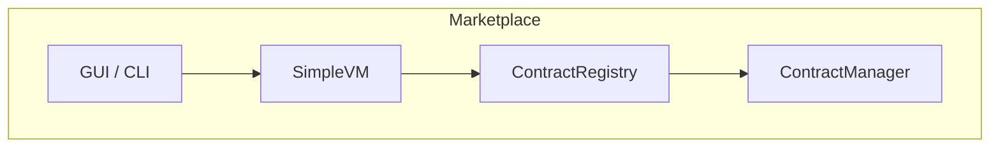

# Smart-Contract Marketplace Architecture

The Stage 34 marketplace exposes a minimal layer for publishing and trading
WebAssembly contracts.  It reuses the existing contract registry and virtual
machine so uploaded bytecode executes with the same determinism and gas
accounting as other modules.

* **GUI / CLI** – Front-ends invoke the `marketplace` CLI command which in turn
  calls the marketplace module.
* **SimpleVM** – Executes contract code and enforces opcode and gas limits.
* **ContractRegistry** – Stores deployed contracts and exposes invocation
  methods.
* **ContractManager** – Handles ownership transfers when contracts are traded.

The marketplace does not introduce new consensus rules; ownership changes are
recorded through existing transactions ensuring compatibility with wallets and
other network services.
