# Synnergy Network Function Web

This document provides a high-level function web for the Synnergy network, outlining major modules and their core functions. Stage 8 expands cross-chain registries and bridge managers with CLI access and gas‑priced opcodes. Stage 9 adds governance primitives, custodial nodes and cross-consensus network management. Stage 14 introduces a unified `internal/nodes` package with light, watchtower and logistics implementations. Stage 15 extends this package with forensic, geospatial, historical and holographic nodes for richer diagnostics and data distribution.
Stage 17 standardises token contracts for CBDCs, pausable utility assets and
gaming items, all backed by the thread-safe base token and accessible through
the CLI. Stage 18 adds investor share registries, insurance policies, forex
pairs, fiat-pegged currencies, index funds, charity campaigns and legal document
tokens with validation and CLI-driven deactivation.
Stage 19 introduces the SYN1000 reserve-backed stablecoin and index manager with precise gas-priced opcodes and CLI integration.
Stage 20 adds dividend, convertible, governance, capped supply, vesting,
loyalty and multi-chain token modules, all wired into the function web and
available through the CLI and VM. Stage 22 unifies AI contract and audit log
commands with JSON output so dashboards and automated agents can interact with
the network through a consistent CLI surface.
Stage 23 brings gas-aware consensus and DAO governance commands into the
function web, enabling user interfaces to display the cost of mining blocks or
managing proposals directly alongside execution results.
Stage 24 extends cross-chain and Plasma management. The CLI now exposes bridge
registration, connection tracking and gas-priced transfer operations that UIs
can invoke for inter-network workflows.
Stage 25 finalises node operations. Full, light, mining, mobile, optimisation,
staking, watchtower and warfare nodes offer JSON emitting commands allowing the
function web and external dashboards to orchestrate infrastructure with defined
gas costs.
Stage 26 extends operational visibility with gas table controls. Operators can
adjust opcode pricing on the fly and export the entire schedule as JSON,
enabling governance portals and monitoring systems to consume pricing data
directly from the CLI.
Stage 27 layers in automation scripts for devnets and testnets, contract deployment helpers and quality gates, letting dashboards orchestrate network lifecycles through the CLI.
Stage 28 adds release packaging, documentation generation, CI preparation and ledger backup tooling so user interfaces can trigger builds, publish docs and safeguard chain data via the function web.

Stage 29 introduces smart contract templates accessible through the CLI. Dashboards
can list and deploy precompiled modules such as token faucets, storage markets,
DAO governance systems, NFT minters and AI model exchanges directly from the
function web.
Stage 30 expands this catalog with utility contracts for escrow payments,
cross‑chain bridges, multisig wallets and regulatory compliance workflows,
ensuring dashboards and CLI users can assemble more complex decentralized
applications from vetted building blocks.

## Diagram

```mermaid
graph TD
    subgraph Network
        N[NewNetwork] --> NS[Start]
        N --> NX[Stop]
        N --> NPub[Publish]
        N --> NSub[Subscribe]
    end
    subgraph BiometricSecurity
        BA[NewBiometricsAuth] --> BE[Enroll]
        BE --> BV[Verify]
        BV --> BR[Remove]
        BSN[NewBiometricSecurityNode] --> BSA[Authenticate]
        BSA --> BSE[SecureExecute]
    end

    subgraph WarfareNode
        WN[NewWarfareNode] --> WC[SecureCommand]
        WC --> WL[TrackLogistics]
        WL --> WT[ShareTactical]
    end

    subgraph Wallet
        NW[NewWallet] --> WS[Sign]
        WS --> WV[VerifySignature]
    end

    subgraph Watchtower
        WTN[NewWatchtowerNode] --> WTS[Start]
        WTS --> WTMetrics[Metrics]
    end

    subgraph GeospatialNode
        GN[NewGeospatialNode] --> GR[Record]
        GR --> GH[History]
    end

    subgraph CrossChain
        CCM[NewCrossChainManager] --> CCR[NewCrossChainRegistry]
        CCM --> CCT[NewCrossChainTxManager]
        CCBTM[NewBridgeTransferManager] --> CCBTD[Deposit]
        CCBTM --> CCBTC[Claim]
        CCBTM --> CCBTGT[GetTransfer]
        CCBTM --> CCBTLT[ListTransfers]
    end

    subgraph Tokens
        TR[NewRegistry] --> BT[NewBaseToken]
        BT --> ST10[NewSYN10Token]
        BT --> ST20[NewSYN20Token]
        BT --> ST70[NewSYN70Token]
    end

    subgraph PrivateTransactions
        PTM[NewPrivateTxManager] --> PTS[Send]
        PTM --> PTL[List]
    end

    subgraph CentralBank
        CBN[NewCentralBankingNode] --> CBM[Mint]
    end

    subgraph Charity
        CP[NewCharityPool] --> CR[Register]
        CP --> CV[Vote]
    end

    subgraph Synchronization
        SM[NewSyncManager] --> SOnce[Once]
        SM --> SStart[Start]
    end

    subgraph Staking
        SN[NewStakingNode] --> SS[Stake]
        SN --> SU[Unstake]
        SN --> SB[Balance]
        SN --> ST[TotalStaked]
    end

    subgraph ZeroTrust
        ZE[NewZeroTrustEngine] --> ZO[OpenChannel]
        ZO --> ZS[Send]
        ZS --> ZR[Receive]
    end

    subgraph Regulatory
        RN[NewRegulatoryNode] --> RA[ApproveTransaction]
        RN --> RF[FlagEntity]
        RN --> RL[Logs]
    end

    subgraph Compliance
        CS[NewComplianceService] --> CK[ValidateKYC]
        CS --> CF[RecordFraud]
        CMG[NewComplianceManager] --> CSu[Suspend]
    end

    subgraph ConnectionPool
        CPoo[NewConnectionPool] --> CA[Acquire]
        CPoo --> CR[Release]
    end

    subgraph VirtualMachine
        VM[NewLightVM] --> VMExec[Execute]
        SMgr[NewSandboxManager] --> SDel[DeleteSandbox]
        SMgr --> SPurge[PurgeInactive]
    end

    subgraph Consensus
        CH[NewConsensusHopper] --> CM[Mode]
        AM[NewAdaptiveManager] --> Adj[Adjust]
        DM[NewDifficultyManager] --> DS[AddSample]
        CSvc[NewConsensusService] --> CSStart[Start]
        VMg[NewValidatorManager] --> VAdd[Add]
        Cmg[NewContractManager] --> CTran[Transfer]
    end

    BiometricSecurity --> Consensus
    WarfareNode --> Consensus
    Wallet --> Consensus
    Watchtower --> Consensus
    GeospatialNode --> CrossChain
    CrossChain --> Consensus
    PrivateTransactions --> Consensus
    Staking --> Consensus
    ZeroTrust --> Compliance
    Regulatory --> CrossChain
    Compliance --> Regulatory
    Compliance --> Consensus
    ConnectionPool --> Consensus
    VirtualMachine --> Consensus
    CentralBank --> Consensus
    Charity --> Consensus
    Synchronization --> Consensus
    Network --> Consensus
```

## Key Relationships

- **BiometricSecurity** functions protect node operations and feed into the overall consensus processes.
- **WarfareNode**, **Watchtower**, and **GeospatialNode** modules provide specialized data and monitoring that flows into consensus and cross-chain operations.
- **CrossChain** functions manage bridging and transaction management across ledgers.
- **PrivateTransactions**, **Staking**, and **Regulatory** modules interact with consensus for secure and compliant network activity.
- **Wallet** functionality signs transactions that ultimately feed into consensus.
- **Network** services provide message propagation and peer discovery feeding
  transactions into the consensus workflow.

This visualization can be rendered using any Mermaid-compatible Markdown viewer.

