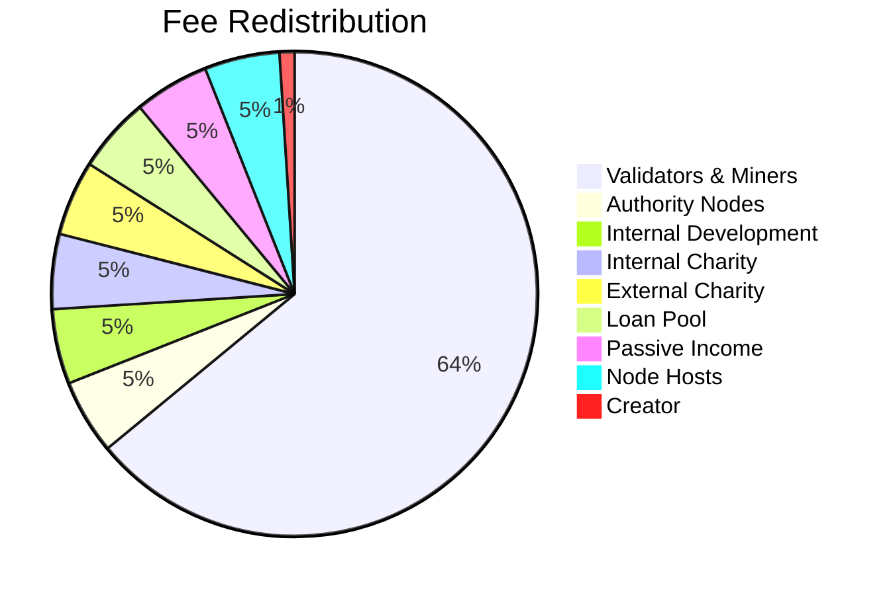

# Tokenomics

*Prepared by Neto Solaris*

## 1. Economic Overview
The Synnergy Network employs a multifaceted economic model that aligns incentives for validators, developers, token holders and the wider community. Its native currency, the Synthron coin (SYN), underpins governance, secures consensus, and fuels on‑chain activity. Purpose‑built token classes extend utility across real‑world assets, stable value instruments, index products, and specialized enterprise use cases.

## 2. Native Currency – Synthron (SYN)
### 2.1 Supply and Emission Schedule
The Synthron coin is capped at a maximum supply of 500 million SYN with an initial genesis allocation of 5 million SYN to the creator’s wallet【F:core/coin.go†L9-L14】. Block rewards begin at 1,252 SYN and halve every 200,000 blocks, producing a deterministic issuance curve that rapidly approaches the cap【F:core/coin.go†L15-L16】【F:configs/network.yaml†L12-L15】.

#### 2.1.1 Emission Forecast
Using the default three‑second block time, each halving epoch spans roughly 6.9 days. The `CirculatingSupply` and `RemainingSupply` helpers allow operators to model supply at any height for treasury and risk analysis【F:core/coin.go†L28-L49】. The table and chart below project the reward schedule and circulating supply across the first seven epochs until the cap is reached.

| Epoch | Approx. day | Reward per block (SYN) | Coins minted in epoch (M SYN) | Cumulative supply (M SYN) |
|------:|------------:|-----------------------:|------------------------------:|--------------------------:|
| 1 | 6.9 | 1,252.00 | 250.40 | 255.40 |
| 2 | 13.9 | 626.00 | 125.20 | 380.60 |
| 3 | 20.8 | 313.00 | 62.60 | 443.20 |
| 4 | 27.8 | 156.50 | 31.30 | 474.50 |
| 5 | 34.7 | 78.25 | 15.65 | 490.15 |
| 6 | 41.7 | 39.13 | 7.83 | 497.98 |
| 7 | 48.6 | 19.56 | 2.03 | 500.00 |

```mermaid
line
    title Block Reward Halving
    xAxis Epoch
    yAxis Reward per Block (SYN)
    1: 1252
    2: 626
    3: 313
    4: 156.5
    5: 78.25
    6: 39.13
    7: 19.56
```

```mermaid
line
    title Cumulative Supply (M SYN)
    xAxis Epoch
    yAxis Supply
    0: 5
    1: 255.4
    2: 380.6
    3: 443.2
    4: 474.5
    5: 490.15
    6: 497.98
    7: 500
```

### 2.2 Staking and Treasury Flows
Validators must meet a minimum stake derived from network volatility and participation rates. `AlphaFactor` and `MinimumStake` compute required collateral, while `LockupDuration` aligns reward boosts to longer commitments, ensuring long‑term alignment between validators and network health【F:core/coin.go†L57-L80】. Treasury holdings are invested conservatively and returns are recycled into staking rewards proportional to lock duration.【F:Synnergy_Network_Future_Of_Blockchan.md†L678-L688】

### 2.3 Stability Mechanisms
A stabilization module maintains a reserve of diversified assets. If SYN’s market price deviates beyond ±5% over a week, the module mints or burns SYN against the reserve to restore parity, with governance retaining the ability to adjust parameters or replenish collateral【F:Synnergy_Network_Future_Of_Blockchan.md†L691-L694】.

### 2.4 Slashing and Penalty Controls
Misbehaving validators face stake reductions and recorded penalties. The stake penalty manager adjusts validator balances and logs infractions with timestamps, enabling transparent slashing and rehabilitative policies【F:stake_penalty.go†L8-L53】.

## 3. Transaction Fee Economy
### 3.1 Fee Calculation Pipeline
Transaction fees comprise three components—base, variable and priority—and are computed as:

`F_total = F_base + F_variable + F_priority`

- **Base fee**: `CalculateBaseFee` takes the median of the most recent 1,000 block fees and multiplies it by a load adjustment factor so base charges track network congestion【F:core/fees.go†L28-L45】.
- **Variable fee**: `CalculateVariableFee` multiplies resource units (gas, calls or computation) by the per‑unit gas price, capturing workload intensity【F:core/fees.go†L48-L50】.
- **Priority fee**: `CalculatePriorityFee` passes through an optional user tip to incentivise faster inclusion【F:core/fees.go†L53-L54】.

Specialised helpers such as `FeeForTransfer`, `FeeForPurchase`, `FeeForTokenUsage`, `FeeForContract` and `FeeForWalletVerification` combine these elements for different transaction classes【F:core/fees.go†L56-L88】. Verified zero‑fee transfers bypass charges through `FeeForValidatedTransfer`, enabling promotional or subsidy campaigns when flagged as eligible【F:core/fees.go†L91-L99】.

Enterprise fee governance is enforced by a global `FeePolicy`; `ApplyFeeCapFloor` clamps charges within configured ceilings and floors, while `Enforce` documents any adjustment for audit trails【F:core/fees.go†L131-L158】. Dynamic load is accounted for by `AdjustFeeRates`, which scales base and variable rates proportionally to observed utilisation【F:core/fees.go†L160-L169】. The validator reward pool further adjusts ±10% based on block utilisation to discourage underfilled or congested blocks【F:core/fees.go†L240-L254】.

### 3.2 Fee Redistribution Framework
Transaction fees are redistributed in real time to sustain the ecosystem and reward contributors. The allocation model is as follows:

| Allocation Target | Share of Fees |
|-------------------|---------------|
| Internal development | 5% |
| Internal charity | 5% |
| External charity | 5% |
| Loan pool for startups and SMEs | 5% |
| Passive income for token holders | 5% |
| Validators and miners | 64% |
| Authority node incentives | 5% |
| Node host incentives | 5% |
| Creator wallet | 1% |



This structure balances infrastructure investment, social impact, and operational incentives【F:core/fees.go†L115-L127】. For bespoke accounting, `ShareProportional` can further split any fee pot across weighted addresses with deterministic remainder handling, and `FeeDistributionContract` credits those shares to the ledger for transparent settlement【F:core/fees.go†L194-L238】.

### 3.3 Genesis Wallet Architecture
At network launch, dedicated wallets are created to manage these allocations, including genesis rewards, development funds, internal and external charity wallets, loan pool reserves, holder reward pools, node host distributions, and creator funds. Each wallet operates under transparent governance with periodic reporting to the community, and addresses are deterministically derived from hashed labels to facilitate independent auditing【F:docs/Whitepaper_detailed/guide/transaction_guide.md†L817-L838】【F:core/genesis_wallets.go†L8-L41】.

### 3.4 Gas Pricing Model
Opcode execution costs are enumerated in a dynamically loaded gas table. Default pricing keeps experimental opcodes affordable while explicit entries cover bridges, governance operations, node management, and compliance queries so enterprises can predict transaction expenses【F:gas_table.go†L18-L36】.

## 4. Token Classes
### 4.1 Tangible and Real‑World Assets
The platform supports tokenisation of physical goods and commodities:
- **SYN130** – tracks ownership, valuation, leasing and sale history for tangible assets【F:core/token_syn130.go†L8-L31】.
- **SYN800** – registers physical assets with geolocation, certification and valuation metadata【F:core/syn800_token.go†L8-L37】.
- **SYN4900** – models agricultural commodities with harvest data, status tracking and provenance records【F:core/token_syn4900.go†L8-L31】.

### 4.2 Intangible Assets
- **SYN131** – encapsulates non‑physical property such as patents or copyrights with updatable valuations and ownership records【F:core/syn131_token.go†L5-L46】.

### 4.3 Event and Access Tokens
- **SYN1700** – issues, transfers and verifies digital tickets for events while enforcing supply caps and ownership checks【F:core/syn1700_token.go†L8-L70】.

### 4.4 Security and Compliance Tokens
- **SYN223** – implements whitelist and blacklist controls to meet regulatory requirements for restricted transfers【F:core/syn223_token.go†L8-L56】.

### 4.5 Governance and DAO Tokens
- **SYN300** – governance token enabling delegation, proposal submission and on‑chain voting with quorum enforcement【F:core/syn300_token.go†L9-L133】.
- **SYN2500** – DAO membership registry managing voting power and metadata for each participant【F:core/syn2500_token.go†L8-L54】.
- **DAOTokenLedger** – generic ledger supporting mint, transfer and burn operations for membership tokens【F:core/dao_token.go†L8-L43】.

### 4.6 Stable and Index Tokens
- **SYN3500** – currency‑style token with adjustable fiat exchange rates and mint/redeem operations suited for stable‑value instruments【F:core/syn3500_token.go†L8-L33】.
- **SYN3700** – aggregates multiple assets into an index token whose weighted value can be computed from external price feeds, enabling diversified exposure products【F:core/syn3700_token.go†L8-L32】.

### 4.7 Charity and Social Impact Tokens
- **SYN4200** – manages donation campaigns, tracking contributions and progress toward charitable goals【F:core/syn4200_token.go†L8-L49】.

### 4.8 Specialized Enterprise Tokens
- **SYN500** – service-tier utility token granting quota-based access and enforcing per-address usage caps via `Grant` and `Use` methods【F:core/syn500.go†L5-L43】.
- **SYN700** – intellectual-property tokenization framework with license issuance and royalty tracking in an on-chain registry【F:core/syn700.go†L8-L80】.
- **SYN1600** – music-rights token managing collaborator shares and proportional royalty distributions【F:core/syn1600.go†L8-L70】.
- **SYN1300** – supply-chain asset registry recording location and status events for end-to-end traceability【F:core/syn1300.go†L8-L56】.
- **SYN1401** – investment instrument accruing interest over time and redeemable upon maturity【F:core/syn1401.go†L8-L74】.
- **SYN2100** – trade-finance token registering invoices and marking financing status through a document and liquidity manager【F:core/syn2100.go†L10-L62】.
- **SYN2700** – vesting schedule construct releasing locked balances as milestones mature【F:core/syn2700.go†L5-L44】.
- **SYN2900** – insurance-policy token validating active coverage and processing claims for predefined payouts【F:core/syn2900.go†L8-L49】.
- **SYN3200** – bill-management token tracking invoices, payments and adjustments within a dedicated registry【F:core/syn3200.go†L8-L78】.
- **SYN3600** – futures-contract token settling profit or loss for long positions at expiration【F:core/syn3600.go†L9-L43】.
- **SYN3800** – grant-disbursement token logging beneficiary allocations and release history【F:core/syn3800.go†L8-L80】.
- **SYN3900** – government-benefit token ensuring one-time claims and preventing duplicate disbursements【F:core/syn3900.go†L8-L64】.
- **SYN4700** – legal-document token capturing parties, signatures, dispute actions and status transitions【F:core/syn4700.go†L9-L146】.
- **SYN5000** – gambling token facilitating bet placement, resolution and auditable payout records【F:core/syn5000.go†L8-L76】.

## 5. Staking and Governance
Token staking secures consensus and grants governance rights. The staking module tracks individual balances, supports lock‑ups, and reports aggregate totals for policy decisions or validator eligibility【F:core/staking_node.go†L5-L28】.

## 6. Ecosystem Support Systems
### 6.1 Loan Pool for SMEs
A community-governed loan pool allocates treasury capital to proposals voted on by stakeholders. Proposals undergo submission, voting and timed evaluation before approved disbursements reduce the pool’s balance【F:core/loanpool.go†L9-L75】.

### 6.2 Faucet for Developer Onboarding
A rate-limited faucet dispenses small SYN amounts with configurable cooldowns, enabling test network access while preventing abuse【F:faucet.go†L9-L53】.

### 6.3 Cross-Chain Liquidity
The cross-chain manager registers bridges and authorized relayers to move assets between networks, expanding liquidity and interoperability for enterprise deployments【F:cross_chain.go†L10-L88】.

## 7. Compliance and Enterprise Integration
A regulatory manager evaluates transactions against jurisdiction-specific rules and maximum thresholds, ensuring token flows respect policy constraints and remain auditable for institutional participants【F:regulatory_management.go†L8-L75】.

## 8. Economic Incentives and Sustainability
The combination of capped supply, deflationary issuance, fee redistribution, and real‑world asset integration establishes a resilient economic base. Incentives align network security with community growth while earmarked fee flows fund continuous development, charitable outreach, and ecosystem innovation.

## 9. Conclusion
Neto Solaris has engineered the Synnergy Network’s tokenomics to merge robust economic theory with practical utility. Through disciplined emission schedules, transparent treasury operations, and diversified token standards, the platform delivers a sustainable foundation for decentralized applications and socially conscious finance.
