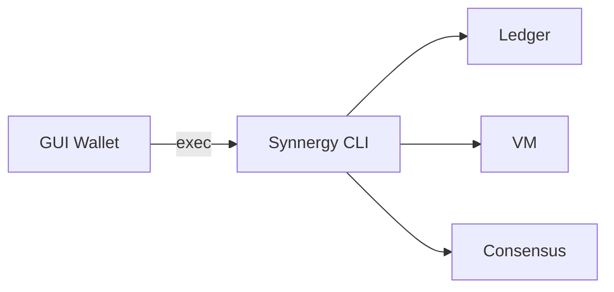

# Wallet Architecture

Stage 31 introduces a thin wallet layer that leverages the existing CLI and
`walletserver` backend. Keys are generated locally within the CLI and can be
exported as encrypted JSON files. The GUI wallet invokes CLI commands via a
restricted interface to ensure private keys never leave the host machine.

The wallet uses scrypt key derivation and AES‑GCM encryption to protect private
keys at rest. All operations emit JSON for deterministic parsing in user
interfaces and automated agents.
